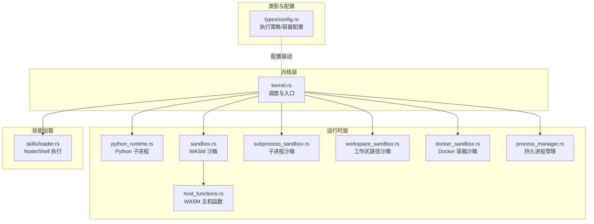
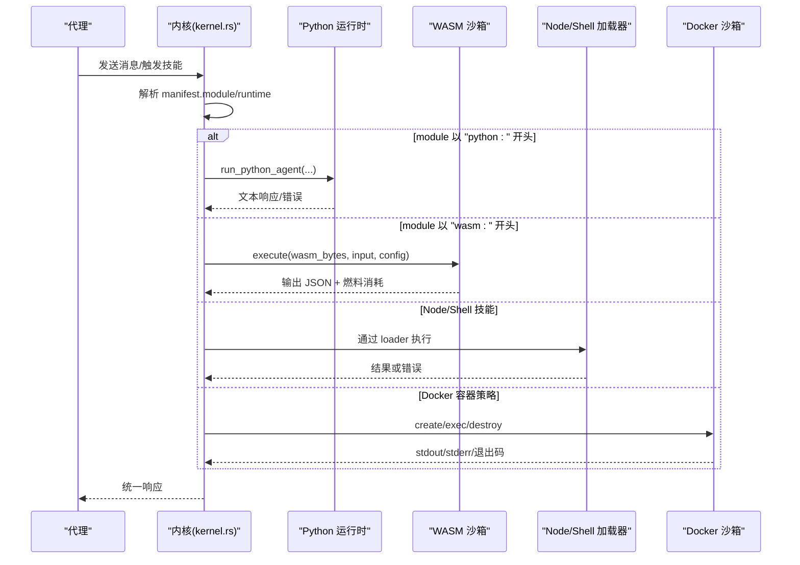
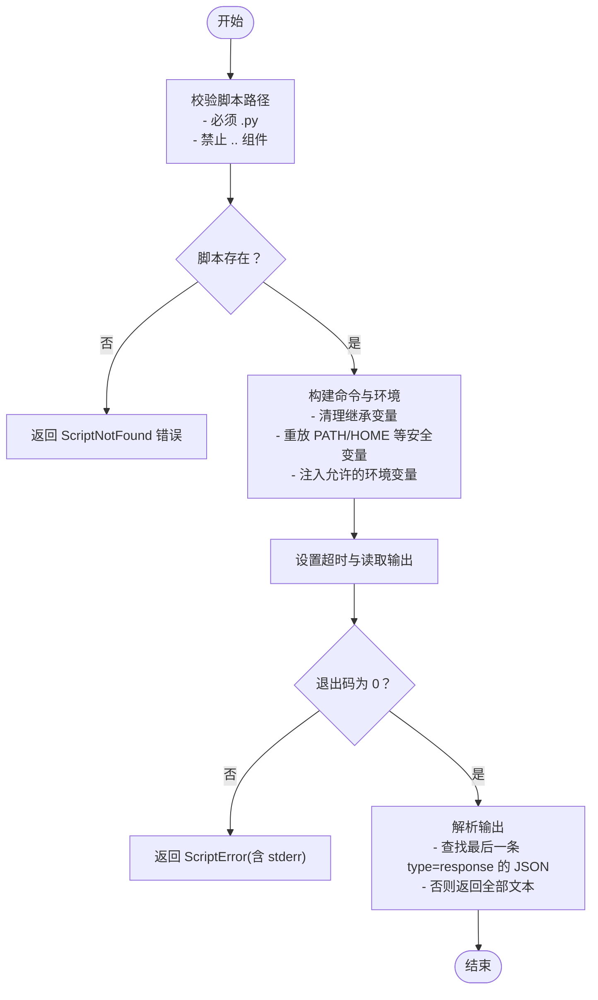
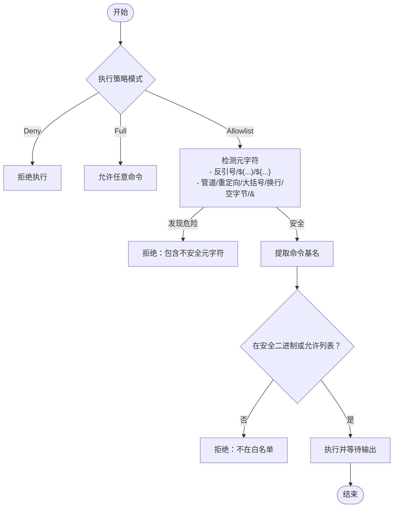
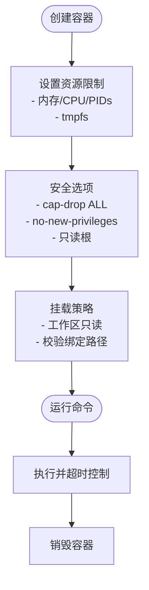
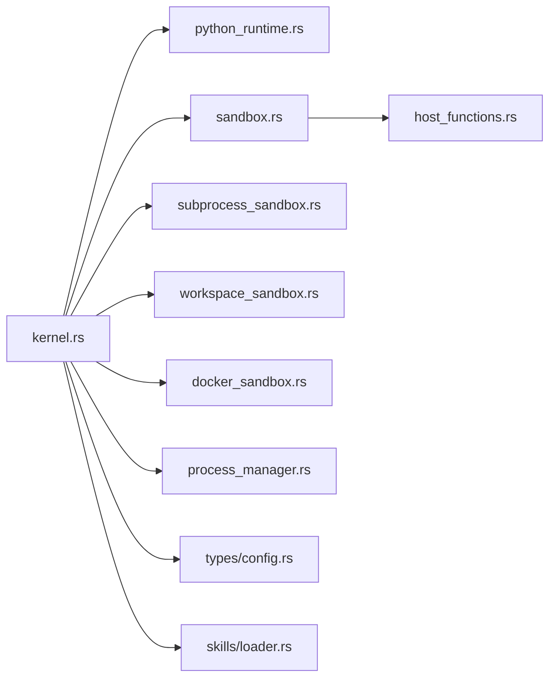

# 运行时实现

<cite>
**本文引用的文件**
- [crates/openfang-runtime/src/lib.rs](file://crates/openfang-runtime/src/lib.rs)
- [crates/openfang-runtime/src/sandbox.rs](file://crates/openfang-runtime/src/sandbox.rs)
- [crates/openfang-runtime/src/host_functions.rs](file://crates/openfang-runtime/src/host_functions.rs)
- [crates/openfang-runtime/src/python_runtime.rs](file://crates/openfang-runtime/src/python_runtime.rs)
- [crates/openfang-runtime/src/subprocess_sandbox.rs](file://crates/openfang-runtime/src/subprocess_sandbox.rs)
- [crates/openfang-runtime/src/workspace_sandbox.rs](file://crates/openfang-runtime/src/workspace_sandbox.rs)
- [crates/openfang-runtime/src/docker_sandbox.rs](file://crates/openfang-runtime/src/docker_sandbox.rs)
- [crates/openfang-runtime/src/process_manager.rs](file://crates/openfang-runtime/src/process_manager.rs)
- [crates/openfang-types/src/config.rs](file://crates/openfang-types/src/config.rs)
- [crates/openfang-kernel/src/kernel.rs](file://crates/openfang-kernel/src/kernel.rs)
- [crates/openfang-skills/src/loader.rs](file://crates/openfang-skills/src/loader.rs)
- [openfang.toml.example](file://openfang.toml.example)
</cite>

## 目录
1. [简介](#简介)
2. [项目结构](#项目结构)
3. [核心组件](#核心组件)
4. [架构总览](#架构总览)
5. [详细组件分析](#详细组件分析)
6. [依赖关系分析](#依赖关系分析)
7. [性能考量](#性能考量)
8. [故障排除指南](#故障排除指南)
9. [结论](#结论)
10. [附录](#附录)

## 简介
本文件系统化梳理 OpenFang 技能运行时的实现与设计，覆盖五种运行时类型：Python、WASM、Node、Shell、PromptOnly 的技术差异、性能特征与安全边界；详述 WASM 沙箱隔离、子进程与容器沙箱、资源限制与执行环境配置；并提供运行时选择指南、性能对比与安全建议、开发模板与调试排障方法。

## 项目结构
OpenFang 将“运行时”能力集中在 crates/openfang-runtime 中，围绕内核调度器（kernel）按模块类型分发执行，并通过统一的类型与配置体系（openfang-types）进行策略控制。



**图示来源**
- [crates/openfang-kernel/src/kernel.rs](file://crates/openfang-kernel/src/kernel.rs)
- [crates/openfang-runtime/src/python_runtime.rs](file://crates/openfang-runtime/src/python_runtime.rs)
- [crates/openfang-runtime/src/sandbox.rs](file://crates/openfang-runtime/src/sandbox.rs)
- [crates/openfang-runtime/src/host_functions.rs](file://crates/openfang-runtime/src/host_functions.rs)
- [crates/openfang-runtime/src/subprocess_sandbox.rs](file://crates/openfang-runtime/src/subprocess_sandbox.rs)
- [crates/openfang-runtime/src/workspace_sandbox.rs](file://crates/openfang-runtime/src/workspace_sandbox.rs)
- [crates/openfang-runtime/src/docker_sandbox.rs](file://crates/openfang-runtime/src/docker_sandbox.rs)
- [crates/openfang-runtime/src/process_manager.rs](file://crates/openfang-runtime/src/process_manager.rs)
- [crates/openfang-types/src/config.rs](file://crates/openfang-types/src/config.rs)
- [crates/openfang-skills/src/loader.rs](file://crates/openfang-skills/src/loader.rs)

**章节来源**
- [crates/openfang-runtime/src/lib.rs](file://crates/openfang-runtime/src/lib.rs)
- [crates/openfang-kernel/src/kernel.rs](file://crates/openfang-kernel/src/kernel.rs)

## 核心组件
- Python 子进程运行时：以标准 JSON 协议与宿主交互，严格清理继承环境，仅允许白名单变量与受限工作目录，支持超时与退出码校验。
- WASM 沙箱：基于 Wasmtime，启用燃料（CPU）与纪元中断（墙钟）双重计量，禁止 WASI，通过“openfang”模块的主机函数实现能力检查。
- Node/Shell 技能运行时：通过子进程沙箱隔离环境变量，对可执行路径与命令进行安全校验，支持策略化的执行模式（禁用/全开/白名单）。
- Docker 容器沙箱：在 OS 层提供更强隔离，设置内存/CPU/PIDs 限制、只读根文件系统、网络隔离、能力降级与 tmpfs 挂载。
- 工作区路径沙箱：拒绝路径穿越与符号链接逃逸，确保文件操作局限于工作区。
- 持久进程管理：长驻子进程会话，支持写入 stdin、读取 stdout/stderr、树杀与配额限制。

**章节来源**
- [crates/openfang-runtime/src/python_runtime.rs](file://crates/openfang-runtime/src/python_runtime.rs)
- [crates/openfang-runtime/src/sandbox.rs](file://crates/openfang-runtime/src/sandbox.rs)
- [crates/openfang-runtime/src/host_functions.rs](file://crates/openfang-runtime/src/host_functions.rs)
- [crates/openfang-runtime/src/subprocess_sandbox.rs](file://crates/openfang-runtime/src/subprocess_sandbox.rs)
- [crates/openfang-runtime/src/docker_sandbox.rs](file://crates/openfang-runtime/src/docker_sandbox.rs)
- [crates/openfang-runtime/src/workspace_sandbox.rs](file://crates/openfang-runtime/src/workspace_sandbox.rs)
- [crates/openfang-runtime/src/process_manager.rs](file://crates/openfang-runtime/src/process_manager.rs)

## 架构总览
下图展示内核如何根据代理清单中的 runtime/module 字段选择具体运行时，并注入能力与资源限制。



**图示来源**
- [crates/openfang-kernel/src/kernel.rs](file://crates/openfang-kernel/src/kernel.rs)
- [crates/openfang-runtime/src/python_runtime.rs](file://crates/openfang-runtime/src/python_runtime.rs)
- [crates/openfang-runtime/src/sandbox.rs](file://crates/openfang-runtime/src/sandbox.rs)
- [crates/openfang-skills/src/loader.rs](file://crates/openfang-skills/src/loader.rs)
- [crates/openfang-runtime/src/docker_sandbox.rs](file://crates/openfang-runtime/src/docker_sandbox.rs)

## 详细组件分析

### Python 子进程运行时
- 协议与输入输出：通过 stdin 发送 JSON，stdout 逐行输出，最后一条带 "type":"response" 的 JSON 表示最终结果；若无 JSON 则返回全部文本。
- 环境隔离：启动前清空继承环境，仅重放 PATH/HOME 等必要变量，以及从清单中允许的环境变量白名单。
- 资源与安全：脚本路径校验（拒绝路径穿越与非 .py 后缀），超时控制，退出码检查，错误分类（脚本不存在、解释器不可用、超时、脚本错误等）。
- 默认配置：默认解释器自动探测，超时 120 秒，工作目录可选，允许的环境变量列表可配置。



**图示来源**
- [crates/openfang-runtime/src/python_runtime.rs](file://crates/openfang-runtime/src/python_runtime.rs)

**章节来源**
- [crates/openfang-runtime/src/python_runtime.rs](file://crates/openfang-runtime/src/python_runtime.rs)

### WASM 沙箱运行时
- 引擎与计量：启用燃料（CPU 指令预算）与纪元中断（墙钟超时），默认引擎配置消费燃料与启用纪元中断。
- 客户端 ABI：要求导出 memory/alloc/execute，execute 接收输入字节并返回打包指针+长度的结果。
- 主机 ABI：通过 "openfang" 模块提供 host_call 与 host_log，前者用于能力检查后的系统调用，后者用于日志。
- 能力检查：所有主机调用均需匹配清单授予的能力，未授权直接拒绝；例如文件系统、网络、Shell、环境读取等均需相应能力。
- 超时与耗尽：燃料耗尽抛出 FuelExhausted；墙钟超时由 epoch 中断触发，捕获后转换为超时错误。

```mermaid
sequenceDiagram
participant Guest as "WASM 客户端"
participant Link as "Linker(openfang)"
participant Host as "Host 函数(host_functions)"
participant Kernel as "内核(KernelHandle)"
Guest->>Link : 调用 openfang.host_call(JSON 请求)
Link->>Host : 分发到具体方法(method,params)
Host->>Host : 能力检查(Capability)
Host->>Kernel : 可选跨代理操作
Host-->>Link : 返回 JSON 响应
Link-->>Guest : 写回 guest memory 并返回指针+长度
```

**图示来源**
- [crates/openfang-runtime/src/sandbox.rs](file://crates/openfang-runtime/src/sandbox.rs)
- [crates/openfang-runtime/src/host_functions.rs](file://crates/openfang-runtime/src/host_functions.rs)

**章节来源**
- [crates/openfang-runtime/src/sandbox.rs](file://crates/openfang-runtime/src/sandbox.rs)
- [crates/openfang-runtime/src/host_functions.rs](file://crates/openfang-runtime/src/host_functions.rs)

### Node/Shell 技能运行时
- Node 执行：通过 stdin 将工具名与输入 JSON 发送给 Node 脚本，等待标准输出的 JSON 或纯文本结果。
- Shell 执行：使用系统 shell（bash/sh）执行脚本，同样进行环境隔离与路径/命令安全校验。
- 子进程沙箱：统一清理环境变量，仅重放安全变量与允许列表；对可执行路径进行父目录组件拒绝；命令层面阻断反引号、$()、${}、管道、重定向、大括号扩展、换行、空字节、后台执行等危险元字符。
- 执行策略：支持三种模式（禁用/全开/白名单），白名单模式下进一步提取命令基名并校验是否在安全二进制或允许列表中。



**图示来源**
- [crates/openfang-skills/src/loader.rs](file://crates/openfang-skills/src/loader.rs)
- [crates/openfang-runtime/src/subprocess_sandbox.rs](file://crates/openfang-runtime/src/subprocess_sandbox.rs)
- [crates/openfang-types/src/config.rs](file://crates/openfang-types/src/config.rs)

**章节来源**
- [crates/openfang-skills/src/loader.rs](file://crates/openfang-skills/src/loader.rs)
- [crates/openfang-runtime/src/subprocess_sandbox.rs](file://crates/openfang-runtime/src/subprocess_sandbox.rs)
- [crates/openfang-types/src/config.rs](file://crates/openfang-types/src/config.rs)

### Docker 容器沙箱
- 容器生命周期：创建（--memory/--cpus/--pids-limit、--cap-drop ALL、--security-opt no-new-privileges、只读根、网络隔离、tmpfs、工作区只读挂载）、执行（命令校验与超时）、销毁（强制停止）。
- 安全加固：默认丢弃所有能力，仅允许显式配置的 cap_add；只读根文件系统；tmpfs 临时空间；严格的镜像与容器名校验。
- 容器池：按配置哈希复用容器，定期清理闲置/过期容器，降低冷启动成本。
- 绑定挂载校验：阻止敏感路径（/etc、/proc、/sys、/dev、/var/run/docker.sock、/root、/boot）与路径穿越、符号链接逃逸与自定义黑名单。



**图示来源**
- [crates/openfang-runtime/src/docker_sandbox.rs](file://crates/openfang-runtime/src/docker_sandbox.rs)

**章节来源**
- [crates/openfang-runtime/src/docker_sandbox.rs](file://crates/openfang-runtime/src/docker_sandbox.rs)

### 工作区路径沙箱
- 路径解析：拒绝 ".." 组件；相对路径拼接工作区根；绝对路径需经规范化后仍位于工作区；新文件场景对父目录规范化后再拼接文件名。
- 访问控制：任何解析结果若超出工作区根，一律拒绝访问，提示使用 MCP 文件系统工具访问外部文件。

**章节来源**
- [crates/openfang-runtime/src/workspace_sandbox.rs](file://crates/openfang-runtime/src/workspace_sandbox.rs)

### 持久进程管理
- 会话模型：每个进程拥有独立 stdin/stdout/stderr 缓冲，支持写入数据、读取累积输出、树杀终止、按代理上限与最大存活时间清理。
- 资源约束：通过 per-agent 最大进程数限制防止资源滥用；配合子进程沙箱的超时与树杀保障稳定性。

**章节来源**
- [crates/openfang-runtime/src/process_manager.rs](file://crates/openfang-runtime/src/process_manager.rs)

## 依赖关系分析
- 内核依赖运行时模块：根据 manifest.module 前缀路由到对应运行时；WASM 依赖 host_functions 提供能力检查；Node/Shell 依赖 subprocess_sandbox 与 types/config 的执行策略。
- 运行时依赖类型与配置：执行策略（ExecPolicy）、容器配置（DockerSandboxConfig）、终止原因（TerminationReason）等由 openfang-types 提供。
- 外部集成点：Docker 命令行工具；系统 shell（bash/sh）；Node.js 运行时。



**图示来源**
- [crates/openfang-kernel/src/kernel.rs](file://crates/openfang-kernel/src/kernel.rs)
- [crates/openfang-runtime/src/python_runtime.rs](file://crates/openfang-runtime/src/python_runtime.rs)
- [crates/openfang-runtime/src/sandbox.rs](file://crates/openfang-runtime/src/sandbox.rs)
- [crates/openfang-runtime/src/host_functions.rs](file://crates/openfang-runtime/src/host_functions.rs)
- [crates/openfang-runtime/src/subprocess_sandbox.rs](file://crates/openfang-runtime/src/subprocess_sandbox.rs)
- [crates/openfang-runtime/src/workspace_sandbox.rs](file://crates/openfang-runtime/src/workspace_sandbox.rs)
- [crates/openfang-runtime/src/docker_sandbox.rs](file://crates/openfang-runtime/src/docker_sandbox.rs)
- [crates/openfang-runtime/src/process_manager.rs](file://crates/openfang-runtime/src/process_manager.rs)
- [crates/openfang-types/src/config.rs](file://crates/openfang-types/src/config.rs)
- [crates/openfang-skills/src/loader.rs](file://crates/openfang-skills/src/loader.rs)

**章节来源**
- [crates/openfang-kernel/src/kernel.rs](file://crates/openfang-kernel/src/kernel.rs)
- [crates/openfang-types/src/config.rs](file://crates/openfang-types/src/config.rs)

## 性能考量
- Python
  - 子进程冷启动开销较高；建议结合持久进程管理减少频繁启动。
  - I/O 读取采用逐行缓冲，注意大输出截断与超时设置。
- WASM
  - 使用燃料与纪元中断双重计量，避免无限循环与长时间占用；建议为 CPU 密集型任务设置合理 fuel_limit 与 timeout_secs。
  - 在阻塞线程上执行，避免与 Tokio 事件循环竞争。
- Node/Shell
  - 元字符检测与命令提取带来额外开销，但显著提升安全性；白名单模式下可提前拒绝高风险命令。
  - 超时与无输出空闲超时组合，防止僵尸进程与资源泄漏。
- Docker
  - 容器冷启动成本高，适合长时任务或需要强隔离的场景；容器池复用可降低延迟。
  - 资源限制（内存/CPU/PIDs）直接影响吞吐与稳定性，需结合业务负载调整。

[本节为通用指导，无需特定文件引用]

## 故障排除指南
- Python
  - 症状：脚本不存在/路径非法
    - 排查：确认脚本路径无父目录组件、后缀为 .py、文件存在
  - 症状：解释器不可用
    - 排查：检查 python3/python 是否可用，或显式指定 interpreter
  - 症状：超时/退出码非 0
    - 排查：查看 stderr，调整 timeout_secs；检查脚本逻辑
- WASM
  - 症状：燃料耗尽
    - 排查：提高 fuel_limit 或优化算法
  - 症状：墙钟超时
    - 排查：缩短 timeout_secs 或拆分任务
  - 症状：能力拒绝
    - 排查：在清单中添加相应 Capability
- Node/Shell
  - 症状：命令被拒绝
    - 排查：检查 exec_policy 模式与安全二进制/允许列表；移除元字符
  - 症状：路径非法
    - 排查：避免父目录组件与绝对路径越权
- Docker
  - 症状：容器创建失败
    - 排查：镜像名合法性、Docker 可用性、权限与网络配置
  - 症状：命令注入阻断
    - 排查：移除反引号、$()、管道、重定向等元字符
- 持久进程
  - 症状：进程过多/僵尸
    - 排查：检查 per-agent 上限与最大存活时间，启用自动清理

**章节来源**
- [crates/openfang-runtime/src/python_runtime.rs](file://crates/openfang-runtime/src/python_runtime.rs)
- [crates/openfang-runtime/src/sandbox.rs](file://crates/openfang-runtime/src/sandbox.rs)
- [crates/openfang-runtime/src/subprocess_sandbox.rs](file://crates/openfang-runtime/src/subprocess_sandbox.rs)
- [crates/openfang-runtime/src/docker_sandbox.rs](file://crates/openfang-runtime/src/docker_sandbox.rs)
- [crates/openfang-runtime/src/process_manager.rs](file://crates/openfang-runtime/src/process_manager.rs)

## 结论
OpenFang 的运行时体系以“最小暴露面、能力驱动、多层隔离”为核心原则：WASM 提供语言无关的沙箱与能力检查；Python/Node/Shell 通过子进程沙箱与执行策略实现安全可控；Docker 提供 OS 级隔离；工作区路径沙箱与持久进程管理完善了文件系统与资源治理。根据任务特性选择合适运行时，并结合配置与监控，可在安全性与性能之间取得平衡。

[本节为总结性内容，无需特定文件引用]

## 附录

### 运行时选择指南
- 优先选择 WASM：需要语言无关、可移植、强隔离且具备能力检查的技能。
- 选择 Python：已有成熟 Python 生态，需要与 Python SDK 协同，注意子进程开销与环境隔离。
- 选择 Node/Shell：需要与系统工具链深度集成，严格控制命令与参数，优先白名单模式。
- 选择 Docker：需要强隔离、资源限制与独立运行环境，适用于复杂或不受信任的第三方二进制。
- PromptOnly：纯提示词驱动，无需执行外部代码，适合轻量逻辑与 LLM 调用。

[本节为概念性指导，无需特定文件引用]

### 配置参考
- 执行策略（ExecPolicy）
  - 模式：deny/allowlist/full
  - 安全二进制：默认包含常用安全命令
  - 超时与输出限制：绝对超时与无输出空闲超时
- Docker 沙箱（DockerSandboxConfig）
  - 资源：内存/CPU/PIDs 限制
  - 安全：能力降级、只读根、网络隔离、tmpfs
  - 绑定挂载：阻止敏感路径与路径穿越

**章节来源**
- [crates/openfang-types/src/config.rs](file://crates/openfang-types/src/config.rs)
- [crates/openfang-runtime/src/docker_sandbox.rs](file://crates/openfang-runtime/src/docker_sandbox.rs)
- [openfang.toml.example](file://openfang.toml.example)