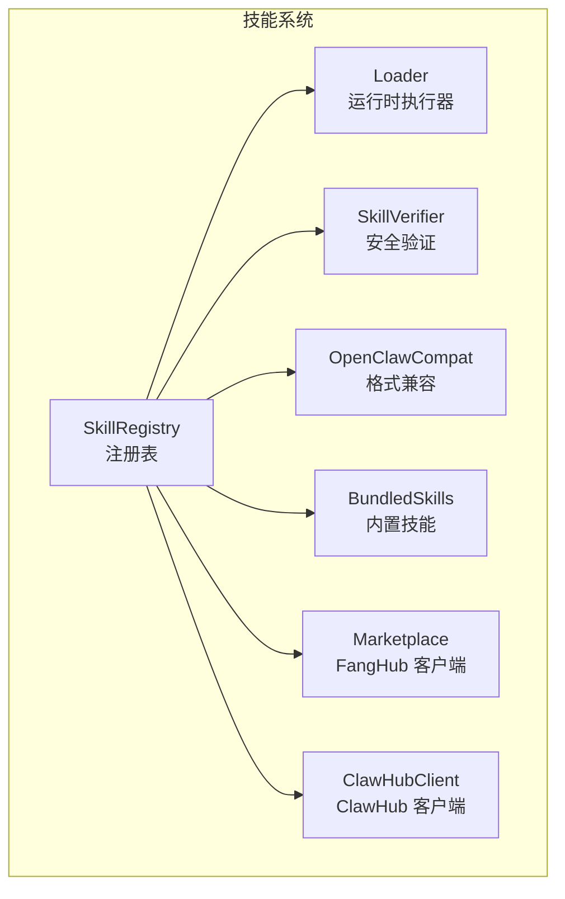
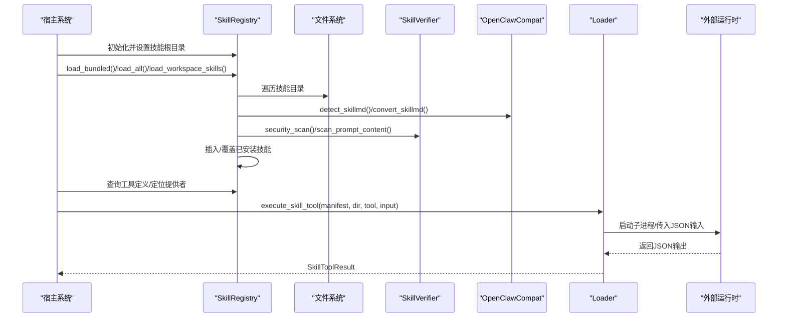
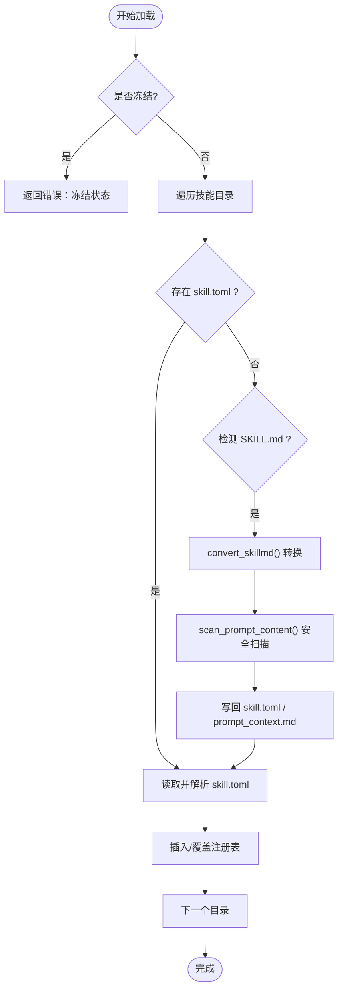
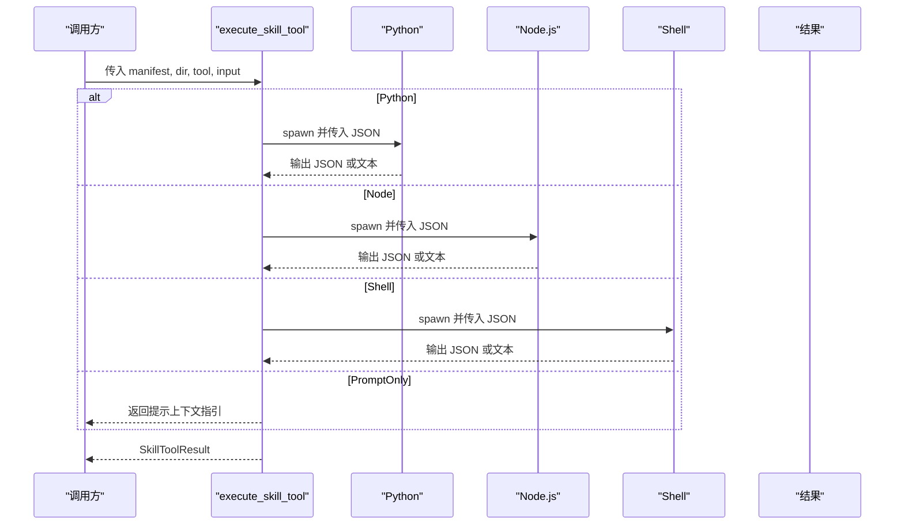
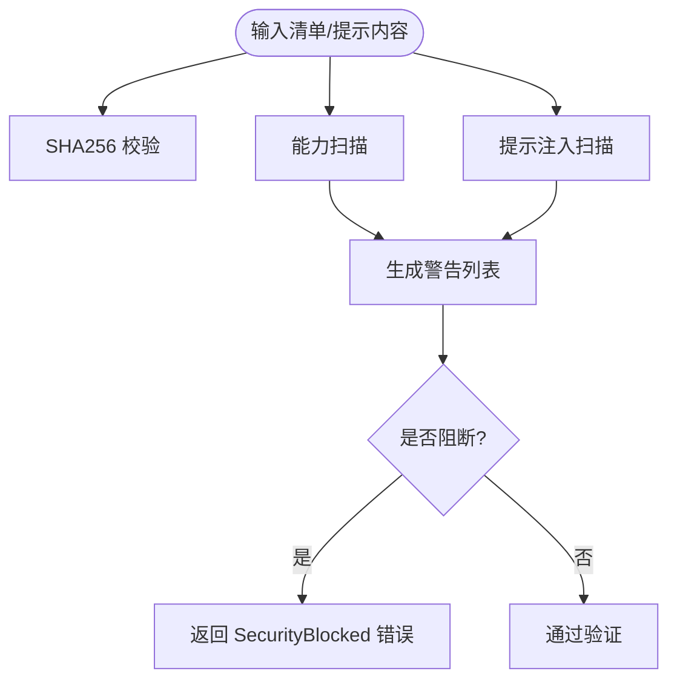
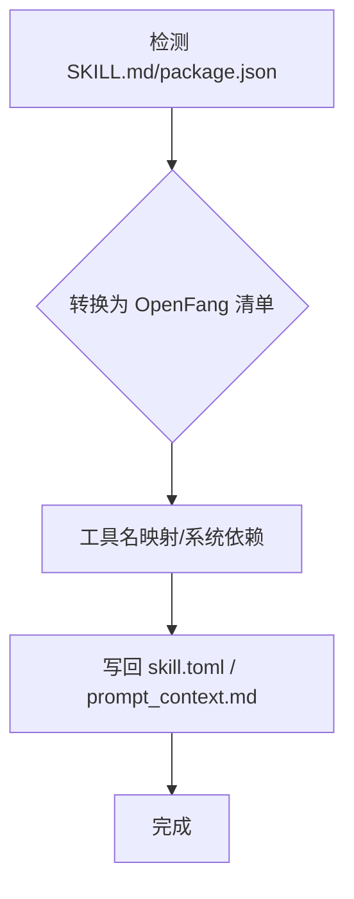
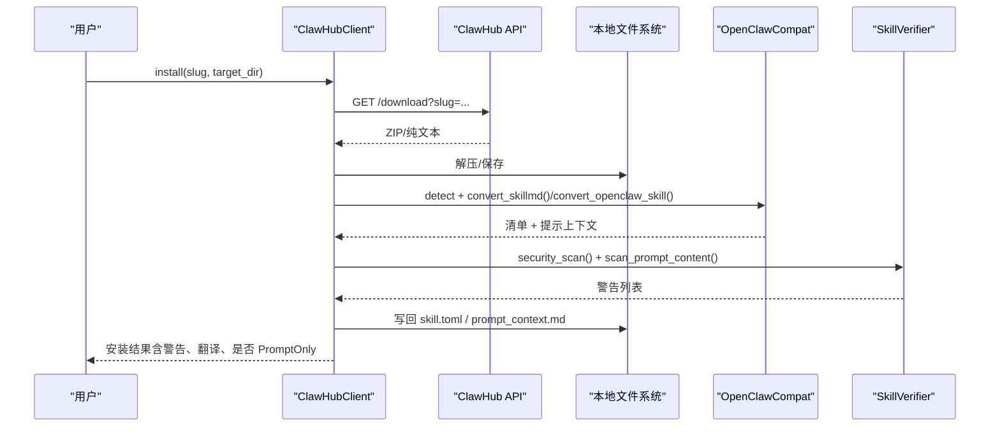
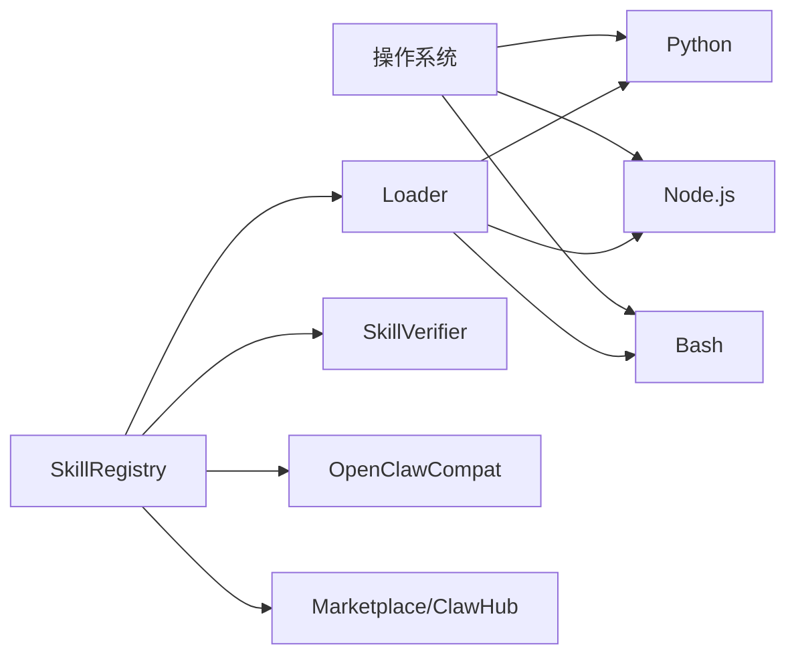

# 技能注册表

<cite>
**本文引用的文件**
- [lib.rs](file://crates/openfang-skills/src/lib.rs)
- [registry.rs](file://crates/openfang-skills/src/registry.rs)
- [loader.rs](file://crates/openfang-skills/src/loader.rs)
- [verify.rs](file://crates/openfang-skills/src/verify.rs)
- [bundled.rs](file://crates/openfang-skills/src/bundled.rs)
- [clawhub.rs](file://crates/openfang-skills/src/clawhub.rs)
- [marketplace.rs](file://crates/openfang-skills/src/marketplace.rs)
- [openclaw_compat.rs](file://crates/openfang-skills/src/openclaw_compat.rs)
- [tool_compat.rs](file://crates/openfang-types/src/tool_compat.rs)
- [tool.rs](file://crates/openfang-types/src/tool.rs)
- [Cargo.toml](file://crates/openfang-skills/Cargo.toml)
- [SKILL.md（github）](file://crates/openfang-skills/bundled/github/SKILL.md)
- [SKILL.md（web-search）](file://crates/openfang-skills/bundled/web-search/SKILL.md)
</cite>

## 目录
1. [简介](#简介)
2. [项目结构](#项目结构)
3. [核心组件](#核心组件)
4. [架构总览](#架构总览)
5. [详细组件分析](#详细组件分析)
6. [依赖关系分析](#依赖关系分析)
7. [性能考量](#性能考量)
8. [故障排查指南](#故障排查指南)
9. [结论](#结论)
10. [附录](#附录)

## 简介
本文件为 OpenFang 技能注册表的详细技术文档，覆盖以下主题：
- 技能发现、加载、验证与缓存机制
- 技能安装流程、版本管理与依赖解析
- 技能目录结构、文件组织规范与权限控制
- 技能启用/禁用、热重载、卸载的实现细节
- 技能来源追踪（Native、Bundled、OpenClaw、ClawHub）与验证机制
- 注册表 API 使用示例、错误处理策略与性能优化建议
- 冲突解决、循环依赖规避与兼容性问题的方案

## 项目结构
openfang-skills 子模块是技能系统的核心，负责：
- 技能清单与注册表管理（发现、加载、查询）
- 运行时执行（Python/Node/Shell/PromptOnly）
- 安全验证（完整性校验、能力扫描、提示注入检测）
- 市场集成（ClawHub 下载安装、OpenClaw 兼容转换）
- 打包内置技能（Bundled）

图表来源
- [registry.rs:11-553](file://crates/openfang-skills/src/registry.rs#L11-L553)
- [loader.rs:1-462](file://crates/openfang-skills/src/loader.rs#L1-L462)
- [verify.rs:1-295](file://crates/openfang-skills/src/verify.rs#L1-L295)
- [openclaw_compat.rs:1-708](file://crates/openfang-skills/src/openclaw_compat.rs#L1-L708)
- [bundled.rs:1-298](file://crates/openfang-skills/src/bundled.rs#L1-L298)
- [marketplace.rs:1-201](file://crates/openfang-skills/src/marketplace.rs#L1-L201)
- [clawhub.rs:1-911](file://crates/openfang-skills/src/clawhub.rs#L1-L911)

章节来源
- [Cargo.toml:1-28](file://crates/openfang-skills/Cargo.toml#L1-L28)

## 核心组件
- 技能清单与来源追踪：支持 Native、Bundled、OpenClaw、ClawHub 四类来源，并在清单中记录来源信息，便于审计与溯源。
- 注册表：维护已安装技能的映射，提供查询、计数、移除等操作；支持工作区覆盖与冻结模式。
- 运行时执行器：根据清单中的运行时类型选择对应执行路径（Python/Node/Shell/PromptOnly），并进行环境隔离与错误处理。
- 安全验证器：提供 SHA256 校验、能力扫描、提示注入扫描，阻断高危风险。
- OpenClaw 兼容层：自动识别并转换 OpenClaw 的 SKILL.md 与 package.json，统一到 OpenFang 清单模型。
- 市场客户端：ClawHub 与 FangHub（GitHub Releases）两类市场，支持搜索、浏览、下载、安装与二次验证。

章节来源
- [lib.rs:18-188](file://crates/openfang-skills/src/lib.rs#L18-L188)
- [registry.rs:11-384](file://crates/openfang-skills/src/registry.rs#L11-L384)
- [loader.rs:9-51](file://crates/openfang-skills/src/loader.rs#L9-L51)
- [verify.rs:26-180](file://crates/openfang-skills/src/verify.rs#L26-L180)
- [openclaw_compat.rs:105-266](file://crates/openfang-skills/src/openclaw_compat.rs#L105-L266)
- [clawhub.rs:237-664](file://crates/openfang-skills/src/clawhub.rs#L237-L664)
- [marketplace.rs:10-168](file://crates/openfang-skills/src/marketplace.rs#L10-L168)

## 架构总览
技能系统围绕“注册表”为中心，通过“发现/加载/验证/执行”的闭环完成从磁盘或网络到运行时的全链路能力。

图表来源
- [registry.rs:56-196](file://crates/openfang-skills/src/registry.rs#L56-L196)
- [openclaw_compat.rs:164-266](file://crates/openfang-skills/src/openclaw_compat.rs#L164-L266)
- [verify.rs:46-103](file://crates/openfang-skills/src/verify.rs#L46-L103)
- [loader.rs:10-51](file://crates/openfang-skills/src/loader.rs#L10-L51)

## 详细组件分析

### 注册表（SkillRegistry）
职责与特性
- 维护 InstalledSkill 映射，键为技能名，值包含清单、路径与启用状态
- 支持三类加载路径：
  - 加载内置技能（Bundled）
  - 从技能根目录批量加载（含 OpenClaw 自动转换）
  - 工作区覆盖加载（优先级高于全局）
- 提供查询接口：按名称获取、列出全部、统计数量、查找工具提供者
- 支持卸载（删除目录并移除注册项）
- 冻结模式：稳定模式下禁止动态加载新技能，防止运行期变更

关键流程
- 加载内置：遍历打包的 SKILL.md，转换为清单并执行提示注入扫描，插入注册表
- 批量加载：遍历目录，若无 skill.toml 则尝试检测并转换 SKILL.md，再写回 skill.toml 并加载
- 工作区加载：同上，但覆盖全局同名技能
- 卸载：删除目录并从注册表移除

图表来源
- [registry.rs:105-196](file://crates/openfang-skills/src/registry.rs#L105-L196)
- [openclaw_compat.rs:164-266](file://crates/openfang-skills/src/openclaw_compat.rs#L164-L266)
- [verify.rs:105-179](file://crates/openfang-skills/src/verify.rs#L105-L179)

章节来源
- [registry.rs:11-384](file://crates/openfang-skills/src/registry.rs#L11-L384)

### 运行时执行器（Loader）
职责与特性
- 根据清单中的运行时类型分派执行：
  - Python：启动 python3/python，隔离环境变量，传入 JSON 输入，解析 stdout/stderr
  - Node：启动 node，隔离环境变量，传入 JSON 输入
  - Shell：启动 bash/sh，隔离环境变量，传入 JSON 输入
  - PromptOnly：直接返回提示上下文引导使用内置工具
- 对不可用运行时给出明确错误（如 WASM、Builtin）
- 对缺失脚本、环境变量异常、子进程失败进行错误封装

图表来源
- [loader.rs:9-51](file://crates/openfang-skills/src/loader.rs#L9-L51)
- [loader.rs:53-403](file://crates/openfang-skills/src/loader.rs#L53-L403)

章节来源
- [loader.rs:1-462](file://crates/openfang-skills/src/loader.rs#L1-L462)

### 安全验证器（SkillVerifier）
职责与特性
- 完整性校验：SHA256 计算与比对
- 能力扫描：识别危险运行时类型与高危能力请求（如 ShellExec、NetConnect(*)）
- 提示注入扫描：针对 SKILL.md 的提示内容进行模式匹配，拦截覆盖系统指令、数据外泄、可疑 Shell 指令等
- 结果分级：Info/Warning/Critical，用于安装决策与告警

图表来源
- [verify.rs:26-180](file://crates/openfang-skills/src/verify.rs#L26-L180)

章节来源
- [verify.rs:1-295](file://crates/openfang-skills/src/verify.rs#L1-L295)

### OpenClaw 兼容层（OpenClawCompat）
职责与特性
- 自动检测并转换两类 OpenClaw 技能：
  - SKILL.md：提取 YAML frontmatter 与正文，生成 OpenFang 清单与提示上下文，同时进行工具名映射与系统依赖标注
  - package.json：推断 Node.js 入口与工具定义，生成 OpenFang 清单
- 写回 OpenFang 格式：生成 skill.toml 与 prompt_context.md
- 工具名映射：将 OpenClaw 工具名标准化为 OpenFang 名称，减少跨平台差异

图表来源
- [openclaw_compat.rs:105-266](file://crates/openfang-skills/src/openclaw_compat.rs#L105-L266)
- [openclaw_compat.rs:357-435](file://crates/openfang-skills/src/openclaw_compat.rs#L357-L435)

章节来源
- [openclaw_compat.rs:1-708](file://crates/openfang-skills/src/openclaw_compat.rs#L1-L708)
- [tool_compat.rs:6-81](file://crates/openfang-types/src/tool_compat.rs#L6-L81)

### 市场客户端（ClawHub 与 FangHub）
职责与特性
- ClawHub：
  - 搜索、浏览、详情、文件获取、下载
  - 安装流程：下载压缩包/ZIP/纯文本，检测格式，转换为 OpenFang 清单，执行安全扫描与提示注入扫描，检查二进制依赖，写回 skill.toml
  - 重试与退避：对 429/5xx 采用指数退避与抖动，尊重 Retry-After
- FangHub（GitHub Releases）：
  - 搜索 GitHub 组织下的仓库，获取最新发布，保存元数据

图表来源
- [clawhub.rs:492-657](file://crates/openfang-skills/src/clawhub.rs#L492-L657)
- [openclaw_compat.rs:164-266](file://crates/openfang-skills/src/openclaw_compat.rs#L164-L266)
- [verify.rs:46-103](file://crates/openfang-skills/src/verify.rs#L46-L103)

章节来源
- [clawhub.rs:1-911](file://crates/openfang-skills/src/clawhub.rs#L1-L911)
- [marketplace.rs:1-201](file://crates/openfang-skills/src/marketplace.rs#L1-L201)

### 内置技能（Bundled）
职责与特性
- 编译期嵌入 60 个 SKILL.md，作为默认可用技能集
- 自动转换为 OpenFang 清单并注入提示上下文
- 注册表加载顺序中优先于用户安装技能，用户同名技能可覆盖

章节来源
- [bundled.rs:9-189](file://crates/openfang-skills/src/bundled.rs#L9-L189)
- [SKILL.md（github）:1-37](file://crates/openfang-skills/bundled/github/SKILL.md#L1-L37)
- [SKILL.md（web-search）:1-39](file://crates/openfang-skills/bundled/web-search/SKILL.md#L1-L39)

## 依赖关系分析
- 类型与工具兼容：通过 openfang-types 提供工具名映射与通用工具定义
- 外部依赖：reqwest（HTTP）、tokio（异步）、sha2/hex（哈希）、zip（解压）、serde 系列（序列化）
- 运行时依赖：Python/Node/Bash 可执行文件（由 Loader 检测）

图表来源
- [loader.rs:258-303](file://crates/openfang-skills/src/loader.rs#L258-L303)
- [Cargo.toml:8-27](file://crates/openfang-skills/Cargo.toml#L8-L27)

章节来源
- [Cargo.toml:1-28](file://crates/openfang-skills/Cargo.toml#L1-L28)

## 性能考量
- 加载阶段
  - 批量扫描目录时避免重复 IO，优先使用一次性读取与缓存
  - 对内置技能采用编译期嵌入，减少磁盘访问
- 执行阶段
  - Python/Node/Shell 以子进程方式隔离，注意进程启动开销；可考虑复用长生命周期进程（需配合安全策略）
  - 对大体积提示上下文进行长度限制与压缩，避免影响 LLM 推理性能
- 网络阶段（ClawHub）
  - 使用指数退避与抖动降低 API 压力，合理设置超时与并发上限
- 缓存与去重
  - 对已安装技能建立快照，避免跨 await 持有锁导致的性能问题（参考注册表快照方法）

## 故障排查指南
常见错误与处理
- 技能未找到：确认技能目录结构与 skill.toml 是否存在；检查是否被工作区覆盖
- 清单无效：检查 skill.toml 语法与字段完整性；OpenClaw 转换失败时检查 SKILL.md 格式
- 运行时不可用：确认 Python/Node/Bash 是否安装且可执行；检查 Loader 的环境隔离是否正确
- 安全阻断：查看警告列表，修复危险能力请求或提示注入模式后重新安装
- 网络错误与限流：ClawHub 返回 429/5xx 时遵循退避策略，稍后再试

章节来源
- [lib.rs:21-46](file://crates/openfang-skills/src/lib.rs#L21-L46)
- [loader.rs:34-50](file://crates/openfang-skills/src/loader.rs#L34-L50)
- [clawhub.rs:276-382](file://crates/openfang-skills/src/clawhub.rs#L276-L382)
- [verify.rs:46-103](file://crates/openfang-skills/src/verify.rs#L46-L103)

## 结论
OpenFang 技能注册表通过“发现—转换—验证—加载—执行”的闭环，实现了对多来源技能的统一管理与安全运行。内置技能提供即开即用体验，ClawHub/FangHub 市场扩展生态，OpenClaw 兼容层打通历史资产。配套的安全验证与严格的来源追踪，确保系统在开放生态下的可控与稳健。

## 附录

### 技能目录结构与文件组织规范
- 技能根目录：每个技能一个子目录，包含 skill.toml 与运行时入口（如 main.py/index.js）
- Prompt-only 技能：可仅包含 SKILL.md，注册表会自动转换并写回 skill.toml 与 prompt_context.md
- OpenClaw 兼容：支持 SKILL.md 与 package.json 两种格式，自动转换为 OpenFang 清单

章节来源
- [registry.rs:105-196](file://crates/openfang-skills/src/registry.rs#L105-L196)
- [openclaw_compat.rs:105-166](file://crates/openfang-skills/src/openclaw_compat.rs#L105-L166)

### 权限控制与安全边界
- 运行时隔离：子进程仅保留必要环境变量（PATH/HOME 等），避免泄露主机密钥
- 能力扫描：阻断 ShellExec、NetConnect(*) 等高危能力请求
- 提示注入扫描：拦截覆盖系统指令、数据外泄、可疑 Shell 指令等模式
- 冻结模式：稳定模式下禁止动态加载，防止运行期注入

章节来源
- [loader.rs:93-115](file://crates/openfang-skills/src/loader.rs#L93-L115)
- [verify.rs:45-103](file://crates/openfang-skills/src/verify.rs#L45-L103)
- [registry.rs:44-54](file://crates/openfang-skills/src/registry.rs#L44-L54)

### 版本管理与依赖解析
- 版本字段：skill.toml 中的 version 字段用于标识技能版本
- 依赖解析：
  - OpenClaw 转换时提取 required.bins/env，安装后进行二进制存在性检查
  - 工具名映射：通过工具兼容表将 OpenClaw 工具名映射为 OpenFang 名称
- 市场安装：ClawHub 下载后进行完整性校验与二次验证，写回 verified 标记

章节来源
- [openclaw_compat.rs:178-265](file://crates/openfang-skills/src/openclaw_compat.rs#L178-L265)
- [tool_compat.rs:6-81](file://crates/openfang-types/src/tool_compat.rs#L6-L81)
- [clawhub.rs:502-657](file://crates/openfang-skills/src/clawhub.rs#L502-L657)

### 启用/禁用、热重载、卸载
- 启用/禁用：注册表中维护 enabled 字段，查询工具定义时仅过滤启用技能
- 热重载：注册表支持快照与冻结；动态加载受冻结模式限制
- 卸载：删除技能目录并从注册表移除

章节来源
- [lib.rs:170-179](file://crates/openfang-skills/src/lib.rs#L170-L179)
- [registry.rs:249-288](file://crates/openfang-skills/src/registry.rs#L249-L288)
- [registry.rs:290-384](file://crates/openfang-skills/src/registry.rs#L290-L384)

### 技能来源追踪与验证机制
- 来源枚举：Native、Bundled、OpenClaw、ClawHub（含 slug/version）
- 验证流程：完整性校验（SHA256）、能力扫描、提示注入扫描
- 安装决策：出现 Critical 级别警告时阻断安装并清理目录

章节来源
- [lib.rs:68-80](file://crates/openfang-skills/src/lib.rs#L68-L80)
- [verify.rs:26-180](file://crates/openfang-skills/src/verify.rs#L26-L180)
- [clawhub.rs:582-657](file://crates/openfang-skills/src/clawhub.rs#L582-L657)

### API 使用示例（路径引用）
- 创建注册表并加载内置与用户技能
  - [创建注册表:22-30](file://crates/openfang-skills/src/registry.rs#L22-L30)
  - [加载内置技能:56-103](file://crates/openfang-skills/src/registry.rs#L56-L103)
  - [批量加载用户技能:105-196](file://crates/openfang-skills/src/registry.rs#L105-L196)
  - [工作区覆盖加载:290-384](file://crates/openfang-skills/src/registry.rs#L290-L384)
- 执行技能工具
  - [执行工具:10-51](file://crates/openfang-skills/src/loader.rs#L10-L51)
  - [Python 执行:53-157](file://crates/openfang-skills/src/loader.rs#L53-L157)
  - [Node 执行:159-256](file://crates/openfang-skills/src/loader.rs#L159-L256)
  - [Shell 执行:305-403](file://crates/openfang-skills/src/loader.rs#L305-L403)
- 安装 ClawHub 技能
  - [安装流程:502-657](file://crates/openfang-skills/src/clawhub.rs#L502-L657)
  - [重试与退避:276-382](file://crates/openfang-skills/src/clawhub.rs#L276-L382)
- 查询工具提供者
  - [查找工具提供者:273-283](file://crates/openfang-skills/src/registry.rs#L273-L283)