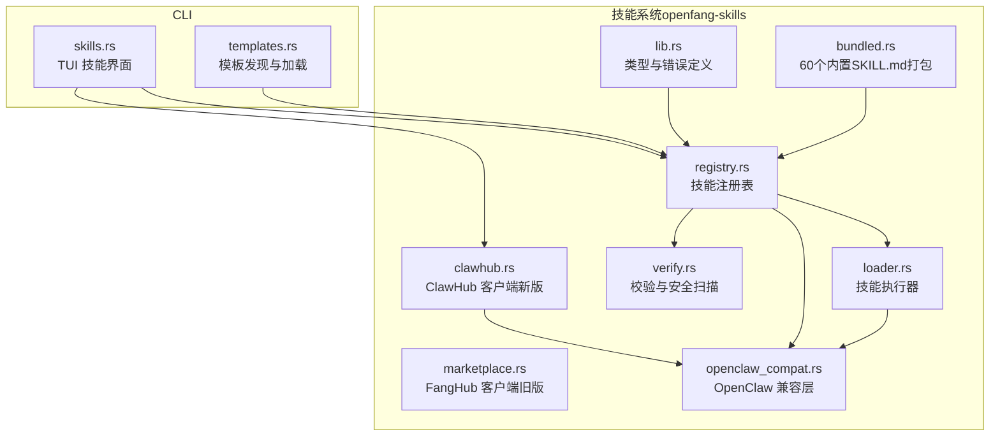
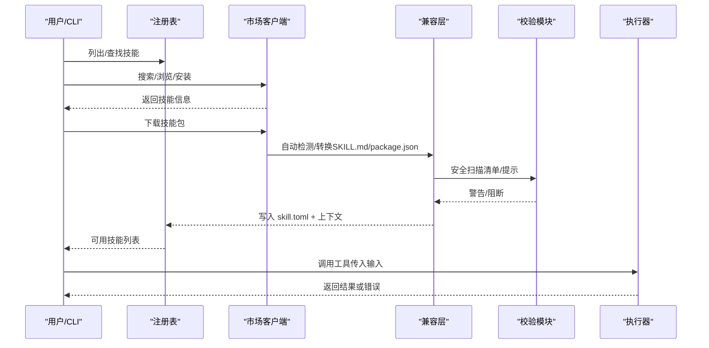
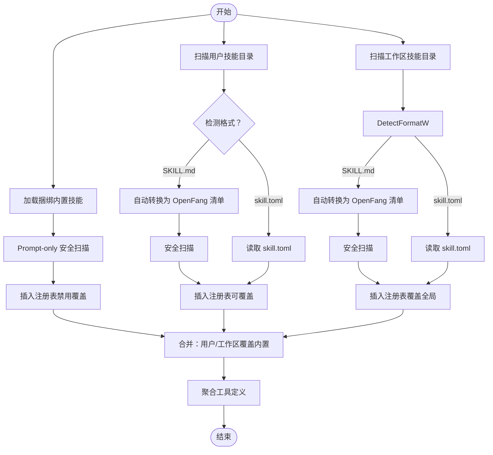
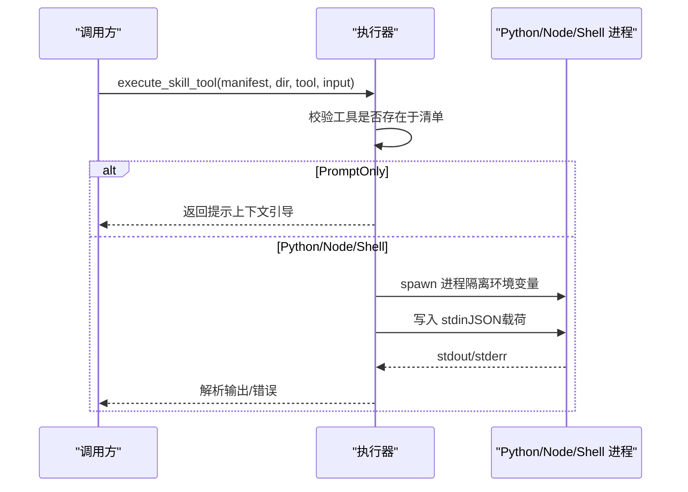
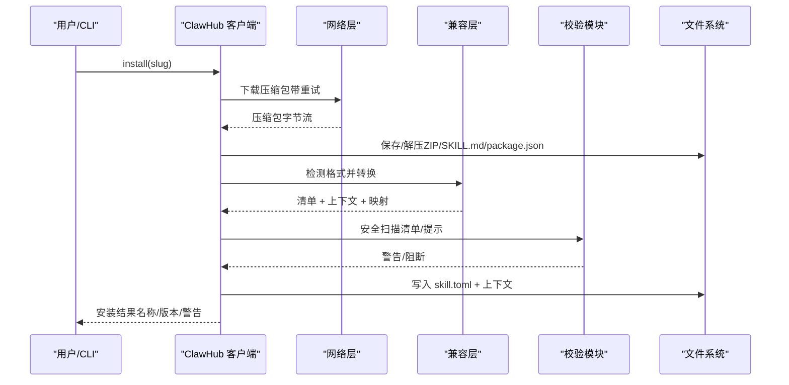
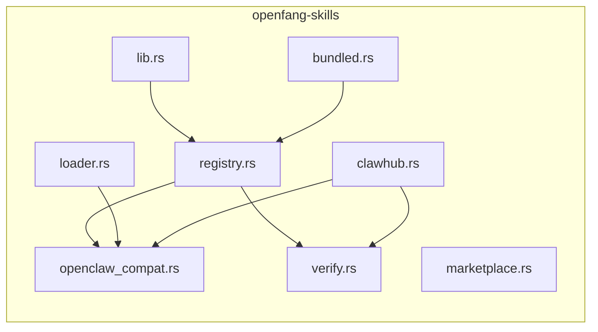

# 技能系统

<cite>
**本文引用的文件**
- [lib.rs](file://crates/openfang-skills/src/lib.rs)
- [registry.rs](file://crates/openfang-skills/src/registry.rs)
- [loader.rs](file://crates/openfang-skills/src/loader.rs)
- [marketplace.rs](file://crates/openfang-skills/src/marketplace.rs)
- [clawhub.rs](file://crates/openfang-skills/src/clawhub.rs)
- [openclaw_compat.rs](file://crates/openfang-skills/src/openclaw_compat.rs)
- [verify.rs](file://crates/openfang-skills/src/verify.rs)
- [Cargo.toml](file://crates/openfang-skills/Cargo.toml)
- [bundled.rs](file://crates/openfang-skills/src/bundled.rs)
- [skill-development.md](file://docs/skill-development.md)
- [SKILL.md（GitHub）](file://crates/openfang-skills/bundled/github/SKILL.md)
- [SKILL.md（数据分析师）](file://crates/openfang-skills/bundled/data-analyst/SKILL.md)
- [SKILL.md（Kubernetes）](file://crates/openfang-skills/bundled/kubernetes/SKILL.md)
- [skills.rs](file://crates/openfang-cli/src/tui/screens/skills.rs)
- [templates.rs](file://crates/openfang-cli/src/templates.rs)
</cite>

## 目录
1. [简介](#简介)
2. [项目结构](#项目结构)
3. [核心组件](#核心组件)
4. [架构总览](#架构总览)
5. [详细组件分析](#详细组件分析)
6. [依赖分析](#依赖分析)
7. [性能考量](#性能考量)
8. [故障排查指南](#故障排查指南)
9. [结论](#结论)
10. [附录](#附录)

## 简介
本文件面向 OpenFang 技能系统的开发者与维护者，系统化阐述技能注册表机制、技能加载流程、FangHub 市场集成与兼容策略，并对 60+ 预构建技能进行功能分类与要点说明。文档同时覆盖技能开发规范（含 SKILL.md 格式、工具定义、参数校验）、测试与调试、版本管理、与智能体的绑定关系、权限控制与资源限制、开发工具链与 SDK 使用、社区贡献流程，以及冲突处理、性能优化与安全注意事项。

## 项目结构
OpenFang 技能系统位于 crates/openfang-skills，围绕“清单（manifest）+ 运行时（runtime）+ 工具（tools）”三要素组织，支持本地安装、捆绑内置、OpenClaw 兼容转换与 FangHub 市场下载安装等多源来源。CLI 提供 TUI 展示与交互，模板系统辅助智能体与技能的组合使用。

图示来源
- [lib.rs:1-255](file://crates/openfang-skills/src/lib.rs#L1-L255)
- [registry.rs:1-553](file://crates/openfang-skills/src/registry.rs#L1-L553)
- [loader.rs:1-462](file://crates/openfang-skills/src/loader.rs#L1-L462)
- [marketplace.rs:1-201](file://crates/openfang-skills/src/marketplace.rs#L1-L201)
- [clawhub.rs:1-911](file://crates/openfang-skills/src/clawhub.rs#L1-L911)
- [openclaw_compat.rs:1-708](file://crates/openfang-skills/src/openclaw_compat.rs#L1-L708)
- [verify.rs:1-295](file://crates/openfang-skills/src/verify.rs#L1-L295)
- [bundled.rs:1-298](file://crates/openfang-skills/src/bundled.rs#L1-L298)
- [skills.rs:1-631](file://crates/openfang-cli/src/tui/screens/skills.rs#L1-L631)
- [templates.rs:1-138](file://crates/openfang-cli/src/templates.rs#L1-L138)

章节来源
- [Cargo.toml:1-28](file://crates/openfang-skills/Cargo.toml#L1-L28)
- [lib.rs:1-255](file://crates/openfang-skills/src/lib.rs#L1-L255)

## 核心组件
- 类型与错误：定义技能元数据、运行时类型、工具定义、来源类型、工具结果等核心数据结构与错误枚举，统一错误语义。
- 注册表：集中管理已安装技能，支持捆绑内置、用户安装、工作区覆盖、冻结模式（Stable 模式）等能力。
- 执行器：按运行时类型调用 Python/Node/Shell/PromptOnly 等执行路径，隔离环境变量并解析输出。
- 市场客户端：提供从 FangHub/ClawHub 搜索、浏览、详情、下载与安装的能力；内置重试与速率限制处理。
- 兼容层：自动识别并转换 OpenClaw 的 SKILL.md 与 package.json 技能，生成 OpenFang 清单与提示上下文。
- 校验与安全：对清单进行能力与工具风险扫描，对 Prompt-only 内容进行注入攻击检测与告警。
- 捆绑内置：编译期嵌入 60 个 SKILL.md，作为 Prompt-only 技能直接注入系统提示词。

章节来源
- [lib.rs:21-188](file://crates/openfang-skills/src/lib.rs#L21-L188)
- [registry.rs:11-553](file://crates/openfang-skills/src/registry.rs#L11-L553)
- [loader.rs:9-462](file://crates/openfang-skills/src/loader.rs#L9-L462)
- [marketplace.rs:10-201](file://crates/openfang-skills/src/marketplace.rs#L10-L201)
- [clawhub.rs:237-664](file://crates/openfang-skills/src/clawhub.rs#L237-L664)
- [openclaw_compat.rs:104-473](file://crates/openfang-skills/src/openclaw_compat.rs#L104-L473)
- [verify.rs:26-179](file://crates/openfang-skills/src/verify.rs#L26-L179)
- [bundled.rs:9-189](file://crates/openfang-skills/src/bundled.rs#L9-L189)

## 架构总览
技能系统以“注册表为中心”，在启动阶段加载捆绑内置与用户安装技能，随后根据智能体配置合并工具定义与提示上下文。市场客户端负责从 ClawHub/FangHub 下载与转换技能，兼容层确保不同格式的技能统一为 OpenFang 清单。执行器通过子进程隔离运行第三方代码，校验模块保障安全边界。

图示来源
- [registry.rs:105-196](file://crates/openfang-skills/src/registry.rs#L105-L196)
- [clawhub.rs:502-657](file://crates/openfang-skills/src/clawhub.rs#L502-L657)
- [openclaw_compat.rs:160-266](file://crates/openfang-skills/src/openclaw_compat.rs#L160-L266)
- [verify.rs:45-103](file://crates/openfang-skills/src/verify.rs#L45-L103)
- [loader.rs:9-51](file://crates/openfang-skills/src/loader.rs#L9-L51)

## 详细组件分析

### 组件A：技能注册表（SkillRegistry）
职责
- 加载捆绑内置技能（优先级最低，可被用户安装覆盖）
- 扫描用户目录下的技能，自动转换 OpenClaw 格式
- 合并工作区技能（覆盖全局）
- 提供工具定义聚合、按名称查询、移除技能、冻结保护等能力
- 支持 Stable 模式冻结，阻止后续动态加载

关键流程
- 加载捆绑内置：解析 SKILL.md 为清单，执行 Prompt-only 安全扫描
- 用户安装：读取 skill.toml，若无则尝试自动转换 SKILL.md
- 工作区覆盖：同名技能覆盖全局安装
- 工具聚合：仅启用技能提供工具

图示来源
- [registry.rs:56-103](file://crates/openfang-skills/src/registry.rs#L56-L103)
- [registry.rs:105-196](file://crates/openfang-skills/src/registry.rs#L105-L196)
- [registry.rs:290-384](file://crates/openfang-skills/src/registry.rs#L290-L384)
- [openclaw_compat.rs:160-266](file://crates/openfang-skills/src/openclaw_compat.rs#L160-L266)
- [verify.rs:105-179](file://crates/openfang-skills/src/verify.rs#L105-L179)

章节来源
- [registry.rs:11-553](file://crates/openfang-skills/src/registry.rs#L11-L553)

### 组件B：技能执行器（execute_skill_tool）
职责
- 根据清单中的运行时类型选择执行路径
- 对 Python/Node/Shell 子进程进行 stdin/stdout 协议通信
- 清理环境变量，避免凭据泄露
- 解析 JSON 输出，错误时返回结构化错误对象

执行路径
- PromptOnly：直接返回提示上下文引导说明
- Python/Node/Shell：构造 JSON 载荷写入 stdin，读取 stdout 并解析
- WASM/Builtin：当前未实现或由内核直接处理

图示来源
- [loader.rs:9-51](file://crates/openfang-skills/src/loader.rs#L9-L51)
- [loader.rs:53-157](file://crates/openfang-skills/src/loader.rs#L53-L157)
- [loader.rs:159-256](file://crates/openfang-skills/src/loader.rs#L159-L256)
- [loader.rs:305-403](file://crates/openfang-skills/src/loader.rs#L305-L403)

章节来源
- [loader.rs:9-462](file://crates/openfang-skills/src/loader.rs#L9-L462)

### 组件C：市场客户端（ClawHub 客户端）
职责
- 搜索、浏览、获取技能详情、下载压缩包
- 自动解压 ZIP 或保存 SKILL.md/package.json
- 检测内容类型并转换为 OpenFang 清单
- 安全扫描（清单与 Prompt-only 内容），二进制依赖检查
- 写入 skill.toml 与上下文文件

特性
- 速率限制与服务器错误自动重试（指数退避 + 抖动）
- 对包含严重注入风险的技能直接阻断并清理目录
- 记录工具名称映射与警告信息

图示来源
- [clawhub.rs:502-657](file://crates/openfang-skills/src/clawhub.rs#L502-L657)
- [openclaw_compat.rs:160-266](file://crates/openfang-skills/src/openclaw_compat.rs#L160-L266)
- [verify.rs:45-103](file://crates/openfang-skills/src/verify.rs#L45-L103)

章节来源
- [clawhub.rs:237-664](file://crates/openfang-skills/src/clawhub.rs#L237-L664)

### 组件D：OpenClaw 兼容层
职责
- 检测 SKILL.md 与 package.json 格式
- 解析 YAML frontmatter，提取命令与系统需求
- 将 OpenClaw 命令映射到 OpenFang 工具命名约定
- 生成 Prompt-only 清单或 Node 运行时清单
- 写出 skill.toml 与 prompt_context.md

章节来源
- [openclaw_compat.rs:104-473](file://crates/openfang-skills/src/openclaw_compat.rs#L104-L473)

### 组件E：校验与安全扫描
职责
- 清单安全扫描：识别危险运行时与能力/工具请求
- Prompt-only 内容扫描：检测注入、数据外泄、Shell 引用等模式
- 提供警告级别（Info/Warning/Critical）

章节来源
- [verify.rs:26-179](file://crates/openfang-skills/src/verify.rs#L26-L179)

### 组件F：捆绑内置（60个 SKILL.md）
职责
- 编译期嵌入 60 个 SKILL.md，作为 Prompt-only 技能
- 解析为清单并注入系统提示词
- 通过注册表加载，可被用户安装覆盖

章节来源
- [bundled.rs:9-189](file://crates/openfang-skills/src/bundled.rs#L9-L189)

## 依赖分析
- 外部依赖：reqwest（HTTP）、tokio（异步）、serde/json/yaml（序列化）、walkdir（遍历）、zip/hex/sha2（下载与校验）、uuid、chrono 等
- 内部依赖：openfang-types（类型与兼容）、自身模块间协作（registry/loader/compat/verify）

图示来源
- [Cargo.toml:8-27](file://crates/openfang-skills/Cargo.toml#L8-L27)

章节来源
- [Cargo.toml:1-28](file://crates/openfang-skills/Cargo.toml#L1-L28)

## 性能考量
- 子进程隔离与 I/O：Python/Node/Shell 执行采用 stdin/stdout，注意超时与缓冲区大小；建议在清单中声明最小必要能力，减少网络与磁盘访问。
- Prompt-only 上下文：过大提示文本可能影响推理性能，建议精简与聚焦。
- WASM 技能：具备更强的资源限制与隔离能力，适合高风险任务。
- 市场下载：ClawHub 客户端内置指数退避与抖动，降低 API 压力与失败率。

## 故障排查指南
- 无法找到工具：确认清单中工具名称与智能体 capabilities/tools 匹配；检查注册表聚合结果。
- 运行时不可用：检查 Python/Node/Shell 是否安装且可执行；确认运行时类型与入口路径正确。
- 安全阻断：查看安装日志中的警告与阻断原因，修正清单能力/工具请求或提示内容。
- 冻结模式：Stable 模式下禁止动态加载新技能，需重启或解除冻结。
- 市场安装失败：检查网络与速率限制；查看重试日志与最终状态码。

章节来源
- [loader.rs:34-39](file://crates/openfang-skills/src/loader.rs#L34-L39)
- [verify.rs:45-103](file://crates/openfang-skills/src/verify.rs#L45-L103)
- [registry.rs:44-49](file://crates/openfang-skills/src/registry.rs#L44-L49)
- [clawhub.rs:276-382](file://crates/openfang-skills/src/clawhub.rs#L276-L382)

## 结论
OpenFang 技能系统通过统一的清单与运行时抽象，实现了多来源（本地/捆绑/OpenClaw/ClawHub）技能的无缝集成；借助兼容层与安全扫描，既保证了生态开放性，又强化了安全性与稳定性。结合 CLI 的 TUI 与模板系统，开发者可以高效地开发、测试、发布与管理技能，并与智能体形成灵活的绑定关系。

## 附录

### 技能开发规范与最佳实践
- 清单格式：参考 skill-development 文档中的 skill.toml 结构与字段说明，确保 name/version/description/tags 等元数据完整。
- 工具定义：为每个工具提供清晰描述与 JSON Schema 输入参数，便于模型正确调用。
- 参数验证：在工具实现中严格校验输入，返回结构化错误而非崩溃。
- 运行时选择：优先使用 Python（易用）；需要强隔离与资源限制时选用 WASM；Prompt-only 技能用于知识注入。
- 版本管理：遵循语义化版本，破坏性变更提升主版本号。
- 测试与调试：在本地安装后，使用 CLI 列表与搜索功能验证；结合 TUI 查看技能来源与运行时。
- 发布与贡献：通过 CLI 搜索与安装社区技能；遵循社区贡献流程与模板。

章节来源
- [skill-development.md:86-596](file://docs/skill-development.md#L86-L596)
- [skills.rs:1-631](file://crates/openfang-cli/src/tui/screens/skills.rs#L1-L631)
- [templates.rs:64-111](file://crates/openfang-cli/src/templates.rs#L64-L111)

### 预构建技能功能分类与示例
- 开发运维与基础设施：ci-cd、ansible、prometheus、nginx、kubernetes、terraform、helm、docker、sysadmin、shell-scripting、linux-networking
- 云平台：aws、gcp、azure
- 语言专家：rust-expert、python-expert、typescript-expert、golang-expert
- 前端：react-expert、nextjs-expert、css-expert
- 数据库与检索：postgres-expert、redis-expert、sqlite-expert、mongodb、elasticsearch、sql-analyst
- API 与 Web：graphql-expert、openapi-expert、api-tester、oauth-expert
- AI/ML：ml-engineer、llm-finetuning、vector-db、prompt-engineer
- 安全：security-audit、crypto-expert、compliance
- 开发工具：github、git-expert、jira、linear-tools、sentry、code-reviewer、regex-expert
- 写作与沟通：technical-writer、writing-coach、email-writer、presentation
- 数据分析：data-analyst、data-pipeline
- 协作工具：slack-tools、notion、confluence、figma-expert
- 职业发展：interview-prep、project-manager
- 高阶能力：wasm-expert、pdf-reader、web-search

示例 SKILL.md（节选）
- GitHub 操作专家：指导 PR/Issue/Actions 管理与最佳实践
- 数据分析师：EDA、清洗、可视化与统计分析方法论
- Kubernetes 运维专家：kubectl 调试、部署模式与网络策略

章节来源
- [skill-development.md:39-60](file://docs/skill-development.md#L39-L60)
- [SKILL.md（GitHub）:1-37](file://crates/openfang-skills/bundled/github/SKILL.md#L1-L37)
- [SKILL.md（数据分析师）:1-53](file://crates/openfang-skills/bundled/data-analyst/SKILL.md#L1-L53)
- [SKILL.md（Kubernetes）:1-44](file://crates/openfang-skills/bundled/kubernetes/SKILL.md#L1-L44)

### 技能与智能体的绑定关系、权限控制与资源限制
- 绑定关系：在智能体清单中通过 skills 字段引用技能名称；系统在启动时合并技能工具定义与提示上下文。
- 权限控制：技能可在 requirements 中声明所需工具与能力字符串；执行前由宿主校验。
- 资源限制：WASM 技能具备沙箱与计量能力；Prompt-only 技能不执行代码，仅注入提示词。
- 稳定模式：注册表可冻结，防止运行时动态加载新技能，确保生产稳定。

章节来源
- [lib.rs:93-101](file://crates/openfang-skills/src/lib.rs#L93-L101)
- [registry.rs:44-54](file://crates/openfang-skills/src/registry.rs#L44-L54)
- [loader.rs:34-39](file://crates/openfang-skills/src/loader.rs#L34-L39)
- [skill-development.md:346-370](file://docs/skill-development.md#L346-L370)

### 技能开发工具链与 SDK 使用
- CLI：提供安装、搜索、列出、删除、创建脚手架等命令；TUI 展示 Installed/ClawHub/MCP 服务器。
- SDK：Python SDK 提供装饰器式工具定义与运行入口，简化复杂技能开发。
- 模板系统：发现与加载 agent.toml 模板，支持自定义与捆绑模板回退。

章节来源
- [skill-development.md:470-536](file://docs/skill-development.md#L470-L536)
- [skills.rs:1-631](file://crates/openfang-cli/src/tui/screens/skills.rs#L1-L631)
- [templates.rs:64-111](file://crates/openfang-cli/src/templates.rs#L64-L111)

### 常见问题与解决方案
- 技能冲突：同名技能后安装覆盖先安装；建议使用语义化版本区分。
- 性能优化：减少 Prompt-only 上下文长度；优先使用 Prompt-only 表达知识；WASM 技能用于高风险任务。
- 安全考虑：避免请求 ShellExec/NetConnect(*) 等高危能力；严格扫描注入与外泄模式；使用隔离环境运行第三方代码。

章节来源
- [verify.rs:105-179](file://crates/openfang-skills/src/verify.rs#L105-L179)
- [loader.rs:93-114](file://crates/openfang-skills/src/loader.rs#L93-L114)
- [clawhub.rs:588-622](file://crates/openfang-skills/src/clawhub.rs#L588-L622)