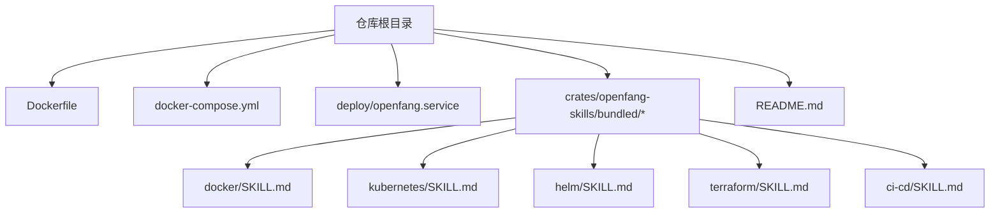
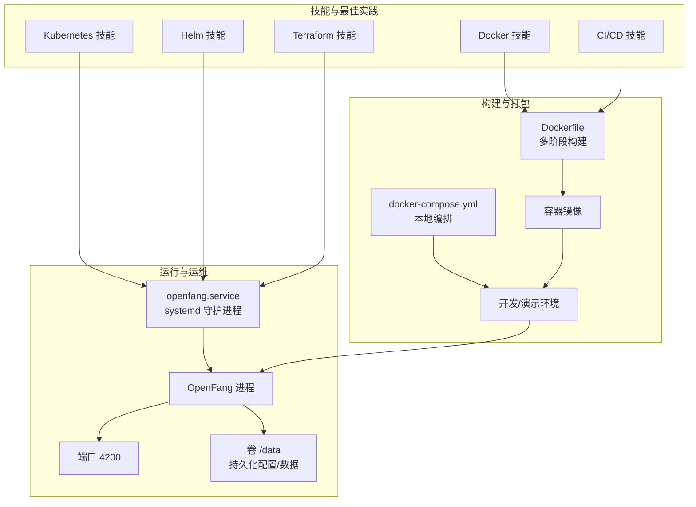
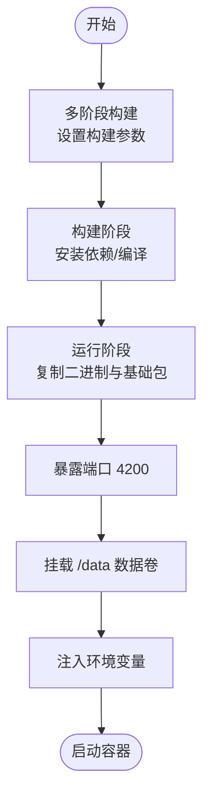
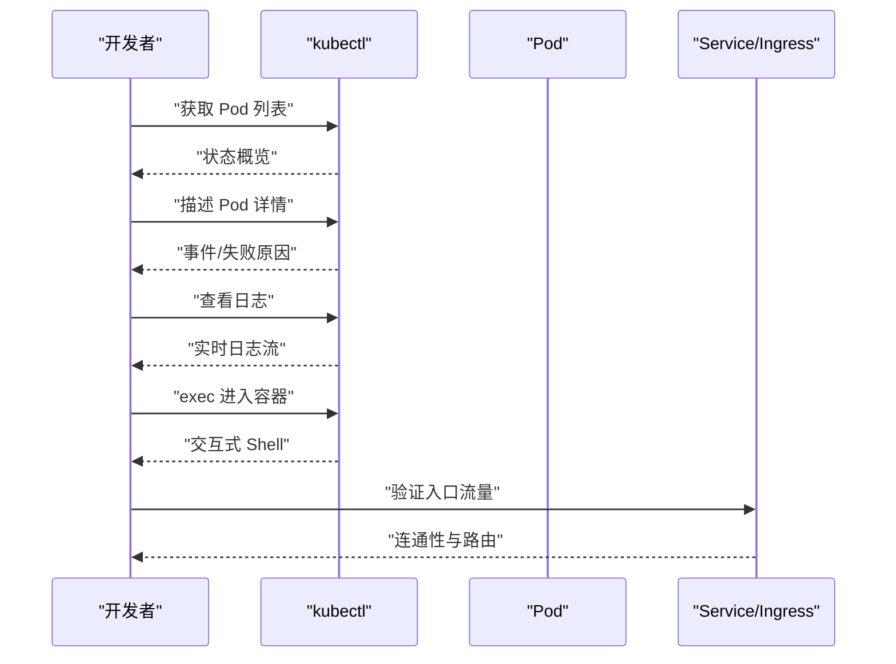
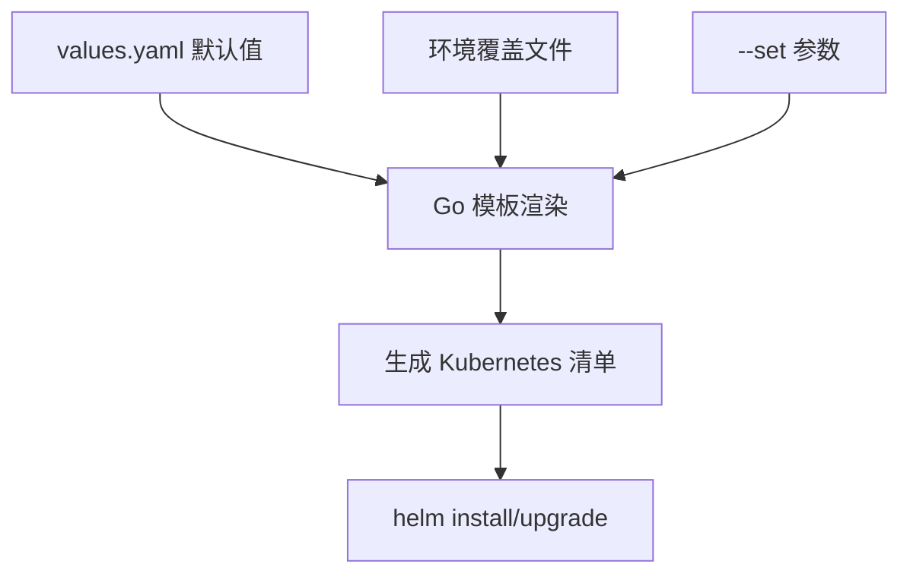
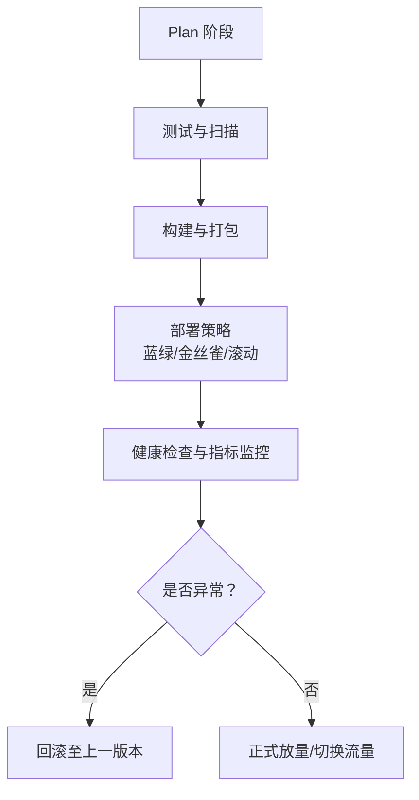
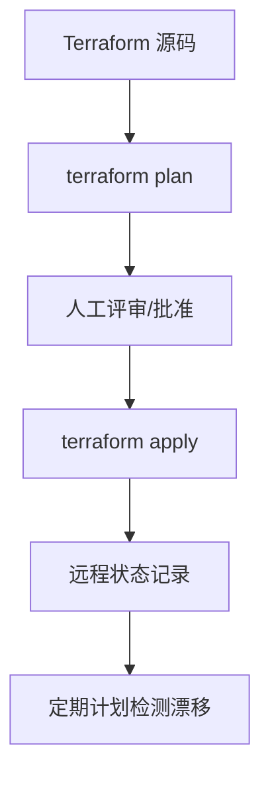
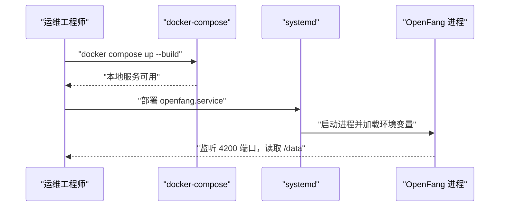
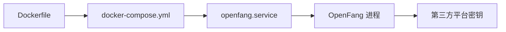

# DevOps 技能

<cite>
**本文引用的文件**
- [README.md](file://README.md)
- [Dockerfile](file://Dockerfile)
- [docker-compose.yml](file://docker-compose.yml)
- [deploy/openfang.service](file://deploy/openfang.service)
- [crates/openfang-skills/bundled/docker/SKILL.md](file://crates/openfang-skills/bundled/docker/SKILL.md)
- [crates/openfang-skills/bundled/kubernetes/SKILL.md](file://crates/openfang-skills/bundled/kubernetes/SKILL.md)
- [crates/openfang-skills/bundled/helm/SKILL.md](file://crates/openfang-skills/bundled/helm/SKILL.md)
- [crates/openfang-skills/bundled/terraform/SKILL.md](file://crates/openfang-skills/bundled/terraform/SKILL.md)
- [crates/openfang-skills/bundled/ci-cd/SKILL.md](file://crates/openfang-skills/bundled/ci-cd/SKILL.md)
</cite>

## 目录
1. [简介](#简介)
2. [项目结构](#项目结构)
3. [核心组件](#核心组件)
4. [架构总览](#架构总览)
5. [详细组件分析](#详细组件分析)
6. [依赖关系分析](#依赖关系分析)
7. [性能考量](#性能考量)
8. [故障排查指南](#故障排查指南)
9. [结论](#结论)
10. [附录](#附录)

## 简介
本文件面向 OpenFang DevOps 技能系列，系统梳理容器化与编排、Kubernetes、CI/CD、Helm、Terraform 的知识要点与最佳实践，并结合仓库中的 Dockerfile、docker-compose.yml、systemd 服务单元等实际配置，给出可落地的部署流程、监控告警与故障恢复策略。内容兼顾工程落地与安全加固，帮助读者在生产环境中稳定运行 OpenFang。

## 项目结构
围绕 DevOps 相关的文件主要分布在以下位置：
- 容器与编排：Dockerfile、docker-compose.yml
- 系统服务：deploy/openfang.service
- 技能文档：crates/openfang-skills/bundled 下的 docker、kubernetes、helm、terraform、ci-cd 技能说明
- 项目总览与安装：README.md

图表来源
- [Dockerfile:1-35](file://Dockerfile#L1-L35)
- [docker-compose.yml:1-26](file://docker-compose.yml#L1-L26)
- [deploy/openfang.service:1-39](file://deploy/openfang.service#L1-L39)
- [crates/openfang-skills/bundled/docker/SKILL.md:1-44](file://crates/openfang-skills/bundled/docker/SKILL.md#L1-L44)
- [crates/openfang-skills/bundled/kubernetes/SKILL.md:1-44](file://crates/openfang-skills/bundled/kubernetes/SKILL.md#L1-L44)
- [crates/openfang-skills/bundled/helm/SKILL.md:1-39](file://crates/openfang-skills/bundled/helm/SKILL.md#L1-L39)
- [crates/openfang-skills/bundled/terraform/SKILL.md:1-46](file://crates/openfang-skills/bundled/terraform/SKILL.md#L1-L46)
- [crates/openfang-skills/bundled/ci-cd/SKILL.md:1-39](file://crates/openfang-skills/bundled/ci-cd/SKILL.md#L1-L39)
- [README.md:1-521](file://README.md#L1-L521)

章节来源
- [README.md:1-521](file://README.md#L1-L521)
- [Dockerfile:1-35](file://Dockerfile#L1-L35)
- [docker-compose.yml:1-26](file://docker-compose.yml#L1-L26)
- [deploy/openfang.service:1-39](file://deploy/openfang.service#L1-L39)

## 核心组件
- 容器镜像与运行时
  - 使用多阶段构建，最终仅包含二进制与必要运行时依赖，暴露 4200 端口，挂载 /data 并通过环境变量注入第三方平台凭据。
- 编排与部署
  - docker-compose 提供本地开发/演示环境，映射端口并持久化数据卷；systemd 单元提供生产级守护进程能力，含安全强化与资源限制。
- DevOps 技能
  - Docker、Kubernetes、Helm、Terraform、CI/CD 技能文档覆盖从最佳实践到常见陷阱的完整知识图谱。

章节来源
- [Dockerfile:1-35](file://Dockerfile#L1-L35)
- [docker-compose.yml:1-26](file://docker-compose.yml#L1-L26)
- [deploy/openfang.service:1-39](file://deploy/openfang.service#L1-L39)
- [crates/openfang-skills/bundled/docker/SKILL.md:1-44](file://crates/openfang-skills/bundled/docker/SKILL.md#L1-L44)
- [crates/openfang-skills/bundled/kubernetes/SKILL.md:1-44](file://crates/openfang-skills/bundled/kubernetes/SKILL.md#L1-L44)
- [crates/openfang-skills/bundled/helm/SKILL.md:1-39](file://crates/openfang-skills/bundled/helm/SKILL.md#L1-L39)
- [crates/openfang-skills/bundled/terraform/SKILL.md:1-46](file://crates/openfang-skills/bundled/terraform/SKILL.md#L1-L46)
- [crates/openfang-skills/bundled/ci-cd/SKILL.md:1-39](file://crates/openfang-skills/bundled/ci-cd/SKILL.md#L1-L39)

## 架构总览
下图展示从源码构建到生产运行的关键路径，以及与技能文档的对应关系。

图表来源
- [Dockerfile:1-35](file://Dockerfile#L1-L35)
- [docker-compose.yml:1-26](file://docker-compose.yml#L1-L26)
- [deploy/openfang.service:1-39](file://deploy/openfang.service#L1-L39)
- [crates/openfang-skills/bundled/docker/SKILL.md:1-44](file://crates/openfang-skills/bundled/docker/SKILL.md#L1-L44)
- [crates/openfang-skills/bundled/kubernetes/SKILL.md:1-44](file://crates/openfang-skills/bundled/kubernetes/SKILL.md#L1-L44)
- [crates/openfang-skills/bundled/helm/SKILL.md:1-39](file://crates/openfang-skills/bundled/helm/SKILL.md#L1-L39)
- [crates/openfang-skills/bundled/terraform/SKILL.md:1-46](file://crates/openfang-skills/bundled/terraform/SKILL.md#L1-L46)
- [crates/openfang-skills/bundled/ci-cd/SKILL.md:1-39](file://crates/openfang-skills/bundled/ci-cd/SKILL.md#L1-L39)

## 详细组件分析

### 容器化与 Docker 技能
- 镜像构建
  - 多阶段构建减少最终镜像体积；通过构建参数控制 LTO 与 Codegen Units，平衡构建速度与产物优化。
  - 最终镜像包含运行所需的基础包，便于在无 Rust 工具链的环境中直接运行。
- 容器管理
  - 暴露 4200 端口，挂载 /data 作为数据卷，通过环境变量注入第三方平台密钥。
  - 建议在生产中使用非 root 用户、最小权限与健康检查。
- 网络与存储
  - docker-compose 将宿主 4200 映射到容器 4200，使用命名卷 openfang-data 持久化数据。
- 安全与调试
  - 参考技能文档中的调试技巧（日志、exec、inspect、stats）与避免将密钥放入镜像层的最佳实践。

图表来源
- [Dockerfile:1-35](file://Dockerfile#L1-L35)
- [docker-compose.yml:10-22](file://docker-compose.yml#L10-L22)

章节来源
- [Dockerfile:1-35](file://Dockerfile#L1-L35)
- [docker-compose.yml:1-26](file://docker-compose.yml#L1-L26)
- [crates/openfang-skills/bundled/docker/SKILL.md:1-44](file://crates/openfang-skills/bundled/docker/SKILL.md#L1-L44)

### Kubernetes 技能
- 集群管理与 Pod 调度
  - 使用命名空间隔离；确认当前上下文；优先使用声明式 YAML。
- Service 发布与 Ingress
  - 内部服务用 ClusterIP，外部流量用 LoadBalancer 或 Ingress；合理配置探针与资源配额。
- 调试流程
  - 检查 Pod 状态、describe 事件、查看日志、exec 进入交互调试、top 观察资源占用。
- 安全与最佳实践
  - 最小权限原则、网络策略、避免使用 latest 标签、不将密钥放入 ConfigMap。

图表来源
- [crates/openfang-skills/bundled/kubernetes/SKILL.md:16-23](file://crates/openfang-skills/bundled/kubernetes/SKILL.md#L16-L23)

章节来源
- [crates/openfang-skills/bundled/kubernetes/SKILL.md:1-44](file://crates/openfang-skills/bundled/kubernetes/SKILL.md#L1-L44)

### Helm 技能
- Chart 开发与 Values 管理
  - 结构清晰：Chart.yaml、values.yaml、templates/、charts/（依赖）、tests/。
  - 使用命名模板与标签规范，确保复用性与一致性。
- 版本控制与依赖管理
  - 图表版本与应用版本区分；依赖项可按条件启用；值覆盖顺序明确。
- 常见模式
  - 环境覆盖文件、Init Container、ConfigMap 校验和触发滚动重启、库类型 Chart。

图表来源
- [crates/openfang-skills/bundled/helm/SKILL.md:17-25](file://crates/openfang-skills/bundled/helm/SKILL.md#L17-L25)

章节来源
- [crates/openfang-skills/bundled/helm/SKILL.md:1-39](file://crates/openfang-skills/bundled/helm/SKILL.md#L1-L39)

### CI/CD 技能
- 流水线配置
  - 以代码形式管理流水线；作业依赖与并行执行；矩阵构建；缓存策略。
- 自动化测试与部署策略
  - 蓝绿发布、金丝雀发布、滚动更新；分支保护与并发控制。
- 回滚机制
  - 保留上一个健康版本；Ingress/Service 快速切换；数据库迁移钩子。

图表来源
- [crates/openfang-skills/bundled/ci-cd/SKILL.md:26-32](file://crates/openfang-skills/bundled/ci-cd/SKILL.md#L26-L32)

章节来源
- [crates/openfang-skills/bundled/ci-cd/SKILL.md:1-39](file://crates/openfang-skills/bundled/ci-cd/SKILL.md#L1-L39)

### Terraform 技能
- 基础设施即代码
  - 先计划后应用；远程状态后端与状态锁；提供者版本约束。
- 模块化设计
  - 输入输出清晰、文档化、单一职责；Git 标签或私有注册表分发。
- 状态管理与最佳实践
  - 加密存储、工作区隔离、导入与迁移、打标签与数据源引用。
- 常见陷阱
  - 避免生产销毁、不要硬编码密钥、避免循环依赖、定期计划漂移检测。

图表来源
- [crates/openfang-skills/bundled/terraform/SKILL.md:24-32](file://crates/openfang-skills/bundled/terraform/SKILL.md#L24-L32)

章节来源
- [crates/openfang-skills/bundled/terraform/SKILL.md:1-46](file://crates/openfang-skills/bundled/terraform/SKILL.md#L1-L46)

### 生产部署流程示例（基于仓库配置）
- 本地开发
  - 使用 docker-compose 启动，映射端口并持久化数据卷，注入第三方平台密钥。
- 生产部署
  - 使用 systemd 服务单元 openfang.service，设置用户/组、工作目录、环境变量文件、安全强化与资源限制。
  - 在容器内运行时，建议配合 Kubernetes 与 Helm 进行编排与版本治理。

图表来源
- [docker-compose.yml:1-26](file://docker-compose.yml#L1-L26)
- [deploy/openfang.service:1-39](file://deploy/openfang.service#L1-L39)

章节来源
- [docker-compose.yml:1-26](file://docker-compose.yml#L1-L26)
- [deploy/openfang.service:1-39](file://deploy/openfang.service#L1-L39)

## 依赖关系分析
- 组件耦合
  - Dockerfile 与 docker-compose 为“构建-本地运行”链路；systemd 服务单元负责“生产守护进程”。
  - 技能文档为方法论指导，贯穿上述所有环节。
- 外部依赖
  - 第三方平台密钥通过环境变量注入（如 Anthropic、OpenAI、Groq、Telegram、Discord、Slack 等），需遵循最小权限与密钥轮换策略。

图表来源
- [Dockerfile:14-22](file://Dockerfile#L14-L22)
- [docker-compose.yml:14-22](file://docker-compose.yml#L14-L22)
- [deploy/openfang.service:16-18](file://deploy/openfang.service#L16-L18)

章节来源
- [Dockerfile:14-22](file://Dockerfile#L14-L22)
- [docker-compose.yml:14-22](file://docker-compose.yml#L14-L22)
- [deploy/openfang.service:16-18](file://deploy/openfang.service#L16-L18)

## 性能考量
- 构建性能
  - 合理设置 LTO 与 Codegen Units，平衡产物大小与构建时间。
- 运行性能
  - 设置资源 requests/limits，避免噪音邻居；使用健康探针与就绪探针保障稳定性。
- 存储与 I/O
  - 使用命名卷而非 bind mount 持久化数据库；关注卷的 IO 特性与备份策略。
- 网络与入口
  - Ingress 层面做限流与超时配置；Service 选择合适的负载均衡策略。

## 故障排查指南
- 容器与日志
  - 查看容器日志与实时日志流；inspect 检查网络/挂载/环境变量；stats/top 观察资源占用。
- 启动问题
  - 使用 --build --force-recreate 排查 Compose 启动异常；确认镜像拉取与健康检查。
- 生产问题
  - systemd 日志与重启策略；检查环境变量文件路径与权限；核对 /data 卷挂载与磁盘空间。
- Kubernetes 调试
  - get/describe/logs/exec/top 的标准流程；检查探针、配额与网络策略。

章节来源
- [crates/openfang-skills/bundled/docker/SKILL.md:24-31](file://crates/openfang-skills/bundled/docker/SKILL.md#L24-L31)
- [crates/openfang-skills/bundled/kubernetes/SKILL.md:16-23](file://crates/openfang-skills/bundled/kubernetes/SKILL.md#L16-L23)
- [deploy/openfang.service:11-14](file://deploy/openfang.service#L11-L14)

## 结论
通过将仓库中的容器化配置与技能文档相结合，可以形成从本地开发到生产运行的完整 DevOps 能力闭环。建议在生产中：
- 使用 systemd 管理守护进程，结合 Kubernetes/Helm 实现弹性与可观测性；
- 以 CI/CD 管理流水线，采用蓝绿/金丝雀发布与自动回滚；
- 以 Terraform 管理基础设施，强调计划先行与状态安全；
- 严格遵循 Docker/Kubernetes/安全最佳实践，持续进行监控与演练。

## 附录
- 快速参考
  - 端口：4200；数据卷：/data；环境变量文件：/etc/openfang/env；工作目录：/var/lib/openfang。
  - 第三方平台密钥通过环境变量注入，避免写入镜像或版本库。
- 安全清单
  - 非 root 运行；最小权限；健康检查；密钥外置；定期审计与轮换。

章节来源
- [docker-compose.yml:14-22](file://docker-compose.yml#L14-L22)
- [deploy/openfang.service:16-35](file://deploy/openfang.service#L16-L35)
- [crates/openfang-skills/bundled/docker/SKILL.md:11-22](file://crates/openfang-skills/bundled/docker/SKILL.md#L11-L22)
- [crates/openfang-skills/bundled/kubernetes/SKILL.md:11-15](file://crates/openfang-skills/bundled/kubernetes/SKILL.md#L11-L15)