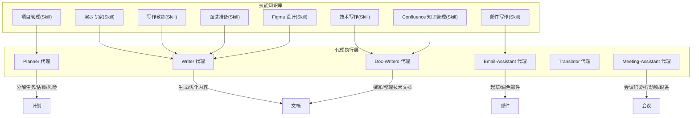
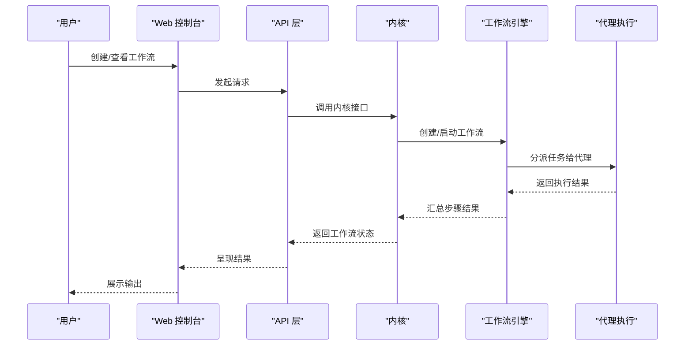

# 业务生产力技能

<cite>
**本文引用的文件**
- [project-manager/SKILL.md](file://crates/openfang-skills/bundled/project-manager/SKILL.md)
- [presentation/SKILL.md](file://crates/openfang-skills/bundled/presentation/SKILL.md)
- [technical-writer/SKILL.md](file://crates/openfang-skills/bundled/technical-writer/SKILL.md)
- [writing-coach/SKILL.md](file://crates/openfang-skills/bundled/writing-coach/SKILL.md)
- [email-writer/SKILL.md](file://crates/openfang-skills/bundled/email-writer/SKILL.md)
- [interview-prep/SKILL.md](file://crates/openfang-skills/bundled/interview-prep/SKILL.md)
- [figma-expert/SKILL.md](file://crates/openfang-skills/bundled/figma-expert/SKILL.md)
- [confluence/SKILL.md](file://crates/openfang-skills/bundled/confluence/SKILL.md)
- [planner/agent.toml](file://agents/planner/agent.toml)
- [meeting-assistant/agent.toml](file://agents/meeting-assistant/agent.toml)
- [doc-writer/agent.toml](file://agents/doc-writer/agent.toml)
- [writer/agent.toml](file://agents/writer/agent.toml)
- [translator/agent.toml](file://agents/translator/agent.toml)
- [email-assistant/agent.toml](file://agents/email-assistant/agent.toml)
- [workflow.rs](file://crates/openfang-kernel/src/workflow.rs)
- [channel_bridge.rs](file://crates/openfang-api/src/channel_bridge.rs)
- [index_body.html](file://crates/openfang-api/static/index_body.html)
- [kernel.rs](file://crates/openfang-kernel/src/kernel.rs)
</cite>

## 目录
1. [引言](#引言)
2. [项目结构](#项目结构)
3. [核心组件](#核心组件)
4. [架构总览](#架构总览)
5. [详细组件分析](#详细组件分析)
6. [依赖关系分析](#依赖关系分析)
7. [性能考量](#性能考量)
8. [故障排查指南](#故障排查指南)
9. [结论](#结论)
10. [附录](#附录)

## 引言
本文件面向“OpenFang 业务生产力技能系列”，系统化梳理并输出以下能力模块的专业标准与实践路径：
- 项目经理技能：项目规划、进度跟踪、风险管理、团队协作
- 演示专家技能：PPT 制作、演讲技巧、视觉设计、演示策略
- 技术作家技能：文档编写、技术翻译、规范制定、知识管理
- 写作教练技能：内容创作、文案优化、风格指导、创意激发
- 面试准备技能：面试流程、问题设计、评估标准、候选人筛选
- 邮件写作技能：商务沟通、邮件模板、礼仪规范、效率提升

围绕上述主题，文档提供工作流优化建议、沟通技巧要点、专业标准与最佳实践，并结合仓库中的技能说明与代理配置，给出可落地的应用案例、模板工具与效果评估方法。

## 项目结构
OpenFang 将“技能”以独立 Markdown 文件形式组织在 openfang-skills/bundled 下，每个技能文件定义了该领域的关键原则、技术方法与常见模式；同时，配套的“代理”（Agent）通过 agent.toml 描述其职责、系统提示词与可用工具，形成“技能知识库 + 自动化执行”的闭环。

图示来源
- [project-manager/SKILL.md:1-31](file://crates/openfang-skills/bundled/project-manager/SKILL.md#L1-L31)
- [presentation/SKILL.md:1-40](file://crates/openfang-skills/bundled/presentation/SKILL.md#L1-L40)
- [technical-writer/SKILL.md:1-39](file://crates/openfang-skills/bundled/technical-writer/SKILL.md#L1-L39)
- [writing-coach/SKILL.md:1-45](file://crates/openfang-skills/bundled/writing-coach/SKILL.md#L1-L45)
- [email-writer/SKILL.md:1-39](file://crates/openfang-skills/bundled/email-writer/SKILL.md#L1-L39)
- [interview-prep/SKILL.md:1-39](file://crates/openfang-skills/bundled/interview-prep/SKILL.md#L1-L39)
- [figma-expert/SKILL.md:1-40](file://crates/openfang-skills/bundled/figma-expert/SKILL.md#L1-L40)
- [confluence/SKILL.md:1-40](file://crates/openfang-skills/bundled/confluence/SKILL.md#L1-L40)
- [planner/agent.toml:1-52](file://agents/planner/agent.toml#L1-L52)
- [meeting-assistant/agent.toml:1-65](file://agents/meeting-assistant/agent.toml#L1-L65)
- [doc-writer/agent.toml:1-47](file://agents/doc-writer/agent.toml#L1-L47)
- [writer/agent.toml:1-44](file://agents/writer/agent.toml#L1-L44)
- [translator/agent.toml:1-65](file://agents/translator/agent.toml#L1-L65)
- [email-assistant/agent.toml:1-27](file://agents/email-assistant/agent.toml#L1-L27)

章节来源
- [project-manager/SKILL.md:1-31](file://crates/openfang-skills/bundled/project-manager/SKILL.md#L1-L31)
- [planner/agent.toml:1-52](file://agents/planner/agent.toml#L1-L52)

## 核心组件
本节聚焦六大业务生产力技能的知识要点与执行代理的能力边界，帮助读者快速定位到可复用的方法论与自动化工具。

- 项目经理技能
  - 关键原则：敏捷是思维而非仪式；估算用于对齐预期；主动管理风险；按受众调整沟通；保护团队专注度
  - 技术方法：站会聚焦阻塞与协调；冲刺计划拆分故事并设定验收；回顾使用结构化格式并追踪行动项；RACI 矩阵明确权责；用燃起/燃尽图表跟踪进度
  - 常见模式：范围谈判、依赖映射、风险驱动排序、完成定义清单
  - 执行代理：Planner 聚焦“范围界定—分解—排序—估算—风险—里程碑”的结构化产出，支持多轮迭代与共享记忆

- 演示专家技能
  - 关键原则：从受众出发；金字塔原理（结论先行）；每页一个核心观点；视觉层次清晰；计时演练
  - 技术方法：结构化讲稿（背景—问题—方案—证据—行动）；最小字号规则；数据可视化替代表格；逐页讲稿与渐进揭示；统一视觉语言
  - 常见模式：情境—复杂性—解决；问题—方案—收益；前后对比；演示三明治
  - 常见误区：逐字朗读幻灯片、复杂动画分散注意力、主流程插入备用页、过度装饰

- 技术作家技能
  - 关键原则：以读者为中心；Diataxis 四类文档分离；代码示例完整可运行；术语一致；文档靠近代码
  - 技术方法：README 结构化；API 参考条目；ADR 模板；变更日志规范；使用第二人称与现在时态；配图辅助理解
  - 常见模式：渐进披露；任务导向标题；复制粘贴验证；版本感知
  - 常见误区：仅描述代码行为、教程与参考混用、截图替代文本、推迟文档

- 写作教练技能
  - 关键原则：清晰至上；尊重作者声音；示例优于空洞建议；因体裁而异
  - 结构改进：倒金字塔；短段落；标题、要点与编号列表；段落间逻辑衔接；果断删减
  - 句级清晰：主动语态；剔除填充词；具体化；控制长度；主谓贴近
  - 技术写作：首用定义术语；术语一致；抽象概念举例；步骤编号
  - 常见误区：过度修改削弱个性；改变事实含义；拘泥过时语法；全盘重写

- 面试准备技能
  - 关键原则：掌握基础模式而非死记题目；边说边想展示思路；系统设计有框架；行为故事用 STAR；时间盒准备
  - 技术方法：算法模式系统学习；复杂度分析；系统设计框架；编码结构化流程；行为故事准备；模拟面试计时
  - 常见模式：滑动窗口、图遍历、动态规划表、设计权衡
  - 常见误区：未先澄清约束；过早优化；行为回答模糊；忽略提问

- 邮件写作技能
  - 关键原则：BLUF（直截了当）；因关系与情境调适语气；明确可执行请求与截止时间；便于扫描；尊重收件箱容量
  - 技术方法：主题明确且带紧迫感；长邮件分段（背景—详情—请求）；根据对象校准正式度；CC/BCC 明确用途；困难对话以同理心开头；设置后续期望
  - 常见模式：状态更新、决策请求、引荐、升级
  - 常见误区：把关键信息埋在第三段；用被动攻击式措辞；大群组滥用回复全部；情绪化邮件立即发送

章节来源
- [project-manager/SKILL.md:9-31](file://crates/openfang-skills/bundled/project-manager/SKILL.md#L9-L31)
- [presentation/SKILL.md:9-39](file://crates/openfang-skills/bundled/presentation/SKILL.md#L9-L39)
- [technical-writer/SKILL.md:9-38](file://crates/openfang-skills/bundled/technical-writer/SKILL.md#L9-L38)
- [writing-coach/SKILL.md:9-44](file://crates/openfang-skills/bundled/writing-coach/SKILL.md#L9-L44)
- [interview-prep/SKILL.md:9-38](file://crates/openfang-skills/bundled/interview-prep/SKILL.md#L9-L38)
- [email-writer/SKILL.md:9-38](file://crates/openfang-skills/bundled/email-writer/SKILL.md#L9-L38)
- [planner/agent.toml:12-37](file://agents/planner/agent.toml#L12-L37)
- [meeting-assistant/agent.toml:13-44](file://agents/meeting-assistant/agent.toml#L13-L44)

## 架构总览
OpenFang 的“技能 + 代理 + 工作流”的整体架构如下：

```mermaid
graph TB
subgraph "用户交互"
UI["Web 控制台<br/>index_body.html"]
API["API 层<br/>channel_bridge.rs"]
end
subgraph "内核与编排"
KERNEL["内核 Kernel<br/>kernel.rs"]
WF["工作流引擎<br/>workflow.rs"]
end
subgraph "技能知识库"
SKILLS["技能 Markdown<br/>openfang-skills/bundled/*"]
end
subgraph "代理执行"
AGENTS["代理配置<br/>agents/*/agent.toml"]
WRITER["Writer/Doc-Writers/Email-Assistant 等"]
end
UI --> API --> KERNEL --> WF
SKILLS -. 提供知识与模板 .-> WRITER
AGENTS -. 定义能力与工具 .-> WRITER
WRITER --> |"生成/处理内容/邮件/计划/会议纪要"| 用户
```

图示来源
- [index_body.html:1377-1397](file://crates/openfang-api/static/index_body.html#L1377-L1397)
- [channel_bridge.rs:297-332](file://crates/openfang-api/src/channel_bridge.rs#L297-L332)
- [kernel.rs:5830-5862](file://crates/openfang-kernel/src/kernel.rs#L5830-L5862)
- [workflow.rs:800-841](file://crates/openfang-kernel/src/workflow.rs#L800-L841)

## 详细组件分析

### 项目经理技能（Project Manager）
- 方法论要点
  - 敏捷思维：以目标为导向，灵活调整仪式与制品
  - 估算对齐：用估算促进沟通，而非施压承诺
  - 风险管理：建立“活的风险登记册”，早期识别、评估与缓解
  - 分层沟通：针对不同受众（高管、工程师、干系人）定制信息
  - 团队保护：吸收组织噪音，明确优先级，减少执行期干扰
  - 常用技术：站会聚焦阻塞与协调；冲刺计划拆分与承诺；回顾结构化追踪行动项；RACI 权责矩阵；速度与燃起/燃尽图表
  - 常见模式：范围谈判、依赖映射、风险驱动排序、完成定义清单

- 实践应用
  - 使用 Planner 代理进行“范围—分解—排序—估算—风险—里程碑”的结构化产出，支持多轮迭代与共享记忆
  - 在会议中配合 Meeting-Assistant 代理提取行动项并追踪闭环

- 效果评估
  - 进度指标：速度（velocity）与预测稳定性
  - 质量指标：缺陷密度、需求变更频率
  - 团队健康：回顾行动项完成率、阻塞消除周期

章节来源
- [project-manager/SKILL.md:9-31](file://crates/openfang-skills/bundled/project-manager/SKILL.md#L9-L31)
- [planner/agent.toml:12-37](file://agents/planner/agent.toml#L12-L37)
- [meeting-assistant/agent.toml:20-27](file://agents/meeting-assistant/agent.toml#L20-L27)

### 演示专家技能（Presentation）
- 方法论要点
  - 以受众为中心：每页传达一个核心观点
  - 结构化叙事：背景—问题—方案—证据—行动
  - 视觉设计：字体大小、层级与留白；数据图替代表格；统一视觉语言
  - 演练与节奏：计时演练，减少填充词

- 实践应用
  - Writer 代理可按技能模板生成讲稿与逐页要点
  - Figma 专家技能可支撑视觉设计与交互原型

- 效果评估
  - 听众反馈与问答质量
  - 内容可操作性（是否能转化为行动）

章节来源
- [presentation/SKILL.md:9-39](file://crates/openfang-skills/bundled/presentation/SKILL.md#L9-L39)
- [figma-expert/SKILL.md:9-40](file://crates/openfang-skills/bundled/figma-expert/SKILL.md#L9-L40)
- [writer/agent.toml:12-30](file://agents/writer/agent.toml#L12-L30)

### 技术作家技能（Technical Writer）
- 方法论要点
  - Diataxis 分类：教程、任务型、参考、解释
  - 示例驱动：示例完整可运行；术语一致；文档靠近代码
  - 结构与风格：任务导向标题；渐进披露；版本感知

- 实践应用
  - Doc-Writers 代理负责撰写 README、API 文档、架构图、教程与 ADR
  - Confluence 技能支撑知识库结构化与自动化管理

- 效果评估
  - 新手上手时间、错误率下降、维护成本降低

章节来源
- [technical-writer/SKILL.md:9-38](file://crates/openfang-skills/bundled/technical-writer/SKILL.md#L9-L38)
- [confluence/SKILL.md:9-39](file://crates/openfang-skills/bundled/confluence/SKILL.md#L9-L39)
- [doc-writer/agent.toml:12-33](file://agents/doc-writer/agent.toml#L12-L33)

### 写作教练技能（Writing Coach）
- 方法论要点
  - 清晰至上；尊重作者声音；示例优于空洞建议；因体裁而异
  - 结构与句级：倒金字塔、短段落、主动语态、具体化

- 实践应用
  - Writer 代理可作为通用内容生成器，结合教练建议进行优化

章节来源
- [writing-coach/SKILL.md:9-44](file://crates/openfang-skills/bundled/writing-coach/SKILL.md#L9-L44)
- [writer/agent.toml:14-25](file://agents/writer/agent.toml#L14-L25)

### 面试准备技能（Interview Prep）
- 方法论要点
  - 掌握基础模式而非死记题目；边说边想展示思路；系统设计有框架；行为故事用 STAR；时间盒准备
  - 算法模式：双指针、滑动窗口、BFS/DFS、动态规划、二分搜索、回溯
  - 系统设计：需求澄清—规模估算—高层架构—深入组件

- 实践应用
  - Writer 代理可生成练习题与模拟面试场景

章节来源
- [interview-prep/SKILL.md:9-38](file://crates/openfang-skills/bundled/interview-prep/SKILL.md#L9-L38)
- [writer/agent.toml:14-18](file://agents/writer/agent.toml#L14-L18)

### 邮件写作技能（Email Writer）
- 方法论要点
  - BLUF：第一句直陈目的或所需决定
  - 因关系与情境调适语气；明确可执行请求与截止时间；便于扫描；尊重收件箱容量
  - 常见模式：状态更新、决策请求、引荐、升级

- 实践应用
  - Email-Assistant 代理负责邮件起草、结构化与跟进提醒
  - Translator 代理支持跨语言与本地化

- 效果评估
  - 响应及时率、误读率下降、沟通成本降低

章节来源
- [email-writer/SKILL.md:9-38](file://crates/openfang-skills/bundled/email-writer/SKILL.md#L9-L38)
- [email-assistant/agent.toml:20-27](file://agents/email-assistant/agent.toml#L20-L27)
- [translator/agent.toml:13-48](file://agents/translator/agent.toml#L13-L48)

## 依赖关系分析
- 技能与代理的耦合
  - 每个技能文件定义了方法论与模板，代理通过系统提示词与工具集实现自动化执行
  - 例如：技术写作技能与 Doc-Writers 代理、邮件写作技能与 Email-Assistant 代理、项目管理技能与 Planner 代理

- 工作流编排
  - 内核提供工作流引擎，支持串行、并行、扇出等编排方式
  - Web 控制台提供工作流创建与查看入口，便于可视化编排与监控

图示来源
- [index_body.html:1377-1397](file://crates/openfang-api/static/index_body.html#L1377-L1397)
- [channel_bridge.rs:297-332](file://crates/openfang-api/src/channel_bridge.rs#L297-L332)
- [workflow.rs:800-841](file://crates/openfang-kernel/src/workflow.rs#L800-L841)

章节来源
- [workflow.rs:800-841](file://crates/openfang-kernel/src/workflow.rs#L800-L841)
- [channel_bridge.rs:297-332](file://crates/openfang-api/src/channel_bridge.rs#L297-L332)

## 性能考量
- 估算与速度基线
  - 通过 3–5 个冲刺的速度（velocity）建立可靠预测基线，避免过度承诺
- 风险前置
  - 高风险/高不确定性工作尽早开展，预留修正时间
- 工具与自动化
  - 使用代理与工作流减少重复劳动，提高交付稳定性
- 文档与知识管理
  - 将文档靠近代码，减少上下文切换成本；定期审查与归档，防止知识腐坏

## 故障排查指南
- 工作流无法运行
  - 检查工作流名称与输入参数；确认内核已创建运行实例
  - 参考：[channel_bridge.rs:317-332](file://crates/openfang-api/src/channel_bridge.rs#L317-L332)

- 代理无响应或输出不合规
  - 校验代理系统提示词与工具权限；确认内存读写范围与网络访问策略
  - 参考：[planner/agent.toml:47-52](file://agents/planner/agent.toml#L47-L52)，[meeting-assistant/agent.toml:61-65](file://agents/meeting-assistant/agent.toml#L61-L65)，[email-assistant/agent.toml:46-50](file://agents/email-assistant/agent.toml#L46-L50)

- 文档/邮件质量不达标
  - 引入写作教练技能建议；确保示例完整可运行；保持术语一致
  - 参考：[writing-coach/SKILL.md:16-44](file://crates/openfang-skills/bundled/writing-coach/SKILL.md#L16-L44)，[technical-writer/SKILL.md:17-38](file://crates/openfang-skills/bundled/technical-writer/SKILL.md#L17-L38)

- 会议效率低
  - 使用 Meeting-Assistant 代理进行议程准备、会议记录与行动项追踪
  - 参考：[meeting-assistant/agent.toml:17-44](file://agents/meeting-assistant/agent.toml#L17-L44)

章节来源
- [channel_bridge.rs:317-332](file://crates/openfang-api/src/channel_bridge.rs#L317-L332)
- [planner/agent.toml:47-52](file://agents/planner/agent.toml#L47-L52)
- [meeting-assistant/agent.toml:17-44](file://agents/meeting-assistant/agent.toml#L17-L44)
- [writing-coach/SKILL.md:16-44](file://crates/openfang-skills/bundled/writing-coach/SKILL.md#L16-L44)
- [technical-writer/SKILL.md:17-38](file://crates/openfang-skills/bundled/technical-writer/SKILL.md#L17-L38)

## 结论
OpenFang 将“业务生产力技能”沉淀为可复用的技能知识库，并通过代理与工作流引擎实现自动化执行。围绕项目经理、演示专家、技术写作、写作教练、面试准备与邮件写作六大领域，既提供方法论与模板，也提供工具链支持，帮助团队在项目管理、沟通表达、文档治理与知识沉淀等方面持续提效。

## 附录
- 实际应用案例建议
  - 项目管理：以 Planner 代理产出“阶段分解—任务列表—风险登记—里程碑”计划，配合 Meeting-Assistant 代理追踪行动项
  - 演示制作：以 Presentation 技能生成讲稿与逐页要点，辅以 Figma 专家技能完成视觉设计
  - 技术文档：以 Doc-Writers 代理撰写 README/API/架构/教程/ADR，结合 Confluence 技能进行知识库组织
  - 写作优化：以 Writing Coach 技能指导 Writer 代理的内容结构与语言风格
  - 面试准备：以 Interview Prep 技能训练算法与系统设计模式，配合 Writer 代理生成练习材料
  - 邮件沟通：以 Email Writer 技能规范邮件结构与语气，借助 Email-Assistant 代理进行草拟与跟进

- 模板工具
  - 项目计划模板：范围—分解—排序—估算—风险—里程碑
  - 会议纪要模板：元数据—摘要—讨论要点—决策—行动项—待办
  - 邮件模板：状态更新、决策请求、引荐、升级
  - 文档模板：README、API 参考、架构图、教程、参考、ADR

- 效果评估方法
  - 项目管理：速度稳定性、缺陷密度、阻塞消除周期、回顾行动项完成率
  - 演示：听众反馈、内容可操作性
  - 文档：新手上手时间、错误率、维护成本
  - 邮件：响应及时率、误读率、沟通成本