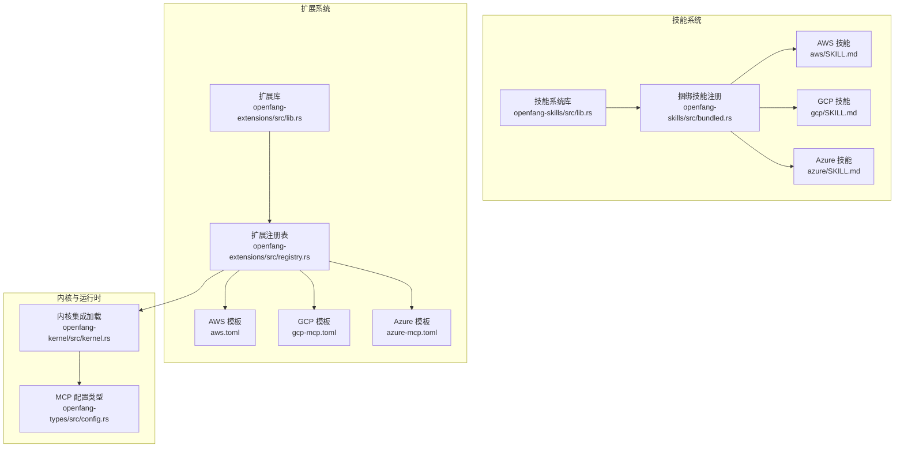
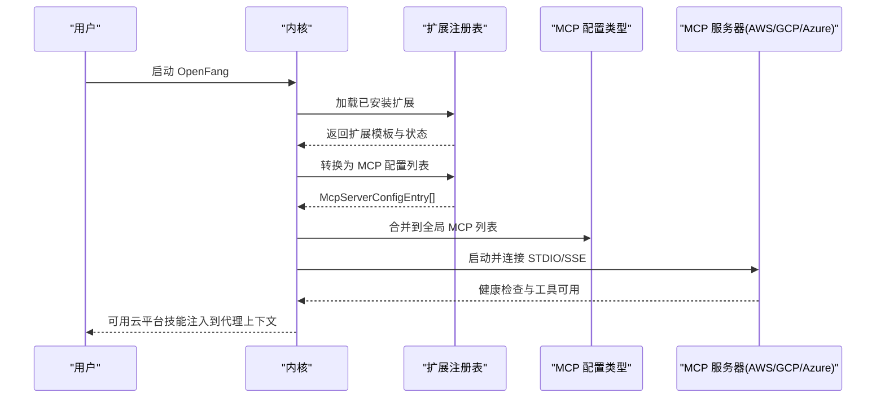
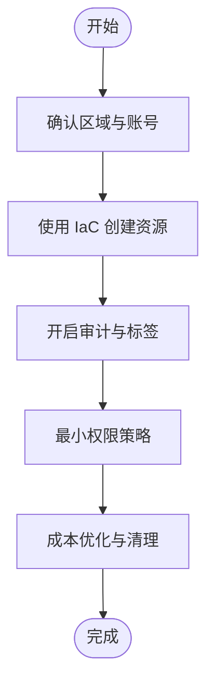
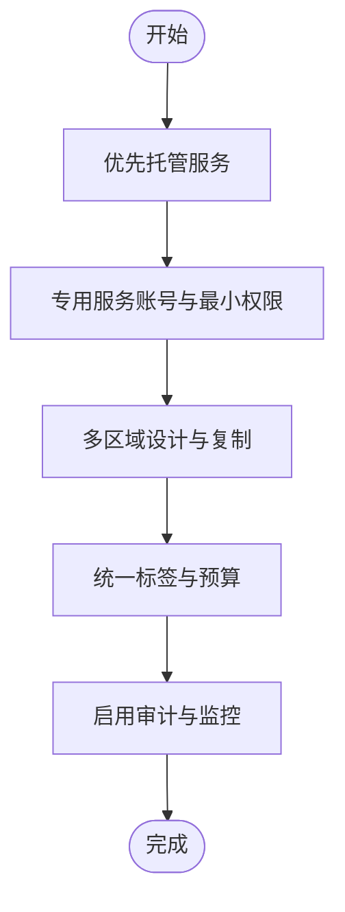
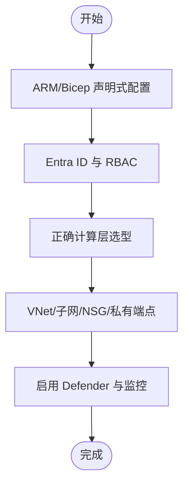
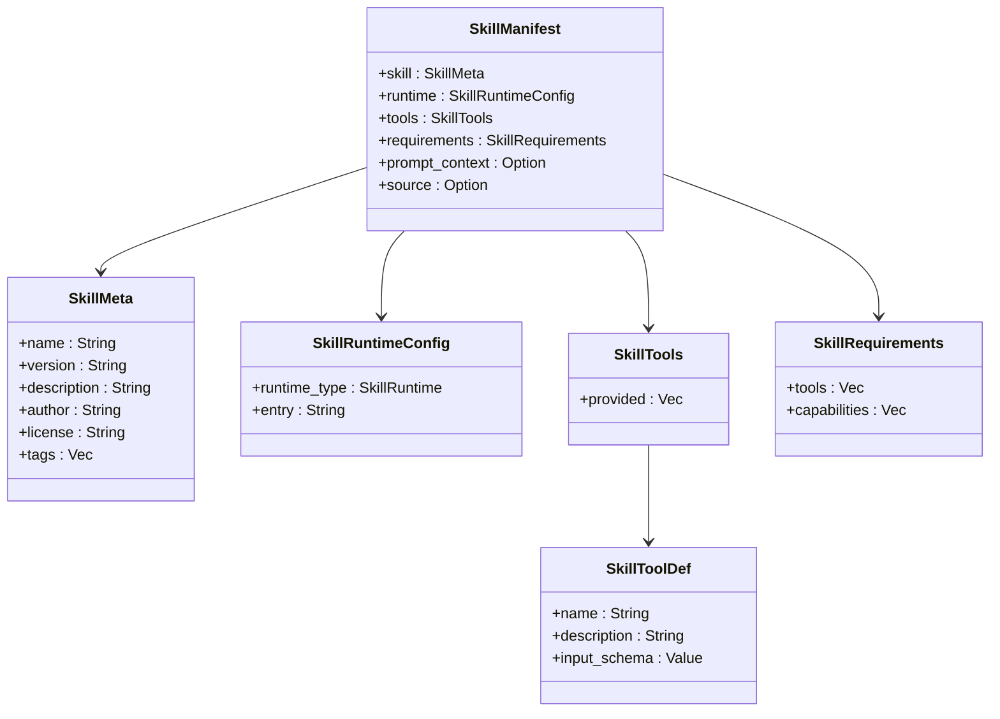
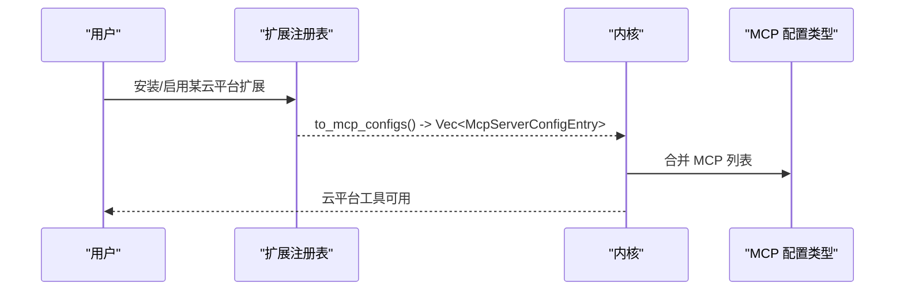
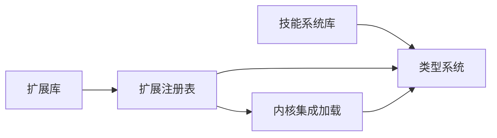

# 云服务技能

<cite>
**本文引用的文件**
- [aws/SKILL.md](file://crates/openfang-skills/bundled/aws/SKILL.md)
- [gcp/SKILL.md](file://crates/openfang-skills/bundled/gcp/SKILL.md)
- [azure/SKILL.md](file://crates/openfang-skills/bundled/azure/SKILL.md)
- [aws.toml](file://crates/openfang-extensions/integrations/aws.toml)
- [gcp-mcp.toml](file://crates/openfang-extensions/integrations/gcp-mcp.toml)
- [azure-mcp.toml](file://crates/openfang-extensions/integrations/azure-mcp.toml)
- [openfang-extensions 库](file://crates/openfang-extensions/src/lib.rs)
- [扩展注册表](file://crates/openfang-extensions/src/registry.rs)
- [内核集成加载](file://crates/openfang-kernel/src/kernel.rs)
- [MCP 服务器配置](file://crates/openfang-types/src/config.rs)
- [技能系统库](file://crates/openfang-skills/src/lib.rs)
- [捆绑技能注册](file://crates/openfang-skills/src/bundled.rs)
- [README 文档](file://README.md)
</cite>

## 目录
1. [简介](#简介)
2. [项目结构](#项目结构)
3. [核心组件](#核心组件)
4. [架构总览](#架构总览)
5. [详细组件分析](#详细组件分析)
6. [依赖关系分析](#依赖关系分析)
7. [性能考量](#性能考量)
8. [故障排除指南](#故障排除指南)
9. [结论](#结论)
10. [附录](#附录)

## 简介
本文件面向 OpenFang 的云服务技能体系，聚焦 AWS、GCP、Azure 三大云平台的技能与集成能力。内容涵盖：
- 平台技能要点：计算、存储、无服务器、数据库、权限与网络等关键领域
- 集成机制：通过 MCP（Model Context Protocol）服务器模板与环境变量进行云平台接入
- 资源配置与成本优化：按平台最佳实践给出原则与模式
- 安全与合规：最小权限、凭据管理、审计与日志
- 实际部署案例与迁移策略：结合 OpenFang 的技能与扩展系统，提供可操作的实施路径

## 项目结构
OpenFang 将“技能”作为可插拔的能力模块注入到代理系统中；同时通过“扩展（Extensions）”提供云平台 MCP 服务器模板，统一以环境变量方式注入凭据，实现即插即用的云平台接入。

**图表来源**
- [技能系统库:1-255](file://crates/openfang-skills/src/lib.rs#L1-L255)
- [捆绑技能注册:75-199](file://crates/openfang-skills/src/bundled.rs#L75-L199)
- [openfang-extensions 库:1-329](file://crates/openfang-extensions/src/lib.rs#L1-L329)
- [扩展注册表:176-213](file://crates/openfang-extensions/src/registry.rs#L176-L213)
- [内核集成加载:793-820](file://crates/openfang-kernel/src/kernel.rs#L793-L820)
- [MCP 服务器配置:1183-1221](file://crates/openfang-types/src/config.rs#L1183-L1221)

**章节来源**
- [技能系统库:1-255](file://crates/openfang-skills/src/lib.rs#L1-L255)
- [捆绑技能注册:75-199](file://crates/openfang-skills/src/bundled.rs#L75-L199)
- [openfang-extensions 库:1-329](file://crates/openfang-extensions/src/lib.rs#L1-L329)
- [扩展注册表:176-213](file://crates/openfang-extensions/src/registry.rs#L176-L213)
- [内核集成加载:793-820](file://crates/openfang-kernel/src/kernel.rs#L793-L820)
- [MCP 服务器配置:1183-1221](file://crates/openfang-types/src/config.rs#L1183-L1221)

## 核心组件
- 技能系统：定义技能清单、运行时类型、工具声明与来源追踪，支持 PromptOnly 等多种运行模式，并内置对 SKILL.md 的解析与注入。
- 扩展系统：提供云平台 MCP 服务器模板，描述如何启动 MCP 服务器、所需环境变量、健康检查与安装指引。
- 内核集成：在启动时加载已安装的扩展，将其转换为 MCP 服务器配置并合并到全局列表，避免重复。
- 类型系统：定义 MCP 服务器配置与传输层（STDIO/SSE），以及超时与环境变量传递策略。

**章节来源**
- [技能系统库:18-123](file://crates/openfang-skills/src/lib.rs#L18-L123)
- [openfang-extensions 库:146-177](file://crates/openfang-extensions/src/lib.rs#L146-L177)
- [扩展注册表:176-208](file://crates/openfang-extensions/src/registry.rs#L176-L208)
- [内核集成加载:793-820](file://crates/openfang-kernel/src/kernel.rs#L793-L820)
- [MCP 服务器配置:1183-1221](file://crates/openfang-types/src/config.rs#L1183-L1221)

## 架构总览
下图展示从“技能”到“扩展模板”，再到“内核加载”的端到端流程，以及 MCP 服务器的运行时交互。

**图表来源**
- [内核集成加载:793-820](file://crates/openfang-kernel/src/kernel.rs#L793-L820)
- [扩展注册表:176-208](file://crates/openfang-extensions/src/registry.rs#L176-L208)
- [MCP 服务器配置:1183-1221](file://crates/openfang-types/src/config.rs#L1183-L1221)

## 详细组件分析

### AWS 技能与集成
- 技能要点
  - 计算：EC2 实例类型选择、自动伸缩组提升弹性
  - 存储：S3 默认启用版本化与加密、生命周期策略与公共访问控制
  - 无服务器：Lambda 函数保持精简、内存与层管理
  - 数据库：RDS/Aurora 多可用区、参数组与自动化备份
  - 网络与安全：VPC 私有子网、NAT 网关与安全组最小暴露
  - 安全：最小权限、临时凭证、条件键与定期审计
  - 成本：成本 Explorer、预算告警、资源清理与节省计划
- 集成方式
  - 通过 MCP 模板启动 AWS MCP 服务器，使用 AWS_ACCESS_KEY_ID、AWS_SECRET_ACCESS_KEY、AWS_REGION 等环境变量
  - 健康检查周期与阈值可配置
- 最佳实践
  - 使用基础设施即代码（CloudFormation/CDK/Terraform）
  - 区域与账号确认优先
  - 严格限制凭据与最小权限

**章节来源**
- [aws/SKILL.md:1-45](file://crates/openfang-skills/bundled/aws/SKILL.md#L1-L45)
- [aws.toml:1-43](file://crates/openfang-extensions/integrations/aws.toml#L1-L43)

### GCP 技能与集成
- 技能要点
  - 优先使用托管服务（Cloud SQL、Pub/Sub、Cloud Run）
  - IAM 最小权限：工作负载使用专用服务账号
  - 多区域可用性：全局负载均衡与跨区复制
  - 标签与预算：一致标签用于计费归集与预算告警
  - 观测性：从第一天启用审计日志与监控告警
- 集成方式
  - 通过 MCP 模板启动 GCP MCP 服务器，使用 GOOGLE_APPLICATION_CREDENTIALS 指向服务账号密钥文件
  - 支持健康检查与安装指引
- 最佳实践
  - 使用 gcloud 配置与 Terraform
  - 避免导出服务账号密钥给应用进程
  - 使用 VPC Service Controls 构建数据安全围栏

**章节来源**
- [gcp/SKILL.md:1-39](file://crates/openfang-skills/bundled/gcp/SKILL.md#L1-L39)
- [gcp-mcp.toml:1-29](file://crates/openfang-extensions/integrations/gcp-mcp.toml#L1-L29)

### Azure 技能与集成
- 技能要点
  - 基于 ARM/Bicep 的声明式基础设施
  - Entra ID（原 Azure AD）集中身份与条件访问策略
  - 计算选型：App Service、AKS、Functions、Container Apps
  - 资源分组与网络：虚拟网络、子网、NSG、私有端点
  - 监控与安全：Microsoft Defender、Azure Monitor、诊断设置
- 集成方式
  - 通过 MCP 模板启动 Azure MCP 服务器，使用订阅、租户、客户端与密钥等环境变量
  - 支持健康检查与安装指引
- 最佳实践
  - 避免经典模型资源
  - 使用托管标识链与 Key Vault 引用
  - Hub-Spoke 网络与 Bicep 模块化

**章节来源**
- [azure/SKILL.md:1-39](file://crates/openfang-skills/bundled/azure/SKILL.md#L1-L39)
- [azure-mcp.toml:1-50](file://crates/openfang-extensions/integrations/azure-mcp.toml#L1-L50)

### 技能系统与捆绑技能
- 技能清单：系统内置 60 个技能，其中包含 AWS、GCP、Azure 技能，作为 Prompt-only 技能注入到代理上下文，指导 LLM 在相应平台上进行架构与运维决策。
- 运行时类型：支持 Python、WASM、Node、Shell、Builtin、PromptOnly 等。
- 工具声明：每个技能可声明其提供的工具与输入模式，便于代理在执行任务时调用。

**图表来源**
- [技能系统库:104-123](file://crates/openfang-skills/src/lib.rs#L104-L123)
- [技能系统库:125-145](file://crates/openfang-skills/src/lib.rs#L125-L145)
- [技能系统库:151-160](file://crates/openfang-skills/src/lib.rs#L151-L160)
- [技能系统库:162-168](file://crates/openfang-skills/src/lib.rs#L162-L168)
- [技能系统库:82-101](file://crates/openfang-skills/src/lib.rs#L82-L101)

**章节来源**
- [技能系统库:1-255](file://crates/openfang-skills/src/lib.rs#L1-L255)
- [捆绑技能注册:75-199](file://crates/openfang-skills/src/bundled.rs#L75-L199)

### 扩展系统与 MCP 模板
- 扩展模板：描述如何启动 MCP 服务器（STDIO/SSE）、所需环境变量、OAuth 配置、健康检查与安装指引。
- 注册表：将已安装扩展转换为 MCP 服务器配置条目，传递必要的环境变量，避免与手动配置冲突。
- 内核集成：在启动阶段合并扩展 MCP 配置到全局列表，确保代理可直接调用云平台工具。

**图表来源**
- [扩展注册表:176-208](file://crates/openfang-extensions/src/registry.rs#L176-L208)
- [内核集成加载:793-820](file://crates/openfang-kernel/src/kernel.rs#L793-L820)
- [MCP 服务器配置:1183-1221](file://crates/openfang-types/src/config.rs#L1183-L1221)

**章节来源**
- [openfang-extensions 库:146-177](file://crates/openfang-extensions/src/lib.rs#L146-L177)
- [扩展注册表:176-213](file://crates/openfang-extensions/src/registry.rs#L176-L213)
- [内核集成加载:793-820](file://crates/openfang-kernel/src/kernel.rs#L793-L820)
- [MCP 服务器配置:1183-1221](file://crates/openfang-types/src/config.rs#L1183-L1221)

## 依赖关系分析
- 技能系统依赖类型系统中的工具与来源追踪定义，扩展系统依赖内核的集成加载逻辑。
- 扩展注册表负责将模板映射为 MCP 服务器配置，内核负责去重与合并。
- MCP 服务器配置类型定义了传输层（STDIO/SSE）与超时策略，确保稳定交互。

**图表来源**
- [技能系统库:1-255](file://crates/openfang-skills/src/lib.rs#L1-L255)
- [openfang-extensions 库:1-329](file://crates/openfang-extensions/src/lib.rs#L1-L329)
- [扩展注册表:176-213](file://crates/openfang-extensions/src/registry.rs#L176-L213)
- [内核集成加载:793-820](file://crates/openfang-kernel/src/kernel.rs#L793-L820)
- [MCP 服务器配置:1183-1221](file://crates/openfang-types/src/config.rs#L1183-L1221)

**章节来源**
- [技能系统库:1-255](file://crates/openfang-skills/src/lib.rs#L1-L255)
- [openfang-extensions 库:1-329](file://crates/openfang-extensions/src/lib.rs#L1-L329)
- [扩展注册表:176-213](file://crates/openfang-extensions/src/registry.rs#L176-L213)
- [内核集成加载:793-820](file://crates/openfang-kernel/src/kernel.rs#L793-L820)
- [MCP 服务器配置:1183-1221](file://crates/openfang-types/src/config.rs#L1183-L1221)

## 性能考量
- 冷启动与内存占用：OpenFang 在同类系统中具备较低冷启动与内存占用，适合长期运行与多代理场景。
- 安全与可观测性：内置 16 层安全系统，包括沙箱、审计链、污点跟踪与回退保护，有助于降低运行风险。
- 成本与资源：建议结合平台成本工具与预算告警，配合资源清理与节省计划，持续优化支出。

**章节来源**
- [README 文档:117-228](file://README.md#L117-L228)

## 故障排除指南
- 扩展未安装或状态异常
  - 检查扩展是否已安装且处于 Ready 状态；若为 Setup，需补齐所需环境变量。
  - 若为 Error，查看健康检查失败原因与阈值。
- 凭据问题
  - AWS：确认 Access Key、Secret Key、Region 是否正确；避免硬编码凭据。
  - GCP：确认 GOOGLE_APPLICATION_CREDENTIALS 指向有效 JSON 密钥文件。
  - Azure：确认订阅、租户、客户端与密钥配置正确。
- 健康检查失败
  - 调整健康检查间隔与不健康阈值；必要时启用探测请求以恢复服务。
- 云平台特定问题
  - AWS：避免安全组全开放敏感端口；启用审计与标签。
  - GCP：避免导出服务账号密钥；使用工作负载身份；自定义 VPC。
  - Azure：避免经典模型；使用托管标识链与私有端点。

**章节来源**
- [openfang-extensions 库:24-48](file://crates/openfang-extensions/src/lib.rs#L24-L48)
- [aws.toml:38-43](file://crates/openfang-extensions/integrations/aws.toml#L38-L43)
- [gcp-mcp.toml:24-29](file://crates/openfang-extensions/integrations/gcp-mcp.toml#L24-L29)
- [azure-mcp.toml:45-50](file://crates/openfang-extensions/integrations/azure-mcp.toml#L45-L50)
- [aws/SKILL.md:39-45](file://crates/openfang-skills/bundled/aws/SKILL.md#L39-L45)
- [gcp/SKILL.md:33-39](file://crates/openfang-skills/bundled/gcp/SKILL.md#L33-L39)
- [azure/SKILL.md:33-39](file://crates/openfang-skills/bundled/azure/SKILL.md#L33-L39)

## 结论
OpenFang 的云服务技能体系通过 Prompt-only 技能与 MCP 扩展模板，将 AWS、GCP、Azure 的最佳实践与操作模式注入到代理上下文中，配合内核的集成加载与类型系统，实现了即插即用的云平台接入。结合平台成本与安全最佳实践，可在保证安全性与可观测性的前提下，高效完成资源编排与运维任务。

## 附录
- 快速开始
  - 初始化与启动：参考项目根目录的快速开始与初始化命令。
  - 启用云平台技能：通过扩展模板安装 AWS/GCP/Azure MCP 服务器，配置所需环境变量后即可使用。
- 参考资料
  - OpenFang 官方文档与架构说明位于项目根目录 README 中。

**章节来源**
- [README 文档:407-431](file://README.md#L407-L431)