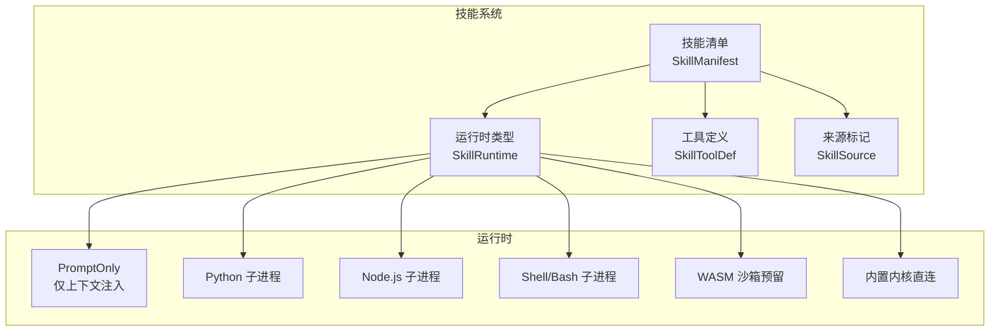
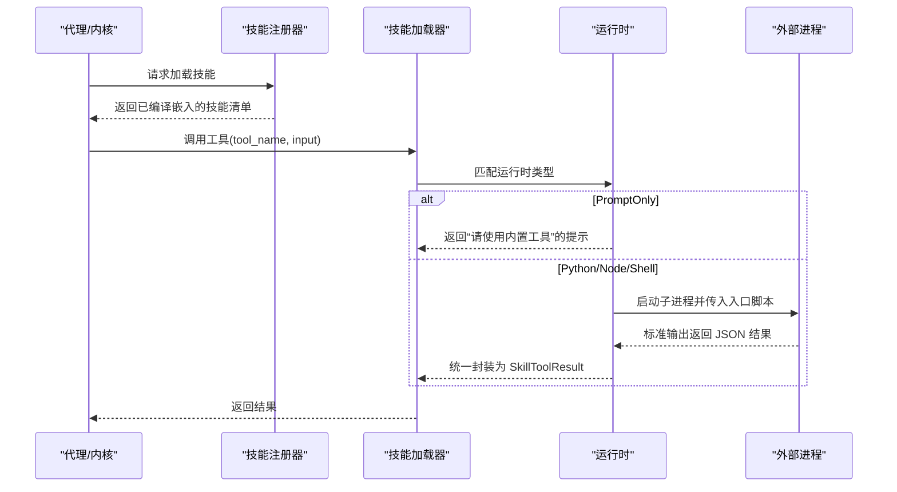
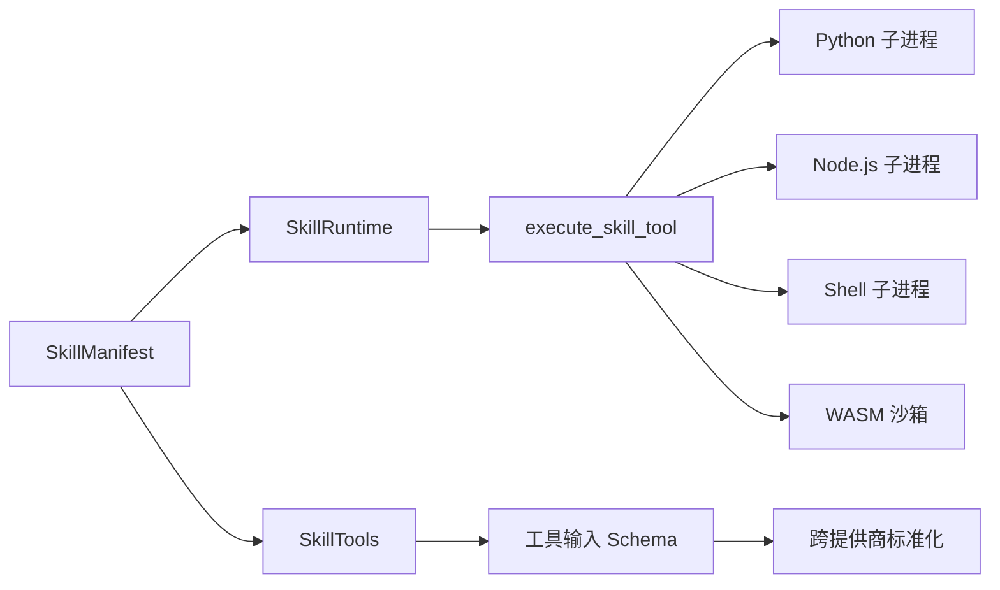

# 代码专家技能

<cite>
**本文引用的文件**
- [SKILL.md（Python 专家）](file://crates/openfang-skills/bundled/python-expert/SKILL.md)
- [SKILL.md（Go 专家）](file://crates/openfang-skills/bundled/golang-expert/SKILL.md)
- [SKILL.md（Rust 专家）](file://crates/openfang-skills/bundled/rust-expert/SKILL.md)
- [SKILL.md（TypeScript 专家）](file://crates/openfang-skills/bundled/typescript-expert/SKILL.md)
- [SKILL.md（CSS 专家）](file://crates/openfang-skills/bundled/css-expert/SKILL.md)
- [SKILL.md（React 专家）](file://crates/openfang-skills/bundled/react-expert/SKILL.md)
- [SKILL.md（Next.js 专家）](file://crates/openfang-skills/bundled/nextjs-expert/SKILL.md)
- [SKILL.md（WASM 专家）](file://crates/openfang-skills/bundled/wasm-expert/SKILL.md)
- [技能系统库入口](file://crates/openfang-skills/src/lib.rs)
- [内置技能注册器](file://crates/openfang-skills/src/bundled.rs)
- [技能加载器](file://crates/openfang-skills/src/loader.rs)
- [工具定义与模式兼容](file://crates/openfang-types/src/tool.rs)
- [示例配置 openfang.toml](file://openfang.toml.example)
</cite>

## 目录
1. [引言](#引言)
2. [项目结构](#项目结构)
3. [核心组件](#核心组件)
4. [架构总览](#架构总览)
5. [详细组件分析](#详细组件分析)
6. [依赖关系分析](#依赖关系分析)
7. [性能考量](#性能考量)
8. [故障排查指南](#故障排查指南)
9. [结论](#结论)
10. [附录](#附录)

## 引言
本文件面向 OpenFang 的“代码专家技能”体系，系统化梳理并解读以下专家级能力：Python 专家、Go 专家、Rust 专家、TypeScript 专家、CSS 专家、React 专家、Next.js 专家、WASM 专家。文档从架构、数据流、处理逻辑、集成点、错误处理与性能优化等维度展开，并提供协同使用与组合策略建议，帮助读者在不同技术栈与场景中高效落地。

## 项目结构
OpenFang 将“技能”作为可插拔的工具包，通过统一的清单（manifest）与运行时类型，支持多种语言与执行环境。专家技能以 Markdown 描述注入到系统提示词中，或以脚本形式由对应运行时执行。

图表来源
- [技能系统库入口:48-66](file://crates/openfang-skills/src/lib.rs#L48-L66)
- [技能加载器:9-51](file://crates/openfang-skills/src/loader.rs#L9-L51)

章节来源
- [技能系统库入口:1-255](file://crates/openfang-skills/src/lib.rs#L1-L255)
- [内置技能注册器:1-298](file://crates/openfang-skills/src/bundled.rs#L1-L298)
- [技能加载器:1-462](file://crates/openfang-skills/src/loader.rs#L1-L462)

## 核心组件
- 技能清单（SkillManifest）：描述技能元数据、运行时配置、提供的工具、需求与来源。
- 运行时类型（SkillRuntime）：决定如何执行技能，包括 PromptOnly、Python、Node、Shell、WASM、Builtin。
- 工具定义（SkillToolDef）：声明工具名称、描述与输入 JSON Schema。
- 加载器（execute_skill_tool）：根据运行时类型选择子进程或沙箱执行，传递工具名与输入 JSON。
- 内置技能注册器：编译期嵌入多份专家技能 Markdown，按名称索引并解析为清单。
- 工具类型与模式兼容：对跨模型提供商的 JSON Schema 做标准化处理，提升工具调用稳定性。

章节来源
- [技能系统库入口:104-123](file://crates/openfang-skills/src/lib.rs#L104-L123)
- [技能加载器:9-51](file://crates/openfang-skills/src/loader.rs#L9-L51)
- [内置技能注册器:9-189](file://crates/openfang-skills/src/bundled.rs#L9-L189)
- [工具定义与模式兼容:5-173](file://crates/openfang-types/src/tool.rs#L5-L173)

## 架构总览
下图展示从“专家技能”到“运行时执行”的端到端流程，涵盖 PromptOnly 注入与多语言子进程执行路径。

图表来源
- [内置技能注册器:10-189](file://crates/openfang-skills/src/bundled.rs#L10-L189)
- [技能加载器:9-51](file://crates/openfang-skills/src/loader.rs#L9-L51)
- [技能系统库入口:48-66](file://crates/openfang-skills/src/lib.rs#L48-L66)

## 详细组件分析

### Python 专家
- 核心功能
  - 标准库与现代打包：以 pyproject.toml 为单一事实源；依赖解析与锁定。
  - 类型注解与异步：强类型签名、async/await 并发、事件循环与线程/进程选择。
  - 性能优化：剖析瓶颈、惰性求值、上下文管理器、结构化日志与 CLI 工具。
- 适用场景
  - 数据分析流水线、自动化脚本、Web 后端（配合其他专家技能）。
- 配置参数
  - 运行时类型：Python
  - 入口脚本：相对路径（如 Python 文件）
  - 工具输入：JSON Schema 定义
- 最佳实践
  - 使用 dataclass/pydantic 简化数据建模；优先组合优于继承；避免可变默认参数。
  - 显式资源生命周期管理；单元测试与表驱动测试。
- 性能优化
  - 使用 cProfile/line_profiler 定位热点；合理选择并发模型（IO 并发 vs CPU 并发）。
- 协同策略
  - 与 Next.js/React 专家结合构建全栈；与 WASM 专家结合高性能计算模块。

章节来源
- [SKILL.md（Python 专家）:1-39](file://crates/openfang-skills/bundled/python-expert/SKILL.md#L1-L39)
- [技能系统库入口:48-66](file://crates/openfang-skills/src/lib.rs#L48-L66)
- [技能加载器:53-157](file://crates/openfang-skills/src/loader.rs#L53-L157)

### Go 专家
- 核心功能
  - 并发原语：goroutine、channel、上下文传播；fan-out/fan-in、错误组。
  - 接口与模块：清晰的接口/实现边界；包命名与职责划分。
  - 错误处理：错误链封装、类型检查；显式错误处理。
- 适用场景
  - 微服务后端、高并发中间件、系统工具。
- 配置参数
  - 运行时类型：Go（当前以 PromptOnly 文本注入为主）
  - 若扩展为脚本运行，需定义入口与工具清单。
- 最佳实践
  - 明确关闭通道的“完成信号”；函数式选项模式；中间件链组合。
- 性能优化
  - 合理使用 sync.Once/sync.Map/sync.Pool；避免在 goroutine 中共享循环变量。
- 协同策略
  - 与 Next.js 专家结合构建 SSR/ISR 场景；与 WASM 专家结合边缘计算。

章节来源
- [SKILL.md（Go 专家）:1-39](file://crates/openfang-skills/bundled/golang-expert/SKILL.md#L1-L39)
- [技能系统库入口:48-66](file://crates/openfang-skills/src/lib.rs#L48-L66)

### Rust 专家
- 核心功能
  - 所有权与生命周期：最小化借用、枚举表达不变量；安全与性能兼顾。
  - 异步与并发：Tokio 任务、通道、Pin<Box<dyn Future>>；trait 设计。
  - 不安全代码：仅在必要时使用并详尽注释安全前提。
- 适用场景
  - 系统编程、WebAssembly、高性能计算内核。
- 配置参数
  - 运行时类型：Rust（当前以 PromptOnly 文本注入为主）
  - 若扩展为脚本运行，需定义入口与工具清单。
- 最佳实践
  - Builder/Newtype/RAII/GAT 等模式；错误类型统一；宏简化重复代码。
- 性能优化
  - 避免无谓克隆；谨慎持有 MutexGuard 跨 await；Pin 与内存布局。
- 协同策略
  - 与 WASM 专家结合构建组件模型；与 Next.js 专家结合服务端渲染。

章节来源
- [SKILL.md（Rust 专家）:1-39](file://crates/openfang-skills/bundled/rust-expert/SKILL.md#L1-L39)
- [技能系统库入口:48-66](file://crates/openfang-skills/src/lib.rs#L48-L66)

### TypeScript 专家
- 核心功能
  - 类型系统：严格模式、泛型约束、条件类型、映射类型；判别联合与类型守卫。
  - 品牌化类型与模板字面量类型：防止语义混淆；URL/路由类型安全。
- 适用场景
  - 前端/全栈应用、SDK/工具库、类型驱动的 API 设计。
- 配置参数
  - 运行时类型：PromptOnly（当前以文本注入为主）
  - 可扩展为 Node 脚本运行时，定义工具与输入 Schema。
- 最佳实践
  - 启用严格标志；避免 any；使用 discriminated union；模板字面量类型。
- 性能优化
  - 减少运行时类型断言；利用编译期推导；Tree-shaking 友好的枚举替代。
- 协同策略
  - 与 React/Next.js 专家组合构建类型安全的 UI 与数据层。

章节来源
- [SKILL.md（TypeScript 专家）:1-39](file://crates/openfang-skills/bundled/typescript-expert/SKILL.md#L1-L39)
- [技能系统库入口:48-66](file://crates/openfang-skills/src/lib.rs#L48-L66)

### CSS 专家
- 核心功能
  - 布局与动画：Flexbox/Grid、容器查询、关键帧动画；逻辑属性与层叠控制。
  - 主题与响应式：自定义属性、流体排版、暗色切换。
- 适用场景
  - 响应式站点、组件库样式、无障碍设计。
- 配置参数
  - 运行时类型：PromptOnly（当前以文本注入为主）
- 最佳实践
  - 移动优先、层叠控制、GPU 加速动画、:has/:is 降低特异性。
- 性能优化
  - 避免固定像素布局；合理使用 z-index；减少重绘重排。
- 协同策略
  - 与 React/Next.js 专家结合，构建可复用的样式与主题系统。

章节来源
- [SKILL.md（CSS 专家）:1-40](file://crates/openfang-skills/bundled/css-expert/SKILL.md#L1-L40)
- [技能系统库入口:48-66](file://crates/openfang-skills/src/lib.rs#L48-L66)

### React 专家
- 核心功能
  - Hooks 与状态：useState/useReducer/useEffect；memo 与回调稳定化。
  - 组件架构：组合优于钻取；可控组件；乐观更新；键控重置。
- 适用场景
  - 复杂交互 UI、表单与数据展示、可访问性优先。
- 配置参数
  - 运行时类型：PromptOnly（当前以文本注入为主）
- 最佳实践
  - Server Components 默认；避免条件/循环内钩子；派生状态用 useMemo。
- 性能优化
  - 合理使用 memo 与 lazy；避免渲染中创建新对象；Suspense 代码分割。
- 协同策略
  - 与 Next.js 专家结合 App Router 与流式渲染。

章节来源
- [SKILL.md（React 专家）:1-39](file://crates/openfang-skills/bundled/react-expert/SKILL.md#L1-L39)
- [技能系统库入口:48-66](file://crates/openfang-skills/src/lib.rs#L48-L66)

### Next.js 专家
- 核心功能
  - App Router：路由分段、并行路由、拦截路由；Server Actions；流式 Suspense。
  - SSR/SSG/ISR：静态生成、按需重建、缓存与失效。
- 适用场景
  - SEO 友好、首屏性能、动态内容与后台管理。
- 配置参数
  - 运行时类型：PromptOnly（当前以文本注入为主）
- 最佳实践
  - 默认 Server Components；小客户端包；正确设置缓存头。
- 性能优化
  - 图片与字体优化；并行数据获取；增量静态再生。
- 协同策略
  - 与 React 专家结合构建 UI；与 Go/Rust 专家结合服务端逻辑。

章节来源
- [SKILL.md（Next.js 专家）:1-40](file://crates/openfang-skills/bundled/nextjs-expert/SKILL.md#L1-L40)
- [技能系统库入口:48-66](file://crates/openfang-skills/src/lib.rs#L48-L66)

### WASM 专家
- 核心功能
  - 编译与运行：Rust/C 编译至 Wasm；WASI 服务器端；组件模型与 WIT。
  - 集成与优化：wasm-bindgen 互操作；wasm-tools 组合；SIMD 与内存映射。
- 适用场景
  - 浏览器高性能计算、插件架构、跨语言组合。
- 配置参数
  - 运行时类型：PromptOnly（当前以文本注入为主）
  - 若扩展为脚本运行，需定义入口与工具清单。
- 最佳实践
  - 明确能力导入；二进制尺寸优化；线性内存分配策略。
- 性能优化
  - 流式编译；SIMD 向量化；共享内存；运行时一致性测试。
- 协同策略
  - 与 Rust/Go 专家结合构建组件；与 Next.js/React 专家结合前端集成。

章节来源
- [SKILL.md（WASM 专家）:1-40](file://crates/openfang-skills/bundled/wasm-expert/SKILL.md#L1-L40)
- [技能系统库入口:48-66](file://crates/openfang-skills/src/lib.rs#L48-L66)

## 依赖关系分析
- 技能清单与运行时耦合度低：通过枚举区分执行路径，便于扩展新运行时。
- PromptOnly 技能与内核紧密协作：直接注入上下文，不依赖外部进程。
- Python/Node/Shell 运行时依赖宿主环境：加载器负责隔离环境变量并传递 JSON 输入。
- 工具 Schema 标准化：跨模型提供商的兼容层，减少因 Schema 关键字差异导致的失败。

图表来源
- [技能系统库入口:48-66](file://crates/openfang-skills/src/lib.rs#L48-L66)
- [技能加载器:9-51](file://crates/openfang-skills/src/loader.rs#L9-L51)
- [工具定义与模式兼容:45-173](file://crates/openfang-types/src/tool.rs#L45-L173)

章节来源
- [技能系统库入口:1-255](file://crates/openfang-skills/src/lib.rs#L1-L255)
- [技能加载器:1-462](file://crates/openfang-skills/src/loader.rs#L1-L462)
- [工具定义与模式兼容:1-650](file://crates/openfang-types/src/tool.rs#L1-L650)

## 性能考量
- PromptOnly 技能零运行时开销，适合高频上下文注入。
- Python/Node/Shell 技能通过子进程隔离，注意进程启动与 I/O 成本；建议批量调用与复用。
- WASM 技能在浏览器端具备快速启动优势，但需关注二进制大小与内存增长。
- 工具 Schema 标准化减少模型拒绝与重试，提升吞吐。

## 故障排查指南
- 运行时不可用
  - 症状：提示“运行时不可用”
  - 排查：确认宿主是否安装对应运行时（Python/Node/Bash），或等待 WASM 运行时实现。
- 工具未找到
  - 症状：提示工具不在清单中
  - 排查：核对工具名与清单 provided 列表一致。
- 子进程失败
  - 症状：stderr 输出错误信息
  - 排查：检查脚本路径、权限、依赖与环境变量；查看加载器日志。
- WASM 运行时未实现
  - 症状：提示“WASM 技能运行时尚未实现”
  - 排查：当前 WASM 运行时为预留，后续版本将支持沙箱执行。

章节来源
- [技能加载器:34-39](file://crates/openfang-skills/src/loader.rs#L34-L39)
- [技能加载器:16-22](file://crates/openfang-skills/src/loader.rs#L16-L22)
- [技能加载器:136-143](file://crates/openfang-skills/src/loader.rs#L136-L143)

## 结论
OpenFang 的“代码专家技能”以统一的清单与运行时抽象，将多语言能力与前端/后端/系统场景有机整合。通过 PromptOnly 注入与多运行时执行，既保证了灵活性，也确保了安全性与可维护性。建议在实际项目中，依据场景选择合适的专家技能组合，并结合性能与安全最佳实践持续优化。

## 附录
- 示例配置参考
  - [示例配置 openfang.toml:1-49](file://openfang.toml.example#L1-L49)
- 内置技能清单
  - [内置技能注册器:10-189](file://crates/openfang-skills/src/bundled.rs#L10-L189)