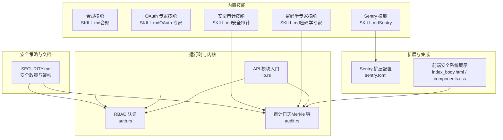
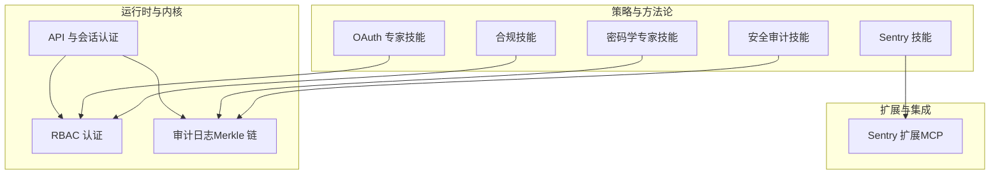
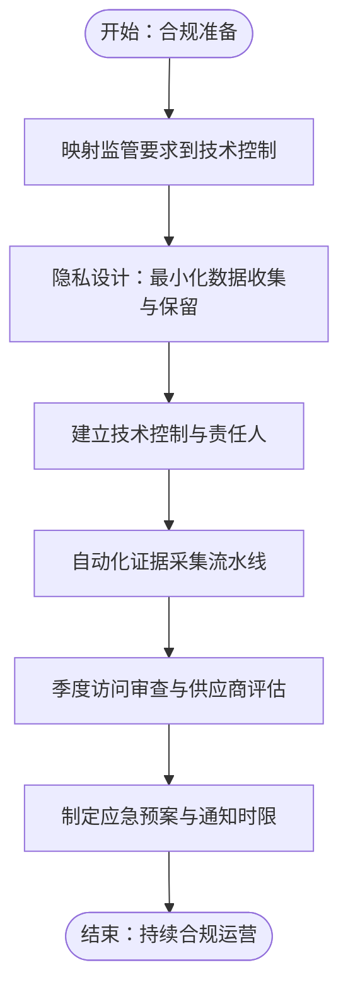
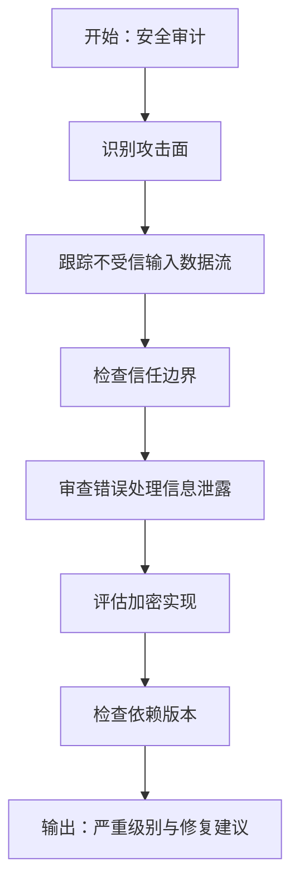
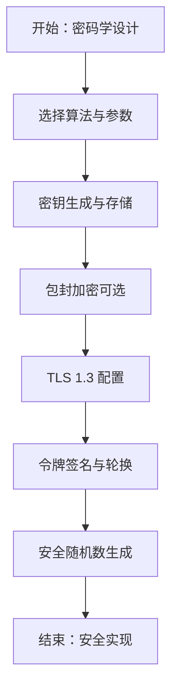
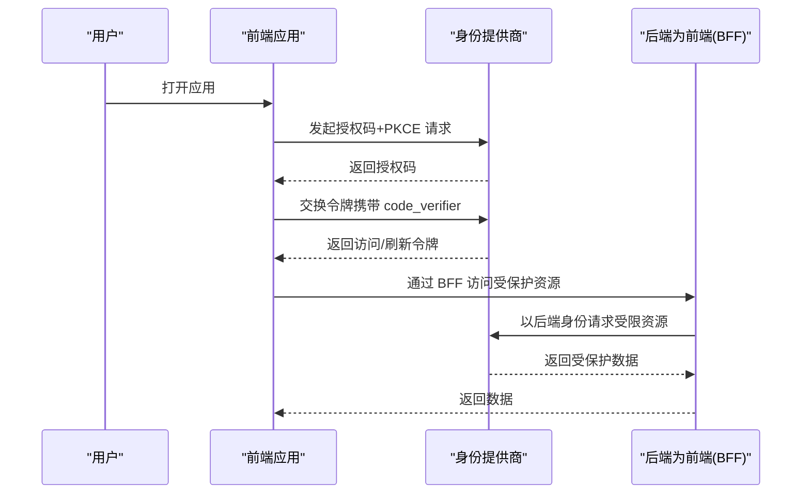
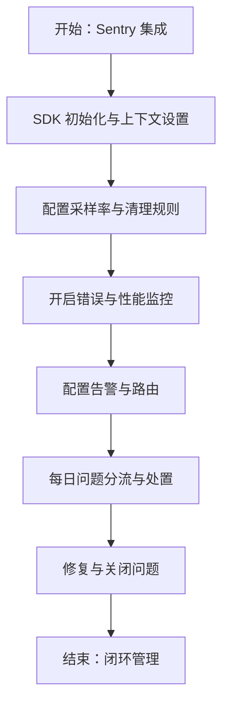
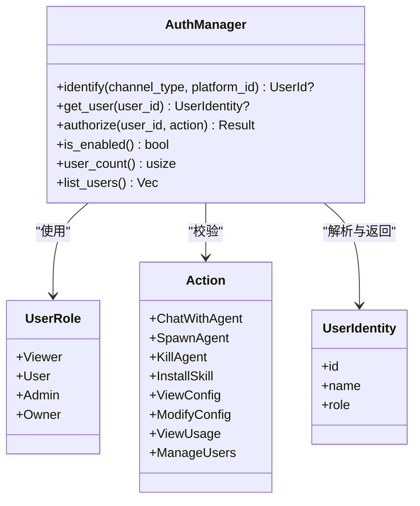
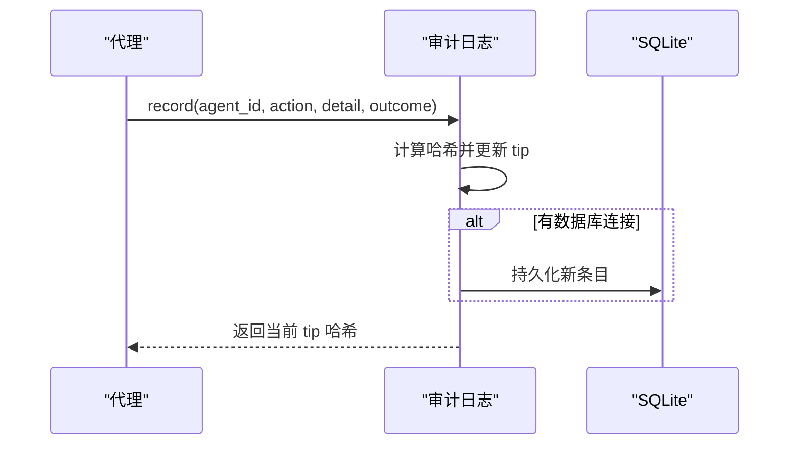
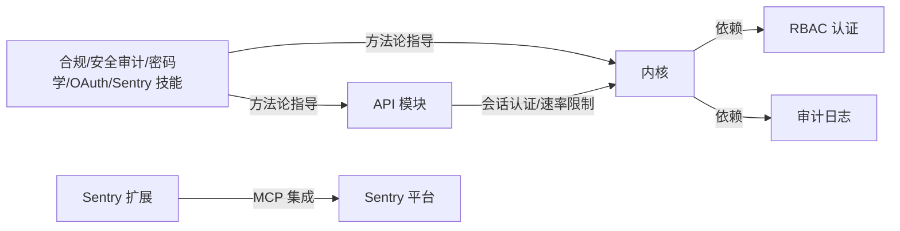

# 安全合规技能

<cite>
**本文引用的文件**
- [SECURITY.md](file://SECURITY.md)
- [SKILL.md（合规）](file://crates/openfang-skills/bundled/compliance/SKILL.md)
- [SKILL.md（安全审计）](file://crates/openfang-skills/bundled/security-audit/SKILL.md)
- [SKILL.md（密码学专家）](file://crates/openfang-skills/bundled/crypto-expert/SKILL.md)
- [SKILL.md（OAuth 专家）](file://crates/openfang-skills/bundled/oauth-expert/SKILL.md)
- [SKILL.md（Sentry）](file://crates/openfang-skills/bundled/sentry/SKILL.md)
- [agent.toml（安全审计员）](file://agents/security-auditor/agent.toml)
- [auth.rs](file://crates/openfang-kernel/src/auth.rs)
- [audit.rs](file://crates/openfang-runtime/src/audit.rs)
- [sentry.toml](file://crates/openfang-extensions/integrations/sentry.toml)
- [index_body.html](file://crates/openfang-api/static/index_body.html)
- [components.css](file://crates/openfang-api/static/css/components.css)
- [lib.rs（API 模块入口）](file://crates/openfang-api/src/lib.rs)
</cite>

## 目录
1. [简介](#简介)
2. [项目结构](#项目结构)
3. [核心组件](#核心组件)
4. [架构总览](#架构总览)
5. [详细组件分析](#详细组件分析)
6. [依赖关系分析](#依赖关系分析)
7. [性能考量](#性能考量)
8. [故障排查指南](#故障排查指南)
9. [结论](#结论)
10. [附录](#附录)

## 简介
本文件面向 OpenFang 的“安全合规技能”主题，系统化梳理并输出以下能力体系与工程实践：
- 合规审计技能：安全标准检查、风险评估、合规报告、政策执行
- 安全审计技能：漏洞扫描、渗透测试、日志分析、威胁检测
- 密码学专家技能：加密算法、数字签名、密钥管理、区块链应用
- OAuth 专家技能：认证授权、令牌管理、单点登录、API 安全
- Sentry 技能：错误监控、性能追踪、告警通知、问题诊断

同时，结合 OpenFang 已实现的安全基线（访问控制、输入验证、加密安全、运行时隔离、网络与审计等），给出安全策略实施、威胁建模、合规要求、安全最佳实践、安全事件响应流程、渗透测试方法与安全加固指南。

## 项目结构
围绕“安全合规技能”，OpenFang 在代码库中提供了多处直接支撑：
- 安全策略与架构：在项目根部的安全政策与声明中，明确了支持版本、漏洞上报流程、安全架构与关键依赖。
- 技能与工具：内置合规、安全审计、密码学、OAuth、Sentry 等技能说明文件，提供可操作的方法论与最佳实践。
- 运行时与内核：内核实现了基于角色的访问控制（RBAC）、审计日志（Merkle 哈希链）等安全机制；API 层暴露了会话认证、速率限制等能力。
- 扩展与集成：通过扩展注册表与 MCP 集成模板，支持对接 Sentry 等外部安全与可观测性平台。

**图表来源**
- [SECURITY.md:1-95](file://SECURITY.md#L1-L95)
- [SKILL.md（合规）:1-39](file://crates/openfang-skills/bundled/compliance/SKILL.md#L1-L39)
- [SKILL.md（安全审计）:1-31](file://crates/openfang-skills/bundled/security-audit/SKILL.md#L1-L31)
- [SKILL.md（密码学专家）:1-39](file://crates/openfang-skills/bundled/crypto-expert/SKILL.md#L1-L39)
- [SKILL.md（OAuth 专家）:1-39](file://crates/openfang-skills/bundled/oauth-expert/SKILL.md#L1-L39)
- [SKILL.md（Sentry）:1-53](file://crates/openfang-skills/bundled/sentry/SKILL.md#L1-L53)
- [auth.rs:1-317](file://crates/openfang-kernel/src/auth.rs#L1-L317)
- [audit.rs:1-423](file://crates/openfang-runtime/src/audit.rs#L1-L423)
- [lib.rs（API 模块入口）:1-18](file://crates/openfang-api/src/lib.rs#L1-L18)
- [sentry.toml:1-36](file://crates/openfang-extensions/integrations/sentry.toml#L1-L36)
- [index_body.html:387-405](file://crates/openfang-api/static/index_body.html#L387-L405)
- [components.css:1440-1513](file://crates/openfang-api/static/css/components.css#L1440-L1513)

**章节来源**
- [SECURITY.md:1-95](file://SECURITY.md#L1-L95)
- [SKILL.md（合规）:1-39](file://crates/openfang-skills/bundled/compliance/SKILL.md#L1-L39)
- [SKILL.md（安全审计）:1-31](file://crates/openfang-skills/bundled/security-audit/SKILL.md#L1-L31)
- [SKILL.md（密码学专家）:1-39](file://crates/openfang-skills/bundled/crypto-expert/SKILL.md#L1-L39)
- [SKILL.md（OAuth 专家）:1-39](file://crates/openfang-skills/bundled/oauth-expert/SKILL.md#L1-L39)
- [SKILL.md（Sentry）:1-53](file://crates/openfang-skills/bundled/sentry/SKILL.md#L1-L53)
- [auth.rs:1-317](file://crates/openfang-kernel/src/auth.rs#L1-L317)
- [audit.rs:1-423](file://crates/openfang-runtime/src/audit.rs#L1-L423)
- [lib.rs（API 模块入口）:1-18](file://crates/openfang-api/src/lib.rs#L1-L18)
- [sentry.toml:1-36](file://crates/openfang-extensions/integrations/sentry.toml#L1-L36)
- [index_body.html:387-405](file://crates/openfang-api/static/index_body.html#L387-L405)
- [components.css:1440-1513](file://crates/openfang-api/static/css/components.css#L1440-L1513)

## 核心组件
- 基于角色的访问控制（RBAC）
  - 实现用户角色与权限动作映射，支持最小权限原则与权限校验。
  - 支持从渠道标识解析用户身份，并进行统一授权。
- 审计日志（Merkle 哈希链）
  - 对安全关键事件进行不可篡改记录，支持内存与持久化存储，提供完整性校验。
- 安全策略与合规框架
  - 提供 SOC 2、GDPR、HIPAA、PCI-DSS 等合规要点与证据收集模式。
- 安全审计与渗透测试方法
  - OWASP Top 10、CVE 分析、SAST/DAST、依赖审计、威胁建模（STRIDE）。
- 密码学与密钥管理
  - 推荐算法与实现模式（AEAD、Ed25519、TLS 1.3、Argon2id、Envelope Encryption）。
- OAuth 2.0/OpenID Connect
  - 授权码流程 + PKCE、令牌生命周期、后端为前端（BFF）模式、设备授权流程。
- Sentry 集成与使用
  - SDK 初始化、上下文设置、采样率、告警配置、性能监控与调试流程。

**章节来源**
- [auth.rs:1-317](file://crates/openfang-kernel/src/auth.rs#L1-L317)
- [audit.rs:1-423](file://crates/openfang-runtime/src/audit.rs#L1-L423)
- [SKILL.md（合规）:1-39](file://crates/openfang-skills/bundled/compliance/SKILL.md#L1-L39)
- [SKILL.md（安全审计）:1-31](file://crates/openfang-skills/bundled/security-audit/SKILL.md#L1-L31)
- [SKILL.md（密码学专家）:1-39](file://crates/openfang-skills/bundled/crypto-expert/SKILL.md#L1-L39)
- [SKILL.md（OAuth 专家）:1-39](file://crates/openfang-skills/bundled/oauth-expert/SKILL.md#L1-L39)
- [SKILL.md（Sentry）:1-53](file://crates/openfang-skills/bundled/sentry/SKILL.md#L1-L53)

## 架构总览
下图展示了 OpenFang 在“安全合规技能”方面的整体架构：策略与方法论（内置技能）、运行时安全（RBAC、审计）、API 与会话、以及与外部平台（如 Sentry）的集成。

**图表来源**
- [SKILL.md（合规）:1-39](file://crates/openfang-skills/bundled/compliance/SKILL.md#L1-L39)
- [SKILL.md（安全审计）:1-31](file://crates/openfang-skills/bundled/security-audit/SKILL.md#L1-L31)
- [SKILL.md（密码学专家）:1-39](file://crates/openfang-skills/bundled/crypto-expert/SKILL.md#L1-L39)
- [SKILL.md（OAuth 专家）:1-39](file://crates/openfang-skills/bundled/oauth-expert/SKILL.md#L1-L39)
- [SKILL.md（Sentry）:1-53](file://crates/openfang-skills/bundled/sentry/SKILL.md#L1-L53)
- [auth.rs:1-317](file://crates/openfang-kernel/src/auth.rs#L1-L317)
- [audit.rs:1-423](file://crates/openfang-runtime/src/audit.rs#L1-L423)
- [sentry.toml:1-36](file://crates/openfang-extensions/integrations/sentry.toml#L1-L36)

## 详细组件分析

### 合规审计技能
- 关键要点
  - 将监管要求映射到技术控制与责任人，持续嵌入日常运营与 CI/CD。
  - 隐私设计：仅收集必要数据、明确目的、按类别设定保留期并通过 TTL/归档自动化执行。
  - 建立风险登记册并季度评审，文档化所有政策、程序、例外与控制执行证据。
- 常见模式
  - 自动化证据采集流水线：定期导出访问日志、变更记录与配置快照至抗篡改存储。
  - 访问审查节奏：对含敏感数据的系统每季度开展访问审查，经理确认与整改陈旧权限。
  - 供应商风险评估：维护供应商清单，完成安全问卷、SOC 2 报告审阅与数据处理协议。
  - 应急预案：定义检测、遏制、清除、恢复与通知步骤，并满足各法规时限（如 GDPR 72 小时、HIPAA 60 天）。
- 风险规避
  - 不将合规视为法务或安全部门独责，工程需负责技术控制与运营证据。
  - 不在无合法基础的情况下收集个人数据。
  - 不认为云厂商认证覆盖应用自身配置与数据安全。
  - 不跳过定期渗透测试与漏洞评估。

**图表来源**
- [SKILL.md（合规）:1-39](file://crates/openfang-skills/bundled/compliance/SKILL.md#L1-L39)

**章节来源**
- [SKILL.md（合规）:1-39](file://crates/openfang-skills/bundled/compliance/SKILL.md#L1-L39)

### 安全审计技能
- 关键原则
  - 深度防御：单一控制不应成为唯一屏障。
  - 输入验证与输出净化：在信任边界验证输入，在渲染边界净化输出。
  - 最小权限：认证、授权、文件系统与网络连接均遵循最小权限。
  - 使用成熟密码库，避免自行实现算法。
  - 假设已泄露：设计快速检测与遏制的日志、监控与应急响应。
- 技术手段
  - 在 CI 中使用 SAST（Semgrep、CodeQL、Bandit）发现注入、硬编码凭据与不安全反序列化。
  - 在预发环境使用 DAST（OWASP ZAP、Burp Suite）发现 CORS、头注入等运行时漏洞。
  - 使用 npm audit、cargo audit、pip-audit 或 Snyk 扫描传递依赖中的已知 CVE。
  - 审查认证流：会话固定、凭据填充防护（限速、验证码）、安全令牌存储（HttpOnly、Secure、SameSite）。
  - 使用 STRIDE 进行新功能威胁建模。
  - 检查授权逻辑：通过所有权而非仅认证防止 IDOR。
- 常见模式
  - 输入验证层：在 API 边界使用 JSON Schema、Zod、pydantic 等进行类型、长度、格式与范围校验。
  - 参数化查询：使用预编译语句或 ORM 查询构建器，杜绝 SQL 字符串拼接。
  - 内容安全策略（CSP）：默认仅自站资源，显式白名单脚本、样式与图片以缓解 XSS。
  - 凭据轮转：通过密钥管理服务（Vault、AWS Secrets Manager）实现无需停机的凭据轮换。

**图表来源**
- [SKILL.md（安全审计）:1-31](file://crates/openfang-skills/bundled/security-audit/SKILL.md#L1-L31)

**章节来源**
- [SKILL.md（安全审计）:1-31](file://crates/openfang-skills/bundled/security-audit/SKILL.md#L1-L31)

### 密码学专家技能
- 关键原则
  - 不自行实现加密算法，优先使用经审计的库（OpenSSL、libsodium、ring、RustCrypto）。
  - 选择最高级 API：优先 AEAD 而非“先加密再 MAC”组合。
  - 设计加密敏捷：在密文中标注算法标识以便迁移。
  - 保护密钥：HSM/KMS 或至少使用带包封加密的密钥存储。
  - 使用 CSPRNG 生成随机值，避免使用 Math.random() 或 rand()。
- 技术要点
  - 对称加密：硬件 AES-NI 可用时选 AES-256-GCM；无硬件加速时选 ChaCha20-Poly1305。
  - 数字签名：Ed25519 优于 RSA（128 位安全、常数时间、更小密钥）。
  - TLS 1.3：启用 ssl_protocols TLSv1.3，限制套件，前向保密基于临时密钥交换。
  - 密码散列：使用 Argon2id（首选）、bcrypt 或 scrypt，设置合适成本参数。
  - 子密钥派生：使用 HKDF（带域上下文字符串）从主密钥派生子密钥。
  - HMAC 比较：使用常量时间比较函数防止侧信道攻击。
- 常见模式
  - 包封加密（Envelope Encryption）：数据加密密钥（DEK）由密钥加密密钥（KEK）加密，KEK 存于 KMS，便于轮转而不重加密全部数据。
  - 证书固定（Pinning）：固定受信 CA 公钥哈希，防止中间人攻击；包含备用固定值用于轮换。
  - 令牌签名：JWT 使用 Ed25519（EdDSA）或 ES256，短有效期 + 刷新令牌；设置短期过期与滑动窗口刷新。
  - 安全随机标识：使用系统 CSPRNG 生成会话 ID、API 令牌与随机数，采用十六进制或 base64url 编码。
- 风险规避
  - 不使用 ECB 模式；它会泄露明文块模式。
  - 不在相同密钥下复用随机数（nonce）；会破坏真实性并可能泄露认证密钥。
  - 不使用字符串比较比较 HMAC 或哈希；应使用常量时间比较。
  - 不仅依赖加密而忽略认证；总是使用 AEAD 或“加密后加 MAC”。

**图表来源**
- [SKILL.md（密码学专家）:1-39](file://crates/openfang-skills/bundled/crypto-expert/SKILL.md#L1-L39)

**章节来源**
- [SKILL.md（密码学专家）:1-39](file://crates/openfang-skills/bundled/crypto-expert/SKILL.md#L1-L39)

### OAuth 专家技能
- 关键原则
  - 对公共客户端（SPA、移动端、CLI）始终使用授权码 + PKCE；隐式流已弃用且不安全。
  - 严格验证 JWT：检查签名算法、签发者、受众、过期与生效时间。
  - 作用域细化：以具体权限（read:documents、write:orders）代替宽泛角色。
  - 安全存储令牌：Web 应用用 HttpOnly 安全 Cookie，移动端用安全存储 API，服务端用加密凭据存储。
  - 刷新令牌高敏：绑定客户端、使用后轮换、设置合理绝对过期。
- 技术要点
  - 授权码 + PKCE：生成随机 code_verifier，S256 派生 code_challenge，授权请求发送挑战，令牌交换时提交 verifer。
  - 客户端凭证：无用户上下文的服务间认证使用客户端凭证流，作用域最小化。
  - 刷新策略：短有效期访问令牌 + 较长刷新令牌，每次使用轮换刷新令牌。
  - OIDC：请求 openid scope，验证 id_token 签名与声明，使用 userinfo 获取额外资料。
  - BFF 模式：前端服务器处理 OAuth 流程并将令牌存入 HttpOnly Cookie，避免 JS 直接接触令牌。
  - 令牌撤销：登出调用撤销端点并维护服务器端黑名单以即时失效 JWT。
- 常见模式
  - 多租户身份：使用签发者与租户声明将令牌验证路由到正确身份提供商，支持客户自带 IdP。
  - 权限提升：根据 acr 声明触发二次认证（MFA）以访问敏感操作。
  - 令牌交换：使用 OAuth 2.0 令牌交换（RFC 8693）实现服务间委托，后端代表原始用户获取窄化令牌。
  - 设备授权流程：输入受限设备（电视、CLI）使用设备码授权，用户在别处浏览器授权。
- 风险规避
  - 不在 localStorage 存储访问或刷新令牌；易受 XSS 攻击。
  - 不跳过授权请求中的 state 参数；防止 CSRF 攻击。
  - 不接受未验证受众声明的令牌；一个 API 的令牌不应被另一个 API 接受。
  - 不实现自定义加密令牌格式；使用标准 JWT 库与规范。

**图表来源**
- [SKILL.md（OAuth 专家）:1-39](file://crates/openfang-skills/bundled/oauth-expert/SKILL.md#L1-L39)

**章节来源**
- [SKILL.md（OAuth 专家）:1-39](file://crates/openfang-skills/bundled/oauth-expert/SKILL.md#L1-L39)

### Sentry 技能
- 关键原则
  - 每个错误事件应包含足够的上下文以便复现与修复，无需额外日志。
  - 依据频率、受影响用户数与用户体验影响优先级排序。
  - 降低噪声：调整采样率、忽略已知非行动项、合并重复问题。
  - 将 Sentry 集成到开发工作流：链接问题到 PR、按代码归属自动指派。
- SDK 设置最佳实践
  - 在应用生命周期早期初始化（早于其他中间件/处理器）。
  - 设置 environment（生产/预发/开发）与 release（Git SHA 或语义版本）。
  - 根据流量规模配置 traces_sample_rate：低流量 1.0，高流量 0.1-0.01。
  - 使用 beforeSend/before_send 钩子在传输前清理 PII（邮箱、IP、令牌）。
  - 配置源映射（JavaScript）或调试符号（原生）以获得可读堆栈。
- 问题分流与处置流程
  - 每日审查：Issues 页面按“is:unresolved firstSeen:-24h”筛选。
  - 评估频率与影响：关键路径中的罕见错误可能比边缘功能中的频繁错误更严重。
  - 查看堆栈：定位失败函数、触发输入与期望/实际行为。
  - 查看面包屑：导航、网络请求与控制台日志有助于还原现场。
  - 查看标签与上下文：浏览器、操作系统、用户分群、特性开关与自定义标签缩小根因。
  - 指派与优先级：链接到 Jira/Linear/GitHub 任务，按影响设定优先级。
- 告警配置
  - 创建新问题类型、错误频率激增与性能下降（Apdex 下降）告警。
  - 使用 issue.priority 与 event.frequency 条件避免告警疲劳。
  - 按项目与严重程度将告警路由到对应团队通道（Slack、PagerDuty、邮件）。
  - 设置事务时延 P95 与失败率阈值的指标告警。
- 性能监控
  - 使用分布式追踪识别跨服务慢点。
  - 按事务类型设置阈值：页面加载、API 调用、后台作业。
  - 在事务瀑布视图中识别 N+1 查询与慢数据库段。
  - 使用网页性能指标（LCP、FID、CLS）跟踪前端性能。
- 风险规避
  - 不发送 PII 到 Sentry —— 配置清理规则。
  - 不忽视配额限制 —— 超出配额可能导致关键错误被丢弃。
  - 不自动解决未修复的问题 —— 会导致问题重现并削弱工具可信度。
  - 高流量服务不要设置 100% 采样率 —— 会产生巨大成本与噪声。

**图表来源**
- [SKILL.md（Sentry）:1-53](file://crates/openfang-skills/bundled/sentry/SKILL.md#L1-L53)

**章节来源**
- [SKILL.md（Sentry）:1-53](file://crates/openfang-skills/bundled/sentry/SKILL.md#L1-L53)

### RBAC 认证与授权（内核）
- 角色层级
  - Viewer（只读）、User（聊天）、Admin（可管理代理与技能）、Owner（全权）。
- 动作与所需角色
  - 聊天、查看配置：User；查看用量：Admin；启动/终止代理、安装技能：Admin；修改配置、管理用户：Owner。
- 用户识别与授权
  - 通过渠道绑定（如 Telegram、Discord）解析用户身份，再进行权限校验。
  - 未知用户拒绝，不足权限返回拒绝错误。
- 最佳实践
  - 严格最小权限；不同用户场景分配不同角色。
  - 定期审查用户与权限，确保职责分离。

**图表来源**
- [auth.rs:1-317](file://crates/openfang-kernel/src/auth.rs#L1-L317)

**章节来源**
- [auth.rs:1-317](file://crates/openfang-kernel/src/auth.rs#L1-L317)

### 审计日志（Merkle 哈希链）
- 事件分类
  - 工具调用、能力检查、代理启动/终止、消息、内存/文件/网络访问、Shell 执行、认证尝试、网络连接、配置变更等。
- 结构与完整性
  - 每条目包含序列号、时间戳、代理 ID、动作、详情、结果、前一哈希与当前哈希。
  - 通过递归计算与前一哈希一致性校验链路完整性。
- 存储与恢复
  - 支持内存与 SQLite 持久化；重启后加载并验证链路完整性。
- 最佳实践
  - 将审计日志作为不可篡改证据链，配合合规与安全事件调查。
  - 对高敏感操作启用审计并定期校验链路完整性。

**图表来源**
- [audit.rs:1-423](file://crates/openfang-runtime/src/audit.rs#L1-L423)

**章节来源**
- [audit.rs:1-423](file://crates/openfang-runtime/src/audit.rs#L1-L423)

### API 与会话认证（模块入口）
- 模块组织
  - API 子模块包括通道桥接、中间件、OpenAI 兼容接口、速率限制、路由、会话认证、流处理等。
- 会话与认证
  - 提供会话认证与速率限制等能力，配合 RBAC 与审计共同构成安全边界。
- 最佳实践
  - 在 API 层统一接入认证与速率限制，确保下游组件无需重复实现。

**章节来源**
- [lib.rs（API 模块入口）:1-18](file://crates/openfang-api/src/lib.rs#L1-L18)

### Sentry 扩展集成
- 集成方式
  - 通过 MCP 服务器（@sentry/mcp-server）与 Sentry 平台交互，需要配置认证令牌与组织 slug。
- 环境变量与健康检查
  - 必填环境变量：SENTRY_AUTH_TOKEN、SENTRY_ORG_SLUG；支持健康检查间隔与不健康阈值。
- 最佳实践
  - 仅授予最小权限的认证令牌；定期轮换；在 CI/CD 中安全地注入环境变量。

**章节来源**
- [sentry.toml:1-36](file://crates/openfang-extensions/integrations/sentry.toml#L1-L36)

### 安全系统前端展示
- 前端卡片展示安全系统（Merkle 审计、污点追踪、WASM 沙箱、GCRA 速率限制、Ed25519 签名、SSRF 保护、Secret Zeroize、循环保护、会话修复等）。
- 样式与布局
  - 使用 CSS 类定义安全网格、卡片与徽章样式，突出显示安全能力。

**章节来源**
- [index_body.html:387-405](file://crates/openfang-api/static/index_body.html#L387-L405)
- [components.css:1440-1513](file://crates/openfang-api/static/css/components.css#L1440-L1513)

## 依赖关系分析
- 内核与运行时
  - 内核持有 RBAC 管理器与审计日志实例，API 模块通过会话认证与速率限制与之协作。
- 技能与内核
  - 合规、安全审计、密码学、OAuth、Sentry 技能提供方法论与最佳实践，指导内核与 API 的安全配置与使用。
- 扩展与平台
  - Sentry 扩展通过 MCP 与 Sentry 平台交互，形成可观测性闭环。

**图表来源**
- [auth.rs:1-317](file://crates/openfang-kernel/src/auth.rs#L1-L317)
- [audit.rs:1-423](file://crates/openfang-runtime/src/audit.rs#L1-L423)
- [lib.rs（API 模块入口）:1-18](file://crates/openfang-api/src/lib.rs#L1-L18)
- [sentry.toml:1-36](file://crates/openfang-extensions/integrations/sentry.toml#L1-L36)

**章节来源**
- [auth.rs:1-317](file://crates/openfang-kernel/src/auth.rs#L1-L317)
- [audit.rs:1-423](file://crates/openfang-runtime/src/audit.rs#L1-L423)
- [lib.rs（API 模块入口）:1-18](file://crates/openfang-api/src/lib.rs#L1-L18)
- [sentry.toml:1-36](file://crates/openfang-extensions/integrations/sentry.toml#L1-L36)

## 性能考量
- 采样率与成本控制
  - 在高流量服务中谨慎设置分布式追踪采样率，避免过度成本与噪声。
- 速率限制
  - 使用 GCRA 速率限制器在 IP 维度进行成本感知的令牌桶控制，平衡吞吐与滥用防护。
- 审计日志
  - Merkle 链计算与数据库写入需关注 I/O 与 CPU 开销；在高并发场景下建议持久化与异步写入策略。

[本节为通用性能讨论，不直接分析特定文件]

## 故障排查指南
- 审计日志完整性校验失败
  - 现象：链路断裂或哈希不匹配。
  - 排查：检查数据库中条目顺序与哈希字段是否被篡改；确认 tip 更新逻辑；重新加载并验证。
- RBAC 授权失败
  - 现象：用户无法执行某动作。
  - 排查：确认用户角色与所需角色；检查渠道绑定是否正确；核对 Action 与 required_role 映射。
- Sentry 无法上报或配额超限
  - 现象：错误丢失或告警缺失。
  - 排查：检查认证令牌权限与组织 slug；确认采样率设置；清理 PII 清理规则；避免自动解决未修复问题。
- API 会话认证异常
  - 现象：Bearer 令牌无效或本地 CLI 回环绕过异常。
  - 排查：确认 API 密钥配置与环境变量覆盖；检查 CORS 与安全头设置。

**章节来源**
- [audit.rs:241-274](file://crates/openfang-runtime/src/audit.rs#L241-L274)
- [auth.rs:155-173](file://crates/openfang-kernel/src/auth.rs#L155-L173)
- [SKILL.md（Sentry）:47-52](file://crates/openfang-skills/bundled/sentry/SKILL.md#L47-L52)
- [SECURITY.md:46-76](file://SECURITY.md#L46-L76)

## 结论
OpenFang 在“安全合规技能”方面提供了从策略方法论到工程实现的完整支撑：
- 方法论层面：合规、安全审计、密码学、OAuth、Sentry 技能文档为团队提供可落地的最佳实践。
- 工程层面：RBAC、审计日志（Merkle 链）、API 会话认证与速率限制等内核能力，保障系统在运行时具备可审计、可追溯、可控制的安全基线。
- 集成层面：通过扩展与 MCP，将 Sentry 等外部平台纳入统一可观测性与告警体系。

建议在实际落地中：
- 将合规与安全审计方法论嵌入 CI/CD 与基础设施即代码；
- 以 RBAC 与最小权限为原则配置用户与资源；
- 以 Merkle 审计链作为不可篡改证据链；
- 以密码学与 OAuth 最佳实践强化传输与令牌安全；
- 以 Sentry 闭环管理错误与性能问题。

[本节为总结性内容，不直接分析特定文件]

## 附录
- 安全事件响应流程（基于内置技能与内核能力）
  - 检测：利用审计日志与监控告警发现异常。
  - 定级：依据影响范围与用户数确定优先级。
  - 定位：结合面包屑、标签与上下文快速定位根因。
  - 处置：修复问题并关闭工单，避免自动解决未修复问题。
  - 复盘：回溯审计链与日志，完善控制与流程。

**章节来源**
- [SKILL.md（Sentry）:24-31](file://crates/openfang-skills/bundled/sentry/SKILL.md#L24-L31)
- [audit.rs:1-423](file://crates/openfang-runtime/src/audit.rs#L1-L423)