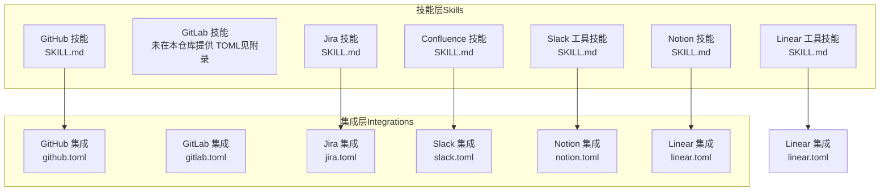
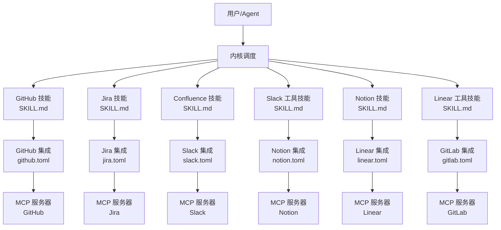
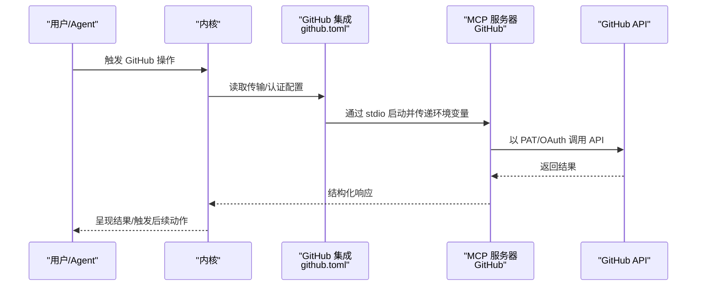
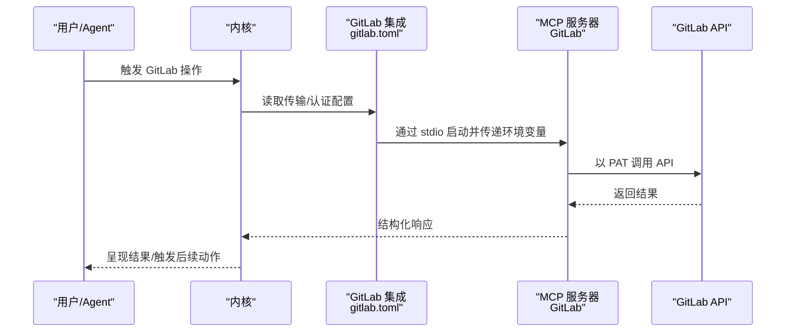
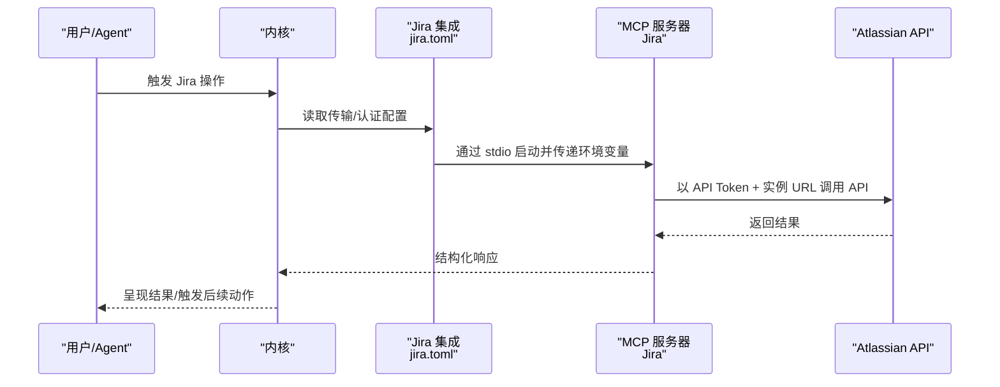
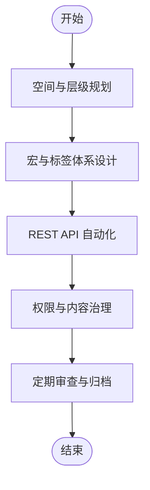
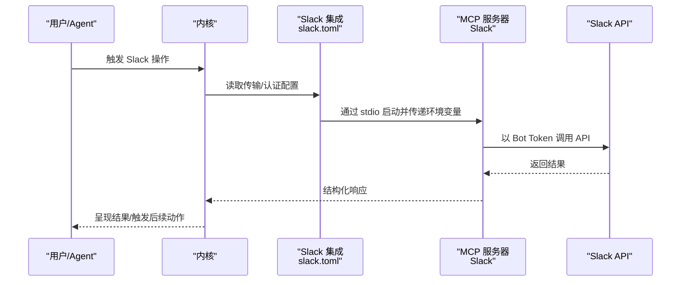
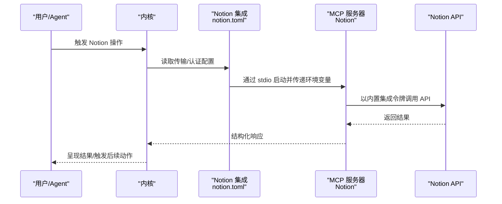
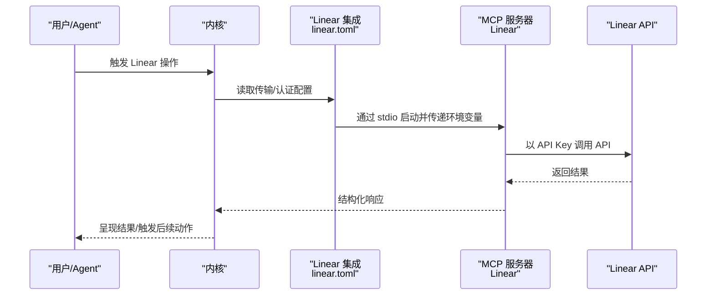
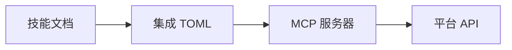

# 平台集成技能

<cite>
**本文引用的文件**
- [crates/openfang-skills/bundled/github/SKILL.md](file://crates/openfang-skills/bundled/github/SKILL.md)
- [crates/openfang-skills/bundled/jira/SKILL.md](file://crates/openfang-skills/bundled/jira/SKILL.md)
- [crates/openfang-skills/bundled/confluence/SKILL.md](file://crates/openfang-skills/bundled/confluence/SKILL.md)
- [crates/openfang-skills/bundled/slack-tools/SKILL.md](file://crates/openfang-skills/bundled/slack-tools/SKILL.md)
- [crates/openfang-skills/bundled/notion/SKILL.md](file://crates/openfang-skills/bundled/notion/SKILL.md)
- [crates/openfang-skills/bundled/linear-tools/SKILL.md](file://crates/openfang-skills/bundled/linear-tools/SKILL.md)
- [crates/openfang-extensions/integrations/github.toml](file://crates/openfang-extensions/integrations/github.toml)
- [crates/openfang-extensions/integrations/gitlab.toml](file://crates/openfang-extensions/integrations/gitlab.toml)
- [crates/openfang-extensions/integrations/jira.toml](file://crates/openfang-extensions/integrations/jira.toml)
- [crates/openfang-extensions/integrations/slack.toml](file://crates/openfang-extensions/integrations/slack.toml)
- [crates/openfang-extensions/integrations/notion.toml](file://crates/openfang-extensions/integrations/notion.toml)
- [crates/openfang-extensions/integrations/linear.toml](file://crates/openfang-extensions/integrations/linear.toml)
</cite>

## 目录
1. [简介](#简介)
2. [项目结构](#项目结构)
3. [核心组件](#核心组件)
4. [架构总览](#架构总览)
5. [详细组件分析](#详细组件分析)
6. [依赖关系分析](#依赖关系分析)
7. [性能与可靠性考量](#性能与可靠性考量)
8. [故障排查指南](#故障排查指南)
9. [结论](#结论)
10. [附录](#附录)

## 简介
本文件系统性梳理 OpenFang 平台在常用工作平台上的“集成技能”，覆盖以下能力域：
- 代码托管与协作：GitHub、GitLab
- 项目与问题跟踪：Jira、Linear
- 文档与知识库：Confluence、Notion
- 团队沟通与自动化：Slack
围绕每个平台，文档从“技能说明书”和“集成配置”两个维度展开，明确使用原则、常见模式、API/工具链、健康检查、OAuth/令牌配置、以及最佳实践与风险规避点；并提供可复用的工作流模板与效率提升建议。

## 项目结构
OpenFang 将“技能”与“集成”解耦：
- 技能（Skill）：以 Markdown 形式提供面向用户的操作指南、最佳实践与工作流范式
- 集成（Integration）：以 TOML 描述传输方式、认证参数、健康检查与安装指引

图表来源
- [crates/openfang-skills/bundled/github/SKILL.md:1-37](file://crates/openfang-skills/bundled/github/SKILL.md#L1-L37)
- [crates/openfang-skills/bundled/jira/SKILL.md:1-52](file://crates/openfang-skills/bundled/jira/SKILL.md#L1-L52)
- [crates/openfang-skills/bundled/confluence/SKILL.md:1-40](file://crates/openfang-skills/bundled/confluence/SKILL.md#L1-L40)
- [crates/openfang-skills/bundled/slack-tools/SKILL.md:1-52](file://crates/openfang-skills/bundled/slack-tools/SKILL.md#L1-L52)
- [crates/openfang-skills/bundled/notion/SKILL.md:1-52](file://crates/openfang-skills/bundled/notion/SKILL.md#L1-L52)
- [crates/openfang-skills/bundled/linear-tools/SKILL.md:1-39](file://crates/openfang-skills/bundled/linear-tools/SKILL.md#L1-L39)
- [crates/openfang-extensions/integrations/github.toml:1-35](file://crates/openfang-extensions/integrations/github.toml#L1-L35)
- [crates/openfang-extensions/integrations/gitlab.toml:1-29](file://crates/openfang-extensions/integrations/gitlab.toml#L1-L29)
- [crates/openfang-extensions/integrations/jira.toml:1-43](file://crates/openfang-extensions/integrations/jira.toml#L1-L43)
- [crates/openfang-extensions/integrations/slack.toml:1-42](file://crates/openfang-extensions/integrations/slack.toml#L1-L42)
- [crates/openfang-extensions/integrations/notion.toml:1-29](file://crates/openfang-extensions/integrations/notion.toml#L1-L29)
- [crates/openfang-extensions/integrations/linear.toml:1-29](file://crates/openfang-extensions/integrations/linear.toml#L1-L29)

章节来源
- [crates/openfang-extensions/integrations/github.toml:1-35](file://crates/openfang-extensions/integrations/github.toml#L1-L35)
- [crates/openfang-extensions/integrations/gitlab.toml:1-29](file://crates/openfang-extensions/integrations/gitlab.toml#L1-L29)
- [crates/openfang-extensions/integrations/jira.toml:1-43](file://crates/openfang-extensions/integrations/jira.toml#L1-L43)
- [crates/openfang-extensions/integrations/slack.toml:1-42](file://crates/openfang-extensions/integrations/slack.toml#L1-L42)
- [crates/openfang-extensions/integrations/notion.toml:1-29](file://crates/openfang-extensions/integrations/notion.toml#L1-L29)
- [crates/openfang-extensions/integrations/linear.toml:1-29](file://crates/openfang-extensions/integrations/linear.toml#L1-L29)

## 核心组件
- GitHub 技能：聚焦 PR、Issue、Actions、CLI 与 API 的协同使用，强调安全、可审计与可维护性
- GitLab 集成：通过 MCP 服务器访问 Merge Requests、CI/CD、Issues 等
- Jira 技能：以结构化问题类型、JQL 查询、看板与工作流自动化为核心
- Confluence 技能：空间与页面组织、宏与标签体系、权限与 API 自动化
- Slack 工具技能：Web API、Block Kit、事件订阅、工作流与令牌管理
- Notion 技能：数据库设计、页面结构、API 调用与速率限制
- Linear 工具技能：问题优先级、周期（Sprint）、标签与 GitHub 集成联动

章节来源
- [crates/openfang-skills/bundled/github/SKILL.md:1-37](file://crates/openfang-skills/bundled/github/SKILL.md#L1-L37)
- [crates/openfang-skills/bundled/jira/SKILL.md:1-52](file://crates/openfang-skills/bundled/jira/SKILL.md#L1-L52)
- [crates/openfang-skills/bundled/confluence/SKILL.md:1-40](file://crates/openfang-skills/bundled/confluence/SKILL.md#L1-L40)
- [crates/openfang-skills/bundled/slack-tools/SKILL.md:1-52](file://crates/openfang-skills/bundled/slack-tools/SKILL.md#L1-L52)
- [crates/openfang-skills/bundled/notion/SKILL.md:1-52](file://crates/openfang-skills/bundled/notion/SKILL.md#L1-L52)
- [crates/openfang-skills/bundled/linear-tools/SKILL.md:1-39](file://crates/openfang-skills/bundled/linear-tools/SKILL.md#L1-L39)

## 架构总览
OpenFang 通过“技能 + 集成”的组合实现平台能力：
- 技能层提供方法论与工作流范式
- 集成层定义认证、传输与健康检查
- MCP 服务器作为统一接入面，屏蔽不同平台差异

图表来源
- [crates/openfang-extensions/integrations/github.toml:8-11](file://crates/openfang-extensions/integrations/github.toml#L8-L11)
- [crates/openfang-extensions/integrations/gitlab.toml:8-11](file://crates/openfang-extensions/integrations/gitlab.toml#L8-L11)
- [crates/openfang-extensions/integrations/jira.toml:8-11](file://crates/openfang-extensions/integrations/jira.toml#L8-L11)
- [crates/openfang-extensions/integrations/slack.toml:8-11](file://crates/openfang-extensions/integrations/slack.toml#L8-L11)
- [crates/openfang-extensions/integrations/notion.toml:8-11](file://crates/openfang-extensions/integrations/notion.toml#L8-L11)
- [crates/openfang-extensions/integrations/linear.toml:8-11](file://crates/openfang-extensions/integrations/linear.toml#L8-L11)

## 详细组件分析

### GitHub 集成与技能
- 技能要点
  - 优先使用 gh CLI 进行认证与分页处理
  - PR 创建、检查状态、Actions 实时监控、复杂查询过滤
  - Issue 分类与里程碑、发布管理、分支清理
- 集成要点
  - 传输方式：stdio + npx 启动官方 MCP 服务器
  - 认证：PAT（细粒度或经典），支持 OAuth
  - 健康检查：周期与阈值
  - 安装指引：令牌生成与粘贴步骤

图表来源
- [crates/openfang-extensions/integrations/github.toml:8-24](file://crates/openfang-extensions/integrations/github.toml#L8-L24)
- [crates/openfang-skills/bundled/github/SKILL.md:11-22](file://crates/openfang-skills/bundled/github/SKILL.md#L11-L22)

章节来源
- [crates/openfang-extensions/integrations/github.toml:1-35](file://crates/openfang-extensions/integrations/github.toml#L1-L35)
- [crates/openfang-skills/bundled/github/SKILL.md:1-37](file://crates/openfang-skills/bundled/github/SKILL.md#L1-L37)

### GitLab 集成与技能
- 技能要点
  - 通过 MCP 服务器访问项目、MR、CI/CD、Issues
  - 令牌要求：api scope
- 集成要点
  - 传输方式：stdio + npx 启动官方 MCP 服务器
  - 认证：个人访问令牌（PAT）
  - 健康检查：周期与阈值
  - 安装指引：令牌生成与粘贴步骤

图表来源
- [crates/openfang-extensions/integrations/gitlab.toml:8-18](file://crates/openfang-extensions/integrations/gitlab.toml#L8-L18)
- [crates/openfang-skills/bundled/github/SKILL.md:11-22](file://crates/openfang-skills/bundled/github/SKILL.md#L11-L22)

章节来源
- [crates/openfang-extensions/integrations/gitlab.toml:1-29](file://crates/openfang-extensions/integrations/gitlab.toml#L1-L29)

### Jira 集成与技能
- 技能要点
  - 结构化问题类型、清晰标题、验收标准、优先级与估算
  - JQL 查询、看板列与工作流自动化
- 集成要点
  - 传输方式：stdio + npx 启动 Atlassian MCP 服务器
  - 认证：API Token + 实例 URL + 用户邮箱
  - 健康检查：周期与阈值
  - 安装指引：API Token 生成与粘贴步骤

图表来源
- [crates/openfang-extensions/integrations/jira.toml:8-32](file://crates/openfang-extensions/integrations/jira.toml#L8-L32)
- [crates/openfang-skills/bundled/jira/SKILL.md:11-14](file://crates/openfang-skills/bundled/jira/SKILL.md#L11-L14)

章节来源
- [crates/openfang-extensions/integrations/jira.toml:1-43](file://crates/openfang-extensions/integrations/jira.toml#L1-L43)
- [crates/openfang-skills/bundled/jira/SKILL.md:1-52](file://crates/openfang-skills/bundled/jira/SKILL.md#L1-L52)

### Confluence 技能
- 技能要点
  - 空间与层级结构、标签体系、宏与 API 自动化
  - 内容卫生、权限控制、跨页面引用
- 集成现状
  - 当前仓库未提供 Confluence 的集成 TOML 文件；可在后续补充

图表来源
- [crates/openfang-skills/bundled/confluence/SKILL.md:9-25](file://crates/openfang-skills/bundled/confluence/SKILL.md#L9-L25)

章节来源
- [crates/openfang-skills/bundled/confluence/SKILL.md:1-40](file://crates/openfang-skills/bundled/confluence/SKILL.md#L1-L40)

### Slack 工具技能
- 技能要点
  - Web API、Block Kit、Socket Mode/Bolt、事件订阅、速率限制与分页
  - 工作流构建器、Slack Workflow、消息格式化与令牌管理
- 集成要点
  - 传输方式：stdio + npx 启动官方 MCP 服务器
  - 认证：Bot Token + Team ID，支持 OAuth
  - 健康检查：周期与阈值
  - 安装指引：App 创建、Scope 授权与令牌粘贴

图表来源
- [crates/openfang-extensions/integrations/slack.toml:8-31](file://crates/openfang-extensions/integrations/slack.toml#L8-L31)
- [crates/openfang-skills/bundled/slack-tools/SKILL.md:16-22](file://crates/openfang-skills/bundled/slack-tools/SKILL.md#L16-L22)

章节来源
- [crates/openfang-extensions/integrations/slack.toml:1-42](file://crates/openfang-extensions/integrations/slack.toml#L1-L42)
- [crates/openfang-skills/bundled/slack-tools/SKILL.md:1-52](file://crates/openfang-skills/bundled/slack-tools/SKILL.md#L1-L52)

### Notion 技能
- 技能要点
  - 数据库视图选择、属性设计、模板与速率限制
  - 页面结构、块类型与 API 调用
- 集成要点
  - 传输方式：stdio + npx 启动官方 MCP 服务器
  - 认证：Internal Integration Token
  - 健康检查：周期与阈值
  - 安装指引：创建工作区集成并分享页面

图表来源
- [crates/openfang-extensions/integrations/notion.toml:8-18](file://crates/openfang-extensions/integrations/notion.toml#L8-L18)
- [crates/openfang-skills/bundled/notion/SKILL.md:31-37](file://crates/openfang-skills/bundled/notion/SKILL.md#L31-L37)

章节来源
- [crates/openfang-extensions/integrations/notion.toml:1-29](file://crates/openfang-extensions/integrations/notion.toml#L1-L29)
- [crates/openfang-skills/bundled/notion/SKILL.md:1-52](file://crates/openfang-skills/bundled/notion/SKILL.md#L1-L52)

### Linear 工具技能
- 技能要点
  - 问题优先级、标签、周期规划、自动化与 GitHub 集成
- 集成要点
  - 传输方式：stdio + npx 启动官方 MCP 服务器
  - 认证：Personal API Key
  - 健康检查：周期与阈值
  - 安装指引：生成 API Key 并粘贴

图表来源
- [crates/openfang-extensions/integrations/linear.toml:8-18](file://crates/openfang-extensions/integrations/linear.toml#L8-L18)
- [crates/openfang-skills/bundled/linear-tools/SKILL.md:17-24](file://crates/openfang-skills/bundled/linear-tools/SKILL.md#L17-L24)

章节来源
- [crates/openfang-extensions/integrations/linear.toml:1-29](file://crates/openfang-extensions/integrations/linear.toml#L1-L29)
- [crates/openfang-skills/bundled/linear-tools/SKILL.md:1-39](file://crates/openfang-skills/bundled/linear-tools/SKILL.md#L1-L39)

## 依赖关系分析
- 组件耦合
  - 技能与集成通过“MCP 服务器”松耦合连接，便于替换后端
  - 认证参数集中于集成 TOML，避免硬编码到技能文档
- 外部依赖
  - 各平台官方 MCP 服务器作为统一接入层
  - 令牌与 OAuth Scope 明确，降低误授权风险
- 潜在环路
  - 无直接循环依赖；内核仅负责编排与路由

图表来源
- [crates/openfang-extensions/integrations/github.toml:8-11](file://crates/openfang-extensions/integrations/github.toml#L8-L11)
- [crates/openfang-extensions/integrations/jira.toml:8-11](file://crates/openfang-extensions/integrations/jira.toml#L8-L11)
- [crates/openfang-extensions/integrations/slack.toml:8-11](file://crates/openfang-extensions/integrations/slack.toml#L8-L11)
- [crates/openfang-extensions/integrations/notion.toml:8-11](file://crates/openfang-extensions/integrations/notion.toml#L8-L11)
- [crates/openfang-extensions/integrations/linear.toml:8-11](file://crates/openfang-extensions/integrations/linear.toml#L8-L11)
- [crates/openfang-extensions/integrations/gitlab.toml:8-11](file://crates/openfang-extensions/integrations/gitlab.toml#L8-L11)

## 性能与可靠性考量
- 速率限制与重试
  - Slack：尊重 Retry-After，Tier 限流策略
  - Notion：平均 3 rps，指数退避重试
- 健康检查
  - 所有集成均配置健康检查周期与阈值，保障可用性
- 可靠性建议
  - 对长耗时操作采用异步与轮询
  - 对批量操作进行分批与去重
  - 对敏感字段（令牌、URL）使用密钥管理

## 故障排查指南
- 常见症状与定位
  - 认证失败：检查令牌是否过期、Scope 是否正确、Team ID/实例 URL 是否匹配
  - 速率限制：观察返回头 Retry-After 或 Notion 限流，调整调用节奏
  - MCP 启动失败：确认 npx 可用、网络可达、命令参数正确
- 快速修复清单
  - 刷新/重新生成令牌
  - 校验集成 TOML 中 required_env 的键名与取值
  - 查看健康检查日志与失败次数
  - 在技能文档中对照最佳实践与规避项

章节来源
- [crates/openfang-extensions/integrations/slack.toml:20-22](file://crates/openfang-extensions/integrations/slack.toml#L20-L22)
- [crates/openfang-extensions/integrations/notion.toml:20-22](file://crates/openfang-extensions/integrations/notion.toml#L20-L22)
- [crates/openfang-extensions/integrations/github.toml:26-28](file://crates/openfang-extensions/integrations/github.toml#L26-L28)
- [crates/openfang-extensions/integrations/jira.toml:34-36](file://crates/openfang-extensions/integrations/jira.toml#L34-L36)
- [crates/openfang-extensions/integrations/gitlab.toml:20-22](file://crates/openfang-extensions/integrations/gitlab.toml#L20-L22)
- [crates/openfang-extensions/integrations/linear.toml:20-22](file://crates/openfang-extensions/integrations/linear.toml#L20-L22)

## 结论
通过“技能 + 集成”的双轨设计，OpenFang 能够以统一的 MCP 接入面整合多平台能力，既保证方法论的可复用性，又确保认证与传输的标准化。建议在实际落地中：
- 先以技能文档驱动流程设计，再以集成 TOML 确认技术实现
- 将令牌与配置纳入密钥管理，严格最小权限与轮换策略
- 建立健康检查与告警机制，保障长期稳定运行

## 附录
- GitLab 集成配置（参考）
  - 传输：stdio + npx
  - 认证：个人访问令牌（api scope）
  - 健康检查：周期与阈值
  - 安装指引：令牌生成与粘贴步骤
- Confluence 集成配置（待完善）
  - 当前仓库未提供集成 TOML，建议按现有模式补充

章节来源
- [crates/openfang-extensions/integrations/gitlab.toml:1-29](file://crates/openfang-extensions/integrations/gitlab.toml#L1-L29)
- [crates/openfang-skills/bundled/confluence/SKILL.md:1-40](file://crates/openfang-skills/bundled/confluence/SKILL.md#L1-L40)