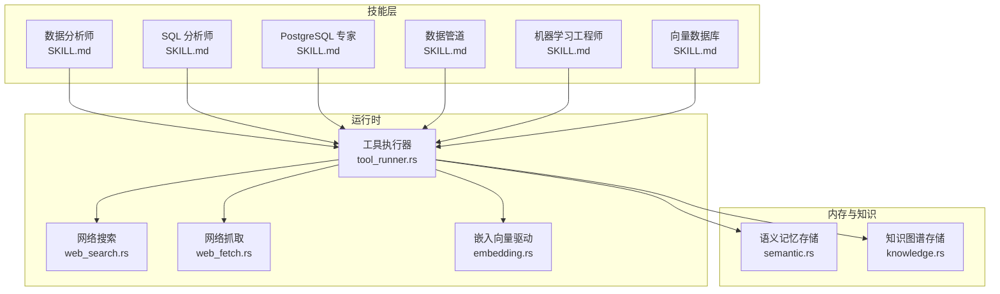
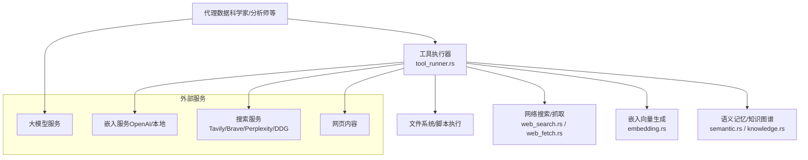
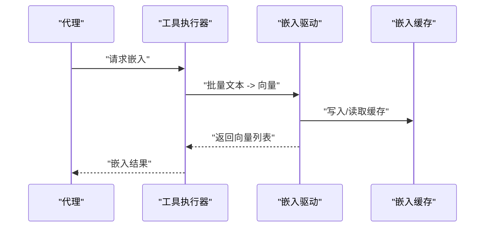
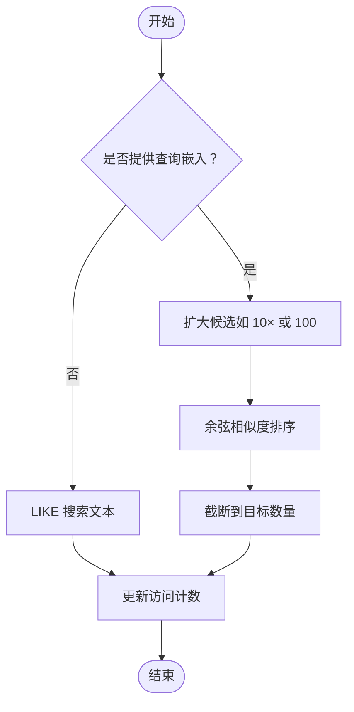
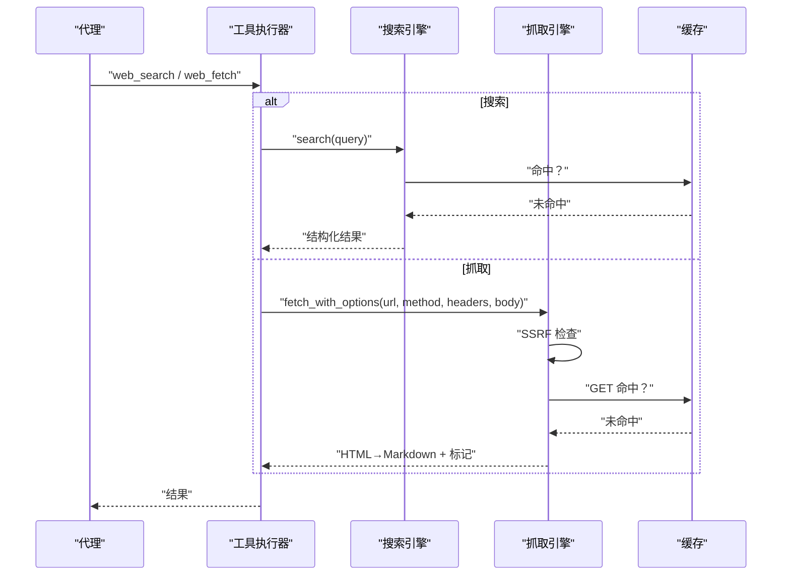
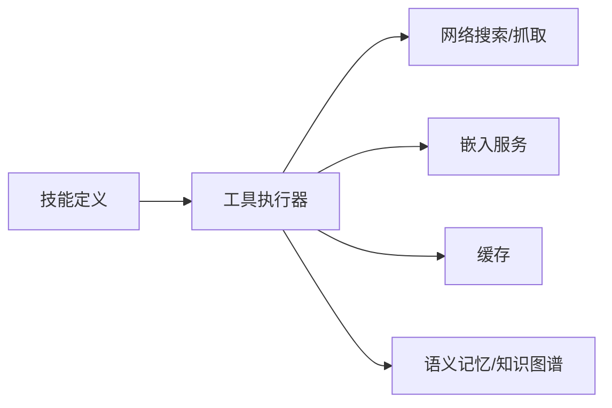

# 数据分析技能

<cite>
**本文引用的文件**
- [SKILL.md（数据分析师）](file://crates/openfang-skills/bundled/data-analyst/SKILL.md)
- [agent.toml（数据科学家）](file://agents/data-scientist/agent.toml)
- [SKILL.md（SQL 分析师）](file://crates/openfang-skills/bundled/sql-analyst/SKILL.md)
- [SKILL.md（PostgreSQL 专家）](file://crates/openfang-skills/bundled/postgres-expert/SKILL.md)
- [SKILL.md（数据管道）](file://crates/openfang-skills/bundled/data-pipeline/SKILL.md)
- [SKILL.md（机器学习工程师）](file://crates/openfang-skills/bundled/ml-engineer/SKILL.md)
- [SKILL.md（向量数据库）](file://crates/openfang-skills/bundled/vector-db/SKILL.md)
- [embedding.rs（嵌入向量驱动）](file://crates/openfang-runtime/src/embedding.rs)
- [semantic.rs（语义记忆存储）](file://crates/openfang-memory/src/semantic.rs)
- [tool_runner.rs（内置工具执行器）](file://crates/openfang-runtime/src/tool_runner.rs)
- [knowledge.rs（知识图谱存储）](file://crates/openfang-memory/src/knowledge.rs)
- [web_search.rs（多提供商网络搜索）](file://crates/openfang-runtime/src/web_search.rs)
- [web_fetch.rs（增强网络抓取）](file://crates/openfang-runtime/src/web_fetch.rs)
</cite>

## 目录
1. [引言](#引言)
2. [项目结构](#项目结构)
3. [核心组件](#核心组件)
4. [架构总览](#架构总览)
5. [详细组件分析](#详细组件分析)
6. [依赖关系分析](#依赖关系分析)
7. [性能考量](#性能考量)
8. [故障排查指南](#故障排查指南)
9. [结论](#结论)
10. [附录](#附录)

## 引言
本文件面向 OpenFang 的“数据分析技能”主题，系统化梳理并呈现以下能力体系与实现要点：
- 数据分析师技能：数据清洗、统计分析、可视化报告、ETL 流程
- SQL 分析师技能：复杂查询优化、数据库设计、性能调优、事务管理
- 数据管道技能：数据采集、转换、加载、实时处理
- 机器学习工程师技能：模型训练、特征工程、评估指标、部署上线
- 向量数据库技能：嵌入向量管理、相似度搜索、语义检索、RAG 应用

文档同时覆盖数据处理流程、算法选择、性能优化、数据安全与治理最佳实践，并提供可复用的案例与评估方法。

## 项目结构
OpenFang 将“技能”以独立的技能包形式组织在 openfang-skills 模块中；运行时能力由 openfang-runtime 提供，内存与知识图谱由 openfang-memory 提供。下图展示与数据分析相关的关键模块与交互：

图表来源
- [SKILL.md（数据分析师）](file://crates/openfang-skills/bundled/data-analyst/SKILL.md)
- [SKILL.md（SQL 分析师）](file://crates/openfang-skills/bundled/sql-analyst/SKILL.md)
- [SKILL.md（PostgreSQL 专家）](file://crates/openfang-skills/bundled/postgres-expert/SKILL.md)
- [SKILL.md（数据管道）](file://crates/openfang-skills/bundled/data-pipeline/SKILL.md)
- [SKILL.md（机器学习工程师）](file://crates/openfang-skills/bundled/ml-engineer/SKILL.md)
- [SKILL.md（向量数据库）](file://crates/openfang-skills/bundled/vector-db/SKILL.md)
- [tool_runner.rs（内置工具执行器）](file://crates/openfang-runtime/src/tool_runner.rs)
- [web_search.rs（多提供商网络搜索）](file://crates/openfang-runtime/src/web_search.rs)
- [web_fetch.rs（增强网络抓取）](file://crates/openfang-runtime/src/web_fetch.rs)
- [embedding.rs（嵌入向量驱动）](file://crates/openfang-runtime/src/embedding.rs)
- [semantic.rs（语义记忆存储）](file://crates/openfang-memory/src/semantic.rs)
- [knowledge.rs（知识图谱存储）](file://crates/openfang-memory/src/knowledge.rs)

章节来源
- [SKILL.md（数据分析师）](file://crates/openfang-skills/bundled/data-analyst/SKILL.md)
- [SKILL.md（SQL 分析师）](file://crates/openfang-skills/bundled/sql-analyst/SKILL.md)
- [SKILL.md（PostgreSQL 专家）](file://crates/openfang-skills/bundled/postgres-expert/SKILL.md)
- [SKILL.md（数据管道）](file://crates/openfang-skills/bundled/data-pipeline/SKILL.md)
- [SKILL.md（机器学习工程师）](file://crates/openfang-skills/bundled/ml-engineer/SKILL.md)
- [SKILL.md（向量数据库）](file://crates/openfang-skills/bundled/vector-db/SKILL.md)
- [tool_runner.rs（内置工具执行器）](file://crates/openfang-runtime/src/tool_runner.rs)

## 核心组件
- 数据分析师技能：强调探索性数据分析（EDA）、数据清洗、统计推断与可视化报告，遵循“先质量后建模”的原则。
- SQL 分析师技能：聚焦查询优化、索引策略、模式设计与执行计划分析，避免常见陷阱。
- 数据管道技能：主张 ELT 优先、幂等性、分区与增量加载、数据质量门禁与死信队列。
- 机器学习工程师技能：从基线模型出发，系统化特征工程与评估，强调可复现与生产监控。
- 向量数据库技能：围绕嵌入生成、索引参数、混合检索与 RAG 管线进行设计与优化。

章节来源
- [SKILL.md（数据分析师）](file://crates/openfang-skills/bundled/data-analyst/SKILL.md)
- [SKILL.md（SQL 分析师）](file://crates/openfang-skills/bundled/sql-analyst/SKILL.md)
- [SKILL.md（数据管道）](file://crates/openfang-skills/bundled/data-pipeline/SKILL.md)
- [SKILL.md（机器学习工程师）](file://crates/openfang-skills/bundled/ml-engineer/SKILL.md)
- [SKILL.md（向量数据库）](file://crates/openfang-skills/bundled/vector-db/SKILL.md)

## 架构总览
OpenFang 的数据分析能力通过“技能 + 运行时 + 内存/知识”的分层架构实现：
- 技能层：定义方法论与最佳实践（如数据清洗、SQL 优化、向量检索）
- 运行时层：提供工具执行、网络抓取/搜索、嵌入向量生成与相似度计算
- 存储层：语义记忆与知识图谱支撑检索与上下文召回

图表来源
- [tool_runner.rs（内置工具执行器）](file://crates/openfang-runtime/src/tool_runner.rs)
- [web_search.rs（多提供商网络搜索）](file://crates/openfang-runtime/src/web_search.rs)
- [web_fetch.rs（增强网络抓取）](file://crates/openfang-runtime/src/web_fetch.rs)
- [embedding.rs（嵌入向量驱动）](file://crates/openfang-runtime/src/embedding.rs)
- [semantic.rs（语义记忆存储）](file://crates/openfang-memory/src/semantic.rs)
- [knowledge.rs（知识图谱存储）](file://crates/openfang-memory/src/knowledge.rs)

## 详细组件分析

### 数据分析师技能
- 方法论与流程
  - 探索性数据分析（EDA）：结构、类型、缺失值、分布、相关性、频数分析
  - 数据清洗：缺失值处理、格式标准化、重复值处理、类型转换、步骤可复现
  - 可视化：图表标题、轴标签、颜色意图、尺寸与导出、关键点标注
  - 统计分析：集中趋势与离散程度、假设检验、效应量与置信区间、参数检验前提
  - 风险规避：避免仅凭相关性得出因果、样本量、结果透明、聚合粒度
- 实践建议
  - 先清洗再建模，先描述再推断
  - 使用合适的图表类型匹配数据类型
  - 报告结论需结合证据与局限性

章节来源
- [SKILL.md（数据分析师）](file://crates/openfang-skills/bundled/data-analyst/SKILL.md)

### SQL 分析师技能
- 查询优化
  - 索引：WHERE/JOIN/ORDER/GROUP 列加索引；避免 SELECT *
  - EXISTS 替代 IN；避免对索引列使用函数；LIMIT 与分页；CTE 可读但需注意物化
- 模式设计
  - 至少第三范式；读多场景可适度反规范化；明确 NOT NULL、外键与删除行为；时间戳字段
- 分析模式
  - 窗口函数、分组过滤、空值处理
- 风险规避
  - 参数化查询；避免无度量索引；避免 OFFSET 深翻页；避免隐式类型转换

章节来源
- [SKILL.md（SQL 分析师）](file://crates/openfang-skills/bundled/sql-analyst/SKILL.md)

### PostgreSQL 专家技能
- 原则
  - EXPLAIN/ANALYZE 分析执行计划；按访问模式选择索引类型；事务短小；监控慢查询与顺序扫描
- 技术
  - CTE、窗口函数、JSONB 操作与 GIN 索引、表分区与裁剪、VACUUM/ANALYZE、连接池
- 模式
  - 覆盖索引、部分索引、UPSERT、咨询锁
- 风险规避
  - 明确列；避免过度索引；避免 NOT IN（含空值）；谨慎设置 work_mem

章节来源
- [SKILL.md（PostgreSQL 专家）](file://crates/openfang-skills/bundled/postgres-expert/SKILL.md)

### 数据管道技能
- 原则
  - ELT 优先；幂等；分区；阶段数据质量检查；编排与计算分离
- 技术
  - Airflow 任务级重试/超时/SLA；Spark 分区/广播/缓存；dbt 分层模型；CDC
- 模式
  - 增量加载、回填策略、死信队列、模式演进
- 风险规避
  - 不在调度器做重计算；入库校验；不硬编码凭据；避免全表扫描

章节来源
- [SKILL.md（数据管道）](file://crates/openfang-skills/bundled/data-pipeline/SKILL.md)

### 机器学习工程师技能
- 原则
  - 从简单基线出发；业务导向指标；版本化；可恢复训练；生产监控
- 技术
  - PyTorch 训练循环；sklearn 管道；网格/随机/贝叶斯超参；测试集评估；特征工程；实验追踪
- 模式
  - 80/10/10 分割；学习率调度；集成；模型注册
- 风险规避
  - 不在训练集上评估；充分理解数据；有回滚预案；定期回顾特征

章节来源
- [SKILL.md（机器学习工程师）](file://crates/openfang-skills/bundled/ml-engineer/SKILL.md)

### 向量数据库技能
- 原则
  - 嵌入模型与任务匹配；距离度量与索引权衡；分块策略；稠密+稀疏混合；元数据过滤；RAG 管线
- 技术
  - OpenAI 兼容嵌入；HNSW 参数；递归分块；RRF/交叉编码重排；父-子检索；多向量表示；上下文检索
- 模式
  - 评估指标（P@K、R@K、NDCG）；域内微调；预处理与去噪
- 风险规避
  - 不同模型 benchmark；预处理不可省；重排不可省；仅向量存储不完整

章节来源
- [SKILL.md（向量数据库）](file://crates/openfang-skills/bundled/vector-db/SKILL.md)

### 嵌入向量驱动与相似度计算
- 功能
  - OpenAI 兼容嵌入接口；维度推断；cosine 相似度；SQLite BLOB 存储与序列化
- 安全
  - 外部 API 发送警告；本地/远程区分
- 性能
  - 批量嵌入；相似度重排；候选扩大与截断

图表来源
- [tool_runner.rs（内置工具执行器）](file://crates/openfang-runtime/src/tool_runner.rs)
- [embedding.rs（嵌入向量驱动）](file://crates/openfang-runtime/src/embedding.rs)

章节来源
- [embedding.rs（嵌入向量驱动）](file://crates/openfang-runtime/src/embedding.rs)

### 语义记忆存储与向量召回
- 功能
  - 文本 LIKE 回退；向量余弦相似度排序；过滤与访问计数更新；嵌入更新
- 流程
  - 无嵌入：LIKE 匹配；有嵌入：候选扩大 + 向量重排 + 截断

图表来源
- [semantic.rs（语义记忆存储）](file://crates/openfang-memory/src/semantic.rs)

章节来源
- [semantic.rs（语义记忆存储）](file://crates/openfang-memory/src/semantic.rs)

### 网络搜索与抓取（数据采集）
- 搜索引擎
  - 多提供商自动降级：Tavily → Brave → Perplexity → DuckDuckGo；缓存命中直接返回
- 抓取管线
  - SSRF 保护（scheme/主机/IP 白名单）→ 缓存 → 请求 → HTML 检测 → Markdown 转换 → 截断 → 外部内容标记 → 缓存

图表来源
- [tool_runner.rs（内置工具执行器）](file://crates/openfang-runtime/src/tool_runner.rs)
- [web_search.rs（多提供商网络搜索）](file://crates/openfang-runtime/src/web_search.rs)
- [web_fetch.rs（增强网络抓取）](file://crates/openfang-runtime/src/web_fetch.rs)

章节来源
- [web_search.rs（多提供商网络搜索）](file://crates/openfang-runtime/src/web_search.rs)
- [web_fetch.rs（增强网络抓取）](file://crates/openfang-runtime/src/web_fetch.rs)

### 知识图谱存储与查询
- 功能
  - 实体与关系增删改；图模式查询（源/关系/目标三元组）；JSON 属性存储
- 适用场景
  - 结构化实体关系抽取、跨实体关联分析、图遍历与路径发现

章节来源
- [knowledge.rs（知识图谱存储）](file://crates/openfang-memory/src/knowledge.rs)

## 依赖关系分析
- 技能与运行时
  - 技能定义的方法论被工具执行器承载，通过统一的工具接口落地（文件、网络、嵌入、内存）
- 运行时与外部
  - 工具执行器依赖网络搜索/抓取、嵌入服务与缓存；对外部凭据采用零化内存与环境变量注入
- 存储与检索
  - 语义记忆与知识图谱为向量检索与结构化查询提供基础，支撑 RAG 与上下文召回

图表来源
- [tool_runner.rs（内置工具执行器）](file://crates/openfang-runtime/src/tool_runner.rs)
- [web_search.rs（多提供商网络搜索）](file://crates/openfang-runtime/src/web_search.rs)
- [web_fetch.rs（增强网络抓取）](file://crates/openfang-runtime/src/web_fetch.rs)
- [embedding.rs（嵌入向量驱动）](file://crates/openfang-runtime/src/embedding.rs)
- [semantic.rs（语义记忆存储）](file://crates/openfang-memory/src/semantic.rs)
- [knowledge.rs（知识图谱存储）](file://crates/openfang-memory/src/knowledge.rs)

章节来源
- [tool_runner.rs（内置工具执行器）](file://crates/openfang-runtime/src/tool_runner.rs)

## 性能考量
- 嵌入与检索
  - 批量嵌入减少往返；扩大候选再重排；维度与索引参数平衡召回与速度
- SQL 与数据库
  - 精准索引、避免函数作用于索引列、合理 LIMIT 与分页；分区裁剪与覆盖索引
- 数据管道
  - 幂等与增量；分区与死信队列；CDC 降低轮询成本
- 机器学习
  - 基线优先、特征工程系统化、交叉验证与高效超参搜索、实验追踪
- 网络与缓存
  - SSRF 保护前置；GET 结果缓存；响应大小与字符截断避免越界

## 故障排查指南
- 嵌入与向量
  - 外部 API 发送警告：确认 base_url 与 /v1 路径；核对模型维度推断；检查授权头
  - 相似度异常：长度不一致或空向量会返回 0；确保维度一致
- 语义记忆
  - 无嵌入回退：LIKE 匹配；有嵌入时扩大候选再重排；更新访问计数
- 网络抓取
  - SSRF 拦截：仅允许 http/https；禁止 localhost、metadata、私网 IP；IPv6 方括号解析
  - 响应过大：超过阈值会被拒绝；GET 才缓存
- 工具执行
  - shell 执行：元字符注入阻断；策略模式控制；污点检测规避外链/解码/执行
  - 网络请求：URL 中敏感参数阻断；审批门禁与超时处理

章节来源
- [embedding.rs（嵌入向量驱动）](file://crates/openfang-runtime/src/embedding.rs)
- [semantic.rs（语义记忆存储）](file://crates/openfang-memory/src/semantic.rs)
- [web_fetch.rs（增强网络抓取）](file://crates/openfang-runtime/src/web_fetch.rs)
- [tool_runner.rs（内置工具执行器）](file://crates/openfang-runtime/src/tool_runner.rs)

## 结论
OpenFang 的数据分析技能体系以“方法论 + 工具 + 存储”为核心，既保证了从数据清洗、SQL 优化、管道构建到模型训练与向量检索的全流程覆盖，又通过运行时的安全与性能机制保障可操作性与稳定性。建议在实践中坚持“先质量后建模、先描述后推断、先基线后复杂”的原则，配合幂等与可观测的数据管道、严格的嵌入与检索评估，持续迭代与监控。

## 附录
- 实际分析案例建议
  - 数据清洗：缺失值插补策略对比、格式标准化前后分布变化
  - SQL 优化：执行计划前后对比、索引命中与排序开销
  - 数据管道：增量回填与死信队列演练、CDC 事件一致性验证
  - 机器学习：特征工程前后 AUC/准确率变化、学习曲线与过拟合诊断
  - 向量检索：不同分块策略与混合检索的 P@K/NDCG 对比
- 数据治理最佳实践
  - 数据资产目录与血缘；最小权限与凭据管理；审计日志与变更追踪；数据生命周期管理