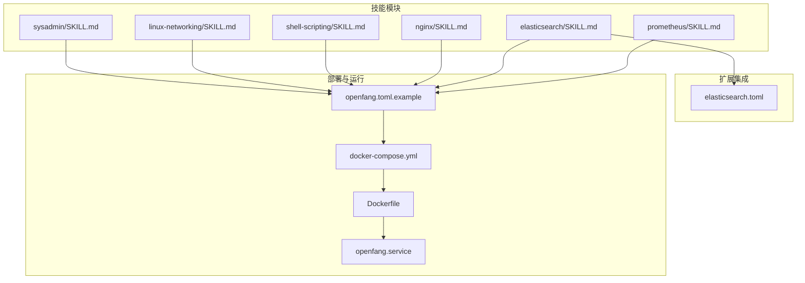
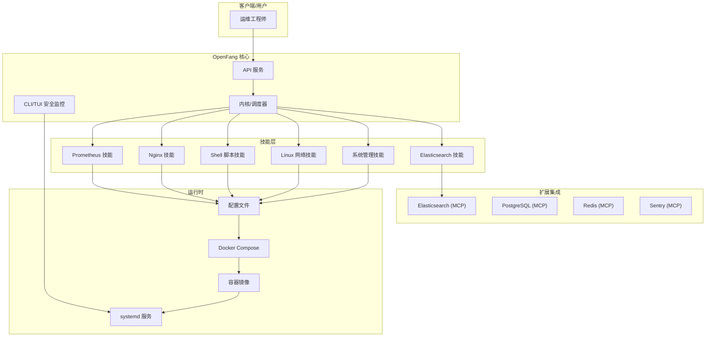
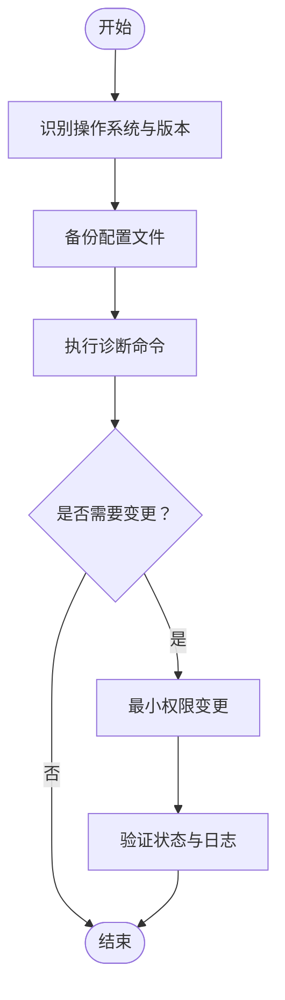
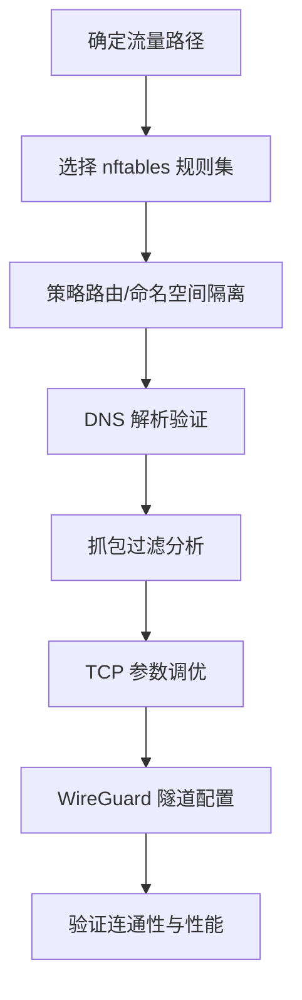
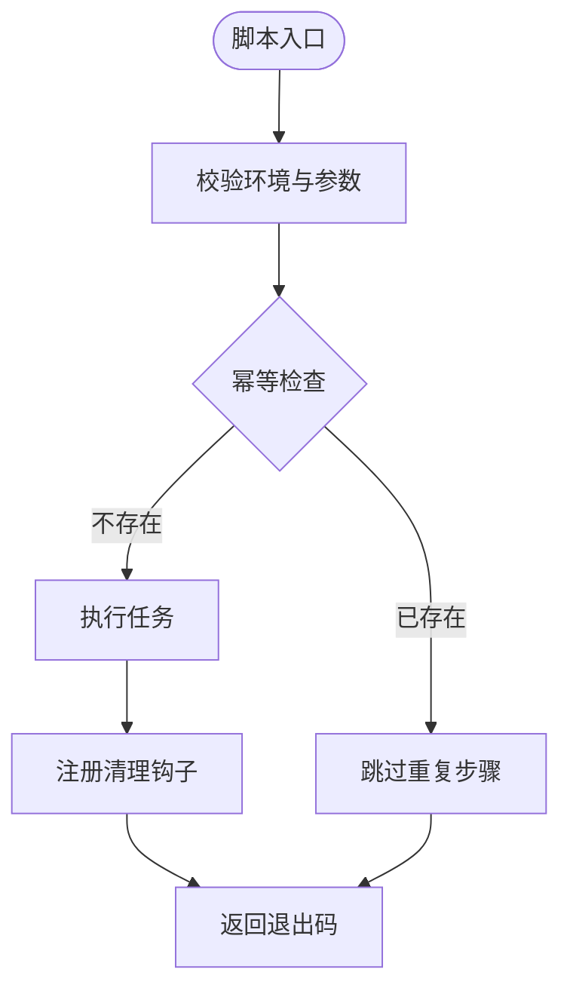
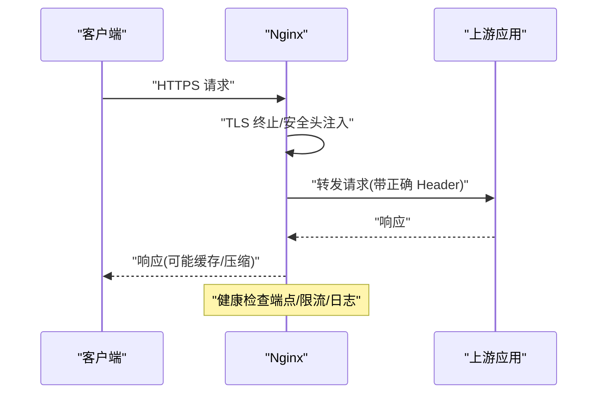
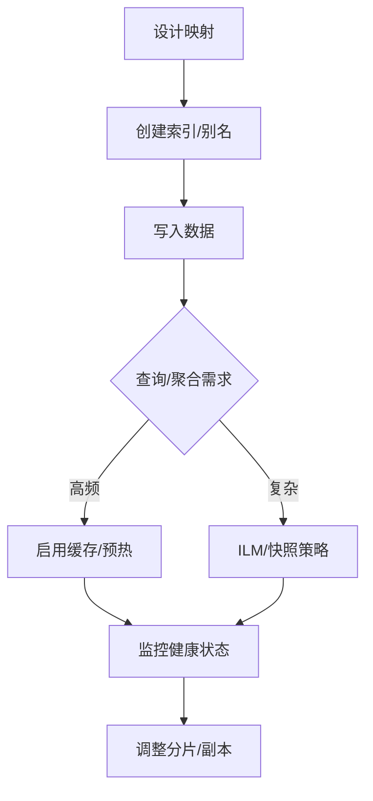
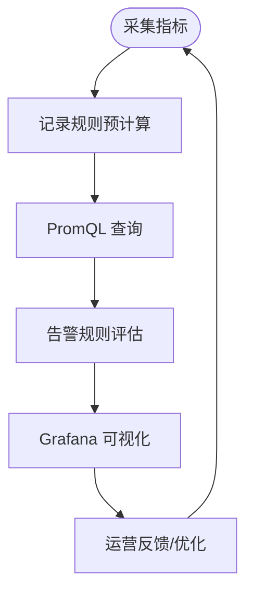
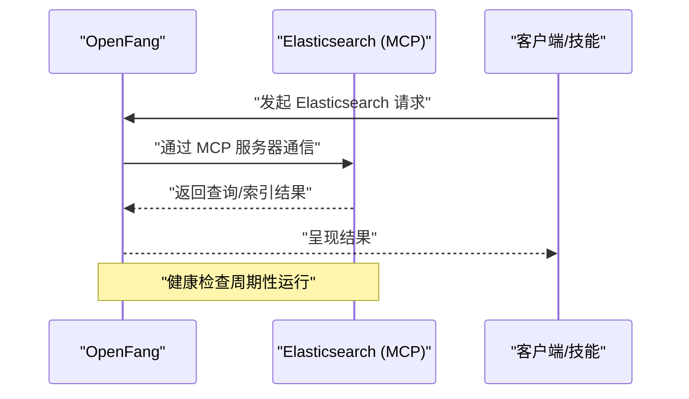

# 系统管理技能

<cite>
**本文引用的文件**
- [sysadmin/SKILL.md](file://crates/openfang-skills/bundled/sysadmin/SKILL.md)
- [linux-networking/SKILL.md](file://crates/openfang-skills/bundled/linux-networking/SKILL.md)
- [shell-scripting/SKILL.md](file://crates/openfang-skills/bundled/shell-scripting/SKILL.md)
- [nginx/SKILL.md](file://crates/openfang-skills/bundled/nginx/SKILL.md)
- [elasticsearch/SKILL.md](file://crates/openfang-skills/bundled/elasticsearch/SKILL.md)
- [prometheus/SKILL.md](file://crates/openfang-skills/bundled/prometheus/SKILL.md)
- [elasticsearch.toml](file://crates/openfang-extensions/integrations/elasticsearch.toml)
- [openfang.toml.example](file://openfang.toml.example)
- [docker-compose.yml](file://docker-compose.yml)
- [Dockerfile](file://Dockerfile)
- [openfang.service](file://deploy/openfang.service)
- [security.rs](file://crates/openfang-cli/src/tui/screens/security.rs)
</cite>

## 目录
1. [简介](#简介)
2. [项目结构](#项目结构)
3. [核心组件](#核心组件)
4. [架构总览](#架构总览)
5. [详细组件分析](#详细组件分析)
6. [依赖关系分析](#依赖关系分析)
7. [性能考虑](#性能考虑)
8. [故障排除指南](#故障排除指南)
9. [结论](#结论)
10. [附录](#附录)

## 简介
本文件面向 OpenFang 的系统管理技能体系，围绕系统运维与基础设施能力进行系统化梳理，覆盖以下主题：
- 系统管理员技能：Linux 系统管理、用户权限、服务配置、性能监控
- Linux 网络技能：网络配置、防火墙、负载均衡、DNS 解析
- Shell 脚本技能：自动化脚本、批量处理、系统维护、备份恢复
- Nginx 技能：Web 服务器配置、反向代理、SSL 证书、缓存优化
- Elasticsearch 技能：搜索引擎配置、索引管理、查询优化、集群监控
- Prometheus 技能：监控指标收集、告警规则、可视化展示、性能分析

同时提供系统架构设计思路、运维最佳实践、故障排除方法，并给出部署配置示例、性能调优指南与安全加固方案。

## 项目结构
OpenFang 将“技能”以可插拔方式组织在 openfang-skills 模块中；通过 openfang-extensions 提供与外部系统的集成（如 Elasticsearch、PostgreSQL、Redis、Sentry 等），并通过容器与 systemd 进行部署。

图示来源
- [openfang.toml.example:1-49](file://openfang.toml.example#L1-L49)
- [docker-compose.yml:1-26](file://docker-compose.yml#L1-L26)
- [Dockerfile:1-35](file://Dockerfile#L1-L35)
- [openfang.service:1-39](file://deploy/openfang.service#L1-L39)
- [elasticsearch.toml:1-36](file://crates/openfang-extensions/integrations/elasticsearch.toml#L1-L36)

章节来源
- [openfang.toml.example:1-49](file://openfang.toml.example#L1-L49)
- [docker-compose.yml:1-26](file://docker-compose.yml#L1-L26)
- [Dockerfile:1-35](file://Dockerfile#L1-L35)
- [openfang.service:1-39](file://deploy/openfang.service#L1-L39)

## 核心组件
- 系统管理员技能：涵盖诊断命令、服务管理、安全加固与常见陷阱，强调最小权限、变更前备份与可追溯性。
- Linux 网络技能：涵盖内核包流、nftables/iptables、路由策略、DNS、抓包与 TCP 调优、WireGuard 隧道等。
- Shell 脚本技能：强调健壮性、可移植性与幂等性，提供参数解析、清理钩子、并行执行与日志规范。
- Nginx 技能：强调虚拟主机分离、边缘 TLS 终止、上游健康与限流、安全头与静态资源缓存。
- Elasticsearch 技能：强调映射设计、分片大小、别名零停机、ILM、查询与聚合模式、快照与恢复。
- Prometheus 技能：强调金丝雀信号、记录规则、告警设计、服务发现与标签基数控制。

章节来源
- [sysadmin/SKILL.md:1-46](file://crates/openfang-skills/bundled/sysadmin/SKILL.md#L1-L46)
- [linux-networking/SKILL.md:1-41](file://crates/openfang-skills/bundled/linux-networking/SKILL.md#L1-L41)
- [shell-scripting/SKILL.md:1-39](file://crates/openfang-skills/bundled/shell-scripting/SKILL.md#L1-L39)
- [nginx/SKILL.md:1-39](file://crates/openfang-skills/bundled/nginx/SKILL.md#L1-L39)
- [elasticsearch/SKILL.md:1-40](file://crates/openfang-skills/bundled/elasticsearch/SKILL.md#L1-L40)
- [prometheus/SKILL.md:1-39](file://crates/openfang-skills/bundled/prometheus/SKILL.md#L1-L39)

## 架构总览
OpenFang 采用“技能即插拔”的能力模型，结合 MCP 扩展实现对外部系统（如 Elasticsearch）的访问与管理；通过容器与 systemd 实现标准化部署与运行时安全强化。

图示来源
- [openfang.toml.example:1-49](file://openfang.toml.example#L1-L49)
- [docker-compose.yml:1-26](file://docker-compose.yml#L1-L26)
- [Dockerfile:1-35](file://Dockerfile#L1-L35)
- [openfang.service:1-39](file://deploy/openfang.service#L1-L39)
- [elasticsearch.toml:1-36](file://crates/openfang-extensions/integrations/elasticsearch.toml#L1-L36)
- [security.rs:105-136](file://crates/openfang-cli/src/tui/screens/security.rs#L105-L136)

## 详细组件分析

### 系统管理员技能
- 关键原则：先诊断后操作、解释“为什么”、变更前备份、跨平台差异识别。
- 诊断命令：CPU/内存/磁盘/网络/日志/进程，强调非破坏性优先。
- 服务管理：systemd/macOS 启动项管理，变更后检查状态与日志。
- 安全加固：禁止 root SSH 登录、仅密钥认证、最小权限防火墙、定期更新、fail2ban、审计服务。
- 常见陷阱：避免 chmod -R 777、不要直接编辑 /etc/sudoers、不盲目 kill -9、不运行未经审阅的脚本、不为权限问题禁用 SELinux/AppArmor。

图示来源
- [sysadmin/SKILL.md:9-46](file://crates/openfang-skills/bundled/sysadmin/SKILL.md#L9-L46)

章节来源
- [sysadmin/SKILL.md:1-46](file://crates/openfang-skills/bundled/sysadmin/SKILL.md#L1-L46)

### Linux 网络技能
- 内核包流：理解 ingress/prerouting/input/forward/output/postrouting 链的作用。
- 防火墙：nftables 替代 iptables，统一语法支持 IPv4/IPv6/ARP/桥接；默认拒绝，显式允许。
- 路由策略：策略路由、命名空间隔离、veth 对桥接。
- DNS：dig +trace 全链路追踪，systemd-resolved 状态检查。
- 抓包与分析：tcpdump 过滤表达式、离线分析。
- TCP 性能：sysctl 参数调优、MTU 发现、Keepalive 设置。
- WireGuard：wg-quick 配置点对点或中心辐射拓扑。

图示来源
- [linux-networking/SKILL.md:9-41](file://crates/openfang-skills/bundled/linux-networking/SKILL.md#L9-L41)

章节来源
- [linux-networking/SKILL.md:1-41](file://crates/openfang-skills/bundled/linux-networking/SKILL.md#L1-L41)

### Shell 脚本技能
- 健壮性：set -euo pipefail、变量引号、函数局部变量、内置字符串操作、有意义退出码。
- 技术要点：参数展开、trap 清理、getopts/长选项解析、进程替换、heredoc、输入校验。
- 常见模式：幂等操作、临时文件管理、日志函数、并行执行。
- 避免陷阱：不解析 ls 输出、不使用 eval、不假设 GNU 工具可用、不写超过 200 行的复杂脚本。

图示来源
- [shell-scripting/SKILL.md:9-39](file://crates/openfang-skills/bundled/shell-scripting/SKILL.md#L9-L39)

章节来源
- [shell-scripting/SKILL.md:1-39](file://crates/openfang-skills/bundled/shell-scripting/SKILL.md#L1-L39)

### Nginx 技能
- 虚拟主机分离、边缘 TLS 终止、最少暴露、结构化日志。
- 上游与代理：upstream 定义、Header 传递、WebSocket 支持。
- 安全与性能：安全头、静态资源缓存、健康检查端点、优雅回退。
- 配置测试：变更前 nginx -t，reload 优于 restart。

图示来源
- [nginx/SKILL.md:9-39](file://crates/openfang-skills/bundled/nginx/SKILL.md#L9-L39)

章节来源
- [nginx/SKILL.md:1-39](file://crates/openfang-skills/bundled/nginx/SKILL.md#L1-L39)

### Elasticsearch 技能
- 映射设计：显式映射优先，区分 keyword/text 字段。
- 分片与别名：10–50GB/片，索引别名零停机重索引、滚动轮换。
- 查询与聚合：bool/match/term、terms/date_histogram/nested/pipeline。
- ILM 与快照：hot/warm/cold/delete 阶段，SLM 自动快照。
- 性能与诊断：allocation explain、搜索剖析、请求缓存、预热。

图示来源
- [elasticsearch/SKILL.md:9-40](file://crates/openfang-skills/bundled/elasticsearch/SKILL.md#L9-L40)

章节来源
- [elasticsearch/SKILL.md:1-40](file://crates/openfang-skills/bundled/elasticsearch/SKILL.md#L1-L40)

### Prometheus 技能
- 金丝雀信号：延迟、流量、错误、饱和；记录规则降低仪表板负载。
- 告警设计：可执行、有预案；避免瞬时尖峰告警。
- 指标命名与标签：遵循命名约定，限制高基数标签。
- 服务发现与联邦：Kubernetes SD、relabel_configs、按集群联邦。
- 监控自身：关注 up 指标，确保监控管道可靠。

图示来源
- [prometheus/SKILL.md:9-39](file://crates/openfang-skills/bundled/prometheus/SKILL.md#L9-L39)

章节来源
- [prometheus/SKILL.md:1-39](file://crates/openfang-skills/bundled/prometheus/SKILL.md#L1-L39)

### Elasticsearch 扩展集成
- 传输方式：stdio，命令行启动 MCP 服务器。
- 必需环境变量：Elasticsearch URL 与 API Key。
- 健康检查：周期与阈值。
- 设置指引：从云平台或自建实例获取 URL，Kibana 创建具备索引读写权限的 API Key。

图示来源
- [elasticsearch.toml:1-36](file://crates/openfang-extensions/integrations/elasticsearch.toml#L1-L36)

章节来源
- [elasticsearch.toml:1-36](file://crates/openfang-extensions/integrations/elasticsearch.toml#L1-L36)

## 依赖关系分析
- 配置驱动：openfang.toml.example 提供默认模型、网络监听、通道适配器与 MCP 服务器连接示例。
- 容器化：Dockerfile 复用多阶段构建，安装运行时依赖；docker-compose.yml 暴露端口、挂载数据卷、注入令牌。
- 系统服务：openfang.service 使用 systemd，启用安全强化、资源限制与自动重启。
- CLI 安全监控：TUI 屏幕展示监控与分析功能，包括速率限制、安全头、审计链、心跳监控与提示注入扫描。

图示来源
- [openfang.toml.example:1-49](file://openfang.toml.example#L1-L49)
- [docker-compose.yml:1-26](file://docker-compose.yml#L1-L26)
- [Dockerfile:1-35](file://Dockerfile#L1-L35)
- [openfang.service:1-39](file://deploy/openfang.service#L1-L39)
- [security.rs:105-136](file://crates/openfang-cli/src/tui/screens/security.rs#L105-L136)

章节来源
- [openfang.toml.example:1-49](file://openfang.toml.example#L1-L49)
- [docker-compose.yml:1-26](file://docker-compose.yml#L1-L26)
- [Dockerfile:1-35](file://Dockerfile#L1-L35)
- [openfang.service:1-39](file://deploy/openfang.service#L1-L39)
- [security.rs:105-136](file://crates/openfang-cli/src/tui/screens/security.rs#L105-L136)

## 性能考虑
- 系统层：合理分片大小（10–50GB/片）、最小权限与服务审计、内核参数调优（TCP、文件句柄上限）。
- 网络层：nftables 默认拒绝、策略路由与命名空间隔离、MTU 发现、WireGuard 加速隧道。
- 脚本层：避免解析 ls 输出、使用内置字符串操作、并行执行与退出码检查。
- Nginx 层：TLS 1.2/1.3、gzip 类型与最小长度、健康检查端点、上游优雅回退。
- Elasticsearch 层：显式映射、别名零停机、ILM、快照与恢复、搜索剖析与请求缓存。
- Prometheus 层：记录规则、relabel_configs 控制基数、服务发现与联邦、SLO 基告警。

## 故障排除指南
- 系统层：使用 systemctl 列出失败单元；查看 journalctl/system log；确认备份与回滚路径。
- 网络层：nft list ruleset 校验规则；resolvectl/dig 排查 DNS；tcpdump 抓取关键会话。
- Shell 层：set -x 调试、trap 清理、退出码检查、避免 eval 与不安全解析。
- Nginx 层：nginx -t 测试配置；检查代理头与缓存；确认 client_max_body_size。
- Elasticsearch 层：GET _cluster/allocation/explain 定位未分配分片；验证映射兼容性与副本数。
- Prometheus 层：关注 up 指标；检查 relabel_configs；使用 federation 降低本地存储压力。

章节来源
- [sysadmin/SKILL.md:16-46](file://crates/openfang-skills/bundled/sysadmin/SKILL.md#L16-L46)
- [linux-networking/SKILL.md:17-41](file://crates/openfang-skills/bundled/linux-networking/SKILL.md#L17-L41)
- [shell-scripting/SKILL.md:17-39](file://crates/openfang-skills/bundled/shell-scripting/SKILL.md#L17-L39)
- [nginx/SKILL.md:17-39](file://crates/openfang-skills/bundled/nginx/SKILL.md#L17-L39)
- [elasticsearch/SKILL.md:17-40](file://crates/openfang-skills/bundled/elasticsearch/SKILL.md#L17-L40)
- [prometheus/SKILL.md:17-39](file://crates/openfang-skills/bundled/prometheus/SKILL.md#L17-L39)

## 结论
OpenFang 的系统管理技能体系以“可插拔技能 + MCP 扩展 + 容器化部署”为核心，既保证了运维能力的系统性与可复用性，又提供了生产级的安全加固、性能调优与可观测性实践。通过配置驱动与标准运行时（systemd、Docker），可快速落地到各类基础设施场景。

## 附录
- 部署配置示例
  - 容器编排：参考 docker-compose.yml 中的服务定义、端口映射与环境变量注入。
  - 镜像构建：参考 Dockerfile 的多阶段构建与运行时依赖安装。
  - 系统服务：参考 openfang.service 的安全强化、资源限制与工作目录。
  - 应用配置：参考 openfang.toml.example 的默认模型、网络监听与 MCP 服务器连接示例。
- 安全加固方案
  - 系统层：禁止 root SSH 登录、最小权限防火墙、定期更新、fail2ban、审计服务。
  - 运行时：systemd 严格保护、私有临时目录、限制文件描述符与进程数。
  - CLI 监控：速率限制、安全头、Merkle 审计链、心跳监控、提示注入扫描。

章节来源
- [docker-compose.yml:1-26](file://docker-compose.yml#L1-L26)
- [Dockerfile:1-35](file://Dockerfile#L1-L35)
- [openfang.service:1-39](file://deploy/openfang.service#L1-L39)
- [openfang.toml.example:1-49](file://openfang.toml.example#L1-L49)
- [security.rs:105-136](file://crates/openfang-cli/src/tui/screens/security.rs#L105-L136)