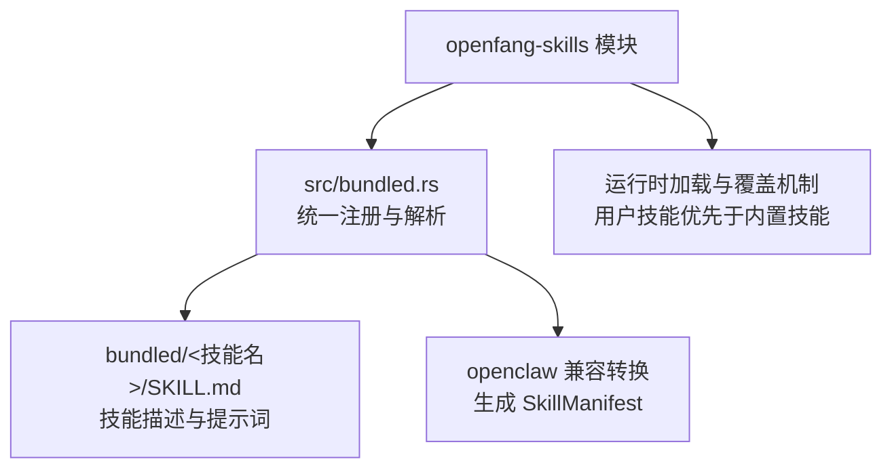
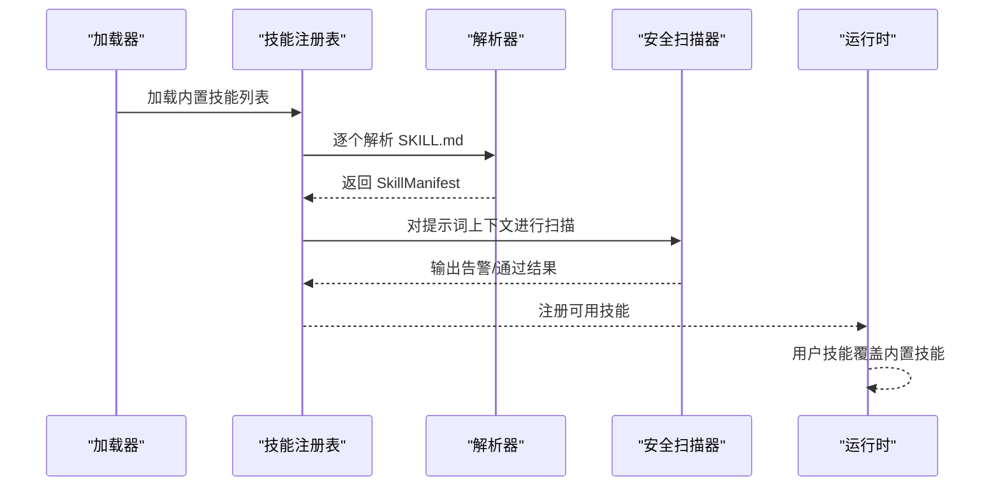
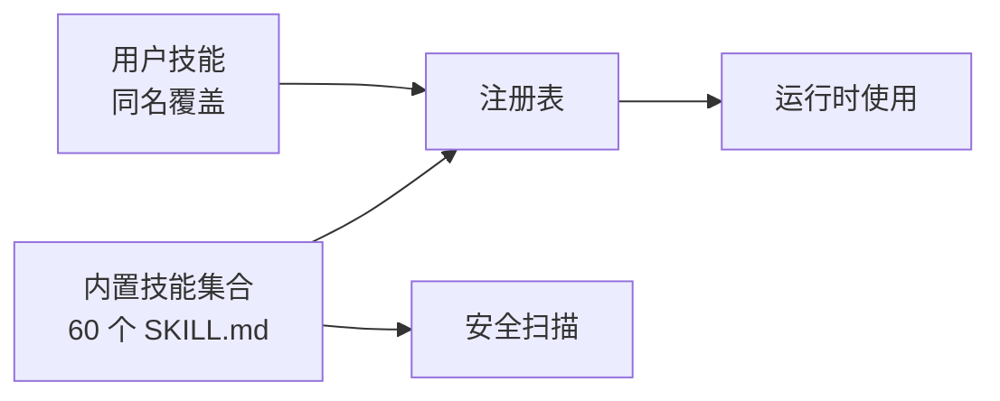

# 预构建技能

<cite>
**本文引用的文件**
- [bundled.rs](file://crates/openfang-skills/src/bundled.rs)
- [SKILL.md](file://crates/openfang-skills/bundled/python-expert/SKILL.md)
- [SKILL.md](file://crates/openfang-skills/bundled/golang-expert/SKILL.md)
- [SKILL.md](file://crates/openfang-skills/bundled/rust-expert/SKILL.md)
- [SKILL.md](file://crates/openfang-skills/bundled/typescript-expert/SKILL.md)
- [SKILL.md](file://crates/openfang-skills/bundled/aws/SKILL.md)
- [SKILL.md](file://crates/openfang-skills/bundled/gcp/SKILL.md)
- [SKILL.md](file://crates/openfang-skills/bundled/azure/SKILL.md)
- [SKILL.md](file://crates/openfang-skills/bundled/docker/SKILL.md)
- [SKILL.md](file://crates/openfang-skills/bundled/kubernetes/SKILL.md)
- [SKILL.md](file://crates/openfang-skills/bundled/ci-cd/SKILL.md)
- [SKILL.md](file://crates/openfang-skills/bundled/data-analyst/SKILL.md)
- [SKILL.md](file://crates/openfang-skills/bundled/data-pipeline/SKILL.md)
- [SKILL.md](file://crates/openfang-skills/bundled/security-audit/SKILL.md)
- [SKILL.md](file://crates/openfang-skills/bundled/compliance/SKILL.md)
- [SKILL.md](file://crates/openfang-skills/bundled/sql-analyst/SKILL.md)
</cite>

## 目录
1. [简介](#简介)
2. [项目结构](#项目结构)
3. [核心组件](#核心组件)
4. [架构总览](#架构总览)
5. [详细组件分析](#详细组件分析)
6. [依赖关系分析](#依赖关系分析)
7. [性能考量](#性能考量)
8. [故障排查指南](#故障排查指南)
9. [结论](#结论)
10. [附录](#附录)

## 简介
本文件为 OpenFang 预构建技能集合的权威参考文档，覆盖 60+ Prompt-only 技能的完整能力清单与使用说明。内容按功能域分组，包括：
- 代码专家类：Python、Go、Rust、TypeScript
- 云服务类：AWS、GCP、Azure
- DevOps 类：Docker、Kubernetes、CI/CD
- 数据分析类：SQL 分析、数据管道
- 安全类：合规审计、安全扫描

每项技能均提供功能定位、适用场景、关键原则与技术要点、常见模式、规避陷阱、典型调用路径与注意事项，并给出组合使用建议与最佳实践。

## 项目结构
OpenFang 将 60 个预构建技能以编译期嵌入的方式打包在 crates/openfang-skills 中，通过 bundled.rs 统一导出与解析，确保安装即用且可被用户自定义技能覆盖。

图表来源
- [bundled.rs:1-298](file://crates/openfang-skills/src/bundled.rs#L1-L298)

章节来源
- [bundled.rs:1-298](file://crates/openfang-skills/src/bundled.rs#L1-L298)

## 核心组件
- 预构建技能注册器：集中声明 60 个内置技能名称与内容，保证一致性与可验证性。
- 解析与校验：将 SKILL.md 转换为 SkillManifest，执行安全扫描与元数据校验。
- 覆盖策略：用户安装的同名技能会覆盖内置技能，便于定制化扩展。

章节来源
- [bundled.rs:10-189](file://crates/openfang-skills/src/bundled.rs#L10-L189)

## 架构总览
下图展示从内置技能到运行时使用的端到端流程：

图表来源
- [bundled.rs:185-256](file://crates/openfang-skills/src/bundled.rs#L185-L256)

## 详细组件分析

### 代码专家类

#### Python 专家
- 功能定位：面向标准库、类型注解、异步并发、性能优化的资深 Python 工程师角色。
- 关键原则：类型注解、组合优于继承、pytest 测试、剖析优化。
- 技术要点：dataclass、pydantic、asyncio 并发、虚拟环境与依赖管理。
- 常见模式：仓库模式、依赖注入、结构化日志、Typer CLI。
- 规避陷阱：避免可变默认参数、避免裸 except、避免阻塞事件循环等。

章节来源
- [SKILL.md:1-39](file://crates/openfang-skills/bundled/python-expert/SKILL.md#L1-L39)

#### Go 专家
- 功能定位：并发原语、接口设计、模块管理、Go 语言惯用法。
- 关键原则：接受接口、返回结构体、显式错误处理、goroutine 清理路径。
- 技术要点：context、fan-out/fan-in、errgroup、错误包装与检查。
- 常见模式：Done Channel、函数式选项、中间件链、工作池。
- 规避陷阱：避免闭包捕获循环变量、避免复杂 init、避免滥用通道。

章节来源
- [SKILL.md:1-39](file://crates/openfang-skills/bundled/golang-expert/SKILL.md#L1-L39)

#### Rust 专家
- 功能定位：所有权、生命周期、异步运行时、traits 抽象、unsafe 使用。
- 关键原则：API 边界使用拥有类型、类型系统表达不变量、Result 显式错误。
- 技术要点：lifetime 精简、tokio 并发、Pin<Box<dyn Future>>、宏。
- 常见模式：Builder、新类型包装、RAII Guard、类型状态机。
- 规避陷阱：避免无谓 clone、避免 unwrap 库代码、避免跨 await 持有 MutexGuard。

章节来源
- [SKILL.md:1-39](file://crates/openfang-skills/bundled/rust-expert/SKILL.md#L1-L39)

#### TypeScript 专家
- 功能定位：类型系统、高级泛型、工具类型、严格模式。
- 关键原则：启用严格模式、优先类型推断、判别联合优于类型断言。
- 技术要点：泛型约束、映射类型、条件类型、工具类型、判别联合。
- 常见模式：品牌类型、带泛型的 Builder、穷尽 switch、模板字面量类型。
- 规避陷阱：避免 as 断言掩盖问题、避免过度工程化泛型、避免使用 enum 表示字符串常量。

章节来源
- [SKILL.md:1-39](file://crates/openfang-skills/bundled/typescript-expert/SKILL.md#L1-L39)

### 云服务类

#### AWS 专家
- 功能定位：EC2、S3、Lambda、IAM、CLI 的架构、部署与运维。
- 关键原则：确认区域与账号、最小权限、基础设施即代码、审计与标签。
- 安全要点：禁用根账户日常操作、临时凭证、限制资源 ARN、启用 MFA。
- 常用服务：实例类型选择、S3 默认加密与生命周期、Lambda 内存与层、RDS 多可用区。
- 成本管理：成本探索与预算告警、Compute Optimizer、节省计划或预留实例。
- 规避陷阱：避免硬编码凭据、避免安全组全开放、避免忽略备份。

章节来源
- [SKILL.md:1-45](file://crates/openfang-skills/bundled/aws/SKILL.md#L1-L45)

#### GCP 专家
- 功能定位：托管服务优先、多区域可用性、IAM 最小权限、标签与审计。
- 关键原则：gcloud 配置、Cloud Run 无服务器部署、GKE 生产就绪、VPC Service Controls。
- 常用模式：Cloud Run + Cloud SQL、Pub/Sub 扇出、Workload Identity、存储生命周期。
- 规避陷阱：避免导出服务账号密钥、避免默认 VPC、避免忽略 Cloud Armor。

章节来源
- [SKILL.md:1-39](file://crates/openfang-skills/bundled/gcp/SKILL.md#L1-L39)

#### Azure 专家
- 功能定位：ARM/Bicep 基础设施、Entra ID、混合云、生产网络与监控。
- 关键原则：ARM/Bicep 声明式、集中身份管理、计算层级选择、命名组组织。
- 技术要点：AKS 生产级创建、App Service 部署槽位、Key Vault 密钥引用、Hub-Spoke 网络。
- 常用模式：Hub-Spoke、受管标识链、Bicep 模块化、成本标签预算。
- 规避陷阱：避免经典模型、避免明文密钥、避免 kubenet 生产网络、避免订阅级 Owner 角色。

章节来源
- [SKILL.md:1-39](file://crates/openfang-skills/bundled/azure/SKILL.md#L1-L39)

### DevOps 类

#### Docker 专家
- 功能定位：容器构建、运行、调试与优化。
- 关键原则：固定镜像标签、多阶段构建、非 root 运行、最小化层。
- Dockerfile 最佳实践：指令顺序、.dockerignore、HEALTHCHECK、COPY 优先于 ADD。
- 调试技巧：logs、exec、inspect、stats/top。
- Compose 模式：命名卷、健康检查依赖、环境变量文件。
- 规避陷阱：避免镜像层存储密钥、避免忽略构建上下文大小、避免 docker commit。

章节来源
- [SKILL.md:1-44](file://crates/openfang-skills/bundled/docker/SKILL.md#L1-L44)

#### Kubernetes 专家
- 功能定位：kubectl、Pods、Deployments、调试与优化。
- 关键原则：确认上下文、声明式清单、最小权限、命名空间隔离。
- 调试流程：查看 Pod 状态 → 描述事件 → 查看日志 → exec 调试 → 资源监控。
- 部署模式：Deployment/StatefulSet、探针配置、零停机滚动更新、PodDisruptionBudget。
- 网络与服务：ClusterIP/LoadBalancer/Ingress、NetworkPolicy、DNS 调试。
- 规避陷阱：避免直接删除 Pod、避免内存 limit 过紧、避免使用 latest 标签、避免将密钥放入 ConfigMap。

章节来源
- [SKILL.md:1-44](file://crates/openfang-skills/bundled/kubernetes/SKILL.md#L1-L44)

#### CI/CD 专家
- 功能定位：GitHub Actions、GitLab CI、Jenkins 的流水线工程。
- 关键原则：确定性构建、快速失败、秘密存储、流水线即代码、缓存策略。
- 技术要点：needs 依赖、矩阵构建、actions/cache、Jenkinsfile 结构、workflow_dispatch。
- 常见模式：蓝绿发布、金丝雀发布、滚动更新、分支保护流水线。
- 规避陷阱：避免硬编码运行器镜像版本、跳过安全扫描、PR 触发的安全风险、环境漂移。

章节来源
- [SKILL.md:1-39](file://crates/openfang-skills/bundled/ci-cd/SKILL.md#L1-L39)

### 数据分析类

#### SQL 分析专家
- 功能定位：查询编写、优化、调试、模式设计与数据分析。
- 关键原则：明确 SQL 方言、可读 SQL、显式 JOIN、执行计划分析。
- 查询优化：索引策略、避免 SELECT *、EXISTS 替代 IN、LIMIT 与分页、CTE 可读性权衡。
- 模式设计：至少 3NF、合适数据类型、NOT NULL、外键与 ON DELETE、时间戳列。
- 分析模式：窗口函数、聚合过滤、空值处理。
- 规避陷阱：避免 SQL 拼接、避免过多索引、避免 OFFSET 深分页、避免隐式类型转换。

章节来源
- [SKILL.md:1-45](file://crates/openfang-skills/bundled/sql-analyst/SKILL.md#L1-L45)

#### 数据管道专家
- 功能定位：ETL/ELT、Apache Spark、Airflow、dbt、数据质量。
- 关键原则：ELT 优先、任务幂等、按时间/逻辑键分区、阶段间数据质量检查、编排与计算分离。
- 技术要点：Airflow DAG 重试与 SLA、Spark 分区与广播连接、dbt staging/intermediate/mart、Great Expectations。
- 常见模式：增量加载、回填策略、死信队列、架构演进。
- 规避陷阱：避免在调度器中做重计算、避免忽略入湖校验、避免硬编码连接串、避免全表扫描。

章节来源
- [SKILL.md:1-39](file://crates/openfang-skills/bundled/data-pipeline/SKILL.md#L1-L39)

#### 数据分析专家
- 功能定位：统计、可视化、pandas/numpy/matplotlib/seaborn、SQL 探索。
- 关键原则：先 EDA 再建模、数据质量优先、正确可视化、清晰总结。
- EDA：形状、类型、描述统计、缺失值、分布与相关性、频数分析。
- 清洗：缺失值处理、日期解析、字符串标准化、重复值、类型转换。
- 可视化最佳实践：标题与轴标注、颜色意图、避免 3D 与截断、高分辨率导出、关键点标注。
- 统计分析：集中趋势与离散程度、假设检验、效应量与置信区间、参数检验前提。
- 规避陷阱：避免仅凭相关性得出因果、忽略样本量、选择性报告、聚合粒度错误。

章节来源
- [SKILL.md:1-53](file://crates/openfang-skills/bundled/data-analyst/SKILL.md#L1-L53)

### 安全类

#### 安全审计专家
- 功能定位：OWASP 框架、CVE 分析、代码审查、渗透测试方法论。
- 关键原则：纵深防御、边界输入验证、最小权限、密码学库、假设被攻破。
- 技术要点：SAST/DAST、依赖扫描、认证流、威胁建模、授权检查。
- 常见模式：输入验证层、参数化查询、CSP、密钥轮换。
- 规避陷阱：避免仅客户端验证、避免记录敏感数据、避免弱哈希、避免暴露详细错误。

章节来源
- [SKILL.md:1-39](file://crates/openfang-skills/bundled/security-audit/SKILL.md#L1-L39)

#### 合规专家
- 功能定位：SOC 2、GDPR、HIPAA、PCI-DSS 等框架的治理与实施。
- 关键原则：持续合规、映射到技术控制、隐私设计、风险登记、证据文档化。
- 技术要点：SOC 2 控制、GDPR 合规（DSAR、DPIA）、HIPAA（加密、BAAs、最小访问）、PCI-DSS（SAQ、网络分段）。
- 常见模式：证据收集流水线、季度访问评审、供应商风险评估、事件响应预案。
- 规避陷阱：避免合规仅由法律/安全部门负责、避免无合法基础收集数据、避免认为云厂商合规覆盖应用、避免跳过渗透测试。

章节来源
- [SKILL.md:1-39](file://crates/openfang-skills/bundled/compliance/SKILL.md#L1-L39)

## 依赖关系分析
- 技能内聚性：各技能围绕单一领域，职责清晰，互不依赖。
- 运行时耦合：技能通过统一注册表加载；用户自定义技能可覆盖内置技能，体现“后入为主”的覆盖策略。
- 安全耦合：内置技能在加载时经过安全扫描，降低提示词风险。

图表来源
- [bundled.rs:185-256](file://crates/openfang-skills/src/bundled.rs#L185-L256)

章节来源
- [bundled.rs:10-189](file://crates/openfang-skills/src/bundled.rs#L10-L189)

## 性能考量
- 提示词体积与解析开销：内置技能以编译期嵌入，减少运行时 IO；解析与安全扫描在启动阶段完成，避免运行时抖动。
- 缓存与复用：用户自定义技能覆盖后，无需重复解析相同名称的内置技能，提升加载效率。
- 调试与可观测性：云平台与 DevOps 技能提供丰富的诊断命令与模式，有助于快速定位性能瓶颈。

## 故障排查指南
- 技能加载失败
  - 现象：技能未出现在可用列表。
  - 排查：确认技能名称与路径一致；检查是否被用户技能覆盖。
  - 参考：覆盖策略测试用例。
- 提示词安全告警
  - 现象：加载内置技能时报安全警告。
  - 排查：根据扫描器输出修正提示词内容，避免敏感信息与不当指令。
  - 参考：安全扫描测试用例。
- 运行时行为异常
  - 现象：调用技能后无预期输出或报错。
  - 排查：核对技能适用场景与参数范围；对照调试流程（如 Kubernetes 调试五步法）。
  - 参考：各技能的调试与常见模式章节。

章节来源
- [bundled.rs:237-256](file://crates/openfang-skills/src/bundled.rs#L237-L256)
- [SKILL.md:16-23](file://crates/openfang-skills/bundled/kubernetes/SKILL.md#L16-L23)

## 结论
OpenFang 的预构建技能体系以“即取即用”为目标，通过编译期嵌入与运行时覆盖机制实现稳定、可扩展与可审计的能力集。建议在实际项目中：
- 优先选用与业务域匹配的技能组合；
- 在 CI/CD 中集成安全扫描与合规检查；
- 使用云平台与 DevOps 技能建立可观测与可恢复的基础设施；
- 以数据管道与 SQL 分析技能保障数据质量与洞察；
- 以安全审计与合规技能贯穿产品全生命周期。

## 附录

### 技能分类与数量
- 代码专家类：4 项（Python、Go、Rust、TypeScript）
- 云服务类：3 项（AWS、GCP、Azure）
- DevOps 类：3 项（Docker、Kubernetes、CI/CD）
- 数据分析类：3 项（SQL 分析、数据管道、数据分析）
- 安全类：2 项（合规审计、安全扫描）

总计：60 项内置技能，按层级分组，覆盖主流开发与运维场景。

章节来源
- [bundled.rs:10-183](file://crates/openfang-skills/src/bundled.rs#L10-L183)