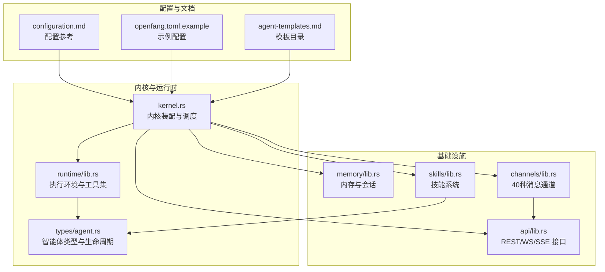
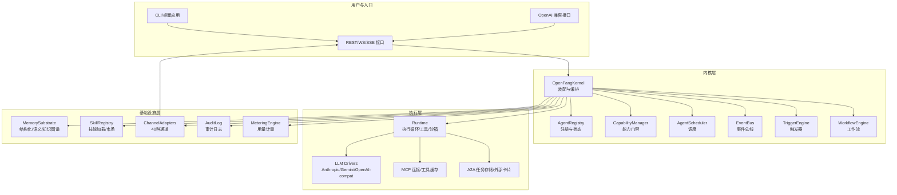
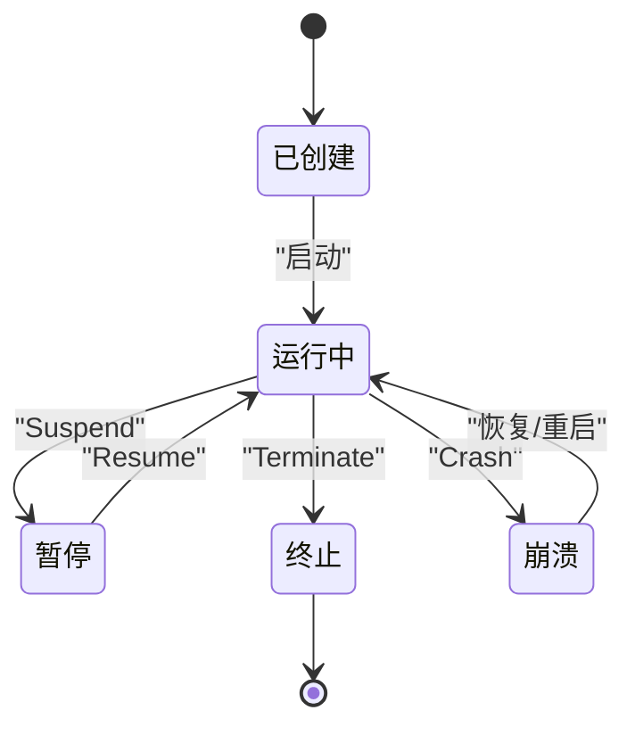
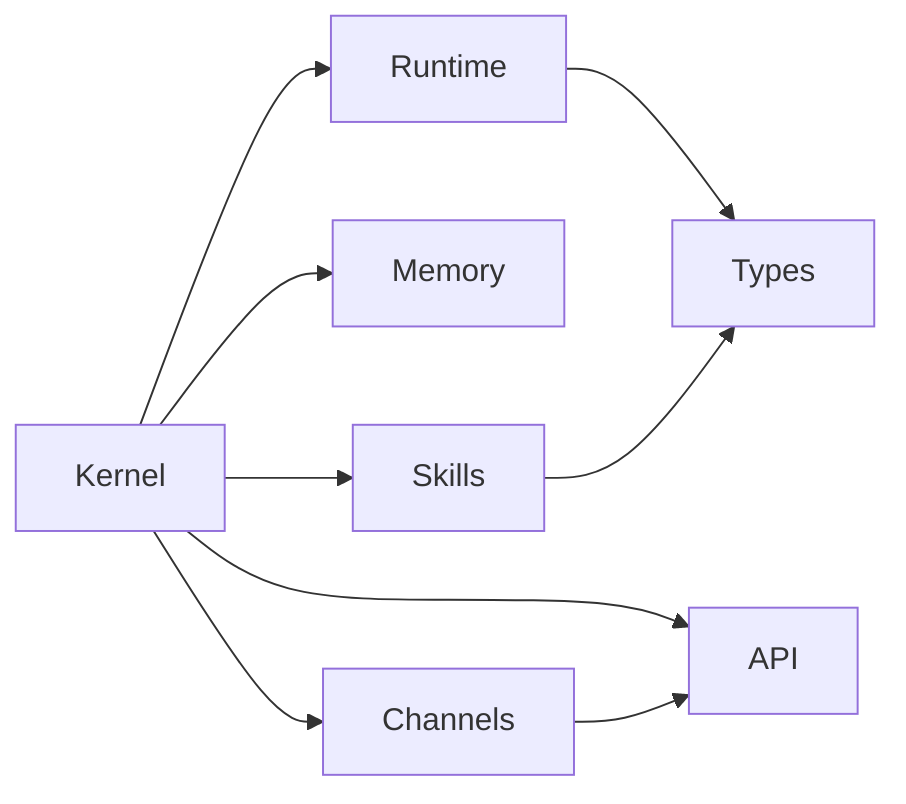

# 智能体开发

<cite>
**本文引用的文件**
- [README.md](file://README.md)
- [openfang.toml.example](file://openfang.toml.example)
- [CONTRIBUTING.md](file://CONTRIBUTING.md)
- [kernel.rs](file://crates/openfang-kernel/src/kernel.rs)
- [lib.rs（runtime）](file://crates/openfang-runtime/src/lib.rs)
- [lib.rs（memory）](file://crates/openfang-memory/src/lib.rs)
- [configuration.md](file://docs/configuration.md)
- [agent-templates.md](file://docs/agent-templates.md)
- [lib.rs（skills）](file://crates/openfang-skills/src/lib.rs)
- [lib.rs（channels）](file://crates/openfang-channels/src/lib.rs)
- [lib.rs（api）](file://crates/openfang-api/src/lib.rs)
- [agent.rs（types）](file://crates/openfang-types/src/agent.rs)
</cite>

## 目录
1. [简介](#简介)
2. [项目结构](#项目结构)
3. [核心组件](#核心组件)
4. [架构总览](#架构总览)
5. [详细组件分析](#详细组件分析)
6. [依赖关系分析](#依赖关系分析)
7. [性能考量](#性能考量)
8. [故障排查指南](#故障排查指南)
9. [结论](#结论)
10. [附录](#附录)

## 简介
本指南面向希望在 OpenFang 智能体操作系统上进行开发与运维的工程师与产品团队。内容覆盖 agent.toml 配置格式、智能体生命周期管理、模板开发流程；深入说明智能体注册机制、权限控制、资源限制、监控指标；并提供系统提示词设计、工具选择、上下文管理、输出格式化的最佳实践。同时包含预构建智能体模板分析、自定义开发指南、版本管理策略，以及与技能系统、内存与会话处理的集成方法，并给出测试、调试与部署的完整流程，最后涵盖社区贡献、模板发布与 Marketplace 集成指南。

## 项目结构
OpenFang 采用多 crate 的模块化组织方式，围绕“内核（kernel）+ 运行时（runtime）+ API 层 + 记忆与技能 + 通道适配器 + 类型与协议”等子系统协同工作。下图展示与智能体开发直接相关的核心模块及其职责：

图表来源
- [kernel.rs:1-164](file://crates/openfang-kernel/src/kernel.rs#L1-L164)
- [lib.rs（runtime）:1-59](file://crates/openfang-runtime/src/lib.rs#L1-L59)
- [lib.rs（memory）:1-20](file://crates/openfang-memory/src/lib.rs#L1-L20)
- [lib.rs（skills）:1-255](file://crates/openfang-skills/src/lib.rs#L1-L255)
- [lib.rs（channels）:1-56](file://crates/openfang-channels/src/lib.rs#L1-L56)
- [lib.rs（api）:1-19](file://crates/openfang-api/src/lib.rs#L1-L19)
- [configuration.md:1-200](file://docs/configuration.md#L1-L200)
- [openfang.toml.example:1-49](file://openfang.toml.example#L1-L49)
- [agent-templates.md:1-120](file://docs/agent-templates.md#L1-L120)

章节来源
- [README.md:231-251](file://README.md#L231-L251)
- [configuration.md:1-120](file://docs/configuration.md#L1-L120)
- [openfang.toml.example:1-49](file://openfang.toml.example#L1-L49)

## 核心组件
- 内核（Kernel）
  - 负责装配所有子系统（记忆、技能、通道、API、调度、审计、计量、触发器、工作流等），提供统一的主 API。
  - 关键职责：启动与热重载、能力门禁（RBAC）、默认模型链路、WASM 沙箱、LLM 驱动与回退、交付收据跟踪、进程与 MCP 连接管理等。
- 运行时（Runtime）
  - 提供智能体执行循环、LLM 驱动抽象、工具执行、WASM 沙箱、A2A 协议、浏览器自动化、媒体理解、TTS、搜索与抓取、进程管理等。
- 记忆（Memory）
  - 统一的内存 API，后端包含结构化存储（SQLite）、语义检索（向量）与知识图谱（SQLite），支持会话与使用统计。
- 技能（Skills）
  - 可插拔工具包，支持 Python/WASM/Node/Shell/Builtin/PromptOnly 多运行时，具备清单、来源追踪、市场下载与安全扫描。
- 通道（Channels）
  - 40 种消息平台适配器（Telegram/Discord/Slack/WhatsApp/Signal/Matrix/Email 等），统一事件模型与速率限制。
- API（API）
  - 140+ REST/WS/SSE 端点，OpenAI 兼容接口，仪表盘 SPA，支持代理与聊天。

章节来源
- [kernel.rs:1-164](file://crates/openfang-kernel/src/kernel.rs#L1-L164)
- [lib.rs（runtime）:1-59](file://crates/openfang-runtime/src/lib.rs#L1-L59)
- [lib.rs（memory）:1-20](file://crates/openfang-memory/src/lib.rs#L1-L20)
- [lib.rs（skills）:1-255](file://crates/openfang-skills/src/lib.rs#L1-L255)
- [lib.rs（channels）:1-56](file://crates/openfang-channels/src/lib.rs#L1-L56)
- [lib.rs（api）:1-19](file://crates/openfang-api/src/lib.rs#L1-L19)

## 架构总览
下图展示 OpenFang 的高层架构与数据流，突出智能体从配置到执行、再到外部交互的关键路径：

图表来源
- [kernel.rs:1-164](file://crates/openfang-kernel/src/kernel.rs#L1-L164)
- [lib.rs（runtime）:1-59](file://crates/openfang-runtime/src/lib.rs#L1-L59)
- [lib.rs（memory）:1-20](file://crates/openfang-memory/src/lib.rs#L1-L20)
- [lib.rs（skills）:1-255](file://crates/openfang-skills/src/lib.rs#L1-L255)
- [lib.rs（channels）:1-56](file://crates/openfang-channels/src/lib.rs#L1-L56)
- [lib.rs（api）:1-19](file://crates/openfang-api/src/lib.rs#L1-L19)

## 详细组件分析

### agent.toml 配置格式与最佳实践
- 基本字段
  - 名称、版本、描述、作者、模块（内置/外部）、标签、优先级、元数据等。
  - 模型配置：提供者、模型、最大令牌数、温度、系统提示、可选 API 密钥环境变量与基础 URL。
  - 回退模型链：按序尝试，提升可用性。
  - 资源配额：内存、CPU、工具调用频率、LLM 令牌/网络/成本限额（小时/天/月）。
  - 能力授予：网络、工具、内存读写作用域、是否允许 spawn/消息模式、Shell 命令白名单、OF P2P 发现与连接模式。
  - 工具配置：按工具名传入参数映射。
  - 技能引用：安装的技能列表。
  - MCP 服务器白名单。
  - 自动化与守护配置：安静时段、心跳间隔、最大迭代/重启次数等。
  - 工作区与身份文件生成开关。
  - 执行策略与工具白/黑名单。
- 最佳实践
  - 明确系统提示词的边界与角色，避免过度泛化；结合领域知识注入技能（SKILL.md）。
  - 合理设置温度与最大令牌，平衡创造性与稳定性。
  - 使用资源配额限制高成本操作，开启成本上限与时间窗口控制。
  - 通过工具白/黑名单与能力门禁最小化攻击面。
  - 对需要网络/Shell 的场景明确授权范围，避免全量放行。
  - 使用回退模型链保障服务连续性。
- 示例参考
  - 官方示例配置文件与最小配置参考见配置文档与示例文件。

章节来源
- [agent.rs（types）:424-530](file://crates/openfang-types/src/agent.rs#L424-L530)
- [configuration.md:256-411](file://docs/configuration.md#L256-L411)
- [openfang.toml.example:1-49](file://openfang.toml.example#L1-L49)

### 智能体生命周期管理
- 生命周期状态
  - Created（已创建未启动）、Running（运行中）、Suspended（暂停）、Terminated（终止）、Crashed（崩溃待恢复）。
- 调度模式
  - Reactive（事件驱动）、Periodic（周期性）、Proactive（条件触发）、Continuous（持续循环）。
- 自动化与守护
  - Quiet hours、心跳、最大迭代/重启次数、心跳通道。
- 执行策略与工具过滤
  - Observe/Assist/Full 模式对工具集合进行过滤。
- 会话与工作区
  - 自动生成工作区目录与身份文件（SOUL/USER/TOOLS/MEMORY/AGENTS/BOOTSTRAP/IDENTITY/HEARTBEAT），并限制大小与路径遍历风险。
- 关键实现要点
  - 内核负责创建工作区、生成身份文件、记录会话收据、限制并发消息以避免会话损坏。
  - DeliveryTracker 维护收据上限与全局容量，防止内存膨胀。

图表来源
- [agent.rs（types）:172-186](file://crates/openfang-types/src/agent.rs#L172-L186)
- [kernel.rs:166-270](file://crates/openfang-kernel/src/kernel.rs#L166-L270)

章节来源
- [agent.rs（types）:172-241](file://crates/openfang-types/src/agent.rs#L172-L241)
- [kernel.rs:272-483](file://crates/openfang-kernel/src/kernel.rs#L272-L483)

### 模板开发流程与预构建模板分析
- 模板位置与命名
  - agents/<name>/agent.toml，每个模板是一个独立的智能体清单。
- 开发步骤
  - 创建目录与 agent.toml 清单，声明模型、资源、能力与工具。
  - 在 [model] 中添加系统提示词（可选）。
  - 通过 openfang agent spawn 或 REST API 启动。
  - 测试与迭代，必要时调整资源配额与能力。
- 预构建模板分类
  - 分为 4 个层级：前沿（DeepSeek）、智能（Gemini 2.5 Flash）、均衡（Groq + Gemini 回退）、快速（Groq 8B/70B）。
  - 每个模板标注提供者、模型、回退策略、温度、最大令牌、令牌配额、调度模式、工具集与能力。
- 版本管理建议
  - 使用语义化版本（SemVer），在 agent.toml 中维护 version 字段。
  - 通过 tags 与 metadata 辅助发现与归档。
  - 在稳定模式（Stable）下固定模型或使用 pinned_model 以保证一致性。

章节来源
- [agent-templates.md:1-120](file://docs/agent-templates.md#L1-L120)
- [agent-templates.md:107-800](file://docs/agent-templates.md#L107-L800)
- [CONTRIBUTING.md:158-212](file://CONTRIBUTING.md#L158-L212)

### 权限控制与能力门禁
- 能力声明（ManifestCapabilities）
  - network、tools、memory_read/write、agent_spawn/message、shell、ofp_discover/connect。
- 运行时过滤
  - AgentMode（Observe/Assist/Full）对工具进行过滤。
- RBAC 与用户绑定
  - 用户角色（owner/admin/user/viewer），API 密钥哈希，通道绑定。
- 执行策略
  - 支持字符串简写与完整表单，可覆盖全局策略。
- 最佳实践
  - 默认最小授权，仅授予所需工具与网络范围。
  - 对 Shell 与跨智能体通信启用显式审批与审计。

章节来源
- [agent.rs（types）:532-561](file://crates/openfang-types/src/agent.rs#L532-L561)
- [agent.rs（types）:188-223](file://crates/openfang-types/src/agent.rs#L188-L223)
- [configuration.md:182-196](file://docs/configuration.md#L182-L196)

### 资源限制与监控指标
- 资源配额（ResourceQuota）
  - 最大内存、CPU 时间、工具调用频率、LLM 令牌/网络/成本限额（小时/天/月）。
- 成本与用量
  - MeteringEngine 共享内存数据库连接，记录使用与计费。
  - usage_footer 控制响应中是否显示用量信息（关闭/仅令牌/仅成本/完整）。
- 监控与可观测性
  - 审计日志（Merkle 哈希链）、会话收据、错误与失败统计。
- 最佳实践
  - 为高成本任务设置严格令牌与成本上限。
  - 使用会话压缩与记忆衰减降低上下文开销。

章节来源
- [agent.rs（types）:247-282](file://crates/openfang-types/src/agent.rs#L247-L282)
- [kernel.rs:718-721](file://crates/openfang-kernel/src/kernel.rs#L718-L721)
- [configuration.md:235-253](file://docs/configuration.md#L235-L253)

### 智能体与技能系统集成
- 技能清单（SkillManifest）
  - skill、runtime、tools、requirements、prompt_context、source。
- 运行时类型
  - Python/WASM/Node/Shell/Builtin/PromptOnly。
- 注册与市场
  - 本地/捆绑/OpenClaw 转换/ClawHub 下载，支持热重载与冻结。
- 安全与验证
  - Prompt-only 技能仅注入上下文，无执行代码；其他类型受沙箱与策略约束。
- 最佳实践
  - 将领域知识封装为 Prompt-only 技能，减少执行风险。
  - 对需要网络/Shell 的技能明确 requirements 并最小化授权。

章节来源
- [lib.rs（skills）:104-188](file://crates/openfang-skills/src/lib.rs#L104-L188)
- [lib.rs（skills）:48-81](file://crates/openfang-skills/src/lib.rs#L48-L81)

### 内存管理与会话处理
- 存储后端
  - 结构化存储（SQLite）、语义检索（向量）、知识图谱（SQLite）。
- 会话与身份文件
  - 自动生成 SOUL/USER/TOOLS/MEMORY/AGENTS/BOOTSTRAP/IDENTITY/HEARTBEAT 文件。
  - 路径规范化与大小限制，防止提示注入与磁盘膨胀。
- 收据跟踪
  - DeliveryTracker 维护最近收据，带全局与每智能体上限。
- 最佳实践
  - 合理设置记忆衰减率与合并阈值，定期清理过期条目。
  - 限制身份文件大小，避免提示污染。

章节来源
- [lib.rs（memory）:1-20](file://crates/openfang-memory/src/lib.rs#L1-L20)
- [kernel.rs:272-483](file://crates/openfang-kernel/src/kernel.rs#L272-L483)
- [kernel.rs:166-270](file://crates/openfang-kernel/src/kernel.rs#L166-L270)

### 通道适配器与消息路由
- 适配器生态
  - Telegram/Discord/Slack/WhatsApp/Signal/Matrix/Email 等 40+ 平台。
- 配置要点
  - 每个通道支持默认代理（default_agent）、轮询/监听间隔、速率限制与输出格式化。
- 最佳实践
  - 为不同渠道设置不同的默认代理与权限白名单。
  - 使用通道覆盖（overrides）针对特定场景微调行为。

章节来源
- [lib.rs（channels）:1-56](file://crates/openfang-channels/src/lib.rs#L1-L56)
- [configuration.md:414-800](file://docs/configuration.md#L414-L800)

### API 与 OpenAI 兼容接口
- 端点概览
  - 140+ REST/WS/SSE 端点，覆盖智能体、记忆、工作流、通道、模型、技能、A2A、手（Hands）等。
- OpenAI 兼容
  - /v1/chat/completions 等端点，便于现有工具无缝迁移。
- 最佳实践
  - 使用 Bearer 认证（如配置了 api_key），在生产环境避免明文暴露密钥。

章节来源
- [lib.rs（api）:1-19](file://crates/openfang-api/src/lib.rs#L1-L19)
- [README.md:389-404](file://README.md#L389-L404)

### 测试、调试与部署流程
- 测试
  - cargo test --workspace；clippy 零警告；rustfmt 格式化；doctor 检查。
- 调试
  - 查看内核日志、审计日志、会话收据、错误堆栈；利用通道适配器的健康检查与收据追踪定位问题。
- 部署
  - 单二进制部署，支持 systemd 服务文件；通过环境变量覆盖配置（如 OPENFANG_LISTEN、OPENFANG_API_KEY）。
- 最佳实践
  - 生产环境启用 RBAC 与 API 密钥；限制网络访问与 Shell 权限；开启审计与用量监控。

章节来源
- [CONTRIBUTING.md:51-109](file://CONTRIBUTING.md#L51-L109)
- [README.md:407-431](file://README.md#L407-L431)

### 社区贡献、模板发布与 Marketplace 集成
- 贡献流程
  - Fork 仓库、功能分支、提交规范、PR 审查、CI 通过。
- 新增模板
  - 在 agents/<name>/agent.toml 中编写清单，测试后提交 PR。
- 新增通道适配器
  - 实现 ChannelAdapter trait，注册模块并在桥接层接入。
- 新增工具
  - 在 runtime 的工具执行器中注册，更新工具定义与清单。
- Marketplace 集成
  - 技能系统支持从 ClawHub 下载与安装，具备来源追踪与安全扫描。

章节来源
- [CONTRIBUTING.md:158-326](file://CONTRIBUTING.md#L158-L326)
- [lib.rs（skills）:1-255](file://crates/openfang-skills/src/lib.rs#L1-L255)

## 依赖关系分析
- 组件耦合
  - 内核通过 KernelHandle trait 解耦各子系统，避免循环依赖。
  - 运行时依赖类型系统（AgentManifest、Capability 等）与内存/技能/通道/API。
  - 技能系统与运行时通过工具定义与执行接口耦合。
- 外部依赖
  - LLM 提供商驱动（Anthropic/Gemini/OpenAI-compat 等）、SQLite、Wasmtime、libp2p（OFP）。
- 潜在环路
  - 通过 trait 与共享句柄避免直接循环引用；注意不要在内核中引入新的循环依赖。

图表来源
- [kernel.rs:1-164](file://crates/openfang-kernel/src/kernel.rs#L1-L164)
- [lib.rs（runtime）:1-59](file://crates/openfang-runtime/src/lib.rs#L1-L59)
- [lib.rs（memory）:1-20](file://crates/openfang-memory/src/lib.rs#L1-L20)
- [lib.rs（skills）:1-255](file://crates/openfang-skills/src/lib.rs#L1-L255)
- [lib.rs（channels）:1-56](file://crates/openfang-channels/src/lib.rs#L1-L56)
- [lib.rs（api）:1-19](file://crates/openfang-api/src/lib.rs#L1-L19)

章节来源
- [kernel.rs:1-164](file://crates/openfang-kernel/src/kernel.rs#L1-L164)

## 性能考量
- 冷启动与内存占用
  - 单二进制、WASM 沙箱与 SQLite 内嵌，冷启动与内存占用优于多数框架。
- 上下文管理
  - 会话压缩与记忆衰减降低上下文长度，提高响应速度。
- 模型路由与回退
  - 根据复杂度自动选择模型，失败时按链路回退，提升成功率。
- 最佳实践
  - 为高频任务选择更小模型；为深度推理任务选择更大模型；合理设置工具并发与资源配额。

## 故障排查指南
- 常见问题
  - LLM 提供商未配置：内核提供 Stub 驱动返回友好错误，可通过仪表盘或配置修复。
  - 通道无法接收消息：检查令牌、默认代理、轮询间隔与速率限制。
  - 工具执行失败：查看工具定义、能力门禁与执行策略；确认 Shell/网络授权。
  - 会话异常：启用会话修复与审计日志，检查收据与错误堆栈。
- 调试工具
  - 内核日志、审计日志、会话收据、错误码与提示注入扫描。
- 诊断流程
  - 逐步缩小范围：通道 → 内核 → 运行时 → 技能/工具 → 外部服务。

章节来源
- [kernel.rs:44-58](file://crates/openfang-kernel/src/kernel.rs#L44-L58)
- [configuration.md:235-253](file://docs/configuration.md#L235-L253)

## 结论
OpenFang 通过模块化内核、能力门禁、资源配额与丰富的基础设施组件，为智能体开发提供了安全、可控且高性能的运行环境。遵循本文的配置与开发最佳实践，结合模板与技能系统，可快速构建从日常助理到专业领域的智能体，并通过 Marketplace 与社区生态持续演进。

## 附录
- 快速开始
  - 安装、初始化、启动与激活预置 Hands/Agent。
- 配置参考
  - 完整 config.toml 字段说明与示例。
- 模板目录
  - 30+ 预置模板的层级、模型与工具清单。

章节来源
- [README.md:407-431](file://README.md#L407-L431)
- [configuration.md:1-200](file://docs/configuration.md#L1-L200)
- [agent-templates.md:1-120](file://docs/agent-templates.md#L1-L120)