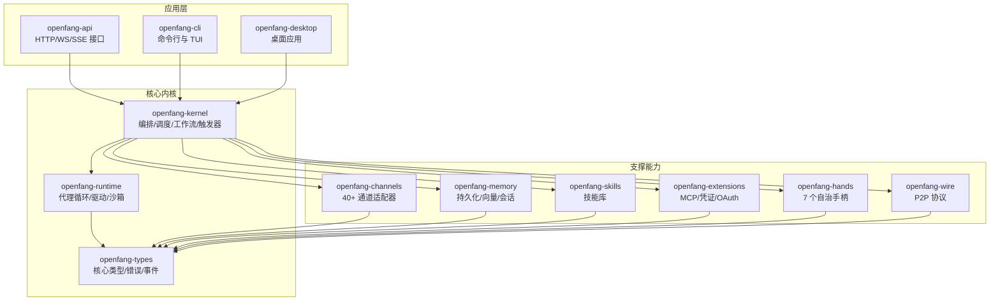
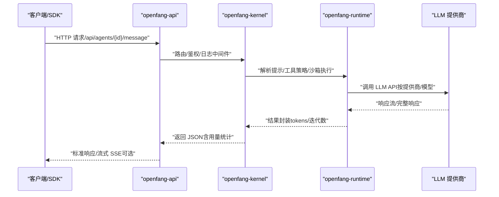
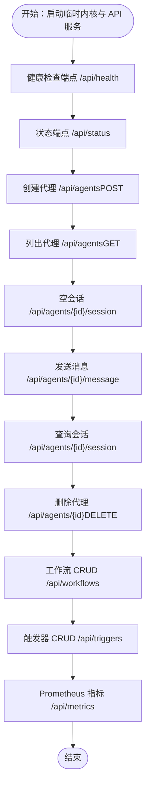
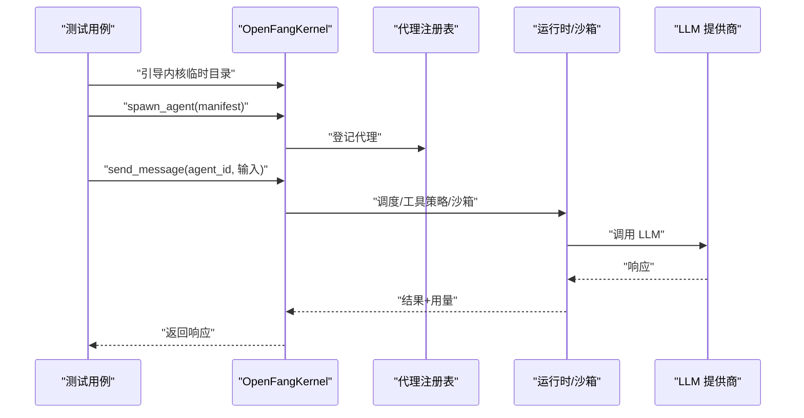
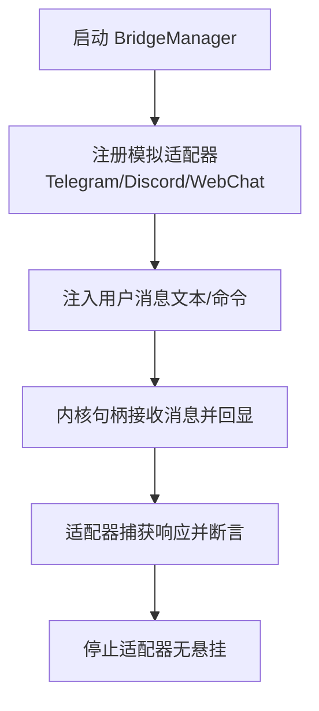
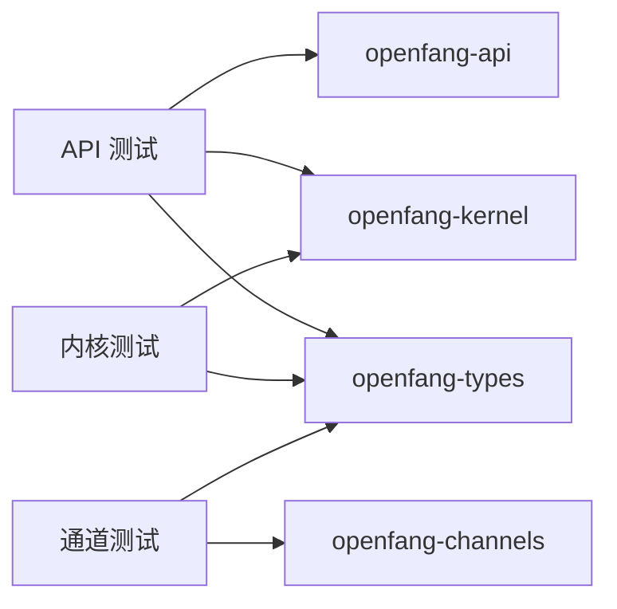

# 智能体测试与调试

<cite>
**本文引用的文件**
- [Cargo.toml](file://Cargo.toml)
- [README.md](file://README.md)
- [openfang-api 测试：api_integration_test.rs](file://crates/openfang-api/tests/api_integration_test.rs)
- [openfang-api 测试：daemon_lifecycle_test.rs](file://crates/openfang-api/tests/daemon_lifecycle_test.rs)
- [openfang-api 测试：load_test.rs](file://crates/openfang-api/tests/load_test.rs)
- [openfang-kernel 测试：integration_test.rs](file://crates/openfang-kernel/tests/integration_test.rs)
- [openfang-kernel 测试：multi_agent_test.rs](file://crates/openfang-kernel/tests/multi_agent_test.rs)
- [openfang-kernel 测试：wasm_agent_integration_test.rs](file://crates/openfang-kernel/tests/wasm_agent_integration_test.rs)
- [openfang-kernel 测试：workflow_integration_test.rs](file://crates/openfang-kernel/tests/workflow_integration_test.rs)
- [openfang-channels 测试：bridge_integration_test.rs](file://crates/openfang-channels/tests/bridge_integration_test.rs)
</cite>

## 目录
1. [简介](#简介)
2. [项目结构](#项目结构)
3. [核心组件](#核心组件)
4. [架构总览](#架构总览)
5. [详细组件分析](#详细组件分析)
6. [依赖关系分析](#依赖关系分析)
7. [性能考量](#性能考量)
8. [故障排查指南](#故障排查指南)
9. [结论](#结论)
10. [附录](#附录)

## 简介
本指南面向 OpenFang 智能体系统的测试与调试，覆盖单元测试、集成测试、端到端测试与性能测试的策略与落地方法；并系统阐述日志分析、状态检查、内存监控与性能分析等调试手段，总结常见问题（启动失败、执行异常、资源泄漏、死锁）的诊断路径与修复建议。同时提供测试环境搭建、自动化测试与持续集成建议，以及质量保证流程、调试案例、故障排除、性能优化与监控告警的最佳实践。

## 项目结构
OpenFang 采用多 crate 的模块化设计，围绕内核（kernel）、运行时（runtime）、API（api）、通道适配器（channels）、内存（memory）、类型定义（types）等核心模块构建。测试分布在各 crate 的 tests 目录中，涵盖 API、内核、通道桥接、工作流与 WASM 集成等场景。

图表来源
- [Cargo.toml:1-160](file://Cargo.toml#L1-L160)

章节来源
- [Cargo.toml:1-160](file://Cargo.toml#L1-L160)

## 核心组件
- 内核（Kernel）：负责代理编排、工作流、触发器、调度、配额计量与安全门控。
- 运行时（Runtime）：实现代理循环、LLM 驱动、53+ 工具、WASM 双重计量沙箱、MCP/A2A。
- API（API）：提供 140+ REST/WS/SSE 接口、OpenAI 兼容 API、仪表盘与健康检查。
- 通道（Channels）：40+ 平台适配器（Telegram/Discord/Slack/WhatsApp 等），支持速率限制与输出格式化。
- 内存（Memory）：SQLite 持久化、向量嵌入、规范会话与压缩。
- 类型（Types）：核心数据结构、污点追踪、Ed25519 签名、模型目录。
- 技能（Skills）：60+ 内置技能、SKILL.md 解析、FangHub 市场。
- 手柄（Hands）：7 个自治手柄生命周期管理与 HAND.toml 解析。
- 扩展（Extensions）：MCP 模板、AES-256-GCM 凭证保险库、OAuth2 PKCE。
- 线缆（Wire）：OFP P2P 协议与互认证。

章节来源
- [README.md:231-250](file://README.md#L231-L250)

## 架构总览
下图展示从 API 到内核、再到运行时与外部 LLM 提供商的调用链路，以及通道桥接在消息进入系统后的分发路径。

图表来源
- [openfang-api 测试：api_integration_test.rs:187-367](file://crates/openfang-api/tests/api_integration_test.rs#L187-L367)
- [openfang-kernel 测试：integration_test.rs:27-84](file://crates/openfang-kernel/tests/integration_test.rs#L27-L84)

## 详细组件分析

### API 层测试策略与流程
- 单元测试：验证路由、中间件、请求头注入、健康与状态端点行为。
- 集成测试：启动真实内核与 Axum 服务器，使用 reqwest 调用真实端点，覆盖代理生命周期、会话、工作流与触发器 CRUD。
- 性能测试：并发代理创建、端点延迟（p50/p95/p99）、并发读取、会话管理、工作流批量创建、指标端点稳定性。

图表来源
- [openfang-api 测试：api_integration_test.rs:187-496](file://crates/openfang-api/tests/api_integration_test.rs#L187-L496)

章节来源
- [openfang-api 测试：api_integration_test.rs:1-800](file://crates/openfang-api/tests/api_integration_test.rs#L1-L800)
- [openfang-api 测试：daemon_lifecycle_test.rs:1-275](file://crates/openfang-api/tests/daemon_lifecycle_test.rs#L1-L275)
- [openfang-api 测试：load_test.rs:1-587](file://crates/openfang-api/tests/load_test.rs#L1-L587)

### 内核层测试策略与流程
- 单元/集成测试：内核引导、代理创建、消息发送、用量统计、多代理并行、混合 LLM/WASM 代理共存。
- 工作流测试：内核级注册与解析、按名称/ID 引用代理、触发器注册与列表、端到端（E2E）通过真实 LLM 完整流水线。

图表来源
- [openfang-kernel 测试：integration_test.rs:27-84](file://crates/openfang-kernel/tests/integration_test.rs#L27-L84)
- [openfang-kernel 测试：multi_agent_test.rs:31-202](file://crates/openfang-kernel/tests/multi_agent_test.rs#L31-L202)
- [openfang-kernel 测试：wasm_agent_integration_test.rs:149-357](file://crates/openfang-kernel/tests/wasm_agent_integration_test.rs#L149-L357)
- [openfang-kernel 测试：workflow_integration_test.rs:63-172](file://crates/openfang-kernel/tests/workflow_integration_test.rs#L63-L172)

章节来源
- [openfang-kernel 测试：integration_test.rs:1-164](file://crates/openfang-kernel/tests/integration_test.rs#L1-L164)
- [openfang-kernel 测试：multi_agent_test.rs:1-202](file://crates/openfang-kernel/tests/multi_agent_test.rs#L1-L202)
- [openfang-kernel 测试：wasm_agent_integration_test.rs:1-411](file://crates/openfang-kernel/tests/wasm_agent_integration_test.rs#L1-L411)
- [openfang-kernel 测试：workflow_integration_test.rs:1-405](file://crates/openfang-kernel/tests/workflow_integration_test.rs#L1-L405)

### 通道桥接测试策略与流程
- 使用模拟适配器与内核句柄，构造 in-process 的消息流，验证文本消息分发、命令处理（/agents、/help、/agent、/status）、无代理分配时的错误提示、多适配器并发运行与生命周期停止。

图表来源
- [openfang-channels 测试：bridge_integration_test.rs:201-494](file://crates/openfang-channels/tests/bridge_integration_test.rs#L201-L494)

章节来源
- [openfang-channels 测试：bridge_integration_test.rs:1-546](file://crates/openfang-channels/tests/bridge_integration_test.rs#L1-L546)

## 依赖关系分析
- 测试依赖统一通过工作区配置管理，使用 tokio、tokio-test、tempfile 等进行异步测试与临时目录清理。
- API 测试依赖 openfang-api、openfang-kernel、openfang-types，并通过中间件与路由层进行端到端验证。
- 内核测试直接依赖 openfang-kernel 与 openfang-types，覆盖 LLM 与 WASM 执行路径。
- 通道测试依赖 openfang-channels 的桥接与路由器，模拟真实消息流。

图表来源
- [Cargo.toml:1-160](file://Cargo.toml#L1-L160)
- [openfang-api 测试：api_integration_test.rs:10-20](file://crates/openfang-api/tests/api_integration_test.rs#L10-L20)
- [openfang-kernel 测试：integration_test.rs:5-7](file://crates/openfang-kernel/tests/integration_test.rs#L5-L7)
- [openfang-channels 测试：bridge_integration_test.rs:10-21](file://crates/openfang-channels/tests/bridge_integration_test.rs#L10-L21)

章节来源
- [Cargo.toml:1-160](file://Cargo.toml#L1-L160)

## 性能考量
- 并发代理创建：负载测试验证在高并发下代理创建的成功率与吞吐。
- 端点延迟：对健康、状态、代理列表、工具、模型、指标、用量等端点进行 p50/p95/p99 延迟评估。
- 并发读取：多客户端同时访问不同端点，确保无死锁与资源竞争。
- 会话管理：批量创建、列出与切换会话，验证内存与状态一致性。
- 工作流操作：并发创建工作流与列表查询，评估注册表与调度器压力。
- 指标端点：在持续负载下访问 Prometheus 指标端点，确保稳定输出。

章节来源
- [openfang-api 测试：load_test.rs:148-587](file://crates/openfang-api/tests/load_test.rs#L148-L587)

## 故障排查指南

### 启动失败
- 症状：API 无法启动或健康端点不可达。
- 排查要点：
  - 检查临时目录权限与磁盘空间。
  - 确认内核引导参数（默认模型、API 密钥、数据目录）正确。
  - 观察中间件日志与请求 ID，定位具体错误来源。
- 相关测试参考：
  - 守护进程信息序列化/反序列化与文件读取。
  - 服务器立即响应性测试。

章节来源
- [openfang-api 测试：daemon_lifecycle_test.rs:21-80](file://crates/openfang-api/tests/daemon_lifecycle_test.rs#L21-L80)
- [openfang-api 测试：daemon_lifecycle_test.rs:215-275](file://crates/openfang-api/tests/daemon_lifecycle_test.rs#L215-L275)

### 执行异常
- 症状：代理消息发送失败、工作流执行中断、WASM 模块无限循环。
- 排查要点：
  - 检查 LLM 提供商密钥与网络连通性（需密钥的测试用例会跳过）。
  - 查看运行时用量统计与迭代次数，确认是否因超时或燃料耗尽导致失败。
  - 对于 WASM：确认模块存在、燃料配置合理、宿主调用参数正确。
- 相关测试参考：
  - LLM 集成测试与多代理测试。
  - WASM 集成测试（燃料耗尽、缺失模块、宿主调用）。
  - 工作流内核级注册与 E2E（含真实 LLM）。

章节来源
- [openfang-kernel 测试：integration_test.rs:27-84](file://crates/openfang-kernel/tests/integration_test.rs#L27-L84)
- [openfang-kernel 测试：multi_agent_test.rs:31-202](file://crates/openfang-kernel/tests/multi_agent_test.rs#L31-L202)
- [openfang-kernel 测试：wasm_agent_integration_test.rs:199-246](file://crates/openfang-kernel/tests/wasm_agent_integration_test.rs#L199-L246)
- [openfang-kernel 测试：workflow_integration_test.rs:298-404](file://crates/openfang-kernel/tests/workflow_integration_test.rs#L298-L404)

### 资源泄漏
- 症状：内存占用持续增长、文件描述符泄露、会话未清理。
- 排查要点：
  - 在测试中使用临时目录与 Drop 实现清理，确保内核与服务器关闭后资源释放。
  - 对并发创建/销毁代理进行回归，观察代理计数与会话数量。
- 相关测试参考：
  - 负载测试中的 spawn+kill 循环。
  - 通道桥接生命周期测试。

章节来源
- [openfang-api 测试：load_test.rs:492-546](file://crates/openfang-api/tests/load_test.rs#L492-L546)
- [openfang-channels 测试：bridge_integration_test.rs:458-494](file://crates/openfang-channels/tests/bridge_integration_test.rs#L458-L494)

### 死锁检测
- 症状：并发读取/写入阻塞、适配器停止卡住。
- 排查要点：
  - 使用 tokio 集成测试的并发任务与通道，观察是否出现阻塞。
  - 在通道桥接测试中验证多适配器并发运行与停止流程。
- 相关测试参考：
  - 负载测试并发读取。
  - 通道桥接多适配器并发与生命周期。

章节来源
- [openfang-api 测试：load_test.rs:267-323](file://crates/openfang-api/tests/load_test.rs#L267-L323)
- [openfang-channels 测试：bridge_integration_test.rs:496-545](file://crates/openfang-channels/tests/bridge_integration_test.rs#L496-L545)

### 日志分析与状态检查
- 请求 ID：所有端点由中间件注入 x-request-id，便于跨服务关联日志。
- 健康与状态：/api/health 返回最小化信息，/api/status 返回运行态、代理数量、默认提供商等。
- 认证：Bearer Token 或密码哈希模式下的鉴权中间件，健康端点仍可公开访问。

章节来源
- [openfang-api 测试：api_integration_test.rs:187-230](file://crates/openfang-api/tests/api_integration_test.rs#L187-L230)
- [openfang-api 测试：api_integration_test.rs:680-800](file://crates/openfang-api/tests/api_integration_test.rs#L680-L800)

### 内存监控与性能分析
- 指标端点：/api/metrics 输出 Prometheus 格式，包含活跃代理等关键指标。
- 延迟与吞吐：对高频端点进行 p50/p95/p99 延迟测量，评估系统在高并发下的稳定性。
- 会话与工作流：批量创建/切换/查询，验证注册表与调度器在压力下的表现。

章节来源
- [openfang-api 测试：load_test.rs:548-587](file://crates/openfang-api/tests/load_test.rs#L548-L587)
- [openfang-api 测试：load_test.rs:203-265](file://crates/openfang-api/tests/load_test.rs#L203-L265)

## 结论
OpenFang 的测试体系以“真实内核 + 真实 HTTP 服务 + in-process 模拟”为核心，覆盖 API、内核、通道、工作流与 WASM 等关键路径。通过并发与性能测试，结合日志、状态与指标观测，能够有效发现并定位启动失败、执行异常、资源泄漏与死锁等问题。建议在 CI 中固定运行关键测试集，并对性能指标建立阈值告警，持续保障系统稳定性与可扩展性。

## 附录

### 测试环境搭建与运行
- 构建与测试
  - 构建工作区：cargo build --workspace --lib
  - 运行全部测试：cargo test --workspace
  - 运行特定包测试：cargo test -p <crate-name> --test <test-file> -- --nocapture
- 环境变量
  - 需要真实 LLM 调用的测试需设置提供商 API Key（如 GROQ_API_KEY），否则测试会跳过。
- 临时目录
  - 测试使用 tempfile 创建临时目录，确保隔离与自动清理。

章节来源
- [README.md:444-459](file://README.md#L444-L459)
- [openfang-api 测试：api_integration_test.rs:6](file://crates/openfang-api/tests/api_integration_test.rs#L6)
- [openfang-kernel 测试：integration_test.rs:3](file://crates/openfang-kernel/tests/integration_test.rs#L3)

### 自动化测试与持续集成建议
- 分层测试矩阵
  - 单元：快速反馈，关注核心算法与数据结构。
  - 集成：覆盖 API 与内核交互、通道桥接、工作流与 WASM。
  - 端到端：以真实提供商密钥运行关键 E2E 场景。
  - 性能：定期运行并发与延迟测试，建立基线。
- 并行与隔离
  - 使用 tokio-test 与临时目录，避免测试间相互影响。
- 质量门禁
  - 保持 Clippy 0 警告与测试通过率 100%。
  - 对关键指标（p99 延迟、内存峰值、吞吐）设定阈值。

章节来源
- [README.md:8-25](file://README.md#L8-L25)
- [Cargo.toml:144-147](file://Cargo.toml#L144-L147)

### 调试案例与最佳实践
- 案例一：代理消息发送失败
  - 步骤：检查 x-request-id 关联日志、确认提供商密钥、查看用量统计、复现最小化用例。
- 案例二：WASM 代理无限循环
  - 步骤：调整燃料配置、增加超时、验证宿主调用参数、使用单步调试。
- 案例三：通道适配器停止卡住
  - 步骤：验证 stop 信号传播、确认 watch 通道关闭、检查多适配器并发停止顺序。

章节来源
- [openfang-kernel 测试：wasm_agent_integration_test.rs:199-246](file://crates/openfang-kernel/tests/wasm_agent_integration_test.rs#L199-L246)
- [openfang-channels 测试：bridge_integration_test.rs:458-494](file://crates/openfang-channels/tests/bridge_integration_test.rs#L458-L494)