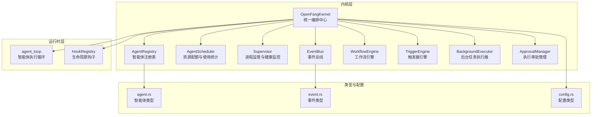
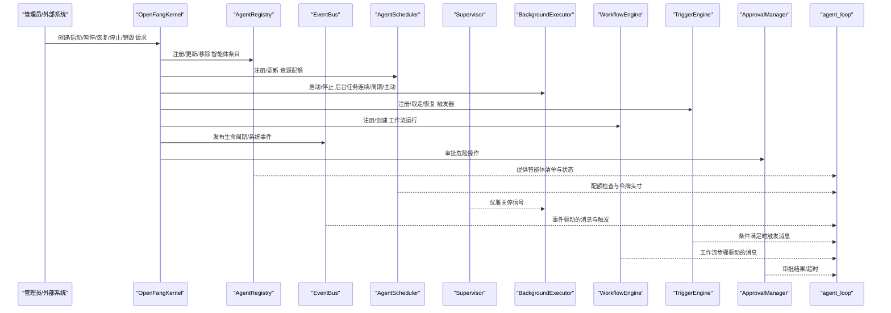
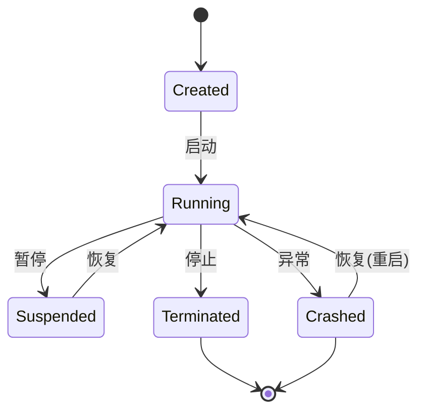
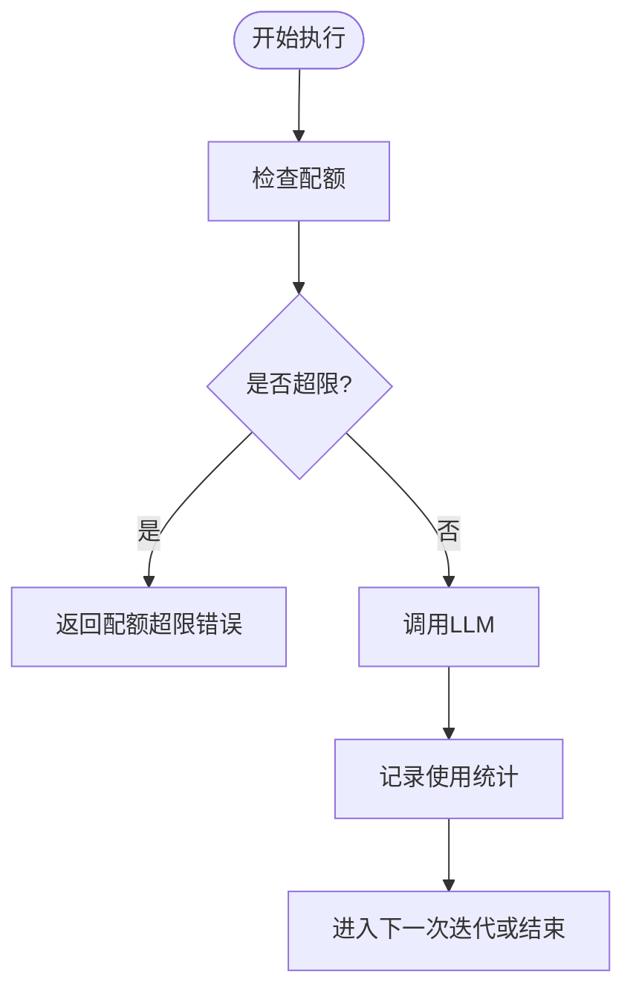
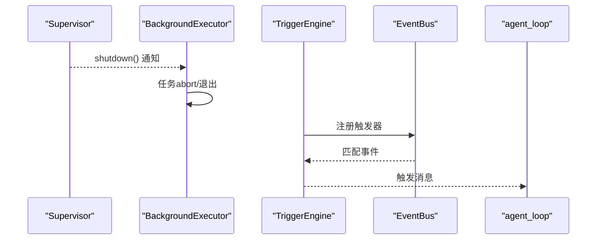
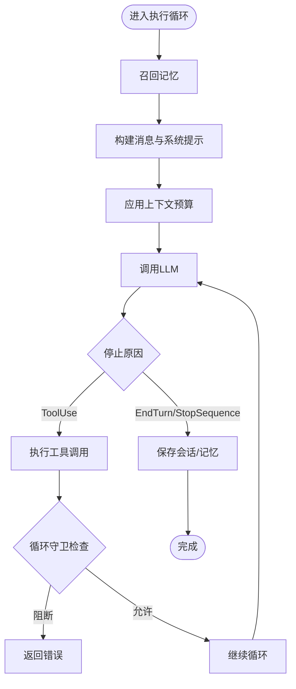
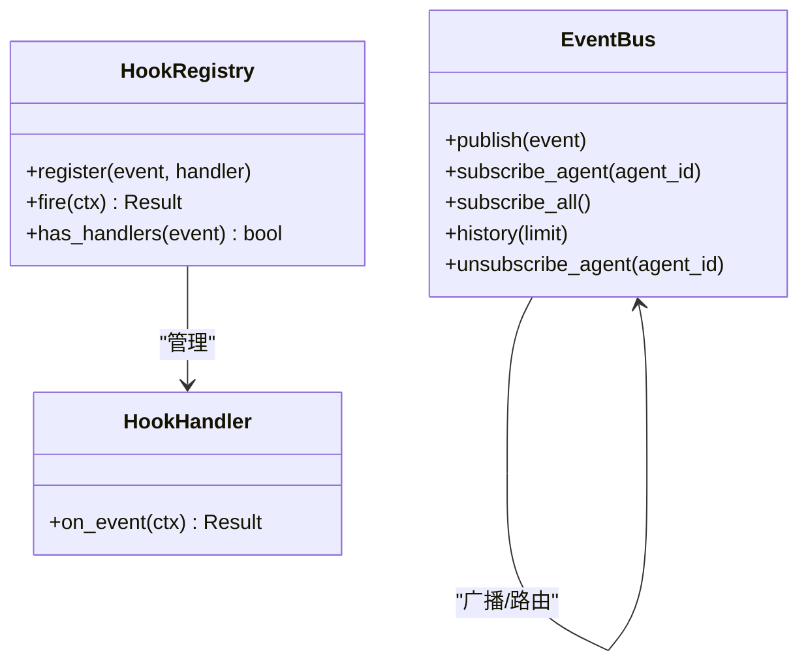
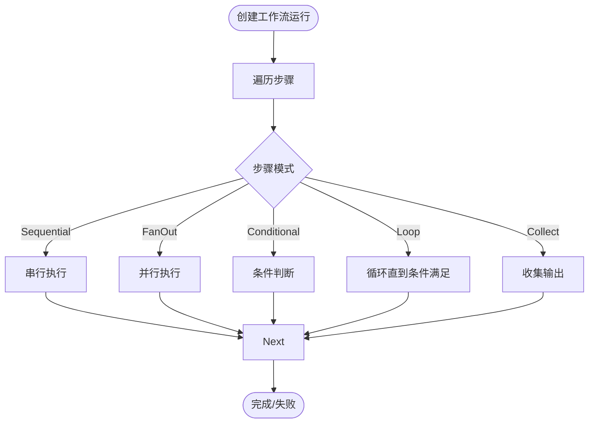
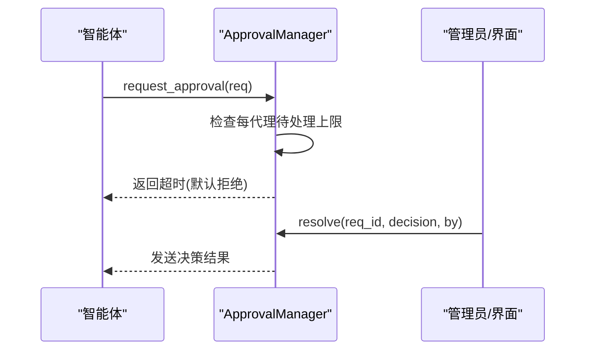
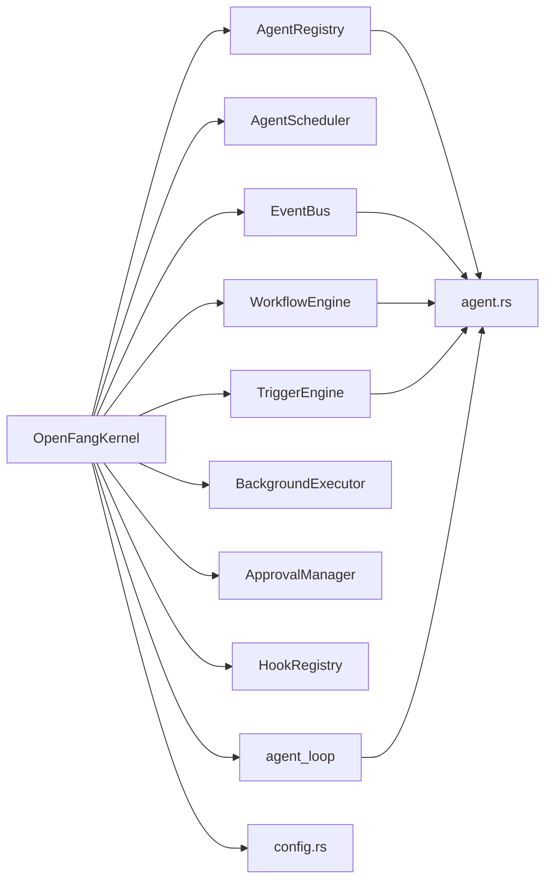

# 智能体生命周期管理

<cite>
**本文档引用的文件**
- [kernel.rs](file://crates/openfang-kernel/src/kernel.rs)
- [lib.rs](file://crates/openfang-kernel/src/lib.rs)
- [scheduler.rs](file://crates/openfang-kernel/src/scheduler.rs)
- [supervisor.rs](file://crates/openfang-kernel/src/supervisor.rs)
- [registry.rs](file://crates/openfang-kernel/src/registry.rs)
- [event_bus.rs](file://crates/openfang-kernel/src/event_bus.rs)
- [workflow.rs](file://crates/openfang-kernel/src/workflow.rs)
- [background.rs](file://crates/openfang-kernel/src/background.rs)
- [triggers.rs](file://crates/openfang-kernel/src/triggers.rs)
- [approval.rs](file://crates/openfang-kernel/src/approval.rs)
- [agent_loop.rs](file://crates/openfang-runtime/src/agent_loop.rs)
- [hooks.rs](file://crates/openfang-runtime/src/hooks.rs)
- [agent.rs](file://crates/openfang-types/src/agent.rs)
- [event.rs](file://crates/openfang-types/src/event.rs)
- [config.rs](file://crates/openfang-types/src/config.rs)
</cite>

## 目录
1. [简介](#简介)
2. [项目结构](#项目结构)
3. [核心组件](#核心组件)
4. [架构总览](#架构总览)
5. [详细组件分析](#详细组件分析)
6. [依赖关系分析](#依赖关系分析)
7. [性能考虑](#性能考虑)
8. [故障排除指南](#故障排除指南)
9. [结论](#结论)
10. [附录](#附录)

## 简介
本文件系统性阐述 OpenFang 智能体生命周期管理的技术实现，覆盖从创建、初始化、启动、运行、暂停、恢复、停止到销毁的全链路流程；深入解析智能体注册机制、状态转换、资源分配与内存管理；记录调度算法、并发控制、优先级管理与资源限制；包含智能体间通信、消息传递、事件处理与错误恢复机制；并提供生命周期钩子、监控指标与性能优化的最佳实践。

## 项目结构
OpenFang 的内核（kernel）作为统一编排中心，协调调度器、监管器、事件总线、工作流引擎、触发器、审批管理等子系统，并通过运行时内核句柄与执行循环交互。类型定义位于 types 模块，确保跨模块一致的数据契约。

**图表来源**
- [kernel.rs:60-164](file://crates/openfang-kernel/src/kernel.rs#L60-L164)
- [lib.rs:1-30](file://crates/openfang-kernel/src/lib.rs#L1-L30)
- [agent_loop.rs:145-167](file://crates/openfang-runtime/src/agent_loop.rs#L145-L167)
- [agent.rs:172-653](file://crates/openfang-types/src/agent.rs#L172-L653)
- [event.rs:282-327](file://crates/openfang-types/src/event.rs#L282-L327)
- [config.rs:130-141](file://crates/openfang-types/src/config.rs#L130-L141)

**章节来源**
- [lib.rs:1-30](file://crates/openfang-kernel/src/lib.rs#L1-L30)
- [kernel.rs:1-164](file://crates/openfang-kernel/src/kernel.rs#L1-L164)

## 核心组件
- OpenFangKernel：内核主入口，聚合配置、注册表、调度器、事件总线、工作流、触发器、后台执行器、审批管理、认证、模型目录、技能/手册/扩展注册表、交付回执、定时任务、自动回复、钩子、进程管理、网络对等节点等。
- AgentRegistry：维护智能体注册条目、索引（名称、标签）、状态与模式更新、会话与工作区更新、身份与模型配置更新、资源配额更新等。
- AgentScheduler：按智能体维度跟踪资源配额与使用统计，支持令牌用量记录、配额检查、重置与任务中止。
- Supervisor：提供优雅关停信号、重启计数、崩溃计数、单智能体重启次数限制与重置、健康摘要。
- EventBus：广播通道事件，支持目标路由（系统/广播/按代理/按模式）、历史环形缓冲、订阅与取消订阅。
- WorkflowEngine：工作流定义与运行实例管理，支持顺序/并行/条件/循环/收集等步骤模式，错误处理策略（失败/跳过/重试），运行历史保留与清理。
- TriggerEngine：事件驱动触发器，支持生命周期/系统/内存/内容匹配等模式，最大触发次数、启用/禁用、取走/恢复/重新分配触发器。
- BackgroundExecutor：连续/周期/主动模式的后台任务执行器，全局 LLM 并发限制、节流、健康检查与关停信号。
- ApprovalManager：危险操作审批请求管理，超时、拒绝/批准/超时三种结果，最近审批记录保留与策略热更新。
- agent_loop：智能体执行循环，记忆召回、上下文预算、工具调用、循环保护、错误恢复、钩子触发、成本估算、静默回复指令解析。
- HookRegistry：BeforeToolCall/AfterToolCall/BeforePromptBuild/AgentLoopEnd 四类钩子，可阻断工具调用，非阻断钩子错误被吞并记录日志。
- 类型与配置：AgentState/Mode/Schedule/ResourceQuota/Priority/Manifest 等类型定义，以及 KernelMode/UserConfig/WebConfig 等配置项。

**章节来源**
- [kernel.rs:60-164](file://crates/openfang-kernel/src/kernel.rs#L60-L164)
- [registry.rs:8-15](file://crates/openfang-kernel/src/registry.rs#L8-L15)
- [scheduler.rs:43-51](file://crates/openfang-kernel/src/scheduler.rs#L43-L51)
- [supervisor.rs:10-21](file://crates/openfang-kernel/src/supervisor.rs#L10-L21)
- [event_bus.rs:15-22](file://crates/openfang-kernel/src/event_bus.rs#L15-L22)
- [workflow.rs:200-206](file://crates/openfang-kernel/src/workflow.rs#L200-L206)
- [triggers.rs:82-88](file://crates/openfang-kernel/src/triggers.rs#L82-L88)
- [background.rs:21-28](file://crates/openfang-kernel/src/background.rs#L21-L28)
- [approval.rs:18-27](file://crates/openfang-kernel/src/approval.rs#L18-L27)
- [agent_loop.rs:145-167](file://crates/openfang-runtime/src/agent_loop.rs#L145-L167)
- [hooks.rs:38-40](file://crates/openfang-runtime/src/hooks.rs#L38-L40)
- [agent.rs:172-282](file://crates/openfang-types/src/agent.rs#L172-L282)
- [event.rs:55-87](file://crates/openfang-types/src/event.rs#L55-L87)
- [config.rs:130-141](file://crates/openfang-types/src/config.rs#L130-L141)

## 架构总览
下图展示 OpenFang 内核如何协调各子系统完成智能体生命周期管理：

**图表来源**
- [kernel.rs:505-164](file://crates/openfang-kernel/src/kernel.rs#L505-L164)
- [registry.rs:27-88](file://crates/openfang-kernel/src/registry.rs#L27-L88)
- [scheduler.rs:63-124](file://crates/openfang-kernel/src/scheduler.rs#L63-L124)
- [background.rs:48-186](file://crates/openfang-kernel/src/background.rs#L48-L186)
- [triggers.rs:99-314](file://crates/openfang-kernel/src/triggers.rs#L99-L314)
- [workflow.rs:217-289](file://crates/openfang-kernel/src/workflow.rs#L217-L289)
- [event_bus.rs:35-98](file://crates/openfang-kernel/src/event_bus.rs#L35-L98)
- [approval.rs:52-150](file://crates/openfang-kernel/src/approval.rs#L52-L150)
- [agent_loop.rs:145-167](file://crates/openfang-runtime/src/agent_loop.rs#L145-L167)

## 详细组件分析

### 智能体生命周期状态机与注册机制
- 状态枚举：Created → Running → Suspended → Terminated/Crashed。
- 注册表提供注册、查找、状态/模式更新、移除、父子关系维护、会话与工作区更新、身份与模型配置更新、资源配额更新等。
- 生命周期事件：通过 EventBus 发布/订阅生命周期事件，支持广播/系统/按代理/按模式路由。

**图表来源**
- [agent.rs:172-186](file://crates/openfang-types/src/agent.rs#L172-L186)
- [event_bus.rs:35-73](file://crates/openfang-kernel/src/event_bus.rs#L35-L73)
- [registry.rs:53-73](file://crates/openfang-kernel/src/registry.rs#L53-L73)

**章节来源**
- [agent.rs:172-186](file://crates/openfang-types/src/agent.rs#L172-L186)
- [registry.rs:27-88](file://crates/openfang-kernel/src/registry.rs#L27-L88)
- [event.rs:152-192](file://crates/openfang-types/src/event.rs#L152-L192)
- [event_bus.rs:35-98](file://crates/openfang-kernel/src/event_bus.rs#L35-L98)

### 调度与资源配额
- 使用 DashMap 维护每个智能体的配额与使用追踪，滚动小时窗口统计令牌用量。
- 支持配额检查、使用重置、任务中止、剩余头寸查询。
- 与 Supervisor 协作进行重启次数限制与崩溃计数。

**图表来源**
- [scheduler.rs:77-100](file://crates/openfang-kernel/src/scheduler.rs#L77-L100)
- [scheduler.rs:102-144](file://crates/openfang-kernel/src/scheduler.rs#L102-L144)

**章节来源**
- [scheduler.rs:43-144](file://crates/openfang-kernel/src/scheduler.rs#L43-L144)
- [supervisor.rs:76-105](file://crates/openfang-kernel/src/supervisor.rs#L76-L105)

### 后台任务与触发器
- BackgroundExecutor 支持 Continuous/Periodic/Proactive 三种模式，全局 LLM 并发限制，节流与健康关停。
- TriggerEngine 支持生命周期/系统/内存/内容匹配等模式，最大触发次数、启用/禁用、取走/恢复/重新分配触发器。

**图表来源**
- [background.rs:48-186](file://crates/openfang-kernel/src/background.rs#L48-L186)
- [triggers.rs:99-314](file://crates/openfang-kernel/src/triggers.rs#L99-L314)
- [event_bus.rs:35-73](file://crates/openfang-kernel/src/event_bus.rs#L35-L73)

**章节来源**
- [background.rs:21-200](file://crates/openfang-kernel/src/background.rs#L21-L200)
- [triggers.rs:37-320](file://crates/openfang-kernel/src/triggers.rs#L37-L320)

### 执行循环与工具调用
- agent_loop 实现记忆召回、上下文预算、工具调用、循环保护、错误恢复、钩子触发、成本估算、静默回复指令解析。
- 支持多模态消息（文本+图像）、工具超时、动态截断、循环守卫、幻觉动作检测与重提示。

**图表来源**
- [agent_loop.rs:145-605](file://crates/openfang-runtime/src/agent_loop.rs#L145-L605)
- [agent_loop.rs:606-805](file://crates/openfang-runtime/src/agent_loop.rs#L606-L805)

**章节来源**
- [agent_loop.rs:140-805](file://crates/openfang-runtime/src/agent_loop.rs#L140-L805)

### 生命周期钩子与事件总线
- HookRegistry 提供 BeforeToolCall/AfterToolCall/BeforePromptBuild/AgentLoopEnd 四类钩子，BeforeToolCall 可阻断工具调用，其余为观察型。
- EventBus 支持广播/系统/按代理/按模式事件路由，历史环形缓冲与订阅管理。

**图表来源**
- [hooks.rs:38-86](file://crates/openfang-runtime/src/hooks.rs#L38-L86)
- [event_bus.rs:15-99](file://crates/openfang-kernel/src/event_bus.rs#L15-L99)

**章节来源**
- [hooks.rs:14-86](file://crates/openfang-runtime/src/hooks.rs#L14-L86)
- [event_bus.rs:24-99](file://crates/openfang-kernel/src/event_bus.rs#L24-L99)

### 工作流引擎与并发控制
- WorkflowEngine 支持顺序/并行/条件/循环/收集等步骤模式，错误处理策略（失败/跳过/重试），运行历史保留与清理。
- 并发控制：BackgroundExecutor 全局 LLM 并发限制，避免资源争用导致的过载。

**图表来源**
- [workflow.rs:430-797](file://crates/openfang-kernel/src/workflow.rs#L430-L797)
- [background.rs:17-18](file://crates/openfang-kernel/src/background.rs#L17-L18)

**章节来源**
- [workflow.rs:66-198](file://crates/openfang-kernel/src/workflow.rs#L66-L198)
- [workflow.rs:200-340](file://crates/openfang-kernel/src/workflow.rs#L200-L340)
- [workflow.rs:430-797](file://crates/openfang-kernel/src/workflow.rs#L430-L797)
- [background.rs:17-37](file://crates/openfang-kernel/src/background.rs#L17-L37)

### 审批管理与安全控制
- ApprovalManager 对危险工具（如 shell_exec、file_write/delete、web_fetch/browser_navigate）进行审批，支持超时、拒绝/批准/超时三种结果，最近审批记录保留与策略热更新。

**图表来源**
- [approval.rs:52-150](file://crates/openfang-kernel/src/approval.rs#L52-L150)

**章节来源**
- [approval.rs:18-188](file://crates/openfang-kernel/src/approval.rs#L18-L188)

### 内存管理与会话持久化
- agent_loop 在每次迭代后保存会话与记忆，支持嵌入式记忆与文本回退路径，防止上下文溢出与历史碎片化。
- 记忆日志按天写入，容量上限控制，避免无限增长。

**章节来源**
- [agent_loop.rs:521-570](file://crates/openfang-runtime/src/agent_loop.rs#L521-L570)
- [kernel.rs:430-456](file://crates/openfang-kernel/src/kernel.rs#L430-L456)

## 依赖关系分析
- 内核聚合：OpenFangKernel 依赖注册表、调度器、事件总线、工作流、触发器、后台执行器、审批管理、认证、模型目录、技能/手/扩展注册表、钩子、进程管理、网络对等节点等。
- 运行时耦合：agent_loop 依赖内存子系统、LLM 驱动、工具执行器、浏览器/网络工具、媒体理解、TTS、钩子、进程管理等。
- 类型契约：agent.rs、event.rs、config.rs 为跨模块共享的数据契约，保证一致性。

**图表来源**
- [kernel.rs:60-164](file://crates/openfang-kernel/src/kernel.rs#L60-L164)
- [agent.rs:424-530](file://crates/openfang-types/src/agent.rs#L424-L530)
- [event.rs:282-327](file://crates/openfang-types/src/event.rs#L282-L327)
- [config.rs:130-141](file://crates/openfang-types/src/config.rs#L130-L141)

**章节来源**
- [kernel.rs:60-164](file://crates/openfang-kernel/src/kernel.rs#L60-L164)

## 性能考虑
- 上下文预算与动态截断：在工具调用前根据上下文预算动态截断工具结果，避免超长响应与上下文溢出。
- 循环保护：LoopGuard 防止工具调用死循环与资源滥用，超过阈值直接返回错误。
- 并发限制：BackgroundExecutor 全局 LLM 并发限制，避免过多并发导致服务端过载。
- 配额统计：按小时滚动窗口统计令牌用量，及时发现异常消耗。
- 事件总线：广播通道容量与历史环形缓冲大小可控，避免内存膨胀。
- 钩子开销：钩子回调应为非阻塞（除 BeforeToolCall 外），避免拖慢执行循环。

[本节为通用指导，无需特定文件引用]

## 故障排除指南
- 智能体无响应：检查 Supervisor 健康摘要与重启计数，确认是否达到最大重启次数；查看 EventBus 历史与触发器是否正确匹配。
- LLM 调用失败/空响应：检查 agent_loop 中的重试逻辑、循环守卫、工具超时与上下文溢出恢复；确认配额与令牌头寸。
- 工具调用被阻断：检查 ApprovalManager 的策略与审批状态；确认 BeforeToolCall 钩子是否返回错误。
- 背景任务未启动：确认 ScheduleMode 与 BackgroundExecutor 的启动逻辑；检查关停信号是否提前触发。
- 事件未到达：检查 EventBus 的订阅/取消订阅与目标路由；确认事件 TTL 与历史环形缓冲。

**章节来源**
- [supervisor.rs:107-114](file://crates/openfang-kernel/src/supervisor.rs#L107-L114)
- [agent_loop.rs:347-520](file://crates/openfang-runtime/src/agent_loop.rs#L347-L520)
- [approval.rs:52-150](file://crates/openfang-kernel/src/approval.rs#L52-L150)
- [background.rs:48-186](file://crates/openfang-kernel/src/background.rs#L48-L186)
- [event_bus.rs:35-98](file://crates/openfang-kernel/src/event_bus.rs#L35-L98)

## 结论
OpenFang 的智能体生命周期管理以 OpenFangKernel 为核心，通过注册表、调度器、事件总线、工作流、触发器、后台执行器、审批管理等子系统协同，实现了从创建到销毁的全生命周期闭环。配合 agent_loop 的执行循环、钩子系统与严格的资源配额/并发限制，系统在功能完整性与运行稳定性之间取得平衡。建议在生产环境中结合监控指标与日志，持续优化配额、触发器与工作流策略，确保高可用与高性能。

[本节为总结性内容，无需特定文件引用]

## 附录
- 最佳实践
  - 为高价值智能体设置合理的 ResourceQuota，开启令牌/成本/网络字节配额。
  - 使用 Lifecycle/系统/内存/内容匹配等触发器，避免轮询式主动模式。
  - 对危险工具启用 ApprovalManager，并设置合适的超时与自动批准策略。
  - 利用 HookRegistry 在 BeforeToolCall 阶段进行安全拦截，在 AgentLoopEnd 阶段进行审计与统计。
  - 使用 WorkflowEngine 将复杂任务拆分为可观察、可重试、可并行的步骤。
  - 合理设置 BackgroundExecutor 的全局 LLM 并发上限，避免服务端过载。
  - 定期清理 WorkflowEngine 的运行历史与 EventBus 的事件历史，控制内存占用。

[本节为通用指导，无需特定文件引用]