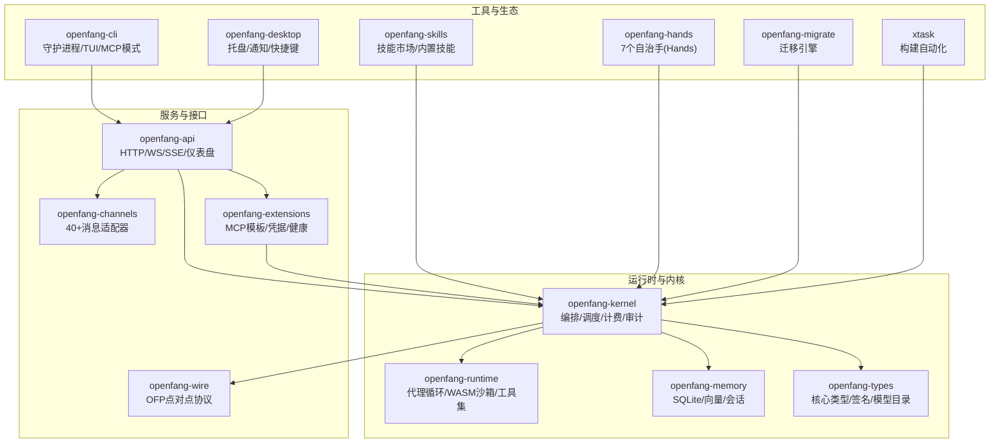
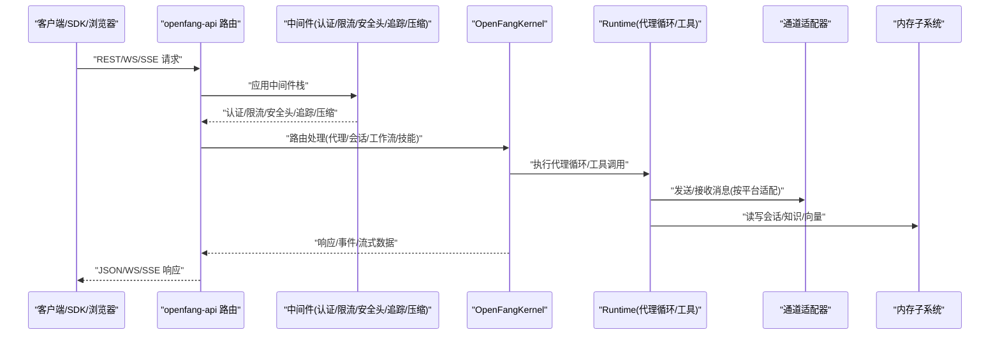
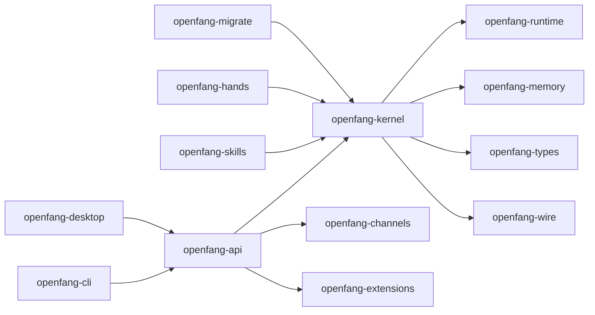

# 智能体部署与运维

<cite>
**本文引用的文件**
- [README.md](file://README.md)
- [Cargo.toml](file://Cargo.toml)
- [Dockerfile](file://Dockerfile)
- [docker-compose.yml](file://docker-compose.yml)
- [openfang.toml.example](file://openfang.toml.example)
- [deploy/openfang.service](file://deploy/openfang.service)
- [crates/openfang-api/src/server.rs](file://crates/openfang-api/src/server.rs)
- [crates/openfang-api/src/routes.rs](file://crates/openfang-api/src/routes.rs)
- [crates/openfang-kernel/src/kernel.rs](file://crates/openfang-kernel/src/kernel.rs)
- [crates/openfang-channels/src/router.rs](file://crates/openfang-channels/src/router.rs)
- [crates/openfang-memory/src/lib.rs](file://crates/openfang-memory/src/lib.rs)
- [crates/openfang-runtime/src/lib.rs](file://crates/openfang-runtime/src/lib.rs)
- [crates/openfang-cli/src/main.rs](file://crates/openfang-cli/src/main.rs)
- [crates/openfang-desktop/src/main.rs](file://crates/openfang-desktop/src/main.rs)
- [scripts/docker/install-smoke.Dockerfile](file://scripts/docker/install-smoke.Dockerfile)
- [packages/whatsapp-gateway/index.js](file://packages/whatsapp-gateway/index.js)
</cite>

## 目录
1. [简介](#简介)
2. [项目结构](#项目结构)
3. [核心组件](#核心组件)
4. [架构总览](#架构总览)
5. [详细组件分析](#详细组件分析)
6. [依赖关系分析](#依赖关系分析)
7. [性能考量](#性能考量)
8. [故障排查指南](#故障排查指南)
9. [结论](#结论)
10. [附录](#附录)

## 简介
本操作指南面向 OpenFang 智能体系统在生产环境中的部署与运维，覆盖单机、集群、容器化与云原生四种部署形态；提供健康检查、性能指标、资源使用与错误统计等运维监控方法；并给出配置管理、日志收集、告警通知与故障恢复的工具链建议。同时，结合系统架构与模块职责，给出高可用、负载均衡、自动扩缩容与灾难恢复的设计思路与落地清单。

## 项目结构
OpenFang 是一个由 14 个 Rust crate 组成的工作区，采用“内核 + 运行时 + API + 通道适配器 + 内存 + 类型 + 技能 + 手（Hands）+ 扩展 + 网络协议 + CLI + 桌面应用 + 迁移 + 工具任务”的分层设计。核心入口为单二进制可执行程序，支持通过命令行或桌面应用启动守护进程，并提供 Web 聊天界面与丰富的 REST/WS/SSE 接口。

图表来源
- [Cargo.toml:1-160](file://Cargo.toml#L1-L160)
- [README.md:231-250](file://README.md#L231-L250)

章节来源
- [Cargo.toml:1-160](file://Cargo.toml#L1-L160)
- [README.md:231-250](file://README.md#L231-L250)

## 核心组件
- 守护进程与 API 服务器：负责启动内核、热加载配置、暴露 REST/WS/SSE 接口、提供健康检查与指标端点。
- 内核：统一编排代理生命周期、工作流、触发器、调度、计费、审计、沙箱与网络。
- 运行时：实现代理主循环、LLM 驱动、工具执行、WASM 沙箱、浏览器桥接、媒体理解、TTS 等能力。
- 通道适配器：40+ 平台适配器（Telegram、Discord、Slack、WhatsApp、Signal、Matrix、Email 等），支持速率限制与输出格式化。
- 内存子系统：SQLite 持久化、向量嵌入、会话压缩与清理。
- 扩展与集成：MCP 模板、凭据存储、OAuth2、集成健康监控。
- CLI 与桌面：守护进程管理、TUI 仪表盘、MCP 服务器模式、原生桌面应用。

章节来源
- [crates/openfang-api/src/server.rs:1-800](file://crates/openfang-api/src/server.rs#L1-L800)
- [crates/openfang-kernel/src/kernel.rs:1-200](file://crates/openfang-kernel/src/kernel.rs#L1-L200)
- [crates/openfang-channels/src/router.rs](file://crates/openfang-channels/src/router.rs)
- [crates/openfang-memory/src/lib.rs](file://crates/openfang-memory/src/lib.rs)
- [crates/openfang-runtime/src/lib.rs](file://crates/openfang-runtime/src/lib.rs)
- [crates/openfang-cli/src/main.rs](file://crates/openfang-cli/src/main.rs)
- [crates/openfang-desktop/src/main.rs](file://crates/openfang-desktop/src/main.rs)

## 架构总览
下图展示从客户端到内核与运行时的整体调用链路，以及关键中间件（认证、限流、安全头、请求追踪、压缩）的作用位置。

图表来源
- [crates/openfang-api/src/server.rs:35-712](file://crates/openfang-api/src/server.rs#L35-L712)
- [crates/openfang-api/src/routes.rs:1-200](file://crates/openfang-api/src/routes.rs#L1-L200)
- [crates/openfang-kernel/src/kernel.rs:1-200](file://crates/openfang-kernel/src/kernel.rs#L1-L200)

## 详细组件分析

### 部署策略与运维监控

#### 单机部署
- 启动方式：通过 CLI 或 systemd 服务启动守护进程，监听本地端口并提供 Web 聊天界面与 REST API。
- 关键配置：监听地址、API 密钥、默认模型、内存路径、网络 P2P 共享密钥等。
- 进程管理：使用 systemd 服务单元，具备重启策略、资源限制与安全加固。
- 日志与健康：通过 API 的健康端点与日志流接口进行健康检查与实时日志查看。

章节来源
- [crates/openfang-cli/src/main.rs](file://crates/openfang-cli/src/main.rs)
- [deploy/openfang.service:1-39](file://deploy/openfang.service#L1-L39)
- [openfang.toml.example:1-49](file://openfang.toml.example#L1-L49)
- [crates/openfang-api/src/server.rs:127-136](file://crates/openfang-api/src/server.rs#L127-L136)

#### 集群部署
- 设计要点：多实例共享存储（持久卷）、统一配置中心、健康检查与故障转移、跨节点会话一致性。
- 实施建议：使用共享数据库与对象存储作为内存后端；通过反向代理或负载均衡器分发请求；启用内核的 P2P 网络能力以支持节点间通信。
- 可观测性：每个节点暴露健康与指标端点，集中采集 Prometheus 指标与日志。

章节来源
- [crates/openfang-kernel/src/kernel.rs:144-147](file://crates/openfang-kernel/src/kernel.rs#L144-L147)
- [crates/openfang-api/src/server.rs:127-130](file://crates/openfang-api/src/server.rs#L127-L130)

#### 容器化部署
- 构建镜像：基于 Dockerfile 使用多阶段构建，复制已编译二进制与预置代理资源，设置数据卷与环境变量。
- 编排：使用 docker-compose 将服务映射到主机端口，挂载数据卷，注入提供商密钥。
- 运行参数：通过环境变量注入各平台令牌与 API Key；数据目录通过 /data 挂载持久化。

章节来源
- [Dockerfile:1-35](file://Dockerfile#L1-L35)
- [docker-compose.yml:1-26](file://docker-compose.yml#L1-L26)

#### 云原生部署
- 容器编排：Kubernetes Deployment/StatefulSet + Service/Ingress；持久卷声明与 Secret/ConfigMap 管理配置。
- 自动扩缩容：基于 CPU/内存与自定义指标（如请求数、队列长度、错误率）设置 HPA；结合 PodDisruptionBudget 保障可用性。
- 网络与安全：启用网络策略、Pod 安全标准；TLS 终止与证书管理；RBAC 与准入控制。
- 观测性：Prometheus/Grafana 指标面板；ELK/Opensearch 日志聚合；OpenTelemetry 链路追踪。

章节来源
- [Dockerfile:18-35](file://Dockerfile#L18-L35)
- [docker-compose.yml:14-22](file://docker-compose.yml#L14-L22)

#### 运维监控
- 健康检查：/api/health 与 /api/health/detail 提供基础与详细健康状态；支持未认证最小信息返回与认证后的完整诊断。
- 性能指标：/api/metrics 对接 Prometheus；包含代理会话数、工具调用次数、错误统计、内存占用、CPU 使用率等。
- 资源使用：通过 systemd 与容器运行时限制文件句柄、进程数与内存；Kubernetes 中设置 Requests/Limits。
- 错误统计：日志流接口 /api/logs/stream 支持 SSE 实时查看；结合错误审计与摘要统计接口定位问题。

章节来源
- [crates/openfang-api/src/server.rs:127-136](file://crates/openfang-api/src/server.rs#L127-L136)
- [crates/openfang-api/src/server.rs:127-130](file://crates/openfang-api/src/server.rs#L127-L130)
- [crates/openfang-api/src/server.rs:428-429](file://crates/openfang-api/src/server.rs#L428-L429)

#### 运维工具
- 配置管理：通过 config.toml 示例文件与环境变量注入；支持热重载与变更计划记录。
- 日志收集：SSE 日志流与 JSON 结构化日志；集中式日志系统采集与检索。
- 告警通知：Prometheus Alertmanager 与企业微信/钉钉/Slack 集成；关键阈值包括健康失败、错误率上升、资源耗尽。
- 故障恢复：自动重启策略、优雅停机、会话修复与审计链校验；备份与回滚流程。

章节来源
- [openfang.toml.example:1-49](file://openfang.toml.example#L1-L49)
- [crates/openfang-api/src/server.rs:728-757](file://crates/openfang-api/src/server.rs#L728-L757)

#### 高可用、负载均衡、自动扩缩容与灾难恢复
- 高可用：多副本部署、健康探针、故障转移；内核 P2P 注册表用于节点发现与状态同步。
- 负载均衡：反向代理或 Ingress 分发请求；会话亲和或无状态设计；速率限制与熔断保护。
- 自动扩缩容：HPA 基于业务指标；Pod 冷启动优化与预热；缓存与连接池复用。
- 灾难恢复：定期备份数据卷与配置；灰度发布与回滚；演练与预案验证。

章节来源
- [crates/openfang-kernel/src/kernel.rs:144-147](file://crates/openfang-kernel/src/kernel.rs#L144-L147)
- [crates/openfang-api/src/server.rs:106-104](file://crates/openfang-api/src/server.rs#L106-L104)

### 通道与外部网关
- WhatsApp 网关：通过 Node.js 网关与 OpenFang 交互，支持二维码登录、消息发送与健康检查；可选 Cloud API 生产方案。
- 其他通道：Telegram、Discord、Slack、Signal、Matrix、Email 等，均支持速率限制与输出格式化。

章节来源
- [README.md:269-355](file://README.md#L269-L355)
- [packages/whatsapp-gateway/index.js](file://packages/whatsapp-gateway/index.js)

## 依赖关系分析

图表来源
- [Cargo.toml:1-160](file://Cargo.toml#L1-L160)
- [crates/openfang-api/src/server.rs:35-712](file://crates/openfang-api/src/server.rs#L35-L712)

章节来源
- [Cargo.toml:1-160](file://Cargo.toml#L1-L160)

## 性能考量
- 冷启动：单二进制、模块化内核与运行时，冷启动时间低；避免不必要的初始化开销。
- 内存占用：SQLite + 向量内存、会话压缩与清理；合理设置内存上限与垃圾回收策略。
- 并发与限流：GCRA 速率限制器、请求级并发控制、工具调用去重与环路检测。
- 网络与 I/O：通道适配器统一速率限制与输出格式化；WASM 沙箱与子进程隔离降低风险。
- 压缩与追踪：HTTP 层压缩与请求追踪中间件，便于性能分析与问题定位。

章节来源
- [crates/openfang-api/src/server.rs:106-104](file://crates/openfang-api/src/server.rs#L106-L104)
- [crates/openfang-api/src/server.rs:706-709](file://crates/openfang-api/src/server.rs#L706-L709)

## 故障排查指南
- 健康检查失败：确认 /api/health 与 /api/health/detail 返回状态；检查认证配置与 CORS 设置。
- 配置热重载：确认配置文件修改被检测并应用；关注日志中热重载动作与失败原因。
- 日志流：使用 /api/logs/stream 实时查看；结合结构化日志与时间戳定位异常。
- 通道问题：检查通道适配器配置与令牌；验证速率限制与输出格式；必要时切换到 Cloud API。
- 审计与回溯：利用审计链与会话修复功能，定位异常行为与数据不一致。

章节来源
- [crates/openfang-api/src/server.rs:127-136](file://crates/openfang-api/src/server.rs#L127-L136)
- [crates/openfang-api/src/server.rs:728-757](file://crates/openfang-api/src/server.rs#L728-L757)
- [crates/openfang-api/src/server.rs:428-429](file://crates/openfang-api/src/server.rs#L428-L429)
- [README.md:269-355](file://README.md#L269-L355)

## 结论
OpenFang 以单二进制与模块化内核为核心，提供从单机到云原生的灵活部署方案。通过完善的健康检查、指标体系与日志流，结合通道适配器与扩展机制，能够满足生产环境对高可用、可观测与可运维性的要求。建议在生产中配合容器编排与云原生平台，实施自动扩缩容与灾难恢复策略，并建立标准化的配置管理与告警通知体系。

## 附录

### 部署清单与配置模板
- 单机 systemd 服务：参考服务单元文件，设置用户、工作目录、环境文件与资源限制。
- 容器镜像：使用 Dockerfile 构建，暴露 4200 端口，挂载 /data 数据卷，注入提供商密钥。
- docker-compose：映射端口、挂载数据卷、注入环境变量，适合开发与测试环境。
- 配置模板：参考示例配置文件，设置默认模型、内存、网络与通道适配器参数。

章节来源
- [deploy/openfang.service:1-39](file://deploy/openfang.service#L1-L39)
- [Dockerfile:18-35](file://Dockerfile#L18-L35)
- [docker-compose.yml:10-22](file://docker-compose.yml#L10-L22)
- [openfang.toml.example:1-49](file://openfang.toml.example#L1-L49)

### 监控仪表板与运维手册
- 指标端点：/api/metrics 对接 Prometheus；建议在 Grafana 中创建仪表板，包含代理会话、工具调用、错误率、内存与 CPU。
- 日志采集：SSE 日志流与结构化日志；建议集中到 ELK/OpenSearch，建立检索与告警规则。
- 运维手册：包含安装、升级、备份、回滚、故障演练与应急预案；建议结合 CI/CD 实现自动化发布与回滚。

章节来源
- [crates/openfang-api/src/server.rs:127-130](file://crates/openfang-api/src/server.rs#L127-L130)
- [crates/openfang-api/src/server.rs:428-429](file://crates/openfang-api/src/server.rs#L428-L429)