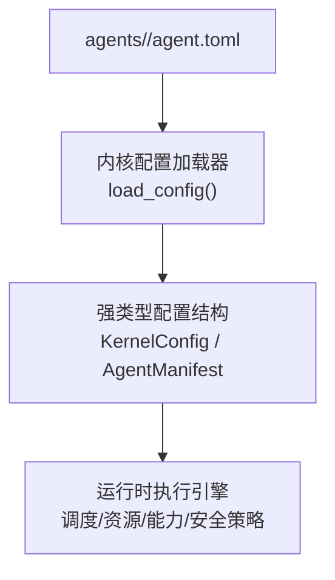
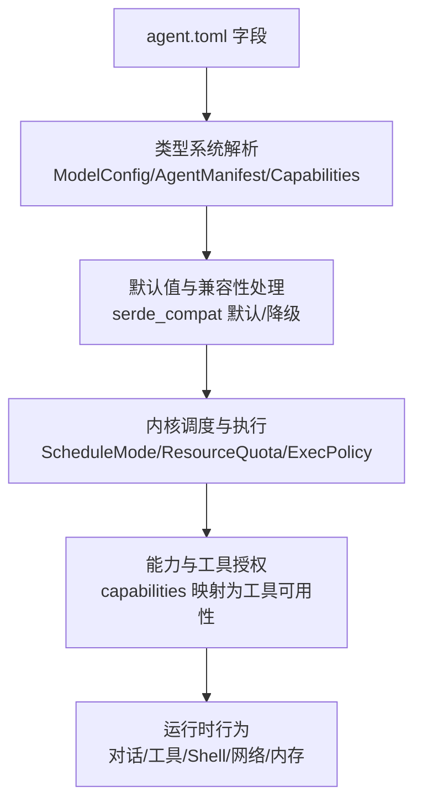
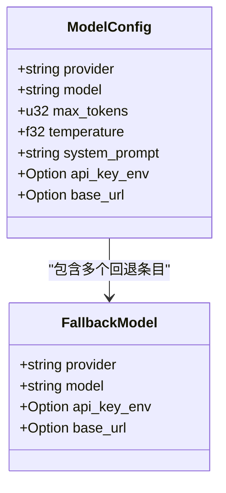
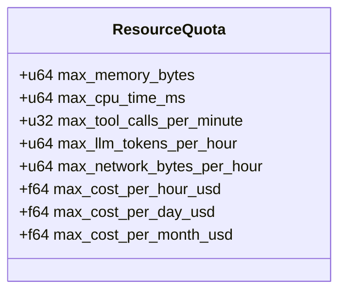
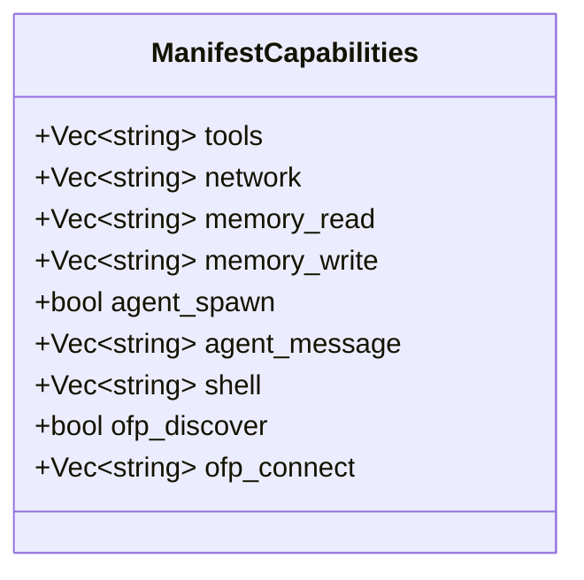
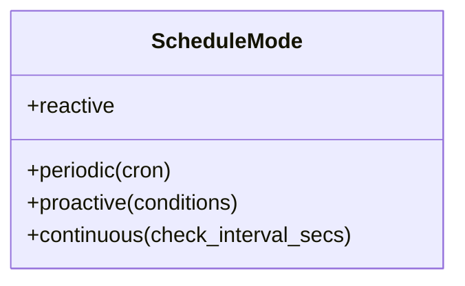
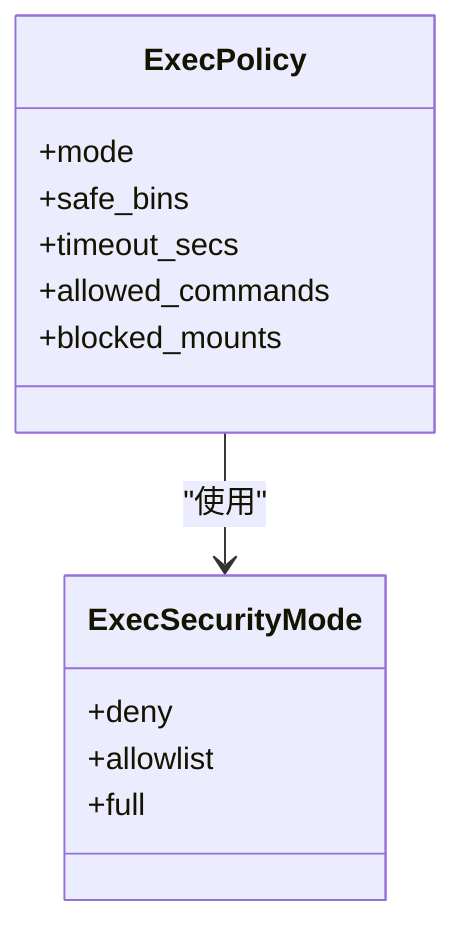
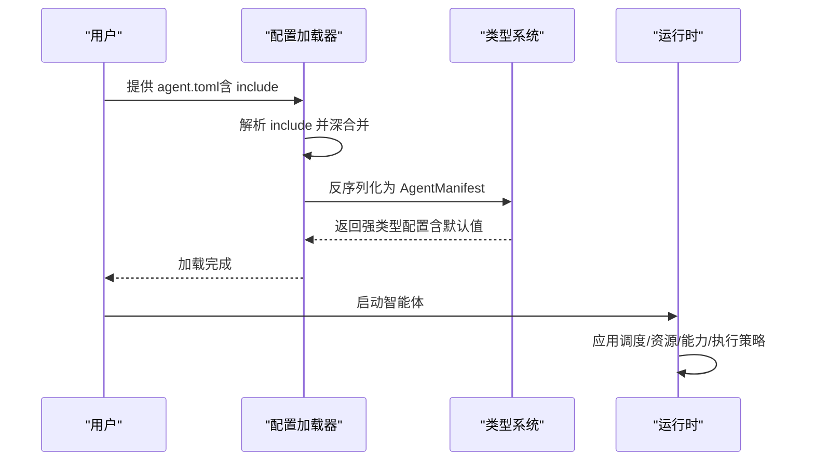

# 智能体配置文件

<cite>
**本文引用的文件**
- [configuration.md](file://docs/configuration.md)
- [config.rs](file://crates/openfang-kernel/src/config.rs)
- [config.rs（类型）](file://crates/openfang-types/src/config.rs)
- [agent.rs（类型）](file://crates/openfang-types/src/agent.rs)
- [serde_compat.rs](file://crates/openfang-types/src/serde_compat.rs)
- [agent.toml（analyst）](file://agents/analyst/agent.toml)
- [agent.toml（assistant）](file://agents/assistant/agent.toml)
- [agent.toml（coder）](file://agents/coder/agent.toml)
- [agent.toml（researcher）](file://agents/researcher/agent.toml)
- [agent.toml（planner）](file://agents/planner/agent.toml)
- [agent.toml（writer）](file://agents/writer/agent.toml)
- [agent.toml（test-engineer）](file://agents/test-engineer/agent.toml)
- [agent.toml（customer-support）](file://agents/customer-support/agent.toml)
- [agent.toml（security-auditor）](file://agents/security-auditor/agent.toml)
</cite>

## 目录
1. [简介](#简介)
2. [项目结构](#项目结构)
3. [核心组件](#核心组件)
4. [架构总览](#架构总览)
5. [详细组件分析](#详细组件分析)
6. [依赖关系分析](#依赖关系分析)
7. [性能考量](#性能考量)
8. [故障排查指南](#故障排查指南)
9. [结论](#结论)
10. [附录](#附录)

## 简介
本文件面向 OpenFang 智能体开发者与运维人员，系统化阐述 agent.toml 配置文件的格式、字段定义、配置选项与行为约束。重点覆盖以下方面：
- 智能体核心配置项：名称、描述、系统提示词、温度参数、最大令牌数、令牌配额、调度策略
- 工具配置、能力声明、Shell 访问权限、标签系统
- 配置验证规则、默认值处理、继承与合并机制
- 完整配置示例与最佳实践，解释不同配置组合对智能体行为的影响

## 项目结构
OpenFang 将每个智能体的配置独立存放于对应目录下的 agent.toml 文件中，同时内核通过统一的配置加载器解析并应用这些配置。核心关系如下：
- 每个智能体在 agents/<agent-name>/agent.toml 中定义自身模型、资源配额、能力与调度等
- 内核加载器负责定位配置文件、处理 include 合并、迁移旧字段、反序列化为强类型结构
- 类型系统定义了所有字段的默认值、可选性与兼容性处理逻辑

图表来源
- [config.rs（内核）:18-110](file://crates/openfang-kernel/src/config.rs#L18-L110)
- [agent.rs（类型）:424-494](file://crates/openfang-types/src/agent.rs#L424-L494)

章节来源
- [config.rs（内核）:18-110](file://crates/openfang-kernel/src/config.rs#L18-L110)
- [agent.rs（类型）:424-494](file://crates/openfang-types/src/agent.rs#L424-L494)

## 核心组件
本节聚焦 agent.toml 的关键字段与语义，结合类型定义说明默认值、可选性与兼容性。

- 基础元信息
  - name：智能体名称（字符串）
  - version：版本号（字符串）
  - description：描述（字符串）
  - author：作者标识（字符串）
  - module：模块路径（如内置 chat 模块）
  - tags：标签列表（字符串数组），用于分类与检索

- 模型配置 [model]
  - provider：提供方名称（字符串，默认由内核或“default”解析）
  - model：模型标识（字符串，默认由内核或“default”解析）
  - api_key_env：API 密钥环境变量名（可选）
  - base_url：提供方基础地址覆盖（可选）
  - max_tokens：最大生成令牌数（u32，默认见类型定义）
  - temperature：采样温度（f32，默认见类型定义）
  - system_prompt：系统提示词（字符串）

- 回退模型链 [[fallback_models]]
  - provider/model：同上，按顺序尝试
  - api_key_env/base_url：同上

- 资源配额 [resources]
  - max_llm_tokens_per_hour：每小时 LLM 令牌上限（u64，默认不限制）
  - max_concurrent_tools：并发工具调用上限（可选）
  - 其他资源限制：内存、CPU、网络、成本等（见类型定义）

- 能力声明 [capabilities]
  - tools：允许使用的工具集合（支持通配符与命名预设）
  - network/memory_read/memory_write/agent_message/shell/ofp_*：访问范围与权限模式
  - 说明：能力声明会映射到运行时的工具可用性与访问控制

- 调度策略 [schedule]
  - reactive（默认）：事件驱动
  - periodic：定时触发（cron 表达式）
  - proactive：条件触发（条件列表）
  - continuous：持续运行（带检查间隔）

- 执行策略（可选）
  - exec_policy：Shell 执行安全模式（deny/allowlist/full），支持字符串简写或完整表单
  - 作用域：可覆盖全局策略，影响 shell_exec 等工具的可用性与限制

- 自主运行（可选）
  - autonomous：静默时段、迭代次数、重启上限、心跳等

章节来源
- [agent.rs（类型）:370-403](file://crates/openfang-types/src/agent.rs#L370-L403)
- [agent.rs（类型）:424-494](file://crates/openfang-types/src/agent.rs#L424-L494)
- [agent.rs（类型）:225-241](file://crates/openfang-types/src/agent.rs#L225-L241)
- [agent.rs（类型）:532-561](file://crates/openfang-types/src/agent.rs#L532-L561)
- [config.rs（类型）:785-799](file://crates/openfang-types/src/config.rs#L785-L799)
- [serde_compat.rs:160-228](file://crates/openfang-types/src/serde_compat.rs#L160-L228)

## 架构总览
下图展示从 agent.toml 到运行时的行为映射关系：

图表来源
- [agent.rs（类型）:370-494](file://crates/openfang-types/src/agent.rs#L370-L494)
- [serde_compat.rs:15-83](file://crates/openfang-types/src/serde_compat.rs#L15-L83)
- [config.rs（类型）:785-799](file://crates/openfang-types/src/config.rs#L785-L799)

## 详细组件分析

### 组件一：模型与回退链
- 字段要点
  - provider/model 支持“default”，由内核解析为实际提供方与模型
  - api_key_env/base_url 可覆盖密钥与端点
  - max_tokens/temperature 控制生成行为
  - system_prompt 定义角色与工作流
  - fallback_models 提供多级回退，提升可用性
- 默认值与可选性
  - ModelConfig 提供默认 provider/model/temperature/max_tokens/system_prompt
  - api_key_env/base_url 可缺省
- 兼容性
  - serde_compat 对历史存储格式进行降级处理，避免 schema 变更导致失败

图表来源
- [agent.rs（类型）:370-414](file://crates/openfang-types/src/agent.rs#L370-L414)

章节来源
- [agent.rs（类型）:370-414](file://crates/openfang-types/src/agent.rs#L370-L414)
- [agent.rs（类型）:391-403](file://crates/openfang-types/src/agent.rs#L391-L403)
- [serde_compat.rs:15-83](file://crates/openfang-types/src/serde_compat.rs#L15-L83)

### 组件二：资源配额与成本控制
- 字段要点
  - max_llm_tokens_per_hour：令牌级速率限制
  - max_concurrent_tools：并发工具调用上限（部分智能体示例使用）
  - 其他资源：内存、CPU、网络字节、成本限额（小时/日/月）
- 默认值
  - ResourceQuota 提供默认上限；未设置时可能不限制
- 实践建议
  - 为高负载智能体设置明确的令牌与成本上限
  - 结合工具使用频率调整并发上限

图表来源
- [agent.rs（类型）:247-282](file://crates/openfang-types/src/agent.rs#L247-L282)

章节来源
- [agent.rs（类型）:247-282](file://crates/openfang-types/src/agent.rs#L247-L282)
- [agent.toml（assistant）:68-71](file://agents/assistant/agent.toml#L68-L71)
- [agent.toml（analyst）:41-42](file://agents/analyst/agent.toml#L41-L42)

### 组件三：能力声明与工具授权
- 字段要点
  - tools：显式列出允许的工具，或使用通配符
  - network/memory_read/memory_write/agent_message/shell/ofp_*：细粒度授权
- 语义说明
  - network/memory_read/write/agent_message/shell 等字段决定工具可用性与访问范围
  - “*” 表示全部开放；“self.*”、“shared.*” 等表示命名空间范围
- 示例参考
  - assistant：全量工具授权
  - coder：侧重文件读写、Shell、搜索与记忆
  - researcher：侧重网络搜索与内容抓取
  - security-auditor：侧重文件/Shell/内存读写

图表来源
- [agent.rs（类型）:532-561](file://crates/openfang-types/src/agent.rs#L532-L561)

章节来源
- [agent.rs（类型）:532-561](file://crates/openfang-types/src/agent.rs#L532-L561)
- [agent.toml（assistant）:72-78](file://agents/assistant/agent.toml#L72-L78)
- [agent.toml（coder）:42-47](file://agents/coder/agent.toml#L42-L47)
- [agent.toml（researcher）:46-50](file://agents/researcher/agent.toml#L46-L50)
- [agent.toml（security-auditor）:50-54](file://agents/security-auditor/agent.toml#L50-L54)

### 组件四：调度策略
- 字段要点
  - reactive（默认）：事件驱动
  - periodic：定时触发（cron 表达式）
  - proactive：条件触发（事件/状态条件）
  - continuous：持续运行（带检查间隔）
- 使用场景
  - reactive：日常对话与任务响应
  - periodic：周期性巡检、报表生成
  - proactive：基于事件的自动化（如审计器）
  - continuous：后台监控与轮询

图表来源
- [agent.rs（类型）:225-241](file://crates/openfang-types/src/agent.rs#L225-L241)

章节来源
- [agent.rs（类型）:225-241](file://crates/openfang-types/src/agent.rs#L225-L241)
- [agent.toml（security-auditor）:44-45](file://agents/security-auditor/agent.toml#L44-L45)

### 组件五：Shell 访问权限与执行策略
- 字段要点
  - shell：命令白名单（支持通配符）
  - exec_policy：执行安全模式（deny/allowlist/full），支持字符串简写或完整表单
- 语义说明
  - deny：完全禁止
  - allowlist：仅允许白名单命令
  - full：允许任意命令（开发/调试用途）
- 兼容性
  - exec_policy_lenient 支持字符串简写与表单混用，增强向后兼容

图表来源
- [config.rs（类型）:785-799](file://crates/openfang-types/src/config.rs#L785-L799)
- [serde_compat.rs:160-228](file://crates/openfang-types/src/serde_compat.rs#L160-L228)

章节来源
- [config.rs（类型）:785-799](file://crates/openfang-types/src/config.rs#L785-L799)
- [serde_compat.rs:160-228](file://crates/openfang-types/src/serde_compat.rs#L160-L228)
- [agent.toml（analyst）](file://agents/analyst/agent.toml#L49)
- [agent.toml（coder）](file://agents/coder/agent.toml#L47)
- [agent.toml（test-engineer）](file://agents/test-engineer/agent.toml#L53)
- [agent.toml（security-auditor）](file://agents/security-auditor/agent.toml#L54)

### 组件六：标签系统与发现
- 字段要点
  - tags：字符串数组，用于智能体分类与检索
- 作用
  - 辅助用户与系统快速识别智能体职责与适用场景
  - 与能力声明、工具授权共同构成“可见性 + 权限”的双重控制

章节来源
- [agent.toml（assistant）](file://agents/assistant/agent.toml#L6)
- [agent.toml（coder）](file://agents/coder/agent.toml#L6)
- [agent.toml（researcher）](file://agents/researcher/agent.toml#L6)
- [agent.toml（planner）](file://agents/planner/agent.toml#L6)
- [agent.toml（writer）](file://agents/writer/agent.toml#L6)
- [agent.toml（test-engineer）](file://agents/test-engineer/agent.toml#L6)
- [agent.toml（customer-support）](file://agents/customer-support/agent.toml#L6)
- [agent.toml（security-auditor）](file://agents/security-auditor/agent.toml#L6)

## 依赖关系分析
- 配置加载与合并
  - 支持 include 机制，先加载被包含文件，再深合并根配置，根配置覆盖包含内容
  - 安全校验：拒绝绝对路径、路径穿越、循环包含、超出最大嵌套深度
- 类型系统与兼容性
  - serde_compat 提供向后兼容的降级解析，避免 schema 变更导致的反序列化失败
- 运行时映射
  - AgentManifest 作为统一入口，承载模型、资源、能力、调度等配置
  - 执行策略（exec_policy）与能力声明共同决定工具可用性与访问边界

图表来源
- [config.rs（内核）:112-224](file://crates/openfang-kernel/src/config.rs#L112-L224)
- [agent.rs（类型）:424-494](file://crates/openfang-types/src/agent.rs#L424-L494)

章节来源
- [config.rs（内核）:112-224](file://crates/openfang-kernel/src/config.rs#L112-L224)
- [serde_compat.rs:15-83](file://crates/openfang-types/src/serde_compat.rs#L15-L83)

## 性能考量
- 令牌与成本控制
  - 合理设置 max_llm_tokens_per_hour 与成本上限，避免突发流量导致超额
- 并发与资源
  - 为高并发工具调用设置 max_concurrent_tools，防止资源争用
- 模型选择
  - 在复杂任务中使用更高成本/性能的模型，在简单问答中使用低成本模型
- 调度策略
  - 周期性任务使用 periodic，避免不必要的常驻开销
  - 高频事件使用 reactive，确保低延迟响应

## 故障排查指南
- 配置加载失败
  - 检查 include 路径是否相对且不越界
  - 确认 TOML 语法正确，字段拼写无误
- 反序列化错误
  - 若历史存储格式变更，使用 serde_compat 的降级解析
- 权限不足
  - 检查 capabilities 与 exec_policy 是否允许所需工具与命令
- 资源超限
  - 调整 ResourceQuota 或降低并发工具调用

章节来源
- [config.rs（内核）:112-224](file://crates/openfang-kernel/src/config.rs#L112-L224)
- [serde_compat.rs:15-83](file://crates/openfang-types/src/serde_compat.rs#L15-L83)

## 结论
agent.toml 是 OpenFang 智能体行为的“契约文件”。通过明确的字段定义、完善的默认值与兼容性处理、严格的权限与资源控制，以及灵活的调度与回退机制，开发者可以构建出既安全又高效的智能体。建议在设计阶段即明确智能体职责、工具需求与安全边界，并以标签与资源配额实现可维护的规模化管理。

## 附录

### A. 配置字段速查与默认值
- 基础元信息：name/version/description/author/module/tags
- 模型配置 [model]：provider/model/api_key_env/base_url/max_tokens/temperature/system_prompt
- 回退模型链 [[fallback_models]]：provider/model/api_key_env/base_url
- 资源配额 [resources]：max_llm_tokens_per_hour/max_concurrent_tools 等
- 能力声明 [capabilities]：tools/network/memory_read/write/agent_message/shell/ofp_*
- 调度策略 [schedule]：reactive/periodic/proactive/continuous
- 执行策略（可选）：exec_policy（字符串简写或表单）
- 自主运行（可选）：autonomous（quiet_hours/max_iterations/max_restarts/heartbeat）

章节来源
- [agent.rs（类型）:370-494](file://crates/openfang-types/src/agent.rs#L370-L494)
- [agent.rs（类型）:225-282](file://crates/openfang-types/src/agent.rs#L225-L282)
- [agent.rs（类型）:532-561](file://crates/openfang-types/src/agent.rs#L532-L561)
- [config.rs（类型）:785-799](file://crates/openfang-types/src/config.rs#L785-L799)

### B. 配置示例与最佳实践
- 示例参考
  - assistant：通用助手，全量工具授权，较高并发上限
  - coder：专注编码，严格 Shell 白名单，强调安全性
  - researcher：专注研究，网络工具优先
  - security-auditor：条件触发，Shell 审计相关命令
- 最佳实践
  - 为每个智能体明确职责与标签，便于检索与治理
  - 从最小权限原则出发，逐步放开 capabilities 与 exec_policy
  - 为高负载智能体设置资源配额与并发限制
  - 使用 fallback_models 提升可用性，避免单点故障
  - 通过 schedule 选择合适的运行模式，平衡性能与成本

章节来源
- [agent.toml（assistant）:1-82](file://agents/assistant/agent.toml#L1-L82)
- [agent.toml（coder）:1-48](file://agents/coder/agent.toml#L1-L48)
- [agent.toml（researcher）:1-51](file://agents/researcher/agent.toml#L1-L51)
- [agent.toml（security-auditor）:1-55](file://agents/security-auditor/agent.toml#L1-L55)