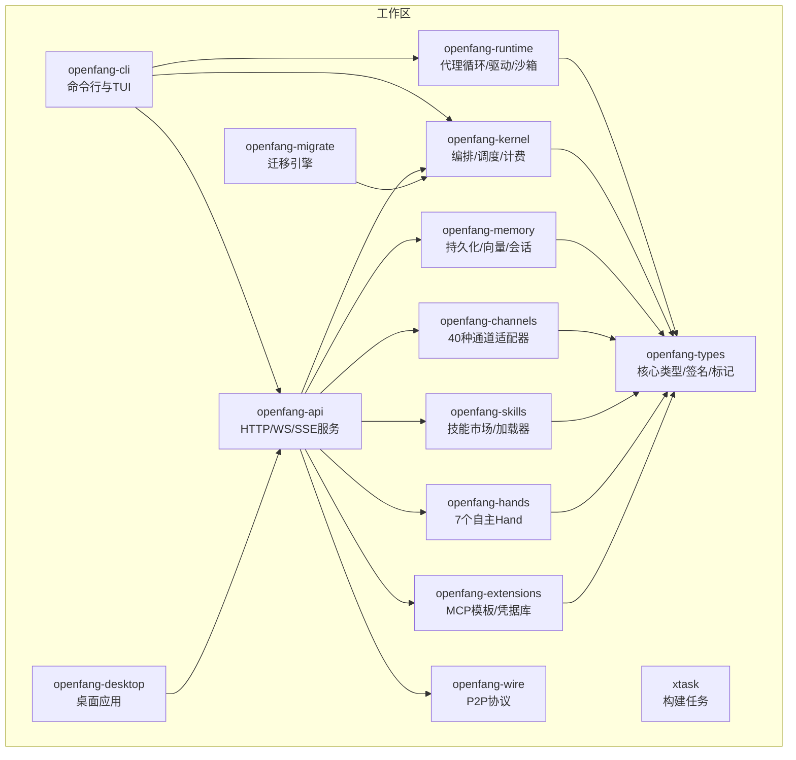
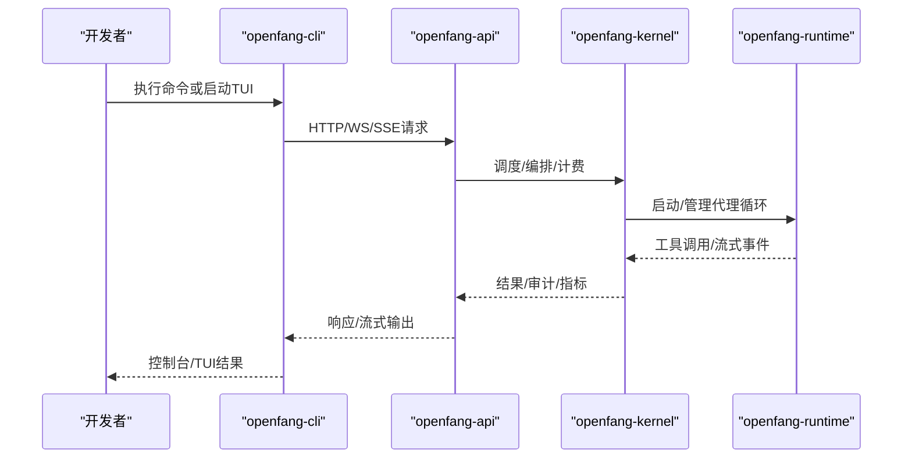
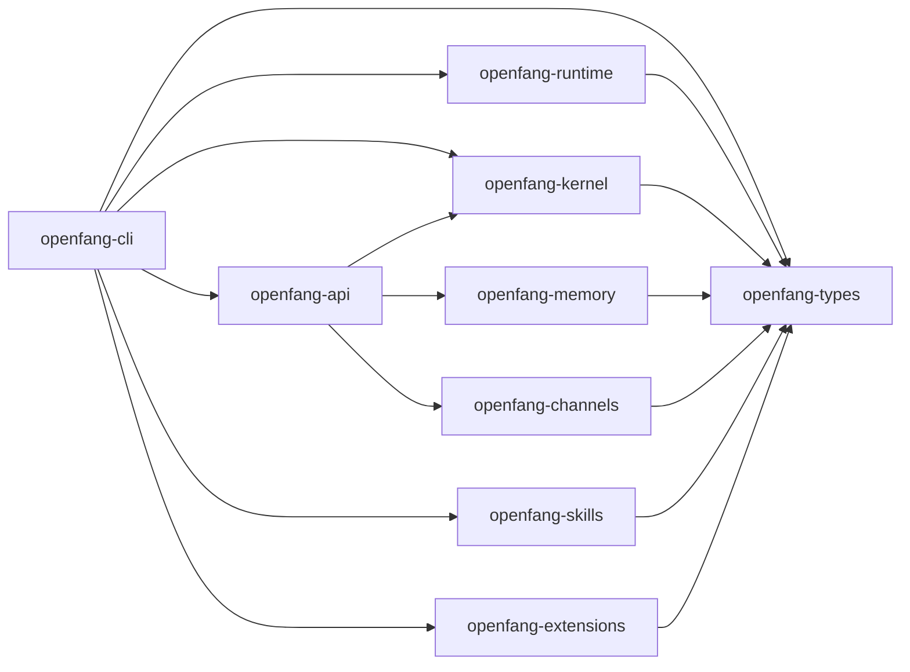

# 开发工具链

<cite>
**本文引用的文件**   
- [README.md](file://README.md)
- [Cargo.toml](file://Cargo.toml)
- [rust-toolchain.toml](file://rust-toolchain.toml)
- [rustfmt.toml](file://rustfmt.toml)
- [openfang.toml.example](file://openfang.toml.example)
- [crates/openfang-cli/src/main.rs](file://crates/openfang-cli/src/main.rs)
- [crates/openfang-cli/Cargo.toml](file://crates/openfang-cli/Cargo.toml)
- [crates/openfang-cli/src/tui/mod.rs](file://crates/openfang-cli/src/tui/mod.rs)
- [crates/openfang-cli/src/launcher.rs](file://crates/openfang-cli/src/launcher.rs)
- [crates/openfang-cli/src/ui.rs](file://crates/openfang-cli/src/ui.rs)
- [crates/openfang-cli/src/tui/screens/dashboard.rs](file://crates/openfang-cli/src/tui/screens/dashboard.rs)
- [crates/openfang-cli/src/tui/screens/logs.rs](file://crates/openfang-cli/src/tui/screens/logs.rs)
</cite>

## 目录
1. [简介](#简介)
2. [项目结构](#项目结构)
3. [核心组件](#核心组件)
4. [架构总览](#架构总览)
5. [详细组件分析](#详细组件分析)
6. [依赖关系分析](#依赖关系分析)
7. [性能与稳定性](#性能与稳定性)
8. [故障排查指南](#故障排查指南)
9. [结论](#结论)
10. [附录](#附录)

## 简介
本指南面向 OpenFang 智能体开发团队，系统性介绍开发工具链的使用方法，覆盖以下主题：
- 开发环境配置：Rust 工具链安装、IDE 设置、调试器配置、代码格式化与静态检查
- CLI 工具使用：智能体创建、配置验证、日志查看、性能监控
- TUI 仪表板功能：智能体状态监控、实时日志查看、配置管理、调试辅助
- 开发调试技巧：断点设置、变量检查、调用栈分析、内存使用监控
- 测试策略：单元测试、集成测试、性能测试
- 代码质量保障：静态分析、安全扫描、依赖检查、版本管理

## 项目结构
OpenFang 是一个由 14 个 Rust crate 组成的工作区项目，采用模块化内核设计，CLI 提供交互式终端界面（TUI）与命令行能力，API 守护进程提供 Web 仪表盘与 REST/WS/SSE 接口。

图表来源
- [Cargo.toml:1-160](file://Cargo.toml#L1-L160)

章节来源
- [Cargo.toml:1-160](file://Cargo.toml#L1-L160)
- [README.md:231-250](file://README.md#L231-L250)

## 核心组件
- CLI（命令行与 TUI）
  - 子命令丰富，覆盖初始化、启动/停止守护进程、智能体管理、工作流、触发器、技能、通道、手（Hands）、配置、日志、健康检查、安全审计、内存、设备配对、Webhook、系统信息、重置与卸载等。
  - 支持交互式“启动器菜单”（无子命令时），以及全功能 TUI 仪表板。
- API 守护进程
  - 提供 140+ 接口，支持 OpenAI 兼容聊天补全、WebSocket 与 SSE 流式输出、Web 仪表盘。
- 内核与运行时
  - 内核负责编排、调度、计费、RBAC、触发器；运行时负责代理循环、LLM 驱动、53+ 工具、WASM 沙箱、MCP/A2A。
- 类型与基础设施
  - 统一类型定义、Ed25519 签名、信息流标记、模型目录、审计链等。
- 通道与扩展
  - 40 种消息通道适配器、MCP 模板、凭据保险库、OAuth2 PKCE。
- 桌面应用
  - Tauri 2.0 原生应用，系统托盘、通知、全局快捷键。

章节来源
- [crates/openfang-cli/src/main.rs:87-294](file://crates/openfang-cli/src/main.rs#L87-L294)
- [crates/openfang-cli/src/tui/mod.rs:29-84](file://crates/openfang-cli/src/tui/mod.rs#L29-L84)
- [README.md:231-250](file://README.md#L231-L250)

## 架构总览
下图展示 CLI、TUI、API 守护进程与内核之间的交互关系，以及数据流向。

图表来源
- [crates/openfang-cli/src/main.rs:16-25](file://crates/openfang-cli/src/main.rs#L16-L25)
- [crates/openfang-cli/src/tui/mod.rs:116-130](file://crates/openfang-cli/src/tui/mod.rs#L116-L130)

## 详细组件分析

### CLI 工具链与使用指南
- 初始化与守护进程
  - 初始化：生成默认配置与数据目录，支持快速模式（无交互）。
  - 启动/停止：启动内核守护进程，或停止正在运行的守护进程。
  - 健康检查：快速诊断守护进程状态。
- 智能体与工作流
  - 新建/Spawn：从模板或清单文件创建智能体。
  - 列表/聊天/杀死：管理运行中的智能体。
  - 工作流：列出、创建、获取、更新、删除、运行工作流。
  - 触发器：按生命周期或事件模式创建触发器。
- 技能与通道
  - 技能：安装/搜索/移除/创建，支持 FangHub。
  - 通道：列出、交互式设置、测试、启用/禁用。
- 手（Hands）
  - 列出/激活/暂停/恢复/停用手（Hands），检查依赖与安装缺失依赖。
- 配置与密钥
  - 显示/编辑/获取/设置/取消设置配置项；保存/删除/测试提供商 API 密钥。
- 日志与健康
  - 实时查看守护进程日志，支持跟随输出与行数控制。
  - 健康检查与审计摘要。
- 安全与审计
  - 审计列表与完整性校验（Merkle 链）。
- 内存与会话
  - KV 存取与删除，列出会话。
- 设备与配对
  - 列出/配对/移除设备，生成二维码。
- Webhook
  - 列出/创建/删除/测试 Webhook。
- 系统信息
  - 系统详情与版本信息。
- 卸载与重置
  - 完全卸载或重置本地配置与状态。

章节来源
- [crates/openfang-cli/src/main.rs:107-294](file://crates/openfang-cli/src/main.rs#L107-L294)
- [crates/openfang-cli/src/main.rs:457-777](file://crates/openfang-cli/src/main.rs#L457-L777)

### TUI 仪表板功能
- 两阶段引导：欢迎页 → 向导 → 主界面
- 19 个标签页：Dashboard、Agents、Chat、Sessions、Workflows、Triggers、Memory、Channels、Skills、Hands、Extensions、Templates、Peers、Comms、Security、Audit、Usage、Settings、Logs
- 功能要点
  - Dashboard：系统概览卡片（智能体数量、运行时长、提供商/模型）、滚动审计日志。
  - Logs：实时日志查看，支持级别过滤（All/Error/Warn/Info）、关键词搜索、自动刷新开关。
  - Settings：提供商/模型/工具列表，保存/删除 API 密钥，测试连通性。
  - Security/Audit：安全特性状态、审计条目与链完整性校验。
  - Usage：用量汇总与按模型/智能体细分。
  - 其他：智能体管理、会话、内存、技能、Hands、扩展、通道、通信拓扑等。

章节来源
- [crates/openfang-cli/src/tui/mod.rs:29-84](file://crates/openfang-cli/src/tui/mod.rs#L29-L84)
- [crates/openfang-cli/src/tui/screens/dashboard.rs:13-86](file://crates/openfang-cli/src/tui/screens/dashboard.rs#L13-L86)
- [crates/openfang-cli/src/tui/screens/logs.rs:13-127](file://crates/openfang-cli/src/tui/screens/logs.rs#L13-L127)

### 开发环境配置
- Rust 工具链
  - 使用稳定通道，包含 rustfmt 与 clippy。
  - 项目要求最低 Rust 版本为 1.75。
- IDE 设置建议
  - VS Code：安装 Rust Analyzer、Codium 或 VSCodium，启用 rust-src 组件。
  - IntelliJ/Rider：安装 Rust 插件，启用内置 LSP。
  - Vim/Neovim：使用 helix 或 ALE + rust-analyzer。
- 调试器配置
  - LLDB/GDB：通过 cargo run --bin openfang 或在 IDE 中设置启动参数。
  - VS Code：使用 CodeLLDB/MIEngine，配置 launch.json 启动 openfang 子命令。
- 代码格式化与静态检查
  - 格式化宽度：最大 100 列。
  - 静态检查：所有目标均需通过 clippy，禁止警告。
  - 建议在提交前执行 cargo fmt 与 cargo clippy。

章节来源
- [rust-toolchain.toml:1-4](file://rust-toolchain.toml#L1-L4)
- [rustfmt.toml:1-2](file://rustfmt.toml#L1-L2)
- [Cargo.toml:148-160](file://Cargo.toml#L148-L160)
- [README.md:445-459](file://README.md#L445-L459)

### 配置文件与示例
- 默认配置示例：包含默认模型、内存衰减、网络监听地址、会话压缩、使用统计显示、通道适配器、MCP 服务器连接等。
- 建议做法：复制示例到 ~/.openfang/config.toml 并按需修改。

章节来源
- [openfang.toml.example:1-49](file://openfang.toml.example#L1-L49)

### 开发调试技巧
- 断点与变量检查
  - 在 CLI 子命令处理函数中设置断点，检查参数解析与错误路径。
  - 在 TUI 屏幕状态结构体中设置断点，观察键盘事件与渲染逻辑。
- 调用栈分析
  - 使用 IDE 的调用栈视图定位事件分发链（App.handle_event → 各屏幕处理）。
- 内存使用监控
  - 通过 Usage 标签页查看用量趋势，结合日志筛选定位异常峰值。
  - 使用系统工具（如 top/htop/pmap）观察守护进程内存占用。

章节来源
- [crates/openfang-cli/src/tui/mod.rs:226-610](file://crates/openfang-cli/src/tui/mod.rs#L226-L610)
- [crates/openfang-cli/src/tui/screens/logs.rs:183-254](file://crates/openfang-cli/src/tui/screens/logs.rs#L183-L254)

### 测试工具使用指南
- 单元测试
  - 在各 crate 内部编写与组织测试，使用标准 #[cfg(test)] 模块。
- 集成测试
  - 使用 API 守护进程进行端到端测试，覆盖聊天、工作流、通道、内存等场景。
- 性能测试
  - 使用负载测试脚本或第三方工具对 API 进行压力测试，关注延迟与吞吐。
- 建议流程
  - 提交前：cargo test --workspace；cargo clippy --workspace --all-targets -- -D warnings；cargo fmt --all -- --check。

章节来源
- [README.md:445-459](file://README.md#L445-L459)

### 代码质量保证
- 静态分析
  - 所有变更必须通过 clippy，零警告。
- 安全扫描
  - 使用 cargo audit 检查依赖漏洞；定期更新依赖。
- 依赖检查
  - 使用 .cargo/audit.toml 配置审计规则；关注高危依赖。
- 版本管理
  - 严格遵循语义化版本；预发布版本可能包含破坏性变更；生产部署建议锁定提交。

章节来源
- [.cargo/audit.toml](file://.cargo/audit.toml)
- [README.md:476-478](file://README.md#L476-L478)

## 依赖关系分析
- 工作区依赖统一管理，集中声明 tokio、serde、reqwest、axum、wasmtime、ratatui 等核心库。
- CLI 依赖内核、API、运行时、类型、技能、扩展等模块，形成清晰的分层。

图表来源
- [crates/openfang-cli/Cargo.toml:12-32](file://crates/openfang-cli/Cargo.toml#L12-L32)
- [Cargo.toml:24-147](file://Cargo.toml#L24-L147)

章节来源
- [crates/openfang-cli/Cargo.toml:12-32](file://crates/openfang-cli/Cargo.toml#L12-L32)
- [Cargo.toml:1-160](file://Cargo.toml#L1-L160)

## 性能与稳定性
- 发布配置优化：开启 LTO、单代码生成单元、符号裁剪，提升二进制体积与运行效率。
- 内核与运行时：WASM 双计量沙箱、循环检测、速率限制、会话修复等机制保障稳定性。
- 建议
  - 生产部署使用 release-fast 或 release 配置；持续监控日志与审计链。

章节来源
- [Cargo.toml:148-160](file://Cargo.toml#L148-L160)
- [README.md:206-228](file://README.md#L206-L228)

## 故障排查指南
- CLI 与 TUI
  - 使用 doctor 子命令进行健康检查，必要时启用修复选项。
  - 使用 logs 子命令查看守护进程日志，支持跟随输出与行数控制。
- 审计与安全
  - 使用 security audit 与 verify 查看审计链完整性。
- 配置问题
  - 使用 config show/edit/get/set/unset/test-key 等子命令检查与修正配置。
- 启动器菜单
  - 无子命令时进入交互式启动器，根据提示选择“Get started”或“Chat”。

章节来源
- [crates/openfang-cli/src/main.rs:155-163](file://crates/openfang-cli/src/main.rs#L155-L163)
- [crates/openfang-cli/src/main.rs:223-231](file://crates/openfang-cli/src/main.rs#L223-L231)
- [crates/openfang-cli/src/main.rs:661-679](file://crates/openfang-cli/src/main.rs#L661-L679)
- [crates/openfang-cli/src/launcher.rs:175-269](file://crates/openfang-cli/src/launcher.rs#L175-L269)

## 结论
OpenFang 提供了从开发到运维的一体化工具链：完善的 CLI 子命令体系、交互式 TUI 仪表板、可扩展的内核与运行时、丰富的通道与技能生态。遵循本文的环境配置、使用指南与质量保障流程，可高效地开发、调试与维护智能体系统。

## 附录

### CLI 常用命令速查
- 初始化与守护进程：init、start、stop、status、doctor、health
- 智能体与工作流：agent、workflow、trigger
- 技能与通道：skill、channel、hand
- 配置与密钥：config、vault、integrations、add、remove
- 日志与健康：logs、dashboard、mcp
- 安全与审计：security、memory、devices、webhooks
- 系统与卸载：system、reset、uninstall

章节来源
- [crates/openfang-cli/src/main.rs:107-294](file://crates/openfang-cli/src/main.rs#L107-L294)

### TUI 快捷键参考
- Dashboard：r 刷新，a 跳转 Agents，方向键滚动审计
- Logs：方向键导航，f 切换级别过滤，/ 进入搜索，a 切换自动刷新，r 刷新

章节来源
- [crates/openfang-cli/src/tui/screens/dashboard.rs:60-85](file://crates/openfang-cli/src/tui/screens/dashboard.rs#L60-L85)
- [crates/openfang-cli/src/tui/screens/logs.rs:183-254](file://crates/openfang-cli/src/tui/screens/logs.rs#L183-L254)