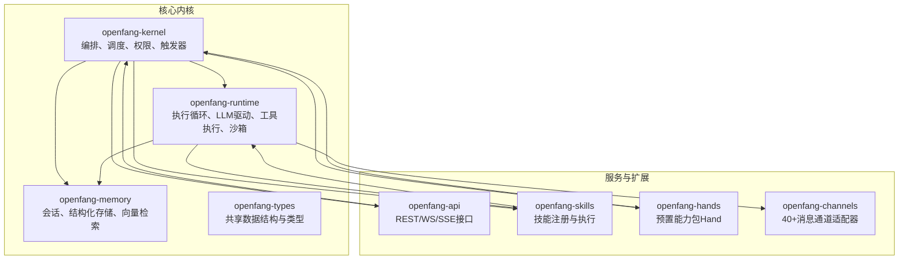
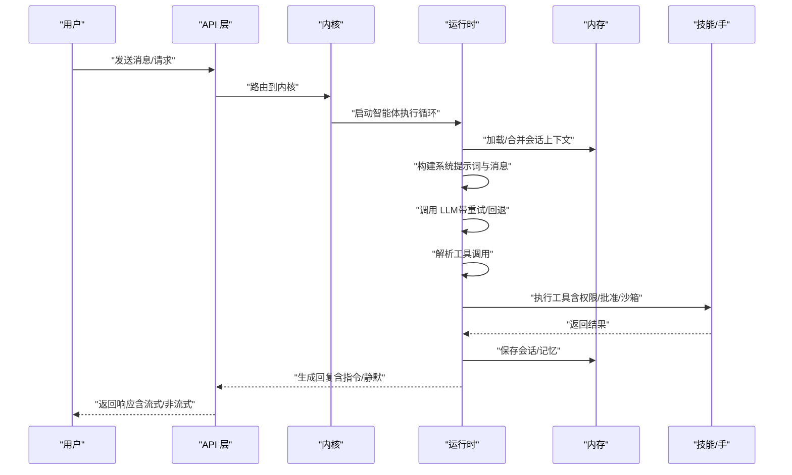
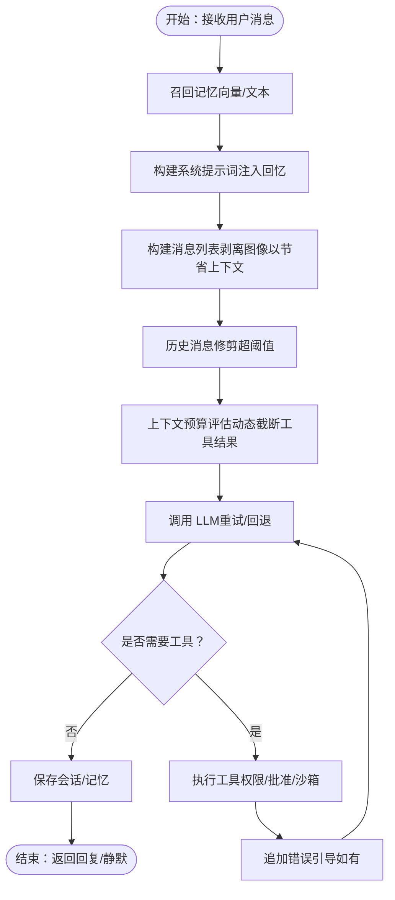
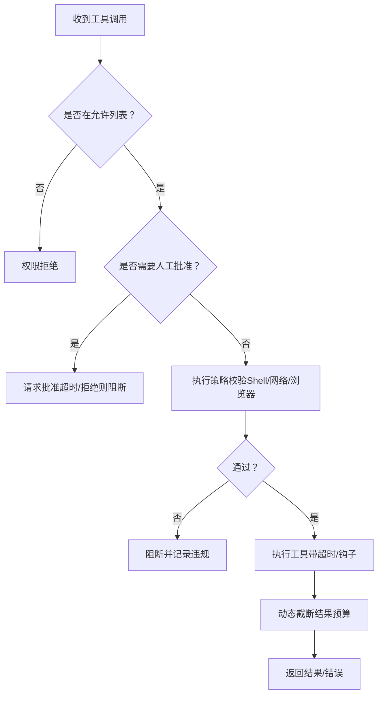
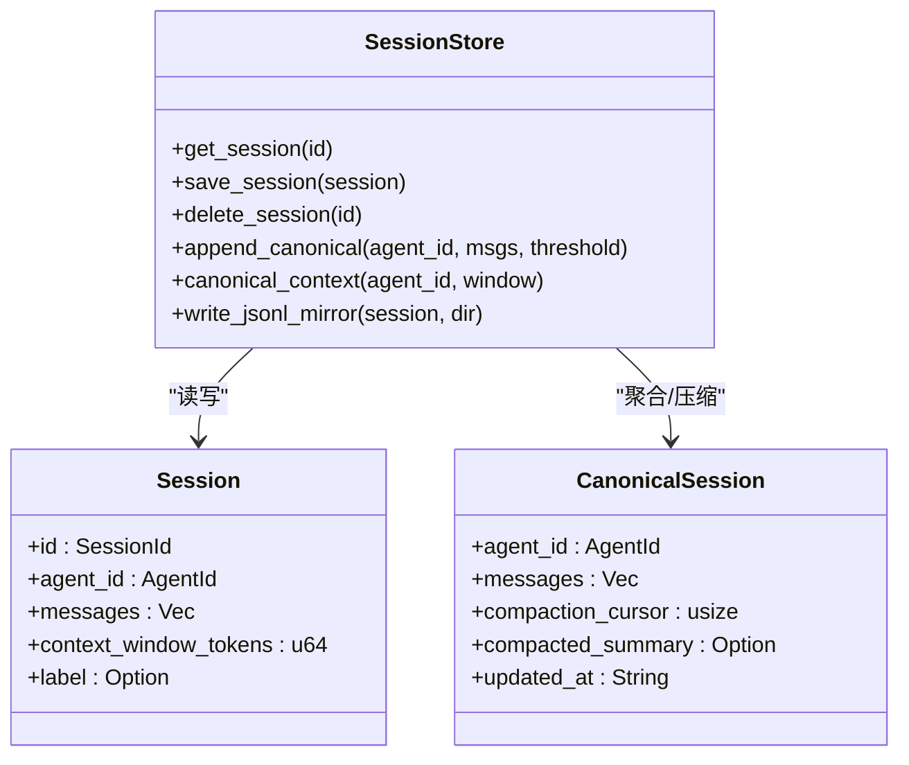
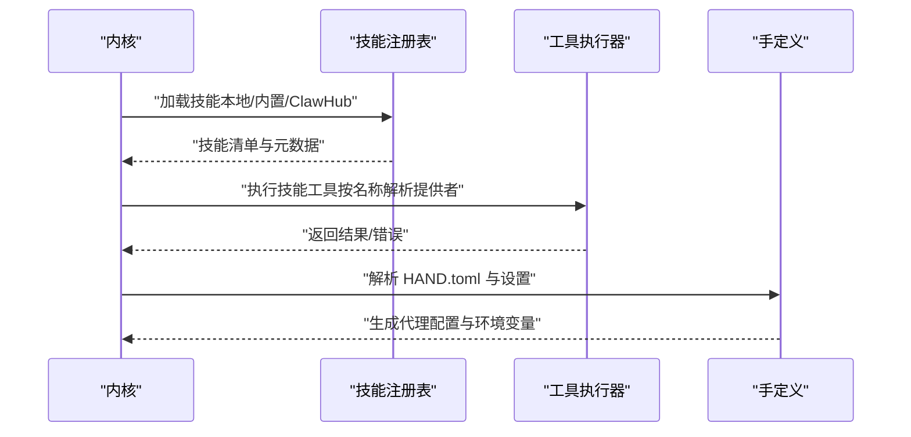
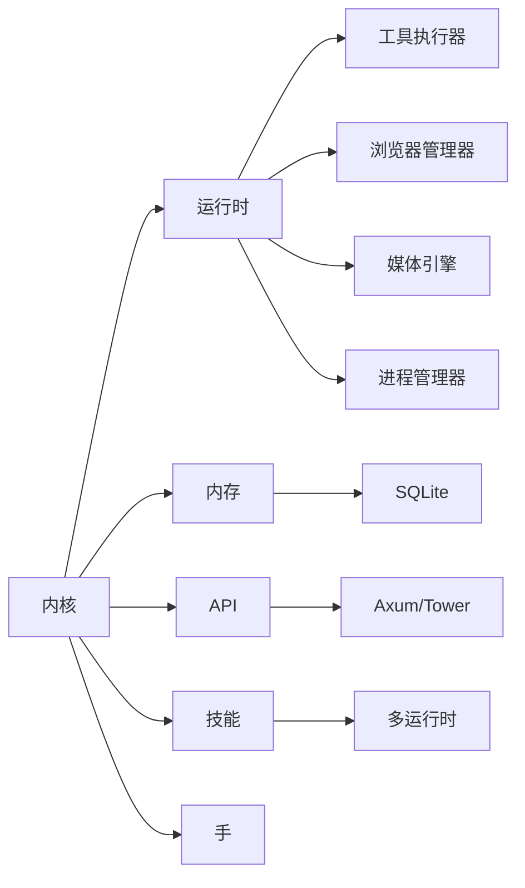

# 开发最佳实践

<cite>
**本文档引用的文件**
- [README.md](file://README.md)
- [Cargo.toml](file://Cargo.toml)
- [crates/openfang-kernel/src/lib.rs](file://crates/openfang-kernel/src/lib.rs)
- [crates/openfang-kernel/src/kernel.rs](file://crates/openfang-kernel/src/kernel.rs)
- [crates/openfang-kernel/src/registry.rs](file://crates/openfang-kernel/src/registry.rs)
- [crates/openfang-runtime/src/lib.rs](file://crates/openfang-runtime/src/lib.rs)
- [crates/openfang-runtime/src/agent_loop.rs](file://crates/openfang-runtime/src/agent_loop.rs)
- [crates/openfang-runtime/src/tool_runner.rs](file://crates/openfang-runtime/src/tool_runner.rs)
- [crates/openfang-memory/src/lib.rs](file://crates/openfang-memory/src/lib.rs)
- [crates/openfang-memory/src/session.rs](file://crates/openfang-memory/src/session.rs)
- [crates/openfang-types/src/lib.rs](file://crates/openfang-types/src/lib.rs)
- [crates/openfang-types/src/agent.rs](file://crates/openfang-types/src/agent.rs)
- [crates/openfang-api/src/lib.rs](file://crates/openfang-api/src/lib.rs)
- [crates/openfang-skills/src/lib.rs](file://crates/openfang-skills/src/lib.rs)
- [crates/openfang-hands/src/lib.rs](file://crates/openfang-hands/src/lib.rs)
</cite>

## 目录
1. [简介](#简介)
2. [项目结构](#项目结构)
3. [核心组件](#核心组件)
4. [架构总览](#架构总览)
5. [详细组件分析](#详细组件分析)
6. [依赖关系分析](#依赖关系分析)
7. [性能考量](#性能考量)
8. [故障排查指南](#故障排查指南)
9. [结论](#结论)
10. [附录](#附录)

## 简介
本指南面向在 OpenFang 智能体操作系统上进行开发的工程师，系统阐述从系统提示词设计、工具选择与使用策略、上下文管理到输出格式化的最佳实践；覆盖智能体与技能系统的集成模式、内存与会话管理、权限控制与安全加固、性能优化与可维护性设计；并提供具体代码路径示例与常见陷阱规避方法，帮助你在 OpenFang 上构建稳定、安全、高效的智能体应用。

## 项目结构
OpenFang 采用多 crate 的模块化内核设计，围绕“内核（Kernel）+ 运行时（Runtime）+ 内存（Memory）+ 类型（Types）+ API + 技能（Skills）+ 手（Hands）”等子系统协同工作，形成完整的智能体操作系统。

**图表来源**
- [crates/openfang-kernel/src/lib.rs:1-30](file://crates/openfang-kernel/src/lib.rs#L1-L30)
- [crates/openfang-runtime/src/lib.rs:1-59](file://crates/openfang-runtime/src/lib.rs#L1-L59)
- [crates/openfang-memory/src/lib.rs:1-20](file://crates/openfang-memory/src/lib.rs#L1-L20)
- [crates/openfang-api/src/lib.rs:1-18](file://crates/openfang-api/src/lib.rs#L1-L18)
- [crates/openfang-skills/src/lib.rs:1-255](file://crates/openfang-skills/src/lib.rs#L1-L255)
- [crates/openfang-hands/src/lib.rs:1-800](file://crates/openfang-hands/src/lib.rs#L1-L800)

**章节来源**
- [README.md:231-250](file://README.md#L231-L250)
- [Cargo.toml:1-160](file://Cargo.toml#L1-L160)

## 核心组件
- 内核（Kernel）：统一编排、调度、权限、触发器、审计、配额计量、工作流与触发引擎、后台执行器、WASM 沙箱、MCP/A2A 任务等。
- 运行时（Runtime）：智能体执行循环、LLM 驱动抽象、工具执行、浏览器自动化、媒体理解、TTS/STT、子进程沙箱、上下文预算与溢出恢复、钩子系统等。
- 内存（Memory）：会话持久化、跨渠道会话聚合、结构化存储、语义检索、知识图谱、使用统计与压缩。
- 类型（Types）：统一的数据结构、序列化兼容、字符串截断工具、错误与事件模型等。
- API：OpenAI 兼容接口、WebSocket/SSE 流式响应、速率限制、会话认证、频道桥接等。
- 技能（Skills）：插件化工具包，支持 Python/WASM/Node/Shell 等运行时，具备来源追踪与安全策略。
- 手（Hands）：预置的自治能力包，含设置解析、指标仪表盘、要求检查与安装指引。

**章节来源**
- [crates/openfang-kernel/src/kernel.rs:60-164](file://crates/openfang-kernel/src/kernel.rs#L60-L164)
- [crates/openfang-runtime/src/agent_loop.rs:145-167](file://crates/openfang-runtime/src/agent_loop.rs#L145-L167)
- [crates/openfang-runtime/src/tool_runner.rs:99-117](file://crates/openfang-runtime/src/tool_runner.rs#L99-L117)
- [crates/openfang-memory/src/session.rs:12-25](file://crates/openfang-memory/src/session.rs#L12-L25)
- [crates/openfang-types/src/agent.rs:424-530](file://crates/openfang-types/src/agent.rs#L424-L530)
- [crates/openfang-api/src/lib.rs:1-18](file://crates/openfang-api/src/lib.rs#L1-L18)
- [crates/openfang-skills/src/lib.rs:1-255](file://crates/openfang-skills/src/lib.rs#L1-L255)
- [crates/openfang-hands/src/lib.rs:328-427](file://crates/openfang-hands/src/lib.rs#L328-L427)

## 架构总览
OpenFang 的核心是内核协调各子系统，运行时负责单次对话的“思考-工具-行动-记忆”闭环，内存提供会话与知识的持久化，API 提供对外服务入口，技能与手扩展能力边界。

**图表来源**
- [crates/openfang-kernel/src/kernel.rs:505-510](file://crates/openfang-kernel/src/kernel.rs#L505-L510)
- [crates/openfang-runtime/src/agent_loop.rs:145-167](file://crates/openfang-runtime/src/agent_loop.rs#L145-L167)
- [crates/openfang-runtime/src/tool_runner.rs:99-117](file://crates/openfang-runtime/src/tool_runner.rs#L99-L117)
- [crates/openfang-memory/src/session.rs:39-101](file://crates/openfang-memory/src/session.rs#L39-L101)

## 详细组件分析

### 系统提示词设计与上下文管理
- 设计原则
  - 将“角色、目标、约束、流程”写入系统提示词，避免在首轮对话中反复解释。
  - 使用“回忆注入”将相关历史与知识拼接到系统提示词中，保持系统提示稳定以提升缓存收益。
  - 对于多模态输入（图片/音频），在本轮消息中保留内容块，在后续轮次中剥离以避免上下文膨胀。
- 关键实现要点
  - 记忆召回：优先向量检索，失败时回退文本匹配；支持按会话过滤。
  - 历史修剪：超过阈值的消息会被裁剪，随后进行修复以保证工具调用对齐。
  - 上下文预算：动态评估工具结果长度，防止超限；溢出时进入恢复流程。
  - 字符串截断：UTF-8 安全截断，避免字符边界破坏。
- 输出格式化
  - 支持回复指令（如静默、线程切换），并在最终文本中清理指令标记。
  - 工具错误时追加引导，避免捏造结果或虚构事实。

**图表来源**
- [crates/openfang-runtime/src/agent_loop.rs:177-222](file://crates/openfang-runtime/src/agent_loop.rs#L177-L222)
- [crates/openfang-runtime/src/agent_loop.rs:306-364](file://crates/openfang-runtime/src/agent_loop.rs#L306-L364)
- [crates/openfang-types/src/lib.rs:25-35](file://crates/openfang-types/src/lib.rs#L25-L35)

**章节来源**
- [crates/openfang-runtime/src/agent_loop.rs:177-222](file://crates/openfang-runtime/src/agent_loop.rs#L177-L222)
- [crates/openfang-runtime/src/agent_loop.rs:306-364](file://crates/openfang-runtime/src/agent_loop.rs#L306-L364)
- [crates/openfang-types/src/lib.rs:25-35](file://crates/openfang-types/src/lib.rs#L25-L35)

### 工具选择与使用策略
- 能力授权
  - 通过“工具白名单/黑名单”与“能力声明”双重控制，拒绝未授权工具名。
  - 执行前进行“批准门”检查，敏感操作需人工确认。
- 安全策略
  - Shell 执行：先做元字符注入检测，再按执行策略校验命令；在非“全放行”模式下进行二次污点检测。
  - 网络访问：URL 中若包含密钥/令牌等敏感参数，阻断外泄风险。
  - 浏览器自动化：对导航/点击等 URL 做污点检测。
- 执行与超时
  - 工具执行带超时保护；钩子可在执行前后拦截与记录。
- 外部集成
  - MCP 服务器工具：按连接列表解析工具名前缀，分派到对应服务器。
  - 技能工具：按技能注册表查找提供者，支持多运行时（Python/WASM/Node/Shell）。

**图表来源**
- [crates/openfang-runtime/src/tool_runner.rs:118-171](file://crates/openfang-runtime/src/tool_runner.rs#L118-L171)
- [crates/openfang-runtime/src/tool_runner.rs:213-266](file://crates/openfang-runtime/src/tool_runner.rs#L213-L266)
- [crates/openfang-runtime/src/tool_runner.rs:451-512](file://crates/openfang-runtime/src/tool_runner.rs#L451-L512)

**章节来源**
- [crates/openfang-runtime/src/tool_runner.rs:118-171](file://crates/openfang-runtime/src/tool_runner.rs#L118-L171)
- [crates/openfang-runtime/src/tool_runner.rs:213-266](file://crates/openfang-runtime/src/tool_runner.rs#L213-L266)
- [crates/openfang-runtime/src/tool_runner.rs:451-512](file://crates/openfang-runtime/src/tool_runner.rs#L451-L512)

### 内存与会话管理
- 会话模型
  - 每个智能体有多个通道会话，同时维护一个“跨渠道的规范会话”，用于全局上下文。
  - 规范会话在消息数量超过阈值时进行压缩，保留最近窗口并生成摘要。
- 存储与镜像
  - 使用 SQLite 存储会话与规范会话，支持 JSONL 只读镜像便于审计与调试。
- 会话修复
  - 在历史修剪/溢出恢复后，自动修复工具调用与结果的配对问题，避免空输入导致的失败。

**图表来源**
- [crates/openfang-memory/src/session.rs:12-25](file://crates/openfang-memory/src/session.rs#L12-L25)
- [crates/openfang-memory/src/session.rs:340-361](file://crates/openfang-memory/src/session.rs#L340-L361)
- [crates/openfang-memory/src/session.rs:410-475](file://crates/openfang-memory/src/session.rs#L410-L475)

**章节来源**
- [crates/openfang-memory/src/session.rs:39-101](file://crates/openfang-memory/src/session.rs#L39-L101)
- [crates/openfang-memory/src/session.rs:410-475](file://crates/openfang-memory/src/session.rs#L410-L475)
- [crates/openfang-memory/src/session.rs:528-618](file://crates/openfang-memory/src/session.rs#L528-L618)

### 权限控制与安全机制
- RBAC 与能力授予
  - 通过“工具白名单/黑名单”与“能力声明”控制工具可用性；模式（只读/协助/全权）可过滤工具集。
- 批准门与环路防护
  - 敏感工具需批准；环路守卫检测工具调用循环并触发熔断。
- 沙箱与污点跟踪
  - Shell/网络/浏览器均实施污点检测与策略校验；WASM 双层计量与中断保护。
- 会话修复与速率限制
  - 会话修复保障消息配对正确；GCRA 速率限制兼顾成本与公平。

**章节来源**
- [crates/openfang-types/src/agent.rs:188-223](file://crates/openfang-types/src/agent.rs#L188-L223)
- [crates/openfang-runtime/src/agent_loop.rs:606-655](file://crates/openfang-runtime/src/agent_loop.rs#L606-L655)
- [crates/openfang-runtime/src/tool_runner.rs:213-266](file://crates/openfang-runtime/src/tool_runner.rs#L213-L266)

### 智能体与技能系统集成
- 技能注册与来源
  - 支持本地/内置/ClawHub 下载等多种来源；具备来源追踪与校验。
- 工具提供者
  - 技能可声明提供的工具，运行时按名称查找并执行；支持错误包装与 JSON 结果序列化。
- 手（Hand）激活
  - 解析 HAND.toml，收集设置与环境变量，注入系统提示词，生成代理智能体并启动。

**图表来源**
- [crates/openfang-skills/src/lib.rs:1-255](file://crates/openfang-skills/src/lib.rs#L1-L255)
- [crates/openfang-runtime/src/tool_runner.rs:482-512](file://crates/openfang-runtime/src/tool_runner.rs#L482-L512)
- [crates/openfang-hands/src/lib.rs:328-427](file://crates/openfang-hands/src/lib.rs#L328-L427)

**章节来源**
- [crates/openfang-skills/src/lib.rs:1-255](file://crates/openfang-skills/src/lib.rs#L1-L255)
- [crates/openfang-runtime/src/tool_runner.rs:482-512](file://crates/openfang-runtime/src/tool_runner.rs#L482-L512)
- [crates/openfang-hands/src/lib.rs:328-427](file://crates/openfang-hands/src/lib.rs#L328-L427)

### 会话处理与状态同步
- 会话标签与命名
  - 支持会话标签与命名，便于跨渠道上下文关联与检索。
- 规范会话压缩
  - 当消息数超过阈值时，将旧消息摘要化并保留最近窗口，降低上下文成本。
- 会话镜像
  - 写出 JSONL 镜像，便于审计与离线分析。

**章节来源**
- [crates/openfang-types/src/agent.rs:563-592](file://crates/openfang-types/src/agent.rs#L563-L592)
- [crates/openfang-memory/src/session.rs:410-475](file://crates/openfang-memory/src/session.rs#L410-L475)
- [crates/openfang-memory/src/session.rs:528-618](file://crates/openfang-memory/src/session.rs#L528-L618)

### API 与外部集成
- OpenAI 兼容接口
  - 提供聊天补全、流式传输、会话管理等端点，便于现有生态迁移。
- 速率限制与认证
  - 提供速率限制中间件与会话认证，保障服务稳定性与安全性。
- 频道桥接
  - 支持 40+ 频道适配器，统一消息路由与格式化。

**章节来源**
- [crates/openfang-api/src/lib.rs:1-18](file://crates/openfang-api/src/lib.rs#L1-L18)
- [README.md:389-404](file://README.md#L389-L404)

## 依赖关系分析
- 组件耦合
  - 内核对运行时、内存、API、技能、手存在强依赖；运行时对工具执行器、浏览器、媒体引擎、子进程沙箱存在依赖。
- 并发与锁
  - 内核使用并发映射（DashMap）管理注册表、会话与任务；对关键资源采用互斥锁保护。
- 外部依赖
  - LLM 驱动、WASM 引擎、数据库、HTTP 客户端、WebSocket、速率限制、加密与安全库等。

**图表来源**
- [Cargo.toml:24-147](file://Cargo.toml#L24-L147)
- [crates/openfang-kernel/src/kernel.rs:60-164](file://crates/openfang-kernel/src/kernel.rs#L60-L164)
- [crates/openfang-runtime/src/agent_loop.rs:1-50](file://crates/openfang-runtime/src/agent_loop.rs#L1-L50)

**章节来源**
- [Cargo.toml:24-147](file://Cargo.toml#L24-L147)
- [crates/openfang-kernel/src/kernel.rs:60-164](file://crates/openfang-kernel/src/kernel.rs#L60-L164)

## 性能考量
- 启动与冷启动
  - 单二进制部署，内核引导时初始化驱动链与回退策略，确保在无配置时仍可访问仪表盘。
- 上下文与计算
  - 动态上下文预算与工具结果截断，减少无效计算；向量检索优先，失败回退文本搜索。
- 存储与压缩
  - 规范会话压缩与摘要化，降低 SQLite 存储与传输成本。
- 并发与资源
  - 会话级消息锁避免并发写入导致的历史错乱；任务取消与后台执行器保障长任务可控。
- 缓存与路由
  - LLM 提供商自动检测与 URL 覆盖，结合模型目录与回退链，提升成功率与稳定性。

**章节来源**
- [crates/openfang-kernel/src/kernel.rs:591-758](file://crates/openfang-kernel/src/kernel.rs#L591-L758)
- [crates/openfang-runtime/src/agent_loop.rs:342-364](file://crates/openfang-runtime/src/agent_loop.rs#L342-L364)
- [crates/openfang-memory/src/session.rs:410-475](file://crates/openfang-memory/src/session.rs#L410-L475)

## 故障排查指南
- 常见问题定位
  - 空响应/无输出：检查上下文溢出恢复、历史修剪后的配对修复、工具调用是否被阻断。
  - 工具执行失败：查看错误引导注入、钩子拦截日志、超时与策略阻断原因。
  - 会话错乱：确认会话锁与消息顺序修复逻辑是否生效。
- 审计与诊断
  - 使用 JSONL 镜像与会话列表辅助回溯；检查速率限制与会话认证配置。
- 安全告警
  - Shell 注入、网络外泄、环路调用等违规行为均有明确阻断与日志记录。

**章节来源**
- [crates/openfang-runtime/src/agent_loop.rs:454-514](file://crates/openfang-runtime/src/agent_loop.rs#L454-L514)
- [crates/openfang-runtime/src/tool_runner.rs:213-266](file://crates/openfang-runtime/src/tool_runner.rs#L213-L266)
- [crates/openfang-memory/src/session.rs:528-618](file://crates/openfang-memory/src/session.rs#L528-L618)

## 结论
OpenFang 通过“内核编排 + 运行时执行 + 内存持久化 + 类型统一 + API 服务 + 技能扩展 + 手能力包”的体系，提供了从系统提示词设计、工具安全执行、上下文与内存管理到权限与安全的完整闭环。遵循本文的最佳实践，可显著提升智能体的稳定性、安全性与可维护性，并在复杂场景中实现高效、可控的自动化。

## 附录
- 快速参考
  - 系统提示词：在系统提示词中注入回忆，保持系统提示稳定；对多模态输入在本轮保留，后续剥离。
  - 工具执行：先授权、再批准、后策略校验；失败时追加引导，避免捏造结果。
  - 会话管理：跨渠道聚合、压缩与镜像；超阈值自动修剪与修复。
  - 安全策略：Shell/网络/浏览器污点检测与策略校验；环路守卫与会话修复。
  - API 集成：OpenAI 兼容接口、速率限制与认证；40+ 频道适配器。