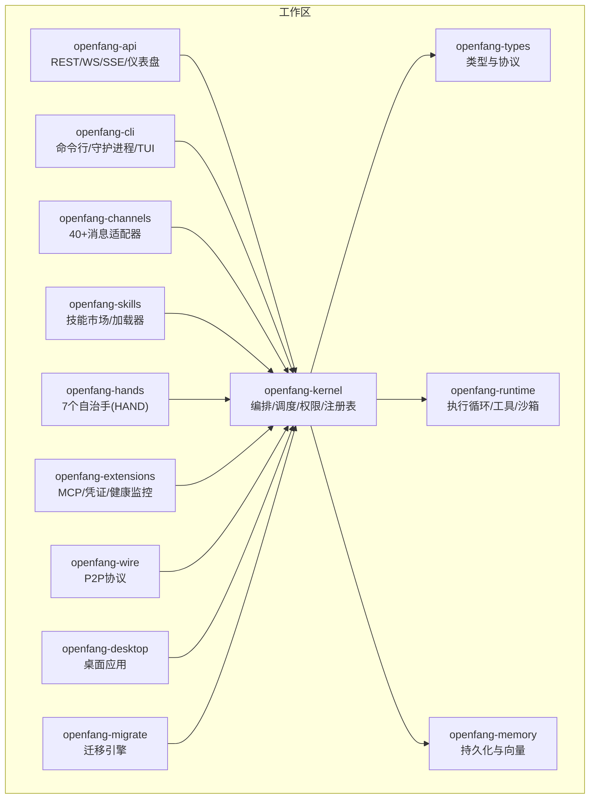
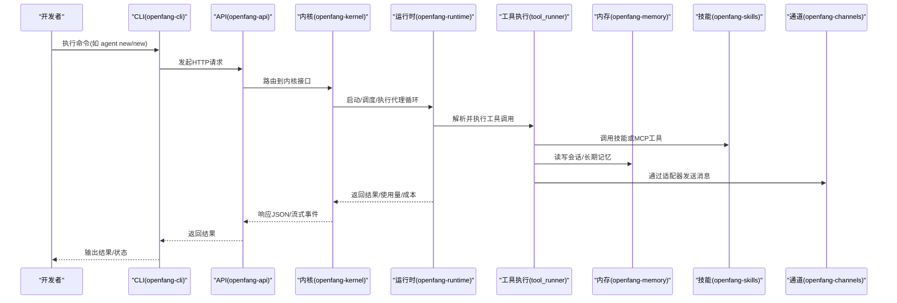
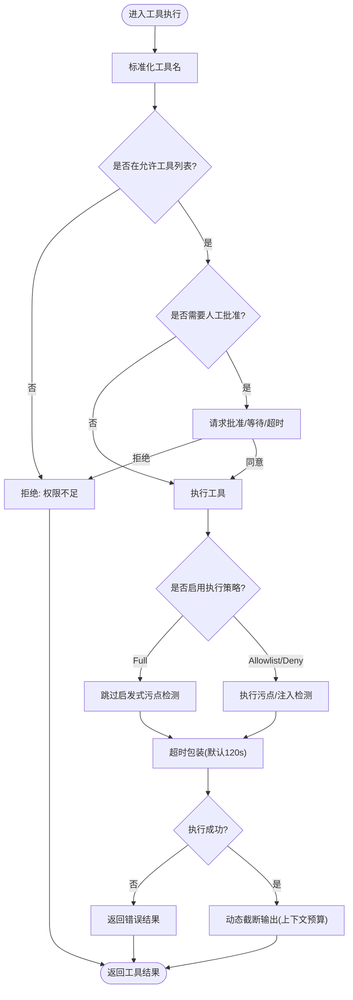
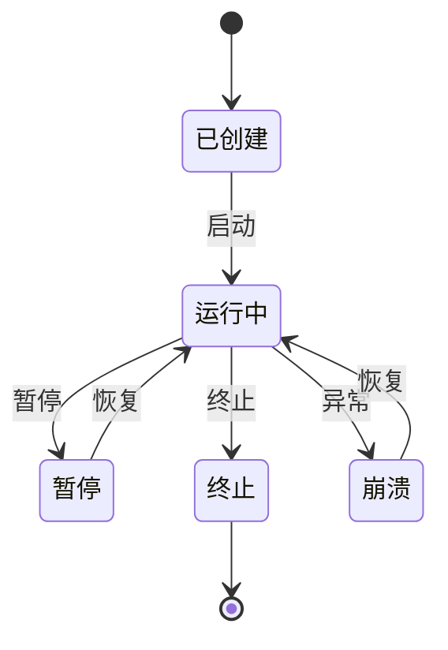
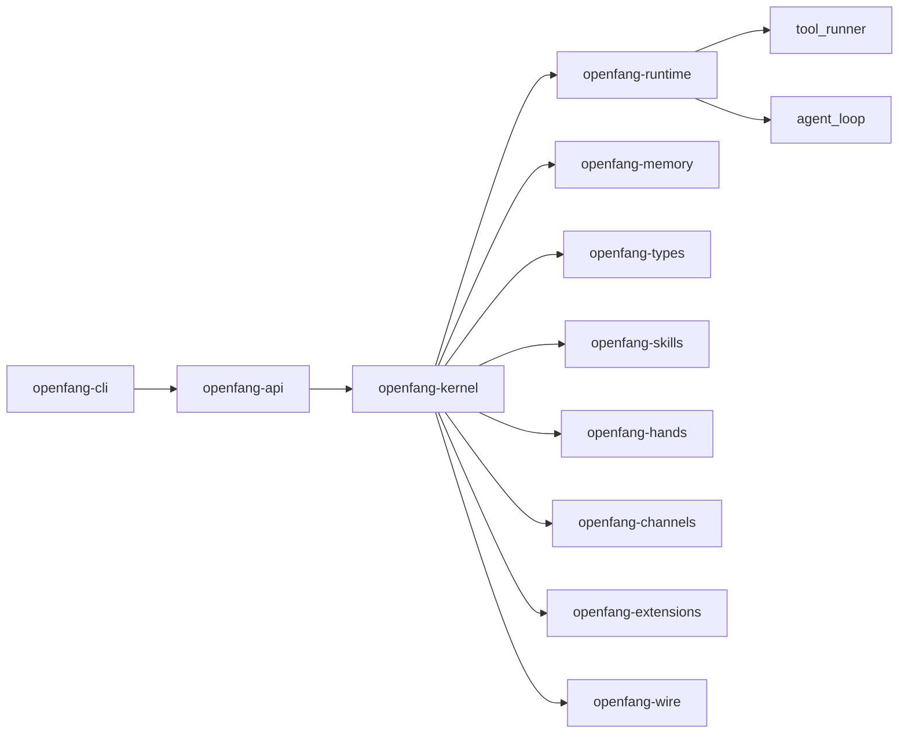

# 开发流程

<cite>
**本文引用的文件**
- [README.md](file://README.md)
- [openfang.toml.example](file://openfang.toml.example)
- [Cargo.toml](file://Cargo.toml)
- [crates/openfang-kernel/src/lib.rs](file://crates/openfang-kernel/src/lib.rs)
- [crates/openfang-kernel/src/kernel.rs](file://crates/openfang-kernel/src/kernel.rs)
- [crates/openfang-kernel/src/registry.rs](file://crates/openfang-kernel/src/registry.rs)
- [crates/openfang-runtime/src/lib.rs](file://crates/openfang-runtime/src/lib.rs)
- [crates/openfang-runtime/src/agent_loop.rs](file://crates/openfang-runtime/src/agent_loop.rs)
- [crates/openfang-runtime/src/tool_runner.rs](file://crates/openfang-runtime/src/tool_runner.rs)
- [crates/openfang-types/src/agent.rs](file://crates/openfang-types/src/agent.rs)
- [crates/openfang-api/src/lib.rs](file://crates/openfang-api/src/lib.rs)
- [crates/openfang-cli/src/main.rs](file://crates/openfang-cli/src/main.rs)
- [crates/openfang-hands/bundled/researcher/HAND.toml](file://crates/openfang-hands/bundled/researcher/HAND.toml)
- [agents/hello-world/agent.toml](file://agents/hello-world/agent.toml)
</cite>

## 目录
1. [简介](#简介)
2. [项目结构](#项目结构)
3. [核心组件](#核心组件)
4. [架构总览](#架构总览)
5. [详细组件分析](#详细组件分析)
6. [依赖关系分析](#依赖关系分析)
7. [性能考量](#性能考量)
8. [故障排查指南](#故障排查指南)
9. [结论](#结论)
10. [附录](#附录)

## 简介
本指南面向希望在 OpenFang 上开发智能体（Agent）的工程师与产品人员，覆盖从需求分析到智能体上线的完整流程：项目初始化、模板选择与定制、配置文件编写、代码实现、测试验证、部署上线；深入解释智能体注册机制、生命周期管理、状态转换；并提供开发环境搭建、IDE 配置建议、调试技巧，以及智能体与内核系统的交互方式、事件处理机制、错误处理策略等。

## 项目结构
OpenFang 是一个由 14 个 Rust crate 组成的模块化 Agent 操作系统，核心能力包括内核（调度、权限、内存）、运行时（执行循环、工具集、沙箱）、API 服务、通道适配器、技能市场、手（Hands）自治能力包、扩展与集成、桌面应用、迁移工具等。工作区通过 Cargo 工作区统一管理。

图示来源
- [Cargo.toml:1-160](file://Cargo.toml#L1-L160)

章节来源
- [Cargo.toml:1-160](file://Cargo.toml#L1-L160)
- [README.md:231-250](file://README.md#L231-L250)

## 核心组件
- 内核（openfang-kernel）
  - 负责代理生命周期、调度、权限、内存、事件总线、触发器、工作流、后台执行、审计日志、计费计量、设备配对、手注册表、扩展注册表、频道适配器索引、交货收据跟踪、定时任务、审批管理、自动回复、钩子注册、进程管理、P2P 节点与对等节点注册等。
- 运行时（openfang-runtime）
  - 提供智能体执行循环、LLM 驱动抽象、工具执行、WASM 沙箱、MCP/A2A、浏览器自动化、媒体理解、TTS、会话修复、回路保护、超时重试、上下文预算、嵌入驱动、进程管理等。
- 类型系统（openfang-types）
  - 定义代理身份、清单、状态、调度模式、资源配额、优先级、工具配置、能力声明、会话标签、钩子事件等核心数据结构。
- API 服务（openfang-api）
  - 提供 140+ REST/WS/SSE 接口，支持代理管理、内存、工作流、通道、模型、技能、A2A、Hands 等。
- CLI（openfang-cli）
  - 提供 init/start/stop、agent/new/spawn/list/chat/kill、workflow/triggers/skills/channels/hands/config/models/approvals/cron/sessions/logs/doctor 等命令，支持单次模式与守护进程模式。

章节来源
- [crates/openfang-kernel/src/lib.rs:1-30](file://crates/openfang-kernel/src/lib.rs#L1-L30)
- [crates/openfang-runtime/src/lib.rs:1-59](file://crates/openfang-runtime/src/lib.rs#L1-L59)
- [crates/openfang-types/src/agent.rs:1-800](file://crates/openfang-types/src/agent.rs#L1-L800)
- [crates/openfang-api/src/lib.rs:1-18](file://crates/openfang-api/src/lib.rs#L1-L18)
- [crates/openfang-cli/src/main.rs:1-800](file://crates/openfang-cli/src/main.rs#L1-L800)

## 架构总览
下图展示了从 CLI 到内核、再到运行时与工具执行的整体调用链，以及与通道适配器、内存、技能、扩展的交互。

图示来源
- [crates/openfang-cli/src/main.rs:107-294](file://crates/openfang-cli/src/main.rs#L107-L294)
- [crates/openfang-api/src/lib.rs:1-18](file://crates/openfang-api/src/lib.rs#L1-L18)
- [crates/openfang-kernel/src/kernel.rs:505-800](file://crates/openfang-kernel/src/kernel.rs#L505-L800)
- [crates/openfang-runtime/src/agent_loop.rs:140-800](file://crates/openfang-runtime/src/agent_loop.rs#L140-L800)
- [crates/openfang-runtime/src/tool_runner.rs:99-526](file://crates/openfang-runtime/src/tool_runner.rs#L99-L526)

## 详细组件分析

### 1) 项目初始化与环境准备
- 安装与初始化
  - 使用官方安装脚本安装后，执行初始化，按提示完成默认模型与凭据设置。
  - 可选：复制示例配置到用户目录并按需修改。
- 配置文件
  - 示例配置包含 API 监听地址、默认模型、内存衰减率、网络监听地址、会话压缩阈值、用量显示、各平台通道令牌、MCP 服务器连接等。
- 开发环境
  - Rust 工具链、Cargo、可选 IDE（VS Code/Rust Analyzer），建议启用 Clippy 与格式化检查，确保无警告。

章节来源
- [README.md:407-431](file://README.md#L407-L431)
- [openfang.toml.example:1-49](file://openfang.toml.example#L1-L49)

### 2) 模板选择与定制
- 预置智能体模板
  - 仓库内置多个智能体模板（如 hello-world），可直接基于其 agent.toml 快速开始。
- 自定义智能体清单
  - 在 agent.toml 中定义名称、版本、描述、作者、模块、调度模式、模型配置、资源配额、优先级、能力、技能、MCP 服务器白名单、元数据、标签、路由、自主运行配置、工作空间、生成身份文件开关、执行策略、工具允许/禁止列表等。
- 手（Hands）模板
  - HAND.toml 定义手的 ID、名称、描述、分类、图标、工具集合、可配置设置项、代理配置、仪表盘指标等。

章节来源
- [agents/hello-world/agent.toml:1-30](file://agents/hello-world/agent.toml#L1-L30)
- [crates/openfang-hands/bundled/researcher/HAND.toml:1-398](file://crates/openfang-hands/bundled/researcher/HAND.toml#L1-L398)

### 3) 配置文件编写
- 全局配置（openfang.toml）
  - 默认模型提供商与模型、API 密钥、内存路径与衰减率、网络监听地址、会话压缩阈值、用量显示、各平台通道配置、MCP 服务器列表等。
- 智能体清单（agent.toml/HAND.toml）
  - 模型参数（provider/model/max_tokens/temperature/system_prompt）、资源配额、能力声明、工具/技能/MCP 限制、元数据、标签、路由与自主运行参数、工作空间、执行策略、工具白/黑名单等。

章节来源
- [openfang.toml.example:1-49](file://openfang.toml.example#L1-L49)
- [crates/openfang-types/src/agent.rs:424-530](file://crates/openfang-types/src/agent.rs#L424-L530)

### 4) 代码实现与工具扩展
- 工具执行链路
  - 运行时执行循环解析 LLM 输出的工具调用，经能力校验、批准门、环路保护、超时控制、动态截断后，调用工具执行器。
  - 工具执行器支持文件系统、网络抓取/搜索、Shell 执行（含策略与污点检测）、跨代理通信、共享内存、协作任务、计划任务、知识图谱、媒体理解、图像生成、TTS/STT、Docker 沙箱、浏览器自动化、Canvas/A2UI、MCP 技能等。
- 安全与合规
  - 能力门禁、环路保护、超时重试、上下文预算、SSRF/注入防护、污点追踪、执行策略（Allowlist/Deny/Full）、会话修复、路径遍历防护、速率限制等。

图示来源
- [crates/openfang-runtime/src/tool_runner.rs:99-526](file://crates/openfang-runtime/src/tool_runner.rs#L99-L526)

章节来源
- [crates/openfang-runtime/src/agent_loop.rs:140-800](file://crates/openfang-runtime/src/agent_loop.rs#L140-L800)
- [crates/openfang-runtime/src/tool_runner.rs:99-526](file://crates/openfang-runtime/src/tool_runner.rs#L99-L526)

### 5) 测试验证
- 单元与集成测试
  - 工作区包含大量测试用例，覆盖内核、运行时、通道、API、技能、迁移等多个模块。
- 健康检查与诊断
  - CLI 提供 doctor、health、logs 等命令辅助定位问题。
- 性能基准
  - README 提供冷启动、空闲内存、安装体积、安全层、通道适配器、LLM 提供商等对比数据，便于评估与回归。

章节来源
- [README.md:117-186](file://README.md#L117-L186)
- [crates/openfang-cli/src/main.rs:232-294](file://crates/openfang-cli/src/main.rs#L232-L294)

### 6) 部署上线
- 守护进程模式
  - CLI 支持 start/stop/status，API 服务监听指定地址，仪表盘可通过浏览器访问。
- 生产检查清单
  - 文档提供生产部署检查清单，建议关注安全、可观测性、备份与恢复、容量规划等。

章节来源
- [README.md:407-431](file://README.md#L407-L431)
- [README.md:481-495](file://README.md#L481-L495)

### 7) 智能体注册机制与生命周期
- 注册表（AgentRegistry）
  - 维护代理 ID→条目、名称→ID、标签→ID 列表索引；支持更新状态、模式、会话、工作空间、身份、模型、回退模型链、技能/MCP 工具过滤、系统提示、名称/描述、资源配额、引导完成标记等。
- 生命周期状态
  - Created（已创建未启动）、Running（运行中）、Suspended（暂停）、Terminated（终止）、Crashed（崩溃待恢复）。
- 模式
  - Observe（只读）、Assist（受限）、Full（无限制）三种操作模式，用于过滤可用工具集。
- 调度模式
  - Reactive（响应式）、Periodic（周期性）、Proactive（主动探测）、Continuous（持续循环）。

图示来源
- [crates/openfang-types/src/agent.rs:172-186](file://crates/openfang-types/src/agent.rs#L172-L186)
- [crates/openfang-kernel/src/registry.rs:17-120](file://crates/openfang-kernel/src/registry.rs#L17-L120)

章节来源
- [crates/openfang-types/src/agent.rs:172-241](file://crates/openfang-types/src/agent.rs#L172-L241)
- [crates/openfang-kernel/src/registry.rs:17-345](file://crates/openfang-kernel/src/registry.rs#L17-L345)

### 8) 与内核系统的交互与事件处理
- 内核装配
  - 内核负责组装配置、内存、凭证解析、LLM 驱动链（主驱动+回退）、计量、WASM 沙箱、RBAC、模型目录、技能注册表、手注册表、扩展注册表、事件总线、触发器、后台执行器、审计日志、交货收据、定时任务、审批、自动回复、钩子、进程管理、P2P 节点等。
- 事件总线与触发器
  - 支持基于生命周期、代理创建等事件的触发器，可用于自动化工作流与通知。
- 会话与记忆
  - 会话修复、历史修剪、记忆检索与存储、向量化召回、每日记忆日志等。

章节来源
- [crates/openfang-kernel/src/kernel.rs:505-800](file://crates/openfang-kernel/src/kernel.rs#L505-L800)
- [crates/openfang-kernel/src/kernel.rs:272-483](file://crates/openfang-kernel/src/kernel.rs#L272-L483)

### 9) 错误处理策略
- 环路保护与超时
  - 循环检测与电路 breaker，工具执行超时控制。
- 上下文溢出与恢复
  - 动态截断、会话修复、紧急修剪与最终错误提示。
- 审批与拒绝
  - 对敏感工具（如购买、shell、浏览器）采用人工审批，拒绝时阻断并返回明确提示。
- 安全与合规
  - 污点追踪、注入扫描、路径遍历防护、速率限制、会话修复、密钥零化等。

章节来源
- [crates/openfang-runtime/src/agent_loop.rs:347-800](file://crates/openfang-runtime/src/agent_loop.rs#L347-L800)
- [crates/openfang-runtime/src/tool_runner.rs:99-526](file://crates/openfang-runtime/src/tool_runner.rs#L99-L526)

### 10) 实战示例：创建你的第一个智能体
- 步骤
  1) 初始化：openfang init
  2) 启动：openfang start
  3) 新建智能体：openfang agent new coder（或选择其他模板）
  4) 编辑清单：根据需求修改 agent.toml（模型、能力、资源、工具、技能、MCP 等）
  5) 交互测试：openfang chat 或 openfang agent chat <agent-id>
  6) 部署上线：守护进程模式运行，仪表盘监控状态
- 参考
  - hello-world 模板与 HAND.toml 的结构可作为起点。

章节来源
- [README.md:407-431](file://README.md#L407-L431)
- [agents/hello-world/agent.toml:1-30](file://agents/hello-world/agent.toml#L1-L30)
- [crates/openfang-hands/bundled/researcher/HAND.toml:1-398](file://crates/openfang-hands/bundled/researcher/HAND.toml#L1-L398)

## 依赖关系分析
- 工作区依赖
  - 通过 Cargo 工作区统一管理，核心依赖包括异步运行时、序列化、并发、日志、时间、UUID、数据库、HTTP、WebSocket、WASM、加密、速率限制、交互式 CLI、邮件、压缩、HTML 解码、正则、套接字选项、ZIP、OpenSSL、测试等。
- 组件耦合
  - 内核与运行时强耦合（内核驱动运行时执行循环与工具执行），API/CLI 通过 HTTP 与内核交互，通道/技能/扩展/内存/手等作为内核子系统被统一编排。

图示来源
- [Cargo.toml:1-160](file://Cargo.toml#L1-L160)
- [crates/openfang-kernel/src/lib.rs:1-30](file://crates/openfang-kernel/src/lib.rs#L1-L30)
- [crates/openfang-runtime/src/lib.rs:1-59](file://crates/openfang-runtime/src/lib.rs#L1-L59)

章节来源
- [Cargo.toml:1-160](file://Cargo.toml#L1-L160)

## 性能考量
- 冷启动与内存占用
  - README 提供了与其他框架的冷启动与内存占用对比，OpenFang 在冷启动与内存占用方面具有优势。
- 上下文管理
  - 运行时提供上下文预算、动态截断、会话修复、历史修剪等机制，避免上下文溢出导致的性能退化。
- 计费与配额
  - 内核提供计量引擎与资源配额，结合模型目录与回退策略，有助于控制成本与提升稳定性。

章节来源
- [README.md:117-186](file://README.md#L117-L186)
- [crates/openfang-runtime/src/agent_loop.rs:347-800](file://crates/openfang-runtime/src/agent_loop.rs#L347-L800)
- [crates/openfang-kernel/src/kernel.rs:718-758](file://crates/openfang-kernel/src/kernel.rs#L718-L758)

## 故障排查指南
- 常见问题
  - LLM 提供商未配置：内核会返回“未配置 API Key”的提示，可通过配置文件或仪表盘设置。
  - 通道连接异常：检查通道配置、令牌、网络连通性与速率限制。
  - 工具执行失败：查看工具错误指导、环路保护触发、超时、污点/注入检测、执行策略限制等。
- 诊断命令
  - openfang doctor、openfang health、openfang logs、openfang sessions、openfang approvals、openfang cron list 等。
- 审计与完整性
  - 使用 openfang security audit/verify 查看审计链完整性。

章节来源
- [crates/openfang-kernel/src/kernel.rs:48-58](file://crates/openfang-kernel/src/kernel.rs#L48-L58)
- [crates/openfang-cli/src/main.rs:559-778](file://crates/openfang-cli/src/main.rs#L559-L778)

## 结论
OpenFang 提供了从底层内核到上层 API/CLI 的完整 Agent OS 能力，具备强大的执行循环、工具生态、安全体系与可观测性。遵循本文的开发流程与最佳实践，可在保证安全与可控的前提下快速构建、测试与上线智能体，并通过注册表、生命周期管理、事件触发与内存系统实现复杂场景的自动化与协同。

## 附录
- 开发环境搭建建议
  - 安装 Rust 工具链与 Cargo，启用 Clippy 与格式化检查，使用 VS Code 并安装 Rust Analyzer 插件。
- 调试技巧
  - 使用 openfang logs -f 实时查看日志；在 agent.toml 中适当提高日志级别；利用钩子（BeforeToolCall/AfterToolCall/BeforePromptBuild/AgentLoopEnd）进行行为观测与拦截。
- API 参考
  - openfang-api 提供 140+ 接口，覆盖代理、内存、工作流、通道、模型、技能、A2A、Hands 等，建议结合 CLI 与仪表盘使用。

章节来源
- [crates/openfang-api/src/lib.rs:1-18](file://crates/openfang-api/src/lib.rs#L1-L18)
- [crates/openfang-cli/src/main.rs:62-86](file://crates/openfang-cli/src/main.rs#L62-L86)