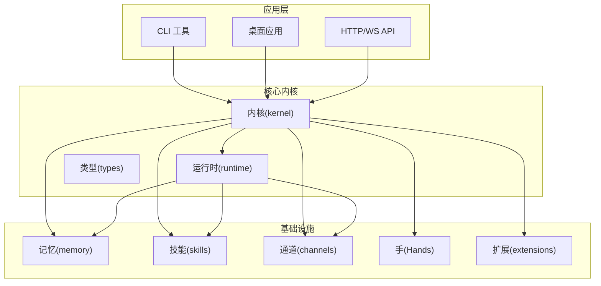
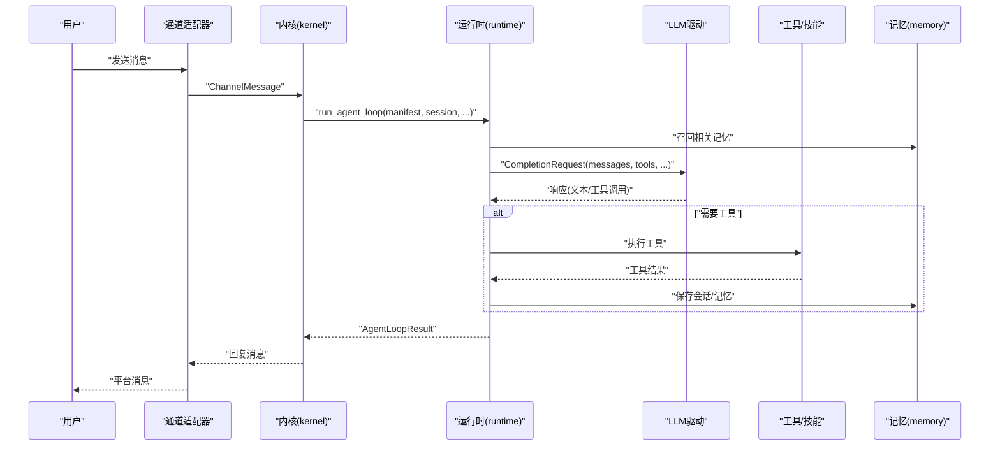
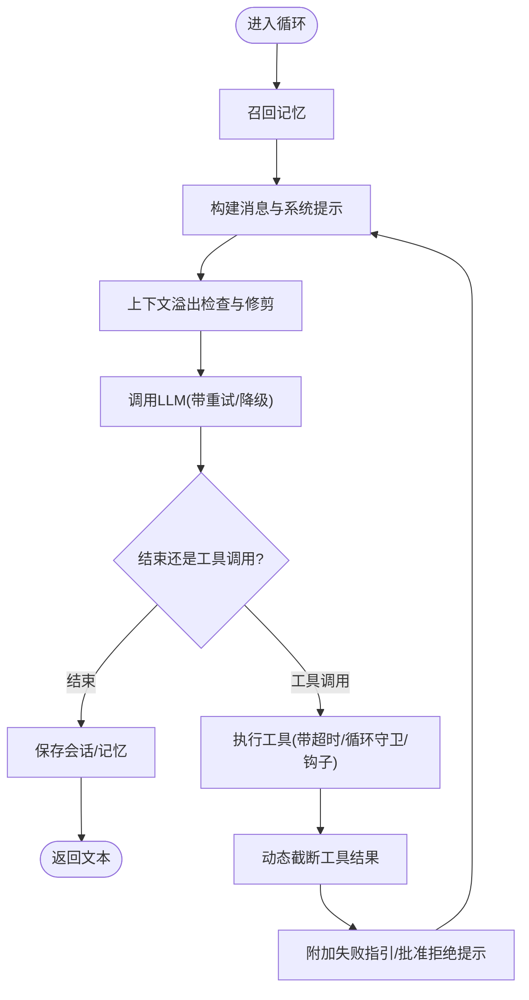
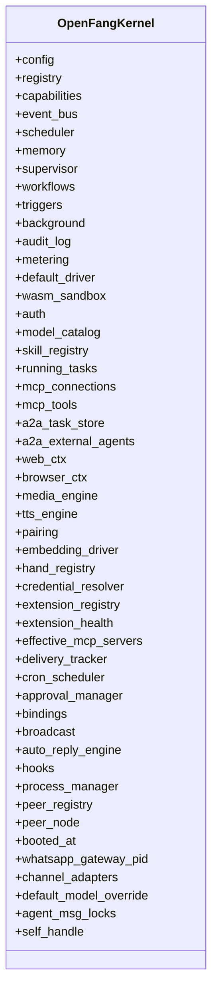
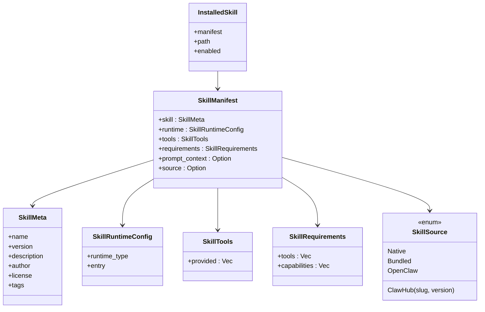
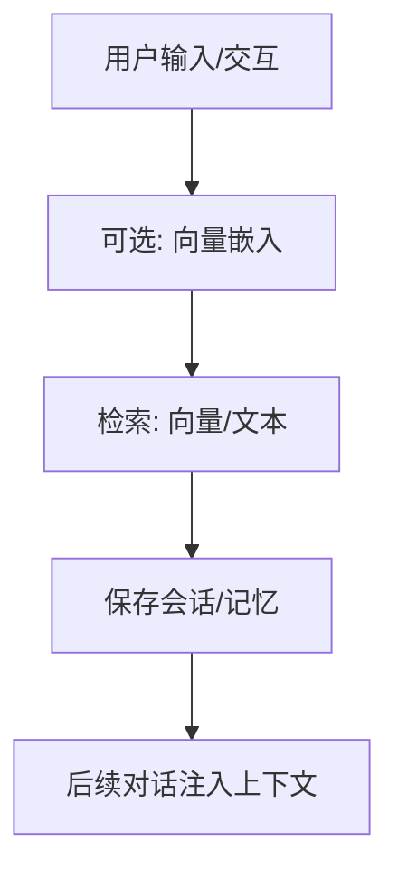
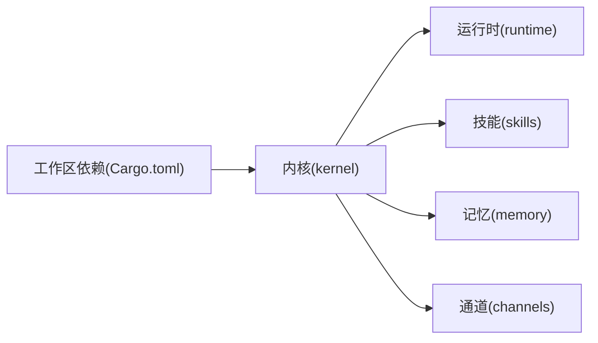

# 自定义智能体开发

<cite>
**本文引用的文件**
- [README.md](file://README.md)
- [Cargo.toml](file://Cargo.toml)
- [openfang.toml.example](file://openfang.toml.example)
- [crates/openfang-kernel/src/lib.rs](file://crates/openfang-kernel/src/lib.rs)
- [crates/openfang-kernel/src/kernel.rs](file://crates/openfang-kernel/src/kernel.rs)
- [crates/openfang-runtime/src/lib.rs](file://crates/openfang-runtime/src/lib.rs)
- [crates/openfang-runtime/src/agent_loop.rs](file://crates/openfang-runtime/src/agent_loop.rs)
- [crates/openfang-api/src/lib.rs](file://crates/openfang-api/src/lib.rs)
- [crates/openfang-skills/src/lib.rs](file://crates/openfang-skills/src/lib.rs)
- [crates/openfang-hands/bundled/researcher/HAND.toml](file://crates/openfang-hands/bundled/researcher/HAND.toml)
- [crates/openfang-memory/src/lib.rs](file://crates/openfang-memory/src/lib.rs)
- [crates/openfang-types/src/agent.rs](file://crates/openfang-types/src/agent.rs)
- [crates/openfang-channels/src/lib.rs](file://crates/openfang-channels/src/lib.rs)
</cite>

## 目录
1. [引言](#引言)
2. [项目结构](#项目结构)
3. [核心组件](#核心组件)
4. [架构总览](#架构总览)
5. [详细组件分析](#详细组件分析)
6. [依赖关系分析](#依赖关系分析)
7. [性能考量](#性能考量)
8. [故障排查指南](#故障排查指南)
9. [结论](#结论)
10. [附录](#附录)

## 引言
本指南面向希望在 OpenFang 上开发“自定义智能体”的工程师与产品人员。OpenFang 是一个以 Rust 构建的“智能体操作系统”，提供内核、运行时、API、通道适配、技能系统、记忆体、桌面端等模块化能力。通过本指南，你将掌握从需求分析到上线运维的完整流程，并理解系统提示词设计、工具选择策略、上下文管理、输出格式化、与技能系统集成、内存与会话处理、权限控制等最佳实践。

## 项目结构
OpenFang 采用多 Crate 的工作区组织方式，围绕“内核 + 运行时 + API + 记忆 + 技能 + 通道 + 桌面”等子系统构建。下图给出与智能体开发直接相关的模块视图：

图表来源
- [Cargo.toml:1-160](file://Cargo.toml#L1-L160)
- [crates/openfang-kernel/src/lib.rs:1-30](file://crates/openfang-kernel/src/lib.rs#L1-L30)
- [crates/openfang-runtime/src/lib.rs:1-59](file://crates/openfang-runtime/src/lib.rs#L1-L59)
- [crates/openfang-api/src/lib.rs:1-18](file://crates/openfang-api/src/lib.rs#L1-L18)
- [crates/openfang-memory/src/lib.rs:1-20](file://crates/openfang-memory/src/lib.rs#L1-L20)
- [crates/openfang-skills/src/lib.rs:1-255](file://crates/openfang-skills/src/lib.rs#L1-L255)
- [crates/openfang-channels/src/lib.rs:1-55](file://crates/openfang-channels/src/lib.rs#L1-L55)

章节来源
- [Cargo.toml:1-160](file://Cargo.toml#L1-L160)

## 核心组件
- 内核（kernel）：负责代理生命周期、调度、权限、事件总线、触发器、工作流、审计与计量等。[内核入口:505-800](file://crates/openfang-kernel/src/kernel.rs#L505-L800)
- 运行时（runtime）：负责执行循环、LLM 驱动抽象、工具执行、WASM 沙箱、MCP/A2A 等。[运行时入口:1-59](file://crates/openfang-runtime/src/lib.rs#L1-L59)
- 技能系统（skills）：可插拔工具包，支持 Python/WASM/Node/Shell/PromptOnly 等运行时，具备清单、来源追踪、安全策略等。[技能模型:104-188](file://crates/openfang-skills/src/lib.rs#L104-L188)
- 记忆体（memory）：统一的结构化/语义/知识图谱存储抽象，支撑会话、长期记忆与检索。[记忆子系统:1-20](file://crates/openfang-memory/src/lib.rs#L1-L20)
- 类型系统（types）：统一的代理、会话、工具、能力、错误等核心数据结构。[代理类型:424-530](file://crates/openfang-types/src/agent.rs#L424-L530)
- 通道（channels）：40+ 平台适配器，统一消息桥接。[通道导出:1-55](file://crates/openfang-channels/src/lib.rs#L1-L55)
- API（api）：REST/WS/SSE 接口，OpenAI 兼容接口，仪表盘。[API 导出:1-18](file://crates/openfang-api/src/lib.rs#L1-L18)

章节来源
- [crates/openfang-kernel/src/kernel.rs:505-800](file://crates/openfang-kernel/src/kernel.rs#L505-L800)
- [crates/openfang-runtime/src/lib.rs:1-59](file://crates/openfang-runtime/src/lib.rs#L1-L59)
- [crates/openfang-skills/src/lib.rs:104-188](file://crates/openfang-skills/src/lib.rs#L104-L188)
- [crates/openfang-memory/src/lib.rs:1-20](file://crates/openfang-memory/src/lib.rs#L1-L20)
- [crates/openfang-types/src/agent.rs:424-530](file://crates/openfang-types/src/agent.rs#L424-L530)
- [crates/openfang-channels/src/lib.rs:1-55](file://crates/openfang-channels/src/lib.rs#L1-L55)
- [crates/openfang-api/src/lib.rs:1-18](file://crates/openfang-api/src/lib.rs#L1-L18)

## 架构总览
下图展示一次典型的消息处理路径：通道适配器接收平台消息，内核调度到运行时，运行时调用 LLM 与工具，最终写回记忆与通道。

图表来源
- [crates/openfang-runtime/src/agent_loop.rs:145-605](file://crates/openfang-runtime/src/agent_loop.rs#L145-L605)
- [crates/openfang-kernel/src/kernel.rs:505-800](file://crates/openfang-kernel/src/kernel.rs#L505-L800)
- [crates/openfang-memory/src/lib.rs:1-20](file://crates/openfang-memory/src/lib.rs#L1-L20)

## 详细组件分析

### 组件A：智能体执行循环（Agent Loop）
- 职责：接收用户消息、召回记忆、构建上下文、调用 LLM、执行工具、保存会话与记忆、处理超长上下文与循环保护。
- 关键点：
  - 历史消息上限与溢出恢复，避免上下文爆炸。[溢出恢复:350-362](file://crates/openfang-runtime/src/agent_loop.rs#L350-L362)
  - 动态工具结果截断，按上下文预算分配空间。[动态截断:770-786](file://crates/openfang-runtime/src/agent_loop.rs#L770-L786)
  - 循环守卫（LoopGuard）防止工具调用死循环或 ping-pong。[循环守卫:633-667](file://crates/openfang-runtime/src/agent_loop.rs#L633-L667)
  - 幻象动作检测：若 LLM 声称执行了渠道动作但未调用工具，强制重新提示。[幻象动作:502-513](file://crates/openfang-runtime/src/agent_loop.rs#L502-L513)
  - 工具超时与钩子（BeforeToolCall/AfterToolCall）便于可观测性与安全拦截。[工具执行:708-786](file://crates/openfang-runtime/src/agent_loop.rs#L708-L786)

图表来源
- [crates/openfang-runtime/src/agent_loop.rs:145-800](file://crates/openfang-runtime/src/agent_loop.rs#L145-L800)

章节来源
- [crates/openfang-runtime/src/agent_loop.rs:145-800](file://crates/openfang-runtime/src/agent_loop.rs#L145-L800)

### 组件B：内核（Kernel）与调度
- 职责：装配各子系统（内存、技能、通道、触发器、工作流等），提供统一 API；管理会话锁、交付跟踪、配额与审计。
- 关键点：
  - 默认驱动链与回退驱动，支持多提供商自动探测与 URL 覆盖。[驱动初始化:591-716](file://crates/openfang-kernel/src/kernel.rs#L591-L716)
  - 技能注册表热加载与稳定模式冻结。[技能注册:760-784](file://crates/openfang-kernel/src/kernel.rs#L760-L784)
  - 交付收据跟踪（LRU 限流），避免日志膨胀。[交付跟踪:166-270](file://crates/openfang-kernel/src/kernel.rs#L166-L270)

图表来源
- [crates/openfang-kernel/src/kernel.rs:60-164](file://crates/openfang-kernel/src/kernel.rs#L60-L164)

章节来源
- [crates/openfang-kernel/src/kernel.rs:505-800](file://crates/openfang-kernel/src/kernel.rs#L505-L800)

### 组件C：技能系统（Skills）
- 职责：解析技能清单（skill.toml）、注册工具、注入上下文、来源追踪、安全拦截与运行时执行。
- 关键点：
  - 支持运行时类型：Python/WASM/Node/Shell/Builtin/PromptOnly。[运行时枚举:48-66](file://crates/openfang-skills/src/lib.rs#L48-L66)
  - 清单字段：技能元数据、工具定义、要求声明、来源类型、提示上下文等。[清单结构:104-188](file://crates/openfang-skills/src/lib.rs#L104-L188)
  - 安全与来源：ClawHub、Native、Bundled、OpenClaw 等来源追踪。[来源类型:68-80](file://crates/openfang-skills/src/lib.rs#L68-L80)

图表来源
- [crates/openfang-skills/src/lib.rs:104-188](file://crates/openfang-skills/src/lib.rs#L104-L188)

章节来源
- [crates/openfang-skills/src/lib.rs:1-255](file://crates/openfang-skills/src/lib.rs#L1-L255)

### 组件D：记忆与会话（Memory）
- 职责：统一的结构化/语义/知识图谱存储，支持会话持久化、向量检索、知识图谱实体/关系。
- 关键点：
  - 会话（Session）与记忆（Memory）API 抽象，支持嵌入式检索与文本检索回退。[会话与记忆:1-20](file://crates/openfang-memory/src/lib.rs#L1-L20)

图表来源
- [crates/openfang-memory/src/lib.rs:1-20](file://crates/openfang-memory/src/lib.rs#L1-L20)
- [crates/openfang-runtime/src/agent_loop.rs:177-222](file://crates/openfang-runtime/src/agent_loop.rs#L177-L222)

章节来源
- [crates/openfang-memory/src/lib.rs:1-20](file://crates/openfang-memory/src/lib.rs#L1-L20)
- [crates/openfang-runtime/src/agent_loop.rs:177-222](file://crates/openfang-runtime/src/agent_loop.rs#L177-L222)

### 组件E：通道适配（Channels）
- 职责：将 40+ 平台消息标准化为统一事件，支持速率限制、格式化与策略。
- 关键点：
  - 通道适配器集合（Telegram/Discord/Slack/WhatsApp/Email/...）。[导出列表:1-55](file://crates/openfang-channels/src/lib.rs#L1-L55)

章节来源
- [crates/openfang-channels/src/lib.rs:1-55](file://crates/openfang-channels/src/lib.rs#L1-L55)

### 组件F：系统提示词与上下文（Agent Manifest）
- 职责：定义代理名称、描述、模型、系统提示、工具、资源配额、调度与能力等。
- 关键点：
  - 系统提示词（system_prompt）是“操作手册式”的多阶段流程，需清晰分阶段、可执行、可审计。[示例：Researcher 手:156-376](file://crates/openfang-hands/bundled/researcher/HAND.toml#L156-L376)
  - 代理清单（AgentManifest）包含模型路由、自治配置、工具允许/禁止列表、执行策略等。[代理清单:424-530](file://crates/openfang-types/src/agent.rs#L424-L530)

章节来源
- [crates/openfang-hands/bundled/researcher/HAND.toml:156-376](file://crates/openfang-hands/bundled/researcher/HAND.toml#L156-L376)
- [crates/openfang-types/src/agent.rs:424-530](file://crates/openfang-types/src/agent.rs#L424-L530)

## 依赖关系分析
- 工作区依赖：Tokio、Serde、UUID、SQLite、Axum、WASM、Reqwest、Tracing 等。[工作区依赖:24-147](file://Cargo.toml#L24-L147)
- 内核对运行时的依赖：运行时提供 agent_loop、LLM 驱动、工具执行、沙箱等能力。[运行时导出:1-59](file://crates/openfang-runtime/src/lib.rs#L1-L59)
- 内核对技能/记忆/通道的依赖：技能注册表、记忆子系统、通道适配器作为外部服务接入。[内核装配:505-800](file://crates/openfang-kernel/src/kernel.rs#L505-L800)

图表来源
- [Cargo.toml:24-147](file://Cargo.toml#L24-L147)
- [crates/openfang-kernel/src/kernel.rs:505-800](file://crates/openfang-kernel/src/kernel.rs#L505-L800)

章节来源
- [Cargo.toml:24-147](file://Cargo.toml#L24-L147)
- [crates/openfang-kernel/src/kernel.rs:505-800](file://crates/openfang-kernel/src/kernel.rs#L505-L800)

## 性能考量
- 上下文窗口与历史修剪：当消息数超过阈值时进行修剪，避免溢出。[修剪逻辑:306-322](file://crates/openfang-runtime/src/agent_loop.rs#L306-L322)
- 动态工具结果截断：根据剩余上下文预算动态截断，平衡信息完整性与成本。[截断实现:770-786](file://crates/openfang-runtime/src/agent_loop.rs#L770-L786)
- 循环守卫与电路保护：防止工具调用死循环，必要时中断并记录。[循环守卫:633-667](file://crates/openfang-runtime/src/agent_loop.rs#L633-L667)
- LLM 回退链：主驱动失败时自动尝试其他提供商，提升可用性。[驱动链:618-716](file://crates/openfang-kernel/src/kernel.rs#L618-L716)
- WASM 沙箱与进程隔离：限制内存/CPU/网络，避免单个代理影响全局。[沙箱:726-728](file://crates/openfang-kernel/src/kernel.rs#L726-L728)

## 故障排查指南
- 幻象动作检测：若 LLM 声称执行了渠道动作但未调用工具，系统会强制重新提示。[检测逻辑:502-513](file://crates/openfang-runtime/src/agent_loop.rs#L502-L513)
- 工具错误指引：当工具调用失败时追加指引，避免捏造结果。[错误指引:68-82](file://crates/openfang-runtime/src/agent_loop.rs#L68-L82)
- 交付收据清理：限制每代理与全局收据数量，避免内存膨胀。[收据跟踪:166-270](file://crates/openfang-kernel/src/kernel.rs#L166-L270)
- 空响应保护：迭代首轮或静默失败时，系统会提示重试或引导用户检查状态。[空响应处理:454-478](file://crates/openfang-runtime/src/agent_loop.rs#L454-L478)
- 权限与能力：确保代理清单中的 capabilities/tools 与实际环境一致，避免工具不可用。[能力声明:533-561](file://crates/openfang-types/src/agent.rs#L533-L561)

章节来源
- [crates/openfang-runtime/src/agent_loop.rs:454-478](file://crates/openfang-runtime/src/agent_loop.rs#L454-L478)
- [crates/openfang-kernel/src/kernel.rs:166-270](file://crates/openfang-kernel/src/kernel.rs#L166-L270)
- [crates/openfang-types/src/agent.rs:533-561](file://crates/openfang-types/src/agent.rs#L533-L561)

## 结论
OpenFang 提供了从内核到运行时、从技能到记忆、从通道到 API 的完整闭环，适合构建高可靠、可审计、可扩展的智能体系统。遵循本指南的开发流程与最佳实践，可在保证安全与性能的前提下快速交付高质量智能体。

## 附录

### 开发流程（需求分析 → 模板选择 → 配置定制 → 代码编写 → 测试验证）
- 需求分析：明确任务类型（研究/编码/客服/自动化）、上下文来源（网页/文件/知识库）、输出格式（报告/JSON/Markdown）与安全边界（是否需要审批）。
- 模板选择：优先参考内置 HAND（如 Researcher）或 Agent 模板，复用其系统提示词结构与工具组合。[示例：Researcher 手:156-376](file://crates/openfang-hands/bundled/researcher/HAND.toml#L156-L376)
- 配置定制：在 AgentManifest 中设置模型、温度、最大令牌、系统提示、工具允许/禁止列表、资源配额与执行策略。[代理清单:424-530](file://crates/openfang-types/src/agent.rs#L424-L530)
- 代码编写：若使用技能，编写 skill.toml 与对应运行时脚本（Python/WASM/Node/Shell），并在清单中声明工具与能力。[技能清单:104-188](file://crates/openfang-skills/src/lib.rs#L104-L188)
- 测试验证：通过 CLI 或 API 发送消息，观察响应质量、工具调用次数、会话保存与记忆检索效果；必要时启用钩子与审计日志。[运行时钩子:684-707](file://crates/openfang-runtime/src/agent_loop.rs#L684-L707)

### 最佳实践
- 系统提示词设计
  - 分阶段、可执行、可审计：将复杂任务拆解为 Phase 0–N，明确输入/输出与质量标准。[示例:156-376](file://crates/openfang-hands/bundled/researcher/HAND.toml#L156-L376)
  - 明确边界：禁止捏造来源、数据与统计，标注不确定性与矛盾点。[示例:365-376](file://crates/openfang-hands/bundled/researcher/HAND.toml#L365-L376)
- 工具选择策略
  - 仅授予最小必要工具集；通过工具允许/禁止列表与执行策略控制风险。[工具策略:488-494](file://crates/openfang-types/src/agent.rs#L488-L494)
  - 对高风险工具（如 shell_exec、购买类）启用审批与审计。[循环守卫与批准:633-667](file://crates/openfang-runtime/src/agent_loop.rs#L633-L667)
- 上下文管理
  - 使用向量检索与文本检索双轨；在长对话中定期压缩与摘要。[检索与压缩:177-222](file://crates/openfang-runtime/src/agent_loop.rs#L177-L222)
  - 控制历史消息数量与工具结果长度，避免上下文溢出。[修剪与截断:306-322](file://crates/openfang-runtime/src/agent_loop.rs#L306-L322)
- 输出格式化
  - 严格遵循清单中声明的输出风格（简报/学术/执行摘要），并提供引用与来源。[示例:284-348](file://crates/openfang-hands/bundled/researcher/HAND.toml#L284-L348)
- 与技能系统集成
  - 将领域知识注入为 Prompt-only 技能，或封装为 Python/WASM 工具，统一在清单中声明。[技能类型:48-66](file://crates/openfang-skills/src/lib.rs#L48-L66)
- 内存与会话
  - 会话持久化与增量记忆，结合知识图谱实体/关系增强检索与推理。[记忆抽象:1-20](file://crates/openfang-memory/src/lib.rs#L1-L20)
- 权限控制
  - 使用 RBAC 与能力门禁，确保代理只能访问授权工具与内存范围。[能力声明:533-561](file://crates/openfang-types/src/agent.rs#L533-L561)

### 开发工具链与调试
- IDE 配置：Rust 工程建议启用 rust-analyzer、clippy、fmt；在工作区根目录执行 cargo build/test/lint。[工作区命令:444-459](file://README.md#L444-L459)
- 调试技巧：利用运行时钩子（BeforeToolCall/AfterToolCall/BeforePromptBuild/AgentLoopEnd）注入日志与断点；开启 tracing 日志。[钩子:224-237](file://crates/openfang-runtime/src/agent_loop.rs#L224-L237)
- 性能分析：关注上下文预算、工具超时、循环守卫与驱动回退链；使用计量引擎与审计日志定位瓶颈。[计量与审计:718-721](file://crates/openfang-kernel/src/kernel.rs#L718-L721)
- 错误处理：统一使用 OpenFangError，结合交付跟踪与会话修复机制恢复异常状态。[错误与跟踪:166-270](file://crates/openfang-kernel/src/kernel.rs#L166-L270)

### 部署指南
- 本地安装与启动：参考 README 快速开始，初始化后启动守护进程并激活 HAND 或代理。[快速开始:407-431](file://README.md#L407-L431)
- 配置文件：复制示例配置至用户目录，按需设置默认模型、内存参数、网络监听地址与频道令牌。[示例配置:1-49](file://openfang.toml.example#L1-L49)
- API 兼容：OpenAI 兼容接口可用于现有工具无缝迁移。[兼容接口:389-403](file://README.md#L389-L403)

章节来源
- [README.md:407-431](file://README.md#L407-L431)
- [openfang.toml.example:1-49](file://openfang.toml.example#L1-L49)
- [README.md:389-403](file://README.md#L389-L403)