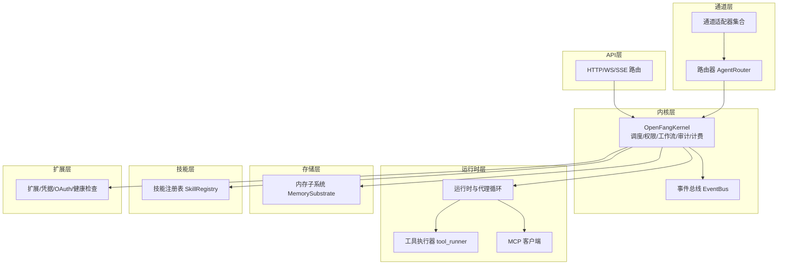
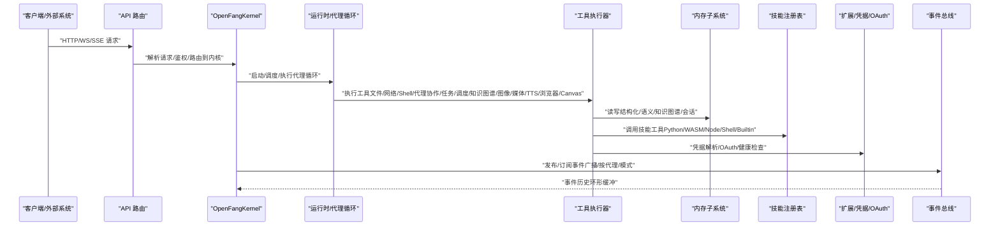
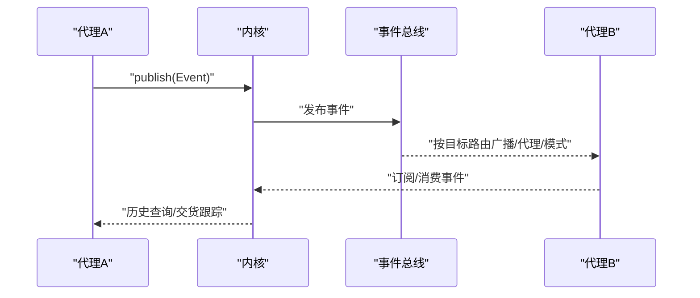
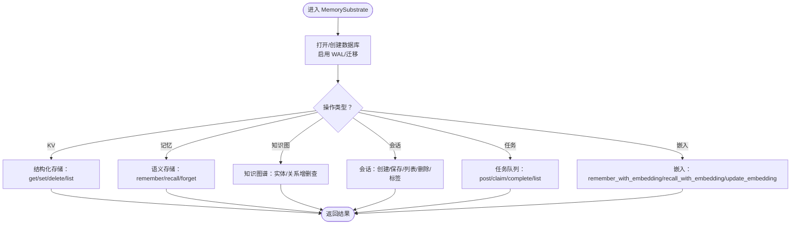
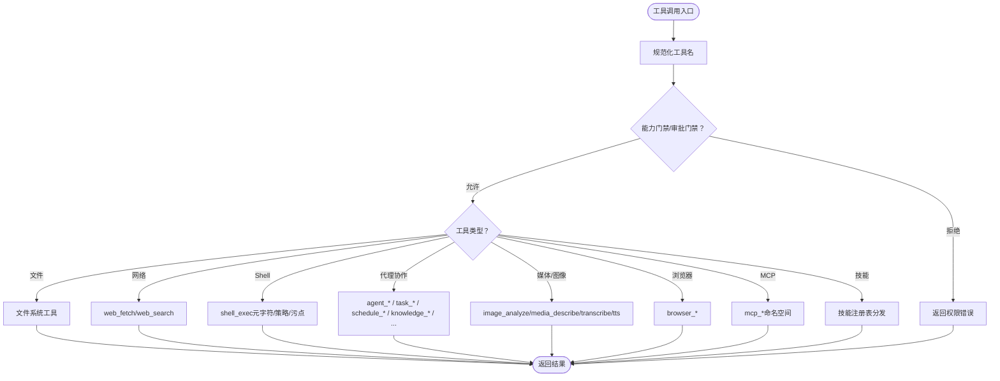
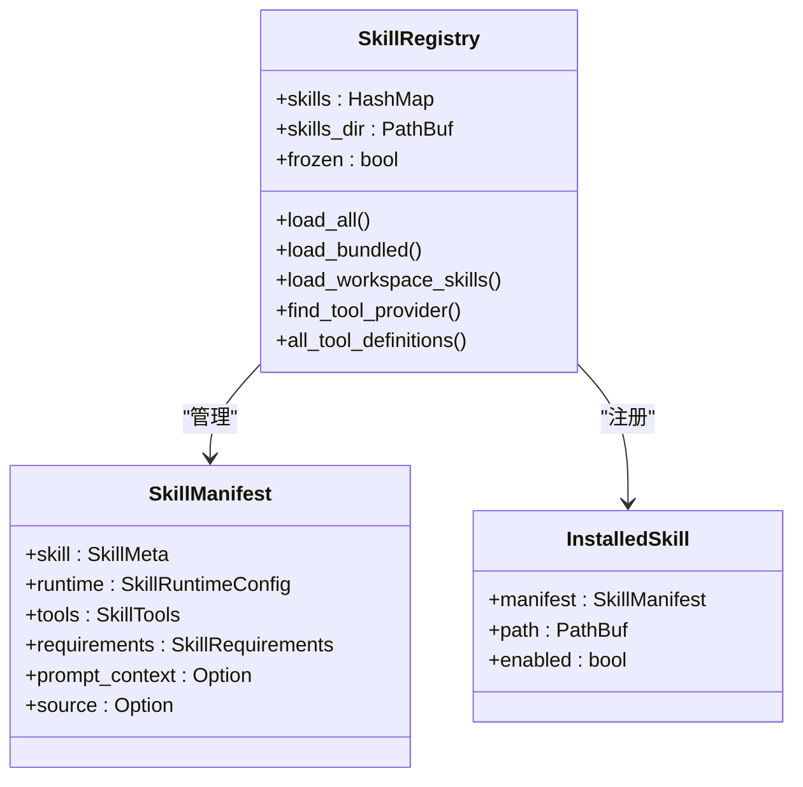
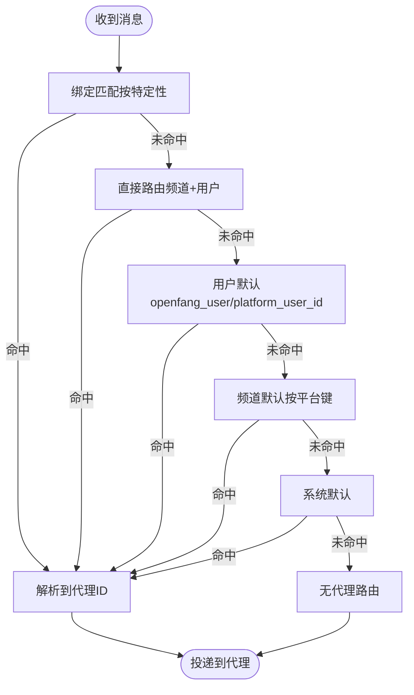
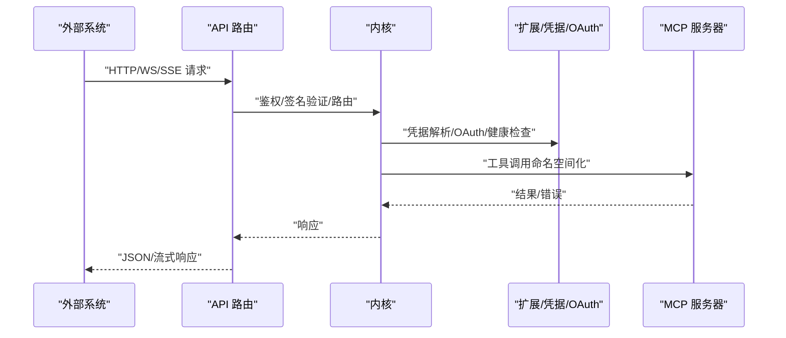
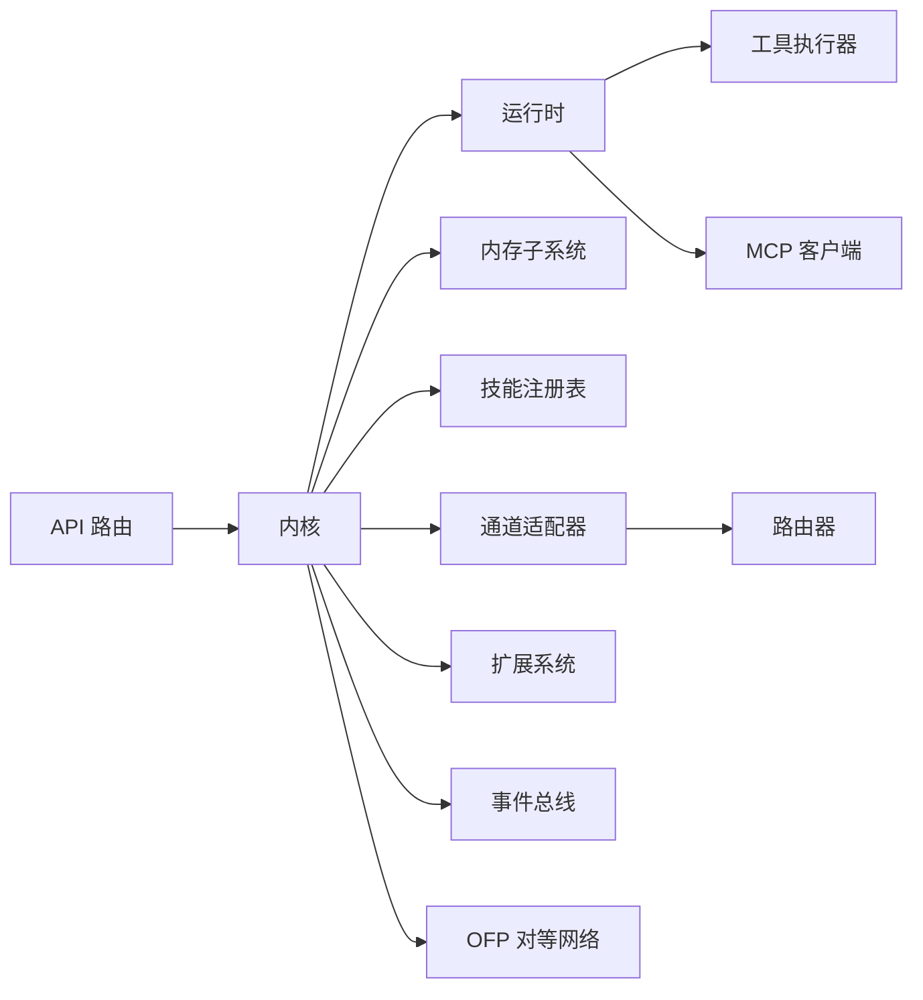

# 集成模式

<cite>
**本文引用的文件**
- [README.md](file://README.md)
- [crates/openfang-kernel/src/lib.rs](file://crates/openfang-kernel/src/lib.rs)
- [crates/openfang-kernel/src/event_bus.rs](file://crates/openfang-kernel/src/event_bus.rs)
- [crates/openfang-kernel/src/kernel.rs](file://crates/openfang-kernel/src/kernel.rs)
- [crates/openfang-runtime/src/lib.rs](file://crates/openfang-runtime/src/lib.rs)
- [crates/openfang-runtime/src/tool_runner.rs](file://crates/openfang-runtime/src/tool_runner.rs)
- [crates/openfang-runtime/src/mcp.rs](file://crates/openfang-runtime/src/mcp.rs)
- [crates/openfang-memory/src/lib.rs](file://crates/openfang-memory/src/lib.rs)
- [crates/openfang-memory/src/substrate.rs](file://crates/openfang-memory/src/substrate.rs)
- [crates/openfang-skills/src/lib.rs](file://crates/openfang-skills/src/lib.rs)
- [crates/openfang-skills/src/registry.rs](file://crates/openfang-skills/src/registry.rs)
- [crates/openfang-channels/src/lib.rs](file://crates/openfang-channels/src/lib.rs)
- [crates/openfang-channels/src/router.rs](file://crates/openfang-channels/src/router.rs)
- [crates/openfang-api/src/lib.rs](file://crates/openfang-api/src/lib.rs)
- [crates/openfang-api/src/routes.rs](file://crates/openfang-api/src/routes.rs)
- [crates/openfang-wire/src/lib.rs](file://crates/openfang-wire/src/lib.rs)
- [crates/openfang-extensions/src/lib.rs](file://crates/openfang-extensions/src/lib.rs)
- [crates/openfang-types/src/lib.rs](file://crates/openfang-types/src/lib.rs)
</cite>

## 目录
1. [简介](#简介)
2. [项目结构](#项目结构)
3. [核心组件](#核心组件)
4. [架构总览](#架构总览)
5. [详细组件分析](#详细组件分析)
6. [依赖关系分析](#依赖关系分析)
7. [性能考量](#性能考量)
8. [故障排查指南](#故障排查指南)
9. [结论](#结论)
10. [附录](#附录)

## 简介
本指南面向希望在 OpenFang 中进行“智能体集成”的工程师与架构师，系统阐述以下主题：
- 智能体与核心系统的集成方式：内核交互模式、内存系统集成、工具系统使用、技能系统扩展
- 智能体间通信机制：事件总线使用、消息传递协议、状态同步策略、冲突解决机制
- 与外部系统的集成模式：API 接口调用、数据同步策略、第三方服务集成、安全认证机制
- 具体集成示例：数据库连接、文件系统操作、网络请求处理、外部服务调用
- 集成测试方法：模拟环境搭建、测试数据准备、集成验证流程、故障排查技巧
- 扩展性设计：插件系统使用、自定义组件开发、向后兼容性保证

## 项目结构
OpenFang 采用多 crate 的模块化设计，围绕“内核（kernel）+ 运行时（runtime）+ 外部适配器（channels/memory/skills/…）”构建：
- 内核层：统一编排、调度、权限、工作流、审计、计费、触发器、后台执行等
- 运行时层：代理循环、LLM 驱动抽象、工具执行、WASM 沙箱、MCP/A2A 等
- 存储层：统一内存子系统（结构化/语义/知识图谱/会话）
- 技能层：可插拔工具包注册与加载
- 通道层：40+ 消息平台适配器
- API 层：HTTP/WS/SSE 对接内核与运行时
- 扩展层：MCP 模板、凭据库、OAuth、健康检查、安装器
- 类型层：跨模块共享的数据结构与协议

图表来源
- [crates/openfang-kernel/src/kernel.rs:60-164](file://crates/openfang-kernel/src/kernel.rs#L60-L164)
- [crates/openfang-kernel/src/event_bus.rs:15-22](file://crates/openfang-kernel/src/event_bus.rs#L15-L22)
- [crates/openfang-runtime/src/tool_runner.rs:99-526](file://crates/openfang-runtime/src/tool_runner.rs#L99-L526)
- [crates/openfang-runtime/src/mcp.rs:126-200](file://crates/openfang-runtime/src/mcp.rs#L126-L200)
- [crates/openfang-memory/src/substrate.rs:28-36](file://crates/openfang-memory/src/substrate.rs#L28-L36)
- [crates/openfang-skills/src/registry.rs:12-20](file://crates/openfang-skills/src/registry.rs#L12-L20)
- [crates/openfang-channels/src/router.rs:28-45](file://crates/openfang-channels/src/router.rs#L28-L45)
- [crates/openfang-api/src/routes.rs:25-43](file://crates/openfang-api/src/routes.rs#L25-L43)
- [crates/openfang-extensions/src/lib.rs:10-16](file://crates/openfang-extensions/src/lib.rs#L10-L16)

章节来源
- [README.md:231-250](file://README.md#L231-L250)

## 核心组件
- 内核（OpenFangKernel）：聚合所有子系统，提供统一入口；负责代理生命周期、调度、权限、工作流、审计、计费、触发器、后台任务、A2A、MCP 工具缓存、浏览器/媒体/TTS 引擎、配对管理、嵌入驱动、手（Hands）注册表、扩展/凭据/OAuth/健康监控、交货跟踪、Cron、审批、绑定、自动回复、钩子、进程管理、OFP 对等节点等。
- 事件总线（EventBus）：支持广播、按代理订阅、模式匹配、历史环形缓冲；用于跨代理与系统通信。
- 内存子系统（MemorySubstrate）：统一结构化/语义/知识图谱/会话/使用量 API，封装 SQLite 后端与迁移。
- 工具执行器（tool_runner）：内置文件/网络/Shell/代理协作/任务/调度/知识图谱/图像/媒体理解/图片生成/TTS/浏览器/Canvas 等工具；支持能力门禁、审批、污点检测、执行策略。
- 技能注册表（SkillRegistry）：加载/校验/覆盖/冻结/工作区技能；提供工具定义与分发。
- 通道与路由（channels/router）：40+ 平台适配器；基于绑定规则、直接路由、用户默认、频道默认、系统默认的优先级路由。
- API 路由（API routes）：以 HTTP/WS/SSE 暴露内核能力；持有内核、桥接管理器、通道配置、优雅关闭通知、ClawHub 缓存、提供商探测缓存。
- 扩展系统（Extensions）：MCP 模板、凭据加密存储、OAuth PKCE、健康监控、安装器。

章节来源
- [crates/openfang-kernel/src/kernel.rs:60-164](file://crates/openfang-kernel/src/kernel.rs#L60-L164)
- [crates/openfang-kernel/src/event_bus.rs:15-99](file://crates/openfang-kernel/src/event_bus.rs#L15-L99)
- [crates/openfang-memory/src/substrate.rs:28-76](file://crates/openfang-memory/src/substrate.rs#L28-L76)
- [crates/openfang-runtime/src/tool_runner.rs:99-526](file://crates/openfang-runtime/src/tool_runner.rs#L99-L526)
- [crates/openfang-skills/src/registry.rs:12-54](file://crates/openfang-skills/src/registry.rs#L12-L54)
- [crates/openfang-channels/src/router.rs:28-131](file://crates/openfang-channels/src/router.rs#L28-L131)
- [crates/openfang-api/src/routes.rs:25-43](file://crates/openfang-api/src/routes.rs#L25-L43)
- [crates/openfang-extensions/src/lib.rs:10-16](file://crates/openfang-extensions/src/lib.rs#L10-L16)

## 架构总览
下图展示 OpenFang 的核心集成路径：API 层对接内核；内核协调运行时、内存、技能、通道与扩展；运行时通过工具执行器与 MCP 客户端访问外部系统；事件总线支撑跨代理通信。

图表来源
- [crates/openfang-api/src/routes.rs:25-43](file://crates/openfang-api/src/routes.rs#L25-L43)
- [crates/openfang-kernel/src/kernel.rs:60-164](file://crates/openfang-kernel/src/kernel.rs#L60-L164)
- [crates/openfang-runtime/src/tool_runner.rs:99-526](file://crates/openfang-runtime/src/tool_runner.rs#L99-L526)
- [crates/openfang-memory/src/substrate.rs:28-36](file://crates/openfang-memory/src/substrate.rs#L28-L36)
- [crates/openfang-skills/src/registry.rs:12-20](file://crates/openfang-skills/src/registry.rs#L12-L20)
- [crates/openfang-extensions/src/lib.rs:10-16](file://crates/openfang-extensions/src/lib.rs#L10-L16)
- [crates/openfang-kernel/src/event_bus.rs:15-99](file://crates/openfang-kernel/src/event_bus.rs#L15-L99)

## 详细组件分析

### 组件A：内核交互模式与事件总线
- 内核交互模式
  - 通过 OpenFangKernel 提供统一入口，运行时以 KernelHandle 形式调用内核能力（如代理发送、任务队列、事件发布、计划任务、知识图谱、浏览器、A2A 等）。
  - 事件总线支持广播、按代理订阅、模式匹配与历史环形缓冲，满足跨代理通信与可观测性需求。
- 事件总线使用
  - 发布：根据目标类型（系统/广播/代理/模式）路由事件，并持久化到历史缓冲。
  - 订阅：按代理或全量订阅；历史查询支持最近事件回放。
  - 历史容量上限与逐出策略避免无限增长。
- 状态同步与冲突解决
  - 通过事件总线进行状态广播；结合交货跟踪（DeliveryTracker）与通道适配器的交收回执，实现消息交付确认与去重。
  - 代理消息锁（agent_msg_locks）串行化同一代理的并发 LLM 调用，避免会话状态竞争。

图表来源
- [crates/openfang-kernel/src/event_bus.rs:35-98](file://crates/openfang-kernel/src/event_bus.rs#L35-L98)
- [crates/openfang-kernel/src/kernel.rs:166-200](file://crates/openfang-kernel/src/kernel.rs#L166-L200)

章节来源
- [crates/openfang-kernel/src/event_bus.rs:15-99](file://crates/openfang-kernel/src/event_bus.rs#L15-L99)
- [crates/openfang-kernel/src/kernel.rs:166-200](file://crates/openfang-kernel/src/kernel.rs#L166-L200)

### 组件B：内存系统集成
- 统一抽象
  - MemorySubstrate 实现 Memory trait，组合结构化存储、语义存储、知识图谱、会话与使用量统计。
- 数据库与迁移
  - 使用 SQLite，启用 WAL 模式与忙等待超时；启动时执行迁移。
- 会话与跨渠道记忆
  - 支持创建/保存/列出/删除会话；跨渠道会话上下文压缩与摘要存储；支持 JSONL 镜像导出。
- 任务队列
  - 提供任务发布、认领、完成、列表等操作，支持优先级与分配策略。
- 嵌入与向量检索
  - 支持带嵌入的记忆存储与召回；异步阻塞包装以避免阻塞 Tokio 运行时。

图表来源
- [crates/openfang-memory/src/substrate.rs:38-569](file://crates/openfang-memory/src/substrate.rs#L38-L569)

章节来源
- [crates/openfang-memory/src/lib.rs:1-20](file://crates/openfang-memory/src/lib.rs#L1-L20)
- [crates/openfang-memory/src/substrate.rs:38-569](file://crates/openfang-memory/src/substrate.rs#L38-L569)

### 组件C：工具系统使用
- 工具分类
  - 文件系统：读取/写入/列举/补丁应用
  - 网络：受 SSRF 保护的抓取与多提供商搜索
  - Shell：元字符注入检测、执行策略、污点检测
  - 代理协作：发送消息、派生、列表、终止、查找、任务队列、事件发布、计划任务、知识图谱、图像分析、媒体理解、图片生成、TTS/STT、Docker 执行、位置与时钟、Cron、通道发送、持久化进程、手（Hands）控制、A2A 出站
  - 技能工具：通过技能注册表动态发现与执行
  - MCP 工具：命名空间化工具名，按服务器连接调用
- 安全与合规
  - 能力门禁（allowed_tools）、审批门禁（requires_approval）、污点追踪（TaintSink）、执行策略（exec_policy）、Shell 元字符与启发式检测、URL 秘密泄露检测
- 性能与并发
  - 任务本地上下文跟踪调用深度，限制递归；阻塞式数据库/向量操作在独立任务中执行，避免阻塞事件循环

图表来源
- [crates/openfang-runtime/src/tool_runner.rs:99-526](file://crates/openfang-runtime/src/tool_runner.rs#L99-L526)
- [crates/openfang-runtime/src/mcp.rs:126-200](file://crates/openfang-runtime/src/mcp.rs#L126-L200)
- [crates/openfang-skills/src/registry.rs:273-283](file://crates/openfang-skills/src/registry.rs#L273-L283)

章节来源
- [crates/openfang-runtime/src/tool_runner.rs:99-526](file://crates/openfang-runtime/src/tool_runner.rs#L99-L526)
- [crates/openfang-runtime/src/mcp.rs:126-200](file://crates/openfang-runtime/src/mcp.rs#L126-L200)
- [crates/openfang-skills/src/registry.rs:273-283](file://crates/openfang-skills/src/registry.rs#L273-L283)

### 组件D：技能系统扩展
- 技能清单与来源
  - 支持原生、打包、OpenClaw 转换、ClawHub 下载；提供来源追踪（SkillSource）
- 运行时类型
  - Python/WASM/Node/Shell/Builtin/PromptOnly；不同运行时对应不同执行路径
- 注册与发现
  - SkillRegistry 加载/覆盖/冻结；工作区技能覆盖全局；按工具名查找提供者
- 安全扫描
  - 自动转换 SKILL.md 时进行提示词注入扫描，阻止高危模式

图表来源
- [crates/openfang-skills/src/lib.rs:104-179](file://crates/openfang-skills/src/lib.rs#L104-L179)
- [crates/openfang-skills/src/registry.rs:12-54](file://crates/openfang-skills/src/registry.rs#L12-L54)

章节来源
- [crates/openfang-skills/src/lib.rs:104-179](file://crates/openfang-skills/src/lib.rs#L104-L179)
- [crates/openfang-skills/src/registry.rs:106-196](file://crates/openfang-skills/src/registry.rs#L106-L196)

### 组件E：通道与路由
- 通道适配器
  - 40+ 平台适配器（Telegram/Discord/Slack/WhatsApp/Signal/Matrix/Email/Teams/Mattermost/Webex/企业微信/飞书/Bluesky/Reddit/LinkedIn/Twitch/IRC/XMPP/Guilded/Keybase/Discourse/Gitter/隐私类/社区类/工具体/工作流等），统一输出格式与速率限制
- 路由策略
  - 绑定（最具体）> 直接路由 > 用户默认 > 频道默认 > 系统默认；支持广播策略与并行投递
- 绑定规则
  - 支持频道、账号、用户、公会、角色等多维匹配；按特定性排序，确保更精确规则优先

图表来源
- [crates/openfang-channels/src/router.rs:141-187](file://crates/openfang-channels/src/router.rs#L141-L187)

章节来源
- [crates/openfang-channels/src/lib.rs:1-55](file://crates/openfang-channels/src/lib.rs#L1-L55)
- [crates/openfang-channels/src/router.rs:141-187](file://crates/openfang-channels/src/router.rs#L141-L187)

### 组件F：API 接口与外部系统集成
- API 路由
  - 暴露代理管理、状态、聊天、工作流、通道、模型、技能、A2A、Hands 等 140+ 接口；支持 OpenAI 兼容路径
- 安全与认证
  - Ed25519 签名校验、签名验证失败审计日志、速率限制、会话认证中间件
- 外部系统集成
  - MCP 服务器（标准输入/HTTP+SSE）；扩展模板（GitHub/Slack 等）；凭据加密存储；OAuth2 PKCE；健康监控与自动重连
- 数据同步策略
  - 提供商健康探测缓存（避免阻塞）；ClawHub 响应缓存（防刷新抖动）；通道适配器交货跟踪

图表来源
- [crates/openfang-api/src/routes.rs:46-168](file://crates/openfang-api/src/routes.rs#L46-L168)
- [crates/openfang-extensions/src/lib.rs:146-239](file://crates/openfang-extensions/src/lib.rs#L146-L239)
- [crates/openfang-runtime/src/mcp.rs:126-200](file://crates/openfang-runtime/src/mcp.rs#L126-L200)

章节来源
- [crates/openfang-api/src/lib.rs:1-18](file://crates/openfang-api/src/lib.rs#L1-L18)
- [crates/openfang-api/src/routes.rs:25-43](file://crates/openfang-api/src/routes.rs#L25-L43)
- [crates/openfang-extensions/src/lib.rs:146-239](file://crates/openfang-extensions/src/lib.rs#L146-L239)

### 组件G：OFP（跨实例智能体通信）
- 协议与节点
  - 基于 JSON-RPC 的 TCP 协议；本地监听节点 PeerNode；远端代理注册 PeerRegistry；消息 WireMessage
- 用途
  - 跨机器/实例的代理发现、认证与通信；配合 A2A 工具实现跨实例协作

章节来源
- [crates/openfang-wire/src/lib.rs:1-20](file://crates/openfang-wire/src/lib.rs#L1-L20)

## 依赖关系分析
- 内核对运行时、内存、技能、通道、扩展的依赖是中心化的；运行时对工具执行器、MCP、浏览器/媒体/TTS、嵌入驱动有直接依赖；API 路由持有内核与桥接管理器；事件总线被内核与运行时广泛使用。
- 技能注册表与工具执行器形成“声明-执行”闭环；MCP 与扩展模板共同扩展工具生态。
- 通道路由与交货跟踪保障消息可靠投递与去重。

图表来源
- [crates/openfang-api/src/routes.rs:25-43](file://crates/openfang-api/src/routes.rs#L25-L43)
- [crates/openfang-kernel/src/kernel.rs:60-164](file://crates/openfang-kernel/src/kernel.rs#L60-L164)
- [crates/openfang-runtime/src/tool_runner.rs:99-526](file://crates/openfang-runtime/src/tool_runner.rs#L99-L526)
- [crates/openfang-runtime/src/mcp.rs:126-200](file://crates/openfang-runtime/src/mcp.rs#L126-L200)
- [crates/openfang-memory/src/substrate.rs:28-36](file://crates/openfang-memory/src/substrate.rs#L28-L36)
- [crates/openfang-skills/src/registry.rs:12-20](file://crates/openfang-skills/src/registry.rs#L12-L20)
- [crates/openfang-channels/src/router.rs:28-45](file://crates/openfang-channels/src/router.rs#L28-L45)
- [crates/openfang-wire/src/lib.rs:1-20](file://crates/openfang-wire/src/lib.rs#L1-L20)

章节来源
- [crates/openfang-kernel/src/lib.rs:1-30](file://crates/openfang-kernel/src/lib.rs#L1-L30)
- [crates/openfang-runtime/src/lib.rs:1-59](file://crates/openfang-runtime/src/lib.rs#L1-L59)
- [crates/openfang-memory/src/lib.rs:1-20](file://crates/openfang-memory/src/lib.rs#L1-L20)
- [crates/openfang-skills/src/lib.rs:1-255](file://crates/openfang-skills/src/lib.rs#L1-L255)
- [crates/openfang-channels/src/lib.rs:1-55](file://crates/openfang-channels/src/lib.rs#L1-L55)
- [crates/openfang-api/src/lib.rs:1-18](file://crates/openfang-api/src/lib.rs#L1-L18)
- [crates/openfang-wire/src/lib.rs:1-20](file://crates/openfang-wire/src/lib.rs#L1-L20)

## 性能考量
- 数据库与并发
  - SQLite WAL 模式与忙等待超时提升并发；内存子系统对阻塞操作使用 tokio::task::spawn_blocking
  - 事件总线历史缓冲容量限制与逐出策略
- 工具执行
  - Shell 元字符检测与执行策略在安全与可用性之间平衡；网络工具 SSRF 保护与速率限制
- API 与外部系统
  - 提供商健康探测缓存与 ClawHub 响应缓存降低外部依赖抖动
- 跨实例通信
  - OFP 使用互信认证与 JSON-RPC，避免额外协议开销

## 故障排查指南
- 事件总线
  - 检查历史缓冲是否溢出；确认订阅目标类型（系统/广播/代理/模式）是否正确
- 内存子系统
  - 关注迁移失败、WAL/忙等待配置；任务队列状态（pending/in_progress/completed）核对
- 工具执行
  - 能力门禁/审批门禁导致的拒绝；Shell 元字符/策略/污点检测触发的阻断；网络 URL 秘密泄露检测
- 技能系统
  - 冻结模式阻止动态加载；提示词注入扫描告警；OpenClaw 转换失败
- 通道与路由
  - 绑定规则特定性不足；直接路由/用户默认/频道默认缺失；广播路由配置错误
- API 与扩展
  - 签名验证失败审计日志；MCP 连接初始化/工具发现失败；凭据未配置/OAuth 回调异常
- OFP
  - 互信认证失败；远端节点不可达；消息帧格式错误

章节来源
- [crates/openfang-kernel/src/event_bus.rs:107-149](file://crates/openfang-kernel/src/event_bus.rs#L107-L149)
- [crates/openfang-memory/src/substrate.rs:569-777](file://crates/openfang-memory/src/substrate.rs#L569-L777)
- [crates/openfang-runtime/src/tool_runner.rs:27-75](file://crates/openfang-runtime/src/tool_runner.rs#L27-L75)
- [crates/openfang-skills/src/registry.rs:44-54](file://crates/openfang-skills/src/registry.rs#L44-L54)
- [crates/openfang-channels/src/router.rs:289-340](file://crates/openfang-channels/src/router.rs#L289-L340)
- [crates/openfang-api/src/routes.rs:104-132](file://crates/openfang-api/src/routes.rs#L104-L132)
- [crates/openfang-runtime/src/mcp.rs:126-200](file://crates/openfang-runtime/src/mcp.rs#L126-L200)
- [crates/openfang-wire/src/lib.rs:1-20](file://crates/openfang-wire/src/lib.rs#L1-L20)

## 结论
OpenFang 通过“内核 + 运行时 + 统一内存 + 技能 + 通道 + API + 扩展 + 事件总线 + OFP”的架构，提供了高度模块化、安全可控且可扩展的智能体操作系统。集成时建议：
- 明确工具与技能边界，优先使用内置工具与能力门禁
- 利用事件总线与路由策略实现跨代理协作与消息可靠投递
- 通过扩展与 MCP 模板接入第三方服务，结合凭据库与 OAuth 提升安全性
- 使用内存子系统的统一 API 与任务队列保障状态一致性与可恢复性
- 在生产中启用审计、计费与健康监控，持续优化性能与稳定性

## 附录
- 快速开始与文档链接参见根目录 README
- 类型与共享结构位于 openfang-types

章节来源
- [README.md:389-404](file://README.md#L389-L404)
- [crates/openfang-types/src/lib.rs:25-35](file://crates/openfang-types/src/lib.rs#L25-L35)