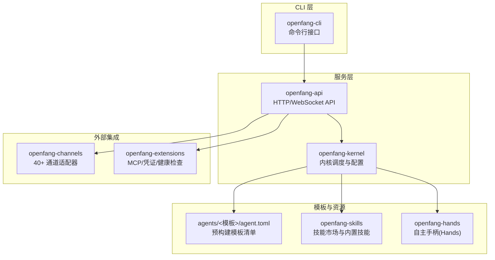
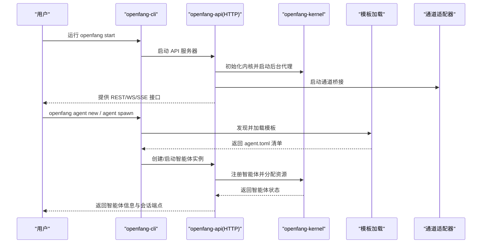
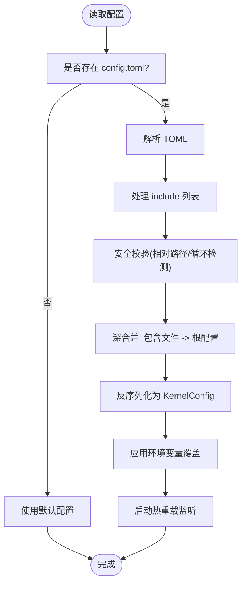
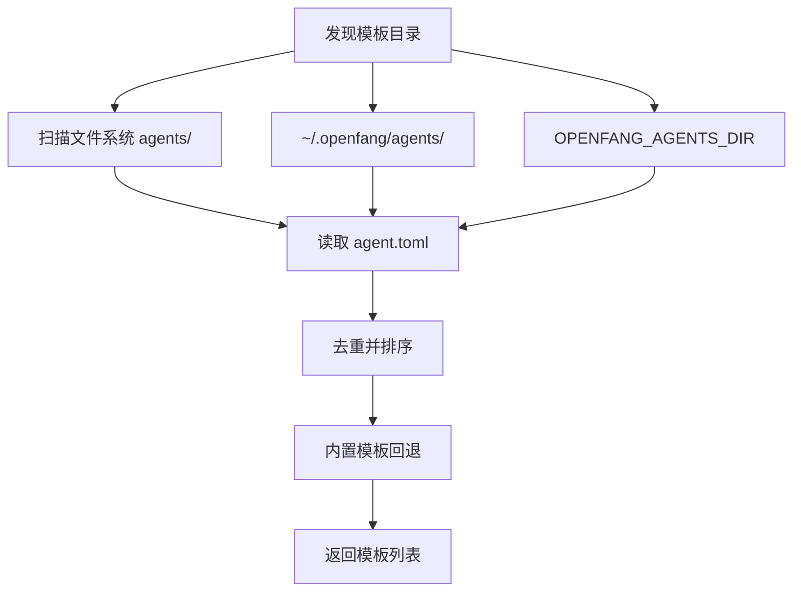
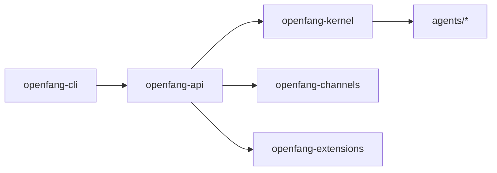

# 模板使用指南

<cite>
**本文档引用的文件**
- [README.md](file://README.md)
- [openfang.toml.example](file://openfang.toml.example)
- [crates/openfang-cli/src/main.rs](file://crates/openfang-cli/src/main.rs)
- [crates/openfang-cli/src/templates.rs](file://crates/openfang-cli/src/templates.rs)
- [crates/openfang-cli/src/launcher.rs](file://crates/openfang-cli/src/launcher.rs)
- [crates/openfang-api/src/server.rs](file://crates/openfang-api/src/server.rs)
- [crates/openfang-kernel/src/config.rs](file://crates/openfang-kernel/src/config.rs)
- [crates/openfang-kernel/src/lib.rs](file://crates/openfang-kernel/src/lib.rs)
- [agents/analyst/agent.toml](file://agents/analyst/agent.toml)
</cite>

## 目录
1. [简介](#简介)
2. [项目结构](#项目结构)
3. [核心组件](#核心组件)
4. [架构总览](#架构总览)
5. [详细组件分析](#详细组件分析)
6. [依赖关系分析](#依赖关系分析)
7. [性能考虑](#性能考虑)
8. [故障排除指南](#故障排除指南)
9. [结论](#结论)
10. [附录](#附录)

## 简介
本指南面向希望使用 OpenFang 预构建智能体模板的用户，提供从零开始的完整使用路径：包括命令行启动、API 调用、配置文件定制；解释参数覆盖机制、环境变量设置与配置文件优先级；给出模板定制技巧（技能添加、工具配置、行为调整）；并提供常见使用场景示例、最佳实践与性能优化建议，以及调试与排错方法。

## 项目结构
OpenFang 采用多 Crate 的模块化设计，核心能力通过内核、运行时、API、通道适配器等模块协同实现。预构建智能体模板位于 agents 目录下，每个模板由 agent.toml 描述清单与相关资源组成。

图表来源
- [crates/openfang-cli/src/main.rs:87-294](file://crates/openfang-cli/src/main.rs#L87-L294)
- [crates/openfang-api/src/server.rs:30-712](file://crates/openfang-api/src/server.rs#L30-L712)
- [crates/openfang-kernel/src/lib.rs:1-30](file://crates/openfang-kernel/src/lib.rs#L1-L30)

章节来源
- [README.md: 231-250:231-250](file://README.md#L231-L250)

## 核心组件
- 预构建智能体模板：位于 agents/<name>/agent.toml，定义模型、系统提示、工具能力、网络与内存权限等。
- CLI：提供初始化、启动、聊天、代理管理、配置查看与编辑、技能安装、通道配置等功能。
- API 服务器：提供 140+ REST/WS/SSE 端点，支持 OpenAI 兼容接口、仪表盘、会话管理、工作流、触发器、预算与用量统计等。
- 内核配置：支持 config.toml 加载、包含文件合并、热重载、环境变量与默认值处理。
- 通道适配器：支持 40+ 平台，含速率限制、DM/群组策略、输出格式化。
- 扩展与安全：MCP 服务器、凭证保险库、健康检查、审计链、GCRA 限流等。

章节来源
- [crates/openfang-cli/src/main.rs: 107-294:107-294](file://crates/openfang-cli/src/main.rs#L107-L294)
- [crates/openfang-api/src/server.rs: 30-712:30-712](file://crates/openfang-api/src/server.rs#L30-L712)
- [crates/openfang-kernel/src/config.rs: 14-110:14-110](file://crates/openfang-kernel/src/config.rs#L14-L110)

## 架构总览
OpenFang 的启动与交互流程如下：

图表来源
- [crates/openfang-cli/src/main.rs: 107-294:107-294](file://crates/openfang-cli/src/main.rs#L107-L294)
- [crates/openfang-api/src/server.rs: 714-800:714-800](file://crates/openfang-api/src/server.rs#L714-L800)
- [crates/openfang-cli/src/templates.rs: 64-111:64-111](file://crates/openfang-cli/src/templates.rs#L64-L111)

## 详细组件分析

### 启动方式与入口
- 命令行启动
  - 初始化：openfang init（可快速模式）
  - 启动守护进程：openfang start
  - 交互式终端仪表盘：openfang tui
  - 快速聊天：openfang chat
- API 接口调用
  - 仪表盘：http://localhost:4200
  - OpenAI 兼容接口：/v1/chat/completions
  - REST 端点：/api/agents、/api/agents/{id}/message、/api/agents/{id}/ws 等
- 配置文件定制
  - 默认位置：~/.openfang/config.toml
  - 示例配置：openfang.toml.example
  - 支持 include 文件合并、热重载、环境变量覆盖

章节来源
- [README.md: 407-431:407-431](file://README.md#L407-L431)
- [crates/openfang-api/src/server.rs: 682-696:682-696](file://crates/openfang-api/src/server.rs#L682-L696)
- [crates/openfang-kernel/src/config.rs: 14-110:14-110](file://crates/openfang-kernel/src/config.rs#L14-L110)

### 参数覆盖机制与配置优先级
- 配置文件优先级（根配置覆盖包含文件）
  - include 列表按顺序深合并，根配置最终覆盖合并结果
  - 支持相对路径包含，拒绝绝对路径、路径穿越与循环包含
- 环境变量与默认值
  - OPENFANG_HOME 控制配置目录
  - OPENFANG_AGENTS_DIR 可指定额外模板目录
  - 模型与密钥可通过环境变量注入
- CLI 与 API 的参数传递
  - CLI 子命令用于管理与交互
  - API 提供细粒度控制（模型切换、工具启用、会话管理）

图表来源
- [crates/openfang-kernel/src/config.rs: 112-224:112-224](file://crates/openfang-kernel/src/config.rs#L112-L224)
- [crates/openfang-kernel/src/config.rs: 245-262:245-262](file://crates/openfang-kernel/src/config.rs#L245-L262)

章节来源
- [crates/openfang-kernel/src/config.rs: 14-110:14-110](file://crates/openfang-kernel/src/config.rs#L14-L110)
- [crates/openfang-cli/src/templates.rs: 15-62:15-62](file://crates/openfang-cli/src/templates.rs#L15-L62)

### 模板发现与加载
- 模板来源
  - 开发仓库 agents/ 目录
  - ~/.openfang/agents/ 已安装模板
  - OPENFANG_AGENTS_DIR 环境变量指定的自定义目录
- 加载逻辑
  - 从多个目录扫描 agent.toml
  - 提取描述字段用于展示
  - 未找到时回退到内置模板

图表来源
- [crates/openfang-cli/src/templates.rs: 15-111:15-111](file://crates/openfang-cli/src/templates.rs#L15-L111)

章节来源
- [crates/openfang-cli/src/templates.rs: 15-111:15-111](file://crates/openfang-cli/src/templates.rs#L15-L111)

### 智能体清单与能力声明
- 清单字段示例（节选）
  - 名称、版本、描述、作者、模块
  - 模型选择与备用模型
  - 系统提示与资源上限
  - 能力声明：工具、网络、内存与 Shell 权限
- 定制要点
  - 通过 tools 列表启用所需工具
  - 通过 network/memory/shell 精准授权
  - 通过 fallback_models 提升可用性

章节来源
- [agents/analyst/agent.toml: 1-50:1-50](file://agents/analyst/agent.toml#L1-L50)

### 常见使用场景与示例
- 快速启动与聊天
  - 初始化后启动守护进程，打开仪表盘或使用 openfang chat
- 从模板创建智能体
  - openfang agent new coder 或 openfang agent spawn <manifest>
- 使用 OpenAI 兼容接口
  - POST /v1/chat/completions，传入 model 与 messages
- 配置通道与集成
  - openfang channel setup 交互式配置
  - openfang integrations 列表与安装

章节来源
- [README.md: 407-431:407-431](file://README.md#L407-L431)
- [crates/openfang-api/src/server.rs: 682-696:682-696](file://crates/openfang-api/src/server.rs#L682-L696)

### 最佳实践与性能优化
- 配置层面
  - 将常用配置拆分为 include 文件，便于团队共享与分环境管理
  - 使用 OPENFANG_HOME 统一多环境配置目录
  - 合理设置 log_level 与 usage_footer，平衡可观测性与开销
- 模型与成本
  - 为高负载场景配置 fallback_models，提升可用性
  - 使用 /api/budget 与 /api/usage 监控成本与令牌消耗
- 通道与限流
  - 为各通道设置合理的速率限制与输出格式
  - 使用 /api/channels/reload 在不重启的情况下更新配置
- 安全与审计
  - 启用 api_key 或会话认证，限制 CORS 源
  - 定期检查 /api/audit/recent 与 /api/audit/verify

章节来源
- [openfang.toml.example: 1-49:1-49](file://openfang.toml.example#L1-L49)
- [crates/openfang-api/src/server.rs: 56-104:56-104](file://crates/openfang-api/src/server.rs#L56-L104)

## 依赖关系分析
- CLI 依赖 API 与内核进行交互
- API 依赖内核执行智能体生命周期管理、会话与工具调用
- 模板系统依赖 CLI 的模板发现与加载逻辑
- 通道适配器与扩展通过 API 暴露统一接口

图表来源
- [crates/openfang-cli/src/main.rs: 16-24:16-24](file://crates/openfang-cli/src/main.rs#L16-L24)
- [crates/openfang-api/src/server.rs: 30-712:30-712](file://crates/openfang-api/src/server.rs#L30-L712)
- [crates/openfang-kernel/src/lib.rs: 1-L30:1-30](file://crates/openfang-kernel/src/lib.rs#L1-L30)

章节来源
- [crates/openfang-cli/src/main.rs: 16-24:16-24](file://crates/openfang-cli/src/main.rs#L16-L24)
- [crates/openfang-api/src/server.rs: 30-712:30-712](file://crates/openfang-api/src/server.rs#L30-L712)

## 性能考虑
- 冷启动时间：系统强调低冷启动与高效内存占用，适合长期运行的自治代理
- 会话压缩与上下文管理：通过 /api/agents/{id}/session/compact 控制上下文长度
- 限流与并发：GCRA 限流器保护 API，通道适配器内置速率限制
- 日志与可观测性：合理设置 log_level，结合 /api/metrics 与 /api/logs/stream

章节来源
- [README.md: 117-186:117-186](file://README.md#L117-L186)
- [crates/openfang-api/src/server.rs: 706-708:706-708](file://crates/openfang-api/src/server.rs#L706-L708)

## 故障排除指南
- 启动失败
  - 检查守护进程是否已在运行（PID 冲突）
  - 查看 /api/health 与 /api/health/detail 获取健康状态
- 配置问题
  - 使用 openfang config show 与 openfang config get/key 测试键值
  - 通过 /api/config/reload 触发热重载
- 模板加载异常
  - 确认 OPENFANG_AGENTS_DIR 是否指向有效目录
  - 检查 agent.toml 语法与必需字段
- 通道连接问题
  - 使用 openfang channel test 与 /api/channels/{name}/test 验证
  - 查看 /api/channels/reload 重新加载配置
- 日志分析
  - openfang logs 或 /api/logs/stream 实时查看
  - 结合 /api/audit/recent 与 /api/audit/verify 进行审计追踪

章节来源
- [crates/openfang-api/src/server.rs: 758-794:758-794](file://crates/openfang-api/src/server.rs#L758-L794)
- [crates/openfang-cli/src/main.rs: 223-231:223-231](file://crates/openfang-cli/src/main.rs#L223-L231)

## 结论
OpenFang 提供了从命令行到 API 的完整使用路径，并通过模板化智能体与强大的内核配置体系，满足从个人助理到企业级自治代理的多样化需求。遵循本文档的启动步骤、配置优先级与定制技巧，可快速搭建稳定、可观测且可扩展的智能体系统。

## 附录
- 快速命令参考
  - 初始化：openfang init
  - 启动：openfang start
  - 仪表盘：openfang dashboard
  - 聊天：openfang chat
  - 模板：openfang agent new / agent spawn
  - 配置：openfang config show/get/set/unset
  - 通道：openfang channel setup/test
  - OpenAI 兼容：/v1/chat/completions
- 配置示例与字段说明
  - 参考 openfang.toml.example 中的 default_model、memory、network、mcp_servers 等段落

章节来源
- [README.md: 407-431:407-431](file://README.md#L407-L431)
- [openfang.toml.example: 1-49:1-49](file://openfang.toml.example#L1-L49)