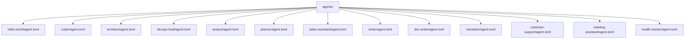
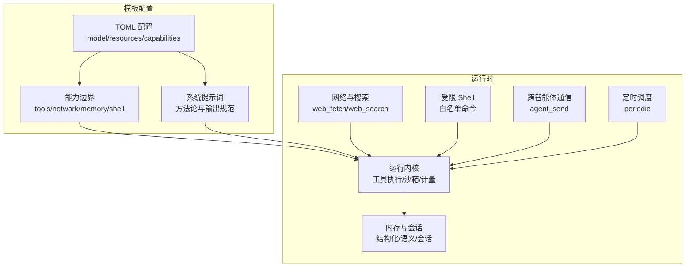
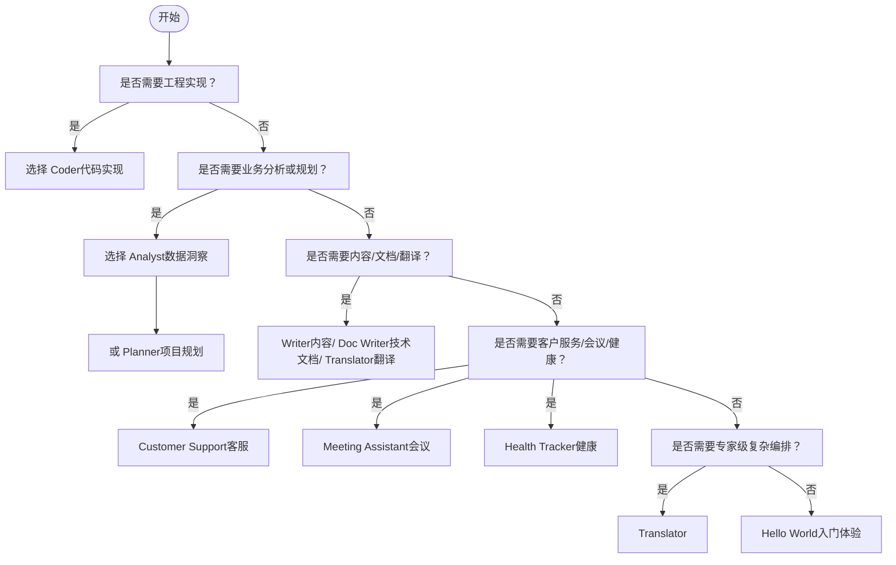
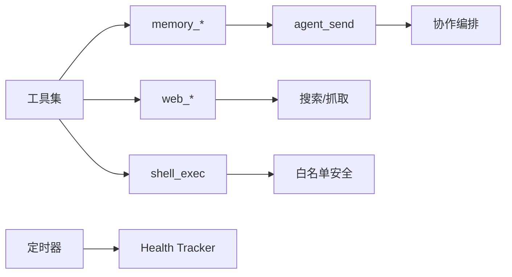

# 模板分类体系

<cite>
**本文引用的文件**
- [README.md](file://README.md)
- [hello-world/agent.toml](file://agents/hello-world/agent.toml)
- [coder/agent.toml](file://agents/coder/agent.toml)
- [architect/agent.toml](file://agents/architect/agent.toml)
- [devops-lead/agent.toml](file://agents/devops-lead/agent.toml)
- [analyst/agent.toml](file://agents/analyst/agent.toml)
- [planner/agent.toml](file://agents/planner/agent.toml)
- [sales-assistant/agent.toml](file://agents/sales-assistant/agent.toml)
- [writer/agent.toml](file://agents/writer/agent.toml)
- [doc-writer/agent.toml](file://agents/doc-writer/agent.toml)
- [translator/agent.toml](file://agents/translator/agent.toml)
- [customer-support/agent.toml](file://agents/customer-support/agent.toml)
- [meeting-assistant/agent.toml](file://agents/meeting-assistant/agent.toml)
- [health-tracker/agent.toml](file://agents/health-tracker/agent.toml)
</cite>

## 目录
1. [简介](#简介)
2. [项目结构](#项目结构)
3. [核心组件](#核心组件)
4. [架构总览](#架构总览)
5. [详细组件分析](#详细组件分析)
6. [依赖关系分析](#依赖关系分析)
7. [性能与成本考量](#性能与成本考量)
8. [故障排查指南](#故障排查指南)
9. [结论](#结论)
10. [附录](#附录)

## 简介
本文件系统化梳理 OpenFang 的智能体模板分类体系，围绕“性能层级”与“专业领域/通用用途”两大维度展开，帮助用户在不同复杂度与业务场景下做出合理选择。OpenFang 提供从入门到专家级的模板，覆盖技术、业务、创作、服务四大专业领域，并提供可复用的通用用途模板，支持组合编排与成本优化。

## 项目结构
OpenFang 将“智能体模板”组织在 agents 目录中，每个模板以独立的配置文件定义能力边界、资源配额、工具集与运行策略。本文聚焦内置模板的 TOML 配置与系统提示词设计，结合 README 中的总体定位，形成模板分类与选型依据。

图示来源
- [README.md:1-521](file://README.md#L1-L521)
- [hello-world/agent.toml:1-30](file://agents/hello-world/agent.toml#L1-L30)
- [coder/agent.toml:1-48](file://agents/coder/agent.toml#L1-L48)
- [architect/agent.toml:1-46](file://agents/architect/agent.toml#L1-L46)
- [devops-lead/agent.toml:1-51](file://agents/devops-lead/agent.toml#L1-L51)
- [analyst/agent.toml:1-50](file://agents/analyst/agent.toml#L1-L50)
- [planner/agent.toml:1-52](file://agents/planner/agent.toml#L1-L52)
- [sales-assistant/agent.toml:1-70](file://agents/sales-assistant/agent.toml#L1-L70)
- [writer/agent.toml:1-45](file://agents/writer/agent.toml#L1-L45)
- [doc-writer/agent.toml:1-47](file://agents/doc-writer/agent.toml#L1-L47)
- [translator/agent.toml:1-66](file://agents/translator/agent.toml#L1-L66)
- [customer-support/agent.toml:1-71](file://agents/customer-support/agent.toml#L1-L71)
- [meeting-assistant/agent.toml:1-65](file://agents/meeting-assistant/agent.toml#L1-L65)
- [health-tracker/agent.toml:1-69](file://agents/health-tracker/agent.toml#L1-L69)

章节来源
- [README.md:1-521](file://README.md#L1-L521)

## 核心组件
本节从“性能层级”和“模板类型”两个维度，对 OpenFang 内置模板进行归类与解读，帮助快速定位适用场景。

- 性能层级（按复杂度与资源消耗）
  - 入门级（Hello World）：轻量系统提示词与基础工具集，适合初次体验与简单问答。
  - 入门级（Writer/Analyst/Planner）：具备一定推理与工具调用能力，适合日常写作、数据分析与计划制定。
  - 专业级（Coder/Architect/DevOps Lead）：强调工程实践、架构设计与平台工程，具备更强的工具权限与并发控制。
  - 专家级（Translator/Doc Writer/Customer Support/Meeting Assistant/Health Tracker）：面向复杂任务编排、跨域知识整合与长期状态管理。

- 专业领域分类
  - 技术类：coder（代码实现）、architect（系统设计）、devops-lead（CI/CD 与平台工程）
  - 业务类：analyst（数据洞察）、planner（项目规划）、sales-assistant（销售运营）
  - 创作类：writer（内容创作）、doc-writer（技术文档）、translator（多语言翻译）
  - 服务类：customer-support（工单与问题诊断）、meeting-assistant（会议管理）、health-tracker（健康追踪）

- 通用用途模板（基于配置与能力边界）
  - 文件读写与检索：file_read、file_write、file_list、memory_store、memory_recall
  - 网络搜索与抓取：web_search、web_fetch
  - Shell 执行与安全沙箱：shell_exec（受 shell 白名单限制）
  - 跨智能体通信：agent_send（用于协作与编排）
  - 周期性执行：schedule.periodic（如健康追踪每小时触发）

章节来源
- [hello-world/agent.toml:1-30](file://agents/hello-world/agent.toml#L1-L30)
- [writer/agent.toml:1-45](file://agents/writer/agent.toml#L1-L45)
- [analyst/agent.toml:1-50](file://agents/analyst/agent.toml#L1-L50)
- [planner/agent.toml:1-52](file://agents/planner/agent.toml#L1-L52)
- [coder/agent.toml:1-48](file://agents/coder/agent.toml#L1-L48)
- [architect/agent.toml:1-46](file://agents/architect/agent.toml#L1-L46)
- [devops-lead/agent.toml:1-51](file://agents/devops-lead/agent.toml#L1-L51)
- [translator/agent.toml:1-66](file://agents/translator/agent.toml#L1-L66)
- [doc-writer/agent.toml:1-47](file://agents/doc-writer/agent.toml#L1-L47)
- [customer-support/agent.toml:1-71](file://agents/customer-support/agent.toml#L1-L71)
- [meeting-assistant/agent.toml:1-65](file://agents/meeting-assistant/agent.toml#L1-L65)
- [health-tracker/agent.toml:1-69](file://agents/health-tracker/agent.toml#L1-L69)

## 架构总览
OpenFang 的模板通过统一的 TOML 配置与系统提示词注入，形成“能力声明 + 运行约束”的闭环。模板在以下方面体现差异化：
- 模型与温度：不同模板对模型稳定性与创造性有不同要求（如 Architect/DevOps Lead 温度较低，Writer/Translator 温度较高）
- 工具集与网络访问：从仅文件操作到网络全开，再到受限 shell 执行
- 并发与配额：不同模板设置最大并发工具数与 LLM Token 消耗上限
- 协作与消息：部分模板具备跨智能体通信能力
- 定时执行：部分模板配置周期性任务

图示来源
- [hello-world/agent.toml:1-30](file://agents/hello-world/agent.toml#L1-L30)
- [coder/agent.toml:1-48](file://agents/coder/agent.toml#L1-L48)
- [architect/agent.toml:1-46](file://agents/architect/agent.toml#L1-L46)
- [devops-lead/agent.toml:1-51](file://agents/devops-lead/agent.toml#L1-L51)
- [analyst/agent.toml:1-50](file://agents/analyst/agent.toml#L1-L50)
- [planner/agent.toml:1-52](file://agents/planner/agent.toml#L1-L52)
- [sales-assistant/agent.toml:1-70](file://agents/sales-assistant/agent.toml#L1-L70)
- [writer/agent.toml:1-45](file://agents/writer/agent.toml#L1-L45)
- [doc-writer/agent.toml:1-47](file://agents/doc-writer/agent.toml#L1-L47)
- [translator/agent.toml:1-66](file://agents/translator/agent.toml#L1-L66)
- [customer-support/agent.toml:1-71](file://agents/customer-support/agent.toml#L1-L71)
- [meeting-assistant/agent.toml:1-65](file://agents/meeting-assistant/agent.toml#L1-L65)
- [health-tracker/agent.toml:1-69](file://agents/health-tracker/agent.toml#L1-L69)

## 详细组件分析

### 性能层级与技术特征
- Hello World（入门体验）
  - 设计理念：作为新用户的首个交互入口，强调友好、简洁与即时响应。
  - 技术特征：基础工具集（文件读取、网络搜索、记忆存储/召回），适中的温度与令牌上限。
  - 适用场景：快速问答、信息检索、新手引导。
  
- Writer（入门级）
  - 设计理念：以内容创作为核心，强调结构化写作与风格控制。
  - 技术特征：具备文件读写、网络检索与记忆能力，温度偏高以提升创造性。
  - 适用场景：邮件/摘要/博客草稿生成，内容润色与格式化。

- Analyst（入门级）
  - 设计理念：以数据分析与报告输出为导向，强调证据链与可重复流程。
  - 技术特征：文件/Shell/网络工具齐全，具备并发与资源上限控制。
  - 适用场景：报表生成、趋势分析、可视化脚本辅助。

- Planner（入门级）
  - 设计理念：项目规划与任务分解，强调结构化输出与风险识别。
  - 技术特征：跨智能体通信能力，便于协作与状态共享。
  - 适用场景：产品路线图、迭代计划、里程碑管理。

- Coder（专业级）
  - 设计理念：工程实现导向，强调读-计划-实现-测试-验证的完整闭环。
  - 技术特征：强工具集（含 Shell 执行），高并发与资源上限，多模型回退。
  - 适用场景：代码补丁、单元测试、回归检查、文档更新。

- Architect（专业级）
  - 设计理念：系统架构设计与权衡评估，强调清晰的接口与数据流。
  - 技术特征：跨智能体通信与共享内存写入，方法论与输出规范明确。
  - 适用场景：技术方案评审、模块拆分、接口设计。

- DevOps Lead（专业级）
  - 设计理念：平台工程与流水线优化，强调自动化与可观测性。
  - 技术特征：Shell 白名单命令、跨智能体通信、平台工程相关工具。
  - 适用场景：CI/CD 设计、容器编排、监控告警、应急响应。

- Translator（专家级）
  - 设计理念：多语言与本地化，强调文化适应与术语一致性。
  - 技术特征：高资源上限与并发限制，具备翻译记忆与术语管理能力。
  - 适用场景：文档翻译、UI 字符串处理、合规审查。

- Doc Writer（专家级）
  - 设计理念：技术文档标准化与可维护性，强调渐进披露与示例驱动。
  - 技术特征：跨智能体通信与共享内存写入，结构化输出。
  - 适用场景：API 文档、架构图谱、教程与参考手册。

- Customer Support（专家级）
  - 设计理念：工单分类、问题诊断与情感分析，强调可追溯与可改进。
  - 技术特征：高并发限制，知识库与模板持久化。
  - 适用场景：客服机器人、FAQ 自动化、升级路径建议。

- Meeting Assistant（专家级）
  - 设计理念：会议全生命周期管理，强调行动项闭环与效果评估。
  - 技术特征：结构化输出与模板化流程，跨会议合成能力。
  - 适用场景：会议纪要、行动项跟踪、复盘报告。

- Health Tracker（专家级）
  - 设计理念：长期健康数据追踪与行为改变，强调连续性与提醒机制。
  - 技术特征：周期性调度与高保密性要求，结构化日志与报告。
  - 适用场景：体重/血压/睡眠/药物依从性管理。

章节来源
- [hello-world/agent.toml:1-30](file://agents/hello-world/agent.toml#L1-L30)
- [writer/agent.toml:1-45](file://agents/writer/agent.toml#L1-L45)
- [analyst/agent.toml:1-50](file://agents/analyst/agent.toml#L1-L50)
- [planner/agent.toml:1-52](file://agents/planner/agent.toml#L1-L52)
- [coder/agent.toml:1-48](file://agents/coder/agent.toml#L1-L48)
- [architect/agent.toml:1-46](file://agents/architect/agent.toml#L1-L46)
- [devops-lead/agent.toml:1-51](file://agents/devops-lead/agent.toml#L1-L51)
- [translator/agent.toml:1-66](file://agents/translator/agent.toml#L1-L66)
- [doc-writer/agent.toml:1-47](file://agents/doc-writer/agent.toml#L1-L47)
- [customer-support/agent.toml:1-71](file://agents/customer-support/agent.toml#L1-L71)
- [meeting-assistant/agent.toml:1-65](file://agents/meeting-assistant/agent.toml#L1-L65)
- [health-tracker/agent.toml:1-69](file://agents/health-tracker/agent.toml#L1-L69)

### 专业领域与模板定位
- 技术类
  - coder：工程实现闭环，适合代码生成与质量保障。
  - architect：系统设计与评审，适合方案比选与接口设计。
  - devops-lead：平台工程与流水线，适合 CI/CD 与基础设施管理。

- 业务类
  - analyst：数据洞察与报告，适合 KPI 分析与趋势预测。
  - planner：项目规划与任务分解，适合路线图与里程碑管理。
  - sales-assistant：销售运营与客户管理，适合线索跟进与管道分析。

- 创作类
  - writer：内容创作与润色，适合文案与摘要生成。
  - doc-writer：技术文档与教程，适合 API/架构/参考文档。
  - translator：多语言与本地化，适合文档与 UI 字符串翻译。

- 服务类
  - customer-support：工单与问题诊断，适合自助与升级分流。
  - meeting-assistant：会议管理与行动项闭环，适合高效会议文化。
  - health-tracker：健康数据与习惯养成，适合个人与团队健康监测。

章节来源
- [coder/agent.toml:1-48](file://agents/coder/agent.toml#L1-L48)
- [architect/agent.toml:1-46](file://agents/architect/agent.toml#L1-L46)
- [devops-lead/agent.toml:1-51](file://agents/devops-lead/agent.toml#L1-L51)
- [analyst/agent.toml:1-50](file://agents/analyst/agent.toml#L1-L50)
- [planner/agent.toml:1-52](file://agents/planner/agent.toml#L1-L52)
- [sales-assistant/agent.toml:1-70](file://agents/sales-assistant/agent.toml#L1-L70)
- [writer/agent.toml:1-45](file://agents/writer/agent.toml#L1-L45)
- [doc-writer/agent.toml:1-47](file://agents/doc-writer/agent.toml#L1-L47)
- [translator/agent.toml:1-66](file://agents/translator/agent.toml#L1-L66)
- [customer-support/agent.toml:1-71](file://agents/customer-support/agent.toml#L1-L71)
- [meeting-assistant/agent.toml:1-65](file://agents/meeting-assistant/agent.toml#L1-L65)
- [health-tracker/agent.toml:1-69](file://agents/health-tracker/agent.toml#L1-L69)

### 通用用途模板的功能与组合
- 文件与记忆
  - file_read/file_write/file_list：文档读写与目录管理。
  - memory_store/memory_recall：结构化与语义记忆存取。
- 网络与搜索
  - web_search/web_fetch：事实检索与网页抓取。
- Shell 与安全
  - shell_exec：受限命令执行（受白名单限制）。
- 协作与编排
  - agent_send：跨智能体消息传递，便于工作流编排。
- 周期性任务
  - schedule.periodic：定时触发，适合健康追踪等长期任务。

组合使用建议
- 写作与审阅：writer + memory_recall（提取上下文）+ web_search（补充事实）。
- 数据分析：analyst + shell（生成图表脚本）+ file_write（保存结果）。
- 项目规划：planner + agent_send（与 coder/architect 对接）+ memory_store（保存计划版本）。
- 销售运营：sales-assistant + web_fetch（竞品情报）+ memory_store（模板与战情卡）。
- 技术文档：doc-writer + agent_send（收集架构图与接口定义）+ file_write（生成文档）。
- 多语言本地化：translator + memory_store（术语表与翻译记忆）+ file_read/file_write（处理翻译文件）。
- 客户支持：customer-support + memory_recall（知识库）+ web_fetch（状态页）。
- 会议管理：meeting-assistant + memory_store（模板与历史）+ file_write（会议纪要）。
- 健康追踪：health-tracker + memory_store（指标与目标）+ schedule.periodic（周期提醒）。

章节来源
- [writer/agent.toml:1-45](file://agents/writer/agent.toml#L1-L45)
- [analyst/agent.toml:1-50](file://agents/analyst/agent.toml#L1-L50)
- [planner/agent.toml:1-52](file://agents/planner/agent.toml#L1-L52)
- [sales-assistant/agent.toml:1-70](file://agents/sales-assistant/agent.toml#L1-L70)
- [doc-writer/agent.toml:1-47](file://agents/doc-writer/agent.toml#L1-L47)
- [translator/agent.toml:1-66](file://agents/translator/agent.toml#L1-L66)
- [customer-support/agent.toml:1-71](file://agents/customer-support/agent.toml#L1-L71)
- [meeting-assistant/agent.toml:1-65](file://agents/meeting-assistant/agent.toml#L1-L65)
- [health-tracker/agent.toml:1-69](file://agents/health-tracker/agent.toml#L1-L69)

### 决策树：模板选择指南

图示来源
- [hello-world/agent.toml:1-30](file://agents/hello-world/agent.toml#L1-L30)
- [coder/agent.toml:1-48](file://agents/coder/agent.toml#L1-L48)
- [analyst/agent.toml:1-50](file://agents/analyst/agent.toml#L1-L50)
- [planner/agent.toml:1-52](file://agents/planner/agent.toml#L1-L52)
- [writer/agent.toml:1-45](file://agents/writer/agent.toml#L1-L45)
- [doc-writer/agent.toml:1-47](file://agents/doc-writer/agent.toml#L1-L47)
- [translator/agent.toml:1-66](file://agents/translator/agent.toml#L1-L66)
- [customer-support/agent.toml:1-71](file://agents/customer-support/agent.toml#L1-L71)
- [meeting-assistant/agent.toml:1-65](file://agents/meeting-assistant/agent.toml#L1-L65)
- [health-tracker/agent.toml:1-69](file://agents/health-tracker/agent.toml#L1-L69)

## 依赖关系分析
- 能力耦合
  - 工具集与安全：shell_exec 与 shell 白名单存在直接耦合，需谨慎配置。
  - 记忆与协作：memory_* 与 agent_send 共同支撑跨智能体编排。
  - 网络与搜索：web_* 与网络访问策略共同决定外部信息获取范围。
- 组件内聚
  - 专业模板内部方法论与输出规范高度内聚，便于复用与迭代。
- 外部依赖
  - 模型提供商与回退策略：多模板配置了回退模型，增强可用性。
  - 定时器：health-tracker 使用周期性调度，体现长尾任务模式。

图示来源
- [coder/agent.toml:1-48](file://agents/coder/agent.toml#L1-L48)
- [architect/agent.toml:1-46](file://agents/architect/agent.toml#L1-L46)
- [devops-lead/agent.toml:1-51](file://agents/devops-lead/agent.toml#L1-L51)
- [analyst/agent.toml:1-50](file://agents/analyst/agent.toml#L1-L50)
- [planner/agent.toml:1-52](file://agents/planner/agent.toml#L1-L52)
- [sales-assistant/agent.toml:1-70](file://agents/sales-assistant/agent.toml#L1-L70)
- [writer/agent.toml:1-45](file://agents/writer/agent.toml#L1-L45)
- [doc-writer/agent.toml:1-47](file://agents/doc-writer/agent.toml#L1-L47)
- [translator/agent.toml:1-66](file://agents/translator/agent.toml#L1-L66)
- [customer-support/agent.toml:1-71](file://agents/customer-support/agent.toml#L1-L71)
- [meeting-assistant/agent.toml:1-65](file://agents/meeting-assistant/agent.toml#L1-L65)
- [health-tracker/agent.toml:1-69](file://agents/health-tracker/agent.toml#L1-L69)

## 性能与成本考量
- 性能对比（基于模板配置与系统提示词复杂度）
  - 启动与响应：Hello World 最低，Writer/Analyst/Planner 中等，Coder/Architect/DevOps Lead 较高，Translator/Doc Writer/Customer Support/Meeting Assistant/Health Tracker 最高。
  - 资源消耗：Token 上限与并发工具数随复杂度递增；DevOps Lead 与 Translator/Doc Writer 在资源上限上更激进。
  - 模型回退：多模板配置回退模型，提升可用性与稳定性。
- 成本效益
  - 入门级模板适合高频、低成本任务（Hello World、Writer、Analyst、Planner）。
  - 专业级模板适合高价值、低频但强依赖工程/平台能力的任务（Coder、Architect、DevOps Lead）。
  - 专家级模板适合长期、高价值且需要跨域整合的任务（Translator、Doc Writer、Customer Support、Meeting Assistant、Health Tracker）。
- 选型建议
  - 优先选择入门级模板完成 MVP，再逐步引入专业级/专家级模板。
  - 对于需要跨智能体协作的任务，优先启用具备 agent_send 的模板。
  - 对于涉及敏感操作（如 Shell 执行）的任务，严格限定白名单并启用审批流程。

章节来源
- [hello-world/agent.toml:1-30](file://agents/hello-world/agent.toml#L1-L30)
- [writer/agent.toml:1-45](file://agents/writer/agent.toml#L1-L45)
- [analyst/agent.toml:1-50](file://agents/analyst/agent.toml#L1-L50)
- [planner/agent.toml:1-52](file://agents/planner/agent.toml#L1-L52)
- [coder/agent.toml:1-48](file://agents/coder/agent.toml#L1-L48)
- [architect/agent.toml:1-46](file://agents/architect/agent.toml#L1-L46)
- [devops-lead/agent.toml:1-51](file://agents/devops-lead/agent.toml#L1-L51)
- [translator/agent.toml:1-66](file://agents/translator/agent.toml#L1-L66)
- [doc-writer/agent.toml:1-47](file://agents/doc-writer/agent.toml#L1-L47)
- [customer-support/agent.toml:1-71](file://agents/customer-support/agent.toml#L1-L71)
- [meeting-assistant/agent.toml:1-65](file://agents/meeting-assistant/agent.toml#L1-L65)
- [health-tracker/agent.toml:1-69](file://agents/health-tracker/agent.toml#L1-L69)

## 故障排查指南
- 工具不可用或权限不足
  - 检查 capabilities.tools 与 shell 白名单配置，确认所需工具已启用。
  - 对于 shell_exec，确认命令是否在白名单范围内。
- 网络访问异常
  - 检查 network 权限与代理/防火墙设置，必要时使用 web_fetch 替代 web_search。
- 记忆与会话问题
  - 确认 memory_store/memory_recall 的键空间与命名规则，避免冲突。
  - 对于跨智能体通信，确保 agent_send 的目标智能体处于活跃状态。
- 资源超限
  - 调整 resources.max_llm_tokens_per_hour 与 max_concurrent_tools，或拆分任务。
- 定时任务未触发
  - 检查 schedule.periodic 的 cron 表达式与时区设置，确认模板已启用。

章节来源
- [coder/agent.toml:1-48](file://agents/coder/agent.toml#L1-L48)
- [devops-lead/agent.toml:1-51](file://agents/devops-lead/agent.toml#L1-L51)
- [health-tracker/agent.toml:1-69](file://agents/health-tracker/agent.toml#L1-L69)

## 结论
OpenFang 的模板分类体系以“性能层级”和“专业领域/通用用途”为双轴，既满足从入门到专家的渐进需求，又提供可组合的通用能力，便于在不同业务场景下实现成本与效率的平衡。建议以入门级模板快速验证，再根据复杂度与合规要求逐步引入专业级/专家级模板，并通过跨智能体编排与定时任务实现自动化闭环。

## 附录
- 快速对照表（模板-能力-适用场景）
  - Hello World：文件/网络/记忆，适合新手与问答。
  - Writer：文件/网络/记忆，适合内容创作与润色。
  - Analyst：文件/Shell/网络/记忆，适合数据分析与报告。
  - Planner：文件/记忆/跨智能体，适合项目规划与里程碑。
  - Coder：文件/Shell/网络/记忆，适合代码实现与测试。
  - Architect：文件/记忆/跨智能体，适合系统设计与评审。
  - DevOps Lead：文件/Shell/记忆/跨智能体，适合流水线与平台工程。
  - Translator：文件/记忆/网络，适合多语言与本地化。
  - Doc Writer：文件/记忆/跨智能体，适合技术文档与教程。
  - Customer Support：文件/记忆/网络，适合工单与问题诊断。
  - Meeting Assistant：文件/记忆，适合会议管理与行动项闭环。
  - Health Tracker：文件/记忆，适合健康数据与习惯养成。

章节来源
- [hello-world/agent.toml:1-30](file://agents/hello-world/agent.toml#L1-L30)
- [writer/agent.toml:1-45](file://agents/writer/agent.toml#L1-L45)
- [analyst/agent.toml:1-50](file://agents/analyst/agent.toml#L1-L50)
- [planner/agent.toml:1-52](file://agents/planner/agent.toml#L1-L52)
- [coder/agent.toml:1-48](file://agents/coder/agent.toml#L1-L48)
- [architect/agent.toml:1-46](file://agents/architect/agent.toml#L1-L46)
- [devops-lead/agent.toml:1-51](file://agents/devops-lead/agent.toml#L1-L51)
- [translator/agent.toml:1-66](file://agents/translator/agent.toml#L1-L66)
- [doc-writer/agent.toml:1-47](file://agents/doc-writer/agent.toml#L1-L47)
- [customer-support/agent.toml:1-71](file://agents/customer-support/agent.toml#L1-L71)
- [meeting-assistant/agent.toml:1-65](file://agents/meeting-assistant/agent.toml#L1-L65)
- [health-tracker/agent.toml:1-69](file://agents/health-tracker/agent.toml#L1-L69)