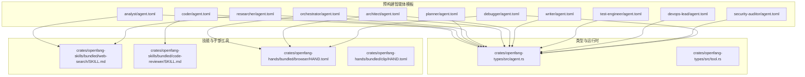
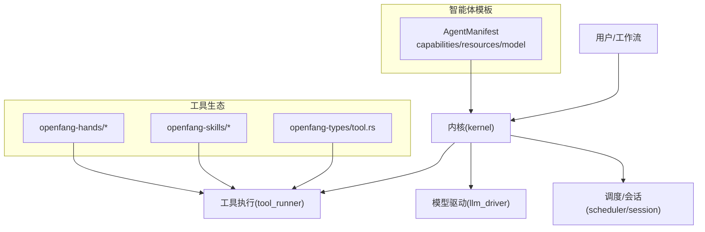
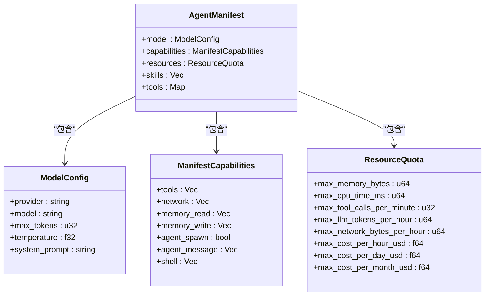
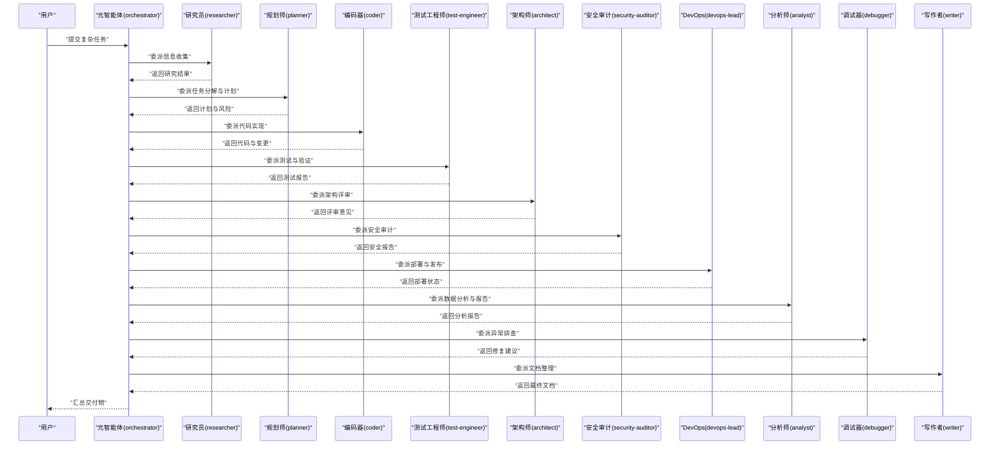
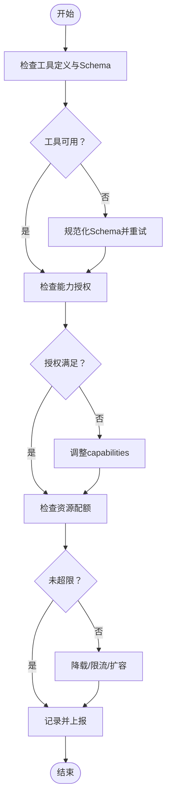

# 模板对比分析

<cite>
**本文引用的文件**
- [agents/analyst/agent.toml](file://agents/analyst/agent.toml)
- [agents/coder/agent.toml](file://agents/coder/agent.toml)
- [agents/planner/agent.toml](file://agents/planner/agent.toml)
- [agents/researcher/agent.toml](file://agents/researcher/agent.toml)
- [agents/orchestrator/agent.toml](file://agents/orchestrator/agent.toml)
- [agents/architect/agent.toml](file://agents/architect/agent.toml)
- [agents/writer/agent.toml](file://agents/writer/agent.toml)
- [agents/test-engineer/agent.toml](file://agents/test-engineer/agent.toml)
- [agents/devops-lead/agent.toml](file://agents/devops-lead/agent.toml)
- [agents/security-auditor/agent.toml](file://agents/security-auditor/agent.toml)
- [agents/debugger/agent.toml](file://agents/debugger/agent.toml)
- [crates/openfang-types/src/agent.rs](file://crates/openfang-types/src/agent.rs)
- [crates/openfang-types/src/tool.rs](file://crates/openfang-types/src/tool.rs)
- [crates/openfang-skills/bundled/web-search/SKILL.md](file://crates/openfang-skills/bundled/web-search/SKILL.md)
- [crates/openfang-skills/bundled/code-reviewer/SKILL.md](file://crates/openfang-skills/bundled/code-reviewer/SKILL.md)
- [crates/openfang-hands/bundled/browser/HAND.toml](file://crates/openfang-hands/bundled/browser/HAND.toml)
- [crates/openfang-hands/bundled/clip/HAND.toml](file://crates/openfang-hands/bundled/clip/HAND.toml)
</cite>

## 目录
1. [引言](#引言)
2. [项目结构](#项目结构)
3. [核心组件](#核心组件)
4. [架构总览](#架构总览)
5. [详细组件分析](#详细组件分析)
6. [依赖关系分析](#依赖关系分析)
7. [性能与资源特性](#性能与资源特性)
8. [模板选择与组合策略](#模板选择与组合策略)
9. [成本估算与预算控制](#成本估算与预算控制)
10. [迁移影响评估](#迁移影响评估)
11. [故障排查指南](#故障排查指南)
12. [结论](#结论)

## 引言
本文件面向 OpenFang 预构建智能体模板，提供系统化的横向对比分析与深度解读。目标包括：
- 建立横向对比矩阵：核心能力、工具集差异、性能特征、资源消耗、适用场景
- 深入解析典型模板的差异化特点：分析师、编码器、规划师、研究员
- 提供模板选择建议、组合使用策略、升级路径规划
- 给出性能基准参考、成本估算模型、迁移影响评估方法

## 项目结构
OpenFang 将“智能体模板”置于 agents 目录下，每个模板以独立的 agent.toml 描述其模型、资源配额、能力授权等；同时通过 openfang-types 定义统一的类型系统（AgentManifest、ResourceQuota 等），并通过 openfang-skills 与 openfang-hands 提供可复用的技能与手部工具。

图表来源
- [agents/analyst/agent.toml:1-50](file://agents/analyst/agent.toml#L1-L50)
- [agents/coder/agent.toml:1-48](file://agents/coder/agent.toml#L1-L48)
- [agents/planner/agent.toml:1-52](file://agents/planner/agent.toml#L1-L52)
- [agents/researcher/agent.toml:1-51](file://agents/researcher/agent.toml#L1-L51)
- [agents/orchestrator/agent.toml:1-64](file://agents/orchestrator/agent.toml#L1-L64)
- [agents/architect/agent.toml:1-46](file://agents/architect/agent.toml#L1-L46)
- [agents/writer/agent.toml:1-45](file://agents/writer/agent.toml#L1-L45)
- [agents/test-engineer/agent.toml:1-54](file://agents/test-engineer/agent.toml#L1-L54)
- [agents/devops-lead/agent.toml:1-51](file://agents/devops-lead/agent.toml#L1-L51)
- [agents/security-auditor/agent.toml:1-55](file://agents/security-auditor/agent.toml#L1-L55)
- [agents/debugger/agent.toml:1-53](file://agents/debugger/agent.toml#L1-L53)
- [crates/openfang-types/src/agent.rs:247-282](file://crates/openfang-types/src/agent.rs#L247-L282)
- [crates/openfang-types/src/tool.rs:1-650](file://crates/openfang-types/src/tool.rs#L1-L650)
- [crates/openfang-skills/bundled/web-search/SKILL.md:1-39](file://crates/openfang-skills/bundled/web-search/SKILL.md#L1-L39)
- [crates/openfang-skills/bundled/code-reviewer/SKILL.md:1-46](file://crates/openfang-skills/bundled/code-reviewer/SKILL.md#L1-L46)
- [crates/openfang-hands/bundled/browser/HAND.toml:1-255](file://crates/openfang-hands/bundled/browser/HAND.toml#L1-L255)
- [crates/openfang-hands/bundled/clip/HAND.toml:1-599](file://crates/openfang-hands/bundled/clip/HAND.toml#L1-L599)

章节来源
- [agents/analyst/agent.toml:1-50](file://agents/analyst/agent.toml#L1-L50)
- [agents/coder/agent.toml:1-48](file://agents/coder/agent.toml#L1-L48)
- [agents/planner/agent.toml:1-52](file://agents/planner/agent.toml#L1-L52)
- [agents/researcher/agent.toml:1-51](file://agents/researcher/agent.toml#L1-L51)
- [agents/orchestrator/agent.toml:1-64](file://agents/orchestrator/agent.toml#L1-L64)
- [agents/architect/agent.toml:1-46](file://agents/architect/agent.toml#L1-L46)
- [agents/writer/agent.toml:1-45](file://agents/writer/agent.toml#L1-L45)
- [agents/test-engineer/agent.toml:1-54](file://agents/test-engineer/agent.toml#L1-L54)
- [agents/devops-lead/agent.toml:1-51](file://agents/devops-lead/agent.toml#L1-L51)
- [agents/security-auditor/agent.toml:1-55](file://agents/security-auditor/agent.toml#L1-L55)
- [agents/debugger/agent.toml:1-53](file://agents/debugger/agent.toml#L1-L53)
- [crates/openfang-types/src/agent.rs:247-282](file://crates/openfang-types/src/agent.rs#L247-L282)
- [crates/openfang-types/src/tool.rs:1-650](file://crates/openfang-types/src/tool.rs#L1-L650)
- [crates/openfang-skills/bundled/web-search/SKILL.md:1-39](file://crates/openfang-skills/bundled/web-search/SKILL.md#L1-L39)
- [crates/openfang-skills/bundled/code-reviewer/SKILL.md:1-46](file://crates/openfang-skills/bundled/code-reviewer/SKILL.md#L1-L46)
- [crates/openfang-hands/bundled/browser/HAND.toml:1-255](file://crates/openfang-hands/bundled/browser/HAND.toml#L1-L255)
- [crates/openfang-hands/bundled/clip/HAND.toml:1-599](file://crates/openfang-hands/bundled/clip/HAND.toml#L1-L599)

## 核心组件
- 智能体清单与资源配额
  - AgentManifest、ModelConfig、FallbackModel、ManifestCapabilities、ResourceQuota 等定义了模型、回退链、能力授权与资源上限。
  - 资源配额字段覆盖内存、CPU、工具调用频率、LLM token/h、网络字节/h、以及按小时/天/月的美元级成本上限。
- 工具与技能
  - ToolDefinition/ToolCall/ToolResult 定义工具调用契约；normalize_schema_for_provider 支持跨供应商工具 Schema 兼容。
  - openfang-skills 提供可复用技能（如 web-search、code-reviewer）；openfang-hands 提供可安装的手部工具（如 browser、clip）。

章节来源
- [crates/openfang-types/src/agent.rs:247-282](file://crates/openfang-types/src/agent.rs#L247-L282)
- [crates/openfang-types/src/agent.rs:424-494](file://crates/openfang-types/src/agent.rs#L424-L494)
- [crates/openfang-types/src/tool.rs:1-650](file://crates/openfang-types/src/tool.rs#L1-L650)

## 架构总览
OpenFang 的智能体模板通过 agent.toml 声明式配置运行；kernel 依据 ManifestCapabilities 与 ResourceQuota 进行权限与资源管控；运行时根据 ModelConfig 与 FallbackModel 选择合适的 LLM；工具层由 openfang-types 的 Tool 接口与 openfang-skills/openfang-hands 的具体实现组成。

图表来源
- [crates/openfang-types/src/agent.rs:424-494](file://crates/openfang-types/src/agent.rs#L424-L494)
- [crates/openfang-types/src/tool.rs:1-650](file://crates/openfang-types/src/tool.rs#L1-L650)
- [crates/openfang-skills/bundled/web-search/SKILL.md:1-39](file://crates/openfang-skills/bundled/web-search/SKILL.md#L1-L39)
- [crates/openfang-hands/bundled/browser/HAND.toml:1-255](file://crates/openfang-hands/bundled/browser/HAND.toml#L1-L255)

## 详细组件分析

### 分析师模板（analyst）
- 核心能力
  - 数据分析与洞察生成，遵循“问题—探索—分析—可视化—报告”的框架，强调证据标准与可复现格式。
- 工具集
  - 文件读写、列出、Shell 执行、Web 搜索/抓取、内存存取。
- 性能与资源
  - LLM 最大 token 较高，资源配额中对 LLM token/h 有明确上限。
- 适用场景
  - 报表生成、趋势分析、数据质量评估、业务指标解读。

章节来源
- [agents/analyst/agent.toml:1-50](file://agents/analyst/agent.toml#L1-L50)

### 编码器模板（coder）
- 核心能力
  - 专家软件工程师，强调“读取—计划—实现—测试—验证”的工程流程，重视质量标准与研究引导。
- 工具集
  - 文件读写、列出、Shell 执行、Web 搜索/抓取、内存存取；Shell 权限覆盖 Rust/Cargo/Git/NPM/Python 等。
- 性能与资源
  - 更高的 LLM token/h 上限与并发工具数限制，适合复杂代码任务。
- 适用场景
  - 代码生成、重构、补丁编写、多语言集成。

章节来源
- [agents/coder/agent.toml:1-48](file://agents/coder/agent.toml#L1-L48)

### 规划师模板（planner）
- 核心能力
  - 项目规划与任务编排，采用“范围—分解—序列—估算—风险—里程碑”的方法论。
- 工具集
  - 文件读写、列出、内存存取/召回、向其他智能体发消息。
- 性能与资源
  - 高 LLM token/h 上限，支持代理间消息与共享内存协作。
- 适用场景
  - 产品路线图、迭代计划、风险识别、跨团队协调。

章节来源
- [agents/planner/agent.toml:1-52](file://agents/planner/agent.toml#L1-L52)

### 研究员模板（researcher）
- 核心能力
  - 信息检索与合成，强调子问题拆分、多源交叉验证与输出规范。
- 工具集
  - Web 搜索/抓取、文件读写、列出、内存存取。
- 性能与资源
  - 中等 LLM token/h 上限，强调网络访问与知识沉淀。
- 适用场景
  - 技术调研、竞品分析、合规研究、市场情报。

章节来源
- [agents/researcher/agent.toml:1-51](file://agents/researcher/agent.toml#L1-L51)

### 元智能体（orchestrator）
- 核心能力
  - 任务分解与委派，管理多个专业智能体并汇总结果，具备持续运行能力。
- 工具集
  - 列举/发送/创建/终止智能体、内存存取/召回、文件读写。
- 性能与资源
  - 极高 LLM token/h 上限，支持连续模式与条件触发。
- 适用场景
  - 复杂工作流编排、多智能体编排中心、动态任务调度。

章节来源
- [agents/orchestrator/agent.toml:1-64](file://agents/orchestrator/agent.toml#L1-L64)

### 架构师模板（architect）
- 核心能力
  - 系统设计与权衡，强调边界清晰、性能意识与决策记录。
- 工具集
  - 文件读写、列出、内存存取/召回、向其他智能体发消息。
- 性能与资源
  - 中等 LLM token/h 上限，强调跨模块协作。
- 适用场景
  - 架构评审、技术选型、接口设计、容量规划。

章节来源
- [agents/architect/agent.toml:1-46](file://agents/architect/agent.toml#L1-L46)

### 内容写作者模板（writer）
- 核心能力
  - 结构化内容创作，强调受众适配、风格与格式。
- 工具集
  - 文件读写、列出、Web 搜索/抓取、内存存取。
- 性能与资源
  - 中等 LLM token/h 上限，偏向文本生成。
- 适用场景
  - 技术文档、博客、邮件、摘要。

章节来源
- [agents/writer/agent.toml:1-45](file://agents/writer/agent.toml#L1-L45)

### 测试工程师模板（test-engineer）
- 核心能力
  - 测试策略设计与实现，强调接口测试、属性测试与回归覆盖。
- 工具集
  - 文件读写、列出、Shell 执行、内存存取/召回；Shell 权限覆盖 Cargo 测试与检查。
- 性能与资源
  - 中等 LLM token/h 上限，强调自动化测试执行。
- 适用场景
  - 单元测试、集成测试、属性测试、覆盖率提升。

章节来源
- [agents/test-engineer/agent.toml:1-54](file://agents/test-engineer/agent.toml#L1-L54)

### DevOps 领导模板（devops-lead）
- 核心能力
  - CI/CD、容器编排、基础设施即代码、监控与安全加固。
- 工具集
  - 文件读写、列出、Shell 执行、内存存取/召回、向其他智能体发消息；Shell 权限覆盖 Docker/Kubernetes/Cargo 等。
- 性能与资源
  - 中等 LLM token/h 上限，强调运维自动化。
- 适用场景
  - 自动化流水线、部署策略、可观测性、应急响应。

章节来源
- [agents/devops-lead/agent.toml:1-51](file://agents/devops-lead/agent.toml#L1-L51)

### 安全审计模板（security-auditor）
- 核心能力
  - 代码漏洞审计、配置检查、威胁建模与依赖风险评估。
- 工具集
  - 文件读写、列出、Shell 执行、内存存取/召回；Shell 权限覆盖 Cargo 审计与 Git 日志。
- 性能与资源
  - 中等 LLM token/h 上限，强调安全扫描与合规。
- 适用场景
  - 安全基线检查、漏洞修复建议、合规审计。

章节来源
- [agents/security-auditor/agent.toml:1-55](file://agents/security-auditor/agent.toml#L1-L55)

### 调试器模板（debugger）
- 核心能力
  - 错误重现、根因分析、修复建议与预防措施。
- 工具集
  - 文件读写、列出、Shell 执行、Web 搜索/抓取、内存存取/召回。
- 性能与资源
  - 中等 LLM token/h 上限，强调问题定位与验证。
- 适用场景
  - Bug 定位、日志分析、回归测试、知识沉淀。

章节来源
- [agents/debugger/agent.toml:1-53](file://agents/debugger/agent.toml#L1-L53)

## 依赖关系分析
- 模板到类型的依赖
  - 各模板通过 agent.toml 声明 AgentManifest，内核据此解析 ModelConfig、ManifestCapabilities、ResourceQuota。
- 工具与技能依赖
  - openfang-types 的 Tool 接口被所有模板共享；openfang-skills 的技能与 openfang-hands 的手部工具作为外部能力注入。
- 运行时耦合
  - 模板与运行时通过 capabilities/network/shell/memory 等授权维度耦合，资源配额在运行时被严格计量与限制。

图表来源
- [crates/openfang-types/src/agent.rs:424-494](file://crates/openfang-types/src/agent.rs#L424-L494)
- [crates/openfang-types/src/agent.rs:532-561](file://crates/openfang-types/src/agent.rs#L532-L561)
- [crates/openfang-types/src/agent.rs:247-282](file://crates/openfang-types/src/agent.rs#L247-L282)

章节来源
- [crates/openfang-types/src/agent.rs:424-494](file://crates/openfang-types/src/agent.rs#L424-L494)
- [crates/openfang-types/src/agent.rs:532-561](file://crates/openfang-types/src/agent.rs#L532-L561)
- [crates/openfang-types/src/agent.rs:247-282](file://crates/openfang-types/src/agent.rs#L247-L282)

## 性能与资源特性
- 资源配额维度
  - 内存、CPU、工具调用频率、LLM token/h、网络字节/h、成本上限（小时/天/月）。
- 模板资源对比要点
  - orchestrator 与 coder/planner 在 LLM token/h 上限更高，适合高复杂度任务。
  - analyst/researcher/writer/test-engineer/devops-lead/security-auditor/debugger 处于中等水平，兼顾生成与执行。
- 性能特征
  - 温度与最大 token 影响推理稳定性与上下文长度；回退模型链保障可用性。
- 资源消耗估算
  - 可基于模板的 max_llm_tokens_per_hour 与平均单价进行小时/天/月成本粗估；结合工具调用频率与网络流量估算额外成本。

章节来源
- [crates/openfang-types/src/agent.rs:247-282](file://crates/openfang-types/src/agent.rs#L247-L282)
- [agents/orchestrator/agent.toml:55-56](file://agents/orchestrator/agent.toml#L55-L56)
- [agents/coder/agent.toml:38-40](file://agents/coder/agent.toml#L38-L40)
- [agents/planner/agent.toml:44-45](file://agents/planner/agent.toml#L44-L45)
- [agents/analyst/agent.toml:41-42](file://agents/analyst/agent.toml#L41-L42)
- [agents/researcher/agent.toml:43-44](file://agents/researcher/agent.toml#L43-L44)
- [agents/writer/agent.toml:37-38](file://agents/writer/agent.toml#L37-L38)
- [agents/test-engineer/agent.toml:46-47](file://agents/test-engineer/agent.toml#L46-L47)
- [agents/devops-lead/agent.toml:42-43](file://agents/devops-lead/agent.toml#L42-L43)
- [agents/security-auditor/agent.toml:47-48](file://agents/security-auditor/agent.toml#L47-L48)
- [agents/debugger/agent.toml:44-45](file://agents/debugger/agent.toml#L44-L45)

## 模板选择与组合策略

### 横向对比矩阵（示例）
- 核心能力对比
  - 分析师：数据洞察、报表生成
  - 编码器：代码生成、质量保证
  - 规划师：任务编排、风险识别
  - 研究员：信息检索、交叉验证
  - 元智能体：多智能体编排、持续运行
  - 架构师：系统设计、权衡分析
  - 内容写作者：结构化写作、受众适配
  - 测试工程师：测试设计、覆盖率
  - DevOps 领导：流水线与运维
  - 安全审计：漏洞与合规
  - 调试器：根因分析与修复
- 工具集差异
  - Shell 权限：coder/devops-lead/security-auditor/debugger/test-engineer 最广；analyst/researcher/writer 中等；planner/architect/元智能体侧重协作与内存。
- 性能特征
  - orchestrator/coder/planner 对 LLM token/h 有更高需求；analyst/researcher/writer/test-engineer/devops-lead/security-auditor/debugger 属中等。
- 资源消耗
  - orchestrator 通常最高；coder/planner 次之；其余模板按任务复杂度与工具使用量变化。
- 适用场景
  - 从单点能力到端到端编排，按需组合使用。

章节来源
- [agents/analyst/agent.toml:44-49](file://agents/analyst/agent.toml#L44-L49)
- [agents/coder/agent.toml:42-47](file://agents/coder/agent.toml#L42-L47)
- [agents/planner/agent.toml:47-51](file://agents/planner/agent.toml#L47-L51)
- [agents/researcher/agent.toml:46-50](file://agents/researcher/agent.toml#L46-L50)
- [agents/orchestrator/agent.toml:58-63](file://agents/orchestrator/agent.toml#L58-L63)
- [agents/architect/agent.toml:41-45](file://agents/architect/agent.toml#L41-L45)
- [agents/writer/agent.toml:40-44](file://agents/writer/agent.toml#L40-L44)
- [agents/test-engineer/agent.toml:49-53](file://agents/test-engineer/agent.toml#L49-L53)
- [agents/devops-lead/agent.toml:45-49](file://agents/devops-lead/agent.toml#L45-L49)
- [agents/security-auditor/agent.toml:50-53](file://agents/security-auditor/agent.toml#L50-L53)
- [agents/debugger/agent.toml:47-51](file://agents/debugger/agent.toml#L47-L51)

### 典型模板差异化特点
- 分析师模板
  - 严谨的数据分析框架与证据标准，适合需要结构化报告与可复现流程的场景。
- 编码器模板
  - 工程化流程与质量标准，适合需要高质量代码产出与测试覆盖的场景。
- 规划师模板
  - 项目管理方法论与任务编排，适合需要跨团队协作与风险管理的场景。
- 研究员模板
  - 信息检索与交叉验证，适合需要权威资料与可信结论的研究场景。

章节来源
- [agents/analyst/agent.toml:13-34](file://agents/analyst/agent.toml#L13-L34)
- [agents/coder/agent.toml:14-31](file://agents/coder/agent.toml#L14-L31)
- [agents/planner/agent.toml:12-37](file://agents/planner/agent.toml#L12-L37)
- [agents/researcher/agent.toml:14-36](file://agents/researcher/agent.toml#L14-L36)

### 组合使用策略
- 典型编排链路
  - 元智能体（orchestrator）接收用户请求，根据复杂度分解任务，委派给研究员（researcher）收集信息、规划师（planner）制定计划、编码器（coder）实现代码、测试工程师（test-engineer）验证、架构师（architect）评审、安全审计（security-auditor）把关、DevOps 领导（devops-lead）部署、分析师（analyst）产出报告、调试器（debugger）处理异常、内容写作者（writer）整理文档。
- 交互序列示意

图表来源
- [agents/orchestrator/agent.toml:13-45](file://agents/orchestrator/agent.toml#L13-L45)
- [agents/researcher/agent.toml:46-50](file://agents/researcher/agent.toml#L46-L50)
- [agents/planner/agent.toml:47-51](file://agents/planner/agent.toml#L47-L51)
- [agents/coder/agent.toml:42-47](file://agents/coder/agent.toml#L42-L47)
- [agents/test-engineer/agent.toml:49-53](file://agents/test-engineer/agent.toml#L49-L53)
- [agents/architect/agent.toml:41-45](file://agents/architect/agent.toml#L41-L45)
- [agents/security-auditor/agent.toml:50-53](file://agents/security-auditor/agent.toml#L50-L53)
- [agents/devops-lead/agent.toml:45-49](file://agents/devops-lead/agent.toml#L45-L49)
- [agents/analyst/agent.toml:44-49](file://agents/analyst/agent.toml#L44-L49)
- [agents/debugger/agent.toml:47-51](file://agents/debugger/agent.toml#L47-L51)
- [agents/writer/agent.toml:40-44](file://agents/writer/agent.toml#L40-L44)

### 升级路径规划
- 从单模板到编排
  - 先以研究员/规划师/编码器/测试工程师为核心，逐步引入元智能体进行编排。
- 从编排到自治
  - 为关键智能体启用连续模式与条件触发，配合资源配额与成本上限进行治理。
- 从自治到智能化
  - 引入更丰富的技能与手部工具，扩展 Shell/网络/内存能力，提升自动化水平。

章节来源
- [agents/orchestrator/agent.toml:52-53](file://agents/orchestrator/agent.toml#L52-L53)
- [crates/openfang-types/src/agent.rs:225-241](file://crates/openfang-types/src/agent.rs#L225-L241)

## 成本估算与预算控制
- 成本构成
  - LLM 使用成本（按 token/h 与单价）、工具调用成本（按频率）、网络与存储成本（按字节/h）、平台与服务成本（按小时/天/月上限）。
- 估算步骤
  - 以模板 max_llm_tokens_per_hour 与平均单价估算小时成本；叠加工具调用与网络流量成本；设置 max_cost_per_hour_usd/max_cost_per_day_usd/max_cost_per_month_usd 实施预算控制。
- 控制策略
  - 合理设置温度与最大 token，减少无效生成；利用回退模型链降低失败成本；通过资源配额限制并发与频率。

章节来源
- [crates/openfang-types/src/agent.rs:247-282](file://crates/openfang-types/src/agent.rs#L247-L282)
- [agents/orchestrator/agent.toml:55-56](file://agents/orchestrator/agent.toml#L55-L56)
- [agents/coder/agent.toml:38-40](file://agents/coder/agent.toml#L38-L40)
- [agents/planner/agent.toml:44-45](file://agents/planner/agent.toml#L44-L45)
- [agents/analyst/agent.toml:41-42](file://agents/analyst/agent.toml#L41-L42)
- [agents/researcher/agent.toml:43-44](file://agents/researcher/agent.toml#L43-L44)
- [agents/writer/agent.toml:37-38](file://agents/writer/agent.toml#L37-L38)
- [agents/test-engineer/agent.toml:46-47](file://agents/test-engineer/agent.toml#L46-L47)
- [agents/devops-lead/agent.toml:42-43](file://agents/devops-lead/agent.toml#L42-L43)
- [agents/security-auditor/agent.toml:47-48](file://agents/security-auditor/agent.toml#L47-L48)
- [agents/debugger/agent.toml:44-45](file://agents/debugger/agent.toml#L44-L45)

## 迁移影响评估
- 配置迁移
  - 从旧版 agent.toml 迁移到新版本时，关注 capabilities/tools/profile 的兼容性与默认值变化。
- 能力迁移
  - 从最小工具集迁移到 Full/Automation 等 Profile 时，注意网络/Shell/Agent 能力的扩大带来的安全与成本影响。
- 运行时迁移
  - 资源配额与调度模式（Reactive/Periodic/Proactive/Continuous）的变化会影响任务吞吐与稳定性。

章节来源
- [crates/openfang-types/src/agent.rs:298-368](file://crates/openfang-types/src/agent.rs#L298-L368)
- [crates/openfang-types/src/agent.rs:225-241](file://crates/openfang-types/src/agent.rs#L225-L241)

## 故障排查指南
- 常见问题定位
  - 工具调用失败：检查 ToolDefinition 输入 Schema 与 provider 兼容性（normalize_schema_for_provider）。
  - 资源超限：核对 ResourceQuota 的各项上限，调整任务规模或并发。
  - 权限不足：确认 ManifestCapabilities 的 tools/network/shell/memory 授权是否覆盖所需能力。
- 诊断流程

图表来源
- [crates/openfang-types/src/tool.rs:38-173](file://crates/openfang-types/src/tool.rs#L38-L173)
- [crates/openfang-types/src/agent.rs:247-282](file://crates/openfang-types/src/agent.rs#L247-L282)
- [crates/openfang-types/src/agent.rs:532-561](file://crates/openfang-types/src/agent.rs#L532-L561)

## 结论
OpenFang 的预构建智能体模板通过声明式配置与统一类型系统实现了高度可组合的自动化能力。针对不同业务场景，可优先选择研究员/规划师/编码器/测试工程师等核心模板，再引入元智能体进行编排与治理，并通过资源配额与成本上限实现可控的成本与性能平衡。随着任务复杂度上升，逐步引入架构师、安全审计、DevOps 领导与调试器等角色，形成从研究、设计、实现到运维与复盘的闭环。