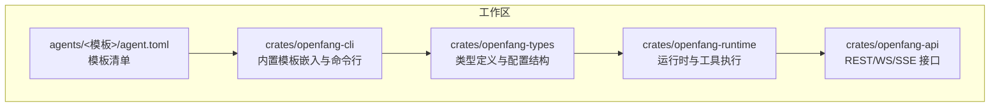
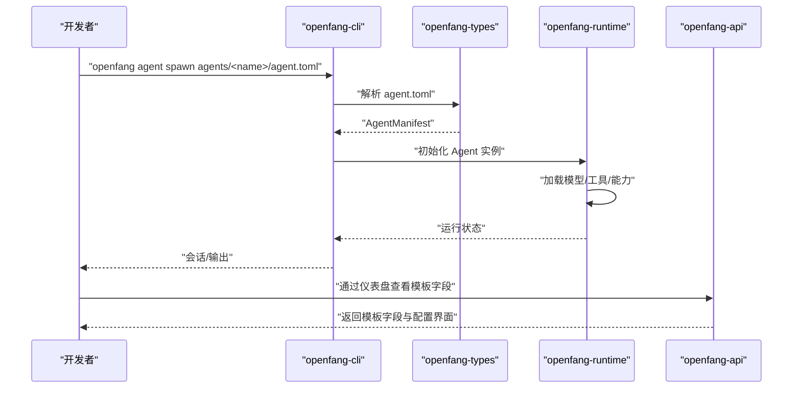
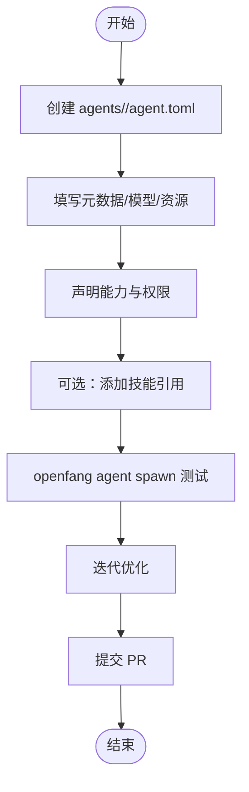

# 模板开发参考

<cite>
**本文引用的文件**
- [README.md](file://README.md)
- [CONTRIBUTING.md](file://CONTRIBUTING.md)
- [Cargo.toml](file://Cargo.toml)
- [agents/hello-world/agent.toml](file://agents/hello-world/agent.toml)
- [agents/analyst/agent.toml](file://agents/analyst/agent.toml)
- [agents/architect/agent.toml](file://agents/architect/agent.toml)
- [agents/coder/agent.toml](file://agents/coder/agent.toml)
- [agents/researcher/agent.toml](file://agents/researcher/agent.toml)
- [agents/writer/agent.toml](file://agents/writer/agent.toml)
- [crates/openfang-cli/src/bundled_agents.rs](file://crates/openfang-cli/src/bundled_agents.rs)
- [crates/openfang-types/src/agent.rs](file://crates/openfang-types/src/agent.rs)
- [crates/openfang-types/src/config.rs](file://crates/openfang-types/src/config.rs)
- [crates/openfang-api/src/routes.rs](file://crates/openfang-api/src/routes.rs)
- [crates/openfang-extensions/src/installer.rs](file://crates/openfang-extensions/src/installer.rs)
</cite>

## 目录
1. [简介](#简介)
2. [项目结构](#项目结构)
3. [核心组件](#核心组件)
4. [架构总览](#架构总览)
5. [详细组件分析](#详细组件分析)
6. [依赖分析](#依赖分析)
7. [性能考量](#性能考量)
8. [故障排查指南](#故障排查指南)
9. [结论](#结论)
10. [附录](#附录)

## 简介
本文件面向 OpenFang 预构建智能体模板开发者，提供从配置文件结构到模板生命周期的完整技术参考。内容覆盖 agent.toml 的元数据、模型与资源、能力声明、工具依赖与权限配置；模板开发流程（创建、配置、技能集成、测试）；最佳实践（代码组织、配置优化、性能调优、安全）；打包发布与版本管理策略；以及调试、诊断与性能监控要点。

## 项目结构
OpenFang 采用多 crate 工作区组织，预置智能体模板位于 agents/ 目录下，每个模板以 agent.toml 作为清单入口。CLI 在编译期将这些模板嵌入二进制，确保“安装即用”。类型系统与运行时负责解析模板、执行能力检查与工具调用。

图表来源
- [Cargo.toml:1-160](file://Cargo.toml#L1-L160)
- [crates/openfang-cli/src/bundled_agents.rs:1-51](file://crates/openfang-cli/src/bundled_agents.rs#L1-L51)

章节来源
- [Cargo.toml:1-160](file://Cargo.toml#L1-L160)
- [README.md:1-521](file://README.md#L1-L521)

## 核心组件
- 模板清单（agent.toml）
  - 元数据：name、version、description、author、module、tags
  - 模型与资源：provider、model、api_key_env、max_tokens、temperature、system_prompt、fallback_models、max_llm_tokens_per_hour、max_concurrent_tools
  - 能力与权限：tools、network、memory_read、memory_write、agent_message、agent_spawn、shell、exec_policy
- 类型与配置
  - Agent 结构体字段：tools、skills、mcp_servers、metadata、tags、routing、autonomous、pinned_model、workspace、workspace identity 生成开关等
  - 全局配置结构：包括执行策略、通知、通道适配器等
- CLI 嵌入与模板注册
  - 编译期将 agents/<name>/agent.toml 内容嵌入，支持 openfang agent new 与 openfang agent spawn
- API 层
  - 提供模板清单字段的可视化与交互（如向导页面）

章节来源
- [agents/hello-world/agent.toml:1-30](file://agents/hello-world/agent.toml#L1-L30)
- [agents/analyst/agent.toml:1-50](file://agents/analyst/agent.toml#L1-L50)
- [agents/architect/agent.toml:1-46](file://agents/architect/agent.toml#L1-L46)
- [agents/coder/agent.toml:1-48](file://agents/coder/agent.toml#L1-L48)
- [agents/researcher/agent.toml:1-51](file://agents/researcher/agent.toml#L1-L51)
- [agents/writer/agent.toml:1-45](file://agents/writer/agent.toml#L1-L45)
- [crates/openfang-types/src/agent.rs:455-482](file://crates/openfang-types/src/agent.rs#L455-L482)
- [crates/openfang-types/src/config.rs:1027-1677](file://crates/openfang-types/src/config.rs#L1027-L1677)
- [crates/openfang-cli/src/bundled_agents.rs:1-51](file://crates/openfang-cli/src/bundled_agents.rs#L1-L51)
- [crates/openfang-api/src/routes.rs:9694-9739](file://crates/openfang-api/src/routes.rs#L9694-L9739)

## 架构总览
模板在 OpenFang 中的生命周期：从 agents/ 目录读取 agent.toml，CLI 将其嵌入二进制；运行时解析清单、加载模型与工具、执行能力校验；API 层提供可视化与交互。

图表来源
- [crates/openfang-cli/src/bundled_agents.rs:1-51](file://crates/openfang-cli/src/bundled_agents.rs#L1-L51)
- [crates/openfang-types/src/agent.rs:455-482](file://crates/openfang-types/src/agent.rs#L455-L482)
- [crates/openfang-api/src/routes.rs:9694-9739](file://crates/openfang-api/src/routes.rs#L9694-L9739)

## 详细组件分析

### agent.toml 配置文件结构详解
- 元数据字段
  - name、version、description、author、module、tags
- 模型与资源
  - model.provider、model.model、model.api_key_env、model.max_tokens、model.temperature、model.system_prompt、model.fallback_models
  - resources.max_llm_tokens_per_hour、resources.max_concurrent_tools
- 能力与权限
  - capabilities.tools、capabilities.network、capabilities.memory_read、capabilities.memory_write、capabilities.agent_message、capabilities.agent_spawn、capabilities.shell、capabilities.exec_policy
- 典型模板示例
  - hello-world：基础聊天、文件读写、网络搜索、内存读写
  - analyst：数据分析、文件读写、shell 执行、网络访问、共享内存
  - architect：架构设计、消息发送、共享内存
  - coder：代码阅读/编写/测试、shell 执行、网络搜索
  - researcher：网络搜索/抓取、文件读写、共享内存
  - writer：写作、文件读写、网络搜索/抓取

章节来源
- [agents/hello-world/agent.toml:1-30](file://agents/hello-world/agent.toml#L1-L30)
- [agents/analyst/agent.toml:1-50](file://agents/analyst/agent.toml#L1-L50)
- [agents/architect/agent.toml:1-46](file://agents/architect/agent.toml#L1-L46)
- [agents/coder/agent.toml:1-48](file://agents/coder/agent.toml#L1-L48)
- [agents/researcher/agent.toml:1-51](file://agents/researcher/agent.toml#L1-L51)
- [agents/writer/agent.toml:1-45](file://agents/writer/agent.toml#L1-L45)

### 模板开发流程
- 创建模板目录与清单
  - 在 agents/<name>/ 下创建 agent.toml
  - 填写元数据、模型与资源、能力与权限
- 编写系统提示词与回退模型
  - 在 model.system_prompt 中定义行为框架
  - 使用 [[fallback_models]] 定义备用模型
- 技能集成
  - 在 capabilities.tools 中声明所需工具
  - 可选：通过 skills 引用领域知识（见类型定义）
- 测试验证
  - 使用 openfang agent spawn 启动并交互
  - 通过 openfang chat 或仪表盘进行端到端验证
- 打包与发布
  - 提交 PR，遵循贡献指南中的步骤与规范

章节来源
- [CONTRIBUTING.md:158-212](file://CONTRIBUTING.md#L158-L212)
- [README.md:407-431](file://README.md#L407-L431)

### 最佳实践
- 代码组织
  - 模板按功能域分组，使用 tags 进行分类
  - 将系统提示词与回退模型清晰分离，便于维护
- 配置优化
  - 合理设置 max_tokens、temperature、max_llm_tokens_per_hour
  - 使用 fallback_models 提升鲁棒性
- 性能调优
  - 控制 capabilities.tools 数量与并发度（max_concurrent_tools）
  - 限制不必要的 network/memory 权限，降低运行时开销
- 安全性
  - 严格最小权限原则：仅授予必要工具与网络/内存访问
  - 使用 api_key_env 环境变量注入密钥，避免硬编码
  - 对 shell 执行使用 exec_policy 进行白名单控制

章节来源
- [agents/analyst/agent.toml:36-40](file://agents/analyst/agent.toml#L36-L40)
- [agents/coder/agent.toml:33-37](file://agents/coder/agent.toml#L33-L37)
- [crates/openfang-types/src/config.rs:1049-1051](file://crates/openfang-types/src/config.rs#L1049-L1051)

### 模板打包与版本管理
- 编译期嵌入
  - openfang-cli 在构建时将 agents/<name>/agent.toml 内容嵌入二进制，确保无需文件系统发现
- 版本策略
  - 模板遵循语义化版本（semver），在 agent.toml 中维护 version 字段
  - 工作区统一版本由根 Cargo.toml 管理
- 发布流程
  - 通过 PR 合入主分支，CI 校验格式、测试与 lint
  - 维护者合并后随版本发布

章节来源
- [crates/openfang-cli/src/bundled_agents.rs:1-51](file://crates/openfang-cli/src/bundled_agents.rs#L1-L51)
- [Cargo.toml:17-22](file://Cargo.toml#L17-L22)

### 社区贡献指南
- 开发环境与构建测试
  - Rust 1.75+、Git、可选 Python 3.8+、LLM API 密钥用于端到端测试
  - 使用 cargo build、test、clippy、fmt
- 新增模板步骤
  - 在 agents/ 下创建新目录与 agent.toml
  - 填写清单、system_prompt、能力声明
  - 本地测试后提交 PR
- 代码风格与质量
  - rustfmt、clippy 无警告、所有公共类型具备文档注释
  - 每个新特性需配套测试

章节来源
- [CONTRIBUTING.md:19-100](file://CONTRIBUTING.md#L19-L100)
- [CONTRIBUTING.md:158-212](file://CONTRIBUTING.md#L158-L212)

## 依赖分析
模板清单与运行时的关系：CLI 解析 agent.toml 并传递给类型系统，再由运行时根据 capabilities 执行工具调用与权限校验。

图表来源
- [crates/openfang-cli/src/bundled_agents.rs:1-51](file://crates/openfang-cli/src/bundled_agents.rs#L1-L51)
- [crates/openfang-types/src/agent.rs:455-482](file://crates/openfang-types/src/agent.rs#L455-L482)

章节来源
- [crates/openfang-cli/src/bundled_agents.rs:1-51](file://crates/openfang-cli/src/bundled_agents.rs#L1-L51)
- [crates/openfang-types/src/agent.rs:455-482](file://crates/openfang-types/src/agent.rs#L455-L482)

## 性能考量
- 模型与令牌预算
  - 合理设置 max_tokens 与 max_llm_tokens_per_hour，避免超限导致降级
- 工具并发与资源
  - 通过 max_concurrent_tools 控制工具并发度，避免资源争用
- 能力最小化
  - 仅启用必要 tools 与 network/memory 权限，减少运行时开销
- 回退模型
  - 使用 fallback_models 提升可用性，避免单点失败

章节来源
- [agents/coder/agent.toml:38-40](file://agents/coder/agent.toml#L38-L40)
- [agents/analyst/agent.toml:36-40](file://agents/analyst/agent.toml#L36-L40)

## 故障排查指南
- 模板无法启动
  - 检查 agent.toml 语法与字段完整性（name、module、capabilities.tools）
  - 确认所需工具已在运行时可用
- 权限不足
  - 核对 capabilities.network/memory_read/write/agent_message/shell 等是否正确声明
  - 若涉及 shell 执行，确认 exec_policy 白名单配置
- 模型密钥或配额问题
  - 确认 api_key_env 环境变量已设置且有效
  - 检查 max_llm_tokens_per_hour 是否达到上限
- 回退模型未生效
  - 检查 [[fallback_models]] 的 provider/model/api_key_env 配置

章节来源
- [agents/hello-world/agent.toml:24-29](file://agents/hello-world/agent.toml#L24-L29)
- [agents/analyst/agent.toml:45-49](file://agents/analyst/agent.toml#L45-L49)
- [agents/coder/agent.toml:43-47](file://agents/coder/agent.toml#L43-L47)
- [crates/openfang-types/src/config.rs:1049-1051](file://crates/openfang-types/src/config.rs#L1049-L1051)

## 结论
OpenFang 的模板体系以 agent.toml 为核心，结合类型系统与运行时实现“声明式能力 + 最小权限”的安全执行。通过标准化的开发流程、严格的贡献规范与完善的测试机制，开发者可以快速构建高质量、可复用的预置智能体模板，并将其无缝嵌入到生产环境中。

## 附录
- 模板清单字段与类型映射
  - Agent 结构体字段：tools、skills、mcp_servers、metadata、tags、routing、autonomous、pinned_model、workspace、workspace identity 生成开关
  - 全局配置结构：exec_policy、通知、通道适配器等
- API 层模板字段可视化
  - API 路由中包含模板字段的展示与交互（如向导页面）

章节来源
- [crates/openfang-types/src/agent.rs:455-482](file://crates/openfang-types/src/agent.rs#L455-L482)
- [crates/openfang-types/src/config.rs:1027-1677](file://crates/openfang-types/src/config.rs#L1027-L1677)
- [crates/openfang-api/src/routes.rs:9694-9739](file://crates/openfang-api/src/routes.rs#L9694-L9739)