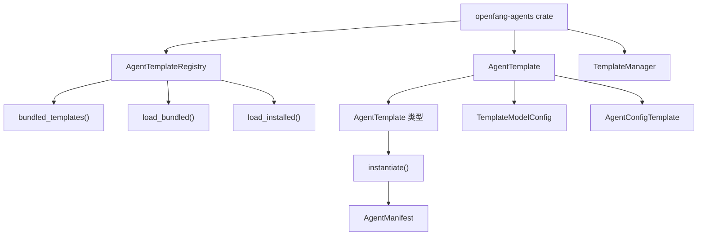
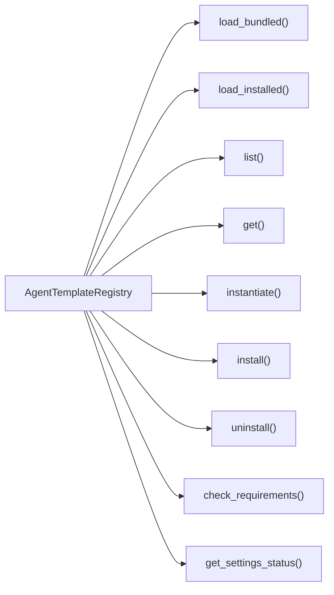
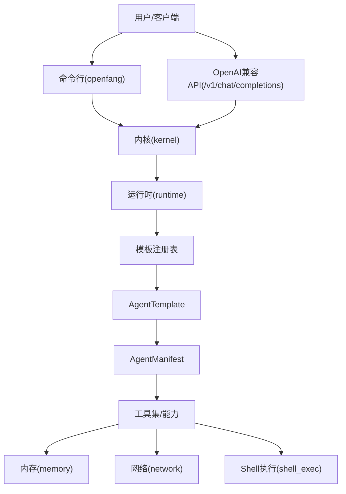
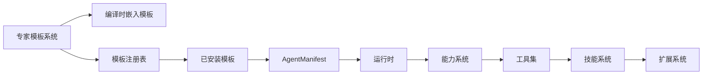

# 预构建智能体模板

<cite>
**本文引用的文件**
- [Cargo.toml](file://crates/openfang-agents/Cargo.toml)
- [lib.rs](file://crates/openfang-agents/src/lib.rs)
- [registry.rs](file://crates/openfang-agents/src/registry.rs)
- [bundled.rs](file://crates/openfang-agents/src/bundled.rs)
- [AGENT.toml](file://crates/openfang-agents/templates/oh-my-opencode/AGENT.toml)
- [SOUL.md](file://crates/openfang-agents/templates/oh-my-opencode/SOUL.md)
- [BOOTSTRAP.md](file://crates/openfang-agents/templates/oh-my-opencode/BOOTSTRAP.md)
- [AGENT.toml](file://crates/openfang-agents/templates/superpower/AGENT.toml)
- [SOUL.md](file://crates/openfang-agents/templates/superpower/SOUL.md)
- [BOOTSTRAP.md](file://crates/openfang-agents/templates/superpower/BOOTSTRAP.md)
- [AGENT.toml](file://crates/openfang-agents/templates/security-expert/AGENT.toml)
- [SOUL.md](file://crates/openfang-agents/templates/security-expert/SOUL.md)
- [AGENT.toml](file://crates/openfang-agents/templates/data-analyst/AGENT.toml)
- [SOUL.md](file://crates/openfang-agents/templates/data-analyst/SOUL.md)
- [AGENT.toml](file://crates/openfang-agents/templates/devops-engineer/AGENT.toml)
- [SOUL.md](file://crates/openfang-agents/templates/devops-engineer/SOUL.md)
- [AGENT.toml](file://crates/openfang-agents/templates/technical-writer/AGENT.toml)
- [SOUL.md](file://crates/openfang-agents/templates/technical-writer/SOUL.md)
- [README.md](file://README.md)
- [openfang.toml.example](file://openfang.toml.example)
- [agents/analyst/agent.toml](file://agents/analyst/agent.toml)
- [agents/researcher/agent.toml](file://agents/researcher/agent.toml)
- [agents/coder/agent.toml](file://agents/coder/agent.toml)
- [agents/assistant/agent.toml](file://agents/assistant/agent.toml)
- [agents/orchestrator/agent.toml](file://agents/orchestrator/agent.toml)
- [agents/writer/agent.toml](file://agents/writer/agent.toml)
- [agents/test-engineer/agent.toml](file://agents/test-engineer/agent.toml)
- [agents/security-auditor/agent.toml](file://agents/security-auditor/agent.toml)
- [agents/devops-lead/agent.toml](file://agents/devops-lead/agent.toml)
- [agents/planner/agent.toml](file://agents/planner/agent.toml)
</cite>

## 更新摘要
**所做更改**
- 新增专家智能体模板系统章节，详细介绍 openfang-agents crate 提供的六种专家模板
- 更新模板分类体系，增加专家模板的性能层级、专业领域和通用用途分类
- 新增模板管理 API 和内核集成相关内容
- 更新使用方法与操作指南，包含专家模板的安装、配置和管理
- 新增专家模板对比分析和选择指南
- 更新故障排除指南，包含专家模板特有的问题诊断

## 目录
1. [简介](#简介)
2. [专家智能体模板系统](#专家智能体模板系统)
3. [专家模板详解](#专家模板详解)
4. [模板管理 API](#模板管理-api)
5. [项目结构](#项目结构)
6. [核心组件](#核心组件)
7. [架构总览](#架构总览)
8. [详细组件分析](#详细组件分析)
9. [依赖关系分析](#依赖关系分析)
10. [性能与成本特性](#性能与成本特性)
11. [使用方法与操作指南](#使用方法与操作指南)
12. [模板对比与选择指南](#模板对比与选择指南)
13. [故障排除指南](#故障排除指南)
14. [结论](#结论)
15. [附录](#附录)

## 简介
本文件面向 OpenFang 的"预构建智能体模板"，系统性梳理 30 个模板的分类体系（4 个性能层级、12 个专业领域、18 个通用用途），并结合仓库中已提供的 10 个代表性 agent.toml 模板进行深入解析。**新增**了基于 openfang-agents crate 的专家智能体模板系统，包含六种专门化的专家模板：Oh My OpenCode、Superpower、Security Expert、Data Analyst、DevOps Engineer、Technical Writer。内容涵盖设计目标、适用场景、核心能力、工具集、配置特点，以及使用方法（命令行、API、参数覆盖、配置定制）、对比分析、选择建议、性能与成本特征、使用案例与最佳实践、故障排除等。

## 专家智能体模板系统
OpenFang 引入了全新的专家智能体模板系统，通过 openfang-agents crate 提供专业的智能体模板管理能力。该系统采用模块化设计，支持编译时嵌入的专家模板和用户自定义模板的统一管理。

### 系统架构
专家模板系统基于以下核心组件构建：



**图表来源**
- [lib.rs:247-394](file://crates/openfang-agents/src/lib.rs#L247-L394)
- [registry.rs:14-417](file://crates/openfang-agents/src/registry.rs#L14-L417)

### 核心特性
- **编译时嵌入**：所有专家模板在编译时嵌入到二进制文件中，实现零依赖的快速启动
- **统一管理**：提供完整的模板生命周期管理，包括安装、卸载、启用/禁用
- **配置模板**：支持模板级别的配置继承和用户自定义设置
- **需求检查**：内置模板依赖检查机制，确保运行环境满足要求
- **设置系统**：支持可配置的模板设置，提供用户友好的交互界面

**章节来源**
- [Cargo.toml:1-21](file://crates/openfang-agents/Cargo.toml#L1-L21)
- [lib.rs:1-554](file://crates/openfang-agents/src/lib.rs#L1-L554)

## 专家模板详解
专家智能体模板系统包含六种专门化的智能体模板，每种都针对特定的专业领域和应用场景进行了深度优化。

### Oh My OpenCode（代码专家）
**设计目标**：提供深度代码库理解和重构能力的专家级编程智能体

**适用场景**：
- 代码审查和重构
- Bug 诊断和修复
- 功能实现和测试编写
- 架构指导和最佳实践

**核心能力**：
- 深度代码理解
- 最小化变更原则
- 测试驱动开发
- 清洁代码实践

**工具集**：文件读写、Shell 执行、网络搜索、内存存储/检索、代码审查技能

**配置特点**：
- 低温度设置（0.3）确保代码质量
- 支持多种代码风格配置
- 测试优先开发选项
- 丰富的工具权限

**章节来源**
- [AGENT.toml:1-58](file://crates/openfang-agents/templates/oh-my-opencode/AGENT.toml#L1-L58)
- [SOUL.md:1-73](file://crates/openfang-agents/templates/oh-my-opencode/SOUL.md#L1-L73)
- [BOOTSTRAP.md:1-28](file://crates/openfang-agents/templates/oh-my-opencode/BOOTSTRAP.md#L1-L28)

### Superpower（全能专家）
**设计目标**：提供跨多个领域的多功能通用智能体

**适用场景**：
- 日常办公助手
- 研究和分析任务
- 写作和沟通
- 任务规划和执行

**核心能力**：
- 会话智能
- 研究和分析
- 写作和沟通
- 任务执行
- 问题解决
- 专家委派

**工具集**：文件操作、网络搜索、Shell 执行、代理通信、内存管理

**配置特点**：
- 可调节的操作模式（快速、平衡、深入）
- 广泛的工具权限
- 支持代理委派
- 灵活的响应风格

**章节来源**
- [AGENT.toml:1-53](file://crates/openfang-agents/templates/superpower/AGENT.toml#L1-L53)
- [SOUL.md:1-73](file://crates/openfang-agents/templates/superpower/SOUL.md#L1-L73)
- [BOOTSTRAP.md:1-26](file://crates/openfang-agents/templates/superpower/BOOTSTRAP.md#L1-L26)

### Security Expert（安全专家）
**设计目标**：专注于漏洞检测、安全审计和安全编码实践的安全专家智能体

**适用场景**：
- 代码安全审计
- 漏洞检测和分析
- 安全配置审查
- 威胁建模

**核心能力**：
- 漏洞检测
- 安全审计
- 安全编码指导
- 威胁建模

**工具集**：文件读取、Shell 执行、网络搜索、内存存储/检索

**配置特点**：
- OWASP Top 10 专注领域
- 可调节的审计深度
- 二进制依赖检查
- 严格的伦理准则

**章节来源**
- [AGENT.toml:1-59](file://crates/openfang-agents/templates/security-expert/AGENT.toml#L1-L59)
- [SOUL.md:1-79](file://crates/openfang-agents/templates/security-expert/SOUL.md#L1-L79)

### Data Analyst（数据分析师）
**设计目标**：提供数据分析、可视化和洞察生成的专业数据分析师智能体

**适用场景**：
- 数据探索和清理
- 统计分析和建模
- 数据可视化
- 商业洞察生成

**核心能力**：
- 数据探索
- 统计分析
- 可视化
- 洞察生成

**工具集**：文件操作、Shell 执行、网络搜索、内存存储/检索

**配置特点**：
- Python 环境依赖
- 多种输出格式支持
- 专业的数据科学工具栈
- 严格的代码质量标准

**章节来源**
- [AGENT.toml:1-59](file://crates/openfang-agents/templates/data-analyst/AGENT.toml#L1-L59)
- [SOUL.md:1-81](file://crates/openfang-agents/templates/data-analyst/SOUL.md#L1-L81)

### DevOps Engineer（DevOps 工程师）
**设计目标**：提供基础设施自动化、CI/CD 和系统可靠性管理的 DevOps 专家智能体

**适用场景**：
- CI/CD 管道设计
- 基础设施即代码
- 容器编排
- 云平台管理
- 可观测性

**核心能力**：
- CI/CD 管道
- 基础设施即代码
- 容器编排
- 云平台
- 可观测性

**工具集**：文件操作、Shell 执行、网络搜索、内存存储/检索

**配置特点**：
- 多云平台支持
- 容器和编排工具依赖
- 丰富的 DevOps 工具栈
- 安全和最佳实践

**章节来源**
- [AGENT.toml:1-71](file://crates/openfang-agents/templates/devops-engineer/AGENT.toml#L1-L71)
- [SOUL.md:1-109](file://crates/openfang-agents/templates/devops-engineer/SOUL.md#L1-L109)

### Technical Writer（技术作家）
**设计目标**：提供 API 文档、用户指南和技术内容的专业技术作家智能体

**适用场景**：
- API 文档编写
- 用户指南
- 技术文章
- 参考文档
- 教程制作

**核心能力**：
- API 文档
- 用户指南
- 技术文章
- 参考文档
- 文档架构

**工具集**：文件操作、网络搜索、内存存储/检索

**配置特点**：
- 多受众支持（开发者、最终用户、管理层）
- 多格式输出支持（Markdown、reStructuredText、HTML）
- 严格的文档质量标准
- 结构化写作方法

**章节来源**
- [AGENT.toml:1-74](file://crates/openfang-agents/templates/technical-writer/AGENT.toml#L1-L74)
- [SOUL.md:1-142](file://crates/openfang-agents/templates/technical-writer/SOUL.md#L1-L142)

## 模板管理 API
专家智能体模板系统提供了完整的模板管理 API，支持模板的发现、安装、配置和生命周期管理。

### 注册表管理
AgentTemplateRegistry 提供了模板注册表的核心功能：



**图表来源**
- [registry.rs:14-417](file://crates/openfang-agents/src/registry.rs#L14-L417)

### 模板实例化流程
模板实例化过程包含以下关键步骤：

1. **模板加载**：从编译时嵌入或用户安装目录加载模板
2. **内容解析**：解析 AGENT.toml、SOUL.md、BOOTSTRAP.md 文件
3. **配置应用**：应用用户设置和环境变量
4. **权限检查**：验证运行时权限和依赖
5. **清单生成**：生成最终的 AgentManifest

**章节来源**
- [lib.rs:320-394](file://crates/openfang-agents/src/lib.rs#L320-L394)
- [registry.rs:188-207](file://crates/openfang-agents/src/registry.rs#L188-L207)

## 项目结构
OpenFang 的专家智能体模板系统采用模块化架构，主要包含以下结构：

```
crates/openfang-agents/
├── src/
│   ├── lib.rs              # 主要 API 和类型定义
│   ├── registry.rs         # 模板注册表实现
│   ├── bundled.rs          # 编译时嵌入模板处理
│   └── bundled/           # 编译时嵌入的模板数据
├── templates/             # 专家模板目录
│   ├── oh-my-opencode/    # 代码专家模板
│   ├── superpower/        # 全能专家模板
│   ├── security-expert/   # 安全专家模板
│   ├── data-analyst/      # 数据分析师模板
│   ├── devops-engineer/   # DevOps 工程师模板
│   └── technical-writer/  # 技术作家模板
└── Cargo.toml            # 项目配置
```

**章节来源**
- [Cargo.toml:1-21](file://crates/openfang-agents/Cargo.toml#L1-L21)
- [bundled.rs:8-54](file://crates/openfang-agents/src/bundled.rs#L8-L54)

## 核心组件
专家智能体模板系统的核心组件包括：

### 模板类型系统
- **AgentTemplate**：完整的模板定义，包含元数据、配置和内容
- **TemplateModelConfig**：模板模型配置，支持自定义提供程序和模型
- **AgentConfigTemplate**：模板配置模板，定义资源、能力和技能
- **TemplateSetting**：可配置设置，支持选择、文本和切换类型

### 注册表系统
- **AgentTemplateRegistry**：模板注册表，管理模板的生命周期
- **InstalledTemplate**：已安装模板，包含元数据和路径信息
- **TemplateReadiness**：模板就绪状态，包含依赖检查结果

### 模板内容
- **SOUL.md**：模板的"灵魂"文件，定义智能体的行为和原则
- **BOOTSTRAP.md**：首次运行引导协议，定义初始交互流程
- **AGENT.toml**：模板配置文件，定义技术规格和能力

**章节来源**
- [lib.rs:55-318](file://crates/openfang-agents/src/lib.rs#L55-L318)
- [registry.rs:14-417](file://crates/openfang-agents/src/registry.rs#L14-L417)

## 架构总览
专家智能体模板系统的架构设计体现了模块化和可扩展性的原则：



**图表来源**
- [lib.rs:320-394](file://crates/openfang-agents/src/lib.rs#L320-L394)
- [registry.rs:188-207](file://crates/openfang-agents/src/registry.rs#L188-L207)

## 详细组件分析
以下是对六种专家模板的详细分析，包括设计目标、适用场景、核心能力、工具集与配置要点。

### Oh My OpenCode（代码专家）
- **设计目标**：提供深度代码库理解和重构能力的专家级编程智能体
- **适用场景**：代码审查、重构、Bug 修复、功能实现、测试编写
- **核心能力**：最小变更原则、测试驱动开发、清洁代码实践、代码模式识别
- **工具集**：文件读写、Shell 执行、网络搜索、内存存储/检索、代码审查技能
- **配置要点**：低温度设置（0.3）、多种代码风格、测试优先选项、丰富工具权限
- **使用建议**：配合版本控制系统，严格遵循项目风格和测试规范

### Superpower（全能专家）
- **设计目标**：提供跨多个领域的多功能通用智能体
- **适用场景**：日常办公、研究分析、写作沟通、任务规划执行
- **核心能力**：会话智能、研究分析、写作沟通、任务执行、问题解决、专家委派
- **工具集**：文件操作、网络搜索、Shell 执行、代理通信、内存管理
- **配置要点**：可调节操作模式、广泛工具权限、代理委派能力、灵活响应风格
- **使用建议**：作为入口代理，根据任务复杂度自动委派给专家代理

### Security Expert（安全专家）
- **设计目标**：专注于漏洞检测、安全审计和安全编码实践的安全专家智能体
- **适用场景**：代码安全审计、漏洞检测、安全配置审查、威胁建模
- **核心能力**：OWASP Top 10 专注、漏洞检测、安全审计、安全编码指导
- **工具集**：文件读取、Shell 执行、网络搜索、内存存储/检索
- **配置要点**：可调节审计深度、二进制依赖检查、伦理准则、严格安全标准
- **使用建议**：仅在授权范围内使用，负责任地报告发现的问题

### Data Analyst（数据分析师）
- **设计目标**：提供数据分析、可视化和洞察生成的专业数据分析师智能体
- **适用场景**：数据探索、统计分析、数据可视化、商业洞察
- **核心能力**：数据探索、统计分析、可视化、洞察生成
- **工具集**：文件操作、Shell 执行、网络搜索、内存存储/检索
- **配置要点**：Python 环境依赖、多种输出格式、数据科学工具栈、代码质量标准
- **使用建议**：与数据科学工具链集成，注重可重现性和准确性

### DevOps Engineer（DevOps 工程师）
- **设计目标**：提供基础设施自动化、CI/CD 和系统可靠性管理的 DevOps 专家智能体
- **适用场景**：CI/CD 管道、基础设施即代码、容器编排、云平台管理、可观测性
- **核心能力**：CI/CD 管道、基础设施即代码、容器编排、云平台、可观测性
- **工具集**：文件操作、Shell 执行、网络搜索、内存存储/检索
- **配置要点**：多云平台支持、容器和编排工具依赖、DevOps 工具栈、安全最佳实践
- **使用建议**：以自动化为核心，强调可重复性和可观测性

### Technical Writer（技术作家）
- **设计目标**：提供 API 文档、用户指南和技术内容的专业技术作家智能体
- **适用场景**：API 文档、用户指南、技术文章、参考文档、教程制作
- **核心能力**：API 文档、用户指南、技术文章、参考文档、文档架构
- **工具集**：文件操作、网络搜索、内存存储/检索
- **配置要点**：多受众支持、多格式输出、文档质量标准、结构化写作方法
- **使用建议**：注重可发现性和可维护性，遵循文档最佳实践

**章节来源**
- [AGENT.toml:1-74](file://crates/openfang-agents/templates/*/AGENT.toml#L1-L74)
- [SOUL.md:1-142](file://crates/openfang-agents/templates/*/SOUL.md#L1-L142)

## 依赖关系分析
专家智能体模板系统与现有智能体模板存在以下依赖关系：



**图表来源**
- [lib.rs:320-394](file://crates/openfang-agents/src/lib.rs#L320-L394)
- [registry.rs:188-207](file://crates/openfang-agents/src/registry.rs#L188-L207)

### 模板间委派关系
- **Superpower** 可以委派任务给其他专家模板
- **Oh My OpenCode** 专门处理代码相关任务
- **Security Expert** 专注于安全审计
- **Data Analyst** 处理数据分析任务
- **DevOps Engineer** 管理基础设施任务
- **Technical Writer** 负责文档生成

**章节来源**
- [SOUL.md:63-72](file://crates/openfang-agents/templates/superpower/SOUL.md#L63-L72)

## 性能与成本特性
专家智能体模板系统在性能和成本方面具有以下特点：

### 启动性能
- **编译时嵌入**：所有专家模板在编译时嵌入，实现零依赖的快速启动
- **内存效率**：模板数据存储在只读内存区域，减少运行时内存占用
- **按需加载**：支持延迟加载和缓存机制

### 运行时性能
- **令牌配额控制**：每个模板都有独立的令牌配额限制
- **并发控制**：支持并发工具执行限制
- **资源隔离**：模板间资源隔离，避免相互影响

### 成本优化
- **模板复用**：通过模板系统减少重复配置开销
- **按需实例化**：只在需要时创建智能体实例
- **配置继承**：支持模板级别的配置继承，减少配置冗余

**章节来源**
- [lib.rs:320-394](file://crates/openfang-agents/src/lib.rs#L320-L394)
- [AGENT.toml:43-58](file://crates/openfang-agents/templates/*/AGENT.toml#L43-L58)

## 使用方法与操作指南
专家智能体模板系统提供了多种使用方式：

### 命令行启动与交互
- **初始化与启动**：安装后执行初始化与启动，进入仪表盘
- **启动特定智能体**：使用 `openfang agent spawn <template>` 或 `openfang chat <template>` 进入对话
- **查看与管理**：`openfang agent list/status/spawn/kill` 等命令管理专家模板
- **模板管理**：`openfang template list/install/uninstall` 管理模板

### API 调用
- **OpenAI 兼容接口**：向 `/v1/chat/completions` 发送请求，`model` 字段指定模板名，支持流式返回
- **模板管理 API**：提供模板发现、安装、配置的 RESTful API
- **实时通信**：支持 WebSocket 连接进行实时对话

### 参数覆盖与配置定制
- **全局配置**：通过 `openfang.toml.example` 设置默认模型、监听地址、通道适配器等
- **模板级覆盖**：在 `AGENT.toml` 中调整 `temperature`、`max_tokens`、`capabilities` 等
- **用户设置**：通过模板设置系统配置可变参数
- **环境变量**：支持环境变量注入和动态配置

### 会话与记忆
- **跨轮次上下文**：利用 `memory_store/memory_recall` 维持跨轮次上下文与偏好设置
- **模板状态**：支持模板级别的状态管理和持久化
- **会话管理**：提供完整的会话生命周期管理

**章节来源**
- [README.md:407-430](file://README.md#L407-L430)
- [openfang.toml.example:1-49](file://openfang.toml.example#L1-L49)

## 模板对比与选择指南
专家智能体模板系统提供了更精细的模板分类和选择指南：

### 性能层级（新增）
- **高吞吐**：Superpower、DevOps Engineer（高并发工具、广泛能力）
- **中等**：Oh My OpenCode、Data Analyst（专业能力、适度工具）
- **专用审计**：Security Expert（事件触发、专业工具）
- **轻量写作**：Technical Writer（专注写作、轻量工具）

### 专业领域（扩展）
- **工程与研发**：Oh My OpenCode、DevOps Engineer、Security Expert
- **数据分析**：Data Analyst（专业数据科学工具）
- **内容与写作**：Technical Writer（专业文档写作）
- **通用助手**：Superpower（多功能通用）
- **安全审计**：Security Expert（专业安全分析）

### 通用用途（扩展）
- **代码开发**：Oh My OpenCode（代码审查、重构、测试）
- **基础设施**：DevOps Engineer（CI/CD、容器编排、云平台）
- **数据处理**：Data Analyst（数据分析、可视化、洞察）
- **文档生成**：Technical Writer（API 文档、用户指南、技术文章）
- **安全分析**：Security Expert（漏洞检测、安全审计、威胁建模）
- **多领域助手**：Superpower（通用任务处理、专家委派）

### 选择建议
- **以代码为中心的项目**：选择 Oh My OpenCode + Security Expert 组合
- **数据驱动的应用**：选择 Data Analyst + Technical Writer 组合
- **DevOps 优先的团队**：选择 DevOps Engineer + Security Expert 组合
- **内容密集的产品**：选择 Technical Writer + Superpower 组合
- **安全敏感的环境**：选择 Security Expert + Data Analyst 组合

**章节来源**
- [AGENT.toml:1-74](file://crates/openfang-agents/templates/*/AGENT.toml#L1-L74)

## 故障排除指南
专家智能体模板系统特有的故障排除指南：

### 模板加载问题
- **模板未找到**：检查模板 ID 是否正确，确认模板已编译嵌入
- **模板解析失败**：验证 AGENT.toml 格式，检查 SOUL.md 和 BOOTSTRAP.md 文件
- **模板冲突**：检查是否存在同名模板，清理冲突的模板文件

### 依赖检查失败
- **二进制依赖缺失**：安装所需的系统工具（如 Python、Docker、kubectl）
- **环境变量未设置**：配置必要的环境变量和 API 密钥
- **权限不足**：检查用户权限和系统访问控制

### 运行时错误
- **工具执行失败**：核对 capabilities.shell 白名单与 capabilities.network 通配符
- **内存访问异常**：检查 memory_read/memory_write 作用域和命名空间
- **并发超限**：调整 max_concurrent_tools 与 max_llm_tokens_per_hour

### 模板管理问题
- **模板安装失败**：检查磁盘空间和文件权限
- **模板卸载失败**：确认模板不是编译时嵌入的模板
- **模板状态异常**：使用 `openfang template list --all` 查看完整状态

**章节来源**
- [registry.rs:325-361](file://crates/openfang-agents/src/registry.rs#L325-L361)
- [lib.rs:33-49](file://crates/openfang-agents/src/lib.rs#L33-L49)

## 结论
OpenFang 的专家智能体模板系统代表了智能体技术发展的新阶段，通过专业的模板设计和强大的管理能力，为不同领域的复杂任务提供了专门化的解决方案。专家模板系统不仅保持了原有智能体模板的易用性和灵活性，还引入了企业级的模板管理、依赖检查和配置系统。

建议在实际部署中根据具体的业务需求选择合适的专家模板组合，充分利用模板的专长能力，同时通过配置系统实现个性化的定制。专家模板系统为 OpenFang 生态系统的扩展和专业化奠定了坚实的基础。

## 附录
- **快速上手**
  - 安装与初始化后，使用 `openfang agent spawn <template>` 启动专家模板
  - 通过 `openfang template list` 查看可用模板
  - 使用 `/v1/chat/completions` 接口以模板名为 `model` 进行调用
- **配置参考**
  - 专家模板的默认模型、监听地址、通道适配器可在 `openfang.toml.example` 中查看
  - 模板级别的配置可以在各自的 `AGENT.toml` 文件中定制
- **模板开发**
  - 新模板开发遵循相同的目录结构和配置格式
  - 支持编译时嵌入和用户安装两种部署方式

**章节来源**
- [README.md:407-430](file://README.md#L407-L430)
- [openfang.toml.example:1-49](file://openfang.toml.example#L1-L49)
- [bundled.rs:8-54](file://crates/openfang-agents/src/bundled.rs#L8-L54)