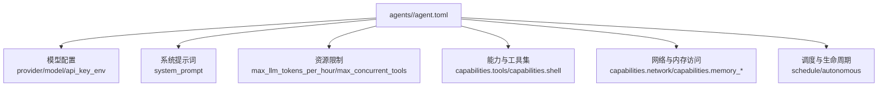
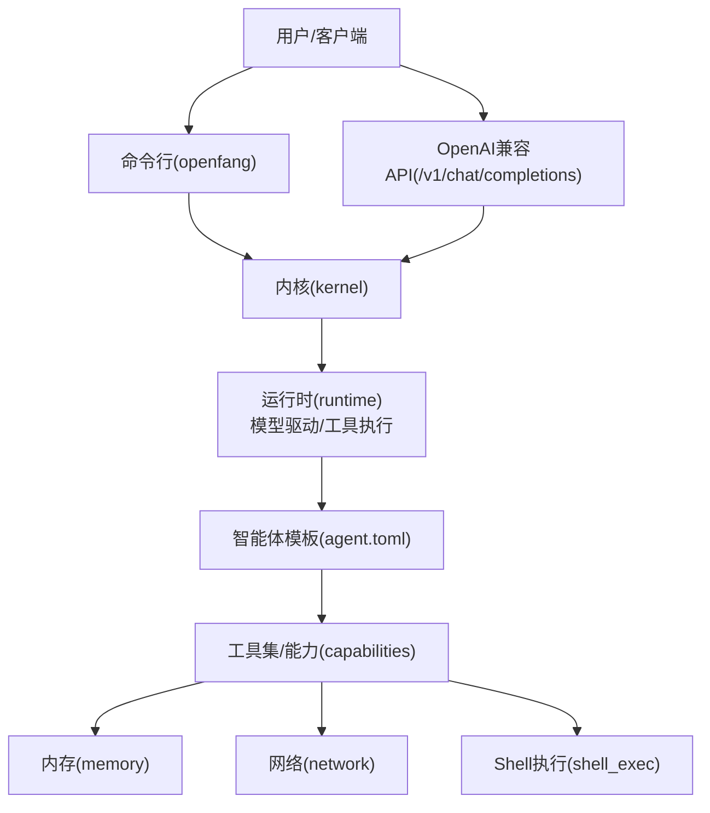
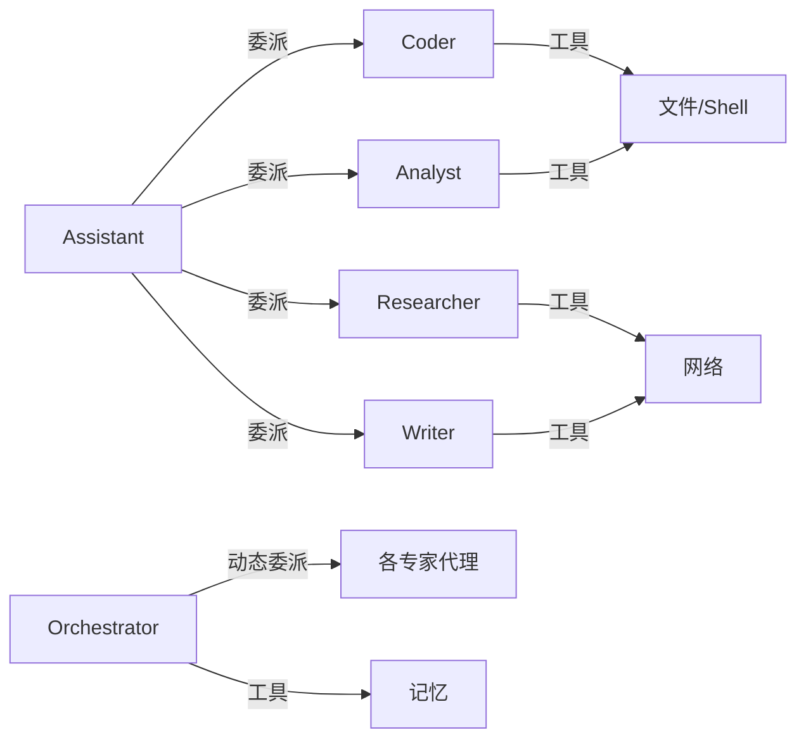

# 预构建智能体模板

<cite>
**本文引用的文件**
- [README.md](file://README.md)
- [openfang.toml.example](file://openfang.toml.example)
- [agents/analyst/agent.toml](file://agents/analyst/agent.toml)
- [agents/researcher/agent.toml](file://agents/researcher/agent.toml)
- [agents/coder/agent.toml](file://agents/coder/agent.toml)
- [agents/assistant/agent.toml](file://agents/assistant/agent.toml)
- [agents/orchestrator/agent.toml](file://agents/orchestrator/agent.toml)
- [agents/writer/agent.toml](file://agents/writer/agent.toml)
- [agents/test-engineer/agent.toml](file://agents/test-engineer/agent.toml)
- [agents/security-auditor/agent.toml](file://agents/security-auditor/agent.toml)
- [agents/devops-lead/agent.toml](file://agents/devops-lead/agent.toml)
- [agents/planner/agent.toml](file://agents/planner/agent.toml)
</cite>

## 目录
1. [简介](#简介)
2. [项目结构](#项目结构)
3. [核心组件](#核心组件)
4. [架构总览](#架构总览)
5. [详细组件分析](#详细组件分析)
6. [依赖关系分析](#依赖关系分析)
7. [性能与成本特性](#性能与成本特性)
8. [使用方法与操作指南](#使用方法与操作指南)
9. [模板对比与选择指南](#模板对比与选择指南)
10. [故障排除指南](#故障排除指南)
11. [结论](#结论)
12. [附录](#附录)

## 简介
本文件面向 OpenFang 的“预构建智能体模板”，系统性梳理 30 个模板的分类体系（4 个性能层级、12 个专业领域、18 个通用用途），并结合仓库中已提供的 10 个代表性 agent.toml 模板进行深入解析。内容涵盖设计目标、适用场景、核心能力、工具集、配置特点，以及使用方法（命令行、API、参数覆盖、配置定制）、对比分析、选择建议、性能与成本特征、使用案例与最佳实践、故障排除等。

## 项目结构
OpenFang 将“预构建智能体”以独立目录组织，每个智能体包含一个 agent.toml 配置文件，定义模型、系统提示词、资源限制、能力与工具集等。示例路径如下：
- agents/analyst/agent.toml
- agents/researcher/agent.toml
- agents/coder/agent.toml
- agents/assistant/agent.toml
- agents/orchestrator/agent.toml
- agents/writer/agent.toml
- agents/test-engineer/agent.toml
- agents/security-auditor/agent.toml
- agents/devops-lead/agent.toml
- agents/planner/agent.toml

这些模板共同构成 OpenFang 的“预构建智能体模板库”。每个模板通过统一的 TOML 结构描述其职责边界、能力范围与运行约束，便于在命令行或 API 中直接调用与编排。

图示来源
- [agents/analyst/agent.toml:7-50](file://agents/analyst/agent.toml#L7-L50)
- [agents/researcher/agent.toml:8-51](file://agents/researcher/agent.toml#L8-L51)
- [agents/coder/agent.toml:8-48](file://agents/coder/agent.toml#L8-L48)
- [agents/assistant/agent.toml:8-82](file://agents/assistant/agent.toml#L8-L82)
- [agents/orchestrator/agent.toml:7-64](file://agents/orchestrator/agent.toml#L7-L64)
- [agents/writer/agent.toml:7-45](file://agents/writer/agent.toml#L7-L45)
- [agents/test-engineer/agent.toml:8-54](file://agents/test-engineer/agent.toml#L8-L54)
- [agents/security-auditor/agent.toml:8-55](file://agents/security-auditor/agent.toml#L8-L55)
- [agents/devops-lead/agent.toml:7-51](file://agents/devops-lead/agent.toml#L7-L51)
- [agents/planner/agent.toml:7-52](file://agents/planner/agent.toml#L7-L52)

章节来源
- [README.md: 第408–430行:408-430](file://README.md#L408-L430)

## 核心组件
- 模型与推理控制：provider、model、api_key_env、max_tokens、temperature、fallback_models
- 系统提示词与工作流：system_prompt（含分阶段方法论）
- 资源与并发：max_llm_tokens_per_hour、max_concurrent_tools
- 能力与工具集：capabilities.tools、capabilities.shell、capabilities.network、capabilities.memory_*、capabilities.agent_* 等
- 访问控制与安全：network 通配符、memory 作用域、agent_message 策略
- 生命周期与调度：schedule（如 continuous/proactive）、autonomous（如 max_iterations）

章节来源
- [agents/analyst/agent.toml: 第7–50行:7-50](file://agents/analyst/agent.toml#L7-L50)
- [agents/researcher/agent.toml: 第8–51行:8-51](file://agents/researcher/agent.toml#L8-L51)
- [agents/coder/agent.toml: 第8–48行:8-48](file://agents/coder/agent.toml#L8-L48)
- [agents/assistant/agent.toml: 第8–82行:8-82](file://agents/assistant/agent.toml#L8-L82)
- [agents/orchestrator/agent.toml: 第7–64行:7-64](file://agents/orchestrator/agent.toml#L7-L64)
- [agents/writer/agent.toml: 第7–45行:7-45](file://agents/writer/agent.toml#L7-L45)
- [agents/test-engineer/agent.toml: 第8–54行:8-54](file://agents/test-engineer/agent.toml#L8-L54)
- [agents/security-auditor/agent.toml: 第8–55行:8-55](file://agents/security-auditor/agent.toml#L8-L55)
- [agents/devops-lead/agent.toml: 第7–51行:7-51](file://agents/devops-lead/agent.toml#L7-L51)
- [agents/planner/agent.toml: 第7–52行:7-52](file://agents/planner/agent.toml#L7-L52)

## 架构总览
OpenFang 的“预构建智能体模板”作为系统能力的一部分，由内核与运行时驱动，通过统一的配置接口被命令行与 API 调用。下图展示从用户到智能体模板的关键交互路径。

图示来源
- [README.md: 第389–404行:389-404](file://README.md#L389-L404)
- [README.md: 第407–430行:407-430](file://README.md#L407-L430)
- [openfang.toml.example: 第1–49行:1-49](file://openfang.toml.example#L1-L49)

## 详细组件分析
以下对 10 个代表性模板进行逐项解析，包括设计目标、适用场景、核心能力、工具集与配置要点，并给出选择建议与使用建议。

### 分析师(Analyst)
- 设计目标：数据处理、洞察生成、报告输出
- 适用场景：业务指标分析、财务报表解读、A/B 实验结果评估
- 核心能力：数据探索、统计分析、可视化脚本生成、结构化报告
- 工具集：文件读写、Shell 执行、Web 搜索/抓取、记忆存储/检索
- 配置要点：温度较低、较长上下文、令牌配额控制、Shell 命令白名单
- 使用建议：配合外部数据源与可视化工具链，按需开启 Python 执行

章节来源
- [agents/analyst/agent.toml: 第1–50行:1-50](file://agents/analyst/agent.toml#L1-L50)

### 研究员(Researcher)
- 设计目标：跨源信息收集与综合
- 适用场景：竞品情报、技术趋势追踪、合规研究
- 核心能力：多轮搜索、深度阅读、交叉验证、可信度评估
- 工具集：Web 搜索/抓取、文件读写、记忆存储/检索
- 配置要点：强调引用来源、输出结构化、温度适中
- 使用建议：结合知识库与外部数据库，建立“证据清单”

章节来源
- [agents/researcher/agent.toml: 第1–51行:1-51](file://agents/researcher/agent.toml#L1-L51)

### 代码工程师(Coder)
- 设计目标：高质量代码实现与审查
- 适用场景：功能开发、Bug 修复、重构与测试编写
- 核心能力：上下文理解、计划-实现-验证闭环、错误处理
- 工具集：文件读写/列表、Shell 执行、Web 搜索/抓取、记忆存储/检索
- 配置要点：高上下文、并发工具上限、多语言 Shell 白名单
- 使用建议：与版本控制系统联动，严格遵循项目风格与测试规范

章节来源
- [agents/coder/agent.toml: 第1–48行:1-48](file://agents/coder/agent.toml#L1-L48)

### 助理(Assistant)
- 设计目标：通用助手，多模态任务与代理委派
- 适用场景：日常问答、文档撰写、流程协调、知识管理
- 核心能力：对话理解、任务执行、研究与写作、代理委派
- 工具集：文件/记忆/网络/Shell、代理列表与消息
- 配置要点：高并发工具、开放网络与内存访问、可委派给专家代理
- 使用建议：作为入口代理，根据任务复杂度自动委派

章节来源
- [agents/assistant/agent.toml: 第1–82行:1-82](file://agents/assistant/agent.toml#L1-L82)

### 协调者(Orchestrator)
- 设计目标：复杂任务分解与专家代理编排
- 适用场景：端到端工程交付、跨职能协作、状态同步
- 核心能力：任务拆解、专家委派、结果合成、持续监控
- 工具集：代理列表/发送/创建/终止、文件/记忆
- 配置要点：连续运行、共享内存读写、可动态孵化代理
- 使用建议：结合工作流与审计日志，确保可追溯性

章节来源
- [agents/orchestrator/agent.toml: 第1–64行:1-64](file://agents/orchestrator/agent.toml#L1-L64)

### 写手(Writter)
- 设计目标：高质量内容创作与技术文档撰写
- 适用场景：产品文档、博客文章、邮件与摘要
- 核心能力：结构化写作、风格适配、平台格式化
- 工具集：文件读写/列表、Web 搜索/抓取、记忆存储/检索
- 配置要点：温度偏高、强调清晰与简洁
- 使用建议：与知识库联动，按受众调整语气与格式

章节来源
- [agents/writer/agent.toml: 第1–45行:1-45](file://agents/writer/agent.toml#L1-L45)

### 测试工程师(Test Engineer)
- 设计目标：测试策略设计、测试用例编写与覆盖率分析
- 适用场景：单元测试、集成测试、属性测试、回归测试
- 核心能力：测试金字塔应用、边界与异常用例、覆盖率缺口识别
- 工具集：文件/Shell/记忆
- 配置要点：Shell 白名单聚焦测试命令
- 使用建议：与 CI/CD 集成，优先自动化与确定性测试

章节来源
- [agents/test-engineer/agent.toml: 第1–54行:1-54](file://agents/test-engineer/agent.toml#L1-L54)

### 安全审计员(Security Auditor)
- 设计目标：漏洞扫描、威胁建模与配置审计
- 适用场景：代码安全审查、依赖风险评估、合规检查
- 核心能力：OWASP Top 10 对齐、攻击面映射、证据链记录
- 工具集：文件/Shell/记忆；Shell 白名单覆盖审计命令
- 配置要点：事件触发式主动审计
- 使用建议：与 DevSecOps 流程结合，形成闭环

章节来源
- [agents/security-auditor/agent.toml: 第1–55行:1-55](file://agents/security-auditor/agent.toml#L1-L55)

### DevOps 主管(DevOps Lead)
- 设计目标：CI/CD、基础设施与可观测性治理
- 适用场景：流水线优化、容器编排、监控告警、应急响应
- 核心能力：流水线设计、蓝绿/金丝雀发布、安全左移
- 工具集：文件/Shell/记忆；代理消息用于跨职能协作
- 配置要点：Shell 白名单覆盖云与容器相关命令
- 使用建议：以自动化为核心，强调可重复与可观测

章节来源
- [agents/devops-lead/agent.toml: 第1–51行:1-51](file://agents/devops-lead/agent.toml#L1-L51)

### 规划师(Planner)
- 设计目标：项目规划与任务分解
- 适用场景：产品路线图、迭代计划、风险与里程碑管理
- 核心能力：范围定义、依赖识别、估算与缓冲、验收标准
- 工具集：文件/记忆/代理消息
- 配置要点：高上下文、强调结构化输出
- 使用建议：将计划作为“活文档”，定期回顾与更新

章节来源
- [agents/planner/agent.toml: 第1–52行:1-52](file://agents/planner/agent.toml#L1-L52)

## 依赖关系分析
- 模板依赖于统一的运行时与内核：通过 capabilities 与资源限制对接运行时的工具执行、网络与内存访问控制。
- 模板之间存在“委派关系”：Assistant 可委派至 Coder/Researcher/Analyst/Writter 等；Orchestrator 可动态委派至各专家代理。
- 配置耦合点：模型提供方、API 密钥环境变量、令牌配额与并发限制。

图示来源
- [agents/assistant/agent.toml: 第32–34行:32-34](file://agents/assistant/agent.toml#L32-L34)
- [agents/orchestrator/agent.toml: 第25–45行:25-45](file://agents/orchestrator/agent.toml#L25-L45)

## 性能与成本特性
- 启动与空闲：OpenFang 在冷启动与空闲内存占用方面具备优势，适合长期运行与多代理并行。
- 令牌配额与并发：各模板通过 max_llm_tokens_per_hour 与 max_concurrent_tools 控制成本与稳定性。
- 多模型回退：模板支持 fallback_models，提升可用性与稳定性。
- 成本估算思路：基于模型单价、平均上下文长度、调用频率与并发度，结合令牌配额进行月度/年度预算规划。

章节来源
- [README.md: 第117–186行:117-186](file://README.md#L117-L186)
- [agents/analyst/agent.toml: 第42–43行:42-43](file://agents/analyst/agent.toml#L42-L43)
- [agents/coder/agent.toml: 第39–41行:39-41](file://agents/coder/agent.toml#L39-L41)
- [agents/assistant/agent.toml: 第69–71行:69-71](file://agents/assistant/agent.toml#L69-L71)

## 使用方法与操作指南
- 命令行启动与交互
  - 初始化与启动：安装后执行初始化与启动，进入仪表盘。
  - 启动特定智能体：使用 openfang agent spawn 或 openfang chat 进入对话。
  - 查看与管理：openfang agent list/status/spawn/kill 等。
- API 调用
  - OpenAI 兼容接口：向 /v1/chat/completions 发送请求，model 字段指定模板名，支持流式返回。
- 参数覆盖与配置定制
  - 全局配置：通过 openfang.toml.example 设置默认模型、监听地址、通道适配器等。
  - 模板级覆盖：在 agent.toml 中调整 temperature、max_tokens、capabilities 等。
- 会话与记忆
  - 利用 memory_store/memory_recall 维持跨轮次上下文与偏好设置。

章节来源
- [README.md: 第407–430行:407-430](file://README.md#L407-L430)
- [README.md: 第389–404行:389-404](file://README.md#L389-L404)
- [openfang.toml.example: 第1–49行:1-49](file://openfang.toml.example#L1-L49)

## 模板对比与选择指南
- 性能层级（建议维度）
  - 高吞吐：Assistant、Orchestrator（高并发工具、委派能力）
  - 中等：Coder、Researcher、Analyst（长上下文、多工具）
  - 低延迟：Writer、Planner（结构化输出、轻量工具）
  - 专用审计：Security Auditor（事件触发、Shell 审计）
- 专业领域（建议维度）
  - 工程与研发：Coder、Test Engineer、DevOps Lead、Security Auditor
  - 内容与沟通：Writer、Assistant、Meeting Assistant、Translator
  - 数据与分析：Analyst、Data Scientist（如存在）
  - 研究与情报：Researcher、Security Auditor（情报与威胁建模）
  - 项目与运营：Planner、Ops（如存在）
  - 客户服务：Customer Support、Sales Assistant、Recruiter
  - 社交媒体与营销：Social Media、Travel Planner、Personal Finance
  - 法律与合规：Legal Assistant、Security Auditor
  - 健康与生活：Health Tracker、Home Automation
- 通用用途（建议维度）
  - 问答与对话：Assistant、Hello World
  - 文档与报告：Writer、Doc Writer
  - 任务编排：Orchestrator、Planner
  - 知识检索：Researcher、Code Reviewer
  - 代码生成与审查：Coder、Code Reviewer
  - 自动化与脚本：DevOps Lead、Debugger
  - 会议与日程：Meeting Assistant、Planner
  - 邮件与沟通：Email Assistant、Translator
  - 技术写作与培训：Writer、Tutor、Doc Writer
  - 个人助理：Assistant、Health Tracker、Personal Finance

选择建议
- 以“委派”为核心的复杂任务选 Orchestrator + Assistant 组合
- 需要高质量内容输出选 Writer + Researcher
- 工程交付优先选 Coder + Test Engineer + DevOps Lead
- 安全与合规优先选 Security Auditor + Researcher

## 故障排除指南
- 无法连接模型提供方
  - 检查 agent.toml 中的 api_key_env 是否正确，确认 openfang.toml 中 provider/model 配置。
- 工具执行失败
  - 核对 capabilities.shell 白名单与 capabilities.network 通配符；确认 shell_exec 权限与路径。
- 记忆访问异常
  - 检查 memory_read/memory_write 作用域；确认命名空间前缀（self.* / shared.*）。
- 并发超限或成本过高
  - 调整 max_concurrent_tools 与 max_llm_tokens_per_hour；必要时启用 fallback_models。
- 代理委派无响应
  - 确认 agent_list 可见性与 agent_message 策略；检查目标代理是否存活。

章节来源
- [agents/analyst/agent.toml: 第42–50行:42-50](file://agents/analyst/agent.toml#L42-L50)
- [agents/coder/agent.toml: 第43–48行:43-48](file://agents/coder/agent.toml#L43-L48)
- [agents/assistant/agent.toml: 第73–79行:73-79](file://agents/assistant/agent.toml#L73-L79)
- [agents/orchestrator/agent.toml: 第59–64行:59-64](file://agents/orchestrator/agent.toml#L59-L64)
- [openfang.toml.example: 第1–49行:1-49](file://openfang.toml.example#L1-L49)

## 结论
OpenFang 的“预构建智能体模板”以标准化的 agent.toml 描述了从通用助手到专家代理的完整能力谱系。通过统一的运行时与内核，模板实现了可编排、可扩展、可审计的智能体生态。建议在实际部署中结合业务场景选择合适的模板组合，并通过配置与工具白名单实现安全与成本的平衡。

## 附录
- 快速上手
  - 安装与初始化后，使用 openfang agent spawn <template> 启动模板，或 openfang chat <template> 进入对话。
  - 通过 /v1/chat/completions 接口以模板名为 model 进行调用。
- 配置参考
  - 默认模型、监听地址、通道适配器、MCP 服务器等可在 openfang.toml.example 中查看与定制。

章节来源
- [README.md: 第407–430行:407-430](file://README.md#L407-L430)
- [README.md: 第389–404行:389-404](file://README.md#L389-L404)
- [openfang.toml.example: 第1–49行:1-49](file://openfang.toml.example#L1-L49)