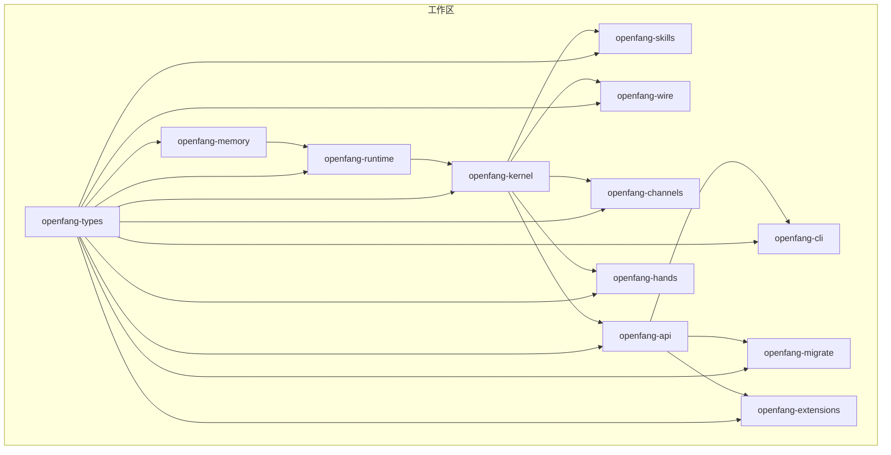
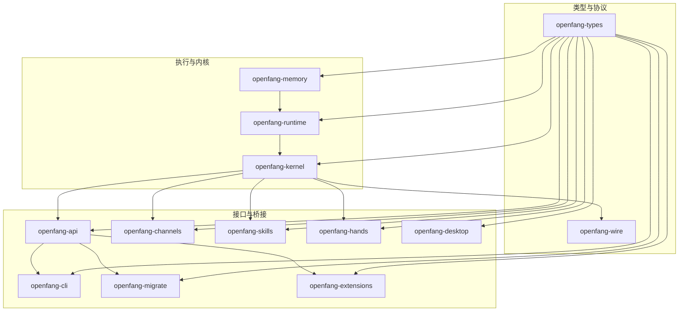
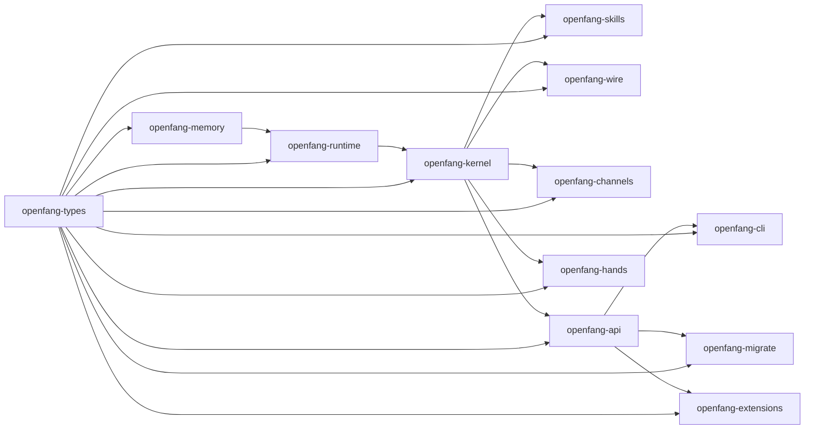

# Crate 结构

<cite>
**本文引用的文件**
- [Cargo.toml](file://Cargo.toml)
- [openfang-types/Cargo.toml](file://crates/openfang-types/Cargo.toml)
- [openfang-types/src/lib.rs](file://crates/openfang-types/src/lib.rs)
- [openfang-memory/Cargo.toml](file://crates/openfang-memory/Cargo.toml)
- [openfang-memory/src/lib.rs](file://crates/openfang-memory/src/lib.rs)
- [openfang-runtime/Cargo.toml](file://crates/openfang-runtime/Cargo.toml)
- [openfang-runtime/src/lib.rs](file://crates/openfang-runtime/src/lib.rs)
- [openfang-kernel/Cargo.toml](file://crates/openfang-kernel/Cargo.toml)
- [openfang-kernel/src/lib.rs](file://crates/openfang-kernel/src/lib.rs)
- [openfang-api/Cargo.toml](file://crates/openfang-api/Cargo.toml)
- [openfang-api/src/lib.rs](file://crates/openfang-api/src/lib.rs)
- [openfang-channels/Cargo.toml](file://crates/openfang-channels/Cargo.toml)
- [openfang-channels/src/lib.rs](file://crates/openfang-channels/src/lib.rs)
- [openfang-skills/Cargo.toml](file://crates/openfang-skills/Cargo.toml)
- [openfang-skills/src/lib.rs](file://crates/openfang-skills/src/lib.rs)
- [openfang-hands/Cargo.toml](file://crates/openfang-hands/Cargo.toml)
- [openfang-hands/src/lib.rs](file://crates/openfang-hands/src/lib.rs)
- [openfang-wire/Cargo.toml](file://crates/openfang-wire/Cargo.toml)
- [openfang-wire/src/lib.rs](file://crates/openfang-wire/src/lib.rs)
- [openfang-cli/Cargo.toml](file://crates/openfang-cli/Cargo.toml)
- [openfang-migrate/Cargo.toml](file://crates/openfang-migrate/Cargo.toml)
- [openfang-extensions/Cargo.toml](file://crates/openfang-extensions/Cargo.toml)
</cite>

## 目录
1. [引言](#引言)
2. [项目结构](#项目结构)
3. [核心组件](#核心组件)
4. [架构总览](#架构总览)
5. [详细组件分析](#详细组件分析)
6. [依赖分析](#依赖分析)
7. [性能考虑](#性能考虑)
8. [故障排查指南](#故障排查指南)
9. [结论](#结论)
10. [附录](#附录)

## 引言
本文件面向 OpenFang 代码库，系统梳理 14 个核心 crate 的职责、接口与相互关系，覆盖从共享类型到运行时、内核、API、消息通道、技能系统、自主手、协议、命令行、桌面应用与迁移引擎的完整链路。目标是帮助开发者快速理解“如何正确使用各 crate 的公共接口”，以及在实际开发与维护中应遵循的集成模式与最佳实践。

## 项目结构
OpenFang 采用 Rust 工作区组织，所有 crate 均位于 crates/ 目录下，并通过根 Cargo.toml 统一版本与依赖管理。核心成员包括：openfang-types、openfang-memory、openfang-runtime、openfang-kernel、openfang-api、openfang-channels、openfang-skills、openfang-hands、openfang-wire、openfang-cli、openfang-migrate、openfang-extensions，以及一个辅助任务工具 xtask。

图表来源
- [Cargo.toml:1-162](file://Cargo.toml#L1-L162)

章节来源
- [Cargo.toml:1-162](file://Cargo.toml#L1-L162)

## 核心组件
以下按职责维度对 14 个核心 crate 进行分组与说明：

- 共享层
  - openfang-types：统一的数据模型、错误、事件、能力、消息、工具、Webhook 等跨域共享类型；提供基础工具函数（如安全截断字符串）。
- 存储与记忆
  - openfang-memory：统一记忆抽象（结构化、语义、知识图谱），提供会话、使用统计、迁移与合并等模块。
- 执行与运行时
  - openfang-runtime：代理执行循环、LLM 驱动抽象、工具执行、WASM 沙箱、媒体理解、网络抓取/搜索、工作区沙箱、审计与重试策略等。
- 内核与调度
  - openfang-kernel：代理生命周期、权限与配额、调度、触发器、事件总线、心跳、配对、工作流、能力注册表、后台任务、计费计量等。
- 通信与桥接
  - openfang-channels：40+ 消息平台适配器（Discord、Slack、Telegram、邮件、Matrix 等），统一消息事件到内核。
- 技能系统
  - openfang-skills：技能清单、加载器、市场、OpenClaw 兼容、校验与安装、工具定义与需求声明。
- 自主手（Hands）
  - openfang-hands：预置“自主能力包”（Hands），含 HAND.toml 定义、设置解析、要求检查、仪表盘指标、实例状态与激活流程。
- 协议与网络
  - openfang-wire：OFP（OpenFang Protocol）——代理间网络协议，含消息、对等体与注册表。
- 接口与入口
  - openfang-api：HTTP/WebSocket API 服务，内核进程内运行，提供 REST 与聊天接口。
  - openfang-cli：命令行工具，连接内核与 API，支持 TUI、向导、模板与迁移。
  - openfang-desktop：桌面应用（Tauri），提供托盘、快捷键、更新器与服务封装。
- 迁移与扩展
  - openfang-migrate：从其他框架导入（JSON5、YAML、Provider Catalog 等）。
  - openfang-extensions：扩展与集成系统，MCP 服务器、凭据保险库、OAuth2 PKCE、加密与网络栈。

章节来源
- [openfang-types/src/lib.rs:1-83](file://crates/openfang-types/src/lib.rs#L1-L83)
- [openfang-memory/src/lib.rs:1-20](file://crates/openfang-memory/src/lib.rs#L1-L20)
- [openfang-runtime/src/lib.rs:1-59](file://crates/openfang-runtime/src/lib.rs#L1-L59)
- [openfang-kernel/src/lib.rs:1-30](file://crates/openfang-kernel/src/lib.rs#L1-L30)
- [openfang-api/src/lib.rs:1-19](file://crates/openfang-api/src/lib.rs#L1-L19)
- [openfang-channels/src/lib.rs:1-56](file://crates/openfang-channels/src/lib.rs#L1-L56)
- [openfang-skills/src/lib.rs:1-255](file://crates/openfang-skills/src/lib.rs#L1-L255)
- [openfang-hands/src/lib.rs:1-867](file://crates/openfang-hands/src/lib.rs#L1-L867)
- [openfang-wire/src/lib.rs](file://crates/openfang-wire/src/lib.rs)
- [openfang-cli/Cargo.toml:1-34](file://crates/openfang-cli/Cargo.toml#L1-L34)
- [openfang-migrate/Cargo.toml:1-24](file://crates/openfang-migrate/Cargo.toml#L1-L24)
- [openfang-extensions/Cargo.toml:1-35](file://crates/openfang-extensions/Cargo.toml#L1-L35)

## 架构总览
OpenFang 的核心数据与控制流自下而上分为三层：
- 类型与协议层（openfang-types、openfang-wire）：定义跨域共享类型与代理间通信协议。
- 执行与内核层（openfang-memory、openfang-runtime、openfang-kernel）：实现记忆、执行、调度、权限与事件。
- 接口与桥接层（openfang-api、openfang-channels、openfang-skills、openfang-hands、openfang-cli、openfang-desktop、openfang-migrate、openfang-extensions）：对外提供 API、消息桥接、技能与 Hands、CLI/桌面、迁移与扩展。

图表来源
- [Cargo.toml:1-162](file://Cargo.toml#L1-L162)
- [openfang-types/Cargo.toml:1-24](file://crates/openfang-types/Cargo.toml#L1-L24)
- [openfang-wire/Cargo.toml:1-27](file://crates/openfang-wire/Cargo.toml#L1-L27)
- [openfang-memory/Cargo.toml:1-24](file://crates/openfang-memory/Cargo.toml#L1-L24)
- [openfang-runtime/Cargo.toml:1-39](file://crates/openfang-runtime/Cargo.toml#L1-L39)
- [openfang-kernel/Cargo.toml:1-45](file://crates/openfang-kernel/Cargo.toml#L1-L45)
- [openfang-api/Cargo.toml:1-46](file://crates/openfang-api/Cargo.toml#L1-L46)
- [openfang-channels/Cargo.toml:1-43](file://crates/openfang-channels/Cargo.toml#L1-L43)
- [openfang-skills/Cargo.toml:1-28](file://crates/openfang-skills/Cargo.toml#L1-L28)
- [openfang-hands/Cargo.toml:1-22](file://crates/openfang-hands/Cargo.toml#L1-L22)
- [openfang-migrate/Cargo.toml:1-24](file://crates/openfang-migrate/Cargo.toml#L1-L24)
- [openfang-extensions/Cargo.toml:1-35](file://crates/openfang-extensions/Cargo.toml#L1-L35)

## 详细组件分析

### openfang-types：共享类型与契约
- 职责
  - 定义跨域共享数据结构与枚举（代理、能力、消息、工具、Webhook、事件、错误、配置、调度、媒体、内存、模型目录等）。
  - 提供通用工具函数（如安全字符串截断）。
- 关键点
  - 无业务逻辑，仅作为契约与数据模型。
  - 作为所有其他 crate 的直接依赖根。
- 接口与使用
  - 在 openfang-memory、openfang-runtime、openfang-kernel、openfang-api、openfang-channels、openfang-skills、openfang-hands、openfang-wire 中被广泛复用。
  - 通过 serde 序列化/反序列化贯穿各层。

章节来源
- [openfang-types/src/lib.rs:1-83](file://crates/openfang-types/src/lib.rs#L1-L83)
- [openfang-types/Cargo.toml:1-24](file://crates/openfang-types/Cargo.toml#L1-L24)

### openfang-memory：记忆子系统
- 职责
  - 统一记忆 API，抽象三类存储后端：结构化（SQLite）、语义（LIKE/Qdrant）、知识图谱（SQLite）。
  - 提供会话、使用统计、迁移与合并等模块。
- 关键点
  - 通过 MemorySubstrate 对外暴露统一接口，屏蔽底层差异。
- 接口与使用
  - 被 openfang-runtime 与 openfang-kernel 使用以持久化状态与上下文。
  - 与 openfang-types 的内存与会话模型配合。

章节来源
- [openfang-memory/src/lib.rs:1-20](file://crates/openfang-memory/src/lib.rs#L1-L20)
- [openfang-memory/Cargo.toml:1-24](file://crates/openfang-memory/Cargo.toml#L1-L24)

### openfang-runtime：运行时引擎
- 职责
  - 代理执行循环、LLM 驱动抽象、工具执行、WASM 沙箱、媒体理解、网络抓取/搜索、工作区沙箱、审计与重试策略。
- 关键点
  - 支持多驱动（Anthropic、OpenAI、Gemini、Copilot、Qwen 等）。
  - 提供 Docker/Subprocess/Shell 等多种沙箱与隔离机制。
- 接口与使用
  - 由 openfang-kernel 启动与调度，向 openfang-types 的事件与消息模型提供执行能力。

章节来源
- [openfang-runtime/src/lib.rs:1-59](file://crates/openfang-runtime/src/lib.rs#L1-L59)
- [openfang-runtime/Cargo.toml:1-39](file://crates/openfang-runtime/Cargo.toml#L1-L39)

### openfang-kernel：核心内核
- 职责
  - 代理生命周期管理、权限与配额、调度、触发器、事件总线、心跳、配对、工作流、能力注册表、后台任务、计费计量。
- 关键点
  - 作为系统中枢，协调 openfang-runtime、openfang-memory、openfang-skills、openfang-hands、openfang-channels、openfang-wire。
- 接口与使用
  - 通过内部 API 暴露给 openfang-api 与 openfang-cli；对外提供 HTTP/WebSocket 接口。

章节来源
- [openfang-kernel/src/lib.rs:1-30](file://crates/openfang-kernel/src/lib.rs#L1-L30)
- [openfang-kernel/Cargo.toml:1-45](file://crates/openfang-kernel/Cargo.toml#L1-L45)

### openfang-api：API 服务器
- 职责
  - 提供 HTTP 与 WebSocket 接口，内核在进程中运行，CLI 通过 HTTP 与其交互。
- 关键点
  - 包含速率限制、会话认证、流式分块与去重、OpenAI 兼容路由等。
- 接口与使用
  - 依赖 openfang-kernel、openfang-runtime、openfang-memory、openfang-channels、openfang-wire、openfang-skills、openfang-hands、openfang-extensions、openfang-migrate。

章节来源
- [openfang-api/src/lib.rs:1-19](file://crates/openfang-api/src/lib.rs#L1-L19)
- [openfang-api/Cargo.toml:1-46](file://crates/openfang-api/Cargo.toml#L1-L46)

### openfang-channels：消息渠道适配器
- 职责
  - 提供 40+ 消息平台适配器，将外部消息转换为统一 ChannelMessage 事件，注入内核。
- 关键点
  - 模块化路由与格式化器，支持多种协议（IMAP/SMTP、WebSocket、Webhook 等）。
- 接口与使用
  - 作为内核的上游输入，输出统一事件模型。

章节来源
- [openfang-channels/src/lib.rs:1-56](file://crates/openfang-channels/src/lib.rs#L1-L56)
- [openfang-channels/Cargo.toml:1-43](file://crates/openfang-channels/Cargo.toml#L1-L43)

### openfang-skills：技能系统
- 职责
  - 技能清单、加载器、市场、OpenClaw 兼容、校验与安装、工具定义与需求声明。
- 关键点
  - 支持 Python/WASM/Node/Shell/Builtin/PromptOnly 多种运行时。
  - 通过 Manifest 声明工具与能力需求。
- 接口与使用
  - 为 openfang-runtime 提供可插拔工具集，增强代理能力。

章节来源
- [openfang-skills/src/lib.rs:1-255](file://crates/openfang-skills/src/lib.rs#L1-L255)
- [openfang-skills/Cargo.toml:1-28](file://crates/openfang-skills/Cargo.toml#L1-L28)

### openfang-hands：自主手系统
- 职责
  - 预置“自主能力包”（Hands），含 HAND.toml 定义、设置解析、要求检查、仪表盘指标、实例状态与激活流程。
- 关键点
  - 将复杂领域能力打包为“为你工作”的代理实例，强调可观察性与可运维性。
- 接口与使用
  - 通过 openfang-kernel 创建并管理代理实例，结合 openfang-skills 与 openfang-extensions。

章节来源
- [openfang-hands/src/lib.rs:1-867](file://crates/openfang-hands/src/lib.rs#L1-L867)
- [openfang-hands/Cargo.toml:1-22](file://crates/openfang-hands/Cargo.toml#L1-L22)

### openfang-wire：OFP 协议
- 职责
  - OFP（OpenFang Protocol）——代理间网络协议，含消息、对等体与注册表。
- 关键点
  - 为多代理协作与分布式场景提供统一通信契约。
- 接口与使用
  - 与 openfang-types 的消息与事件模型协同，支撑跨节点通信。

章节来源
- [openfang-wire/src/lib.rs](file://crates/openfang-wire/src/lib.rs)
- [openfang-wire/Cargo.toml:1-27](file://crates/openfang-wire/Cargo.toml#L1-L27)

### openfang-cli：命令行工具
- 职责
  - 提供 CLI 与 TUI，连接内核与 API，支持向导、模板、迁移与扩展。
- 关键点
  - 通过 HTTP 与 openfang-api 交互，支持本地守护进程模式。
- 接口与使用
  - 依赖 openfang-kernel、openfang-api、openfang-migrate、openfang-skills、openfang-extensions。

章节来源
- [openfang-cli/Cargo.toml:1-34](file://crates/openfang-cli/Cargo.toml#L1-L34)

### openfang-desktop：桌面应用
- 职责
  - Tauri 桌面应用，提供托盘、快捷键、更新器与服务封装。
- 关键点
  - 与 openfang-api/CLI 协同，提供本地体验。
- 接口与使用
  - 通过 HTTP 与内核交互，或作为本地守护进程启动。

章节来源
- [openfang-extensions/Cargo.toml:1-35](file://crates/openfang-extensions/Cargo.toml#L1-L35)

### openfang-migrate：迁移引擎
- 职责
  - 从其他框架导入（JSON5、YAML、Provider Catalog 等），生成 OpenFang 可识别的资产。
- 关键点
  - 解析与转换不同格式，保证元数据与能力映射一致。
- 接口与使用
  - 为 openfang-cli 与 openfang-api 提供导入能力。

章节来源
- [openfang-migrate/Cargo.toml:1-24](file://crates/openfang-migrate/Cargo.toml#L1-L24)

### openfang-extensions：扩展与集成系统
- 职责
  - MCP 服务器一键部署、凭据保险库、OAuth2 PKCE、加密与网络栈。
- 关键点
  - 为第三方服务与内部能力提供安全接入与统一管理。
- 接口与使用
  - 与 openfang-api、openfang-kernel 协同，提供扩展能力。

章节来源
- [openfang-extensions/Cargo.toml:1-35](file://crates/openfang-extensions/Cargo.toml#L1-L35)

## 依赖分析
- 直接依赖
  - openfang-api 依赖 openfang-kernel、openfang-runtime、openfang-memory、openfang-channels、openfang-wire、openfang-skills、openfang-hands、openfang-extensions、openfang-migrate。
  - openfang-kernel 依赖 openfang-types、openfang-memory、openfang-runtime、openfang-skills、openfang-hands、openfang-extensions、openfang-wire、openfang-channels。
  - openfang-runtime 依赖 openfang-types、openfang-memory、openfang-skills。
  - openfang-memory 依赖 openfang-types。
  - openfang-channels 依赖 openfang-types。
  - openfang-skills 依赖 openfang-types。
  - openfang-hands 依赖 openfang-types。
  - openfang-wire 依赖 openfang-types。
  - openfang-cli 依赖 openfang-types、openfang-kernel、openfang-api、openfang-migrate、openfang-skills、openfang-extensions、openfang-runtime。
  - openfang-migrate 依赖 openfang-types。
  - openfang-extensions 依赖 openfang-types。
- 间接依赖
  - openfang-api 间接依赖 openfang-types（通过其依赖链）。
  - openfang-kernel 间接依赖 openfang-types。
  - 以此类推，形成以 openfang-types 为中心的星形依赖网络。

图表来源
- [Cargo.toml:1-162](file://Cargo.toml#L1-L162)
- [openfang-api/Cargo.toml:1-46](file://crates/openfang-api/Cargo.toml#L1-L46)
- [openfang-kernel/Cargo.toml:1-45](file://crates/openfang-kernel/Cargo.toml#L1-L45)
- [openfang-runtime/Cargo.toml:1-39](file://crates/openfang-runtime/Cargo.toml#L1-L39)
- [openfang-memory/Cargo.toml:1-24](file://crates/openfang-memory/Cargo.toml#L1-L24)
- [openfang-channels/Cargo.toml:1-43](file://crates/openfang-channels/Cargo.toml#L1-L43)
- [openfang-skills/Cargo.toml:1-28](file://crates/openfang-skills/Cargo.toml#L1-L28)
- [openfang-hands/Cargo.toml:1-22](file://crates/openfang-hands/Cargo.toml#L1-L22)
- [openfang-wire/Cargo.toml:1-27](file://crates/openfang-wire/Cargo.toml#L1-L27)
- [openfang-cli/Cargo.toml:1-34](file://crates/openfang-cli/Cargo.toml#L1-L34)
- [openfang-migrate/Cargo.toml:1-24](file://crates/openfang-migrate/Cargo.toml#L1-L24)
- [openfang-extensions/Cargo.toml:1-35](file://crates/openfang-extensions/Cargo.toml#L1-L35)

章节来源
- [Cargo.toml:1-162](file://Cargo.toml#L1-L162)

## 性能考虑
- 并发与异步
  - 多数 crate 使用 tokio 与 async-trait，建议在调用链中保持异步风格，避免阻塞。
- 序列化与传输
  - 以 serde、serde_json、rmp-serde 为主，注意字段变更与向后兼容。
- 数据库与缓存
  - openfang-memory 使用 rusqlite，建议合理索引与批量写入；必要时引入查询缓存。
- 网络与限流
  - openfang-api 使用 governor 限流，建议根据上游服务 SLA 调整策略。
- WASM 与沙箱
  - openfang-runtime 的 WASM 沙箱与 Docker/Subprocess 沙箱需关注资源配额与超时控制。
- I/O 与流式
  - 流式分块与去重（openfang-api）有助于降低带宽与重复计算。

## 故障排查指南
- 类型不匹配
  - 若出现序列化/反序列化错误，检查 openfang-types 的版本一致性与字段兼容性。
- 记忆访问异常
  - 检查 openfang-memory 的 SQLite 连接与事务边界，确认并发写入未冲突。
- LLM 驱动错误
  - 查看 openfang-runtime 的驱动错误处理与重试策略，确认网络与鉴权配置。
- 渠道适配器问题
  - openfang-channels 的格式化与路由模块常见于编码与协议差异，优先验证消息解码与签名。
- 技能执行失败
  - openfang-skills 的运行时类型与环境变量缺失会导致执行失败，检查 manifest 与环境。
- Hands 激活失败
  - openfang-hands 的要求检查与设置解析失败时，查看 HAND.toml 与 resolve_settings 的输出。
- API 限流与认证
  - openfang-api 的速率限制与会话认证失败，检查请求头与令牌有效性。
- 协议与网络
  - openfang-wire 的消息与对等体问题，核对 HMAC/签名与时间戳。

章节来源
- [openfang-types/src/lib.rs:1-83](file://crates/openfang-types/src/lib.rs#L1-L83)
- [openfang-memory/src/lib.rs:1-20](file://crates/openfang-memory/src/lib.rs#L1-L20)
- [openfang-runtime/src/lib.rs:1-59](file://crates/openfang-runtime/src/lib.rs#L1-L59)
- [openfang-channels/src/lib.rs:1-56](file://crates/openfang-channels/src/lib.rs#L1-L56)
- [openfang-skills/src/lib.rs:1-255](file://crates/openfang-skills/src/lib.rs#L1-L255)
- [openfang-hands/src/lib.rs:1-867](file://crates/openfang-hands/src/lib.rs#L1-L867)
- [openfang-api/src/lib.rs:1-19](file://crates/openfang-api/src/lib.rs#L1-L19)
- [openfang-wire/src/lib.rs](file://crates/openfang-wire/src/lib.rs)

## 结论
OpenFang 以 openfang-types 为核心契约，通过 openfang-memory、openfang-runtime、openfang-kernel 构建起稳定的记忆、执行与调度内核，再由 openfang-api、openfang-channels、openfang-skills、openfang-hands、openfang-wire、openfang-cli、openfang-desktop、openfang-migrate、openfang-extensions 形成完整的对外接口与生态。开发与维护时应严格遵循“类型先行、接口稳定、异步优先、安全可控”的原则，确保跨 crate 的协作顺畅与系统的可演进性。

## 附录
- 开发与维护指导
  - 版本与依赖：统一在根 Cargo.toml 的 workspace.dependencies 管理，避免版本漂移。
  - 接口契约：任何对 openfang-types 的修改需评估全链路影响。
  - 测试策略：为关键模块（运行时、内核、API、渠道适配器）建立单元与集成测试。
  - 文档与注释：保持 crate-level 的模块文档与公共 API 注释清晰。
  - 安全与合规：利用 openfang-extensions 的加密与凭据管理，遵循最小权限原则。
- 集成模式
  - 通过 openfang-api 作为统一入口，openfang-cli/TUI 作为本地体验，openfang-desktop 作为桌面守护。
  - 通过 openfang-migrate 实现外部资产迁移，通过 openfang-extensions 实现第三方集成。
  - 通过 openfang-wire 实现跨节点通信，openfang-channels 实现多平台消息接入。