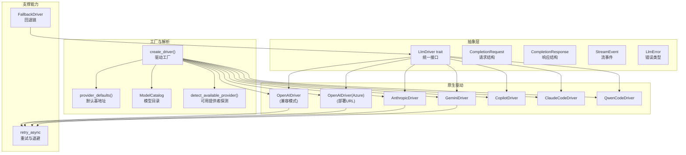
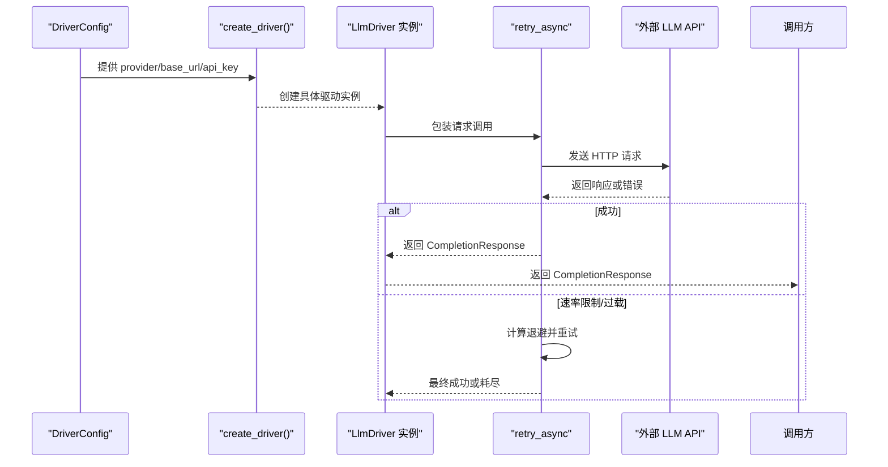
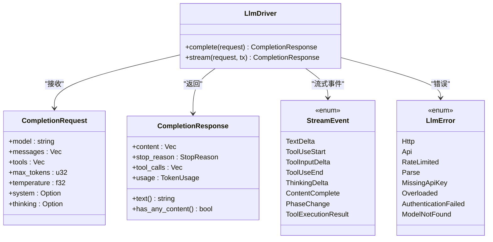
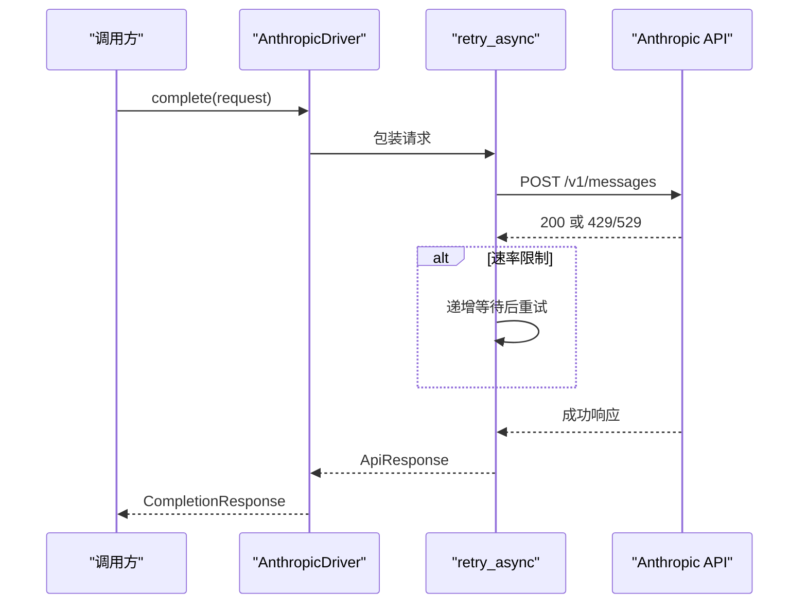
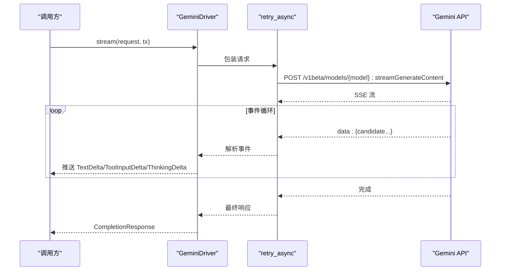
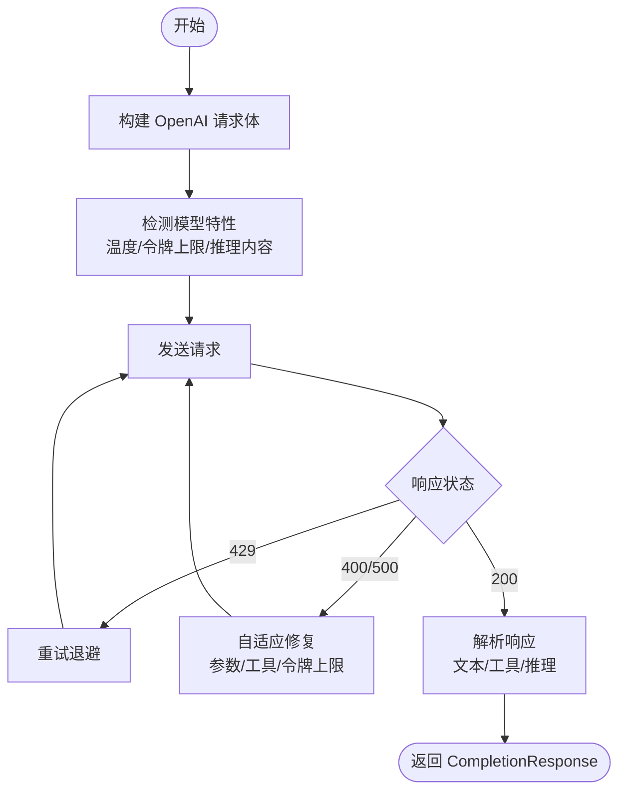
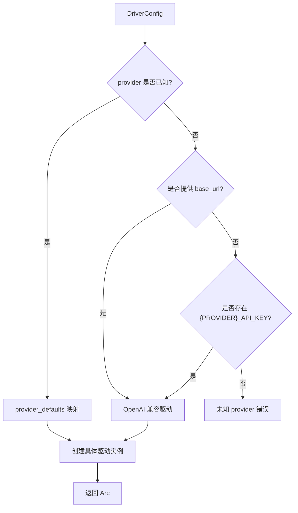
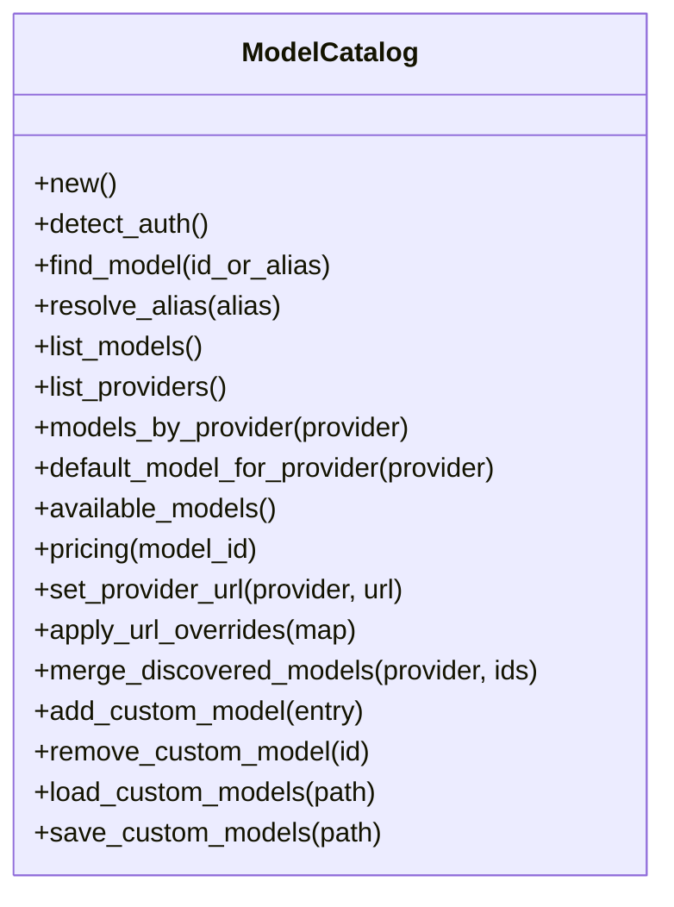
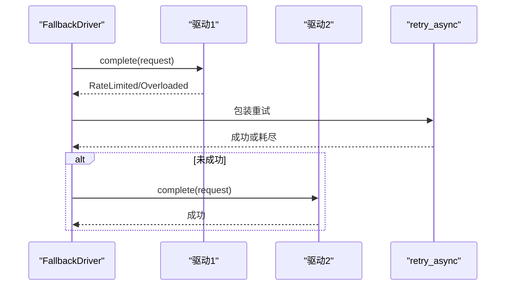
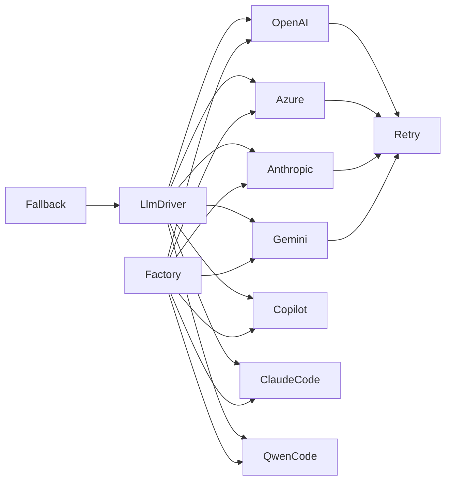

# LLM 驱动抽象

<cite>
**本文档引用的文件**
- [llm_driver.rs](file://crates/openfang-runtime/src/llm_driver.rs)
- [anthropic.rs](file://crates/openfang-runtime/src/drivers/anthropic.rs)
- [gemini.rs](file://crates/openfang-runtime/src/drivers/gemini.rs)
- [openai.rs](file://crates/openfang-runtime/src/drivers/openai.rs)
- [mod.rs](file://crates/openfang-runtime/src/drivers/mod.rs)
- [fallback.rs](file://crates/openfang-runtime/src/drivers/fallback.rs)
- [claude_code.rs](file://crates/openfang-runtime/src/drivers/claude_code.rs)
- [qwen_code.rs](file://crates/openfang-runtime/src/drivers/qwen_code.rs)
- [copilot.rs](file://crates/openfang-runtime/src/drivers/copilot.rs)
- [model_catalog.rs](file://crates/openfang-runtime/src/model_catalog.rs)
- [retry.rs](file://crates/openfang-runtime/src/retry.rs)
</cite>

## 目录
1. [简介](#简介)
2. [项目结构](#项目结构)
3. [核心组件](#核心组件)
4. [架构总览](#架构总览)
5. [详细组件分析](#详细组件分析)
6. [依赖关系分析](#依赖关系分析)
7. [性能考虑](#性能考虑)
8. [故障排除指南](#故障排除指南)
9. [结论](#结论)

## 简介
本文件系统性阐述 OpenFang Runtime 中的 LLM 驱动抽象与实现，重点覆盖：
- LlmDriver trait 的统一接口设计、异步消息发送、流式响应处理与错误类型体系
- 三大原生驱动实现：AnthropicDriver（Claude 特定功能）、GeminiDriver（Google Gemini API）、OpenAiCompatDriver（OpenAI 兼容 API）
- 模型目录系统、驱动配置、代理驱动解析与重试限流机制
- 驱动选择策略与性能优化建议

## 项目结构
OpenFang Runtime 将 LLM 抽象与具体实现解耦，通过统一 trait 与配置驱动工厂函数完成多提供商适配。关键模块如下：
- 抽象层：LlmDriver trait、请求/响应数据结构、流事件枚举、错误类型
- 原生驱动：Anthropic、Gemini、OpenAI 兼容、Azure OpenAI、Copilot、本地 CLI（Claude/Qwen Code）
- 工厂与解析：按 provider 自动解析驱动、环境变量探测、默认基地址映射
- 支撑能力：模型目录、认证状态检测、重试与退避、回退驱动链

**图表来源**
- [llm_driver.rs:145-171](file://crates/openfang-runtime/src/llm_driver.rs#L145-L171)
- [anthropic.rs:155-554](file://crates/openfang-runtime/src/drivers/anthropic.rs#L155-L554)
- [gemini.rs:499-800](file://crates/openfang-runtime/src/drivers/gemini.rs#L499-L800)
- [openai.rs:266-745](file://crates/openfang-runtime/src/drivers/openai.rs#L266-L745)
- [mod.rs:257-456](file://crates/openfang-runtime/src/drivers/mod.rs#L257-L456)
- [model_catalog.rs:54-103](file://crates/openfang-runtime/src/model_catalog.rs#L54-L103)
- [retry.rs:123-202](file://crates/openfang-runtime/src/retry.rs#L123-L202)
- [fallback.rs:36-114](file://crates/openfang-runtime/src/drivers/fallback.rs#L36-L114)

**章节来源**
- [llm_driver.rs:1-327](file://crates/openfang-runtime/src/llm_driver.rs#L1-L327)
- [mod.rs:1-858](file://crates/openfang-runtime/src/drivers/mod.rs#L1-L858)

## 核心组件
- LlmDriver trait：定义统一的同步/异步完成接口与可选的流式接口，默认流式实现将非流式结果转换为增量事件。
- CompletionRequest/CompletionResponse：标准化请求参数（模型、消息、工具、采样温度等）与响应内容（文本/思考/工具调用/用量统计）。
- StreamEvent：流式事件集合，覆盖文本增量、工具开始/输入增量/结束、思考增量、完整响应完成、阶段变化等。
- LlmError：统一错误类型，涵盖 HTTP 错误、API 错误、速率限制、解析失败、鉴权失败、模型不存在、过载等。

这些组件共同构成跨提供商的统一抽象，屏蔽不同 API 的差异性。

**章节来源**
- [llm_driver.rs:11-171](file://crates/openfang-runtime/src/llm_driver.rs#L11-L171)

## 架构总览
下图展示从配置到具体驱动执行的关键路径，以及重试与回退策略的集成点。

**图表来源**
- [mod.rs:257-456](file://crates/openfang-runtime/src/drivers/mod.rs#L257-L456)
- [retry.rs:123-202](file://crates/openfang-runtime/src/retry.rs#L123-L202)
- [anthropic.rs:157-260](file://crates/openfang-runtime/src/drivers/anthropic.rs#L157-L260)
- [gemini.rs:501-581](file://crates/openfang-runtime/src/drivers/gemini.rs#L501-L581)
- [openai.rs:268-372](file://crates/openfang-runtime/src/drivers/openai.rs#L268-L372)

## 详细组件分析

### LlmDriver 抽象与错误体系
- 统一接口：complete(stream) 定义了同步与流式两种调用方式；默认流式实现会将非流式响应转换为 TextDelta 与 ContentComplete 事件。
- CompletionRequest：包含模型标识、消息列表、工具定义、最大生成长度、采样温度、系统提示、思维配置等。
- CompletionResponse：包含内容块（文本/思考/工具使用/图片等）、停止原因、工具调用列表、Token 使用统计。
- StreamEvent：覆盖文本增量、工具开始/输入增量/结束、思考增量、完整响应完成、阶段变化等事件类型。
- LlmError：涵盖 HTTP、API、速率限制、解析、鉴权失败、模型不存在、过载等错误场景，并提供重试时间提示。

**图表来源**
- [llm_driver.rs:145-171](file://crates/openfang-runtime/src/llm_driver.rs#L145-L171)
- [llm_driver.rs:51-107](file://crates/openfang-runtime/src/llm_driver.rs#L51-L107)
- [llm_driver.rs:110-143](file://crates/openfang-runtime/src/llm_driver.rs#L110-L143)
- [llm_driver.rs:12-49](file://crates/openfang-runtime/src/llm_driver.rs#L12-L49)

**章节来源**
- [llm_driver.rs:1-327](file://crates/openfang-runtime/src/llm_driver.rs#L1-L327)

### AnthropicDriver（Claude 特定功能）
- 协议与特性：遵循 Anthropic Messages API，支持系统提示提取、工具调用、思维块、SSE 流式传输。
- 请求转换：将通用消息转换为 Anthropic API 的消息结构，过滤系统消息，序列化为 API 请求体。
- 响应转换：解析响应内容块（文本/工具使用/思考），构建 CompletionResponse。
- 流式处理：解析 SSE 事件，逐段推送 TextDelta、ToolInputDelta、ThinkingDelta，最后发送 ContentComplete。
- 错误处理：对 429/529 进行指数退避重试，解析错误体并映射为 LlmError。
- 认证：通过 x-api-key 头部传递 API Key，使用固定版本头以确保兼容性。

**图表来源**
- [anthropic.rs:155-260](file://crates/openfang-runtime/src/drivers/anthropic.rs#L155-L260)
- [anthropic.rs:262-553](file://crates/openfang-runtime/src/drivers/anthropic.rs#L262-L553)

**章节来源**
- [anthropic.rs:1-696](file://crates/openfang-runtime/src/drivers/anthropic.rs#L1-L696)

### GeminiDriver（Google Gemini API）
- 协议与特性：遵循 generateContent API，使用 x-goog-api-key 头部，系统指令通过 systemInstruction 字段，工具定义在 tools[].functionDeclarations。
- 请求转换：将通用消息转换为 Gemini contents[] 结构，保留思考签名（thought_signature）以满足特定模型要求。
- 响应转换：解析 candidates[0].content.parts[]，识别文本、函数调用、思考块，构建 CompletionResponse。
- 流式处理：解析 SSE 数据流，逐段推送 TextDelta、ToolInputDelta、ThinkingDelta，最后发送 ContentComplete。
- 错误处理：对 429/503 进行重试，解析多种错误格式，区分鉴权失败与模型不存在等场景。

**图表来源**
- [gemini.rs:583-770](file://crates/openfang-runtime/src/drivers/gemini.rs#L583-L770)
- [gemini.rs:771-800](file://crates/openfang-runtime/src/drivers/gemini.rs#L771-L800)

**章节来源**
- [gemini.rs:1-800](file://crates/openfang-runtime/src/drivers/gemini.rs#L1-L800)

### OpenAiCompatDriver（OpenAI 兼容 API）
- 协议与特性：兼容 OpenAI Chat Completions 格式，支持 Azure OpenAI 部署 URL 与 api-key 头部。
- 模型适配：针对 o-series、GPT-5、Moonshot/Kimi、DeepSeek-R1 等特殊模型自动调整参数（如 max_tokens/max_completion_tokens、温度、禁用推理内容等）。
- 请求转换：将通用消息转换为 OpenAI messages[]，支持多模态内容（文本/图片）、工具调用、推理内容。
- 响应转换：解析 choices[0].message，提取文本、工具调用、推理内容，合成 CompletionResponse。
- 流式处理：解析 OpenAI 风格的流式事件，推送 TextDelta、ToolInputDelta、ThinkingDelta，最后发送 ContentComplete。
- 错误处理：对 429 进行重试；针对特定错误（如工具调用失败、参数不支持、模型限制）进行自适应修复与降级。

**图表来源**
- [openai.rs:266-372](file://crates/openfang-runtime/src/drivers/openai.rs#L266-L372)
- [openai.rs:372-745](file://crates/openfang-runtime/src/drivers/openai.rs#L372-L745)

**章节来源**
- [openai.rs:1-800](file://crates/openfang-runtime/src/drivers/openai.rs#L1-L800)

### 驱动工厂与代理解析
- create_driver：根据 provider 名称与配置，解析 API Key、基地址与认证方式，创建对应驱动实例。支持 Anthropic、Gemini、OpenAI、Azure OpenAI、Copilot、Claude/Qwen Code CLI 等。
- provider_defaults：为已知 provider 提供默认基地址与环境变量名，部分 provider 不需要 API Key（如本地 CLI）。
- detect_available_provider：按优先级扫描环境变量，返回第一个可用的 provider、默认模型与环境变量名。
- 已知提供者列表：包含 37 种以上提供商，覆盖云厂商、开源网关、本地推理等。

**图表来源**
- [mod.rs:257-456](file://crates/openfang-runtime/src/drivers/mod.rs#L257-L456)

**章节来源**
- [mod.rs:1-858](file://crates/openfang-runtime/src/drivers/mod.rs#L1-L858)

### 模型目录系统与认证检测
- 模型目录：内置 130+ 模型条目，支持别名解析、分页查询、按提供商筛选、默认模型推导、价格查询等。
- 认证检测：遍历已知提供商，检查其 API Key 环境变量存在性；对特殊 CLI 提供商检测 CLI 可用性；支持设置自定义基地址并重新检测。
- 动态合并：支持从本地发现合并模型、运行时添加/删除自定义模型、持久化自定义模型清单。

**图表来源**
- [model_catalog.rs:20-361](file://crates/openfang-runtime/src/model_catalog.rs#L20-L361)

**章节来源**
- [model_catalog.rs:1-800](file://crates/openfang-runtime/src/model_catalog.rs#L1-L800)

### 回退驱动与重试限流
- FallbackDriver：按顺序尝试多个驱动，遇到速率限制/过载则继续下一个，直到成功或全部失败。
- retry_async：通用重试器，支持最大尝试次数、最小/最大延迟、抖动、错误谓词与提示延迟（如 API 返回的 retry-after）。

**图表来源**
- [fallback.rs:36-114](file://crates/openfang-runtime/src/drivers/fallback.rs#L36-L114)
- [retry.rs:123-202](file://crates/openfang-runtime/src/retry.rs#L123-L202)

**章节来源**
- [fallback.rs:1-249](file://crates/openfang-runtime/src/drivers/fallback.rs#L1-L249)
- [retry.rs:1-514](file://crates/openfang-runtime/src/retry.rs#L1-L514)

### 专用驱动：Copilot、Claude/Qwen Code CLI
- CopilotDriver：基于 GitHub PAT 自动交换 Copilot API Token，缓存并刷新，随后委托 OpenAI 兼容驱动调用。
- ClaudeCodeDriver/QwenCodeDriver：通过子进程调用本地 CLI，支持打印模式与流式输出，安全地清理敏感环境变量，带超时保护与权限跳过选项。

**章节来源**
- [copilot.rs:162-243](file://crates/openfang-runtime/src/drivers/copilot.rs#L162-L243)
- [claude_code.rs:55-590](file://crates/openfang-runtime/src/drivers/claude_code.rs#L55-L590)
- [qwen_code.rs:45-414](file://crates/openfang-runtime/src/drivers/qwen_code.rs#L45-L414)

## 依赖关系分析
- 耦合与内聚：LlmDriver 将各驱动与上层调用解耦；驱动内部对第三方 API 的差异通过转换函数隔离。
- 直接依赖：各驱动依赖 http 客户端、JSON 序列化、日志追踪；工厂依赖模型目录与环境变量。
- 间接依赖：重试器被所有驱动复用；回退驱动组合多个具体驱动形成弹性链路。
- 外部依赖：Anthropic、Google、OpenAI 兼容服务；GitHub Copilot 令牌交换；本地 CLI 工具。

**图表来源**
- [mod.rs:257-456](file://crates/openfang-runtime/src/drivers/mod.rs#L257-L456)
- [anthropic.rs:155-260](file://crates/openfang-runtime/src/drivers/anthropic.rs#L155-L260)
- [gemini.rs:501-581](file://crates/openfang-runtime/src/drivers/gemini.rs#L501-L581)
- [openai.rs:268-372](file://crates/openfang-runtime/src/drivers/openai.rs#L268-L372)
- [fallback.rs:36-114](file://crates/openfang-runtime/src/drivers/fallback.rs#L36-L114)
- [retry.rs:123-202](file://crates/openfang-runtime/src/retry.rs#L123-L202)

**章节来源**
- [mod.rs:1-858](file://crates/openfang-runtime/src/drivers/mod.rs#L1-L858)

## 性能考虑
- 选择合适的驱动与模型：优先选择支持流式的驱动（Anthropic/Gemini/OpenAI），减少首字节延迟。
- 参数优化：合理设置 max_tokens、temperature；对推理类模型避免传入不支持的温度值。
- 重试策略：使用默认的指数退避与抖动，避免雪崩效应；对速率限制/过载场景启用回退链。
- 本地 CLI：在低延迟网络或离线场景下，使用 Claude/Qwen Code CLI 可减少网络往返。
- 模型目录：通过模型目录预加载与别名解析，减少运行时查找开销。

## 故障排除指南
- 缺少 API Key：检查对应 PROVIDER_API_KEY 环境变量是否设置；Azure 需要 base_url。
- 速率限制/过载：观察 LlmError 中的重试时间提示；适当降低并发或启用回退链。
- 鉴权失败：确认 API Key 有效且未过期；Copilot 需要 GitHub PAT 正确交换。
- 模型不存在：核对模型 ID 与提供商是否匹配；使用模型目录查询可用模型。
- 流式异常：检查驱动是否支持流式；确保网络稳定与超时设置合理。
- 本地 CLI 问题：确认 CLI 已安装并认证；必要时使用跳过权限选项；监控超时并及时终止。

**章节来源**
- [llm_driver.rs:12-49](file://crates/openfang-runtime/src/llm_driver.rs#L12-L49)
- [mod.rs:458-512](file://crates/openfang-runtime/src/drivers/mod.rs#L458-L512)
- [retry.rs:123-202](file://crates/openfang-runtime/src/retry.rs#L123-L202)

## 结论
OpenFang 的 LLM 驱动抽象通过统一的 LlmDriver 接口与完善的错误/流式/重试/回退机制，实现了对多家 LLM 提供商的一致接入。结合模型目录与驱动工厂，用户可以灵活选择与切换驱动，同时获得稳健的性能与可观测性。建议在生产环境中启用回退链与合理的重试策略，并根据模型特性调整参数以获得最佳效果。