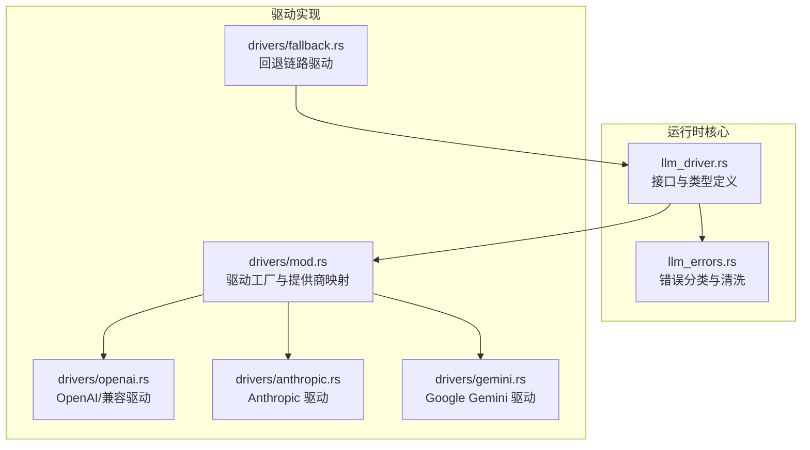
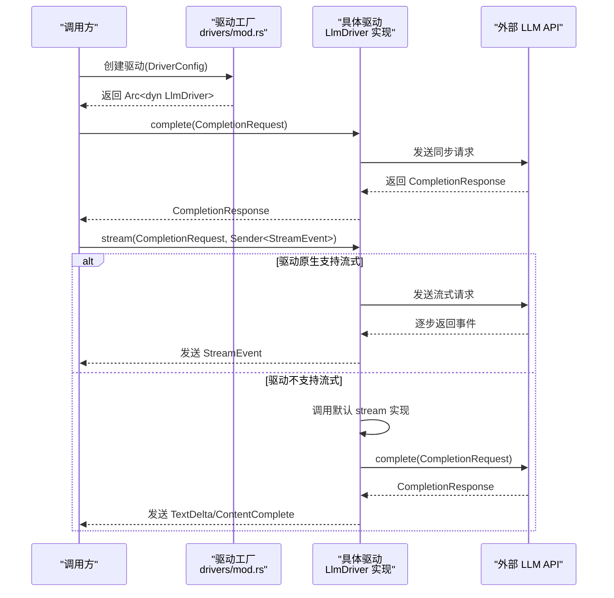
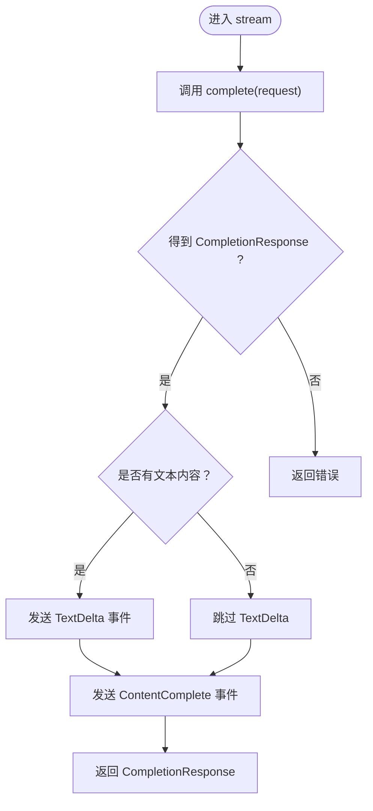
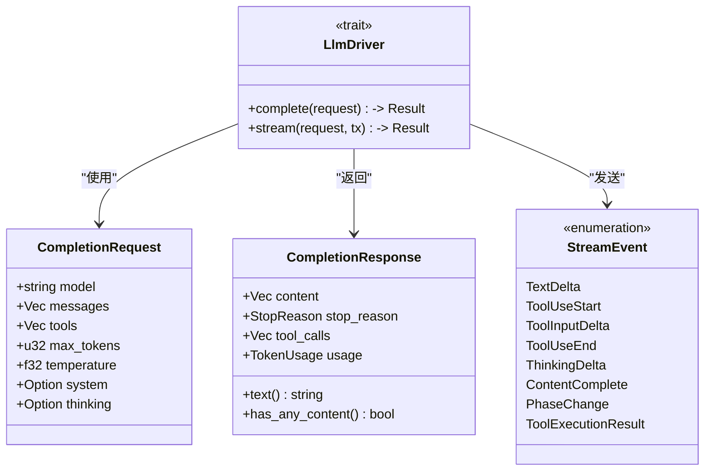
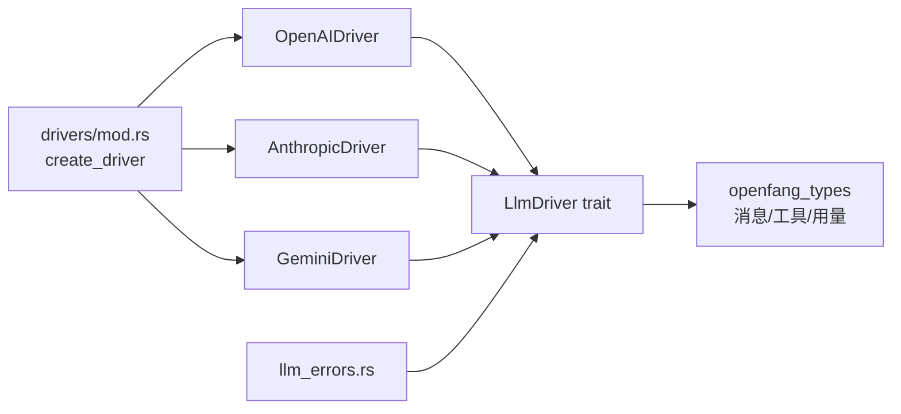

# LLM 驱动接口

<cite>
**本文引用的文件**
- [llm_driver.rs](file://crates/openfang-runtime/src/llm_driver.rs)
- [drivers/mod.rs](file://crates/openfang-runtime/src/drivers/mod.rs)
- [openai.rs](file://crates/openfang-runtime/src/drivers/openai.rs)
- [anthropic.rs](file://crates/openfang-runtime/src/drivers/anthropic.rs)
- [gemini.rs](file://crates/openfang-runtime/src/drivers/gemini.rs)
- [fallback.rs](file://crates/openfang-runtime/src/drivers/fallback.rs)
- [llm_errors.rs](file://crates/openfang-runtime/src/llm_errors.rs)
</cite>

## 目录
1. [简介](#简介)
2. [项目结构](#项目结构)
3. [核心组件](#核心组件)
4. [架构总览](#架构总览)
5. [详细组件分析](#详细组件分析)
6. [依赖关系分析](#依赖关系分析)
7. [性能考量](#性能考量)
8. [故障排查指南](#故障排查指南)
9. [结论](#结论)
10. [附录](#附录)

## 简介
本文件面向 LLM 驱动接口的设计与实现，围绕 LlmDriver trait 的三个核心方法 complete（同步消息发送）、stream（流式消息发送）与默认回退实现进行系统化说明，并对 CompletionRequest、CompletionResponse 与 StreamEvent 的数据模型进行深入解析。同时提供接口实现指南、最佳实践、错误分类与处理策略，以及默认流式回退机制与自定义实现策略。

## 项目结构
- 接口与类型定义集中在运行时模块中：
  - LlmDriver trait、CompletionRequest/Response、StreamEvent、DriverConfig 与错误类型均在运行时源码中定义。
  - 具体驱动实现位于 drivers 子模块，覆盖 Anthropic、OpenAI 兼容、Google Gemini、Azure OpenAI、本地推理等。
  - 错误分类与清洗逻辑位于独立模块，统一处理多提供商的错误语义。

图表来源
- [llm_driver.rs:1-327](file://crates/openfang-runtime/src/llm_driver.rs#L1-L327)
- [drivers/mod.rs:1-858](file://crates/openfang-runtime/src/drivers/mod.rs#L1-L858)
- [openai.rs:1-200](file://crates/openfang-runtime/src/drivers/openai.rs#L1-L200)
- [anthropic.rs:1-200](file://crates/openfang-runtime/src/drivers/anthropic.rs#L1-L200)
- [gemini.rs:1-200](file://crates/openfang-runtime/src/drivers/gemini.rs#L1-L200)
- [fallback.rs:1-200](file://crates/openfang-runtime/src/drivers/fallback.rs#L1-L200)
- [llm_errors.rs:1-800](file://crates/openfang-runtime/src/llm_errors.rs#L1-L800)

章节来源
- [llm_driver.rs:1-327](file://crates/openfang-runtime/src/llm_driver.rs#L1-L327)
- [drivers/mod.rs:1-858](file://crates/openfang-runtime/src/drivers/mod.rs#L1-L858)

## 核心组件
- LlmDriver trait：抽象统一的 LLM 调用接口，定义 complete 与 stream 两个异步方法，以及可选的 key_required 检测（通过 create_driver 的配置与环境变量检查体现）。
- CompletionRequest/CompletionResponse：请求与响应的数据模型，承载消息、工具、温度、最大令牌数、思考模式、停止原因与用量统计等。
- StreamEvent：流式事件模型，支持文本增量、工具调用开始/输入增量/结束、思考增量、内容完成、阶段变化与工具执行结果等事件。
- DriverConfig：驱动配置，包含提供商名称、API Key、基础 URL、跳过权限提示等。
- 错误体系：统一的 LlmError 枚举与分类器，支持速率限制、过载、超时、计费、认证、上下文溢出、格式错误、模型不存在等分类。

章节来源
- [llm_driver.rs:11-171](file://crates/openfang-runtime/src/llm_driver.rs#L11-L171)
- [llm_driver.rs:51-107](file://crates/openfang-runtime/src/llm_driver.rs#L51-L107)
- [llm_driver.rs:109-143](file://crates/openfang-runtime/src/llm_driver.rs#L109-L143)
- [llm_driver.rs:173-207](file://crates/openfang-runtime/src/llm_driver.rs#L173-L207)
- [llm_errors.rs:18-54](file://crates/openfang-runtime/src/llm_errors.rs#L18-L54)

## 架构总览
- 工厂与路由：drivers/mod.rs 提供 create_driver，根据 provider 名称与 DriverConfig 自动选择具体驱动实现；对特殊提供商（如 Anthropic、Gemini、Azure OpenAI、GitHub Copilot 等）进行差异化处理。
- 统一接口：所有驱动实现 LlmDriver trait，确保 complete 与 stream 的一致性行为。
- 流式回退：LlmDriver 默认 stream 实现基于 complete，将完整响应转换为 TextDelta 与 ContentComplete 事件，保证不支持流式的提供商也能发出标准事件序列。
- 错误分类：llm_errors.rs 将原始错误按状态码与消息特征分类，输出可重试性、建议延迟与用户友好信息。

图表来源
- [drivers/mod.rs:257-456](file://crates/openfang-runtime/src/drivers/mod.rs#L257-L456)
- [llm_driver.rs:145-171](file://crates/openfang-runtime/src/llm_driver.rs#L145-L171)

章节来源
- [drivers/mod.rs:257-456](file://crates/openfang-runtime/src/drivers/mod.rs#L257-L456)
- [llm_driver.rs:145-171](file://crates/openfang-runtime/src/llm_driver.rs#L145-L171)

## 详细组件分析

### LlmDriver trait 与默认流式回退
- complete：接收 CompletionRequest，返回 CompletionResponse 或 LlmError。这是所有驱动必须实现的核心方法。
- stream：默认实现基于 complete，先发送一次 TextDelta（若非空），再发送 ContentComplete 事件，最后返回完整 CompletionResponse。该回退确保任何驱动都能发出标准事件序列，便于上层 UI 与代理循环一致消费。
- key_required：通过 create_driver 对不同提供商的 key_required 标志进行判断，结合环境变量与显式配置决定是否报错“缺少 API Key”。

图表来源
- [llm_driver.rs:151-171](file://crates/openfang-runtime/src/llm_driver.rs#L151-L171)

章节来源
- [llm_driver.rs:145-171](file://crates/openfang-runtime/src/llm_driver.rs#L145-L171)
- [drivers/mod.rs:36-231](file://crates/openfang-runtime/src/drivers/mod.rs#L36-L231)

### CompletionRequest 与 CompletionResponse 设计
- CompletionRequest 字段
  - model：模型标识符
  - messages：对话消息列表（含角色、内容块）
  - tools：可用工具定义
  - max_tokens：最大生成令牌数
  - temperature：采样温度
  - system：系统提示（部分 API 需要单独字段）
  - thinking：扩展思考配置（若模型支持）
- CompletionResponse 字段
  - content：内容块列表（文本、思考、工具使用、图片等）
  - stop_reason：停止原因（结束、工具使用、最大令牌、停止序列等）
  - tool_calls：从响应中提取的工具调用
  - usage：Token 使用统计（输入/输出）
- 辅助方法
  - text()：拼接所有文本内容块
  - has_any_content()：判断是否存在非空内容（包括思考块）

图表来源
- [llm_driver.rs:51-107](file://crates/openfang-runtime/src/llm_driver.rs#L51-L107)
- [llm_driver.rs:109-143](file://crates/openfang-runtime/src/llm_driver.rs#L109-L143)
- [llm_driver.rs:145-171](file://crates/openfang-runtime/src/llm_driver.rs#L145-L171)

章节来源
- [llm_driver.rs:51-107](file://crates/openfang-runtime/src/llm_driver.rs#L51-L107)
- [llm_driver.rs:109-143](file://crates/openfang-runtime/src/llm_driver.rs#L109-L143)
- [llm_driver.rs:145-171](file://crates/openfang-runtime/src/llm_driver.rs#L145-L171)

### StreamEvent 事件系统
- 文本增量：TextDelta
- 工具调用：ToolUseStart、ToolInputDelta、ToolUseEnd
- 思考增量：ThinkingDelta
- 内容完成：ContentComplete（携带 stop_reason 与 usage）
- 阶段变化：PhaseChange（用于 UX 指示）
- 工具执行结果：ToolExecutionResult（由代理循环发出，非 LLM 驱动）

事件系统为前端与代理循环提供细粒度的反馈，支持实时渲染与工具调用解析。

章节来源
- [llm_driver.rs:109-143](file://crates/openfang-runtime/src/llm_driver.rs#L109-L143)

### 驱动工厂与提供商映射
- create_driver：根据 provider 名称与 DriverConfig，自动选择具体驱动实现
  - 特殊处理：Anthropic、Gemini、Azure OpenAI、GitHub Copilot、Codex、Claude Code、Qwen Code 等
  - OpenAI 兼容：除上述外的大多数提供商，统一走 OpenAIDriver
  - 环境变量优先级：显式 api_key > 环境变量 > 自动探测
  - key_required：对需要 API Key 的提供商，若缺失则报错
- known_providers：列出所有已知提供商名称
- detect_available_provider：按优先级探测首个可用提供商

章节来源
- [drivers/mod.rs:257-456](file://crates/openfang-runtime/src/drivers/mod.rs#L257-L456)
- [drivers/mod.rs:458-555](file://crates/openfang-runtime/src/drivers/mod.rs#L458-L555)

### 具体驱动实现要点

#### OpenAI 兼容驱动（OpenAIDriver）
- 支持标准 OpenAI 与 Ollama、vLLM、Groq 等兼容端点
- Azure OpenAI 模式：部署 URL 与 api-key 头部
- 模型特性适配：针对 o 系列、GPT-5、DeepSeek-R1 等模型的温度与令牌上限差异进行处理
- 流式支持：原生 SSE 流式响应，逐段解析并发送相应事件

章节来源
- [openai.rs:1-200](file://crates/openfang-runtime/src/drivers/openai.rs#L1-L200)

#### Anthropic 驱动（AnthropicDriver）
- 原生 Messages API，支持工具调用、系统提示提取与多模态内容
- 流式支持：SSE 流式解析，累积内容块，最终发送 ContentComplete

章节来源
- [anthropic.rs:1-200](file://crates/openfang-runtime/src/drivers/anthropic.rs#L1-L200)
- [anthropic.rs:500-554](file://crates/openfang-runtime/src/drivers/anthropic.rs#L500-L554)

#### Google Gemini 驱动（GeminiDriver）
- 原生 generateContent API，模型在 URL 中指定，使用 x-goog-api-key 头
- 流式支持：SSE 流式生成，解析 parts 并发送事件

章节来源
- [gemini.rs:1-200](file://crates/openfang-runtime/src/drivers/gemini.rs#L1-L200)
- [gemini.rs:583-831](file://crates/openfang-runtime/src/drivers/gemini.rs#L583-L831)

#### 回退驱动（FallbackDriver）
- 顺序尝试多个驱动，遇到速率限制或过载时自动切换下一个
- 支持为每个驱动绑定特定模型名
- 当所有驱动失败时返回最后一个错误

章节来源
- [fallback.rs:1-200](file://crates/openfang-runtime/src/drivers/fallback.rs#L1-L200)

### 错误处理与分类
- LlmError：统一错误枚举，涵盖 HTTP、API、速率限制、解析、缺 Key、过载、认证失败、模型不存在等
- 分类器：按状态码与消息特征进行分类，区分可重试与不可重试错误，提取建议延迟时间
- 用户友好：错误清洗与摘要，避免泄露敏感信息

章节来源
- [llm_driver.rs:11-49](file://crates/openfang-runtime/src/llm_driver.rs#L11-L49)
- [llm_errors.rs:18-54](file://crates/openfang-runtime/src/llm_errors.rs#L18-L54)
- [llm_errors.rs:241-392](file://crates/openfang-runtime/src/llm_errors.rs#L241-L392)

## 依赖关系分析
- LlmDriver 依赖 openfang_types 的消息与工具类型（ContentBlock、Message、StopReason、TokenUsage、ToolDefinition、ToolCall）
- 各驱动依赖 reqwest 进行 HTTP 请求，futures 进行流式处理
- 驱动工厂依赖模型目录常量与环境变量，动态选择驱动
- 错误分类器独立于驱动，统一处理多提供商错误

图表来源
- [llm_driver.rs:5-9](file://crates/openfang-runtime/src/llm_driver.rs#L5-L9)
- [openai.rs:5-13](file://crates/openfang-runtime/src/drivers/openai.rs#L5-L13)
- [anthropic.rs:6-15](file://crates/openfang-runtime/src/drivers/anthropic.rs#L6-L15)
- [gemini.rs:11-20](file://crates/openfang-runtime/src/drivers/gemini.rs#L11-L20)
- [drivers/mod.rs:15-26](file://crates/openfang-runtime/src/drivers/mod.rs#L15-L26)
- [llm_errors.rs:1-12](file://crates/openfang-runtime/src/llm_errors.rs#L1-L12)

章节来源
- [llm_driver.rs:5-9](file://crates/openfang-runtime/src/llm_driver.rs#L5-L9)
- [drivers/mod.rs:15-26](file://crates/openfang-runtime/src/drivers/mod.rs#L15-L26)

## 性能考量
- 流式优先：尽量使用原生流式接口，减少首字节延迟与内存占用
- 可重试策略：对速率限制与过载错误采用指数退避或固定延迟重试
- 上下文控制：合理设置 max_tokens 与 temperature，避免不必要的大模型调用
- 批量与并发：在代理循环中合并小事件，降低 UI 刷新频率

## 故障排查指南
- 缺少 API Key：检查环境变量或显式配置；某些提供商 key_required 为真
- 认证失败：确认 Key 格式正确、未被禁用或过期
- 速率限制/过载：等待建议延迟后重试；必要时启用回退驱动
- 模型不存在：核对模型名称与提供商支持情况
- 请求格式错误：检查消息结构、工具定义与模型特性（如温度限制）
- 网络超时：检查网络连通性与代理设置

章节来源
- [drivers/mod.rs:36-231](file://crates/openfang-runtime/src/drivers/mod.rs#L36-L231)
- [llm_errors.rs:241-392](file://crates/openfang-runtime/src/llm_errors.rs#L241-L392)

## 结论
LlmDriver 接口通过统一的数据模型与事件系统，屏蔽了多家 LLM 提供商的差异，既支持原生流式，也提供了可靠的默认回退机制。配合驱动工厂与错误分类体系，开发者可以快速集成多种提供商，并在复杂场景中实现稳健的容错与用户体验优化。

## 附录

### 接口实现指南与最佳实践
- 实现 complete：严格遵循 CompletionRequest 字段语义，正确处理系统提示、工具定义与模型特性
- 实现 stream：优先使用原生流式接口，逐段解析并发送对应 StreamEvent；若不支持，使用默认回退
- 错误处理：使用统一错误分类器，区分可重试与不可重试错误，提供合理的建议延迟
- 配置管理：优先使用环境变量，其次显式配置；对 key_required 的提供商务必校验
- 事件消费：UI 与代理循环应按事件顺序处理，注意 ContentComplete 作为收尾信号

### 默认流式回退与自定义策略
- 默认回退：当驱动不支持流式时，先发送 TextDelta（若有内容），再发送 ContentComplete，最后返回完整响应
- 自定义策略：可在驱动内部实现更精细的事件拆分（如工具调用开始/输入增量/结束），提升交互体验

章节来源
- [llm_driver.rs:151-171](file://crates/openfang-runtime/src/llm_driver.rs#L151-L171)
- [anthropic.rs:500-554](file://crates/openfang-runtime/src/drivers/anthropic.rs#L500-L554)
- [gemini.rs:583-831](file://crates/openfang-runtime/src/drivers/gemini.rs#L583-L831)