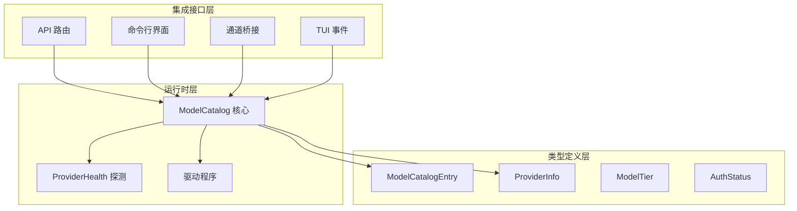
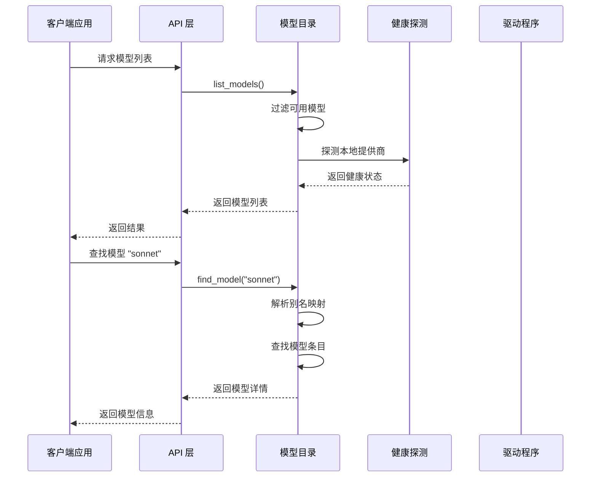
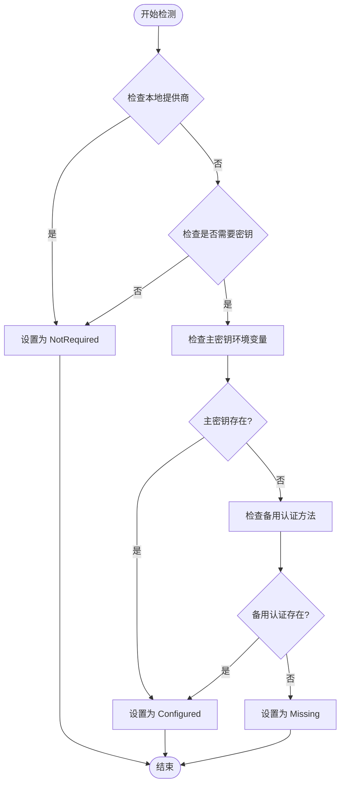
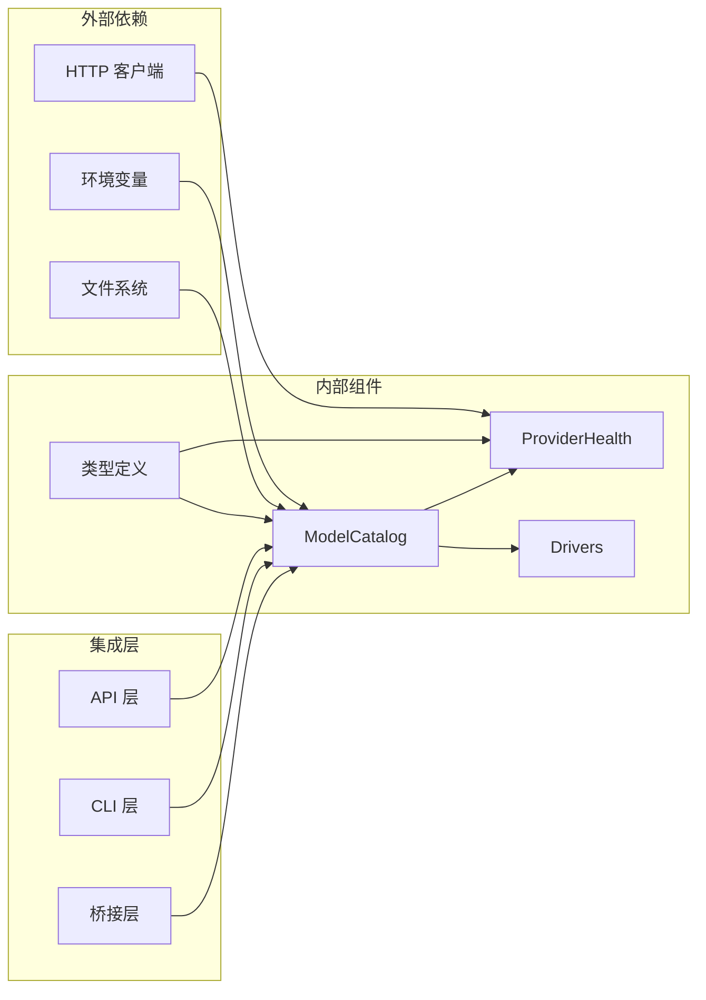

# 模型目录系统

<cite>
**本文档引用的文件**
- [model_catalog.rs](file://crates/openfang-runtime/src/model_catalog.rs)
- [model_catalog.rs](file://crates/openfang-types/src/model_catalog.rs)
- [provider_health.rs](file://crates/openfang-runtime/src/provider_health.rs)
- [channel_bridge.rs](file://crates/openfang-api/src/channel_bridge.rs)
- [routes.rs](file://crates/openfang-api/src/routes.rs)
- [main.rs](file://crates/openfang-cli/src/main.rs)
- [event.rs](file://crates/openfang-cli/src/tui/event.rs)
</cite>

## 目录
1. [简介](#简介)
2. [项目结构](#项目结构)
3. [核心组件](#核心组件)
4. [架构概览](#架构概览)
5. [详细组件分析](#详细组件分析)
6. [依赖关系分析](#依赖关系分析)
7. [性能考虑](#性能考虑)
8. [故障排除指南](#故障排除指南)
9. [结论](#结论)
10. [附录](#附录)

## 简介

模型目录系统是 Openfang 项目的核心基础设施，负责管理 130+ 个内置模型、20+ 个提供商信息和复杂的别名解析机制。该系统提供了统一的模型注册表，支持认证状态检测、定价查询、模型发现和动态配置管理。

系统支持 41 个不同的 AI 提供商，包括主流国际提供商如 OpenAI、Anthropic、Google Gemini 等，以及多家中国本土提供商如阿里云 Qwen、百度文心等。通过智能的别名解析和自动发现机制，用户可以使用自然语言名称或缩写来访问各种模型。

## 项目结构

模型目录系统的代码分布在多个模块中，采用清晰的分层架构：

**图表来源**
- [model_catalog.rs:20-52](file://crates/openfang-runtime/src/model_catalog.rs#L20-L52)
- [model_catalog.rs:120-186](file://crates/openfang-types/src/model_catalog.rs#L120-L186)

**章节来源**
- [model_catalog.rs:1-50](file://crates/openfang-runtime/src/model_catalog.rs#L1-L50)
- [model_catalog.rs:1-50](file://crates/openfang-types/src/model_catalog.rs#L1-L50)

## 核心组件

### 数据结构设计

模型目录系统的核心数据结构包括四个主要组件：

#### 模型目录条目 (ModelCatalogEntry)
每个模型条目包含完整的元数据信息：
- **标识符**: 唯一的模型 ID
- **显示名称**: 用户友好的模型名称
- **提供商**: 所属提供商标识符
- **能力层级**: Frontier、Smart、Balanced、Fast、Local、Custom 六种级别
- **上下文窗口**: 令牌数量限制
- **输出令牌限制**: 最大输出长度
- **成本信息**: 输入和输出每百万令牌的成本
- **功能支持**: 工具调用、视觉理解、流式响应
- **别名列表**: 支持的别名映射

#### 提供商信息 (ProviderInfo)
提供商元数据包含：
- **标识符**: 提供商唯一 ID
- **显示名称**: 用户可见的提供商名称
- **API 密钥环境变量**: 存储密钥的环境变量名
- **基础 URL**: API 端点地址
- **密钥需求**: 是否需要 API 密钥
- **认证状态**: 配置状态检测结果
- **模型数量**: 该提供商的模型总数

#### 能力层级 (ModelTier)
定义了六个模型能力层级：
- **Frontier**: 最先进、最强大的模型
- **Smart**: 智能、性价比高的模型
- **Balanced**: 平衡速度和成本的模型
- **Fast**: 最快、最便宜的模型
- **Local**: 本地部署的模型
- **Custom**: 用户自定义的模型

#### 认证状态 (AuthStatus)
三种认证状态：
- **Configured**: API 密钥已配置
- **Missing**: 缺少 API 密钥
- **NotRequired**: 不需要 API 密钥（本地模型）

**章节来源**
- [model_catalog.rs:65-118](file://crates/openfang-types/src/model_catalog.rs#L65-L118)
- [model_catalog.rs:120-200](file://crates/openfang-types/src/model_catalog.rs#L120-L200)

## 架构概览

模型目录系统采用模块化设计，支持多种集成方式：

**图表来源**
- [model_catalog.rs:110-135](file://crates/openfang-runtime/src/model_catalog.rs#L110-L135)
- [provider_health.rs:99-198](file://crates/openfang-runtime/src/provider_health.rs#L99-L198)

**章节来源**
- [model_catalog.rs:27-103](file://crates/openfang-runtime/src/model_catalog.rs#L27-L103)

## 详细组件分析

### 模型目录核心实现

#### 初始化流程
模型目录在创建时会执行以下初始化步骤：

1. **加载内置模型**: 从内置数据源加载所有预定义的模型条目
2. **构建别名映射**: 自动注册模型条目中定义的别名
3. **统计提供商模型数量**: 为每个提供商计算模型总数
4. **设置默认认证状态**: 初始化所有提供商的认证状态

#### 认证状态检测机制
系统提供智能的认证状态检测，支持多种检测方式：

**图表来源**
- [model_catalog.rs:58-103](file://crates/openfang-runtime/src/model_catalog.rs#L58-L103)

**章节来源**
- [model_catalog.rs:27-52](file://crates/openfang-runtime/src/model_catalog.rs#L27-L52)
- [model_catalog.rs:58-103](file://crates/openfang-runtime/src/model_catalog.rs#L58-L103)

### 别名解析系统

系统实现了复杂的别名解析机制，支持多种查找方式：

#### 查找优先级
1. **直接 ID 匹配**: 精确匹配模型 ID
2. **显示名称匹配**: 支持仪表板/UI 显示名称
3. **别名解析**: 通过别名映射表查找

#### 内置别名映射
系统包含丰富的别名映射，涵盖主要模型的常用缩写：

| 别名类别 | 示例别名 | 对应模型 |
|---------|---------|---------|
| Claude 系列 | sonnet, haiku, opus | Claude Sonnet, Haiku, Opus |
| OpenAI 系列 | gpt4, gpt4o, gpt4-mini | GPT-4 系列模型 |
| Gemini 系列 | flash, gemini-pro | Gemini 闪存和专业版 |
| 本地模型 | llama, mixtral | Llama 和 Mixtral 系列 |

**章节来源**
- [model_catalog.rs:807-897](file://crates/openfang-runtime/src/model_catalog.rs#L807-L897)
- [model_catalog.rs:110-135](file://crates/openfang-runtime/src/model_catalog.rs#L110-L135)

### 动态模型发现

系统支持动态发现本地提供商的模型：

#### 本地提供商探测
- **Ollama**: 通过 `/api/tags` 端点获取模型列表
- **OpenAI 兼容**: 通过 `/models` 端点获取模型列表
- **缓存机制**: 使用 60 秒 TTL 缓存探测结果

#### 探测结果处理
探测返回的结果包含：
- **可达性状态**: 服务器是否可访问
- **延迟时间**: 探测耗时（毫秒）
- **发现的模型**: 本地可用的模型列表
- **错误信息**: 探测失败的原因

**章节来源**
- [provider_health.rs:99-198](file://crates/openfang-runtime/src/provider_health.rs#L99-L198)
- [provider_health.rs:200-215](file://crates/openfang-runtime/src/provider_health.rs#L200-L215)

### 提供商配置管理

系统提供灵活的提供商配置管理功能：

#### 基础 URL 覆盖
允许用户为现有提供商或自定义提供商设置基础 URL：
- **set_provider_url**: 单个提供商 URL 设置
- **apply_url_overrides**: 批量 URL 覆盖应用

#### 自定义提供商支持
当设置未知提供商时，系统会自动创建新的提供商条目：
- 自动生成合适的环境变量名
- 设置默认的认证状态
- 添加到提供商列表中

**章节来源**
- [model_catalog.rs:193-235](file://crates/openfang-runtime/src/model_catalog.rs#L193-L235)
- [model_catalog.rs:4050-4100](file://crates/openfang-runtime/src/model_catalog.rs#L4050-L4100)

## 依赖关系分析

### 组件耦合度
模型目录系统采用松耦合设计，各组件间依赖关系清晰：

**图表来源**
- [model_catalog.rs:6-18](file://crates/openfang-runtime/src/model_catalog.rs#L6-L18)
- [provider_health.rs:10-11](file://crates/openfang-runtime/src/provider_health.rs#L10-L11)

### 外部依赖管理

系统对外部依赖的管理策略：

#### 环境变量依赖
- **API 密钥存储**: 使用标准环境变量名
- **配置灵活性**: 支持自定义环境变量名
- **安全性**: 仅检查存在性，不存储实际密钥值

#### 文件系统交互
- **自定义模型加载**: 支持从 JSON 文件加载自定义模型
- **配置持久化**: 支持保存自定义模型配置
- **路径安全**: 严格的文件存在性检查

**章节来源**
- [model_catalog.rs:330-360](file://crates/openfang-runtime/src/model_catalog.rs#L330-L360)
- [model_catalog.rs:374-415](file://crates/openfang-runtime/src/model_catalog.rs#L374-L415)

## 性能考虑

### 缓存策略
系统采用多层缓存机制优化性能：

#### 探测缓存
- **TTL 设置**: 60 秒缓存过期时间
- **并发安全**: 使用 DashMap 实现线程安全
- **内存效率**: 自动清理过期缓存项

#### 别名解析缓存
- **哈希表查找**: O(1) 时间复杂度的别名查找
- **大小写不敏感**: 统一转换为小写进行查找
- **预构建索引**: 在初始化时构建别名映射表

### 内存优化
- **惰性加载**: 模型数据按需加载
- **共享常量**: 使用静态常量避免重复分配
- **零拷贝操作**: 尽可能使用引用而非复制

## 故障排除指南

### 常见问题诊断

#### 认证状态检测失败
**症状**: 提供商显示为 "Missing" 状态
**解决方案**:
1. 检查环境变量是否正确设置
2. 验证 API 密钥的有效性
3. 对于本地提供商，确认服务正在运行

#### 模型查找失败
**症状**: 使用别名无法找到对应模型
**解决方案**:
1. 验证别名拼写是否正确
2. 检查模型是否在可用模型列表中
3. 确认大小写不敏感匹配是否正常工作

#### 本地模型不可用
**症状**: 本地模型（Ollama、vLLM）显示为不可用
**解决方案**:
1. 确认本地服务进程正在运行
2. 检查网络连接和端口可达性
3. 验证基础 URL 配置是否正确

**章节来源**
- [model_catalog.rs:3765-4209](file://crates/openfang-runtime/src/model_catalog.rs#L3765-L4209)

## 结论

模型目录系统通过精心设计的数据结构和算法，成功实现了对 130+ 个模型和 41 个提供商的统一管理。系统的核心优势包括：

1. **全面的模型覆盖**: 支持国际主流和中国本土提供商
2. **智能别名解析**: 提供自然语言的模型访问体验
3. **灵活的配置管理**: 支持动态配置和自定义扩展
4. **高效的性能表现**: 通过缓存和优化确保快速响应
5. **健壮的错误处理**: 完善的故障诊断和恢复机制

该系统为 Openfang 项目提供了坚实的基础，支持从简单的命令行工具到复杂的 Web 应用的各种使用场景。

## 附录

### 集成点参考

#### API 集成
- **路由定义**: `/api/providers` 和 `/api/models`
- **响应格式**: 标准化的 JSON 数据结构
- **错误处理**: 统一的错误码和消息格式

#### CLI 集成
- **命令行参数**: 支持模型选择和配置
- **配置文件**: TOML 格式的配置文件支持
- **交互模式**: TUI 界面的完整集成

#### 通道桥接
- **多平台支持**: 支持多种通信协议
- **消息格式**: 标准化的消息序列化
- **状态同步**: 实时的状态更新和同步

**章节来源**
- [channel_bridge.rs:217-236](file://crates/openfang-api/src/channel_bridge.rs#L217-L236)
- [routes.rs:5999-6119](file://crates/openfang-api/src/routes.rs#L5999-L6119)
- [main.rs:5196-5384](file://crates/openfang-cli/src/main.rs#L5196-L5384)
- [event.rs:140-1821](file://crates/openfang-cli/src/tui/event.rs#L140-L1821)