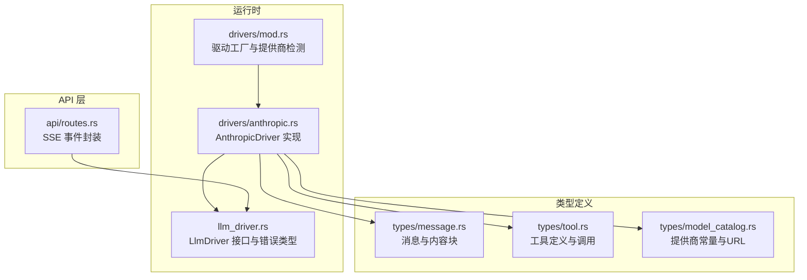
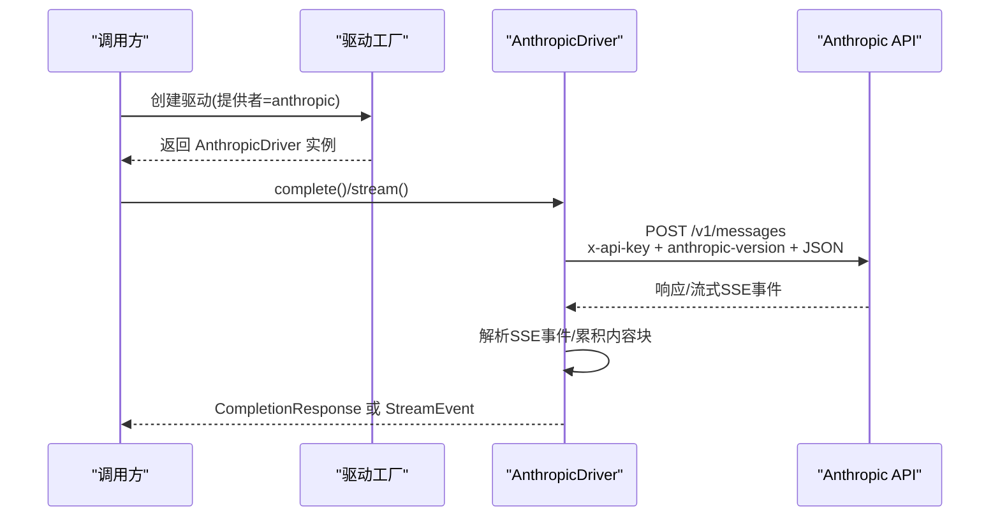
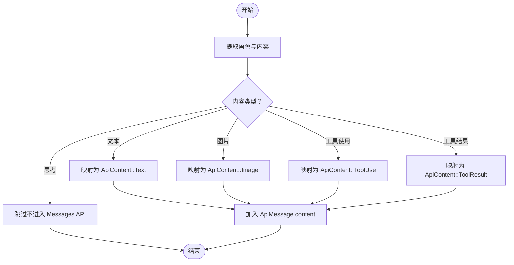
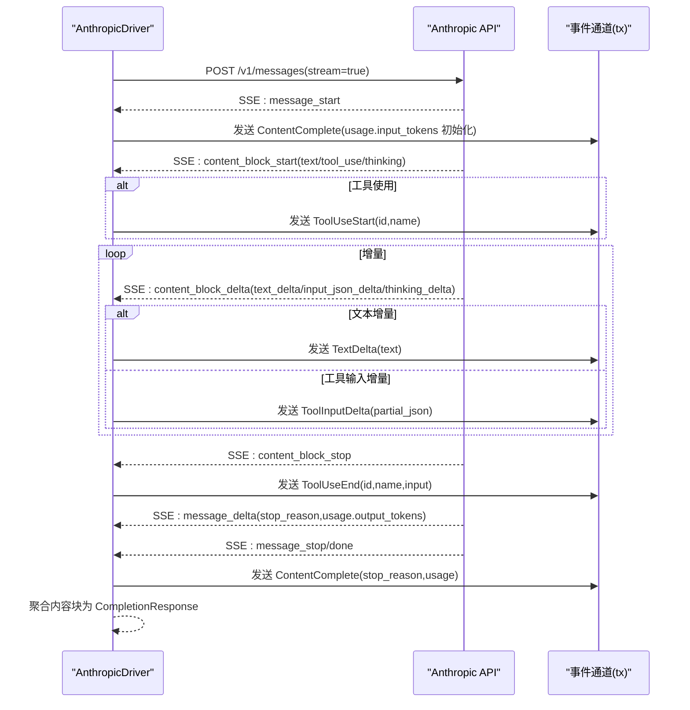
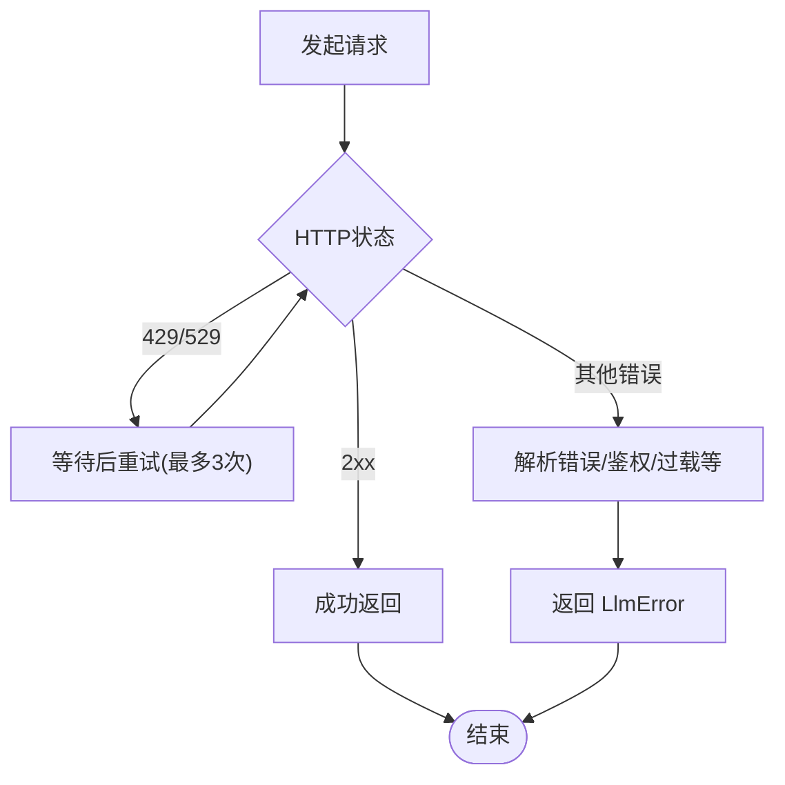
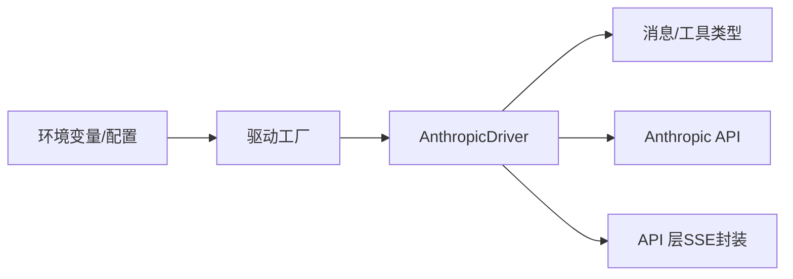

# Anthropic 驱动

<cite>
**本文引用的文件**
- [anthropic.rs](file://crates/openfang-runtime/src/drivers/anthropic.rs)
- [llm_driver.rs](file://crates/openfang-runtime/src/llm_driver.rs)
- [message.rs](file://crates/openfang-types/src/message.rs)
- [tool.rs](file://crates/openfang-types/src/tool.rs)
- [mod.rs](file://crates/openfang-runtime/src/drivers/mod.rs)
- [routes.rs](file://crates/openfang-api/src/routes.rs)
- [model_catalog.rs](file://crates/openfang-types/src/model_catalog.rs)
- [model_catalog.rs](file://crates/openfang-runtime/src/model_catalog.rs)
</cite>

## 目录
1. [简介](#简介)
2. [项目结构](#项目结构)
3. [核心组件](#核心组件)
4. [架构总览](#架构总览)
5. [详细组件分析](#详细组件分析)
6. [依赖关系分析](#依赖关系分析)
7. [性能考量](#性能考量)
8. [故障排查指南](#故障排查指南)
9. [结论](#结论)
10. [附录](#附录)

## 简介
本文件面向 Anthropic 驱动（AnthropicDriver），系统性阐述其在 OpenFang 中对 Claude Messages API 的完整实现，覆盖以下关键能力：
- 内容块处理：文本、图像、工具使用块、思考块（thinking）
- 流式增量响应处理：SSE 事件解析、增量文本、工具输入 JSON 增量更新
- API 配置与认证：x-api-key 头部、Anthropic 版本头部、环境变量与默认基地址
- 错误处理策略：重试（429/529）、解析失败、鉴权失败、模型过载
- 统一停止原因映射：end_turn、tool_use、max_tokens、stop_sequence
- 使用指南与最佳实践：消息转换、流式处理、响应解析示例路径

## 项目结构
Anthropic 驱动位于运行时模块中，作为多提供商驱动之一，通过统一的 LlmDriver 接口对外提供同步与流式两种完成方式。



**图表来源**
- [mod.rs:1-80](file://crates/openfang-runtime/src/drivers/mod.rs#L1-L80)
- [anthropic.rs:1-60](file://crates/openfang-runtime/src/drivers/anthropic.rs#L1-L60)
- [llm_driver.rs:1-120](file://crates/openfang-runtime/src/llm_driver.rs#L1-L120)
- [message.rs:1-120](file://crates/openfang-types/src/message.rs#L1-L120)
- [tool.rs:1-60](file://crates/openfang-types/src/tool.rs#L1-L60)
- [model_catalog.rs:10-35](file://crates/openfang-types/src/model_catalog.rs#L10-L35)
- [routes.rs:1450-1472](file://crates/openfang-api/src/routes.rs#L1450-L1472)

**章节来源**
- [mod.rs:257-274](file://crates/openfang-runtime/src/drivers/mod.rs#L257-L274)
- [anthropic.rs:1-60](file://crates/openfang-runtime/src/drivers/anthropic.rs#L1-L60)
- [llm_driver.rs:145-171](file://crates/openfang-runtime/src/llm_driver.rs#L145-L171)

## 核心组件
- AnthropicDriver：实现 LlmDriver，支持 complete 与 stream 两个方法；负责请求构建、认证头设置、SSE 解析、内容块聚合与停止原因映射。
- CompletionRequest/CompletionResponse：统一的请求与响应数据结构，支持内容块、工具调用与令牌用量。
- StreamEvent：流式事件枚举，用于向外部发送增量文本、工具开始/结束、思考增量、内容完成等事件。
- ProviderDefaults/驱动工厂：根据 provider 名称选择 AnthropicDriver，并从环境变量或默认基地址获取 API Key 与 Base URL。

**章节来源**
- [anthropic.rs:156-554](file://crates/openfang-runtime/src/drivers/anthropic.rs#L156-L554)
- [llm_driver.rs:51-143](file://crates/openfang-runtime/src/llm_driver.rs#L51-L143)
- [mod.rs:257-274](file://crates/openfang-runtime/src/drivers/mod.rs#L257-L274)

## 架构总览
AnthropicDriver 在驱动工厂中被识别为“anthropic”，随后从环境变量读取 ANTHROPIC_API_KEY 并结合默认基地址构造请求。流式模式下，驱动解析来自 API 的 SSE 事件，按块累积内容并发出统一的 StreamEvent。



**图表来源**
- [mod.rs:257-274](file://crates/openfang-runtime/src/drivers/mod.rs#L257-L274)
- [anthropic.rs:201-260](file://crates/openfang-runtime/src/drivers/anthropic.rs#L201-L260)
- [anthropic.rs:308-352](file://crates/openfang-runtime/src/drivers/anthropic.rs#L308-L352)

## 详细组件分析

### AnthropicDriver 类与数据结构
- 结构体字段：API Key（零化内存）、Base URL、HTTP 客户端
- 关键内部结构：
  - ApiRequest/ApiMessage/ApiContent/ApiContentBlock：请求侧序列化结构，支持文本、图像、工具使用、工具结果
  - ApiResponse/ResponseContentBlock：响应侧反序列化结构，支持文本、工具使用、思考
  - ContentBlockAccum：流式阶段的内容块累积器，支持文本、思考、工具使用（含增量 JSON）

```mermaid
classDiagram
class AnthropicDriver {
-api_key : String(Zeroized)
-base_url : String
-client : reqwest : : Client
+complete(request) -> CompletionResponse
+stream(request, tx) -> CompletionResponse
}
class ApiRequest {
+model : String
+max_tokens : u32
+system : Option<String>
+messages : Vec<ApiMessage>
+tools : Vec<ApiTool>
+temperature : Option<f32>
+stream : bool
}
class ApiMessage {
+role : String
+content : ApiContent
}
class ApiContent {
<<enum>>
Text(String)
Blocks(Vec<ApiContentBlock>)
}
class ApiContentBlock {
<<enum>>
Text{text : String}
Image{source : ApiImageSource}
ToolUse{id : String, name : String, input : Value}
ToolResult{tool_use_id : String, content : String, is_error : bool}
}
class ApiResponse {
+content : Vec<ResponseContentBlock>
+stop_reason : String
+usage : ApiUsage
}
class ResponseContentBlock {
<<enum>>
Text{text : String}
ToolUse{id : String, name : String, input : Value}
Thinking{thinking : String}
}
AnthropicDriver --> ApiRequest : "构建请求"
AnthropicDriver --> ApiResponse : "解析响应"
ApiRequest --> ApiMessage
ApiMessage --> ApiContent
ApiContent --> ApiContentBlock
ApiResponse --> ResponseContentBlock
```

**图表来源**
- [anthropic.rs:18-131](file://crates/openfang-runtime/src/drivers/anthropic.rs#L18-L131)

**章节来源**
- [anthropic.rs:18-131](file://crates/openfang-runtime/src/drivers/anthropic.rs#L18-L131)

### 内容块处理（文本、图像、工具使用、思考）
- 请求侧转换：
  - 文本：直接映射为 ApiContent::Text
  - 图像：映射为 ApiContentBlock::Image，包含媒体类型与 base64 数据
  - 工具使用：映射为 ApiContentBlock::ToolUse，携带 id/name/input
  - 工具结果：映射为 ApiContentBlock::ToolResult，携带 tool_use_id/content/is_error
  - 思考块：在请求侧被过滤（不进入 Messages API）
- 响应侧转换：
  - 文本：映射为 ContentBlock::Text
  - 工具使用：映射为 ContentBlock::ToolUse，并收集 ToolCall
  - 思考：映射为 ContentBlock::Thinking



**图表来源**
- [anthropic.rs:556-609](file://crates/openfang-runtime/src/drivers/anthropic.rs#L556-L609)

**章节来源**
- [anthropic.rs:556-609](file://crates/openfang-runtime/src/drivers/anthropic.rs#L556-L609)
- [message.rs:36-96](file://crates/openfang-types/src/message.rs#L36-L96)

### 流式增量响应处理与 SSE 事件解析
- 请求头：x-api-key、anthropic-version、content-type
- SSE 事件解析：
  - message_start：初始化输入令牌用量
  - content_block_start：按块类型（text/tool_use/thinking）初始化累积器并发出 ToolUseStart
  - content_block_delta：按块类型分发 text_delta/input_json_delta/thinking_delta，分别发出 TextDelta/ToolInputDelta/思考增量
  - content_block_stop：当工具使用块结束时，解析累积的 input_json 为 JSON 并发出 ToolUseEnd
  - message_delta：更新 stop_reason 与输出令牌用量
  - 其他事件（如 message_stop/ping）忽略
- 聚合与收尾：遍历累积器，生成 CompletionResponse，发出 ContentComplete（含 stop_reason 与 usage）



**图表来源**
- [anthropic.rs:353-503](file://crates/openfang-runtime/src/drivers/anthropic.rs#L353-L503)
- [anthropic.rs:409-484](file://crates/openfang-runtime/src/drivers/anthropic.rs#L409-L484)

**章节来源**
- [anthropic.rs:353-503](file://crates/openfang-runtime/src/drivers/anthropic.rs#L353-L503)
- [anthropic.rs:409-484](file://crates/openfang-runtime/src/drivers/anthropic.rs#L409-L484)

### 工具调用输入 JSON 增量更新
- 输入增量通过 content_block_delta 的 input_json_delta 字段传输
- 驱动在对应块内累积字符串，同时发出 ToolInputDelta 事件
- 当 content_block_stop 触发时，将累积的 input_json 反序列化为 JSON 对象，发出 ToolUseEnd

**章节来源**
- [anthropic.rs:438-452](file://crates/openfang-runtime/src/drivers/anthropic.rs#L438-L452)
- [anthropic.rs:466-484](file://crates/openfang-runtime/src/drivers/anthropic.rs#L466-L484)

### 停止原因映射（统一 ToolUse 映射）
- 将 Claude 的 stop_reason 映射到统一 StopReason：
  - end_turn → EndTurn
  - tool_use → ToolUse
  - max_tokens → MaxTokens
  - stop_sequence → StopSequence
- 流式与非流式均进行该映射，确保上层逻辑一致

**章节来源**
- [anthropic.rs:487-494](file://crates/openfang-runtime/src/drivers/anthropic.rs#L487-L494)
- [anthropic.rs:639-645](file://crates/openfang-runtime/src/drivers/anthropic.rs#L639-L645)

### API 配置与认证机制
- 认证：
  - 必需头：x-api-key（从环境变量 ANTHROPIC_API_KEY 获取）
  - 版本头：anthropic-version（固定值）
- 基地址与提供商：
  - 默认基地址：https://api.anthropic.com
  - 驱动工厂：当 provider=anthropic 时，优先从配置或环境变量读取 API Key，并使用默认基地址
- 环境变量与默认 URL：
  - ANTHROPIC_API_KEY
  - ANTHROPIC_BASE_URL

**章节来源**
- [anthropic.rs:201-213](file://crates/openfang-runtime/src/drivers/anthropic.rs#L201-L213)
- [mod.rs:257-274](file://crates/openfang-runtime/src/drivers/mod.rs#L257-L274)
- [model_catalog.rs:10-11](file://crates/openfang-types/src/model_catalog.rs#L10-L11)

### 错误处理策略
- 重试：对 429/529 状态码进行最多 3 次指数回退重试
- 鉴权/格式/模型未找到：解析 API 错误响应，返回标准化 LlmError
- 解析失败：对响应体 JSON 解析失败返回 Parse 错误
- 过载：5xx/特定过载状态映射为 Overloaded



**图表来源**
- [anthropic.rs:201-254](file://crates/openfang-runtime/src/drivers/anthropic.rs#L201-L254)

**章节来源**
- [anthropic.rs:201-254](file://crates/openfang-runtime/src/drivers/anthropic.rs#L201-L254)
- [llm_driver.rs:11-49](file://crates/openfang-runtime/src/llm_driver.rs#L11-L49)

### 与 API 层的 SSE 事件对接
- API 层将统一的 StreamEvent 转换为标准 SSE 事件：
  - TextDelta → event="chunk"，数据包含 content 与 done=false
  - ToolUseStart → event="tool_use"，数据包含 tool
  - ToolUseEnd → event="tool_result"，数据包含 tool 与 input
  - ContentComplete → event="done"，数据包含 done=true 与 usage

**章节来源**
- [routes.rs:1450-1472](file://crates/openfang-api/src/routes.rs#L1450-L1472)

## 依赖关系分析
- 驱动工厂依赖提供商默认配置与环境变量，决定是否创建 AnthropicDriver
- AnthropicDriver 依赖统一的消息与工具类型，确保跨提供商的一致性
- API 层依赖统一的 StreamEvent，将驱动产生的事件转换为 SSE



**图表来源**
- [mod.rs:257-274](file://crates/openfang-runtime/src/drivers/mod.rs#L257-L274)
- [anthropic.rs:1-60](file://crates/openfang-runtime/src/drivers/anthropic.rs#L1-L60)
- [routes.rs:1450-1472](file://crates/openfang-api/src/routes.rs#L1450-L1472)

**章节来源**
- [mod.rs:257-274](file://crates/openfang-runtime/src/drivers/mod.rs#L257-L274)
- [anthropic.rs:1-60](file://crates/openfang-runtime/src/drivers/anthropic.rs#L1-L60)
- [routes.rs:1450-1472](file://crates/openfang-api/src/routes.rs#L1450-L1472)

## 性能考量
- 流式处理显著降低首字节延迟，适合实时交互
- SSE 事件解析采用行缓冲与事件分隔符匹配，避免全量解析
- 重试策略限制最大尝试次数与回退时间，防止雪崩
- 图像内容块建议控制大小与格式，避免超限导致校验失败

## 故障排查指南
- 缺少 API Key：检查 ANTHROPIC_API_KEY 是否设置
- 认证失败：确认 API Key 有效且未过期
- 速率限制：关注 429/529，系统已内置重试；可调整客户端策略
- 响应解析失败：检查返回体是否为合法 JSON
- 过载：关注 5xx/特定过载状态，适当降低并发或请求频率
- SSE 事件异常：确认事件分隔符与数据字段格式正确

**章节来源**
- [anthropic.rs:201-254](file://crates/openfang-runtime/src/drivers/anthropic.rs#L201-L254)
- [llm_driver.rs:11-49](file://crates/openfang-runtime/src/llm_driver.rs#L11-L49)

## 结论
AnthropicDriver 提供了对 Claude Messages API 的完整支持，涵盖内容块处理、流式增量响应、统一停止原因映射与健壮的错误处理。通过驱动工厂与统一类型系统，它无缝融入 OpenFang 的多提供商生态，满足从基础对话到复杂工具调用的多样化需求。

## 附录

### 使用指南与最佳实践
- 配置 API Key 与基地址：设置 ANTHROPIC_API_KEY；如需自定义，可在驱动工厂处传入 base_url
- 构造消息：使用 Message 与 ContentBlock，支持文本、图片、工具使用、工具结果与思考
- 同步调用：使用 complete 方法，适合一次性响应
- 流式调用：使用 stream 方法，配合事件通道接收 TextDelta、ToolUseStart/End、ToolInputDelta、ContentComplete
- 工具调用：在请求中提供工具定义，响应中自动提取 ToolCall 并映射为统一结构
- 停止原因：统一映射至 EndTurn/ToolUse/MaxTokens/StopSequence，便于上层逻辑处理

### 示例路径（代码片段路径）
- 请求构建与认证头设置：[anthropic.rs:201-213](file://crates/openfang-runtime/src/drivers/anthropic.rs#L201-L213)
- 流式 SSE 事件解析与事件发送：[anthropic.rs:353-503](file://crates/openfang-runtime/src/drivers/anthropic.rs#L353-L503)
- 工具输入增量更新与工具结束事件：[anthropic.rs:438-484](file://crates/openfang-runtime/src/drivers/anthropic.rs#L438-L484)
- 停止原因映射（流式与非流式）：[anthropic.rs:487-494](file://crates/openfang-runtime/src/drivers/anthropic.rs#L487-L494), [anthropic.rs:639-645](file://crates/openfang-runtime/src/drivers/anthropic.rs#L639-L645)
- 驱动工厂创建 AnthropicDriver：[mod.rs:257-274](file://crates/openfang-runtime/src/drivers/mod.rs#L257-L274)
- API 层 SSE 事件封装：[routes.rs:1450-1472](file://crates/openfang-api/src/routes.rs#L1450-L1472)