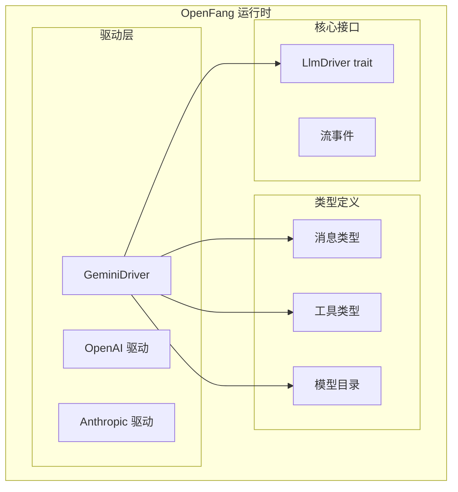
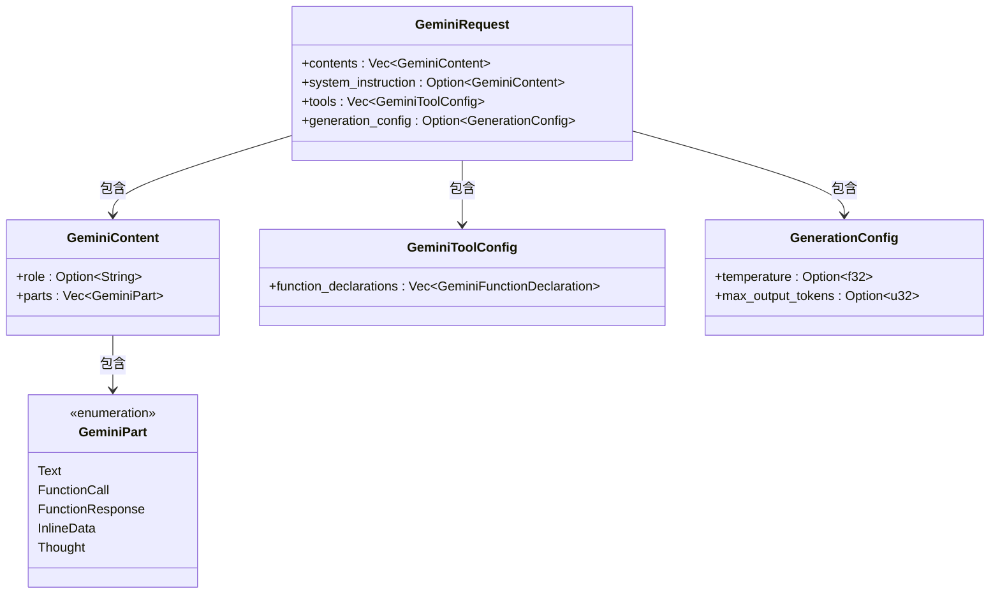
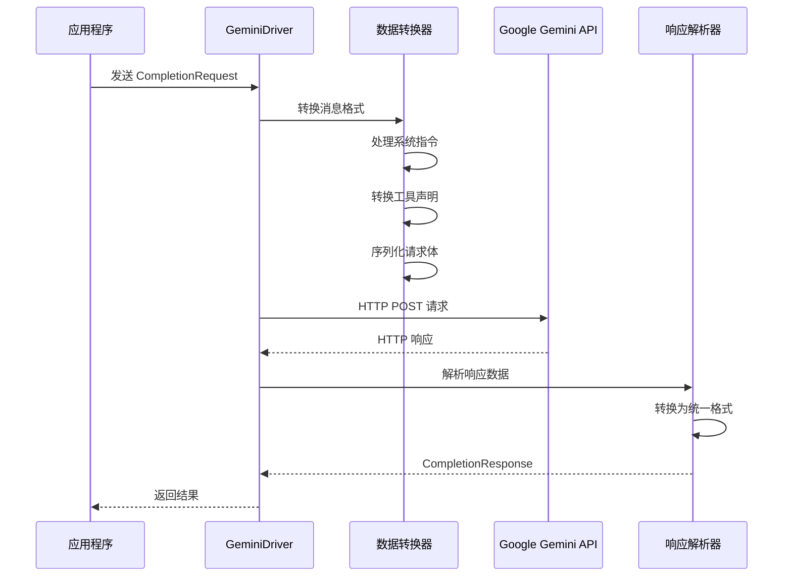
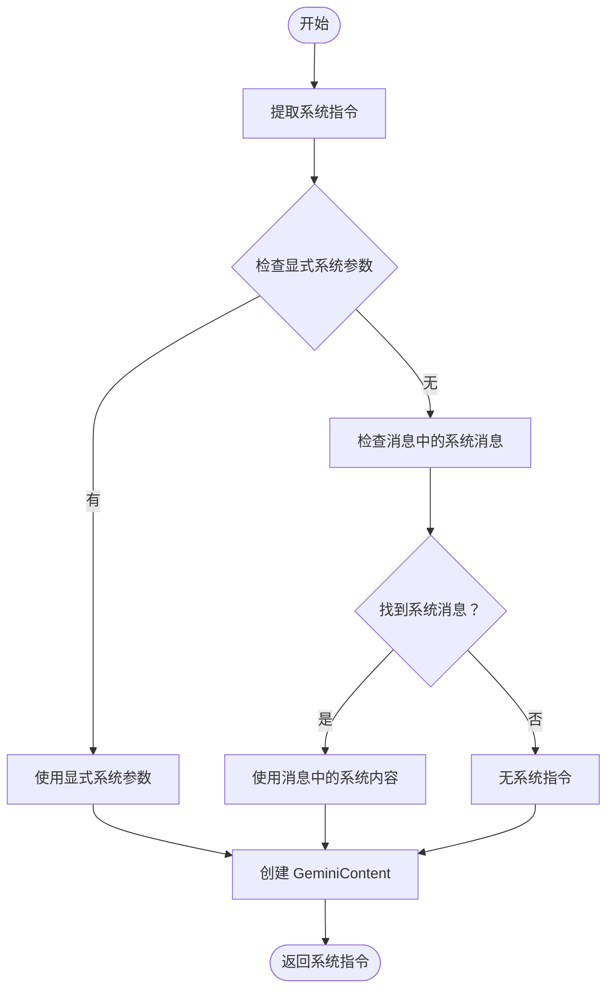
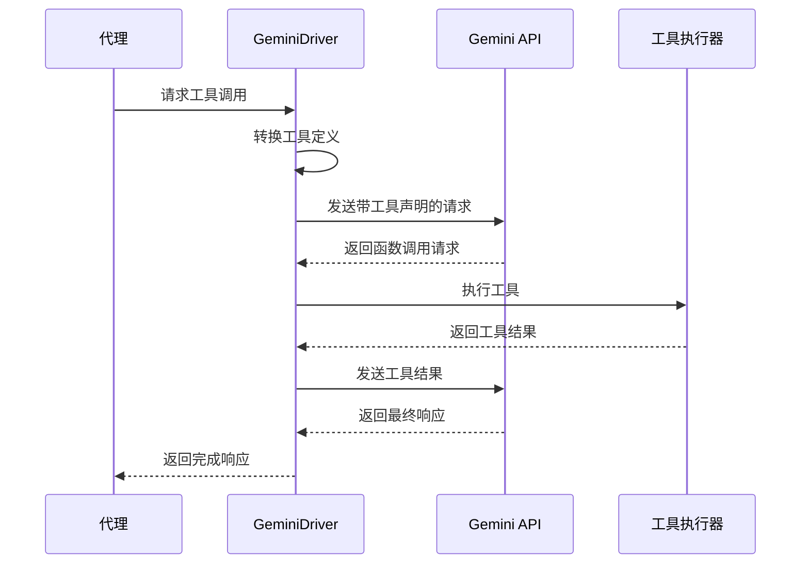
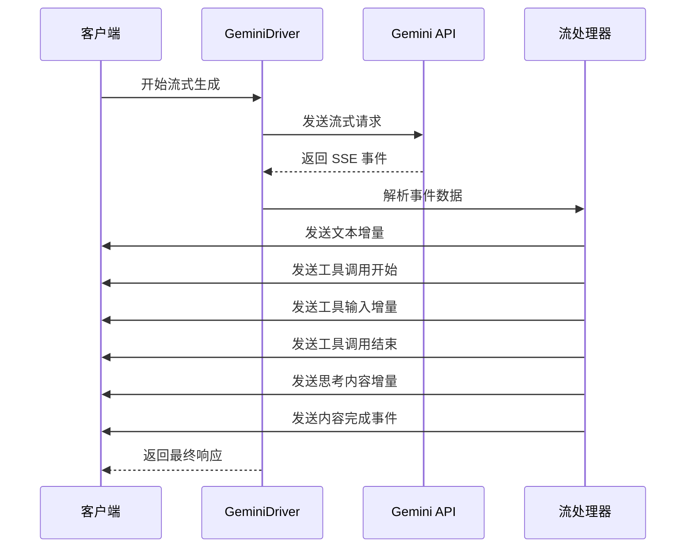
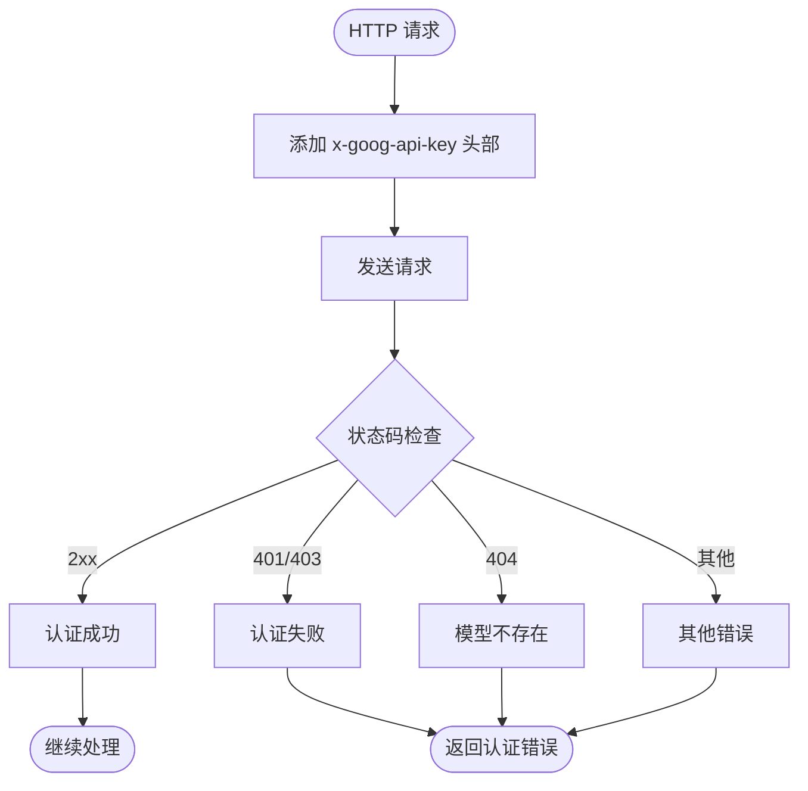
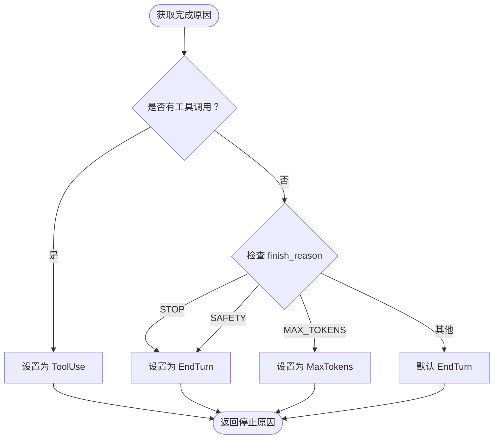
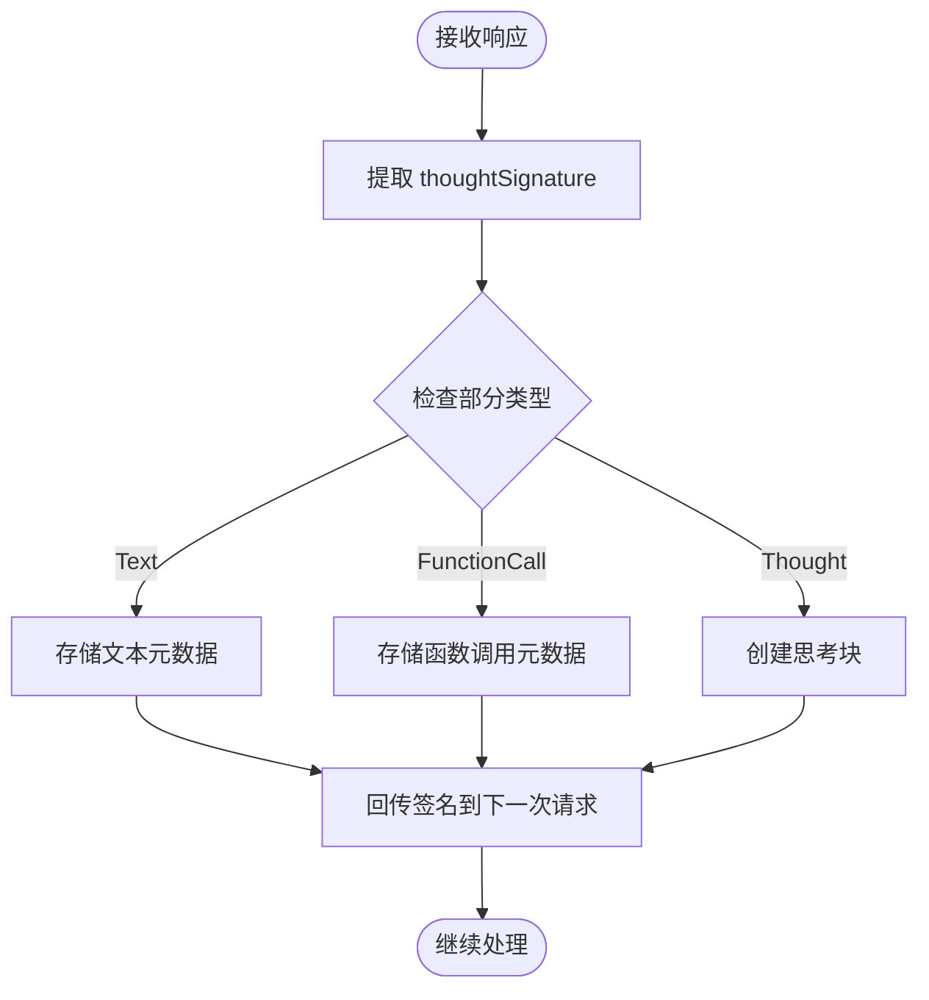
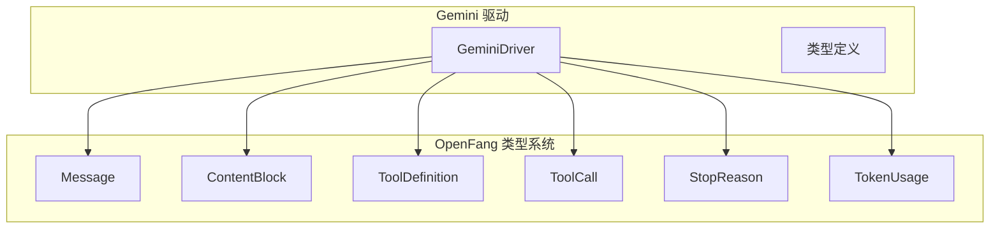

# Gemini 驱动

<cite>
**本文档引用的文件**
- [gemini.rs](file://crates/openfang-runtime/src/drivers/gemini.rs)
- [tool.rs](file://crates/openfang-types/src/tool.rs)
- [message.rs](file://crates/openfang-types/src/message.rs)
- [model_catalog.rs](file://crates/openfang-types/src/model_catalog.rs)
- [model_catalog.rs](file://crates/openfang-runtime/src/model_catalog.rs)
</cite>

## 目录
1. [简介](#简介)
2. [项目结构](#项目结构)
3. [核心组件](#核心组件)
4. [架构概览](#架构概览)
5. [详细组件分析](#详细组件分析)
6. [依赖关系分析](#依赖关系分析)
7. [性能考虑](#性能考虑)
8. [故障排除指南](#故障排除指南)
9. [结论](#结论)
10. [附录](#附录)

## 简介

Gemini 驱动是 OpenFang 项目中用于集成 Google Gemini API 的核心组件。该驱动实现了完整的 Gemini API 集成功能，包括系统指令支持、函数声明、流式生成内容和 API 密钥认证等特性。驱动特别针对 Gemini 2.5+ 和 3.x 思维模型的 `thoughtSignature` 特性进行了专门优化，确保思维过程的完整性和可追溯性。

该驱动采用统一的接口设计，通过 `LlmDriver` trait 提供标准的完成和流式生成能力，同时实现了与不同 Gemini 模型（如 gemini-pro、gemini-pro-vision）的兼容性支持。

## 项目结构

Gemini 驱动位于 OpenFang 项目的运行时层中，作为独立的驱动模块存在：



**图表来源**
- [gemini.rs:22-41](file://crates/openfang-runtime/src/drivers/gemini.rs#L22-L41)
- [message.rs:1-341](file://crates/openfang-types/src/message.rs#L1-L341)
- [tool.rs:1-650](file://crates/openfang-types/src/tool.rs#L1-650)

**章节来源**
- [gemini.rs:1-41](file://crates/openfang-runtime/src/drivers/gemini.rs#L1-L41)

## 核心组件

### GeminiDriver 结构体

GeminiDriver 是驱动的核心实现，负责管理 API 密钥、基础 URL 和 HTTP 客户端连接：

```mermaid
classDiagram
class GeminiDriver {
-api_key : Zeroizing~String~
-base_url : String
-client : reqwest : : Client
+new(api_key : String, base_url : String) GeminiDriver
}
class Zeroizing~String~ {
+as_str() &str
+clone() Zeroizing~String~
}
class reqwest : : Client {
+builder() ClientBuilder
+post(url : &str) RequestBuilder
+send() Result<Response>
}
GeminiDriver --> Zeroizing~String~ : 使用
GeminiDriver --> reqwest : : Client : 创建
```

**图表来源**
- [gemini.rs:22-41](file://crates/openfang-runtime/src/drivers/gemini.rs#L22-L41)

### 请求数据结构

驱动定义了完整的 Gemini API 请求和响应数据结构：



**图表来源**
- [gemini.rs:45-164](file://crates/openfang-runtime/src/drivers/gemini.rs#L45-L164)

**章节来源**
- [gemini.rs:22-164](file://crates/openfang-runtime/src/drivers/gemini.rs#L22-L164)

## 架构概览

Gemini 驱动采用分层架构设计，实现了从应用层到 Gemini API 的完整数据转换和传输：



**图表来源**
- [gemini.rs:500-581](file://crates/openfang-runtime/src/drivers/gemini.rs#L500-L581)
- [gemini.rs:583-831](file://crates/openfang-runtime/src/drivers/gemini.rs#L583-L831)

## 详细组件分析

### 系统指令支持

Gemini 驱动实现了完整的系统指令支持，通过 `systemInstruction` 字段传递系统提示：



**图表来源**
- [gemini.rs:342-364](file://crates/openfang-runtime/src/drivers/gemini.rs#L342-L364)

### 函数声明和工具调用

驱动实现了与 Gemini API 兼容的函数声明格式，支持复杂的工具调用流程：



**图表来源**
- [gemini.rs:367-390](file://crates/openfang-runtime/src/drivers/gemini.rs#L367-L390)
- [gemini.rs:393-495](file://crates/openfang-runtime/src/drivers/gemini.rs#L393-L495)

### 流式生成内容

Gemini 驱动支持完整的流式生成功能，通过 Server-Sent Events (SSE) 实现实时内容传输：



**图表来源**
- [gemini.rs:583-831](file://crates/openfang-runtime/src/drivers/gemini.rs#L583-L831)

### API 密钥认证

驱动实现了标准的 Gemini API 认证机制，使用 `x-goog-api-key` 头部进行身份验证：



**图表来源**
- [gemini.rs:515-581](file://crates/openfang-runtime/src/drivers/gemini.rs#L515-L581)

### 统一停止原因映射

Gemini 驱动实现了与统一停止原因的映射机制，处理 Gemini 特有的停止条件：



**图表来源**
- [gemini.rs:470-479](file://crates/openfang-runtime/src/drivers/gemini.rs#L470-L479)
- [gemini.rs:802-813](file://crates/openfang-runtime/src/drivers/gemini.rs#L802-L813)

### 思维签名处理

Gemini 2.5+ 和 3.x 模型引入了 `thoughtSignature` 特性，驱动实现了完整的签名处理机制：



**图表来源**
- [gemini.rs:416-454](file://crates/openfang-runtime/src/drivers/gemini.rs#L416-L454)
- [gemini.rs:1132-1434](file://crates/openfang-runtime/src/drivers/gemini.rs#L1132-L1434)

**章节来源**
- [gemini.rs:228-495](file://crates/openfang-runtime/src/drivers/gemini.rs#L228-L495)
- [gemini.rs:583-831](file://crates/openfang-runtime/src/drivers/gemini.rs#L583-L831)

## 依赖关系分析

### 类型系统依赖

Gemini 驱动与 OpenFang 类型系统紧密集成：



**图表来源**
- [gemini.rs:11-18](file://crates/openfang-runtime/src/drivers/gemini.rs#L11-L18)
- [message.rs:1-341](file://crates/openfang-types/src/message.rs#L1-L341)
- [tool.rs:1-650](file://crates/openfang-types/src/tool.rs#L1-650)

### 模型目录集成

驱动与模型目录系统集成，支持多种 Gemini 模型：

| 模型名称 | 上下文窗口 | 最大输出令牌 | 工具支持 | 视觉支持 | 流式支持 |
|---------|-----------|-------------|---------|---------|---------|
| gemini-2.5-flash-lite | 1,048,576 | 8,192 | ✓ | ✓ | ✓ |
| gemini-2.5-pro | 1,048,576 | 65,536 | ✓ | ✓ | ✓ |
| gemini-2.5-flash | 1,048,576 | 8,192 | ✓ | ✓ | ✓ |
| gemini-1.5-pro | 2,097,152 | 8,192 | ✓ | ✓ | ✓ |
| gemini-1.5-flash | 1,048,576 | 8,192 | ✓ | ✓ | ✓ |

**章节来源**
- [gemini.rs:1266-1373](file://crates/openfang-runtime/src/drivers/gemini.rs#L1266-L1373)
- [model_catalog.rs:1266-1373](file://crates/openfang-runtime/src/model_catalog.rs#L1266-L1373)

## 性能考虑

### 连接池和重试机制

Gemini 驱动实现了智能的连接管理和重试策略：

- **最大重试次数**: 3次
- **指数退避**: 2秒递增延迟
- **速率限制处理**: 429/503 状态码自动重试
- **超载保护**: 自动检测服务过载

### 内存优化

- **零拷贝字符串**: 使用 `Zeroizing<String>` 确保敏感信息安全释放
- **流式处理**: 支持流式响应，避免大响应内存占用
- **按需序列化**: 只序列化必要的字段，减少网络传输

### 缓存策略

- **模型元数据缓存**: 预加载模型目录信息
- **工具模式缓存**: 缓存工具模式以提高工具调用效率

## 故障排除指南

### 常见错误类型

| 错误类型 | 状态码 | 描述 | 解决方案 |
|---------|--------|------|---------|
| 认证失败 | 401/403 | API 密钥无效或权限不足 | 检查环境变量 `GEMINI_API_KEY` |
| 模型不存在 | 404 | 指定的模型名称无效 | 确认模型名称在支持列表中 |
| 速率限制 | 429 | 请求过于频繁 | 实现指数退避重试 |
| 服务过载 | 503 | Gemini 服务暂时不可用 | 等待后重试或降低请求频率 |
| 解析错误 | 其他 | 响应格式不符合预期 | 检查网络连接和 API 端点 |

### 调试建议

1. **启用详细日志**: 设置 `RUST_LOG=debug` 查看完整的请求/响应
2. **检查网络连接**: 确保能够访问 `generativelanguage.googleapis.com`
3. **验证 API 密钥**: 在 Google Cloud Console 中确认密钥状态
4. **测试基本连接**: 使用简单的文本请求验证基础功能

**章节来源**
- [gemini.rs:537-581](file://crates/openfang-runtime/src/drivers/gemini.rs#L537-L581)
- [gemini.rs:623-642](file://crates/openfang-runtime/src/drivers/gemini.rs#L623-L642)

## 结论

Gemini 驱动为 OpenFang 项目提供了完整的 Google Gemini API 集成解决方案。通过精心设计的数据转换层、流式处理能力和完善的错误处理机制，驱动能够可靠地支持各种 Gemini 模型的功能需求。

驱动的主要优势包括：
- **完整的功能支持**: 系统指令、工具调用、流式生成、思维签名
- **模型兼容性**: 支持多个 Gemini 模型版本
- **性能优化**: 智能重试、流式处理、内存优化
- **安全性**: API 密钥安全管理和错误处理

对于需要集成 Google Gemini API 的项目，Gemini 驱动提供了一个稳定、高效且易于使用的解决方案。

## 附录

### 配置示例

```toml
# openfang.toml 配置示例
[providers.gemini]
base_url = "https://generativelanguage.googleapis.com"
api_key_env = "GEMINI_API_KEY"
```

### 支持的模型

- **gemini-2.5-flash-lite**: 快速推理，适合简单任务
- **gemini-2.5-pro**: 高级推理能力，适合复杂任务  
- **gemini-2.5-flash**: 平衡性能和成本
- **gemini-1.5-pro**: 专业级推理能力
- **gemini-1.5-flash**: 经济高效的推理选项

### 使用场景

- **对话助手**: 利用流式生成提供实时响应
- **工具调用**: 通过函数声明集成外部工具
- **多模态处理**: 支持文本和图像输入
- **思维过程记录**: 利用 thoughtSignature 记录推理过程