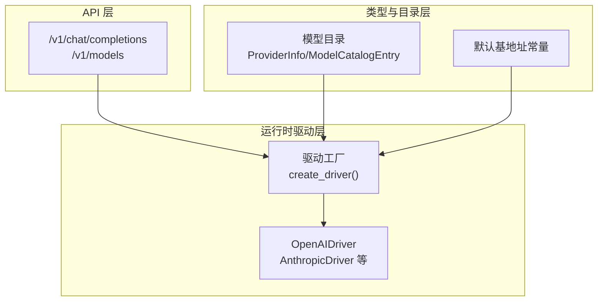
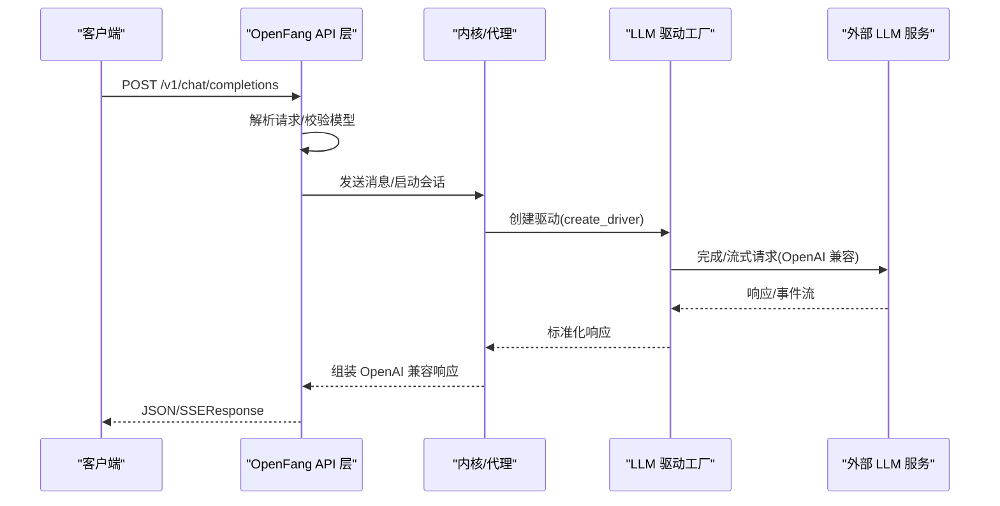
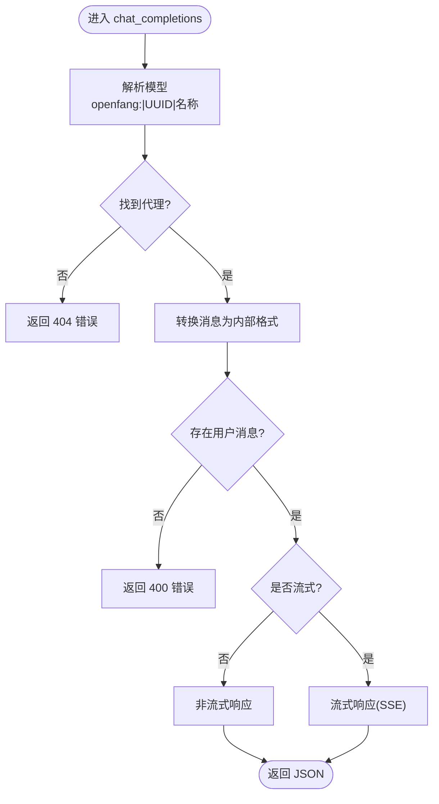
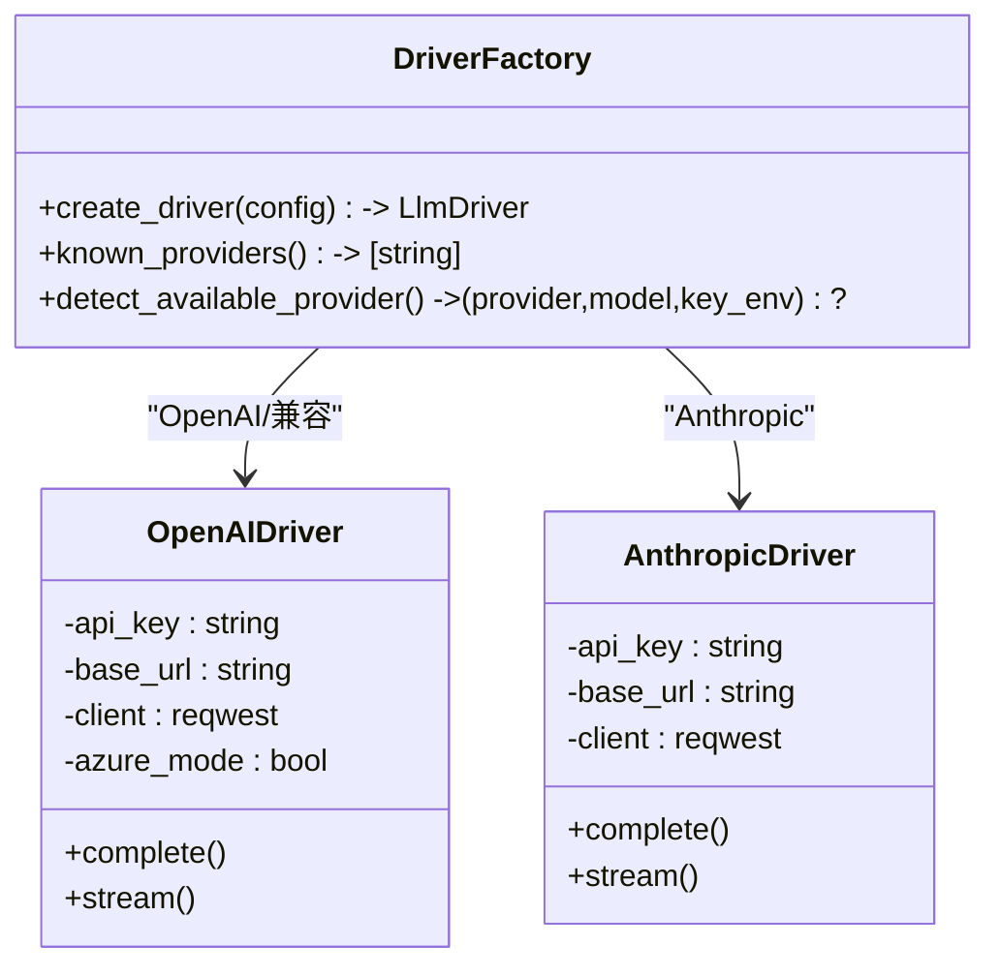
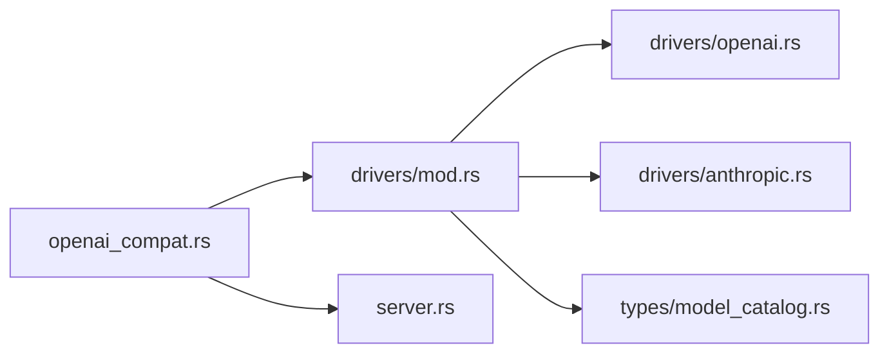

# OpenAI 兼容驱动

<cite>
**本文档引用的文件**
- [openai_compat.rs](file://crates/openfang-api/src/openai_compat.rs)
- [mod.rs](file://crates/openfang-runtime/src/drivers/mod.rs)
- [openai.rs](file://crates/openfang-runtime/src/drivers/openai.rs)
- [anthropic.rs](file://crates/openfang-runtime/src/drivers/anthropic.rs)
- [llm_driver.rs](file://crates/openfang-runtime/src/llm_driver.rs)
- [model_catalog.rs](file://crates/openfang-runtime/src/model_catalog.rs)
- [model_catalog.rs](file://crates/openfang-types/src/model_catalog.rs)
- [server.rs](file://crates/openfang-api/src/server.rs)
- [config.rs](file://crates/openfang-types/src/config.rs)
- [openfang.toml.example](file://openfang.toml.example)
- [api_integration_test.rs](file://crates/openfang-api/tests/api_integration_test.rs)
</cite>

## 目录
1. [简介](#简介)
2. [项目结构](#项目结构)
3. [核心组件](#核心组件)
4. [架构总览](#架构总览)
5. [详细组件分析](#详细组件分析)
6. [依赖关系分析](#依赖关系分析)
7. [性能考虑](#性能考虑)
8. [故障排除指南](#故障排除指南)
9. [结论](#结论)
10. [附录](#附录)

## 简介
本文件系统化阐述 OpenFang 中的 OpenAI 兼容驱动能力，重点覆盖：
- OpenAI 兼容 API 的端到端实现：/v1/chat/completions 与 /v1/models
- 支持 20+ 供应商的统一配置与认证机制
- 不同基础 URL 的适配策略与本地运行器支持
- 与不同提供商的 API 差异及适配策略
- 兼容性测试与故障排除指南
- 多种提供商的配置与使用示例路径

## 项目结构
OpenFang 将 OpenAI 兼容能力拆分为三层：
- API 层：在 HTTP 路由中暴露 OpenAI 兼容接口，负责请求解析、模型解析与响应封装
- 运行时驱动层：抽象多供应商 LLM 接口，统一完成/流式调用、重试与参数适配
- 类型与目录层：共享数据结构、默认提供商基地址与模型目录

图表来源
- [server.rs:683-691](file://crates/openfang-api/src/server.rs#L683-L691)
- [openai_compat.rs:245-367](file://crates/openfang-api/src/openai_compat.rs#L245-L367)
- [mod.rs:257-456](file://crates/openfang-runtime/src/drivers/mod.rs#L257-L456)
- [model_catalog.rs:421-800](file://crates/openfang-runtime/src/model_catalog.rs#L421-L800)
- [model_catalog.rs:10-64](file://crates/openfang-types/src/model_catalog.rs#L10-L64)

章节来源
- [server.rs:683-691](file://crates/openfang-api/src/server.rs#L683-L691)
- [openai_compat.rs:1-80](file://crates/openfang-api/src/openai_compat.rs#L1-L80)
- [mod.rs:1-26](file://crates/openfang-runtime/src/drivers/mod.rs#L1-L26)

## 核心组件
- OpenAI 兼容路由与处理器
  - /v1/chat/completions：接收 OpenAI 风格请求，解析消息与模型，转发至内核并返回标准响应或 SSE 流
  - /v1/models：将可用代理以 OpenAI 模型对象形式列出
- 驱动工厂与驱动实现
  - create_driver：根据 provider、base_url、api_key 自动选择驱动，并处理 Azure/OpenAI 兼容、Anthropic/Gemini 特例
  - OpenAIDriver：统一 OpenAI 兼容 API 的请求构建、认证头注入、参数适配与错误恢复
  - AnthropicDriver：独立的 Messages API 实现，支持工具调用与流式事件
- 模型目录与提供商信息
  - ProviderInfo：包含提供商 ID、显示名、默认基地址、是否需要密钥、认证状态等
  - 默认基地址常量：集中管理各提供商默认端点
- 配置与示例
  - openfang.toml.example：示例配置，展示 provider、model、api_key_env、base_url 等字段
  - config.rs：支持 provider_urls 与 provider_api_keys 的动态覆盖

章节来源
- [openai_compat.rs:245-559](file://crates/openfang-api/src/openai_compat.rs#L245-L559)
- [mod.rs:257-456](file://crates/openfang-runtime/src/drivers/mod.rs#L257-L456)
- [openai.rs:19-107](file://crates/openfang-runtime/src/drivers/openai.rs#L19-L107)
- [anthropic.rs:17-36](file://crates/openfang-runtime/src/drivers/anthropic.rs#L17-L36)
- [model_catalog.rs:421-800](file://crates/openfang-runtime/src/model_catalog.rs#L421-L800)
- [model_catalog.rs:10-64](file://crates/openfang-types/src/model_catalog.rs#L10-L64)
- [config.rs:1082-1092](file://crates/openfang-types/src/config.rs#L1082-L1092)
- [openfang.toml.example:8-12](file://openfang.toml.example#L8-L12)

## 架构总览
OpenAI 兼容驱动的调用链路如下：

图表来源
- [server.rs:683-691](file://crates/openfang-api/src/server.rs#L683-L691)
- [openai_compat.rs:245-367](file://crates/openfang-api/src/openai_compat.rs#L245-L367)
- [mod.rs:257-456](file://crates/openfang-runtime/src/drivers/mod.rs#L257-L456)
- [openai.rs:267-745](file://crates/openfang-runtime/src/drivers/openai.rs#L267-L745)

## 详细组件分析

### OpenAI 兼容 API 实现
- 请求解析与模型解析
  - 支持 model 字段解析：openfang:<name>、UUID、纯名称三种方式
  - 消息转换：支持文本与图片（data URI）两种内容块
- 响应封装
  - 非流式：封装为标准 chat.completion 结构
  - 流式：SSE 分片，首帧发送角色，后续增量 delta，结束发送 stop 与 [DONE]
- 错误处理
  - 缺少用户消息、模型不存在、内部错误等场景返回标准化错误体

图表来源
- [openai_compat.rs:162-367](file://crates/openfang-api/src/openai_compat.rs#L162-L367)

章节来源
- [openai_compat.rs:245-559](file://crates/openfang-api/src/openai_compat.rs#L245-L559)

### 驱动工厂与多供应商适配
- 供应商识别与默认基地址
  - 内置 20+ 供应商映射，自动设置 base_url 与 api_key 环境变量名
  - 本地运行器（Ollama、vLLM、LM Studio 等）无需密钥
- 特例处理
  - Anthropic：独立 Messages API，需 x-api-key 与版本头
  - Gemini：支持 GEMINI_API_KEY 或 GOOGLE_API_KEY
  - Azure OpenAI：部署级 URL 与 api-key 头
  - GitHub Copilot：基于 GitHub PAT 的令牌交换
- 自定义提供商
  - 若仅设置 api_key 环境变量而无 base_url，会提示缺少 base_url
  - 可通过 provider_urls 动态覆盖默认基地址

图表来源
- [mod.rs:257-456](file://crates/openfang-runtime/src/drivers/mod.rs#L257-L456)
- [openai.rs:19-107](file://crates/openfang-runtime/src/drivers/openai.rs#L19-L107)
- [anthropic.rs:17-36](file://crates/openfang-runtime/src/drivers/anthropic.rs#L17-L36)

章节来源
- [mod.rs:257-456](file://crates/openfang-runtime/src/drivers/mod.rs#L257-L456)
- [openai.rs:19-107](file://crates/openfang-runtime/src/drivers/openai.rs#L19-L107)
- [anthropic.rs:17-36](file://crates/openfang-runtime/src/drivers/anthropic.rs#L17-L36)

### 认证机制与提供商配置矩阵
- 认证方式
  - 大多数云提供商：通过环境变量注入 API Key
  - 本地运行器：无需密钥（如 Ollama、vLLM、LM Studio）
  - Azure OpenAI：使用 api-key 头，URL 为部署级
- 配置矩阵（节选）
  - OpenAI：OPENAI_API_KEY，OPENAI_BASE_URL
  - Groq：GROQ_API_KEY，GROQ_BASE_URL
  - Mistral：MISTRAL_API_KEY，MISTRAL_BASE_URL
  - Together：TOGETHER_API_KEY，TOGETHER_BASE_URL
  - Ollama：无需密钥，OLLAMA_BASE_URL
  - HuggingFace：HF_API_KEY，HUGGINGFACE_BASE_URL
  - Azure OpenAI：AZURE_OPENAI_API_KEY，需自定义 base_url
  - GitHub Copilot：GITHUB_TOKEN，GITHUB_COPILOT_BASE_URL
- 动态覆盖
  - provider_urls：按提供商覆盖默认基地址
  - provider_api_keys：按提供商覆盖 API Key 环境变量名

章节来源
- [mod.rs:29-231](file://crates/openfang-runtime/src/drivers/mod.rs#L29-L231)
- [model_catalog.rs:10-64](file://crates/openfang-types/src/model_catalog.rs#L10-L64)
- [config.rs:1082-1092](file://crates/openfang-types/src/config.rs#L1082-L1092)

### 与不同提供商的 API 差异与适配策略
- 参数差异
  - 温度参数：部分推理模型拒绝或仅接受特定值（如 Kimi/K2.5 固定 1.0；o 系列推理模型拒绝温度）
  - token 上限：部分模型使用 max_completion_tokens 替代 max_tokens
  - 思维内容：Moonshot/Kimi 需要额外 reasoning_content 字段
- 错误恢复
  - Groq：当模型生成 XML 格式的 tool_use_failed 时，尝试从 failed_generation 中恢复工具调用
  - 自适应上限：当模型拒绝 max_tokens 时，自动降低上限并重试
  - 工具调用降级：当模型不支持工具时，自动移除工具后重试
- 本地模型增强
  - 当响应缺少用量统计但有内容时，填充最小输出用量，避免静默失败

章节来源
- [openai.rs:135-172](file://crates/openfang-runtime/src/drivers/openai.rs#L135-L172)
- [openai.rs:511-594](file://crates/openfang-runtime/src/drivers/openai.rs#L511-L594)
- [openai.rs:722-731](file://crates/openfang-runtime/src/drivers/openai.rs#L722-L731)

### 兼容性测试与示例
- 兼容性测试
  - 集成测试覆盖健康检查、代理生命周期、工作流与触发器等
  - LLM 集成测试可选执行（需 GROQ_API_KEY），验证真实外部调用
- 示例配置
  - openfang.toml.example 展示了 provider、model、api_key_env、base_url 的基本用法
  - 可通过 provider_urls 与 provider_api_keys 在运行时覆盖

章节来源
- [api_integration_test.rs:187-230](file://crates/openfang-api/tests/api_integration_test.rs#L187-L230)
- [api_integration_test.rs:317-367](file://crates/openfang-api/tests/api_integration_test.rs#L317-L367)
- [openfang.toml.example:8-12](file://openfang.toml.example#L8-L12)
- [config.rs:1082-1092](file://crates/openfang-types/src/config.rs#L1082-L1092)

## 依赖关系分析
- 组件耦合
  - API 层仅依赖驱动工厂与内核接口，保持低耦合
  - 驱动工厂集中管理所有提供商的差异，便于扩展
- 外部依赖
  - HTTP 客户端：reqwest
  - 序列化：serde
  - 并发：tokio mpsc 通道用于流式事件
- 循环依赖
  - 未发现循环导入；类型与驱动分层清晰

图表来源
- [openai_compat.rs:1-23](file://crates/openfang-api/src/openai_compat.rs#L1-L23)
- [mod.rs:1-26](file://crates/openfang-runtime/src/drivers/mod.rs#L1-L26)
- [openai.rs:1-14](file://crates/openfang-runtime/src/drivers/openai.rs#L1-L14)
- [anthropic.rs:1-16](file://crates/openfang-runtime/src/drivers/anthropic.rs#L1-L16)
- [model_catalog.rs:1-10](file://crates/openfang-types/src/model_catalog.rs#L1-L10)
- [server.rs:683-691](file://crates/openfang-api/src/server.rs#L683-L691)

章节来源
- [llm_driver.rs:146-171](file://crates/openfang-runtime/src/llm_driver.rs#L146-L171)
- [mod.rs:257-456](file://crates/openfang-runtime/src/drivers/mod.rs#L257-L456)

## 性能考虑
- 流式传输
  - SSE 流式返回，减少等待时间，提升交互体验
- 重试与退避
  - 针对 429/529 与模型过载场景采用指数退避重试
- 参数自适应
  - 自动切换 max_tokens/max_completion_tokens、去除不被支持的温度参数，减少无效重试
- 用量统计
  - 本地模型缺失用量时进行保守填充，避免不必要的重复调用

## 故障排除指南
- 常见错误与定位
  - 404 模型不存在：确认 model 是否为 openfang:<name>、UUID 或已注册代理名称
  - 400 缺少用户消息：确保请求包含至少一条用户消息
  - 400 缺少 API Key：检查对应 PROVIDER_API_KEY 环境变量是否设置
  - 400 未知 provider：确认 provider 名称是否在已知列表中，或通过 base_url 自定义
  - 400 缺少 base_url：当使用自定义提供商且设置了 API Key 环境变量时，需显式提供 base_url
- Azure OpenAI
  - 必须设置 base_url 为部署级 URL，使用 api-key 头
- 本地运行器
  - Ollama/vLLM/LM Studio 无需密钥，若无法连接请检查本地服务端口与网络
- 工具调用失败
  - Groq 返回 tool_use_failed 时，系统会尝试从 failed_generation 恢复；若仍失败，检查工具定义与参数格式

章节来源
- [openai_compat.rs:245-367](file://crates/openfang-api/src/openai_compat.rs#L245-L367)
- [mod.rs:353-371](file://crates/openfang-runtime/src/drivers/mod.rs#L353-L371)
- [openai.rs:511-594](file://crates/openfang-runtime/src/drivers/openai.rs#L511-L594)

## 结论
OpenFang 的 OpenAI 兼容驱动通过“统一接口 + 工厂模式 + 参数自适配”的设计，在保证 OpenAI 生态兼容性的同时，无缝支持 20+ 供应商与本地运行器。其错误恢复与流式传输机制提升了稳定性与用户体验。建议在生产环境中结合 provider_urls 与 provider_api_keys 进行灵活配置，并针对不同提供商的参数差异进行测试与验证。

## 附录
- 代码示例路径（不含具体代码内容）
  - OpenAI 兼容路由注册：[server.rs:683-691](file://crates/openfang-api/src/server.rs#L683-L691)
  - OpenAI 兼容处理器实现：[openai_compat.rs:245-559](file://crates/openfang-api/src/openai_compat.rs#L245-L559)
  - 驱动工厂与提供商映射：[mod.rs:257-456](file://crates/openfang-runtime/src/drivers/mod.rs#L257-L456)
  - OpenAI 兼容驱动实现：[openai.rs:267-745](file://crates/openfang-runtime/src/drivers/openai.rs#L267-L745)
  - Anthropic 驱动实现：[anthropic.rs:156-553](file://crates/openfang-runtime/src/drivers/anthropic.rs#L156-L553)
  - 模型目录与默认基地址：[model_catalog.rs:421-800](file://crates/openfang-runtime/src/model_catalog.rs#L421-L800), [model_catalog.rs:10-64](file://crates/openfang-types/src/model_catalog.rs#L10-L64)
  - 配置覆盖选项：[config.rs:1082-1092](file://crates/openfang-types/src/config.rs#L1082-L1092)
  - 示例配置文件：[openfang.toml.example:8-12](file://openfang.toml.example#L8-L12)
  - 兼容性集成测试：[api_integration_test.rs:317-367](file://crates/openfang-api/tests/api_integration_test.rs#L317-L367)