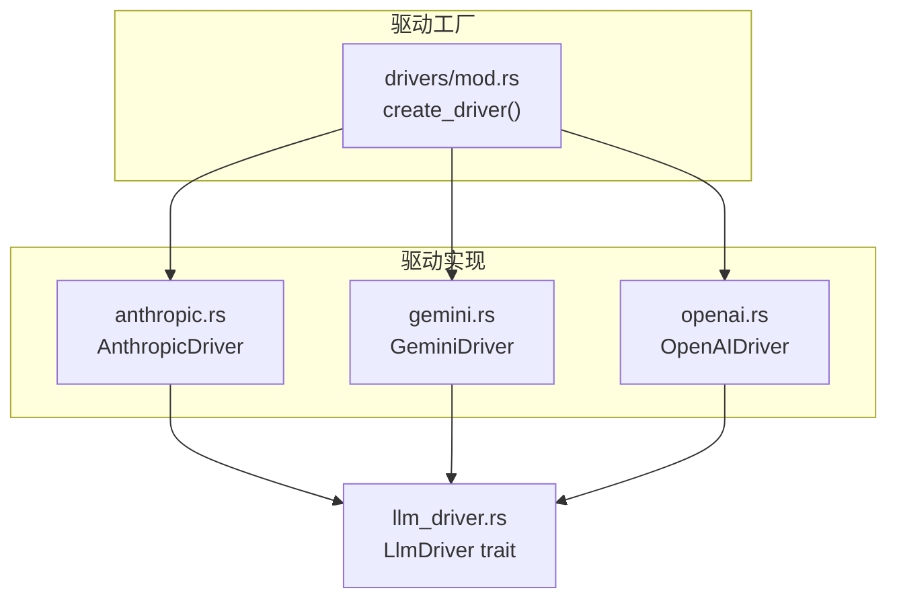
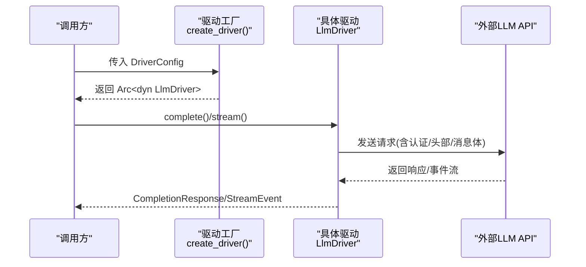
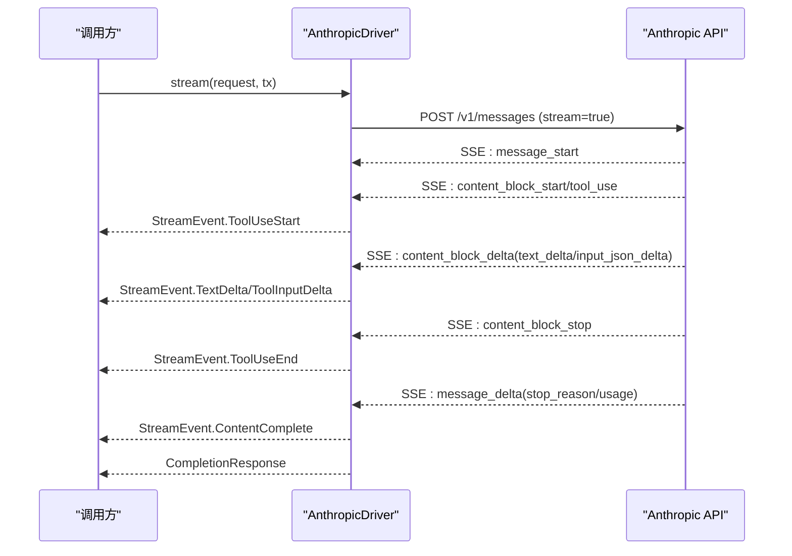
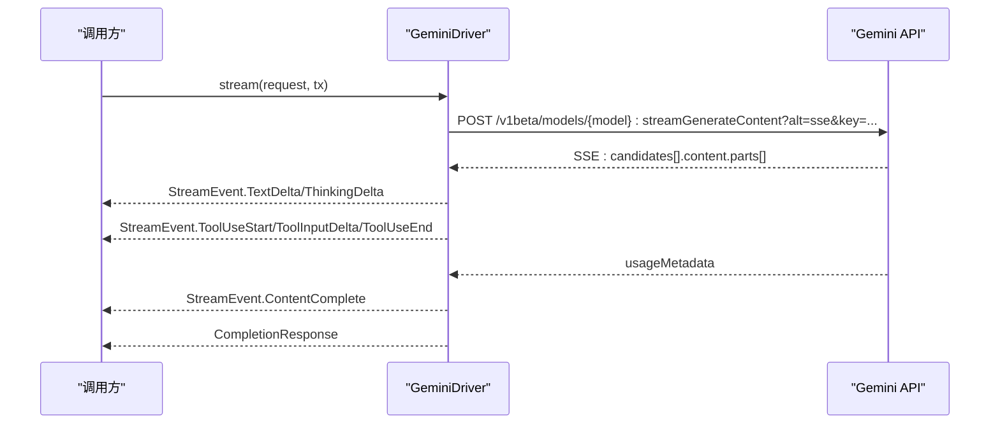
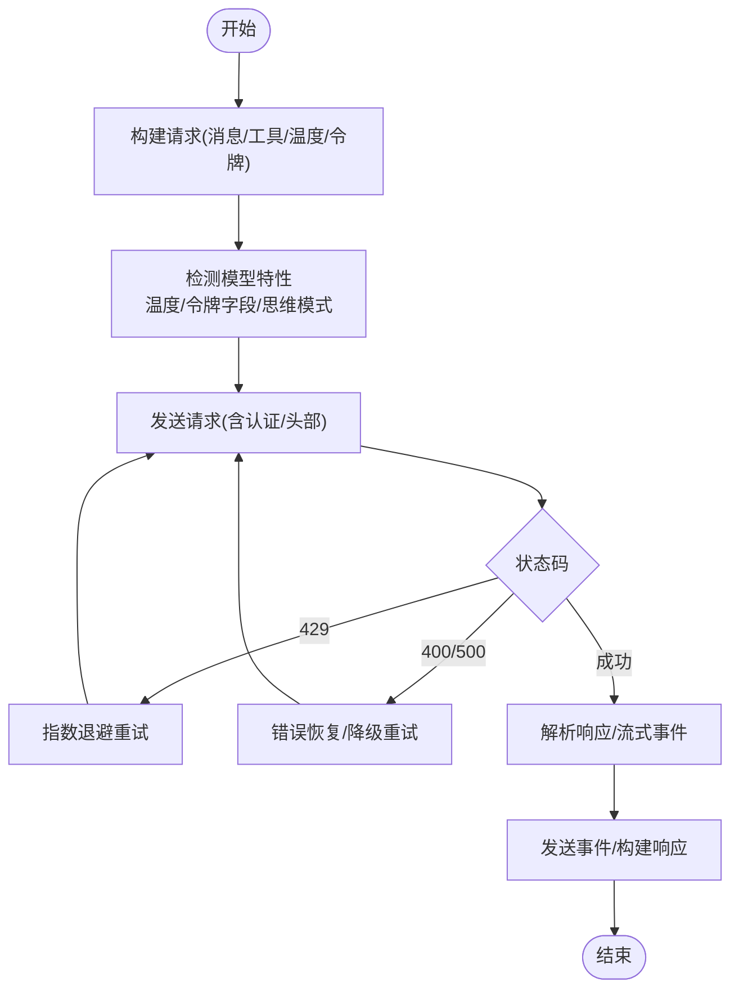
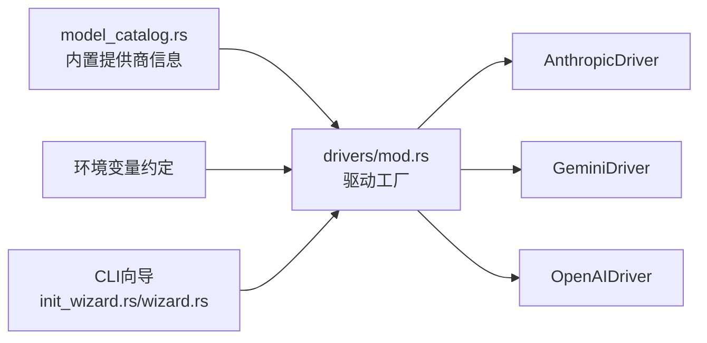

# 驱动实现

<cite>
**本文档引用的文件**
- [drivers/mod.rs](file://crates/openfang-runtime/src/drivers/mod.rs)
- [anthropic.rs](file://crates/openfang-runtime/src/drivers/anthropic.rs)
- [gemini.rs](file://crates/openfang-runtime/src/drivers/gemini.rs)
- [openai.rs](file://crates/openfang-runtime/src/drivers/openai.rs)
- [llm_driver.rs](file://crates/openfang-runtime/src/llm_driver.rs)
- [model_catalog.rs](file://crates/openfang-runtime/src/model_catalog.rs)
- [init_wizard.rs](file://crates/openfang-cli/src/tui/screens/init_wizard.rs)
- [wizard.rs](file://crates/openfang-cli/src/tui/screens/wizard.rs)
</cite>

## 目录
1. [简介](#简介)
2. [项目结构](#项目结构)
3. [核心组件](#核心组件)
4. [架构总览](#架构总览)
5. [详细组件分析](#详细组件分析)
6. [依赖关系分析](#依赖关系分析)
7. [性能考虑](#性能考虑)
8. [故障排除指南](#故障排除指南)
9. [结论](#结论)
10. [附录](#附录)

## 简介
本文件面向驱动实现，系统性阐述三种原生驱动的实现特点与差异：  
- AnthropicDriver 的 Claude 特定功能：内容块、图像支持、工具调用、思维块、流式增量  
- GeminiDriver 的 Google Gemini API 集成：系统指令、函数声明、流式生成、思考签名（thought_signature）处理  
- OpenAiCompatDriver 的 OpenAI 兼容 API 支持：20+ 提供商适配、Azure OpenAI、温度与令牌限制兼容性、流式使用统计  

同时覆盖认证机制、API 配置与错误处理策略，并提供驱动选择与配置指南。

## 项目结构
驱动实现位于运行时模块中，统一通过工厂函数按提供商类型创建具体驱动实例，所有驱动均实现统一的 LlmDriver trait，确保上层调用一致。

图表来源
- [drivers/mod.rs:257-456](file://crates/openfang-runtime/src/drivers/mod.rs#L257-L456)
- [anthropic.rs:156-554](file://crates/openfang-runtime/src/drivers/anthropic.rs#L156-L554)
- [gemini.rs:499-832](file://crates/openfang-runtime/src/drivers/gemini.rs#L499-L832)
- [openai.rs:266-1376](file://crates/openfang-runtime/src/drivers/openai.rs#L266-L1376)
- [llm_driver.rs:145-171](file://crates/openfang-runtime/src/llm_driver.rs#L145-L171)

章节来源
- [drivers/mod.rs:1-858](file://crates/openfang-runtime/src/drivers/mod.rs#L1-L858)
- [llm_driver.rs:1-327](file://crates/openfang-runtime/src/llm_driver.rs#L1-L327)

## 核心组件
- 统一接口：LlmDriver trait 定义了 complete() 与 stream() 两个核心方法，以及默认的流式回退实现。  
- 驱动工厂：create_driver() 基于配置选择 Anthropic、Gemini 或 OpenAI 兼容驱动；对 Azure OpenAI、GitHub Copilot、Codex、Moonshot/Kimi 等进行特殊处理。  
- 认证与配置：各驱动从 DriverConfig 读取 provider、api_key、base_url；部分驱动支持额外 HTTP 头部或本地 CLI 模式。  
- 错误模型：LlmError 统一封装 HTTP、API、限流、解析、鉴权失败、模型不存在等错误类型。  

章节来源
- [llm_driver.rs:11-49](file://crates/openfang-runtime/src/llm_driver.rs#L11-L49)
- [drivers/mod.rs:257-456](file://crates/openfang-runtime/src/drivers/mod.rs#L257-L456)

## 架构总览
三种原生驱动在请求转换、认证头设置、消息格式、工具调用与流式处理方面存在显著差异，但都遵循统一的 LlmDriver 接口。

图表来源
- [drivers/mod.rs:257-456](file://crates/openfang-runtime/src/drivers/mod.rs#L257-L456)
- [llm_driver.rs:145-171](file://crates/openfang-runtime/src/llm_driver.rs#L145-L171)

## 详细组件分析

### AnthropicDriver（Claude）
- 内容块与图像支持：支持文本、图像（base64）、工具调用与思维块（thinking），消息体采用 Anthropic Messages API 的 content.blocks 结构。  
- 工具调用：将工具定义映射为 Anthropic 的 tools 数组，支持流式增量输入 JSON（input_json_delta）。  
- 流式处理：解析 SSE 事件 message_start/content_block_* 系列，逐段发送 TextDelta、ToolInputDelta、ThinkingDelta，并在结束时发送 ContentComplete。  
- 重试策略：对 429/529 场景进行指数退避重试，避免过载。  
- 认证与头部：使用 x-api-key 与 anthropic-version 头部。  

图表来源
- [anthropic.rs:262-553](file://crates/openfang-runtime/src/drivers/anthropic.rs#L262-L553)

章节来源
- [anthropic.rs:1-696](file://crates/openfang-runtime/src/drivers/anthropic.rs#L1-L696)

### GeminiDriver（Google Gemini）
- 系统指令：通过 systemInstruction 字段传递系统提示，独立于对话历史。  
- 函数声明：工具定义映射为 functionDeclarations，置于 tools[] 中。  
- 图像与多模态：使用 inlineData.mimeType 与 data 字段传输图片。  
- 思维签名（thought_signature）：Gemini 2.5+/3.x 在文本与函数调用部分均携带 thoughtSignature，驱动会捕获并在后续请求中完整回显，确保模型推理一致性。  
- 流式生成：使用 alt=sse 的 streamGenerateContent 接口，逐段发送 TextDelta、ThinkingDelta、ToolUseStart/End，并在最后发送 ContentComplete。  
- 认证与头部：使用 x-goog-api-key 头部，模型名在 URL 路径中。  

图表来源
- [gemini.rs:583-831](file://crates/openfang-runtime/src/drivers/gemini.rs#L583-L831)

章节来源
- [gemini.rs:1-1724](file://crates/openfang-runtime/src/drivers/gemini.rs#L1-L1724)

### OpenAiCompatDriver（OpenAI 兼容 API）
- 通用适配：支持 OpenAI、Ollama、vLLM、Groq、OpenRouter、DeepSeek、Together、Mistral、Fireworks、Perplexity、Cohere、AI21、Cerebras、SambaNova、HuggingFace、xAI、Replicate、Chutes、Venice、NVIDIA NIM、Azure OpenAI 等 20+ 提供商。  
- Azure OpenAI：部署型 URL 与 api-key 头部，自动注入 api-version 查询参数。  
- 温度与令牌限制兼容：针对 o-series、GPT-5、DeepSeek-R1、reasoner 等模型自动剔除不支持的 temperature，或切换 max_tokens/max_completion_tokens 字段。  
- 流式使用统计：通过 stream_options.include_usage 获取每块 token 使用情况。  
- 错误恢复：Groq 的 tool_use_failed 错误可从 failed_generation 中提取工具调用；对不支持工具的模型自动降级重试。  
- 思维内容处理：支持 reasoning_content 与 <think>...</think> 标签分离，必要时合成简短文本响应。  

图表来源
- [openai.rs:266-1376](file://crates/openfang-runtime/src/drivers/openai.rs#L266-L1376)

章节来源
- [openai.rs:1-1834](file://crates/openfang-runtime/src/drivers/openai.rs#L1-L1834)

## 依赖关系分析
- 驱动工厂依赖模型目录常量表（如 ANTHROPIC_BASE_URL、GEMINI_BASE_URL、OPENAI_BASE_URL 等）与环境变量约定，动态推断默认 base_url 与 API Key。  
- 各驱动依赖 openfang_types 的消息与工具类型进行序列化/反序列化，确保跨提供商的消息格式统一。  
- CLI 向导提供常见提供商的默认模型与环境变量提示，辅助用户完成初始配置。  

图表来源
- [model_catalog.rs:421-564](file://crates/openfang-runtime/src/model_catalog.rs#L421-L564)
- [drivers/mod.rs:16-26](file://crates/openfang-runtime/src/drivers/mod.rs#L16-L26)
- [init_wizard.rs:30-81](file://crates/openfang-cli/src/tui/screens/init_wizard.rs#L30-L81)
- [wizard.rs:21-70](file://crates/openfang-cli/src/tui/screens/wizard.rs#L21-L70)

章节来源
- [drivers/mod.rs:16-26](file://crates/openfang-runtime/src/drivers/mod.rs#L16-L26)
- [model_catalog.rs:421-564](file://crates/openfang-runtime/src/model_catalog.rs#L421-L564)
- [init_wizard.rs:30-81](file://crates/openfang-cli/src/tui/screens/init_wizard.rs#L30-L81)
- [wizard.rs:21-70](file://crates/openfang-cli/src/tui/screens/wizard.rs#L21-L70)

## 性能考虑
- 重试与退避：Anthropic 与 Gemini 对 429/529 与 503 进行有限次数重试，避免瞬时过载导致的失败扩大。  
- 流式增量：三类驱动均支持流式输出，前端可即时渲染文本与工具调用输入，降低感知延迟。  
- 使用统计：OpenAI 兼容驱动通过 include_usage 获取实时 token 使用，便于成本控制与预算告警。  
- 本地推理：Ollama、vLLM、LM Studio 等本地服务无需网络往返，适合低延迟场景，但需关注资源占用与内存管理。  

## 故障排除指南
- 缺少 API Key：驱动工厂会优先检查配置中的 api_key，其次读取环境变量；若两者均缺失且需要密钥，则返回 MissingApiKey 错误。  
- 认证失败：当返回 401/403 时，Gemini 驱动会抛出 AuthenticationFailed；OpenAI 兼容驱动可能因密钥无效或权限不足而失败。  
- 模型不存在：返回 404 时，Gemini 驱动会抛出 ModelNotFound；OpenAI 兼容驱动会返回 API 错误。  
- 限流与过载：429/529（Anthropic）、503（Gemini）触发退避重试；OpenAI 兼容驱动对 429 进行退避。  
- 工具调用失败：Groq 的 tool_use_failed 可被解析并恢复工具调用；对不支持工具的模型会自动降级重试。  
- 令牌上限：当模型拒绝 max_tokens 值时，OpenAI 兼容驱动会自动下调并重试；对 o-series 模型自动切换到 max_completion_tokens。  

章节来源
- [drivers/mod.rs:257-456](file://crates/openfang-runtime/src/drivers/mod.rs#L257-L456)
- [anthropic.rs:201-260](file://crates/openfang-runtime/src/drivers/anthropic.rs#L201-L260)
- [gemini.rs:537-581](file://crates/openfang-runtime/src/drivers/gemini.rs#L537-L581)
- [openai.rs:474-744](file://crates/openfang-runtime/src/drivers/openai.rs#L474-L744)

## 结论
- AnthropicDriver 专注 Claude 的 Messages API，提供完备的内容块、图像与工具调用支持，流式体验完善。  
- GeminiDriver 严格遵循 Gemini API 规范，特别处理 thought_signature 的捕获与回显，保证多模态与思维模型的一致性。  
- OpenAiCompatDriver 以“最小差异”适配 20+ 提供商，具备强大的错误恢复与模型特性自适应能力，是生态兼容性的关键。  
- 通过统一的 LlmDriver 接口与驱动工厂，上层应用可无缝切换不同提供商，实现灵活的多云/本地混合部署。

## 附录

### 驱动选择与配置指南
- 选择建议  
  - 需要强工具调用与思维链：优先 Anthropic（Claude）或 Gemini（2.5+/3.x 思维模型）。  
  - 需要多模态与思考签名一致性：首选 Gemini。  
  - 需要生态兼容与低成本：优先 OpenAI 兼容（Groq、OpenRouter、DeepSeek、Together 等）。  
  - 本地推理与离线部署：选择 Ollama、vLLM、LM Studio 等本地服务。  
- 配置要点  
  - 设置 DRIVER.provider 与 DRIVER.api_key（或对应环境变量）。  
  - 如使用 Azure OpenAI，请设置 base_url 为部署根路径，并确保 api-key 头部生效。  
  - 对于 OpenAI 兼容提供商，若未设置 base_url，驱动会尝试根据 provider 名称推断默认 base_url 或从环境变量读取。  
  - CLI 向导提供常见提供商的默认模型与环境变量提示，可直接参考初始化。  

章节来源
- [drivers/mod.rs:257-456](file://crates/openfang-runtime/src/drivers/mod.rs#L257-L456)
- [init_wizard.rs:30-81](file://crates/openfang-cli/src/tui/screens/init_wizard.rs#L30-L81)
- [wizard.rs:21-70](file://crates/openfang-cli/src/tui/screens/wizard.rs#L21-L70)