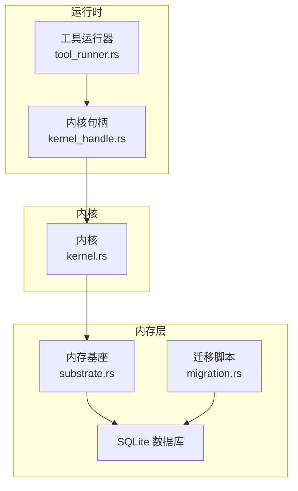
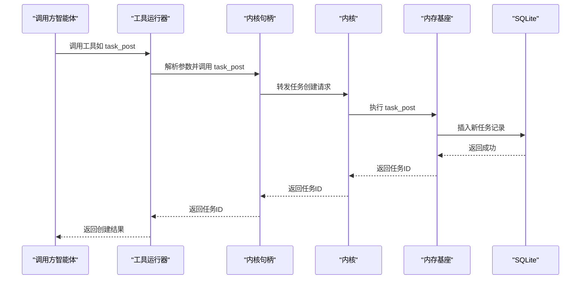
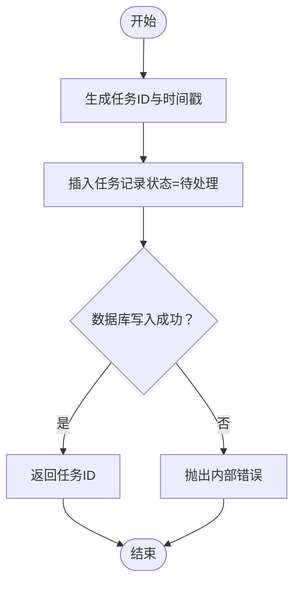
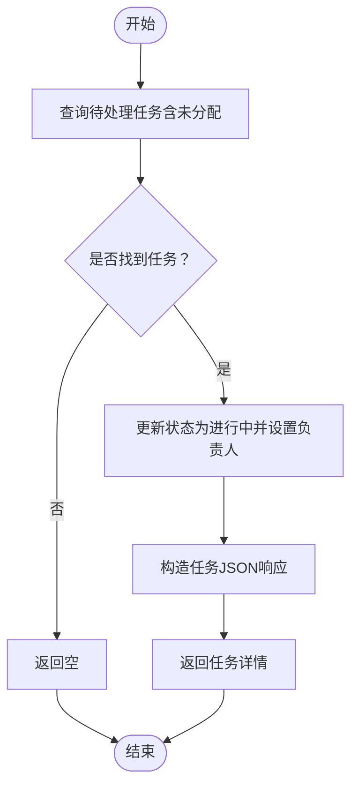
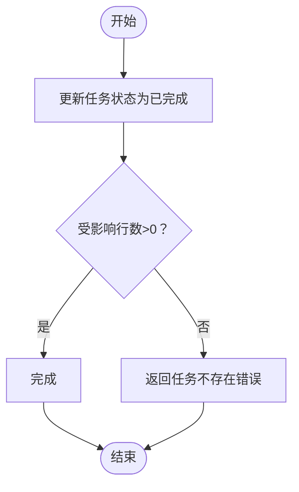
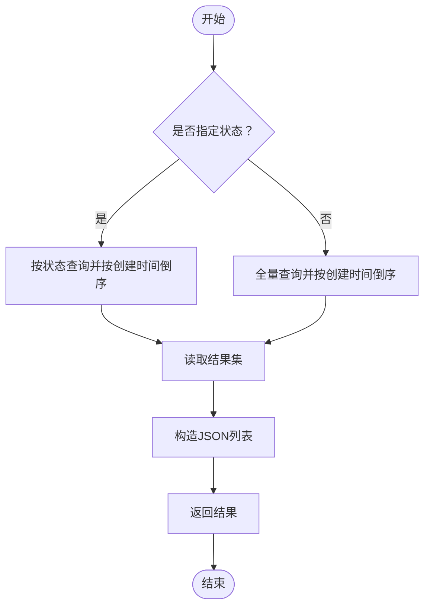
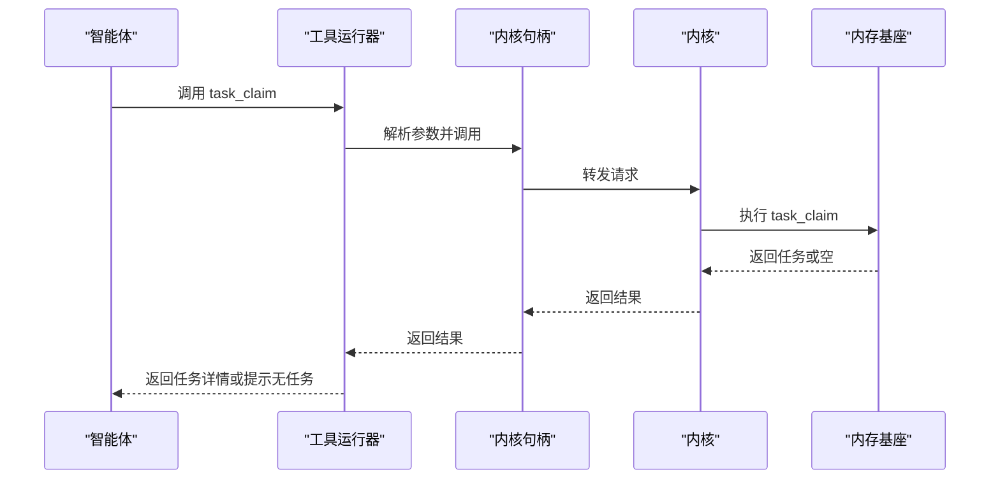
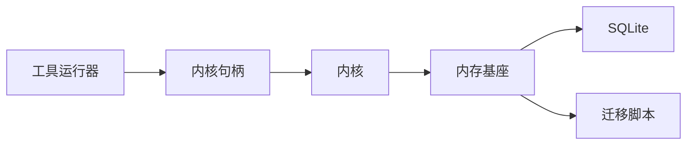

# 任务板系统

<cite>
**本文档引用的文件**
- [crates/openfang-memory/src/substrate.rs](file://crates/openfang-memory/src/substrate.rs)
- [crates/openfang-memory/src/migration.rs](file://crates/openfang-memory/src/migration.rs)
- [crates/openfang-kernel/src/kernel.rs](file://crates/openfang-kernel/src/kernel.rs)
- [crates/openfang-runtime/src/tool_runner.rs](file://crates/openfang-runtime/src/tool_runner.rs)
- [crates/openfang-runtime/src/kernel_handle.rs](file://crates/openfang-runtime/src/kernel_handle.rs)
</cite>

## 目录
1. [简介](#简介)
2. [项目结构](#项目结构)
3. [核心组件](#核心组件)
4. [架构总览](#架构总览)
5. [详细组件分析](#详细组件分析)
6. [依赖关系分析](#依赖关系分析)
7. [性能考虑](#性能考虑)
8. [故障排除指南](#故障排除指南)
9. [结论](#结论)

## 简介
本文件面向任务板系统，聚焦于共享任务队列的设计与实现，涵盖任务创建、认领、完成与查询等核心功能，并深入解析任务状态管理与并发控制机制。同时提供多智能体协作最佳实践与任务调度策略建议，帮助读者在实际部署中高效、稳定地使用该系统。

## 项目结构
任务板系统围绕内存子系统（MemorySubstrate）构建，通过统一的工具接口暴露任务操作能力，并由内核层进行能力检查与调用转发。关键模块职责如下：
- MemorySubstrate：实现任务队列表的持久化存储、状态更新与查询逻辑
- 迁移脚本：定义任务队列表结构及索引，支持协作字段扩展
- 内核层：封装任务操作到统一接口，供运行时工具调用
- 工具运行器：定义任务相关工具的输入模式与调用流程
- 内核句柄：对外暴露任务操作的异步接口

**图表来源**
- [crates/openfang-runtime/src/tool_runner.rs:710-744](file://crates/openfang-runtime/src/tool_runner.rs#L710-L744)
- [crates/openfang-runtime/src/kernel_handle.rs:40-71](file://crates/openfang-runtime/src/kernel_handle.rs#L40-L71)
- [crates/openfang-kernel/src/kernel.rs:5830-5862](file://crates/openfang-kernel/src/kernel.rs#L5830-L5862)
- [crates/openfang-memory/src/substrate.rs:421-568](file://crates/openfang-memory/src/substrate.rs#L421-L568)
- [crates/openfang-memory/src/migration.rs:90-132](file://crates/openfang-memory/src/migration.rs#L90-L132)

**章节来源**
- [crates/openfang-runtime/src/tool_runner.rs:710-744](file://crates/openfang-runtime/src/tool_runner.rs#L710-L744)
- [crates/openfang-runtime/src/kernel_handle.rs:40-71](file://crates/openfang-runtime/src/kernel_handle.rs#L40-L71)
- [crates/openfang-kernel/src/kernel.rs:5830-5862](file://crates/openfang-kernel/src/kernel.rs#L5830-L5862)
- [crates/openfang-memory/src/substrate.rs:421-568](file://crates/openfang-memory/src/substrate.rs#L421-L568)
- [crates/openfang-memory/src/migration.rs:90-132](file://crates/openfang-memory/src/migration.rs#L90-L132)

## 核心组件
- 任务队列数据模型：基于 SQLite 的 task_queue 表，包含任务标识、状态、优先级、时间戳、标题、描述、负责人、创建者与结果等字段；并建立按状态与优先级的复合索引以优化查询与认领。
- 任务操作接口：
  - 任务创建（task_post）：生成唯一任务ID，写入待处理状态与元数据
  - 任务认领（task_claim）：按优先级与创建时间排序，选择未分配或指定负责人的待处理任务并更新状态为进行中
  - 任务完成（task_complete）：标记任务为已完成并记录结果与完成时间
  - 任务查询（task_list）：支持按状态过滤与全量查询，返回标准化的任务信息
- 并发控制：所有数据库写操作在阻塞线程池执行，避免阻塞 Tokio 事件循环；读取操作同样在阻塞线程池中执行，确保数据库连接安全与一致性。

**章节来源**
- [crates/openfang-memory/src/substrate.rs:421-568](file://crates/openfang-memory/src/substrate.rs#L421-L568)
- [crates/openfang-memory/src/migration.rs:119-132](file://crates/openfang-memory/src/migration.rs#L119-L132)

## 架构总览
任务从创建到完成的端到端流程如下：

**图表来源**
- [crates/openfang-runtime/src/tool_runner.rs:1722-1737](file://crates/openfang-runtime/src/tool_runner.rs#L1722-L1737)
- [crates/openfang-runtime/src/kernel_handle.rs:55-62](file://crates/openfang-runtime/src/kernel_handle.rs#L55-L62)
- [crates/openfang-kernel/src/kernel.rs:5830-5841](file://crates/openfang-kernel/src/kernel.rs#L5830-L5841)
- [crates/openfang-memory/src/substrate.rs:421-449](file://crates/openfang-memory/src/substrate.rs#L421-L449)

## 详细组件分析

### 任务创建（task_post）
- 输入参数：标题、描述、可选的负责人与创建者
- 处理流程：
  - 生成唯一任务ID与创建时间
  - 写入任务队列表，初始状态为“待处理”，优先级默认为0
  - 返回任务ID
- 错误处理：数据库异常转换为内部错误，调用方收到统一错误格式

**图表来源**
- [crates/openfang-memory/src/substrate.rs:421-449](file://crates/openfang-memory/src/substrate.rs#L421-L449)

**章节来源**
- [crates/openfang-memory/src/substrate.rs:421-449](file://crates/openfang-memory/src/substrate.rs#L421-L449)

### 任务认领（task_claim）
- 查询条件：状态为“待处理”，且任务未分配或分配给当前智能体
- 排序规则：优先级降序、创建时间升序，保证高优先级与先到先得
- 更新逻辑：将任务状态更新为“进行中”，并设置负责人
- 返回值：若找到任务则返回任务详情，否则返回空

**图表来源**
- [crates/openfang-memory/src/substrate.rs:451-502](file://crates/openfang-memory/src/substrate.rs#L451-L502)

**章节来源**
- [crates/openfang-memory/src/substrate.rs:451-502](file://crates/openfang-memory/src/substrate.rs#L451-L502)

### 任务完成（task_complete）
- 输入参数：任务ID与结果字符串
- 处理流程：更新任务状态为“已完成”，记录结果与完成时间
- 异常处理：若未找到对应任务，返回内部错误

**图表来源**
- [crates/openfang-memory/src/substrate.rs:504-524](file://crates/openfang-memory/src/substrate.rs#L504-L524)

**章节来源**
- [crates/openfang-memory/src/substrate.rs:504-524](file://crates/openfang-memory/src/substrate.rs#L504-L524)

### 任务查询（task_list）
- 功能：支持按状态过滤或全量查询
- 输出：标准化的任务信息列表（包含标题、描述、状态、负责人、创建者、时间戳与结果）

**图表来源**
- [crates/openfang-memory/src/substrate.rs:526-568](file://crates/openfang-memory/src/substrate.rs#L526-L568)

**章节来源**
- [crates/openfang-memory/src/substrate.rs:526-568](file://crates/openfang-memory/src/substrate.rs#L526-L568)

### 工具定义与调用链
- 工具定义：在工具运行器中声明 task_post、task_claim、task_complete、task_list 的输入模式与用途
- 调用链路：工具运行器解析参数后，通过内核句柄调用内核，最终落到内存基座的实现

**图表来源**
- [crates/openfang-runtime/src/tool_runner.rs:1739-1751](file://crates/openfang-runtime/src/tool_runner.rs#L1739-L1751)
- [crates/openfang-runtime/src/kernel_handle.rs:64-66](file://crates/openfang-runtime/src/kernel_handle.rs#L64-L66)
- [crates/openfang-kernel/src/kernel.rs:5843-5848](file://crates/openfang-kernel/src/kernel.rs#L5843-L5848)
- [crates/openfang-memory/src/substrate.rs:451-502](file://crates/openfang-memory/src/substrate.rs#L451-L502)

**章节来源**
- [crates/openfang-runtime/src/tool_runner.rs:710-744](file://crates/openfang-runtime/src/tool_runner.rs#L710-L744)
- [crates/openfang-runtime/src/tool_runner.rs:1722-1751](file://crates/openfang-runtime/src/tool_runner.rs#L1722-L1751)
- [crates/openfang-runtime/src/kernel_handle.rs:40-71](file://crates/openfang-runtime/src/kernel_handle.rs#L40-L71)
- [crates/openfang-kernel/src/kernel.rs:5830-5862](file://crates/openfang-kernel/src/kernel.rs#L5830-L5862)
- [crates/openfang-memory/src/substrate.rs:421-568](file://crates/openfang-memory/src/substrate.rs#L421-L568)

## 依赖关系分析
- 组件耦合：
  - 工具运行器依赖内核句柄接口，内核句柄再委托内核实现，内核最终调用内存基座
  - 内存基座直接依赖 SQLite 连接与迁移脚本定义的数据结构
- 并发与线程模型：
  - 数据库写操作在阻塞线程池执行，避免阻塞异步运行时
  - 读取与写入均通过互斥锁保护数据库连接，确保线程安全
- 外部依赖：
  - 使用 rusqlite 进行 SQLite 操作
  - 使用 uuid 生成任务ID
  - 使用 chrono 记录时间戳

**图表来源**
- [crates/openfang-runtime/src/tool_runner.rs:710-744](file://crates/openfang-runtime/src/tool_runner.rs#L710-L744)
- [crates/openfang-runtime/src/kernel_handle.rs:40-71](file://crates/openfang-runtime/src/kernel_handle.rs#L40-L71)
- [crates/openfang-kernel/src/kernel.rs:5830-5862](file://crates/openfang-kernel/src/kernel.rs#L5830-L5862)
- [crates/openfang-memory/src/substrate.rs:421-568](file://crates/openfang-memory/src/substrate.rs#L421-L568)
- [crates/openfang-memory/src/migration.rs:90-132](file://crates/openfang-memory/src/migration.rs#L90-L132)

**章节来源**
- [crates/openfang-runtime/src/tool_runner.rs:710-744](file://crates/openfang-runtime/src/tool_runner.rs#L710-L744)
- [crates/openfang-runtime/src/kernel_handle.rs:40-71](file://crates/openfang-runtime/src/kernel_handle.rs#L40-L71)
- [crates/openfang-kernel/src/kernel.rs:5830-5862](file://crates/openfang-kernel/src/kernel.rs#L5830-L5862)
- [crates/openfang-memory/src/substrate.rs:421-568](file://crates/openfang-memory/src/substrate.rs#L421-L568)
- [crates/openfang-memory/src/migration.rs:90-132](file://crates/openfang-memory/src/migration.rs#L90-L132)

## 性能考虑
- 查询与排序：
  - 任务认领采用“状态+优先级+创建时间”的复合索引，确保高吞吐下的快速定位
  - 列表查询按创建时间倒序，便于展示最新任务
- 并发模型：
  - 所有数据库访问在阻塞线程池执行，避免阻塞 Tokio 事件循环
  - 通过互斥锁保护数据库连接，减少上下文切换开销
- 存储与索引：
  - 任务队列表包含必要的索引，降低查询成本
  - 协作字段（标题、描述、负责人、创建者、结果）在迁移阶段添加，支持更丰富的任务元信息

[本节为通用性能讨论，不直接分析具体文件]

## 故障排除指南
- 常见问题与排查：
  - 任务认领返回空：确认是否存在“待处理”任务，或负责人是否匹配
  - 任务完成失败：确认任务ID是否存在，避免重复完成
  - 数据库写入异常：检查 SQLite 文件权限与磁盘空间
- 错误类型：
  - 内部错误：通常由数据库连接或线程池异常引起
  - 内存错误：由 SQLite 操作失败导致
- 建议：
  - 在调用前验证输入参数（标题、描述等）
  - 对任务ID进行幂等校验，避免重复提交
  - 定期备份数据库，防止意外丢失

**章节来源**
- [crates/openfang-memory/src/substrate.rs:451-502](file://crates/openfang-memory/src/substrate.rs#L451-L502)
- [crates/openfang-memory/src/substrate.rs:504-524](file://crates/openfang-memory/src/substrate.rs#L504-L524)

## 结论
任务板系统通过清晰的分层设计与严格的并发控制，实现了跨智能体共享的任务队列能力。其核心优势在于：
- 统一的工具接口与内核转发机制，简化了智能体对任务操作的接入
- 基于 SQLite 的持久化与索引优化，保障了高并发场景下的稳定性
- 明确的状态流转与错误处理，提升了系统的可观测性与可维护性

结合多智能体协作最佳实践与任务调度策略，可在复杂业务场景中实现高效、可靠的自动化编排。