# 会话管理系统

<cite>
**本文档引用的文件**
- [session.rs](file://crates/openfang-memory/src/session.rs)
- [migration.rs](file://crates/openfang-memory/src/migration.rs)
- [lib.rs](file://crates/openfang-memory/src/lib.rs)
- [memory.rs](file://crates/openfang-types/src/memory.rs)
- [context_budget.rs](file://crates/openfang-runtime/src/context_budget.rs)
- [session_repair.rs](file://crates/openfang-runtime/src/session_repair.rs)
- [compactor.rs](file://crates/openfang-runtime/src/compactor.rs)
- [kernel.rs](file://crates/openfang-kernel/src/kernel.rs)
- [substrate.rs](file://crates/openfang-memory/src/substrate.rs)
</cite>

## 目录
1. [简介](#简介)
2. [项目结构](#项目结构)
3. [核心组件](#核心组件)
4. [架构概览](#架构概览)
5. [详细组件分析](#详细组件分析)
6. [依赖关系分析](#依赖关系分析)
7. [性能考虑](#性能考虑)
8. [故障排除指南](#故障排除指南)
9. [结论](#结论)

## 简介

会话管理系统是 OpenFang Agent Operating System 的核心组件之一，负责管理对话历史存储、上下文窗口令牌计数、SQLite 持久化和内核重启恢复等关键功能。该系统采用分层架构设计，通过内存子基座（Memory Substrate）提供统一的内存访问接口，支持三种存储后端：结构化存储（SQLite）、语义存储和知识图谱。

系统的主要特性包括：
- 基于 SQLite 的可靠持久化存储
- 支持跨渠道的会话记忆（Canonical Sessions）
- 动态上下文预算管理
- LLM 驱动的会话压缩
- 会话修复和验证机制
- 内核重启后的自动恢复

## 项目结构

会话管理系统位于 crates/openfang-memory 和 crates/openfang-runtime 两个主要模块中：

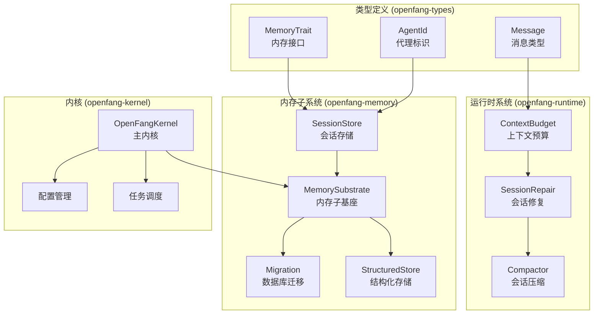

**图表来源**
- [lib.rs:1-20](file://crates/openfang-memory/src/lib.rs#L1-L20)
- [kernel.rs:1-100](file://crates/openfang-kernel/src/kernel.rs#L1-L100)

**章节来源**
- [lib.rs:1-20](file://crates/openfang-memory/src/lib.rs#L1-L20)
- [kernel.rs:505-567](file://crates/openfang-kernel/src/kernel.rs#L505-L567)

## 核心组件

### 会话存储器 (SessionStore)

会话存储器是会话管理系统的核心组件，负责与 SQLite 数据库交互，提供完整的 CRUD 操作：

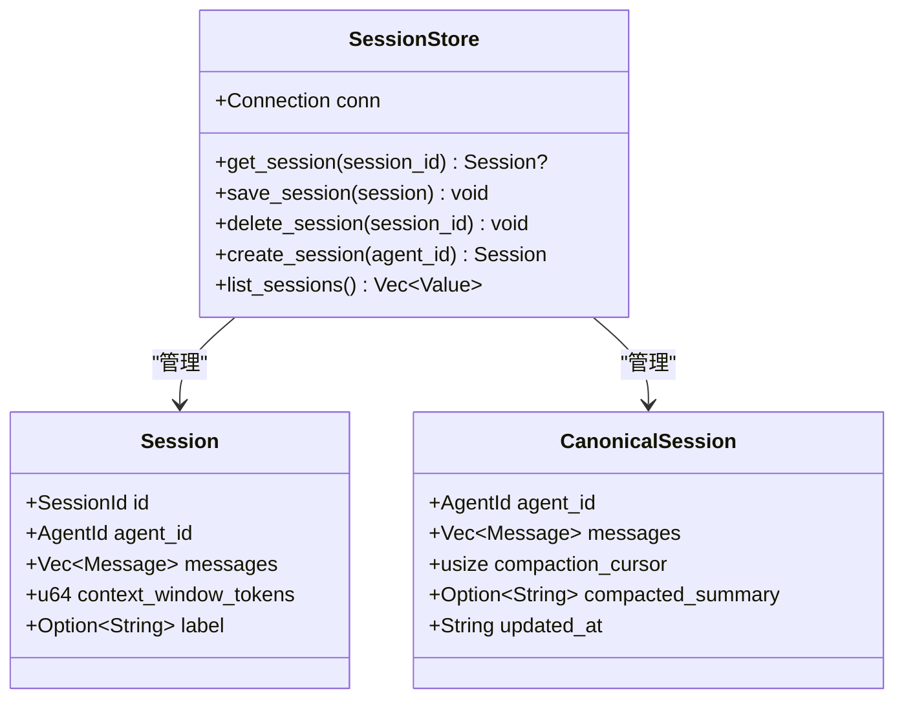

**图表来源**
- [session.rs:13-25](file://crates/openfang-memory/src/session.rs#L13-L25)
- [session.rs:28-31](file://crates/openfang-memory/src/session.rs#L28-L31)
- [session.rs:349-360](file://crates/openfang-memory/src/session.rs#L349-L360)

### 内存子基座 (MemorySubstrate)

内存子基座提供了统一的内存访问接口，抽象了三种存储后端：

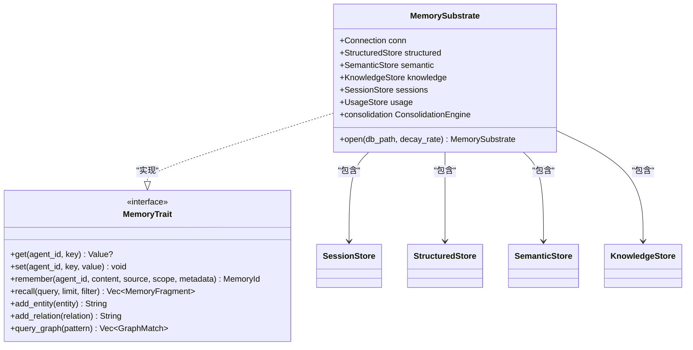

**图表来源**
- [substrate.rs:38-56](file://crates/openfang-memory/src/substrate.rs#L38-L56)
- [memory.rs:258-335](file://crates/openfang-types/src/memory.rs#L258-L335)

**章节来源**
- [session.rs:1-814](file://crates/openfang-memory/src/session.rs#L1-L814)
- [substrate.rs:38-63](file://crates/openfang-memory/src/substrate.rs#L38-L63)
- [memory.rs:258-335](file://crates/openfang-types/src/memory.rs#L258-L335)

## 架构概览

会话管理系统采用分层架构，确保了良好的模块化和可维护性：

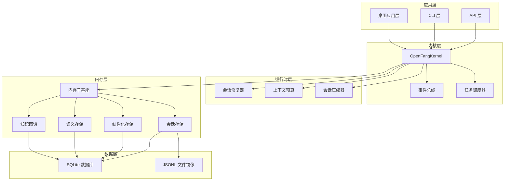

**图表来源**
- [kernel.rs:505-567](file://crates/openfang-kernel/src/kernel.rs#L505-L567)
- [session.rs:518-618](file://crates/openfang-memory/src/session.rs#L518-L618)

## 详细组件分析

### 会话历史存储设计

会话历史存储采用了二进制序列化和 SQLite 结合的方式，确保了高效的数据存储和检索：

#### 数据模型设计

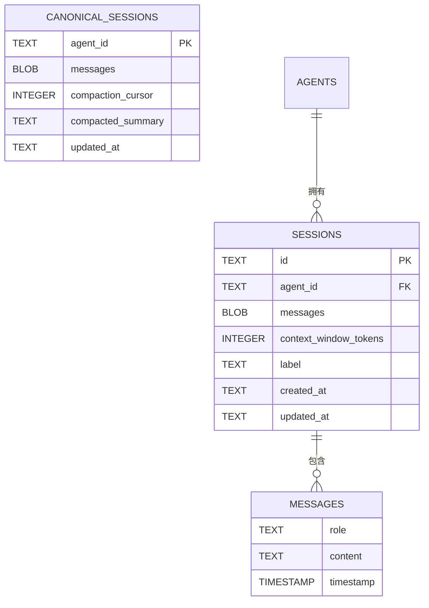

**图表来源**
- [migration.rs:88-96](file://crates/openfang-memory/src/migration.rs#L88-L96)
- [migration.rs:258-264](file://crates/openfang-memory/src/migration.rs#L258-L264)

#### 序列化机制

系统使用 MessagePack 进行高效的二进制序列化：

| 特性 | 实现方式 | 性能影响 |
|------|----------|----------|
| 消息序列化 | MessagePack (rmp_serde) | 2-3x 更紧凑 |
| JSONL 镜像 | JSON 序列化 | 便于调试和审计 |
| 压缩算法 | 无内置压缩 | 保持高性能 |

**章节来源**
- [session.rs:40-101](file://crates/openfang-memory/src/session.rs#L40-L101)
- [session.rs:518-618](file://crates/openfang-memory/src/session.rs#L518-L618)

### 上下文窗口令牌计数

系统实现了动态上下文预算管理，支持基于模型上下文窗口大小的智能资源分配：

#### 预算参数配置

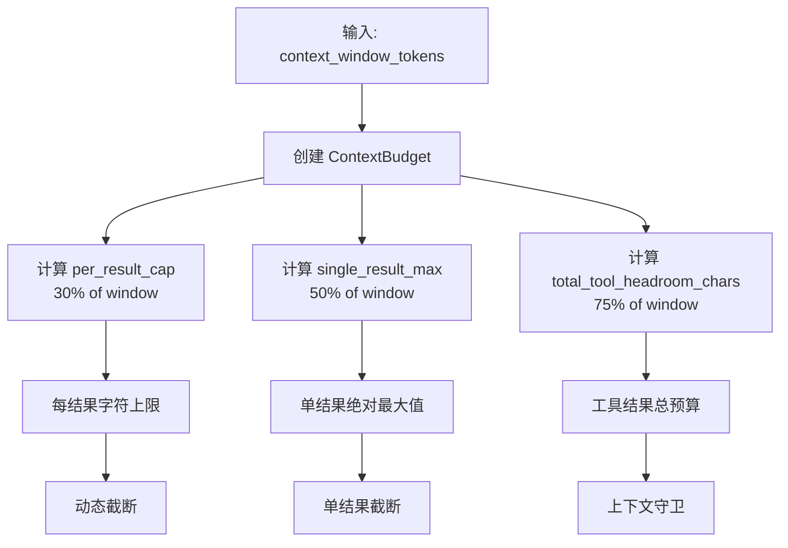

**图表来源**
- [context_budget.rs:12-56](file://crates/openfang-runtime/src/context_budget.rs#L12-L56)
- [context_budget.rs:58-94](file://crates/openfang-runtime/src/context_budget.rs#L58-L94)

#### 工具结果截断策略

系统采用两层截断策略：

1. **第一层：单结果截断** (30% of context window)
2. **第二层：上下文守卫** (75% headroom scanning)

**章节来源**
- [context_budget.rs:58-198](file://crates/openfang-runtime/src/context_budget.rs#L58-L198)

### SQLite 持久化

SQLite 提供了可靠的持久化存储，支持 ACID 事务和 WAL 模式：

#### 数据库初始化流程

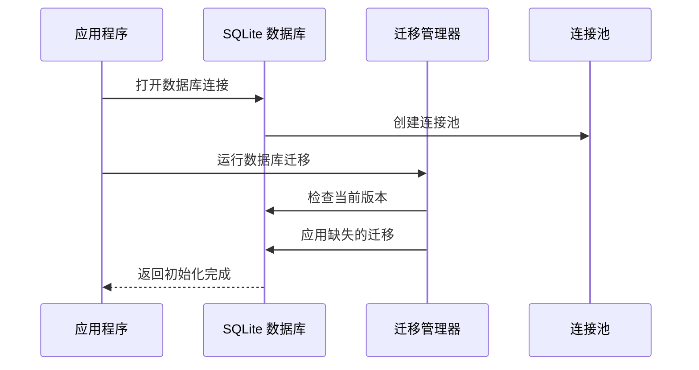

**图表来源**
- [substrate.rs:38-56](file://crates/openfang-memory/src/substrate.rs#L38-L56)
- [migration.rs:10-48](file://crates/openfang-memory/src/migration.rs#L10-L48)

#### 迁移版本管理

| 版本 | 功能 | 时间戳 |
|------|------|--------|
| v1 | 初始架构 (2024-01-01) | 初始版本 |
| v2 | 协作功能 (2024-02-15) | 任务队列增强 |
| v3 | 向量搜索 (2024-03-20) | 语义存储增强 |
| v4 | 成本追踪 (2024-04-10) | 使用事件表 |
| v5 | 跨渠道记忆 (2024-05-01) | canonical_sessions 表 |
| v6 | 会话标签 (2024-06-15) | sessions.label 字段 |
| v7 | 设备配对 (2024-07-22) | paired_devices 表 |
| v8 | 审计日志 (2024-08-30) | audit_entries 表 |

**章节来源**
- [migration.rs:7-48](file://crates/openfang-memory/src/migration.rs#L7-L48)
- [migration.rs:74-186](file://crates/openfang-memory/src/migration.rs#L74-L186)

### 内核重启恢复机制

系统具备完整的内核重启恢复能力，确保服务中断后会话数据的完整性和可用性：

#### 启动恢复流程

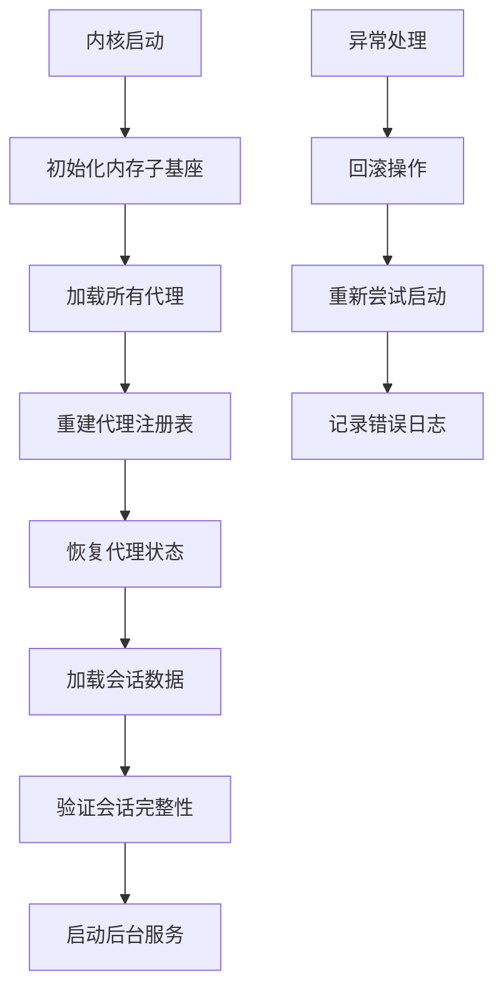

**图表来源**
- [kernel.rs:1054-1199](file://crates/openfang-kernel/src/kernel.rs#L1054-L1199)

#### 会话恢复策略

系统采用渐进式恢复策略：

1. **代理恢复**：从数据库加载所有代理配置
2. **状态重建**：重新注册代理到调度器
3. **会话加载**：按需加载活跃会话
4. **数据验证**：检查会话完整性和一致性

**章节来源**
- [kernel.rs:1054-1199](file://crates/openfang-kernel/src/kernel.rs#L1054-L1199)

### 会话压缩和优化

系统实现了多阶段的会话压缩机制，使用 LLM 来智能总结历史对话：

#### 压缩算法流程

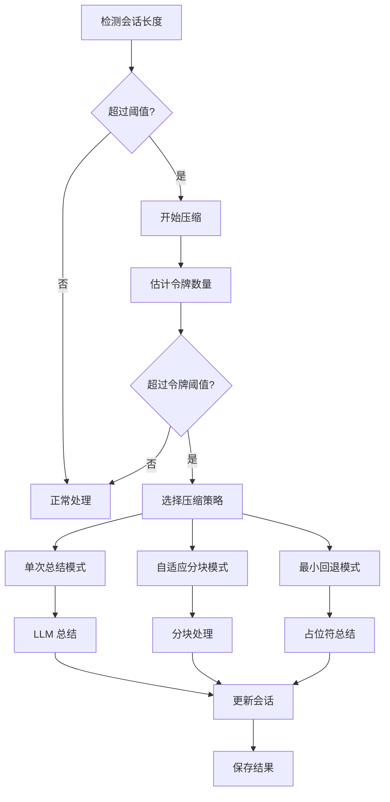

**图表来源**
- [compactor.rs:82-85](file://crates/openfang-runtime/src/compactor.rs#L82-L85)
- [compactor.rs:610-719](file://crates/openfang-runtime/src/compactor.rs#L610-L719)

#### 压缩配置参数

| 参数 | 默认值 | 说明 |
|------|--------|------|
| threshold | 30 | 触发压缩的消息数量阈值 |
| keep_recent | 10 | 保留的最新消息数量 |
| max_summary_tokens | 1024 | 总结的最大令牌数 |
| base_chunk_ratio | 0.4 | 基础分块比例 |
| min_chunk_ratio | 0.15 | 最小分块比例 |
| token_threshold_ratio | 0.7 | 令牌阈值比例 |
| context_window_tokens | 200,000 | 上下文窗口大小 |

**章节来源**
- [compactor.rs:22-65](file://crates/openfang-runtime/src/compactor.rs#L22-L65)
- [compactor.rs:610-719](file://crates/openfang-runtime/src/compactor.rs#L610-L719)

### 会话修复和验证

系统提供了强大的会话修复机制，确保消息历史的完整性和有效性：

#### 修复流程

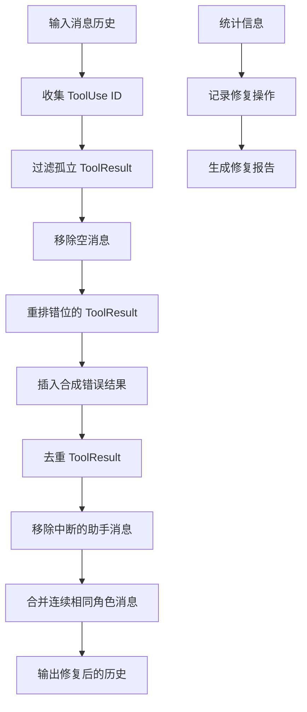

**图表来源**
- [session_repair.rs:35-46](file://crates/openfang-runtime/src/session_repair.rs#L35-L46)
- [session_repair.rs:180-320](file://crates/openfang-runtime/src/session_repair.rs#L180-L320)

#### 安全防护措施

系统实现了多层次的安全防护：

1. **工具结果清理**：移除潜在的恶意内容
2. **注入攻击防护**：检测和清理提示注入标记
3. **数据完整性检查**：验证消息结构的有效性
4. **并发安全**：防止竞态条件和数据损坏

**章节来源**
- [session_repair.rs:1-800](file://crates/openfang-runtime/src/session_repair.rs#L1-L800)

## 依赖关系分析

会话管理系统具有清晰的依赖层次结构，确保了模块间的松耦合：

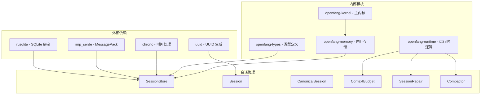

**图表来源**
- [session.rs:1-11](file://crates/openfang-memory/src/session.rs#L1-L11)
- [context_budget.rs:8-10](file://crates/openfang-runtime/src/context_budget.rs#L8-L10)

**章节来源**
- [session.rs:1-11](file://crates/openfang-memory/src/session.rs#L1-L11)
- [context_budget.rs:8-10](file://crates/openfang-runtime/src/context_budget.rs#L8-L10)

## 性能考虑

会话管理系统在设计时充分考虑了性能优化，采用了多种策略来确保高吞吐量和低延迟：

### 存储优化策略

1. **二进制序列化**：使用 MessagePack 减少存储空间和序列化开销
2. **批量操作**：支持批量查询和更新操作
3. **连接池管理**：复用数据库连接，减少连接开销
4. **索引优化**：为常用查询字段建立适当的索引

### 内存管理

1. **懒加载机制**：按需加载会话数据，避免内存占用过高
2. **缓存策略**：实现多级缓存，平衡内存使用和性能
3. **垃圾回收**：定期清理过期的会话数据

### 并发控制

1. **读写分离**：区分读操作和写操作，优化并发性能
2. **锁粒度控制**：使用细粒度锁减少竞争
3. **异步处理**：大量使用异步 I/O 操作

## 故障排除指南

### 常见问题及解决方案

#### 会话数据丢失

**症状**：重启后会话历史不完整
**原因**：数据库连接异常或事务未正确提交
**解决方法**：
1. 检查数据库文件权限
2. 验证 WAL 日志完整性
3. 执行数据库完整性检查

#### 会话加载失败

**症状**：无法加载特定会话
**原因**：序列化格式不兼容或数据损坏
**解决方法**：
1. 检查 MessagePack 序列化版本
2. 验证 JSONL 镜像文件完整性
3. 执行数据修复操作

#### 性能问题

**症状**：会话操作响应缓慢
**原因**：数据库索引缺失或查询优化不足
**解决方法**：
1. 分析慢查询日志
2. 添加必要的数据库索引
3. 优化查询语句

**章节来源**
- [session.rs:620-800](file://crates/openfang-memory/src/session.rs#L620-L800)
- [migration.rs:331-364](file://crates/openfang-memory/src/migration.rs#L331-L364)

## 结论

会话管理系统通过精心设计的架构和实现，成功地解决了对话历史存储、上下文窗口管理、持久化和恢复等核心挑战。系统的主要优势包括：

1. **可靠性**：基于 SQLite 的持久化存储确保了数据的完整性和可靠性
2. **性能**：采用二进制序列化和优化的数据库设计，提供了出色的性能表现
3. **可扩展性**：模块化的架构设计支持功能的平滑扩展
4. **安全性**：实现了多层次的安全防护和数据验证机制
5. **可维护性**：清晰的代码结构和完善的测试覆盖

该系统为 OpenFang Agent Operating System 提供了坚实的会话管理基础，支持复杂的多代理协作场景和长期记忆需求。通过持续的优化和改进，系统将继续为用户提供高质量的会话管理体验。