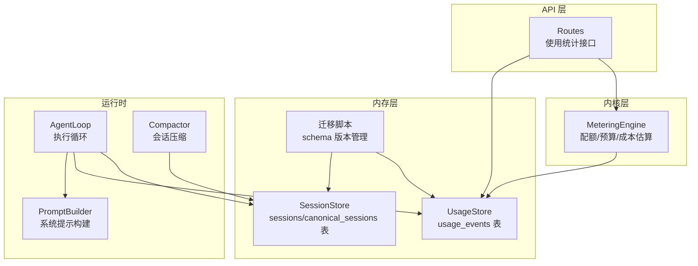
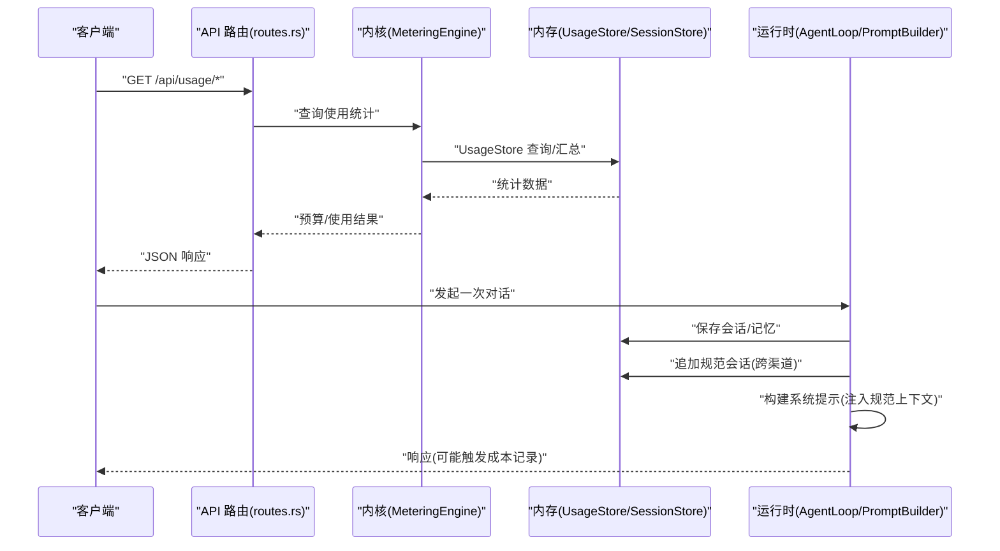
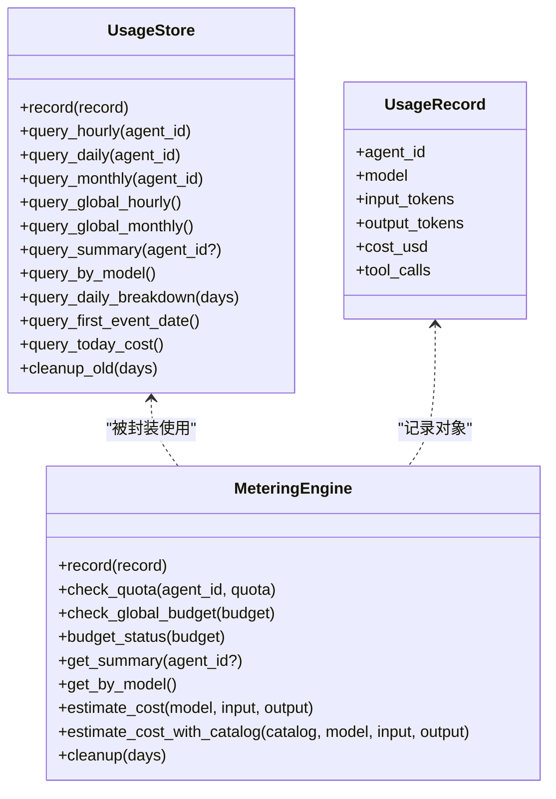
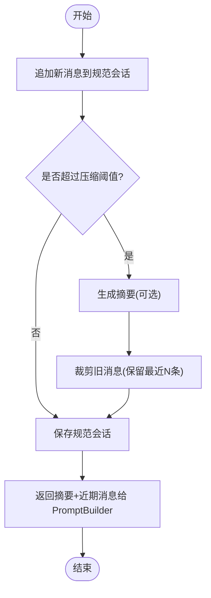
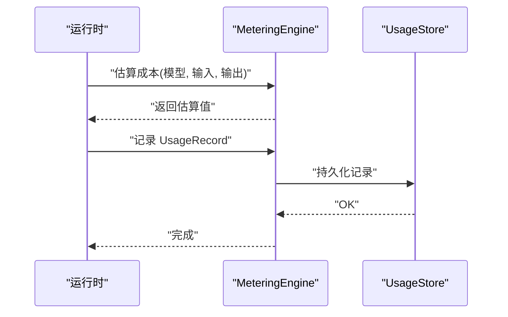
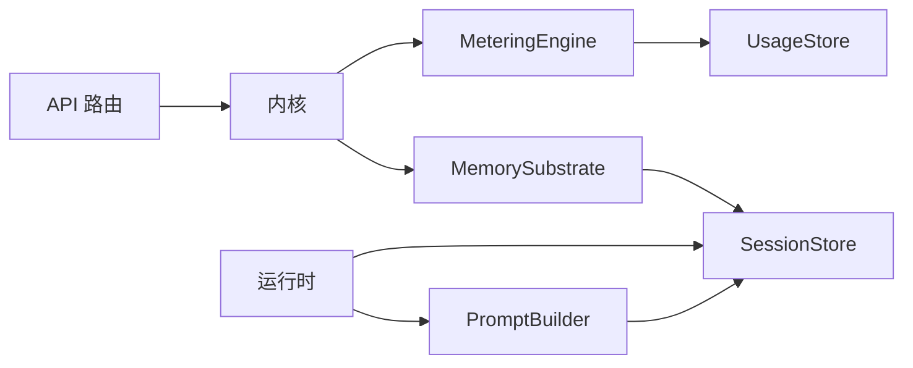

# 使用统计和规范会话

<cite>
**本文档引用的文件**
- [usage.rs](file://crates/openfang-memory/src/usage.rs)
- [session.rs](file://crates/openfang-memory/src/session.rs)
- [migration.rs](file://crates/openfang-memory/src/migration.rs)
- [routes.rs](file://crates/openfang-api/src/routes.rs)
- [metering.rs](file://crates/openfang-kernel/src/metering.rs)
- [prompt_builder.rs](file://crates/openfang-runtime/src/prompt_builder.rs)
- [agent_loop.rs](file://crates/openfang-runtime/src/agent_loop.rs)
- [compactor.rs](file://crates/openfang-runtime/src/compactor.rs)
</cite>

## 目录
1. [简介](#简介)
2. [项目结构](#项目结构)
3. [核心组件](#核心组件)
4. [架构总览](#架构总览)
5. [详细组件分析](#详细组件分析)
6. [依赖关系分析](#依赖关系分析)
7. [性能考虑](#性能考虑)
8. [故障排除指南](#故障排除指南)
9. [结论](#结论)
10. [附录](#附录)

## 简介
本文件聚焦于两个核心主题：使用统计与成本追踪，以及规范会话（CanonicalSession）设计与跨渠道记忆。前者涵盖 usage_events 表的持久化存储、token 计数跟踪、成本估算与模型使用统计；后者涵盖跨渠道上下文聚合、会话摘要生成与系统提示注入等能力。文档同时提供使用分析与成本优化策略，帮助读者在实际部署中实现可观测性与成本控制。

## 项目结构
围绕使用统计与规范会话的关键模块分布如下：
- 内存子系统（openfang-memory）
  - usage.rs：usage_events 表的持久化与查询接口
  - session.rs：会话与规范会话的加载、保存与压缩
  - migration.rs：SQLite 模式迁移（含 usage_events 与 canonical_sessions）
- 核心内核（openfang-kernel）
  - metering.rs：计量引擎，负责配额检查、预算状态与成本估算
- 运行时（openfang-runtime）
  - prompt_builder.rs：系统提示构建器，支持跨渠道上下文注入
  - agent_loop.rs：代理循环，保存会话与记忆
  - compactor.rs：会话压缩器，用于生成摘要并裁剪历史
- API 层（openfang-api）
  - routes.rs：提供使用统计的 HTTP 接口

**图表来源**
- [usage.rs:70-352](file://crates/openfang-memory/src/usage.rs#L70-L352)
- [session.rs:27-516](file://crates/openfang-memory/src/session.rs#L27-L516)
- [migration.rs:230-271](file://crates/openfang-memory/src/migration.rs#L230-L271)
- [metering.rs:8-213](file://crates/openfang-kernel/src/metering.rs#L8-L213)
- [prompt_builder.rs:64-206](file://crates/openfang-runtime/src/prompt_builder.rs#L64-L206)
- [agent_loop.rs:140-525](file://crates/openfang-runtime/src/agent_loop.rs#L140-L525)
- [compactor.rs:22-719](file://crates/openfang-runtime/src/compactor.rs#L22-L719)
- [routes.rs:5200-5261](file://crates/openfang-api/src/routes.rs#L5200-L5261)

**章节来源**
- [usage.rs:1-352](file://crates/openfang-memory/src/usage.rs#L1-L352)
- [session.rs:1-516](file://crates/openfang-memory/src/session.rs#L1-L516)
- [migration.rs:230-271](file://crates/openfang-memory/src/migration.rs#L230-L271)
- [metering.rs:1-213](file://crates/openfang-kernel/src/metering.rs#L1-L213)
- [prompt_builder.rs:1-206](file://crates/openfang-runtime/src/prompt_builder.rs#L1-L206)
- [agent_loop.rs:140-525](file://crates/openfang-runtime/src/agent_loop.rs#L140-L525)
- [compactor.rs:22-719](file://crates/openfang-runtime/src/compactor.rs#L22-L719)
- [routes.rs:5200-5261](file://crates/openfang-api/src/routes.rs#L5200-L5261)

## 核心组件
- 使用统计与成本追踪
  - UsageStore：封装 usage_events 表的插入、查询与清理，支持按小时/日/月/全局维度的成本统计，以及按模型分组与每日分解。
  - MeteringEngine：基于 UsageStore 提供配额检查、全局预算检查与预算状态快照，并内置成本估算逻辑。
- 规范会话与跨渠道记忆
  - SessionStore：提供常规会话与规范会话（CanonicalSession）的加载、保存与压缩。
  - PromptBuilder：将规范会话摘要与近期消息注入到系统提示或独立消息中，确保跨渠道上下文稳定且可缓存。
  - AgentLoop：在每次交互后保存会话并进行记忆归档，触发跨渠道上下文累积。
  - Compactor：在消息过多时生成摘要并裁剪历史，避免上下文溢出。

**章节来源**
- [usage.rs:70-352](file://crates/openfang-memory/src/usage.rs#L70-L352)
- [metering.rs:8-213](file://crates/openfang-kernel/src/metering.rs#L8-L213)
- [session.rs:340-516](file://crates/openfang-memory/src/session.rs#L340-L516)
- [prompt_builder.rs:64-206](file://crates/openfang-runtime/src/prompt_builder.rs#L64-L206)
- [agent_loop.rs:502-525](file://crates/openfang-runtime/src/agent_loop.rs#L502-L525)
- [compactor.rs:22-719](file://crates/openfang-runtime/src/compactor.rs#L22-L719)

## 架构总览
使用统计与规范会话的端到端流程如下：

**图表来源**
- [routes.rs:5200-5261](file://crates/openfang-api/src/routes.rs#L5200-L5261)
- [metering.rs:102-133](file://crates/openfang-kernel/src/metering.rs#L102-L133)
- [usage.rs:82-106](file://crates/openfang-memory/src/usage.rs#L82-L106)
- [session.rs:410-475](file://crates/openfang-memory/src/session.rs#L410-L475)
- [prompt_builder.rs:64-206](file://crates/openfang-runtime/src/prompt_builder.rs#L64-L206)
- [agent_loop.rs:502-525](file://crates/openfang-runtime/src/agent_loop.rs#L502-L525)

## 详细组件分析

### 使用统计与成本追踪（usage_events 表）
- 数据模型与持久化
  - 表结构：包含 agent_id、timestamp、model、input_tokens、output_tokens、cost_usd、tool_calls 等字段，并建立索引以提升查询效率。
  - 插入：每次 LLM 调用完成后记录一条 UsageRecord，自动写入唯一 id 与时间戳。
  - 清理：支持按天删除过期事件，防止表膨胀。
- 查询与统计
  - 维度查询：按小时、按日、按月、全局查询成本。
  - 聚合查询：按模型分组统计消费、token 与调用次数；按日期分解每日成本与调用量。
  - 首条事件与今日成本：辅助仪表盘与告警。
- 成本估算
  - MeteringEngine 内置估算函数，基于模型族映射输入/输出单价，按百万分之一计算费用；支持从模型目录动态获取定价。
- API 接口
  - 提供按模型与每日分解的使用统计接口，返回结构化的 JSON。

**图表来源**
- [usage.rs:70-352](file://crates/openfang-memory/src/usage.rs#L70-L352)
- [metering.rs:8-213](file://crates/openfang-kernel/src/metering.rs#L8-L213)

**章节来源**
- [usage.rs:70-352](file://crates/openfang-memory/src/usage.rs#L70-L352)
- [metering.rs:140-213](file://crates/openfang-kernel/src/metering.rs#L140-L213)
- [routes.rs:5200-5261](file://crates/openfang-api/src/routes.rs#L5200-L5261)

### 规范会话与跨渠道记忆（CanonicalSession）
- 设计目标
  - 为每个 Agent 维持一个跨渠道的“规范会话”，所有渠道的消息都会汇聚到该会话，实现跨平台上下文共享。
- 关键能力
  - 加载/保存：支持从 canonical_sessions 表读取与写入，采用消息序列化与时间戳更新。
  - 追加与压缩：当消息数量超过阈值时，自动生成摘要并裁剪旧消息，保留最近若干条消息。
  - 上下文窗口：支持指定窗口大小返回近期消息，并附带已生成的摘要。
- 与系统提示注入的关系
  - PromptBuilder 将规范会话摘要作为独立用户消息注入，避免系统提示频繁变化导致的缓存失效。
- 运行时集成
  - AgentLoop 在每次交互后保存会话并进行记忆归档，随后通过 PromptBuilder 注入上下文。

**图表来源**
- [session.rs:410-475](file://crates/openfang-memory/src/session.rs#L410-L475)
- [prompt_builder.rs:272-285](file://crates/openfang-runtime/src/prompt_builder.rs#L272-L285)
- [agent_loop.rs:502-525](file://crates/openfang-runtime/src/agent_loop.rs#L502-L525)

**章节来源**
- [session.rs:340-516](file://crates/openfang-memory/src/session.rs#L340-L516)
- [prompt_builder.rs:272-285](file://crates/openfang-runtime/src/prompt_builder.rs#L272-L285)
- [agent_loop.rs:502-525](file://crates/openfang-runtime/src/agent_loop.rs#L502-L525)

### 成本估算与模型使用统计
- 成本估算
  - 内置模型族映射，按输入/输出单价估算单次调用成本；未知模型回退至默认价格。
  - 支持从模型目录获取精确定价，优先级更高。
- 模型使用统计
  - 按模型分组统计总成本、总 token 与调用次数，便于识别高成本模型与优化方向。
- 预算与配额
  - 支持按小时/日/月维度检查单 Agent 与全局预算，超限即触发错误。
  - 预算状态以百分比形式展示，便于前端可视化。

**图表来源**
- [metering.rs:145-207](file://crates/openfang-kernel/src/metering.rs#L145-L207)
- [usage.rs:82-106](file://crates/openfang-memory/src/usage.rs#L82-L106)

**章节来源**
- [metering.rs:145-207](file://crates/openfang-kernel/src/metering.rs#L145-L207)
- [usage.rs:233-303](file://crates/openfang-memory/src/usage.rs#L233-L303)

## 依赖关系分析
- 组件耦合
  - MeteringEngine 依赖 UsageStore 进行数据持久化与查询。
  - API 层通过 Kernel 的 Memory 子系统访问 UsageStore 与 SessionStore。
  - PromptBuilder 依赖 CanonicalSession 的摘要与近期消息，实现稳定的上下文注入。
- 外部依赖
  - SQLite（rusqlite）用于持久化。
  - 序列化（rmp-serde）用于消息与摘要的二进制存储。
  - 时间与时区（chrono）用于时间戳管理。

**图表来源**
- [routes.rs:5200-5261](file://crates/openfang-api/src/routes.rs#L5200-L5261)
- [metering.rs:8-213](file://crates/openfang-kernel/src/metering.rs#L8-L213)
- [usage.rs:70-352](file://crates/openfang-memory/src/usage.rs#L70-L352)
- [session.rs:27-516](file://crates/openfang-memory/src/session.rs#L27-L516)
- [prompt_builder.rs:64-206](file://crates/openfang-runtime/src/prompt_builder.rs#L64-L206)

**章节来源**
- [routes.rs:5200-5261](file://crates/openfang-api/src/routes.rs#L5200-L5261)
- [metering.rs:8-213](file://crates/openfang-kernel/src/metering.rs#L8-L213)
- [usage.rs:70-352](file://crates/openfang-memory/src/usage.rs#L70-L352)
- [session.rs:27-516](file://crates/openfang-memory/src/session.rs#L27-L516)
- [prompt_builder.rs:64-206](file://crates/openfang-runtime/src/prompt_builder.rs#L64-L206)

## 性能考虑
- 查询性能
  - 为 usage_events 建立复合索引（agent_id, timestamp）与时间索引，降低高频查询成本。
  - 分页/限制返回条目数量，避免一次性拉取大量历史数据。
- 存储与清理
  - 定期清理过期 usage_events，建议保留 90–180 天，结合业务需求调整。
  - 对 canonical_sessions 采用摘要压缩，减少大体量消息的序列化与 IO 开销。
- 缓存与提示稳定性
  - 将规范会话摘要注入为独立消息，避免系统提示频繁变化导致的缓存失效，提高推理效率。
- 估算成本的开销
  - 成本估算为纯内存计算，开销极低；若模型目录较大，可预热缓存以减少解析成本。

[本节为通用指导，无需特定文件引用]

## 故障排除指南
- 无法查询使用统计
  - 检查数据库连接与 schema 是否正确迁移（migration）。
  - 确认 API 路由是否正确调用 Kernel.Memory 与 UsageStore。
- 成本估算异常
  - 确认模型名称是否匹配内置映射；未知模型将回退默认价格。
  - 若使用模型目录，请确认目录可用且定价键存在。
- 规范会话未生效
  - 确认 AgentLoop 是否在每次交互后调用保存会话与追加规范会话。
  - 检查 PromptBuilder 是否正确注入了规范上下文消息。
- 预算告警不准确
  - 检查预算配置项（小时/日/月上限）是否设置合理。
  - 确认查询维度与时间范围一致（如按日查询需考虑时区与起始日）。

**章节来源**
- [migration.rs:230-271](file://crates/openfang-memory/src/migration.rs#L230-L271)
- [routes.rs:5200-5261](file://crates/openfang-api/src/routes.rs#L5200-L5261)
- [metering.rs:64-100](file://crates/openfang-kernel/src/metering.rs#L64-L100)
- [prompt_builder.rs:272-285](file://crates/openfang-runtime/src/prompt_builder.rs#L272-L285)
- [agent_loop.rs:502-525](file://crates/openfang-runtime/src/agent_loop.rs#L502-L525)

## 结论
通过 usage_events 表与 MeteringEngine，系统实现了细粒度的成本追踪与预算控制；借助 CanonicalSession 与 PromptBuilder，跨渠道上下文得以稳定持久地注入到系统提示中，既保证了用户体验，又提升了推理效率。配合定期清理与合理的预算配置，可在保障服务质量的同时有效控制成本。

[本节为总结性内容，无需特定文件引用]

## 附录

### 使用分析与成本优化策略
- 使用分析
  - 按模型分组识别高成本模型，评估是否可通过更经济的模型或参数调整替代。
  - 分析每日趋势，识别业务高峰时段，提前扩容或限流。
  - 统计工具调用次数，评估自动化程度对成本的影响。
- 成本优化
  - 合理选择模型：在满足质量的前提下优先选择更低成本的模型族。
  - 控制上下文长度：利用压缩与摘要机制减少 token 消耗。
  - 预算与配额：为不同 Agent 设置差异化限额，避免个别 Agent 消耗过大。
  - 清理策略：定期清理历史使用记录，保持数据库健康。

[本节为通用指导，无需特定文件引用]