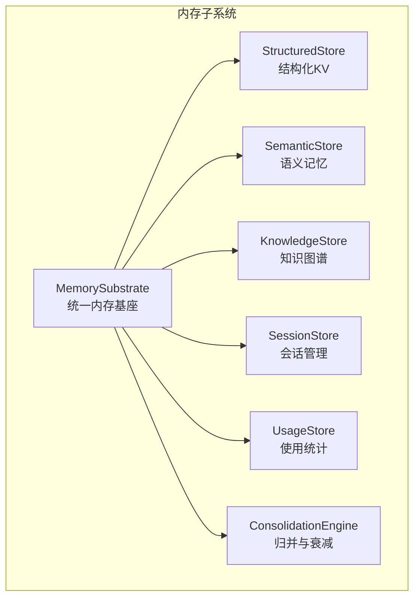
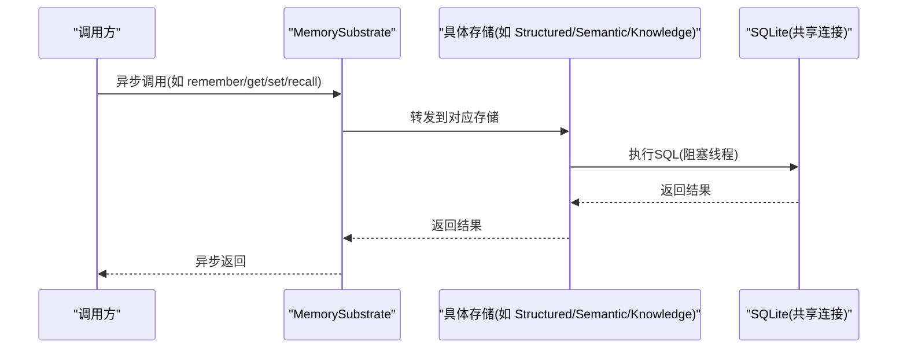
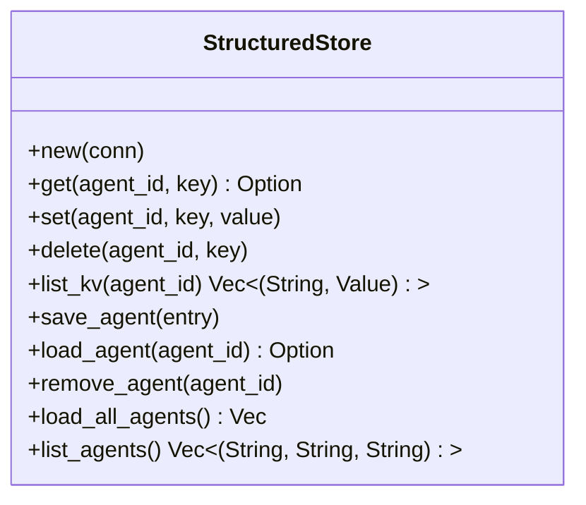
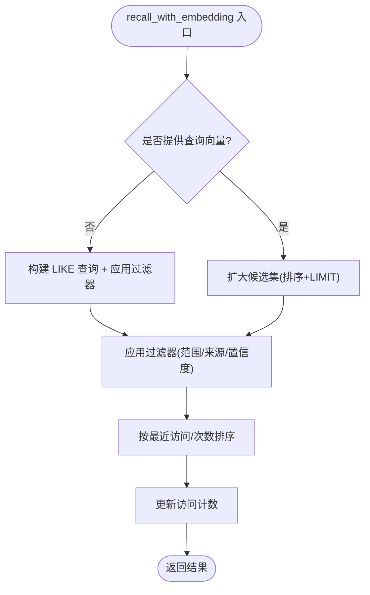
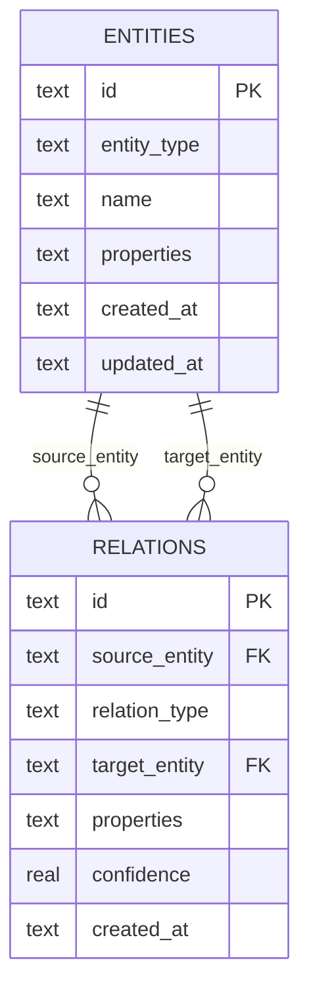
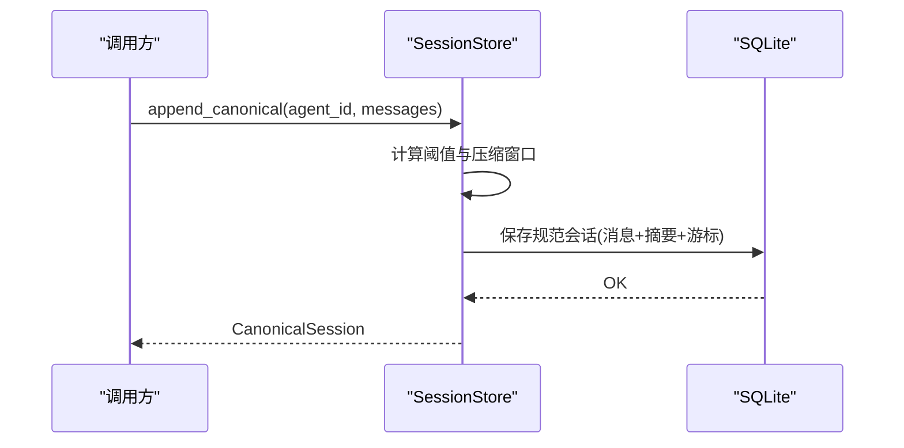
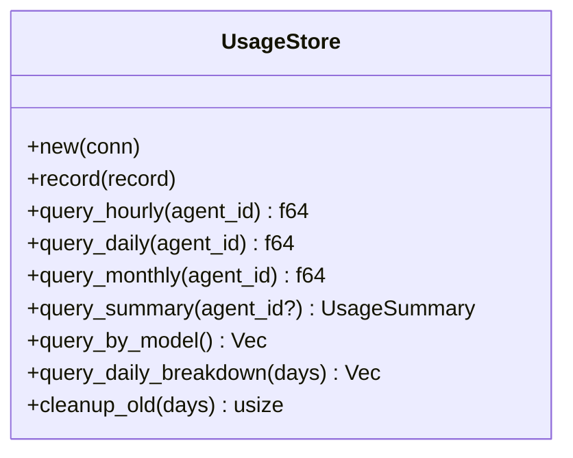
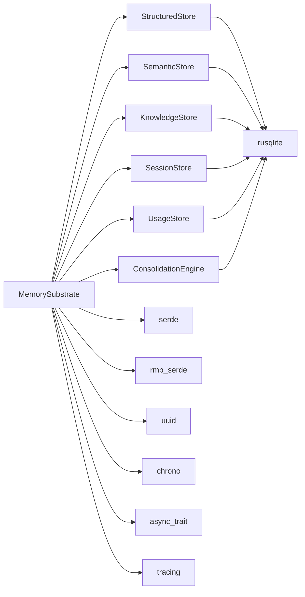

# 内存子系统

<cite>
**本文档引用的文件**
- [lib.rs](file://crates/openfang-memory/src/lib.rs)
- [substrate.rs](file://crates/openfang-memory/src/substrate.rs)
- [structured.rs](file://crates/openfang-memory/src/structured.rs)
- [semantic.rs](file://crates/openfang-memory/src/semantic.rs)
- [knowledge.rs](file://crates/openfang-memory/src/knowledge.rs)
- [session.rs](file://crates/openfang-memory/src/session.rs)
- [usage.rs](file://crates/openfang-memory/src/usage.rs)
- [consolidation.rs](file://crates/openfang-memory/src/consolidation.rs)
- [migration.rs](file://crates/openfang-memory/src/migration.rs)
- [memory.rs](file://crates/openfang-types/src/memory.rs)
- [Cargo.toml](file://crates/openfang-memory/Cargo.toml)
- [Cargo.toml](file://Cargo.toml)
</cite>

## 目录
1. [简介](#简介)
2. [项目结构](#项目结构)
3. [核心组件](#核心组件)
4. [架构总览](#架构总览)
5. [详细组件分析](#详细组件分析)
6. [依赖关系分析](#依赖关系分析)
7. [性能考虑](#性能考虑)
8. [故障排除指南](#故障排除指南)
9. [结论](#结论)
10. [附录](#附录)

## 简介
OpenFang 内存子系统采用六层存储架构，统一抽象为一个 `Memory` 接口，底层由 SQLite 提供持久化支持。该架构包括：
- 结构化键值存储（Structured KV Store）
- 语义搜索（Semantic Search）
- 知识图谱（Knowledge Graph）
- 会话管理（Session Manager）
- 使用统计与规范会话（Usage and Canonical Sessions）

通过共享的 SQLite 连接和 WAL 模式，系统在保证一致性的同时提供良好的并发能力，并内置迁移机制、归并与衰减策略，以及成本计量功能。

## 项目结构
内存子系统位于 `crates/openfang-memory`，核心模块如下：
- `lib.rs`: 模块导出入口
- `substrate.rs`: 统一实现 `Memory` trait 的内存基座
- `structured.rs`: 结构化键值存储与代理持久化
- `semantic.rs`: 语义记忆与向量检索
- `knowledge.rs`: 实体关系知识图谱
- `session.rs`: 会话历史与跨渠道规范会话
- `usage.rs`: 使用统计与成本计量
- `consolidation.rs`: 记忆归并与衰减
- `migration.rs`: SQLite 架构迁移

**图表来源**
- [substrate.rs:26-56](file://crates/openfang-memory/src/substrate.rs#L26-L56)
- [lib.rs:10-19](file://crates/openfang-memory/src/lib.rs#L10-L19)

**章节来源**
- [lib.rs:1-20](file://crates/openfang-memory/src/lib.rs#L1-L20)
- [Cargo.toml:1-24](file://crates/openfang-memory/Cargo.toml#L1-L24)

## 核心组件
- MemorySubstrate：组合各存储层，提供统一异步 API；初始化时启用 WAL 并运行迁移
- StructuredStore：基于 SQLite 的键值存储与代理状态持久化
- SemanticStore：支持文本 LIKE 匹配与向量相似度检索的记忆库
- KnowledgeStore：实体-关系知识图谱，支持模式查询
- SessionStore：会话历史管理与跨渠道规范会话（canonical session）
- UsageStore：LLM 使用事件记录与成本统计
- ConsolidationEngine：定期衰减旧记忆置信度

**章节来源**
- [substrate.rs:26-56](file://crates/openfang-memory/src/substrate.rs#L26-L56)
- [structured.rs:9-13](file://crates/openfang-memory/src/structured.rs#L9-L13)
- [semantic.rs:19-23](file://crates/openfang-memory/src/semantic.rs#L19-L23)
- [knowledge.rs:15-19](file://crates/openfang-memory/src/knowledge.rs#L15-L19)
- [session.rs:27-31](file://crates/openfang-memory/src/session.rs#L27-L31)
- [usage.rs:70-74](file://crates/openfang-memory/src/usage.rs#L70-L74)
- [consolidation.rs:12-18](file://crates/openfang-memory/src/consolidation.rs#L12-L18)

## 架构总览
内存子系统通过 MemorySubstrate 将多层存储整合为单一接口，所有写操作在阻塞线程中执行以避免阻塞 Tokio 运行时，读操作同样封装为异步调用。SQLite 采用 WAL 模式提升并发读写性能，并设置忙等待超时。

**图表来源**
- [substrate.rs:571-681](file://crates/openfang-memory/src/substrate.rs#L571-L681)
- [substrate.rs:152-160](file://crates/openfang-memory/src/substrate.rs#L152-L160)

**章节来源**
- [substrate.rs:38-74](file://crates/openfang-memory/src/substrate.rs#L38-L74)

## 详细组件分析

### 结构化键值存储（Structured KV Store）
- 数据模型
  - kv_store 表：按 agent_id + key 唯一定位键值对，支持版本号与更新时间
  - agents 表：代理清单，包含清单、状态、会话 ID、身份信息等
- 存储策略
  - 键值序列化为 JSON Blob 存储，支持更新时版本递增
  - 代理清单使用 MessagePack 序列化 manifest，JSON 序列化 state
  - 兼容性：自动添加新列并回退处理旧数据库结构
- 查询接口
  - get/set/delete/list_kv：标准键值操作
  - save_agent/load_agent/remove_agent/load_all_agents/list_agents：代理生命周期管理
- 性能特征
  - 主键索引保证 O(1) 查找
  - 列扩展兼容旧表结构，避免破坏性迁移

**图表来源**
- [structured.rs:10-440](file://crates/openfang-memory/src/structured.rs#L10-L440)

**章节来源**
- [structured.rs:21-111](file://crates/openfang-memory/src/structured.rs#L21-L111)
- [structured.rs:113-254](file://crates/openfang-memory/src/structured.rs#L113-L254)
- [structured.rs:256-414](file://crates/openfang-memory/src/structured.rs#L256-L414)

### 语义搜索（Semantic Search）
- 数据模型
  - memories 表：内容、来源、置信度、元数据、访问计数、删除标记、可选嵌入向量
- 存储策略
  - 文本匹配：LIKE 模糊匹配（无嵌入时）
  - 向量检索：存储 f32 向量为 BLOB，查询时计算余弦相似度重排
  - 访问统计：每次召回增加访问计数与更新时间
- 查询接口
  - remember/remember_with_embedding：新增记忆
  - recall/recall_with_embedding：检索记忆（支持过滤器）
  - forget：软删除
  - update_embedding：更新已有记忆的嵌入
- 性能特征
  - 非向量模式：LIKE 查询 + 多字段索引
  - 向量模式：先拉取候选再重排，限制候选数量避免全表扫描

**图表来源**
- [semantic.rs:95-277](file://crates/openfang-memory/src/semantic.rs#L95-L277)

**章节来源**
- [semantic.rs:31-81](file://crates/openfang-memory/src/semantic.rs#L31-L81)
- [semantic.rs:83-277](file://crates/openfang-memory/src/semantic.rs#L83-L277)

### 知识图谱（Knowledge Graph）
- 数据模型
  - entities 表：实体类型、名称、属性、创建/更新时间
  - relations 表：源实体、关系类型、目标实体、属性、置信度、创建时间
- 存储策略
  - 实体去重：按 ID 更新或插入
  - 关系唯一性：插入时生成新 ID
  - 图查询：JOIN 实体与关系，支持源/关系/目标过滤
- 查询接口
  - add_entity/add_relation：新增实体/关系
  - query_graph：图模式查询
- 性能特征
  - 多字段索引覆盖常见过滤条件
  - 限制返回条目数量防止过度膨胀

**图表来源**
- [knowledge.rs:15-196](file://crates/openfang-memory/src/knowledge.rs#L15-L196)

**章节来源**
- [knowledge.rs:27-80](file://crates/openfang-memory/src/knowledge.rs#L27-L80)
- [knowledge.rs:82-196](file://crates/openfang-memory/src/knowledge.rs#L82-L196)

### 会话管理（Session Manager）
- 数据模型
  - sessions 表：消息历史（MessagePack）、上下文令牌估算、标签、创建/更新时间
  - canonical_sessions 表：跨渠道持久化会话，包含压缩游标与摘要
- 存储策略
  - 会话持久化：消息序列化为二进制 Blob
  - 规范会话：超过阈值自动压缩，保留最近消息与摘要
- 查询接口
  - get_session/save_session/delete_session/list_sessions/create_session
  - 标签管理：set_session_label/find_session_by_label
  - 规范会话：load_canonical/append_canonical/canonical_context/store_llm_summary
  - JSONL 导出：write_jsonl_mirror
- 性能特征
  - 默认窗口大小与压缩阈值可配置
  - 最近消息优先返回，减少大体量上下文传输

**图表来源**
- [session.rs:410-475](file://crates/openfang-memory/src/session.rs#L410-L475)

**章节来源**
- [session.rs:39-115](file://crates/openfang-memory/src/session.rs#L39-L115)
- [session.rs:117-183](file://crates/openfang-memory/src/session.rs#L117-L183)
- [session.rs:185-260](file://crates/openfang-memory/src/session.rs#L185-L260)
- [session.rs:322-335](file://crates/openfang-memory/src/session.rs#L322-L335)
- [session.rs:364-475](file://crates/openfang-memory/src/session.rs#L364-L475)
- [session.rs:528-618](file://crates/openfang-memory/src/session.rs#L528-L618)

### 使用统计与规范会话（Usage and Canonical Sessions）
- 使用统计（UsageStore）
  - 数据模型：usage_events 表，记录代理、模型、输入/输出令牌、成本、工具调用次数
  - 查询接口：小时/日/月成本、全局统计、按模型分组、每日分解、清理过期数据
- 规范会话（SessionStore 中的 CanonicalSession）
  - 跨渠道上下文持久化，支持 LLM 生成摘要替换旧消息
  - 可配置压缩阈值与最近窗口大小

**图表来源**
- [usage.rs:70-352](file://crates/openfang-memory/src/usage.rs#L70-L352)

**章节来源**
- [usage.rs:82-352](file://crates/openfang-memory/src/usage.rs#L82-L352)
- [session.rs:343-475](file://crates/openfang-memory/src/session.rs#L343-L475)

### 记忆归并与衰减（Consolidation）
- 功能：定期降低长时间未访问记忆的置信度，为后续阶段的合并做准备
- 参数：衰减率（0~1），默认周期为 7 天

**章节来源**
- [consolidation.rs:26-53](file://crates/openfang-memory/src/consolidation.rs#L26-L53)

## 依赖关系分析
- 组件耦合
  - MemorySubstrate 组合各存储层并通过共享连接耦合
  - 各存储层均依赖 rusqlite 进行 SQLite 操作
  - 使用 tokio::task::spawn_blocking 在阻塞线程执行数据库操作
- 外部依赖
  - rusqlite：SQLite 客户端（含内置绑定）
  - serde/rmp-serde：序列化/反序列化
  - uuid/chrono：标识符与时间戳
  - async-trait/tracing：异步 trait 与日志追踪

**图表来源**
- [substrate.rs:26-56](file://crates/openfang-memory/src/substrate.rs#L26-L56)
- [Cargo.toml:8-19](file://crates/openfang-memory/Cargo.toml#L8-L19)

**章节来源**
- [Cargo.toml:24-66](file://Cargo.toml#L24-L66)

## 性能考虑
- 并发与锁
  - 使用 Arc<Mutex<Connection>> 包装共享连接，确保线程安全
  - 写操作在阻塞线程执行，避免阻塞 Tokio 事件循环
- SQLite 配置
  - WAL 模式提升并发读性能
  - 设置 busy_timeout 避免瞬时锁竞争导致的失败
- 索引策略
  - events、memories、relations、usage_events 等关键表建立必要索引
  - LIKE 查询在无向量时仍具备基本检索能力
- 向量检索
  - 候选集扩大后再重排，限制候选数量避免全表扫描
  - 嵌入向量以 BLOB 存储，便于扩展不同维度
- 压缩与容量
  - 规范会话自动压缩旧消息，控制上下文窗口大小
  - 归并阶段降低低价值记忆置信度，减少无效召回

[本节为通用指导，不直接分析具体文件]

## 故障排除指南
- 迁移失败或版本不匹配
  - 确认 run_migrations 已在打开数据库后执行
  - 检查 user_version 是否正确更新
- 并发冲突
  - 确保所有数据库写操作通过 MemorySubstrate 或 spawn_blocking 执行
  - 避免在 Tokio 线程中直接进行阻塞 IO
- 序列化错误
  - 结构化存储使用 JSON；会话与代理清单使用 MessagePack
  - 出现反序列化错误时检查 Blob 完整性与版本兼容性
- 性能问题
  - 检查索引是否存在（特别是过滤字段）
  - 对于大规模召回，优先提供查询向量以利用候选集重排

**章节来源**
- [migration.rs:10-48](file://crates/openfang-memory/src/migration.rs#L10-L48)
- [substrate.rs:40-44](file://crates/openfang-memory/src/substrate.rs#L40-L44)

## 结论
OpenFang 内存子系统通过统一的 Memory 接口将结构化键值、语义记忆、知识图谱、会话管理与使用统计整合在一个 SQLite 基础设施之上。借助 WAL 并发模型、阻塞线程隔离、向量检索与归并衰减策略，系统在易用性与性能之间取得平衡。随着向量检索与图查询的逐步完善，该架构可支撑更复杂的智能体交互场景。

[本节为总结性内容，不直接分析具体文件]

## 附录

### SQLite 架构设计要点
- 版本迁移：从 v1 到 v8，逐步引入任务队列、向量列、使用统计、规范会话、设备配对与审计表
- 索引：events、memories、relations、usage_events 等关键表建立索引
- 兼容性：列存在性检测与回退逻辑，保障平滑升级

**章节来源**
- [migration.rs:74-329](file://crates/openfang-memory/src/migration.rs#L74-L329)

### 并发访问控制
- 共享连接：Arc<Mutex<Connection>>
- 写操作：spawn_blocking 包裹 rusqlite 操作
- 读操作：同样封装为异步调用，内部执行阻塞操作

**章节来源**
- [substrate.rs:152-160](file://crates/openfang-memory/src/substrate.rs#L152-L160)
- [substrate.rs:371-415](file://crates/openfang-memory/src/substrate.rs#L371-L415)

### 数据迁移机制
- 增量迁移：按版本顺序执行，仅在当前版本低于目标版本时应用
- 版本跟踪：通过 PRAGMA user_version 记录当前版本
- 安全性：INSERT OR IGNORE 与列存在性检查避免重复与破坏性变更

**章节来源**
- [migration.rs:10-72](file://crates/openfang-memory/src/migration.rs#L10-L72)

### 内存使用优化与容量规划建议
- 向量维度与候选集
  - 控制候选集大小（召回时扩大候选再重排）以平衡准确率与性能
- 规范会话
  - 合理设置压缩阈值与最近窗口大小，避免上下文过大
- 归并与衰减
  - 定期运行归并，降低低价值记忆置信度，减少无效检索
- 清理策略
  - 使用 UsageStore.cleanup_old 清理过期使用事件，释放空间

**章节来源**
- [session.rs:410-475](file://crates/openfang-memory/src/session.rs#L410-L475)
- [consolidation.rs:26-53](file://crates/openfang-memory/src/consolidation.rs#L26-L53)
- [usage.rs:336-351](file://crates/openfang-memory/src/usage.rs#L336-L351)