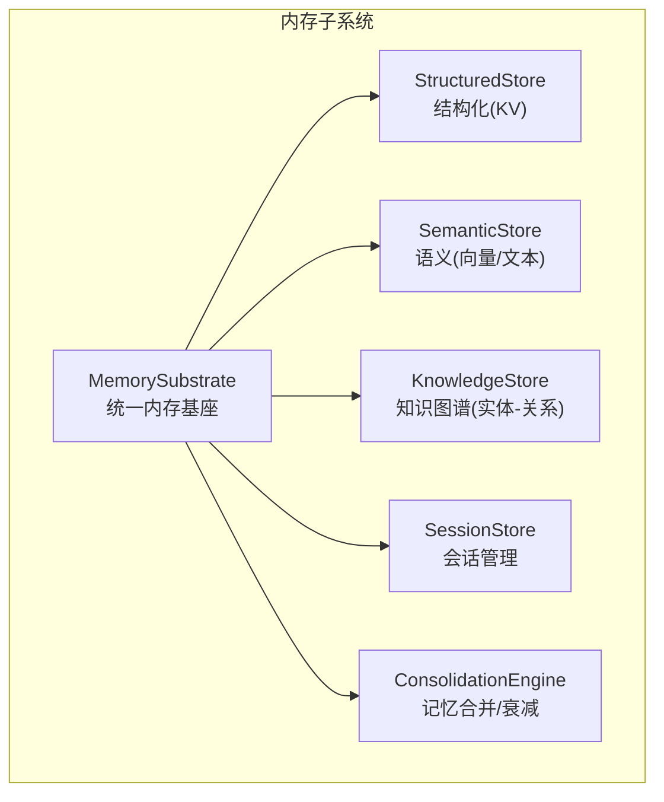
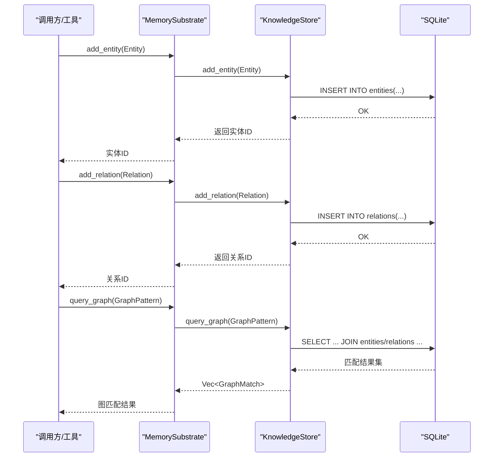
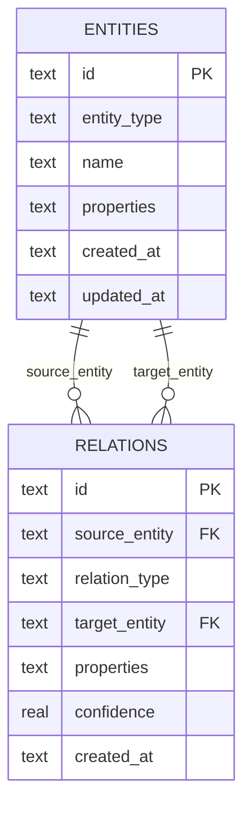
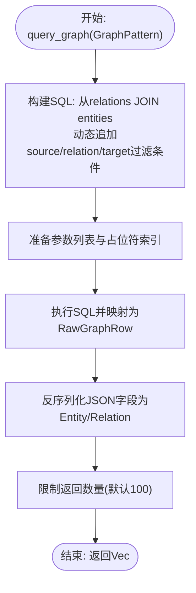
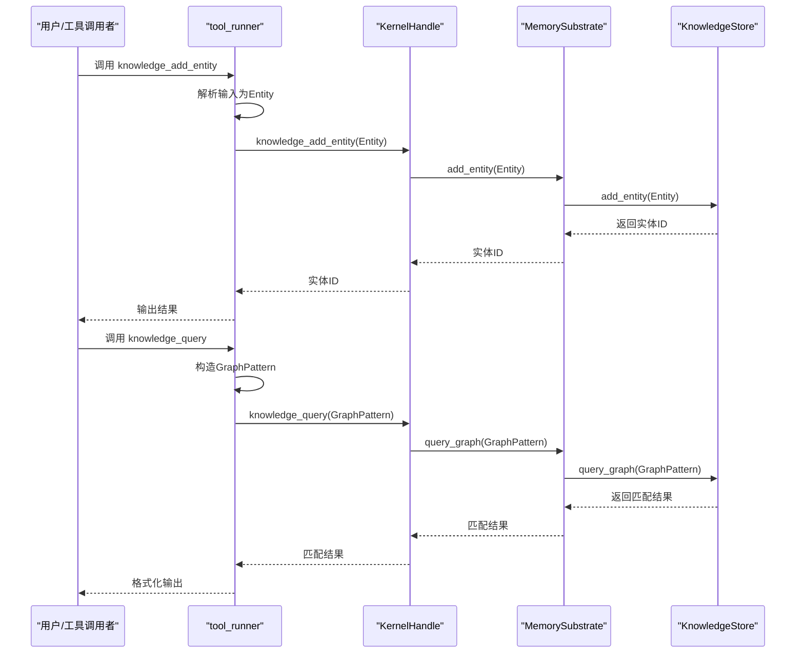
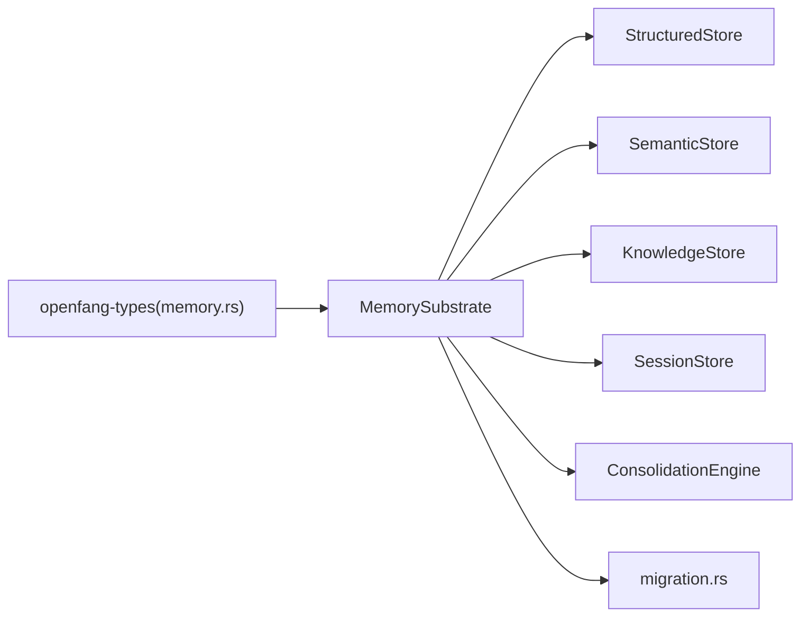

# 知识图谱系统

<cite>
**本文档引用的文件**
- [lib.rs](file://crates/openfang-memory/src/lib.rs)
- [knowledge.rs](file://crates/openfang-memory/src/knowledge.rs)
- [semantic.rs](file://crates/openfang-memory/src/semantic.rs)
- [structured.rs](file://crates/openfang-memory/src/structured.rs)
- [substrate.rs](file://crates/openfang-memory/src/substrate.rs)
- [migration.rs](file://crates/openfang-memory/src/migration.rs)
- [memory.rs](file://crates/openfang-types/src/memory.rs)
- [session.rs](file://crates/openfang-memory/src/session.rs)
- [consolidation.rs](file://crates/openfang-memory/src/consolidation.rs)
- [Cargo.toml](file://Cargo.toml)
- [openfang-memory/Cargo.toml](file://crates/openfang-memory/Cargo.toml)
- [tool_runner.rs](file://crates/openfang-runtime/src/tool_runner.rs)
</cite>

## 目录
1. [简介](#简介)
2. [项目结构](#项目结构)
3. [核心组件](#核心组件)
4. [架构总览](#架构总览)
5. [详细组件分析](#详细组件分析)
6. [依赖关系分析](#依赖关系分析)
7. [性能考虑](#性能考虑)
8. [故障排查指南](#故障排查指南)
9. [结论](#结论)
10. [附录](#附录)

## 简介
本文件面向知识图谱系统，围绕实体-关系存储的设计与实现进行深入解析，涵盖实体类型与属性定义、关系存储、图模式查询、以及与语义记忆、会话管理等模块的协同工作方式。同时提供查询语言与性能优化策略、构建与维护最佳实践，帮助读者在实际工程中高效落地知识图谱能力。

## 项目结构
知识图谱能力位于 openfang-memory 子系统中，采用“统一内存基座 + 多存储后端”的设计：通过 MemorySubstrate 统一对外暴露统一接口，内部组合结构化存储（KV）、语义存储（向量检索）、知识图谱存储（实体-关系）与会话存储等模块；所有存储均以 SQLite 作为底层持久化介质，并通过迁移脚本维护表结构演进。

图表来源
- [substrate.rs:26-56](file://crates/openfang-memory/src/substrate.rs#L26-L56)
- [lib.rs:10-20](file://crates/openfang-memory/src/lib.rs#L10-L20)

章节来源
- [Cargo.toml:1-16](file://Cargo.toml#L1-L16)
- [openfang-memory/Cargo.toml:1-24](file://crates/openfang-memory/Cargo.toml#L1-L24)

## 核心组件
- 统一内存基座 MemorySubstrate：封装结构化、语义、知识图谱、会话与合并引擎，对外暴露统一异步 Memory trait 接口，内部通过共享连接与锁实现线程安全访问。
- 结构化存储 StructuredStore：提供按 Agent 的键值对存取，用于持久化 Agent 元信息与状态。
- 语义存储 SemanticStore：提供基于 SQLite 的记忆片段存储，支持文本 LIKE 匹配与向量相似度召回，具备软删除与嵌入更新能力。
- 知识图谱存储 KnowledgeStore：提供实体与关系的增删改查，支持基于图模式的三元组查询。
- 会话存储 SessionStore：提供会话生命周期管理、跨通道上下文聚合与 JSONL 镜像导出。
- 合并引擎 ConsolidationEngine：周期性降低长期未访问记忆的置信度，为后续检索排序提供依据。

章节来源
- [substrate.rs:26-56](file://crates/openfang-memory/src/substrate.rs#L26-L56)
- [structured.rs:9-13](file://crates/openfang-memory/src/structured.rs#L9-L13)
- [semantic.rs:19-23](file://crates/openfang-memory/src/semantic.rs#L19-L23)
- [knowledge.rs:15-19](file://crates/openfang-memory/src/knowledge.rs#L15-L19)
- [session.rs:27-31](file://crates/openfang-memory/src/session.rs#L27-L31)
- [consolidation.rs:12-18](file://crates/openfang-memory/src/consolidation.rs#L12-L18)

## 架构总览
下图展示 MemorySubstrate 如何协调各子存储完成知识图谱的写入与查询流程：

图表来源
- [substrate.rs:640-659](file://crates/openfang-memory/src/substrate.rs#L640-L659)
- [knowledge.rs:27-80](file://crates/openfang-memory/src/knowledge.rs#L27-L80)
- [knowledge.rs:82-196](file://crates/openfang-memory/src/knowledge.rs#L82-L196)

## 详细组件分析

### 知识图谱数据模型与查询语言
- 实体 Entity：包含唯一标识、类型、名称、任意属性字典、创建与更新时间戳。
- 关系 Relation：包含源实体ID、关系类型、目标实体ID、关系属性、置信度与创建时间。
- 图模式 GraphPattern：支持对源实体、关系类型、目标实体进行过滤，并指定最大遍历深度（当前实现为单层查询，深度参数用于扩展预留）。
- 查询结果 GraphMatch：返回三元组（源实体、关系、目标实体）的完整对象。

图表来源
- [migration.rs:150-172](file://crates/openfang-memory/src/migration.rs#L150-L172)
- [memory.rs:115-171](file://crates/openfang-types/src/memory.rs#L115-L171)

章节来源
- [memory.rs:115-171](file://crates/openfang-types/src/memory.rs#L115-L171)
- [memory.rs:201-223](file://crates/openfang-types/src/memory.rs#L201-L223)
- [migration.rs:150-172](file://crates/openfang-memory/src/migration.rs#L150-L172)

### 实体-关系存储实现
- 实体写入：自动生成 UUID 作为实体 ID，序列化实体类型与属性，使用 ON CONFLICT 更新名称与属性及更新时间。
- 关系写入：生成关系 ID，序列化关系类型与属性，插入关系记录并保留置信度。
- 查询实现：基于三表联接（relations JOIN entities AS source JOIN entities AS target），动态拼接 WHERE 条件（源/关系/目标可选），限制返回条数，解析 JSON 字段还原为实体与关系对象。

图表来源
- [knowledge.rs:82-196](file://crates/openfang-memory/src/knowledge.rs#L82-L196)
- [knowledge.rs:230-280](file://crates/openfang-memory/src/knowledge.rs#L230-L280)

章节来源
- [knowledge.rs:27-80](file://crates/openfang-memory/src/knowledge.rs#L27-L80)
- [knowledge.rs:82-196](file://crates/openfang-memory/src/knowledge.rs#L82-L196)
- [knowledge.rs:230-280](file://crates/openfang-memory/src/knowledge.rs#L230-L280)

### 与工具系统的集成
- 工具定义：提供 knowledge_add_entity、knowledge_add_relation、knowledge_query 三个工具，输入参数覆盖实体/关系/查询的关键字段。
- 工具实现：解析用户输入为内部实体/关系/图模式对象，调用内核句柄的相应方法，最终由 MemorySubstrate 调用 KnowledgeStore 完成持久化与查询。

图表来源
- [tool_runner.rs:1800-1831](file://crates/openfang-runtime/src/tool_runner.rs#L1800-L1831)
- [tool_runner.rs:1833-1859](file://crates/openfang-runtime/src/tool_runner.rs#L1833-L1859)
- [tool_runner.rs:1861-1895](file://crates/openfang-runtime/src/tool_runner.rs#L1861-L1895)
- [tool_runner.rs:1897-1932](file://crates/openfang-runtime/src/tool_runner.rs#L1897-L1932)
- [substrate.rs:640-659](file://crates/openfang-memory/src/substrate.rs#L640-L659)

章节来源
- [tool_runner.rs:813-831](file://crates/openfang-runtime/src/tool_runner.rs#L813-L831)
- [tool_runner.rs:1800-1831](file://crates/openfang-runtime/src/tool_runner.rs#L1800-L1831)
- [tool_runner.rs:1833-1859](file://crates/openfang-runtime/src/tool_runner.rs#L1833-L1859)
- [tool_runner.rs:1861-1895](file://crates/openfang-runtime/src/tool_runner.rs#L1861-L1895)
- [tool_runner.rs:1897-1932](file://crates/openfang-runtime/src/tool_runner.rs#L1897-L1932)

### 与语义记忆的协同
- 语义存储负责基于内容的记忆检索，支持文本 LIKE 与向量相似度两种召回路径；当提供查询向量时优先进行重排，否则回退到 LIKE 匹配。
- 记忆片段包含内容、来源、置信度、元数据、访问计数等，访问时自动更新访问时间与计数，便于后续合并引擎进行置信度衰减。

章节来源
- [semantic.rs:83-114](file://crates/openfang-memory/src/semantic.rs#L83-L114)
- [semantic.rs:95-277](file://crates/openfang-memory/src/semantic.rs#L95-L277)
- [consolidation.rs:26-53](file://crates/openfang-memory/src/consolidation.rs#L26-L53)

### 会话与跨通道上下文
- 会话存储支持常规会话与“规范会话”（跨通道持久化上下文）。规范会话在消息超过阈值时进行压缩，保留摘要与最近若干条消息，确保长对话上下文可控。
- MemorySubstrate 提供规范会话读取接口，便于在知识图谱查询前注入跨渠道上下文。

章节来源
- [session.rs:340-475](file://crates/openfang-memory/src/session.rs#L340-L475)
- [substrate.rs:223-267](file://crates/openfang-memory/src/substrate.rs#L223-L267)

## 依赖关系分析
- 内存子系统依赖 openfang-types 提供统一的数据结构与 Memory trait。
- 所有存储模块依赖 rusqlite 进行 SQLite 操作，使用 Arc<Mutex<Connection>> 共享连接，避免并发冲突。
- 迁移脚本集中管理数据库版本与表结构演进，确保首次启动与升级过程的稳定性。

图表来源
- [memory.rs:258-335](file://crates/openfang-types/src/memory.rs#L258-L335)
- [substrate.rs:26-56](file://crates/openfang-memory/src/substrate.rs#L26-L56)
- [migration.rs:10-48](file://crates/openfang-memory/src/migration.rs#L10-L48)

章节来源
- [Cargo.toml:1-16](file://Cargo.toml#L1-L16)
- [openfang-memory/Cargo.toml:8-19](file://crates/openfang-memory/Cargo.toml#L8-L19)

## 性能考虑
- 数据库层面
  - 使用 WAL 模式与合理的 busy_timeout，提升并发写入稳定性。
  - 为 relations 表建立多列索引（source、target、relation_type），加速图查询。
  - 对 memories 表建立 agent_id、scope 等索引，优化语义检索与过滤。
- 查询层面
  - 图查询默认限制返回条数（如 100），避免大规模联接导致的性能问题；可根据业务需要调整。
  - 向量召回先扩大候选集再重排，平衡召回质量与性能。
- 内存与一致性
  - 通过 Arc<Mutex<Connection>> 在模块间共享连接，减少连接开销；注意避免长时间持有锁。
- 合并与衰减
  - 定期执行合并与置信度衰减，清理低价值记忆，保持检索效率与质量。

章节来源
- [substrate.rs:40-46](file://crates/openfang-memory/src/substrate.rs#L40-L46)
- [migration.rs:169-172](file://crates/openfang-memory/src/migration.rs#L169-L172)
- [semantic.rs:107-116](file://crates/openfang-memory/src/semantic.rs#L107-L116)
- [consolidation.rs:26-53](file://crates/openfang-memory/src/consolidation.rs#L26-L53)

## 故障排查指南
- 常见错误类型
  - 序列化/反序列化失败：检查实体类型、关系类型与属性的 JSON 序列化是否正确。
  - 数据库操作异常：确认迁移脚本已成功执行，表结构与索引存在。
  - 并发访问问题：确保通过 MemorySubstrate 的异步封装或阻塞任务执行数据库操作，避免直接并发访问共享连接。
- 定位步骤
  - 检查迁移版本与表结构：确认 user_version 与期望一致，表与索引存在。
  - 回放工具调用：使用工具输入样例，逐步验证实体/关系写入与查询流程。
  - 观察日志与指标：关注查询耗时、返回条数与置信度分布，辅助定位性能瓶颈。
- 建议修复
  - 对于大查询，适当缩小过滤范围或增加索引。
  - 对于高并发写入，合理拆分任务或使用批量写入策略。
  - 对于向量召回不准确，检查嵌入维度与归一化处理。

章节来源
- [migration.rs:50-72](file://crates/openfang-memory/src/migration.rs#L50-L72)
- [substrate.rs:571-681](file://crates/openfang-memory/src/substrate.rs#L571-L681)

## 结论
该知识图谱系统以 SQLite 为统一存储后端，通过 MemorySubstrate 将结构化、语义与知识图谱三大能力整合为一体，既满足了快速迭代的开发需求，又为后续引入更复杂的图算法与分布式存储留出了清晰的扩展空间。结合迁移机制、索引策略与定期合并，能够在工程实践中稳定地支撑实体-关系的构建、维护与查询。

## 附录

### 知识图谱构建与维护最佳实践
- 构建阶段
  - 明确实体类型与关系类型枚举，必要时使用自定义类型扩展。
  - 为高频过滤字段（如实体名称、关系类型）建立索引。
  - 使用工具链批量导入实体与关系，保证数据一致性。
- 维护阶段
  - 定期执行合并与置信度衰减，剔除长期无用记忆。
  - 监控查询延迟与返回规模，根据业务场景调整限制与重排策略。
  - 对跨通道上下文进行摘要化管理，控制上下文长度与成本。

### 查询语言与示例路径
- 实体添加：参考工具实现路径 [tool_runner.rs:1833-1859](file://crates/openfang-runtime/src/tool_runner.rs#L1833-L1859)
- 关系添加：参考工具实现路径 [tool_runner.rs:1861-1895](file://crates/openfang-runtime/src/tool_runner.rs#L1861-L1895)
- 图查询：参考工具实现路径 [tool_runner.rs:1897-1932](file://crates/openfang-runtime/src/tool_runner.rs#L1897-L1932)，内部图模式定义 [memory.rs:201-212](file://crates/openfang-types/src/memory.rs#L201-L212)