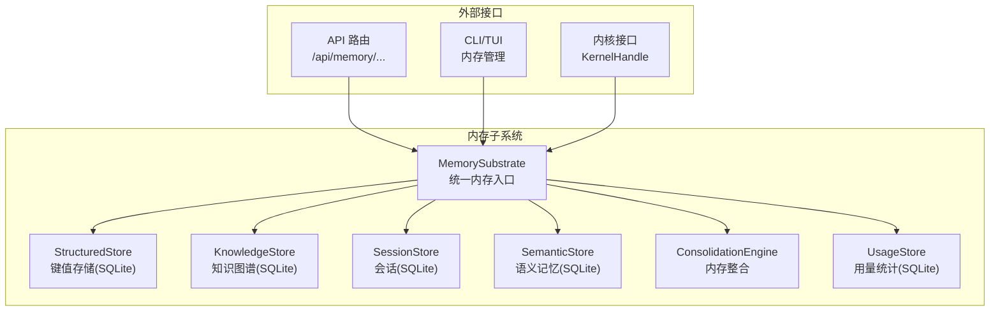
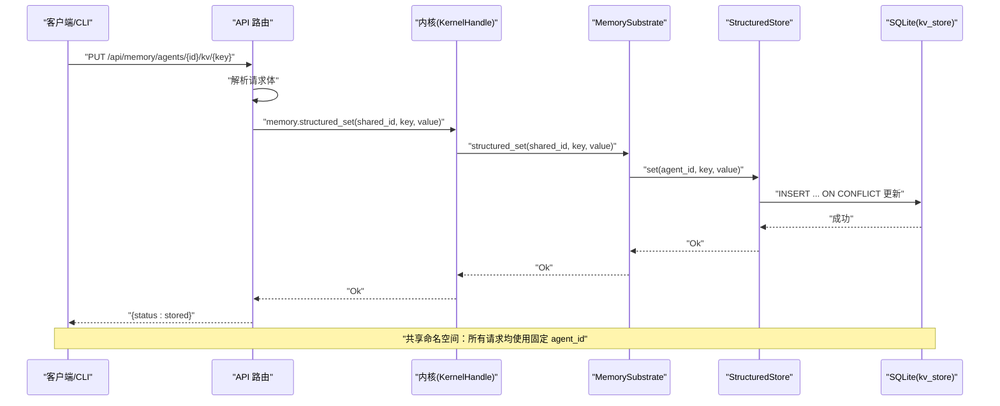
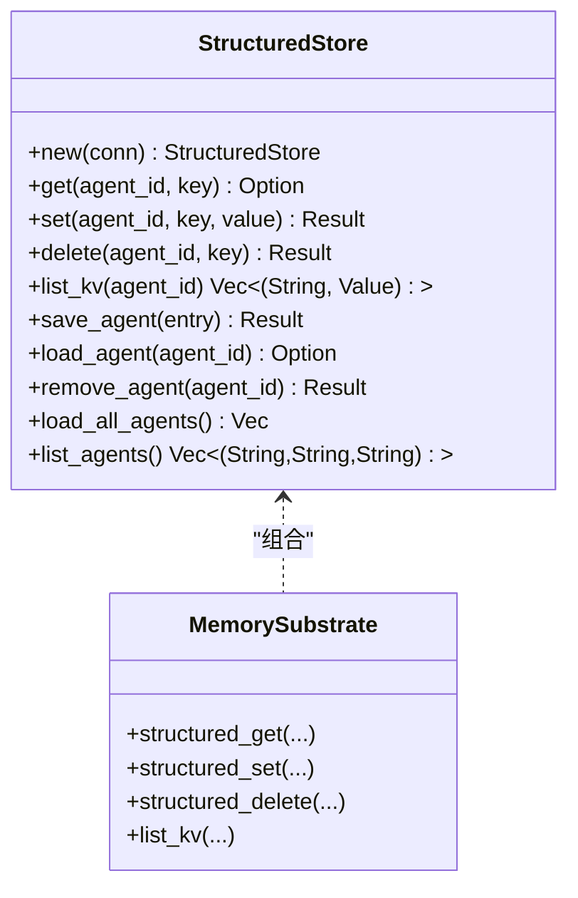
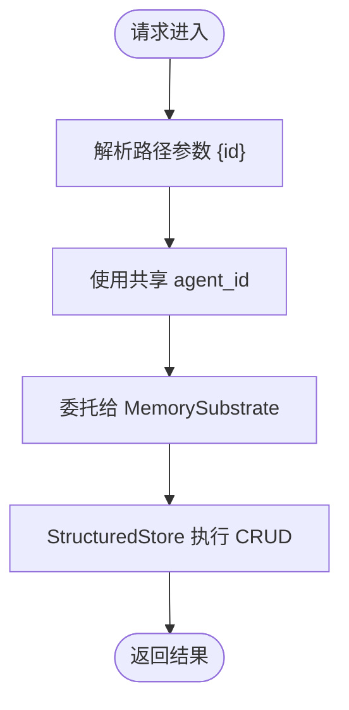
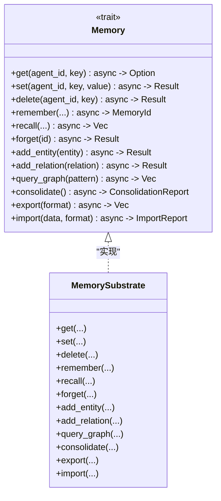
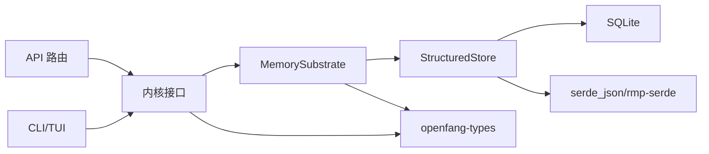

# 结构化键值存储

<cite>
**本文档引用的文件**
- [structured.rs](file://crates/openfang-memory/src/structured.rs)
- [substrate.rs](file://crates/openfang-memory/src/substrate.rs)
- [lib.rs](file://crates/openfang-memory/src/lib.rs)
- [migration.rs](file://crates/openfang-memory/src/migration.rs)
- [memory.rs](file://crates/openfang-types/src/memory.rs)
- [kernel.rs](file://crates/openfang-kernel/src/kernel.rs)
- [routes.rs](file://crates/openfang-api/src/routes.rs)
- [event.rs](file://crates/openfang-cli/src/tui/event.rs)
- [SKILL.md](file://crates/openfang-skills/bundled/sqlite-expert/SKILL.md)
</cite>

## 目录
1. [简介](#简介)
2. [项目结构](#项目结构)
3. [核心组件](#核心组件)
4. [架构总览](#架构总览)
5. [详细组件分析](#详细组件分析)
6. [依赖关系分析](#依赖关系分析)
7. [性能考虑](#性能考虑)
8. [故障排除指南](#故障排除指南)
9. [结论](#结论)
10. [附录](#附录)

## 简介
本文件面向结构化键值存储的设计与实现，重点覆盖以下方面：
- per-agent 键值存储：以 agent_id 为维度的隔离命名空间，确保不同智能体之间的键值完全隔离。
- SQLite 后端：基于 rusqlite 的高性能嵌入式数据库，采用 WAL 模式提升并发读写能力。
- JSON 值存储：使用 BLOB 存储 serde_json::Value，支持任意 JSON 兼容数据类型。
- 共享内存命名空间：通过固定 agent_id 实现跨智能体共享的全局键值空间，用于系统级配置或跨智能体协作。
- 键值操作接口：提供 get/set/delete/list 等标准操作，并在统一 Memory trait 中暴露异步接口。
- 数据类型支持：原生支持 JSON 值，兼容字符串、数字、布尔、数组、对象等；同时具备向后兼容的序列化回退机制。
- 跨智能体数据共享机制：通过共享命名空间实现系统级键值共享，API 层对齐到同一 agent_id。
- 存储性能优化与查询策略：WAL 模式、索引设计、UPSERT 原子更新、批量查询与回退处理。

## 项目结构
结构化键值存储位于 openfang-memory 子模块中，围绕 MemorySubstrate 组合多个专用存储，并通过统一的 Memory trait 对外提供服务。共享内存命名空间由内核层提供固定 agent_id，API 层与 CLI 层均遵循该命名空间进行读写。

图表来源
- [substrate.rs:26-56](file://crates/openfang-memory/src/substrate.rs#L26-L56)
- [lib.rs:10-19](file://crates/openfang-memory/src/lib.rs#L10-L19)

章节来源
- [lib.rs:1-20](file://crates/openfang-memory/src/lib.rs#L1-L20)
- [substrate.rs:1-777](file://crates/openfang-memory/src/substrate.rs#L1-L777)

## 核心组件
- StructuredStore：基于 SQLite 的键值存储，表 kv_store 支持 per-agent 隔离与版本控制。
- MemorySubstrate：组合 Structured/Knowledge/Semantic/Session/Usage 等存储，实现统一 Memory trait。
- Memory trait：对外暴露 get/set/delete 等键值操作，以及 recall/remember 等语义与知识图谱操作。
- 共享内存命名空间：通过固定 agent_id 提供跨智能体共享键值空间，API 与内核层一致使用该 ID。
- 迁移系统：自动创建与升级 schema，确保首次启动与版本演进时的数据库一致性。

章节来源
- [structured.rs:9-14](file://crates/openfang-memory/src/structured.rs#L9-L14)
- [substrate.rs:26-56](file://crates/openfang-memory/src/substrate.rs#L26-L56)
- [memory.rs:258-335](file://crates/openfang-types/src/memory.rs#L258-L335)
- [migration.rs:7-48](file://crates/openfang-memory/src/migration.rs#L7-L48)

## 架构总览
下图展示从 API/CLI 到内核再到内存子系统的调用链路，以及共享命名空间如何贯穿整个流程。

图表来源
- [routes.rs:3240-3262](file://crates/openfang-api/src/routes.rs#L3240-L3262)
- [kernel.rs:5786-5791](file://crates/openfang-kernel/src/kernel.rs#L5786-L5791)
- [substrate.rs:132-140](file://crates/openfang-memory/src/substrate.rs#L132-L140)
- [structured.rs:45-66](file://crates/openfang-memory/src/structured.rs#L45-L66)

章节来源
- [routes.rs:3185-3284](file://crates/openfang-api/src/routes.rs#L3185-L3284)
- [kernel.rs:5630-5798](file://crates/openfang-kernel/src/kernel.rs#L5630-L5798)
- [substrate.rs:113-140](file://crates/openfang-memory/src/substrate.rs#L113-L140)
- [structured.rs:21-80](file://crates/openfang-memory/src/structured.rs#L21-L80)

## 详细组件分析

### StructuredStore：键值存储实现
- 设计要点
  - 表 kv_store：主键为 (agent_id, key)，天然保证 per-agent 隔离。
  - 值字段 value 使用 BLOB 存储 serde_json::Value 的二进制表示，支持任意 JSON 类型。
  - 版本字段 version 与 updated_at 记录每次更新，便于审计与一致性检查。
  - UPSERT 使用 ON CONFLICT(agent_id, key) DO UPDATE，原子性地实现 set 操作。
- 关键方法
  - get：按 agent_id + key 查询，返回 Option<serde_json::Value>。
  - set：序列化为 BLOB 后插入或更新，自动递增 version。
  - delete：按 agent_id + key 删除。
  - list_kv：列出指定 agent 下的所有键值对，内部包含 JSON 解析失败的回退逻辑。
- 错误处理
  - 将 SQLite 错误映射为 OpenFangError，QueryReturnedNoRows 返回 None。
  - 序列化错误映射为 Serialization 错误类型。

图表来源
- [structured.rs:15-256](file://crates/openfang-memory/src/structured.rs#L15-L256)
- [substrate.rs:113-140](file://crates/openfang-memory/src/substrate.rs#L113-L140)

章节来源
- [structured.rs:21-111](file://crates/openfang-memory/src/structured.rs#L21-L111)
- [structured.rs:113-256](file://crates/openfang-memory/src/structured.rs#L113-L256)

### 共享内存命名空间：固定 agent_id
- 固定 ID：内核定义了一个固定 UUID 的 AgentId，作为共享命名空间的唯一标识。
- API 行为：API 路由在处理 /api/memory/agents/{id}/kv/* 时，忽略路径中的 agent_id，统一使用共享 ID 进行读写。
- 内核行为：KernelHandle 的 memory_store/memory_recall 直接使用共享 ID。
- CLI 行为：TUI 与 CLI 在内存页面中也遵循共享命名空间进行读写。

图表来源
- [routes.rs:3189-3218](file://crates/openfang-api/src/routes.rs#L3189-L3218)
- [routes.rs:3244-3262](file://crates/openfang-api/src/routes.rs#L3244-L3262)
- [kernel.rs:5786-5798](file://crates/openfang-kernel/src/kernel.rs#L5786-L5798)
- [kernel.rs:5632-5638](file://crates/openfang-kernel/src/kernel.rs#L5632-L5638)

章节来源
- [kernel.rs:5630-5638](file://crates/openfang-kernel/src/kernel.rs#L5630-L5638)
- [routes.rs:3185-3284](file://crates/openfang-api/src/routes.rs#L3185-L3284)
- [event.rs:1321-1381](file://crates/openfang-cli/src/tui/event.rs#L1321-L1381)

### Memory trait：统一键值接口
- 接口定义：对外暴露 async get/set/delete，以及 recall/remember 等语义与知识图谱操作。
- 实现方式：MemorySubstrate 将键值操作委托给 StructuredStore，在阻塞线程中执行 SQLite 操作，避免阻塞 Tokio 运行时。
- 兼容性：键值操作与语义/知识图谱操作在同一 trait 下，便于上层统一调用。

图表来源
- [memory.rs:258-335](file://crates/openfang-types/src/memory.rs#L258-L335)
- [substrate.rs:571-681](file://crates/openfang-memory/src/substrate.rs#L571-L681)

章节来源
- [memory.rs:258-335](file://crates/openfang-types/src/memory.rs#L258-L335)
- [substrate.rs:571-681](file://crates/openfang-memory/src/substrate.rs#L571-L681)

### 迁移系统：Schema 管理
- 初始化：首次启动时创建 kv_store、sessions、memories、entities、relations 等核心表。
- 版本演进：通过 user_version 与迁移脚本逐步添加新列（如 embedding、label、identity 等），并记录迁移历史。
- 兼容性：迁移过程中使用 column_exists 检查列是否存在，避免重复添加。

章节来源
- [migration.rs:74-186](file://crates/openfang-memory/src/migration.rs#L74-L186)
- [migration.rs:215-228](file://crates/openfang-memory/src/migration.rs#L215-L228)

### 数据类型支持与序列化回退
- JSON 值存储：使用 serde_json::Value 存储，BLOB 字段保存二进制序列化结果。
- 回退机制：list_kv 在反序列化失败时尝试 UTF-8 字符串回退，保证兼容性。
- 向后兼容：AgentEntry 的 manifest/state 等字段采用 lenient 反序列化与自动修复，避免因 schema 变化导致加载失败。

章节来源
- [structured.rs:36-42](file://crates/openfang-memory/src/structured.rs#L36-L42)
- [structured.rs:102-110](file://crates/openfang-memory/src/structured.rs#L102-L110)
- [structured.rs:354-411](file://crates/openfang-memory/src/structured.rs#L354-L411)

## 依赖关系分析
- 组件耦合
  - MemorySubstrate 高内聚地组合多个存储，但通过 trait 抽象降低对外部实现的耦合。
  - StructuredStore 仅依赖 SQLite 连接与 rusqlite，职责单一，易于测试与替换。
- 外部依赖
  - rusqlite：SQLite 客户端，提供连接、事务、准备语句等能力。
  - serde_json/rmp-serde：JSON 与 MessagePack 序列化，保障跨版本兼容。
  - uuid：生成固定共享 agent_id。
- 循环依赖
  - 未发现循环依赖；API/CLI/Kernel 通过 MemorySubstrate 间接访问 StructuredStore。

图表来源
- [routes.rs:3240-3262](file://crates/openfang-api/src/routes.rs#L3240-L3262)
- [kernel.rs:5786-5798](file://crates/openfang-kernel/src/kernel.rs#L5786-L5798)
- [substrate.rs:26-56](file://crates/openfang-memory/src/substrate.rs#L26-L56)
- [structured.rs:3-7](file://crates/openfang-memory/src/structured.rs#L3-L7)

章节来源
- [routes.rs:3240-3262](file://crates/openfang-api/src/routes.rs#L3240-L3262)
- [kernel.rs:5786-5798](file://crates/openfang-kernel/src/kernel.rs#L5786-L5798)
- [substrate.rs:26-56](file://crates/openfang-memory/src/substrate.rs#L26-L56)
- [structured.rs:3-7](file://crates/openfang-memory/src/structured.rs#L3-L7)

## 性能考虑
- WAL 模式与 PRAGMA
  - 开启 WAL 模式提升并发读写性能，设置 busy_timeout 减少 SQLITE_BUSY。
  - SQLite 专家建议：journal_mode=WAL、synchronous=NORMAL、cache_size=-64000、mmap_size=268435456、temp_store=MEMORY。
- 索引与查询
  - kv_store 主键 (agent_id, key) 已覆盖常见查询模式。
  - list_kv 使用 ORDER BY key，适合顺序遍历。
- 原子更新
  - 使用 INSERT ... ON CONFLICT DO UPDATE 实现 UPSERT，减少锁竞争。
- 异步执行
  - 所有 SQLite 操作在阻塞任务中执行，避免阻塞 Tokio 运行时。
- 查询策略
  - 优先使用主键查询 get/set/delete。
  - list_kv 适用于小规模键集；大规模场景建议分页或限制数量。
  - JSON 查询可结合 SQLite JSON1 扩展（在其他模块中使用），键值存储本身以 BLOB 存储 JSON。

章节来源
- [substrate.rs:42-44](file://crates/openfang-memory/src/substrate.rs#L42-L44)
- [structured.rs:59-63](file://crates/openfang-memory/src/structured.rs#L59-L63)
- [SKILL.md:17-25](file://crates/openfang-skills/bundled/sqlite-expert/SKILL.md#L17-L25)

## 故障排除指南
- 常见错误类型
  - Memory：SQLite 相关错误（如约束冲突、查询无结果）。
  - Serialization：JSON/MessagePack 序列化/反序列化失败。
  - Internal：线程锁获取失败等运行时错误。
- 定位方法
  - 查看日志：API/CLI/内核层均记录内存操作失败的警告与错误。
  - 健康检查：/api/health 与 /api/health/detail 检查数据库连通性与整体状态。
- 典型问题
  - get 返回 None：确认 key 是否存在或 agent_id 是否正确。
  - set 失败：检查是否违反主键约束或序列化是否合法。
  - list_kv 结果异常：关注回退逻辑（UTF-8 字符串回退）。

章节来源
- [routes.rs:3254-3261](file://crates/openfang-api/src/routes.rs#L3254-L3261)
- [routes.rs:3276-3283](file://crates/openfang-api/src/routes.rs#L3276-L3283)
- [structured.rs:34-42](file://crates/openfang-memory/src/structured.rs#L34-L42)

## 结论
结构化键值存储通过 per-agent 隔离与共享命名空间的双重设计，既满足多智能体独立持久化的需求，又支持系统级跨智能体协作。基于 SQLite 的实现提供了良好的可靠性与易部署性，配合 WAL 模式、UPSERT 原子更新与异步执行策略，兼顾了性能与一致性。迁移系统与序列化回退机制进一步增强了长期演进的稳定性。

## 附录

### 键值操作接口一览
- get(agent_id, key) -> Option<serde_json::Value>
- set(agent_id, key, value) -> Result
- delete(agent_id, key) -> Result
- list_kv(agent_id) -> Vec<(String, serde_json::Value)>

章节来源
- [memory.rs:266-282](file://crates/openfang-types/src/memory.rs#L266-L282)
- [structured.rs:21-111](file://crates/openfang-memory/src/structured.rs#L21-L111)