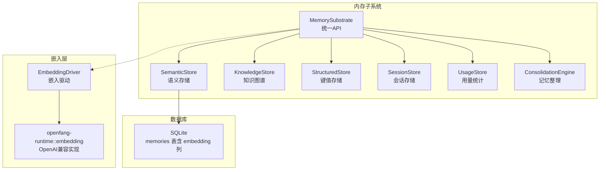
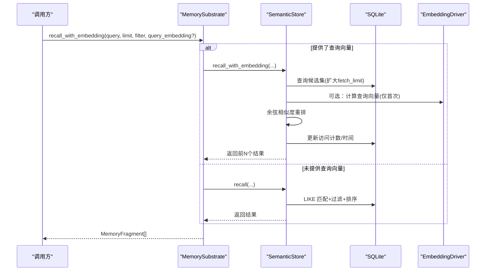
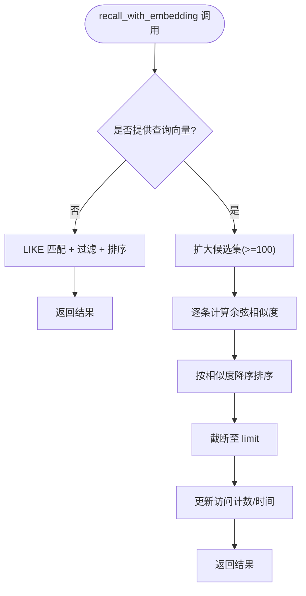
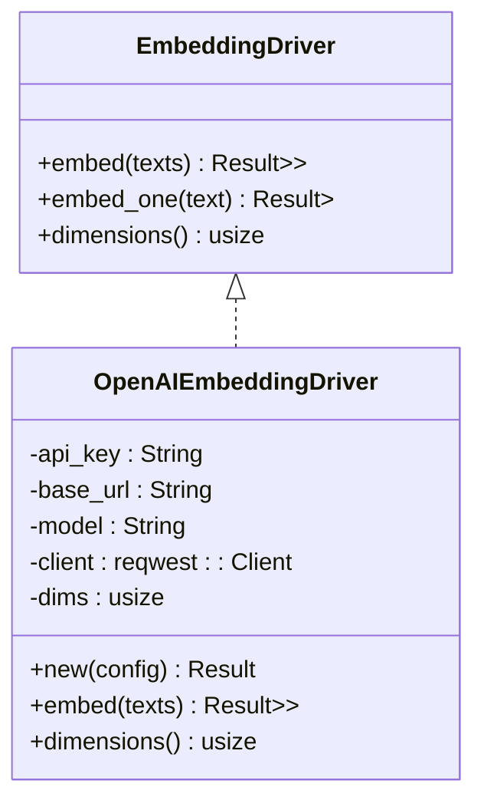
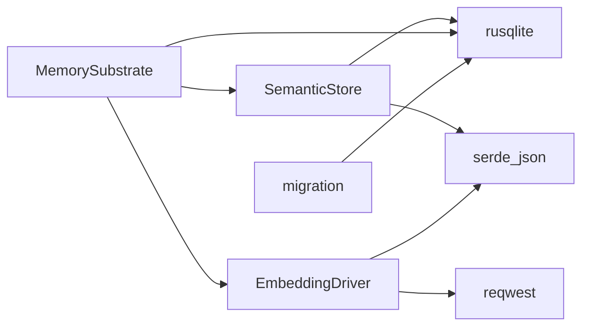

# 语义搜索系统

<cite>
**本文引用的文件列表**
- [semantic.rs](file://crates/openfang-memory/src/semantic.rs)
- [embedding.rs](file://crates/openfang-runtime/src/embedding.rs)
- [substrate.rs](file://crates/openfang-memory/src/substrate.rs)
- [migration.rs](file://crates/openfang-memory/src/migration.rs)
- [memory.rs](file://crates/openfang-types/src/memory.rs)
- [kernel.rs](file://crates/openfang-kernel/src/kernel.rs)
- [config.rs](file://crates/openfang-types/src/config.rs)
- [consolidation.rs](file://crates/openfang-memory/src/consolidation.rs)
</cite>

## 目录
1. [简介](#简介)
2. [项目结构](#项目结构)
3. [核心组件](#核心组件)
4. [架构总览](#架构总览)
5. [详细组件分析](#详细组件分析)
6. [依赖关系分析](#依赖关系分析)
7. [性能考量](#性能考量)
8. [故障排查指南](#故障排查指南)
9. [结论](#结论)
10. [附录](#附录)

## 简介
本文件面向“语义搜索系统”的实现与使用，聚焦于向量嵌入与相似度检索机制，覆盖以下主题：
- 文档嵌入：如何生成与存储向量嵌入（向量维度、序列化/反序列化）
- 向量存储：以 SQLite BLOB 存储嵌入，支持按需更新
- 查询嵌入：如何将查询文本转换为向量，以及如何进行余弦相似度匹配
- 嵌入驱动配置：提供多提供商兼容的嵌入驱动创建流程
- 索引策略与查询优化：候选集扩大、重排与访问计数更新
- 性能调优与准确性提升：维度选择、候选数量、过滤条件与缓存策略

## 项目结构
语义搜索系统由“内存子系统”统一对外暴露接口，内部包含：
- 语义存储（SemanticStore）：负责记忆片段的持久化与召回
- 嵌入驱动（EmbeddingDriver）：负责将文本转为向量
- 内存基座（MemorySubstrate）：组合结构化存储、语义存储、知识图谱、会话与使用统计
- 迁移脚本（migration）：确保数据库表结构（含 embedding 列）正确
- 类型定义（memory.rs）：统一的内存片段、过滤器、来源等类型
- 核心配置（config.rs）：嵌入模型、提供商、API 密钥环境变量等
- 内核集成（kernel.rs）：在内核启动时自动检测并创建嵌入驱动

图表来源
- [substrate.rs:26-56](file://crates/openfang-memory/src/substrate.rs#L26-L56)
- [semantic.rs:19-30](file://crates/openfang-memory/src/semantic.rs#L19-L30)
- [embedding.rs:42-71](file://crates/openfang-runtime/src/embedding.rs#L42-L71)
- [migration.rs:215-228](file://crates/openfang-memory/src/migration.rs#L215-L228)

章节来源
- [substrate.rs:26-56](file://crates/openfang-memory/src/substrate.rs#L26-L56)
- [semantic.rs:19-30](file://crates/openfang-memory/src/semantic.rs#L19-L30)
- [embedding.rs:42-71](file://crates/openfang-runtime/src/embedding.rs#L42-L71)
- [migration.rs:215-228](file://crates/openfang-memory/src/migration.rs#L215-L228)

## 核心组件
- 语义存储（SemanticStore）
  - 支持无嵌入的 LIKE 回忆与有嵌入的余弦相似度重排
  - 提供 remember/remember_with_embedding、recall/recall_with_embedding、update_embedding、forget 等操作
  - 使用 SQLite BLOB 存储向量，提供序列化/反序列化工具函数
- 嵌入驱动（EmbeddingDriver）
  - 统一的异步嵌入接口，支持批量与单条嵌入计算
  - OpenAI 兼容实现，适配多种提供商（OpenAI、Groq、Together、Fireworks、Ollama、vLLM、LM Studio 等）
  - 自动推断嵌入维度，支持自定义基础 URL 与 API Key 环境变量
- 内存基座（MemorySubstrate）
  - 实现统一 Memory trait，封装结构化、语义、知识图谱、会话与用量统计
  - 对外提供 remember/recall/add_entity/query_graph 等异步 API
  - 在后台线程执行 SQLite 操作，避免阻塞 Tokio 运行时
- 迁移脚本（migration）
  - 为 memories 表添加 embedding 列，支持后续向量检索
- 类型定义（memory.rs）
  - 定义 MemoryFragment、MemoryFilter、MemorySource 等核心类型
  - 为语义搜索提供统一的数据结构
- 配置（config.rs）
  - 提供 memory.embedding_model、embedding_provider、embedding_api_key_env 等字段
- 内核集成（kernel.rs）
  - 在内核启动时根据配置自动创建嵌入驱动，必要时默认替换模型名

章节来源
- [semantic.rs:31-306](file://crates/openfang-memory/src/semantic.rs#L31-L306)
- [embedding.rs:42-250](file://crates/openfang-runtime/src/embedding.rs#L42-L250)
- [substrate.rs:339-387](file://crates/openfang-memory/src/substrate.rs#L339-L387)
- [migration.rs:215-228](file://crates/openfang-memory/src/migration.rs#L215-L228)
- [memory.rs:51-113](file://crates/openfang-types/src/memory.rs#L51-L113)
- [config.rs:1470-1509](file://crates/openfang-types/src/config.rs#L1470-L1509)
- [kernel.rs:849-871](file://crates/openfang-kernel/src/kernel.rs#L849-L871)

## 架构总览
语义搜索的关键流程如下：
- 记忆写入：可选地传入向量，或在后续通过 update_embedding 更新
- 查询召回：若提供查询向量，则先扩大候选集，再按余弦相似度重排；否则回退到 LIKE 匹配
- 访问计数：返回的记忆片段访问计数与最近访问时间会被更新
- 嵌入驱动：在内核启动时基于配置创建驱动，支持本地与云端提供商

图表来源
- [substrate.rs:354-387](file://crates/openfang-memory/src/substrate.rs#L354-L387)
- [semantic.rs:95-277](file://crates/openfang-memory/src/semantic.rs#L95-L277)
- [embedding.rs:123-175](file://crates/openfang-runtime/src/embedding.rs#L123-L175)

## 详细组件分析

### 语义存储（SemanticStore）
- 功能要点
  - 支持两种模式：无嵌入的 LIKE 回忆与有嵌入的余弦相似度重排
  - 扩大候选集：当存在查询向量时，先拉取更多候选（limit*10 或至少100），再重排
  - 过滤与排序：支持 agent_id、scope、min_confidence、source 等过滤；按最近访问与访问次数排序
  - 余弦相似度：对每个候选计算与查询向量的余弦相似度，降序排列
  - 访问计数更新：返回结果后更新 access_count 与 accessed_at
  - 向量存储：embedding 以 BLOB 存储，序列化/反序列化采用小端字节序
- 关键算法
  - 余弦相似度：点积除以范数乘积，分母过小则返回 0
  - 候选扩大：fetch_limit = max(limit*10, 100)，避免重排质量不足
- 错误处理
  - 数据库连接、序列化/反序列化、SQL 查询错误均包装为统一错误类型

图表来源
- [semantic.rs:95-277](file://crates/openfang-memory/src/semantic.rs#L95-L277)

章节来源
- [semantic.rs:31-306](file://crates/openfang-memory/src/semantic.rs#L31-L306)

### 嵌入驱动（EmbeddingDriver）
- 接口设计
  - 异步 embed/embed_one：批量/单条嵌入计算
  - dimensions：返回嵌入维度
- OpenAI 兼容实现
  - 支持多种提供商的基础 URL 推断与自定义
  - 自动推断常见模型的维度，未知模型默认 1536
  - 发送 Authorization 头（若提供 API Key）
  - 安全提示：外部 API 请求会发出警告
- 序列化工具
  - embedding_to_bytes/embedding_from_bytes：小端 f32 字节序列化/反序列化

图表来源
- [embedding.rs:42-175](file://crates/openfang-runtime/src/embedding.rs#L42-L175)

章节来源
- [embedding.rs:42-250](file://crates/openfang-runtime/src/embedding.rs#L42-L250)

### 内存基座（MemorySubstrate）
- 组合多个子存储：结构化、语义、知识图谱、会话、用量与整理引擎
- 异步封装：所有数据库写入/读取在阻塞线程中执行，避免阻塞运行时
- 语义接口：remember_with_embedding/recall_with_embedding/update_embedding 的同步与异步版本
- 任务队列：提供任务发布、认领与完成的异步 API

章节来源
- [substrate.rs:339-387](file://crates/openfang-memory/src/substrate.rs#L339-L387)
- [substrate.rs:571-681](file://crates/openfang-memory/src/substrate.rs#L571-L681)

### 迁移与表结构
- 迁移脚本为 memories 表增加 embedding 列，支持向量检索
- 为其他表（如 sessions、entities、relations 等）建立索引，提升查询效率

章节来源
- [migration.rs:215-228](file://crates/openfang-memory/src/migration.rs#L215-L228)

### 类型与配置
- MemoryFragment/MemoryFilter/MemorySource 等类型定义了语义搜索的数据结构与过滤能力
- MemoryConfig 提供嵌入模型、提供商、API Key 环境变量等配置项
- 内核在启动时根据配置自动创建嵌入驱动，必要时替换默认模型名

章节来源
- [memory.rs:51-113](file://crates/openfang-types/src/memory.rs#L51-L113)
- [config.rs:1470-1509](file://crates/openfang-types/src/config.rs#L1470-L1509)
- [kernel.rs:849-871](file://crates/openfang-kernel/src/kernel.rs#L849-L871)

## 依赖关系分析
- SemanticStore 依赖 rusqlite 与 serde_json，用于 SQLite 访问与 JSON 序列化
- EmbeddingDriver 依赖 reqwest 与 serde，用于 HTTP 请求与响应解析
- MemorySubstrate 将上述组件组合为统一 API，并在阻塞线程中执行数据库操作
- 迁移脚本确保数据库结构满足向量检索需求

图表来源
- [semantic.rs:10-17](file://crates/openfang-memory/src/semantic.rs#L10-L17)
- [embedding.rs:7-12](file://crates/openfang-runtime/src/embedding.rs#L7-L12)
- [substrate.rs:6-24](file://crates/openfang-memory/src/substrate.rs#L6-L24)
- [migration.rs:5-6](file://crates/openfang-memory/src/migration.rs#L5-L6)

章节来源
- [semantic.rs:10-17](file://crates/openfang-memory/src/semantic.rs#L10-L17)
- [embedding.rs:7-12](file://crates/openfang-runtime/src/embedding.rs#L7-L12)
- [substrate.rs:6-24](file://crates/openfang-memory/src/substrate.rs#L6-L24)
- [migration.rs:5-6](file://crates/openfang-memory/src/migration.rs#L5-L6)

## 性能考量
- 候选集扩大与重排
  - 当存在查询向量时，扩大候选集（limit*10 或至少100），再按余弦相似度重排，提高召回质量
  - 若无查询向量，直接使用 LIKE 匹配，避免不必要的向量计算
- 访问计数与排序
  - 返回结果时更新 access_count 与 accessed_at，有助于后续排序与热度反馈
- 嵌入维度与模型
  - 不同模型维度不同，应根据任务选择合适模型；未知模型默认 1536
  - 本地模型（如 Ollama）无需 API Key，适合低延迟场景
- 数据库索引
  - 迁移脚本为关键列建立索引，有助于 LIKE 匹配与过滤性能
- 并发与阻塞
  - 所有 SQLite 操作在阻塞线程中执行，避免阻塞 Tokio 运行时

章节来源
- [semantic.rs:107-113](file://crates/openfang-memory/src/semantic.rs#L107-L113)
- [semantic.rs:243-266](file://crates/openfang-memory/src/semantic.rs#L243-L266)
- [embedding.rs:105-121](file://crates/openfang-runtime/src/embedding.rs#L105-L121)
- [substrate.rs:371-387](file://crates/openfang-memory/src/substrate.rs#L371-L387)
- [migration.rs:133-149](file://crates/openfang-memory/src/migration.rs#L133-L149)

## 故障排查指南
- 嵌入驱动创建失败
  - 检查 embedding_provider、embedding_model、embedding_api_key_env 是否正确配置
  - 若使用本地模型（如 Ollama），无需 API Key；若使用云端提供商，请确认基础 URL 与网络连通性
- 余弦相似度异常
  - 确保查询向量与已存向量维度一致；不一致时相似度返回 0
  - 检查向量是否为空或全零
- 回忆结果为空
  - 若未提供查询向量，检查 LIKE 匹配条件与过滤器
  - 若提供了查询向量，确认候选集扩大逻辑是否生效（limit*10 或至少100）
- 访问计数未更新
  - 确认 recall_with_embedding 已被调用且返回了结果
- 外部 API 警告
  - 若嵌入请求发送到外部 API，系统会发出安全警告；请评估数据隐私与合规要求

章节来源
- [embedding.rs:229-239](file://crates/openfang-runtime/src/embedding.rs#L229-L239)
- [semantic.rs:310-328](file://crates/openfang-memory/src/semantic.rs#L310-L328)
- [semantic.rs:268-276](file://crates/openfang-memory/src/semantic.rs#L268-L276)

## 结论
该语义搜索系统以 SQLite 为基础，结合向量嵌入与余弦相似度匹配，实现了从“文本检索”到“语义相似度检索”的平滑过渡。其优势在于：
- 易部署：纯 SQLite，无需额外向量数据库
- 可扩展：支持多提供商嵌入驱动，可按需切换
- 可维护：统一的 MemorySubstrate 抽象，便于后续扩展与测试
- 可观测：访问计数与最近访问时间可用于后续排序与热度反馈

建议在生产环境中关注：
- 嵌入模型与维度的选择
- 候选集扩大与重排策略的平衡
- 数据库索引与查询过滤的配合
- 外部 API 的安全与合规

## 附录
- 常见问题
  - 如何更新已有记忆的嵌入？使用 update_embedding
  - 如何在无嵌入的情况下进行回忆？直接调用 recall
  - 如何在内核启动时启用嵌入驱动？配置 memory.embedding_provider 与 memory.embedding_model 即可

章节来源
- [semantic.rs:293-306](file://crates/openfang-memory/src/semantic.rs#L293-L306)
- [substrate.rs:354-364](file://crates/openfang-memory/src/substrate.rs#L354-L364)
- [kernel.rs:849-871](file://crates/openfang-kernel/src/kernel.rs#L849-L871)