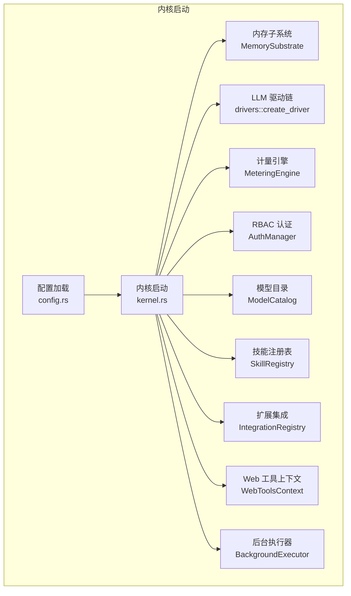
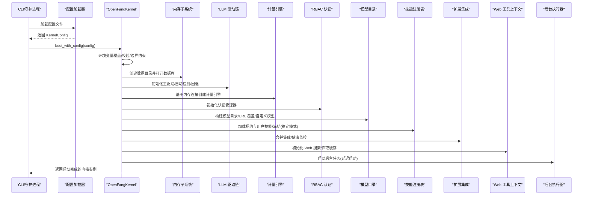
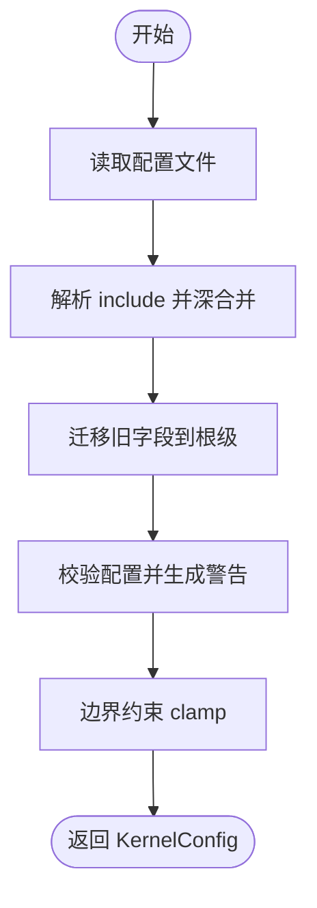
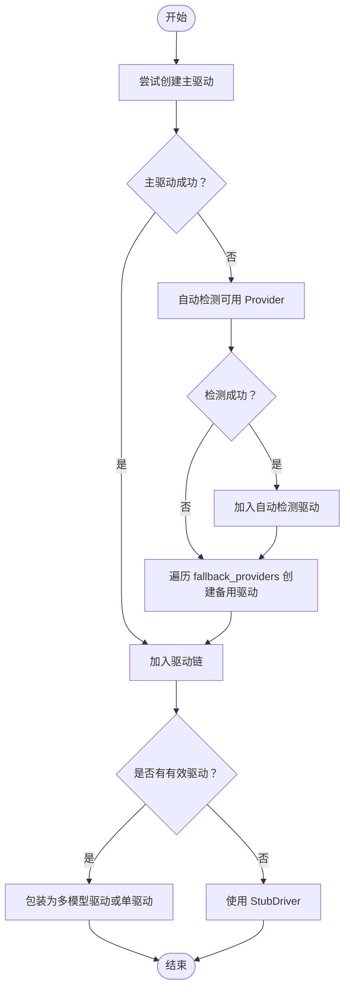
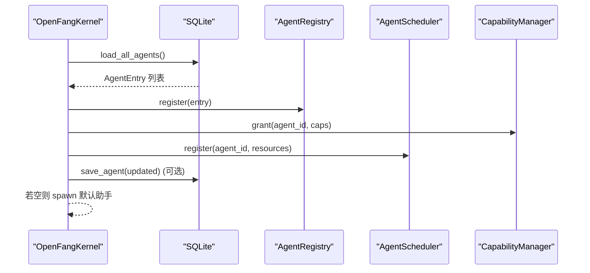
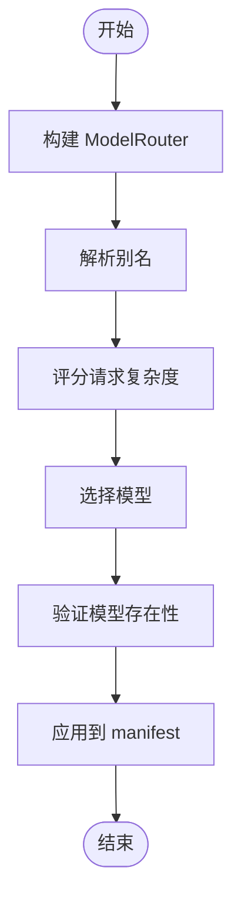
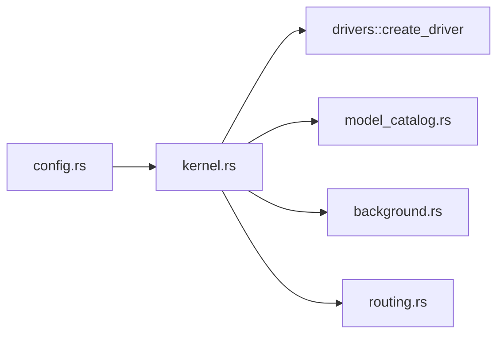

# 内核启动流程

<cite>
**本文档引用的文件**
- [kernel.rs](file://crates/openfang-kernel/src/kernel.rs)
- [config.rs](file://crates/openfang-kernel/src/config.rs)
- [background.rs](file://crates/openfang-kernel/src/background.rs)
- [routing.rs](file://crates/openfang-runtime/src/routing.rs)
- [model_catalog.rs](file://crates/openfang-runtime/src/model_catalog.rs)
- [main.rs](file://crates/openfang-cli/src/main.rs)
- [server.rs](file://crates/openfang-api/src/server.rs)
- [error.rs](file://crates/openfang-kernel/src/error.rs)
</cite>

## 目录
1. [简介](#简介)
2. [项目结构](#项目结构)
3. [核心组件](#核心组件)
4. [架构总览](#架构总览)
5. [详细组件分析](#详细组件分析)
6. [依赖关系分析](#依赖关系分析)
7. [性能考虑](#性能考虑)
8. [故障排除指南](#故障排除指南)
9. [结论](#结论)
10. [附录](#附录)

## 简介
本文件面向 OpenFang 内核启动流程，围绕 `OpenFangKernel::boot_with_config()` 的完整启动序列进行深入解析。内容覆盖配置加载、数据目录创建、内存子系统初始化、LLM 驱动初始化、模型目录构建、计量引擎初始化、模型路由器初始化、核心子系统初始化、RBAC 认证管理器初始化、技能注册表初始化、Web 工具上下文初始化、持久化智能体恢复等关键步骤，并对每个阶段的输入输出、错误处理与状态转换进行说明，同时提供故障排除指南、性能优化建议以及启动日志分析与监控指标解读。

## 项目结构
OpenFang 采用多 crate 架构，内核启动流程主要集中在 `openfang-kernel` crate 中，其他相关模块分布在 `openfang-runtime`、`openfang-cli`、`openfang-api` 等 crate 中：
- 配置加载：`openfang-kernel/src/config.rs`
- 内核启动与子系统装配：`openfang-kernel/src/kernel.rs`
- 后台任务执行器：`openfang-kernel/src/background.rs`
- 模型路由：`openfang-runtime/src/routing.rs`
- 模型目录：`openfang-runtime/src/model_catalog.rs`
- CLI 启动入口：`openfang-cli/src/main.rs`
- API 守护进程启动：`openfang-api/src/server.rs`
- 内核错误类型：`openfang-kernel/src/error.rs`

**图表来源**
- [config.rs:18-110](file://crates/openfang-kernel/src/config.rs#L18-L110)
- [kernel.rs:513-1245](file://crates/openfang-kernel/src/kernel.rs#L513-L1245)
- [background.rs:40-186](file://crates/openfang-kernel/src/background.rs#L40-L186)

**章节来源**
- [config.rs:18-110](file://crates/openfang-kernel/src/config.rs#L18-L110)
- [kernel.rs:513-1245](file://crates/openfang-kernel/src/kernel.rs#L513-L1245)

## 核心组件
- 配置加载器：从用户配置文件加载并合并 include，支持默认路径与环境变量覆盖。
- 内核装配器：负责初始化所有子系统并组装 OpenFangKernel 实例。
- 内存子系统：SQLite 数据库存储与使用量记录。
- LLM 驱动链：主驱动优先，自动检测备用驱动，回退到 StubDriver。
- 模型目录：内置模型与别名，支持 URL 覆盖与自定义模型。
- 计量引擎：基于模型目录计价估算用量成本。
- RBAC 认证：用户管理与鉴权开关。
- 技能注册表：捆绑与用户安装技能，支持冻结模式。
- 扩展集成：模板与已安装集成合并，健康监控。
- Web 工具上下文：多提供商搜索、SSRF 保护抓取、缓存。
- 后台执行器：连续/周期性/事件触发的自主代理执行器。

**章节来源**
- [kernel.rs:513-1245](file://crates/openfang-kernel/src/kernel.rs#L513-L1245)
- [routing.rs:31-164](file://crates/openfang-runtime/src/routing.rs#L31-L164)
- [model_catalog.rs:27-52](file://crates/openfang-runtime/src/model_catalog.rs#L27-L52)

## 架构总览
OpenFang 内核启动采用“配置 → 子系统初始化 → 恢复持久化状态 → 启动后台任务”的顺序流程。启动过程中严格区分稳定模式与开发模式的行为差异，确保在缺少外部服务时仍可提供最小可用能力（如 StubDriver）。

**图表来源**
- [main.rs:1417-1428](file://crates/openfang-cli/src/main.rs#L1417-L1428)
- [kernel.rs:513-1245](file://crates/openfang-kernel/src/kernel.rs#L513-L1245)
- [background.rs:40-186](file://crates/openfang-kernel/src/background.rs#L40-L186)

## 详细组件分析

### 配置加载与验证
- 输入：可选的配置文件路径（默认位于用户家目录下的 `.openfang/config.toml`），支持 include 深度合并与安全限制（禁止绝对路径、路径穿越、循环引用）。
- 处理：迁移旧版字段（如 api_key、api_listen）、深度合并 include、应用边界约束（clamp_bounds）、运行 validate() 生成警告。
- 输出：标准化后的 KernelConfig；若失败则回退默认配置并记录警告。
- 错误处理：解析失败、读取失败、包含文件错误均记录警告并回退默认配置。

**图表来源**
- [config.rs:18-110](file://crates/openfang-kernel/src/config.rs#L18-L110)
- [config.rs:116-224](file://crates/openfang-kernel/src/config.rs#L116-L224)

**章节来源**
- [config.rs:18-110](file://crates/openfang-kernel/src/config.rs#L18-L110)
- [config.rs:116-224](file://crates/openfang-kernel/src/config.rs#L116-L224)

### 数据目录创建与内存子系统初始化
- 输入：KernelConfig.data_dir
- 处理：创建数据目录；打开 SQLite 数据库（默认路径 data_dir/openfang.db 或显式 sqlite_path），初始化 MemorySubstrate。
- 输出：Arc<MemorySubstrate> 实例；失败时抛出 KernelError::BootFailed。
- 错误处理：目录创建失败、数据库打开失败均终止启动。

**章节来源**
- [kernel.rs:554-567](file://crates/openfang-kernel/src/kernel.rs#L554-L567)

### LLM 驱动初始化与回退策略
- 输入：KernelConfig.default_model.provider/model/base_url/api_key_env，CredentialResolver 解析 API Key。
- 处理：尝试创建主驱动；失败则自动扫描环境变量中可用的 Provider；再按 fallback_providers 列表依次创建备用驱动；若全部失败，使用 StubDriver 提供友好错误提示。
- 输出：Arc<dyn LlmDriver> 驱动链（可能包含多个驱动与模型映射）。
- 错误处理：各驱动初始化失败记录警告并继续；最终无可用驱动时使用 StubDriver。

**图表来源**
- [kernel.rs:591-717](file://crates/openfang-kernel/src/kernel.rs#L591-L717)

**章节来源**
- [kernel.rs:591-717](file://crates/openfang-kernel/src/kernel.rs#L591-L717)

### 计量引擎初始化
- 输入：MemorySubstrate 的 usage 连接。
- 处理：基于同一连接创建 MeteringEngine。
- 输出：Arc<MeteringEngine>。
- 错误处理：内部异常通过上层统一错误类型传播。

**章节来源**
- [kernel.rs:718-721](file://crates/openfang-kernel/src/kernel.rs#L718-L721)

### RBAC 认证管理器初始化
- 输入：KernelConfig.users。
- 处理：创建 AuthManager；启用时记录用户数量。
- 输出：AuthManager 实例。
- 错误处理：无直接错误；启用与否影响后续鉴权行为。

**章节来源**
- [kernel.rs:730-735](file://crates/openfang-kernel/src/kernel.rs#L730-L735)

### 模型目录构建与 URL 覆盖
- 输入：KernelConfig.provider_urls、custom_models.json。
- 处理：初始化 ModelCatalog，检测 Provider 认证状态，应用 URL 覆盖，加载自定义模型；统计可用模型数与本地 Provider 数。
- 输出：RwLock<ModelCatalog>。
- 错误处理：加载自定义模型失败记录警告。

**章节来源**
- [kernel.rs:736-758](file://crates/openfang-kernel/src/kernel.rs#L736-L758)

### 技能注册表初始化
- 输入：KernelConfig.home_dir/skills。
- 处理：加载捆绑技能；加载用户安装技能（覆盖同名捆绑项）；稳定模式下冻结注册表。
- 输出：RwLock<SkillRegistry>。
- 错误处理：加载失败记录警告。

**章节来源**
- [kernel.rs:760-784](file://crates/openfang-kernel/src/kernel.rs#L760-L784)

### 手册注册表初始化
- 输入：捆绑手册包。
- 处理：加载捆绑手册；记录数量。
- 输出：HandRegistry 实例。
- 错误处理：无直接错误。

**章节来源**
- [kernel.rs:786-791](file://crates/openfang-kernel/src/kernel.rs#L786-L791)

### 扩展集成注册表与健康监控
- 输入：KernelConfig.home_dir、extensions 配置。
- 处理：加载捆绑与已安装集成；合并到 MCP 服务器列表（去重）；初始化健康监控参数并注册已安装集成。
- 输出：RwLock<IntegrationRegistry>、HealthMonitor。
- 错误处理：加载失败记录警告。

**章节来源**
- [kernel.rs:793-834](file://crates/openfang-kernel/src/kernel.rs#L793-L834)

### Web 工具上下文初始化
- 输入：KernelConfig.web。
- 处理：创建 WebCache（基于 TTL）、WebSearchEngine、WebFetchEngine。
- 输出：WebToolsContext。
- 错误处理：无直接错误。

**章节来源**
- [kernel.rs:835-847](file://crates/openfang-kernel/src/kernel.rs#L835-L847)

### 嵌入式驱动与浏览器/媒体/TTS 初始化
- 输入：KernelConfig.memory.embedding_provider/model、KernelConfig.browser、KernelConfig.media、KernelConfig.tts。
- 处理：自动探测嵌入式驱动（显式配置优先，其次环境变量，最后本地 Ollama）；初始化 BrowserManager、MediaEngine、TtsEngine。
- 输出：可选的 EmbeddingDriver、BrowserManager、MediaEngine、TtsEngine。
- 错误处理：探测失败记录警告并回退文本搜索。

**章节来源**
- [kernel.rs:849-916](file://crates/openfang-kernel/src/kernel.rs#L849-L916)

### 设备配对与持久化回调
- 输入：KernelConfig.pairing。
- 处理：从数据库加载已配对设备；设置持久化回调（保存/移除）。
- 输出：PairingManager。
- 错误处理：加载失败记录警告。

**章节来源**
- [kernel.rs:924-978](file://crates/openfang-kernel/src/kernel.rs#L924-L978)

### 定时任务调度器与审批管理器
- 输入：KernelConfig.home_dir、max_cron_jobs、approval 配置。
- 处理：加载磁盘上的定时任务；初始化 ApprovalManager。
- 输出：CronScheduler、ApprovalManager。
- 错误处理：加载失败记录警告。

**章节来源**
- [kernel.rs:980-992](file://crates/openfang-kernel/src/kernel.rs#L980-L992)
- [kernel.rs:994-996](file://crates/openfang-kernel/src/kernel.rs#L994-L996)

### 内核实例组装与持久化智能体恢复
- 组装：填充 OpenFangKernel 字段（注册表、事件总线、调度器、工作流引擎、触发器、审计日志、WASM 沙箱、钩子、进程管理、通道适配器、消息锁等）。
- 恢复：从 SQLite 加载持久化智能体；对比磁盘 agent.toml 更新；重建能力授予与调度注册；继承执行策略与预算；应用 default_model 覆盖；若无智能体则创建默认助手。
- 输出：完整可用的 OpenFangKernel 实例。
- 错误处理：加载失败记录警告；更新失败记录警告。

**图表来源**
- [kernel.rs:1054-1199](file://crates/openfang-kernel/src/kernel.rs#L1054-L1199)

**章节来源**
- [kernel.rs:1002-1052](file://crates/openfang-kernel/src/kernel.rs#L1002-L1052)
- [kernel.rs:1054-1199](file://crates/openfang-kernel/src/kernel.rs#L1054-L1199)

### 模型路由初始化与验证
- 输入：每个智能体的 ModelRoutingConfig。
- 处理：为每个智能体构建 ModelRouter；解析别名；评分请求复杂度；选择模型；验证模型存在性；在稳定模式下使用固定模型。
- 输出：按复杂度选择的模型名称与 Provider。
- 错误处理：未知模型记录警告；别名解析失败不影响启动。

**图表来源**
- [kernel.rs:2447-2478](file://crates/openfang-kernel/src/kernel.rs#L2447-L2478)
- [routing.rs:117-164](file://crates/openfang-runtime/src/routing.rs#L117-L164)

**章节来源**
- [kernel.rs:2447-2478](file://crates/openfang-kernel/src/kernel.rs#L2447-L2478)
- [routing.rs:117-164](file://crates/openfang-runtime/src/routing.rs#L117-L164)

### 后台任务启动与心跳监控
- 输入：内核中所有非 Reactive 的智能体。
- 处理：延迟启动（每 500ms 间隔）连续/周期性任务；启动心跳监控；根据网络配置启动 OFP 节点；探测本地 Provider 可达性与模型发现；定期清理计量数据与内存整合。
- 输出：后台任务句柄、心跳监控、Provider 探测结果、清理与整合报告。
- 错误处理：任务失败记录警告；清理/整合失败记录警告。

**章节来源**
- [kernel.rs:3853-3881](file://crates/openfang-kernel/src/kernel.rs#L3853-L3881)
- [kernel.rs:3883-3892](file://crates/openfang-kernel/src/kernel.rs#L3883-L3892)
- [kernel.rs:3894-3939](file://crates/openfang-kernel/src/kernel.rs#L3894-L3939)
- [kernel.rs:3941-3963](file://crates/openfang-kernel/src/kernel.rs#L3941-L3963)
- [kernel.rs:3965-3999](file://crates/openfang-kernel/src/kernel.rs#L3965-L3999)
- [background.rs:40-186](file://crates/openfang-kernel/src/background.rs#L40-L186)

## 依赖关系分析
- 配置依赖：config.rs 为 kernel.rs 的输入源，决定后续所有子系统的初始状态。
- 驱动链依赖：drivers::create_driver 依赖 CredentialResolver 与 KernelConfig 中的 provider/base_url/api_key_env/fallback_providers。
- 模型目录依赖：ModelCatalog 由 model_catalog.rs 提供，被 kernel.rs 用于路由与计价。
- 路由依赖：routing.rs 仅依赖 ModelCatalog 与请求内容进行评分与选择。
- 后台执行器依赖：background.rs 依赖 supervisor 的关闭信号与全局并发限制。

**图表来源**
- [kernel.rs:513-1245](file://crates/openfang-kernel/src/kernel.rs#L513-L1245)
- [config.rs:18-110](file://crates/openfang-kernel/src/config.rs#L18-L110)
- [routing.rs:31-164](file://crates/openfang-runtime/src/routing.rs#L31-L164)
- [model_catalog.rs:27-52](file://crates/openfang-runtime/src/model_catalog.rs#L27-L52)
- [background.rs:40-186](file://crates/openfang-kernel/src/background.rs#L40-L186)

**章节来源**
- [kernel.rs:513-1245](file://crates/openfang-kernel/src/kernel.rs#L513-L1245)
- [routing.rs:31-164](file://crates/openfang-runtime/src/routing.rs#L31-L164)
- [model_catalog.rs:27-52](file://crates/openfang-runtime/src/model_catalog.rs#L27-L52)
- [background.rs:40-186](file://crates/openfang-kernel/src/background.rs#L40-L186)

## 性能考虑
- 启动阶段的 I/O 与网络探测应避免阻塞主线程：当前实现使用异步任务（tokio::spawn）分发后台探测与清理任务。
- 后台任务启动采用 500ms 延迟错峰，降低共享 Provider 的突发压力。
- 全局并发限制（MAX_CONCURRENT_BG_LLM）防止后台 LLM 调用导致资源争用。
- 内存整合与计量清理采用定时器周期执行，避免每次启动重复大量计算。
- 建议：在生产环境中为 Provider 设置合理的 base_url 与超时，减少探测失败带来的日志噪音与资源浪费。

[本节为通用指导，不直接分析具体文件]

## 故障排除指南
- 启动失败（BootFailed）
  - 现象：内核启动立即失败，返回 KernelError::BootFailed。
  - 排查：检查数据目录创建权限、数据库打开权限、LLM 驱动初始化错误、配置文件语法与包含文件路径。
  - 参考：错误类型定义与启动阶段的 map_err 调用位置。
  
  **章节来源**
  - [error.rs:1-19](file://crates/openfang-kernel/src/error.rs#L1-L19)
  - [kernel.rs:554-567](file://crates/openfang-kernel/src/kernel.rs#L554-L567)
  - [kernel.rs:617-658](file://crates/openfang-kernel/src/kernel.rs#L617-L658)

- LLM 驱动不可用
  - 现象：StubDriver 返回友好错误，Dashboard 仍可访问。
  - 排查：确认 API Key 环境变量、provider_urls、fallback_providers 是否正确配置；查看自动检测日志。
  
  **章节来源**
  - [kernel.rs:617-717](file://crates/openfang-kernel/src/kernel.rs#L617-L717)

- 模型目录缺失或别名未解析
  - 现象：路由选择未知模型，记录警告。
  - 排查：检查 custom_models.json 与 provider_urls；确认别名是否存在于 ModelCatalog。
  
  **章节来源**
  - [kernel.rs:2447-2478](file://crates/openfang-kernel/src/kernel.rs#L2447-L2478)
  - [routing.rs:133-164](file://crates/openfang-runtime/src/routing.rs#L133-L164)

- 技能/扩展加载失败
  - 现象：记录警告但不影响启动。
  - 排查：检查 skills 目录权限与文件完整性；查看扩展安装状态。
  
  **章节来源**
  - [kernel.rs:760-784](file://crates/openfang-kernel/src/kernel.rs#L760-L784)
  - [kernel.rs:793-834](file://crates/openfang-kernel/src/kernel.rs#L793-L834)

- 后台任务未启动或频繁跳过
  - 现象：连续模式任务跳过（busy）或周期性任务未触发。
  - 排查：检查全局并发许可（MAX_CONCURRENT_BG_LLM）与任务 Busy 标志；确认 Cron 表达式解析。
  
  **章节来源**
  - [background.rs:17-18](file://crates/openfang-kernel/src/background.rs#L17-L18)
  - [background.rs:84-116](file://crates/openfang-kernel/src/background.rs#L84-L116)
  - [background.rs:245-284](file://crates/openfang-kernel/src/background.rs#L245-L284)

- 守护进程启动后无法访问
  - 现象：CLI 显示启动成功但 API 不可用。
  - 排查：确认 OPENFANG_LISTEN 环境变量与 config.api_listen；检查端口占用与防火墙。
  
  **章节来源**
  - [main.rs:1417-1428](file://crates/openfang-cli/src/main.rs#L1417-L1428)
  - [server.rs:717-726](file://crates/openfang-api/src/server.rs#L717-L726)

## 结论
OpenFang 内核启动流程通过严格的配置加载、稳健的驱动链回退、完善的子系统初始化与持久化恢复机制，确保在多种部署环境下均可快速进入可用状态。启动阶段的关键在于配置正确性、驱动可用性与后台任务的错峰启动策略。通过日志与监控指标的配合，可以高效定位启动问题并持续优化启动性能。

[本节为总结性内容，不直接分析具体文件]

## 附录

### 启动日志分析要点
- 配置阶段：关注 include 解析、字段迁移、validate 警告、边界约束日志。
- 驱动阶段：关注主驱动失败与自动检测日志、fallback 驱动加入情况。
- 子系统阶段：关注模型目录构建、技能/扩展加载、Web 工具上下文初始化、嵌入式驱动探测。
- 恢复阶段：关注持久化智能体加载、TOML 对比更新、默认助手创建。
- 后台阶段：关注后台任务启动延迟、心跳监控、Provider 探测结果、清理与整合周期。

**章节来源**
- [kernel.rs:548-552](file://crates/openfang-kernel/src/kernel.rs#L548-L552)
- [kernel.rs:623-657](file://crates/openfang-kernel/src/kernel.rs#L623-L657)
- [kernel.rs:736-758](file://crates/openfang-kernel/src/kernel.rs#L736-L758)
- [kernel.rs:1054-1199](file://crates/openfang-kernel/src/kernel.rs#L1054-L1199)
- [kernel.rs:3872-3881](file://crates/openfang-kernel/src/kernel.rs#L3872-L3881)
- [kernel.rs:3894-3939](file://crates/openfang-kernel/src/kernel.rs#L3894-L3939)

### 监控指标解读
- 启动耗时：从配置加载到内核实例返回的时间窗口。
- 驱动可用性：主驱动/自动检测/备用驱动的成功率与错误类型分布。
- 模型目录规模：可用模型数、本地 Provider 数、URL 覆盖生效数。
- 智能体恢复：加载数量、TOML 更新次数、默认助手创建。
- 后台任务健康：活跃任务数、跳过 tick 次数、Provider 探测成功率。
- 计量与清理：清理条目数、内存整合合并/衰减次数、耗时。

**章节来源**
- [kernel.rs:3883-3892](file://crates/openfang-kernel/src/kernel.rs#L3883-L3892)
- [kernel.rs:3941-3963](file://crates/openfang-kernel/src/kernel.rs#L3941-L3963)
- [kernel.rs:3965-3999](file://crates/openfang-kernel/src/kernel.rs#L3965-L3999)