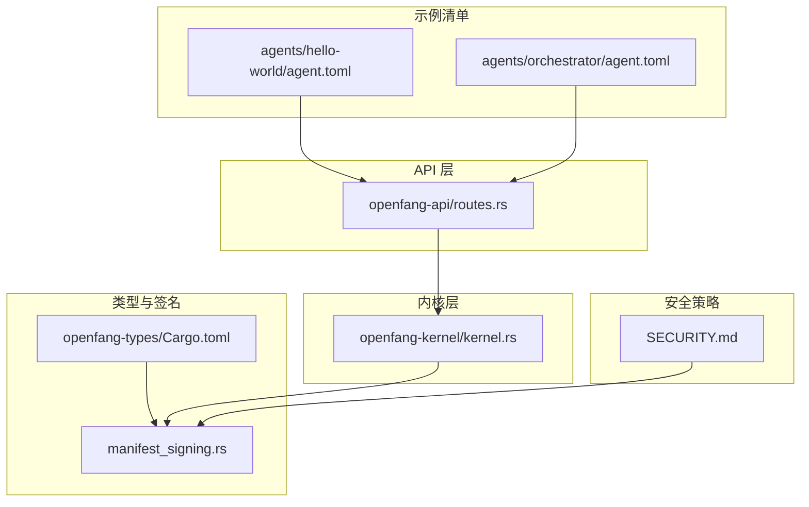
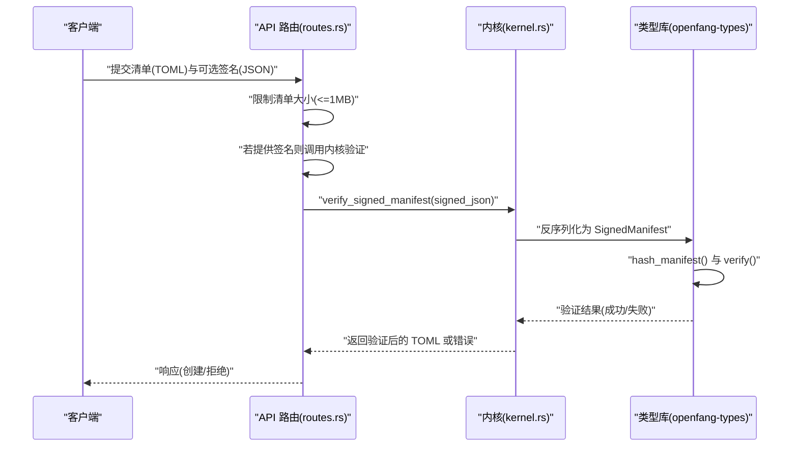
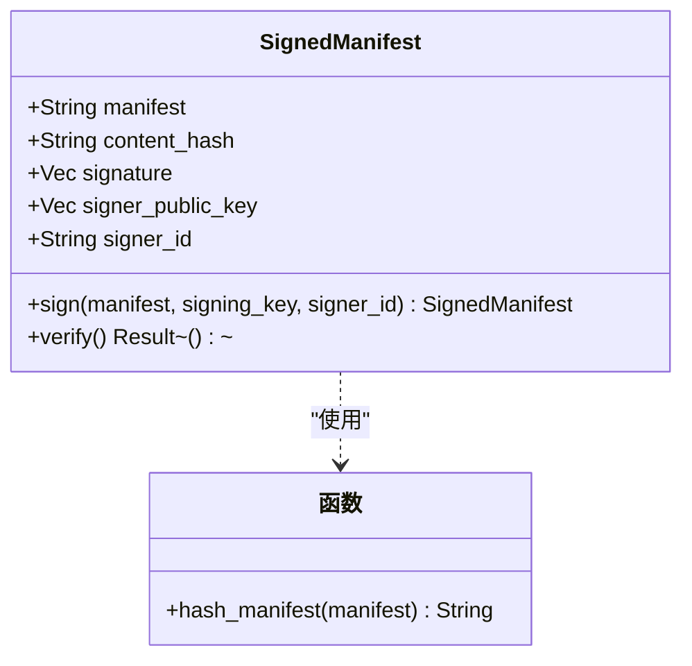
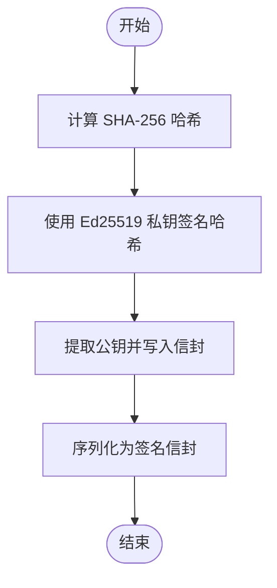
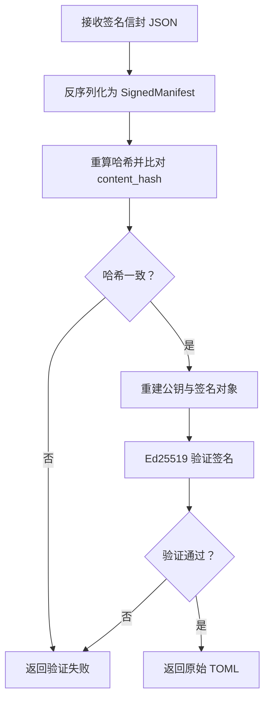
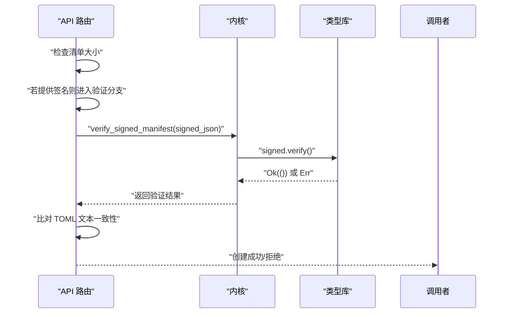
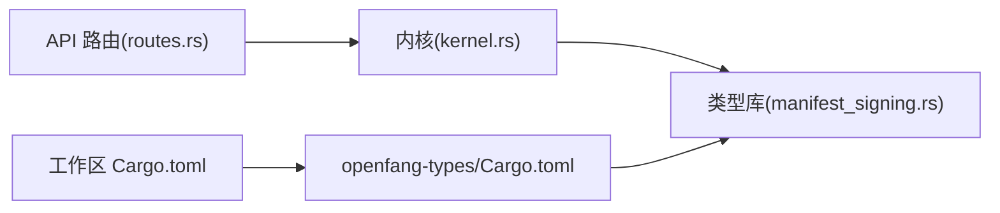

# Ed25519 清单签名

<cite>
**本文引用的文件**
- [manifest_signing.rs](file://crates/openfang-types/src/manifest_signing.rs)
- [Cargo.toml（openfang-types）](file://crates/openfang-types/Cargo.toml)
- [Cargo.toml（工作区）](file://Cargo.toml)
- [routes.rs](file://crates/openfang-api/src/routes.rs)
- [kernel.rs](file://crates/openfang-kernel/src/kernel.rs)
- [SECURITY.md](file://SECURITY.md)
- [agent.toml（hello-world）](file://agents/hello-world/agent.toml)
- [agent.toml（orchestrator）](file://agents/orchestrator/agent.toml)
</cite>

## 目录
1. [简介](#简介)
2. [项目结构](#项目结构)
3. [核心组件](#核心组件)
4. [架构总览](#架构总览)
5. [组件详细分析](#组件详细分析)
6. [依赖关系分析](#依赖关系分析)
7. [性能考量](#性能考量)
8. [故障排查指南](#故障排查指南)
9. [结论](#结论)
10. [附录：签名配置与最佳实践](#附录：签名配置与最佳实践)

## 简介
本文件围绕 Ed25519 清单签名机制，系统阐述 OpenFang 智能体清单（TOML）的完整性与来源验证流程。通过 SHA-256 哈希与 Ed25519 数字签名相结合，确保清单在供应链中的不可篡改性与可追溯性。本文重点覆盖以下方面：
- 签名生成与验证流程
- 密钥管理与使用建议
- 在 API 与内核中的集成点
- 安全作用与实现细节
- 配置与验证的最佳实践

## 项目结构
与 Ed25519 清单签名直接相关的核心文件分布如下：
- 类型与签名实现：crates/openfang-types/src/manifest_signing.rs
- 工作区与依赖声明：Cargo.toml（工作区）、crates/openfang-types/Cargo.toml
- API 集成与校验：crates/openfang-api/src/routes.rs
- 内核验证入口：crates/openfang-kernel/src/kernel.rs
- 安全策略与依赖说明：SECURITY.md
- 示例清单：agents/hello-world/agent.toml、agents/orchestrator/agent.toml

图表来源
- [manifest_signing.rs:1-167](file://crates/openfang-types/src/manifest_signing.rs#L1-L167)
- [Cargo.toml（openfang-types）:1-24](file://crates/openfang-types/Cargo.toml#L1-L24)
- [Cargo.toml（工作区）:1-160](file://Cargo.toml#L1-L160)
- [routes.rs:90-168](file://crates/openfang-api/src/routes.rs#L90-L168)
- [kernel.rs:1436-1454](file://crates/openfang-kernel/src/kernel.rs#L1436-L1454)
- [SECURITY.md:62-66](file://SECURITY.md#L62-L66)
- [agent.toml（hello-world）:1-30](file://agents/hello-world/agent.toml#L1-L30)
- [agent.toml（orchestrator）:1-64](file://agents/orchestrator/agent.toml#L1-L64)

章节来源
- [Cargo.toml（工作区）:1-160](file://Cargo.toml#L1-L160)
- [Cargo.toml（openfang-types）:1-24](file://crates/openfang-types/Cargo.toml#L1-L24)

## 核心组件
- SignedManifest：封装原始清单文本、内容哈希、签名与签名人公钥等字段，形成可序列化、可分发的签名信封。
- hash_manifest：对清单字符串计算 SHA-256 并返回十六进制编码结果。
- SignedManifest::sign：使用 Ed25519 私钥对内容哈希进行签名，并将公钥与标识一并打包。
- SignedManifest::verify：重新计算哈希并与嵌入哈希比对；重建公钥与签名对象后执行 Ed25519 验证。

章节来源
- [manifest_signing.rs:22-108](file://crates/openfang-types/src/manifest_signing.rs#L22-L108)

## 架构总览
下图展示了从 API 接收清单到内核完成签名验证的关键交互路径：

图表来源
- [routes.rs:90-168](file://crates/openfang-api/src/routes.rs#L90-L168)
- [kernel.rs:1436-1454](file://crates/openfang-kernel/src/kernel.rs#L1436-L1454)
- [manifest_signing.rs:38-108](file://crates/openfang-types/src/manifest_signing.rs#L38-L108)

## 组件详细分析

### SignedManifest 数据模型与方法
- 字段设计
  - manifest：原始清单文本（通常为 TOML）
  - content_hash：manifest 的 SHA-256 十六进制编码
  - signature：Ed25519 签名（64 字节）
  - signer_public_key：签名人公钥（32 字节）
  - signer_id：签名人标识（如邮箱或键 ID）
- 方法行为
  - sign：生成内容哈希，使用私钥签名，提取公钥与标识，构造信封
  - verify：重算哈希并比对；重建公钥与签名对象，执行 Ed25519 验证

图表来源
- [manifest_signing.rs:22-108](file://crates/openfang-types/src/manifest_signing.rs#L22-L108)

章节来源
- [manifest_signing.rs:22-108](file://crates/openfang-types/src/manifest_signing.rs#L22-L108)

### 签名生成流程（服务端/发布方）
- 输入：原始清单文本、Ed25519 私钥、签名人标识
- 步骤：
  1) 计算内容哈希
  2) 使用私钥对哈希进行签名
  3) 提取公钥并写入信封
  4) 序列化为 JSON/信封格式随清单分发

图表来源
- [manifest_signing.rs:45-67](file://crates/openfang-types/src/manifest_signing.rs#L45-L67)

章节来源
- [manifest_signing.rs:45-67](file://crates/openfang-types/src/manifest_signing.rs#L45-L67)

### 签名验证流程（API/内核）
- 输入：签名信封 JSON
- 步骤：
  1) 反序列化为 SignedManifest
  2) 重新计算哈希并与 content_hash 对比
  3) 重建公钥与签名对象
  4) 执行 Ed25519 验证
  5) 若一致，返回原始 TOML；否则返回错误

图表来源
- [manifest_signing.rs:69-108](file://crates/openfang-types/src/manifest_signing.rs#L69-L108)
- [kernel.rs:1440-1454](file://crates/openfang-kernel/src/kernel.rs#L1440-L1454)
- [routes.rs:103-132](file://crates/openfang-api/src/routes.rs#L103-L132)

章节来源
- [manifest_signing.rs:69-108](file://crates/openfang-types/src/manifest_signing.rs#L69-L108)
- [kernel.rs:1440-1454](file://crates/openfang-kernel/src/kernel.rs#L1440-L1454)
- [routes.rs:103-132](file://crates/openfang-api/src/routes.rs#L103-L132)

### API 与内核集成点
- API 层在接收清单时：
  - 限制最大尺寸（防止解析器内存耗尽）
  - 若提供签名信封，则调用内核验证
  - 验证通过后，进一步比对签名信封中的 TOML 与请求体是否一致
- 内核层提供 verify_signed_manifest 入口，负责反序列化与调用类型库的验证逻辑

图表来源
- [routes.rs:90-168](file://crates/openfang-api/src/routes.rs#L90-L168)
- [kernel.rs:1436-1454](file://crates/openfang-kernel/src/kernel.rs#L1436-L1454)
- [manifest_signing.rs:69-108](file://crates/openfang-types/src/manifest_signing.rs#L69-L108)

章节来源
- [routes.rs:90-168](file://crates/openfang-api/src/routes.rs#L90-L168)
- [kernel.rs:1436-1454](file://crates/openfang-kernel/src/kernel.rs#L1436-L1454)

### 依赖与安全背景
- 依赖声明：ed25519-dalek、sha2、hex、rand 等用于签名、哈希、编码与随机数生成
- 安全策略：项目将 Ed25519 签名作为“清单签名”的一部分，强调供应链完整性与身份验证

章节来源
- [Cargo.toml（openfang-types）:8-20](file://crates/openfang-types/Cargo.toml#L8-L20)
- [Cargo.toml（工作区）:100-110](file://Cargo.toml#L100-L110)
- [SECURITY.md:62-66](file://SECURITY.md#L62-L66)

## 依赖关系分析
- 类型库（openfang-types）提供签名数据结构与验证逻辑
- API 层负责输入约束与调用内核验证
- 内核层承担最终验证与审计记录
- 工作区统一管理加密相关依赖版本

图表来源
- [routes.rs:90-168](file://crates/openfang-api/src/routes.rs#L90-L168)
- [kernel.rs:1436-1454](file://crates/openfang-kernel/src/kernel.rs#L1436-L1454)
- [manifest_signing.rs:1-167](file://crates/openfang-types/src/manifest_signing.rs#L1-L167)
- [Cargo.toml（openfang-types）:1-24](file://crates/openfang-types/Cargo.toml#L1-L24)
- [Cargo.toml（工作区）:1-160](file://Cargo.toml#L1-L160)

章节来源
- [Cargo.toml（openfang-types）:1-24](file://crates/openfang-types/Cargo.toml#L1-L24)
- [Cargo.toml（工作区）:100-110](file://Cargo.toml#L100-L110)

## 性能考量
- 哈希与签名开销：SHA-256 与 Ed25519 验证均为常数级时间复杂度，对吞吐影响有限
- 输入大小限制：API 层对清单大小进行上限控制，避免解析器内存压力
- 序列化成本：签名信封包含哈希、公钥与签名，体积较小，便于网络传输与持久化

## 故障排查指南
- 常见错误类型
  - 内容哈希不匹配：表明清单被篡改或与签名不一致
  - 公钥/签名长度异常：表明信封数据损坏或格式错误
  - 签名校验失败：表明签名无效或公钥不匹配
- 排查步骤
  - 确认清单未被修改且与签名信封一致
  - 检查签名信封字段长度与格式
  - 核对使用的公钥与签名是否来自同一私钥对
  - 查看 API 层日志与内核审计记录定位问题

章节来源
- [manifest_signing.rs:76-107](file://crates/openfang-types/src/manifest_signing.rs#L76-L107)
- [routes.rs:103-132](file://crates/openfang-api/src/routes.rs#L103-L132)
- [kernel.rs:1440-1454](file://crates/openfang-kernel/src/kernel.rs#L1440-L1454)

## 结论
Ed25519 清单签名通过“内容哈希 + 数字签名 + 公钥验证”的组合，为智能体清单提供了强完整性与来源证明能力。API 与内核的协同实现了端到端的验证流程，配合输入大小限制与审计记录，有效提升了供应链安全性。建议在生产环境中严格遵循密钥管理与验证最佳实践，确保签名体系的长期稳健运行。

## 附录：签名配置与最佳实践
- 签名生成
  - 使用安全的随机源生成 Ed25519 密钥对
  - 将清单文本标准化后再计算哈希，避免空白字符差异导致的不一致
  - 将 signer_id 设计为可追踪的标识（如邮箱或键短号）
- 签名验证
  - 在 API 层限制清单大小，防止资源滥用
  - 验证通过后，再次比对签名信封中的 TOML 与请求体是否完全一致
  - 记录审计日志，保留失败事件以便溯源
- 密钥管理
  - 私钥应安全存储，避免明文泄露
  - 公钥可用于白名单或信任根，仅在受控范围内分发
  - 建议定期轮换密钥并记录轮换历史
- 配置示例参考
  - 示例清单文件位于 agents/<name>/agent.toml，可据此组织清单内容

章节来源
- [agent.toml（hello-world）:1-30](file://agents/hello-world/agent.toml#L1-L30)
- [agent.toml（orchestrator）:1-64](file://agents/orchestrator/agent.toml#L1-L64)
- [routes.rs:90-168](file://crates/openfang-api/src/routes.rs#L90-L168)
- [kernel.rs:1436-1454](file://crates/openfang-kernel/src/kernel.rs#L1436-L1454)
- [SECURITY.md:62-66](file://SECURITY.md#L62-L66)