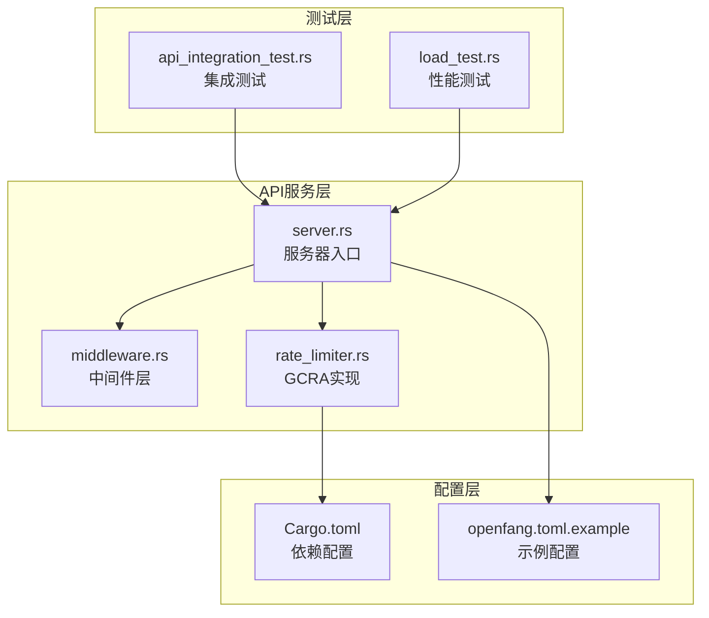
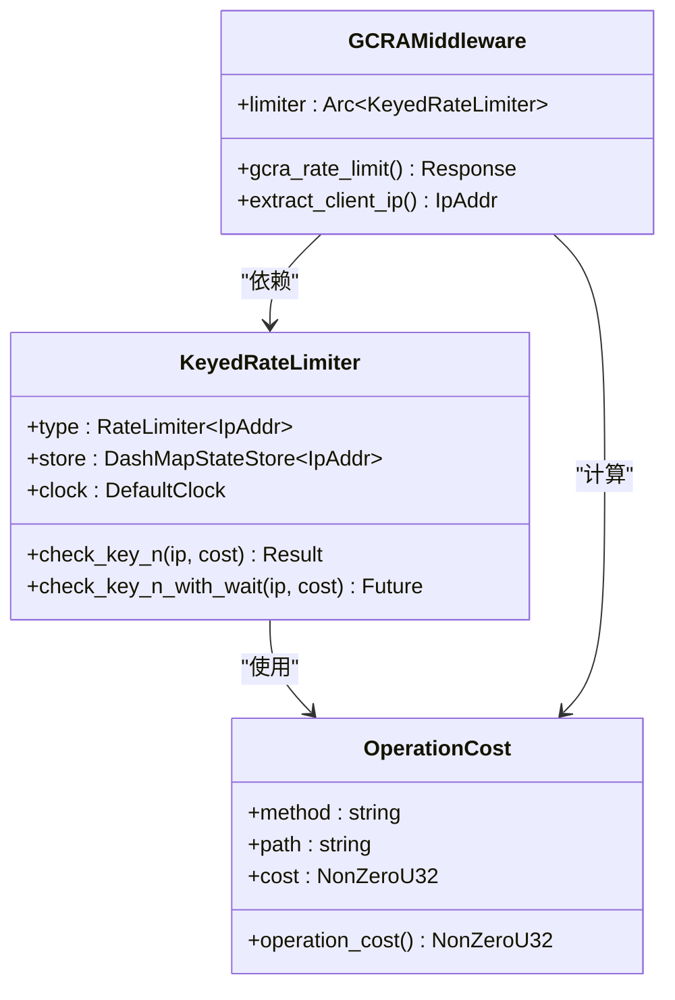
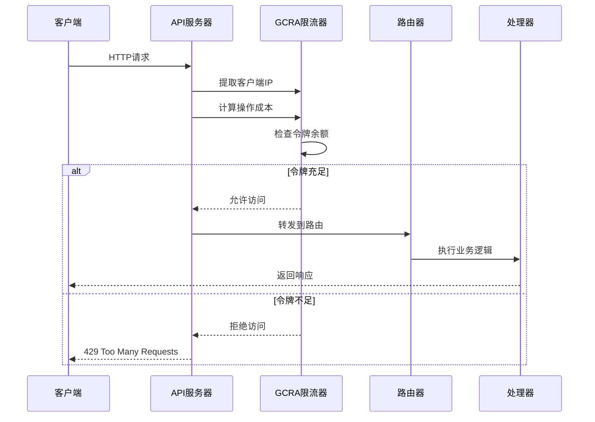
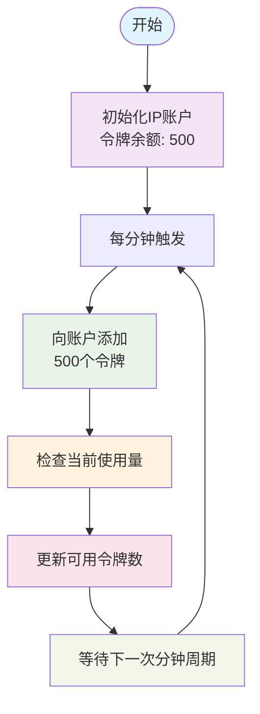
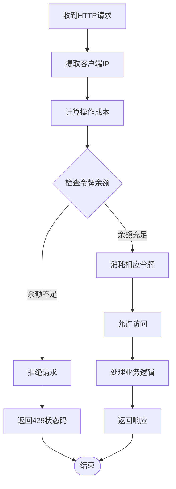
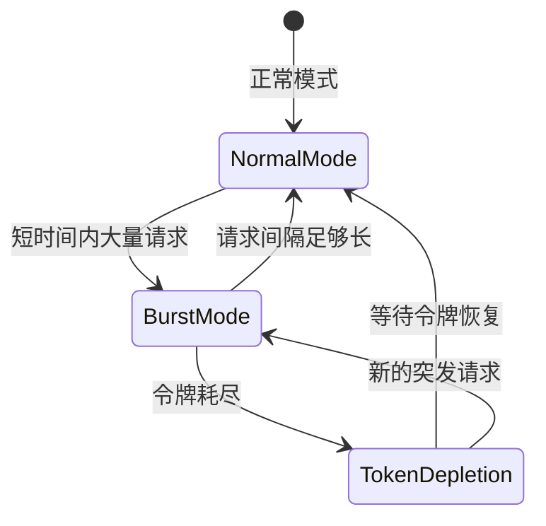
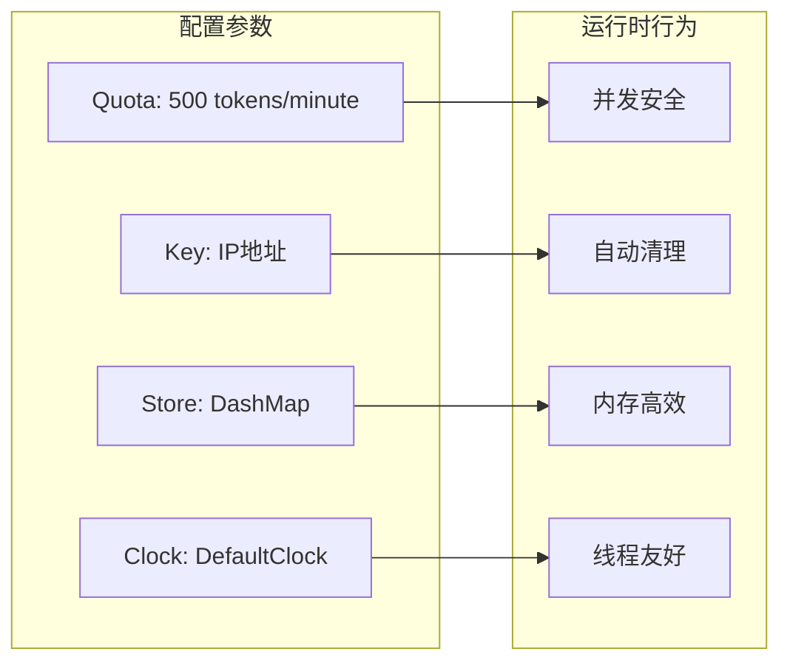
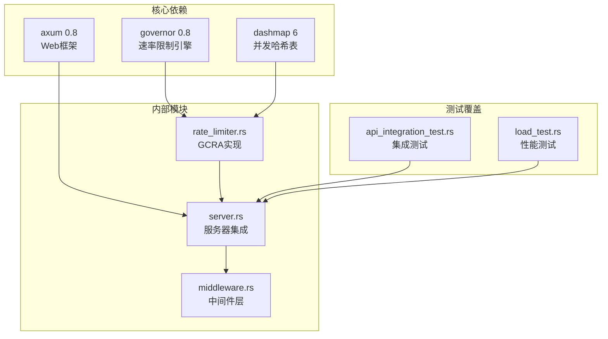
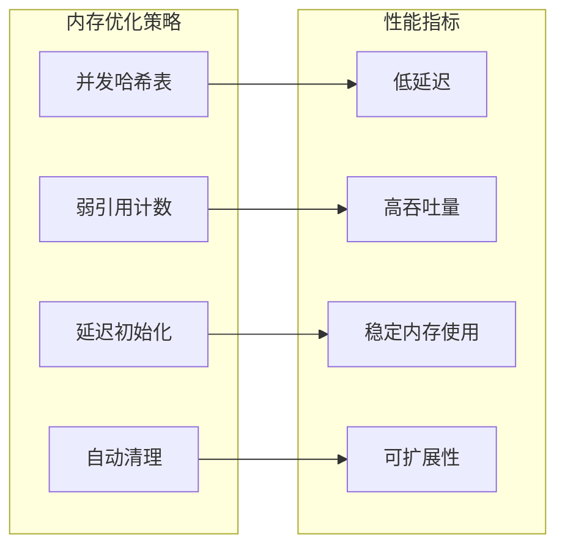
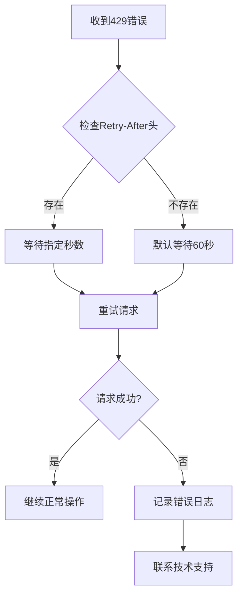

# GCRA 速率限制

<cite>
**本文档引用的文件**
- [rate_limiter.rs](file://crates/openfang-api/src/rate_limiter.rs)
- [server.rs](file://crates/openfang-api/src/server.rs)
- [middleware.rs](file://crates/openfang-api/src/middleware.rs)
- [Cargo.toml](file://crates/openfang-api/Cargo.toml)
- [Cargo.toml](file://Cargo.toml)
- [openfang.toml.example](file://openfang.toml.example)
- [api_integration_test.rs](file://crates/openfang-api/tests/api_integration_test.rs)
- [load_test.rs](file://crates/openfang-api/tests/load_test.rs)
</cite>

## 目录
1. [简介](#简介)
2. [项目结构](#项目结构)
3. [核心组件](#核心组件)
4. [架构概览](#架构概览)
5. [详细组件分析](#详细组件分析)
6. [依赖关系分析](#依赖关系分析)
7. [性能考虑](#性能考虑)
8. [故障排除指南](#故障排除指南)
9. [结论](#结论)

## 简介

GCRA（通用信元速率算法，Generic Cell Rate Algorithm）是一种先进的速率限制算法，广泛应用于网络通信和API保护中。在OpenFang项目中，GCRA被用作成本感知的速率限制解决方案，通过令牌桶机制实现智能的请求控制。

GCRA算法的核心优势在于其能够处理突发流量、提供精确的速率控制，并支持基于操作成本的差异化限制。与传统的固定速率限制不同，GCRA允许客户端在短时间内进行大量请求，但会根据请求的实际成本来消耗相应的令牌，从而实现更加灵活和高效的资源管理。

## 项目结构

OpenFang的GCRA速率限制系统主要分布在以下关键文件中：

**图表来源**
- [server.rs:37-712](file://crates/openfang-api/src/server.rs#L37-L712)
- [rate_limiter.rs:1-98](file://crates/openfang-api/src/rate_limiter.rs#L1-L98)

**章节来源**
- [server.rs:37-712](file://crates/openfang-api/src/server.rs#L37-L712)
- [rate_limiter.rs:1-98](file://crates/openfang-api/src/rate_limiter.rs#L1-L98)

## 核心组件

### GCRA速率限制器实现

OpenFang中的GCRA实现基于governor库，提供了高效且线程安全的速率限制功能：

**图表来源**
- [rate_limiter.rs:37-79](file://crates/openfang-api/src/rate_limiter.rs#L37-L79)

### 请求成本计算系统

系统为不同的API端点分配了相应的操作成本，实现了精细化的资源控制：

| HTTP方法 | 路径模式 | 成本(令牌) | 说明 |
|---------|---------|-----------|------|
| GET | /api/health | 1 | 健康检查 |
| GET | /api/tools | 1 | 工具列表 |
| GET | /api/skills | 2 | 技能列表 |
| GET | /api/agents | 2 | 代理列表 |
| GET | /api/usage | 3 | 使用统计 |
| POST | /api/agents | 50 | 创建代理 |
| POST | /api/agents/{id}/message | 30 | 发送消息 |
| POST | /api/workflows/{id}/run | 100 | 运行工作流 |
| POST | /api/skills/install | 50 | 安装技能 |
| 其他 | - | 5 | 默认成本 |

**章节来源**
- [rate_limiter.rs:14-35](file://crates/openfang-api/src/rate_limiter.rs#L14-L35)

## 架构概览

GCRA速率限制系统在OpenFang的整体架构中扮演着重要的安全防护角色：

**图表来源**
- [rate_limiter.rs:51-79](file://crates/openfang-api/src/rate_limiter.rs#L51-L79)
- [server.rs:696-703](file://crates/openfang-api/src/server.rs#L696-L703)

**章节来源**
- [server.rs:119-120](file://crates/openfang-api/src/server.rs#L119-L120)
- [server.rs:696-703](file://crates/openfang-api/src/server.rs#L696-L703)

## 详细组件分析

### GCRA算法实现细节

#### 令牌生成机制

GCRA算法采用时间驱动的令牌生成方式，每分钟向每个IP地址的账户注入500个令牌：

**图表来源**
- [rate_limiter.rs:39-44](file://crates/openfang-api/src/rate_limiter.rs#L39-L44)

#### 令牌消费控制

系统根据请求的复杂度动态消耗相应数量的令牌：

**图表来源**
- [rate_limiter.rs:51-79](file://crates/openfang-api/src/rate_limiter.rs#L51-L79)

**章节来源**
- [rate_limiter.rs:51-79](file://crates/openfang-api/src/rate_limiter.rs#L51-L79)

### 突发流量处理机制

GCRA算法的一个重要特性是能够有效处理突发流量：

这种设计确保了系统既能处理正常的高并发请求，又能有效防止恶意的DDoS攻击。

**章节来源**
- [rate_limiter.rs:39-44](file://crates/openfang-api/src/rate_limiter.rs#L39-L44)

### 配置和部署

#### 速率限制配置

系统默认配置为每IP每分钟500个令牌，这适用于大多数API使用场景：

**图表来源**
- [rate_limiter.rs:37-44](file://crates/openfang-api/src/rate_limiter.rs#L37-L44)

**章节来源**
- [rate_limiter.rs:37-44](file://crates/openfang-api/src/rate_limiter.rs#L37-L44)

## 依赖关系分析

### 外部依赖

OpenFang的GCRA实现依赖于以下关键组件：

**图表来源**
- [Cargo.toml:113](file://Cargo.toml#L113)
- [Cargo.toml:18-30](file://crates/openfang-api/Cargo.toml#L18-L30)

**章节来源**
- [Cargo.toml:113](file://Cargo.toml#L113)
- [Cargo.toml:18-30](file://crates/openfang-api/Cargo.toml#L18-L30)

### 内部耦合关系

GCRA系统的内部模块间存在清晰的职责分离：

| 组件 | 职责 | 依赖关系 |
|------|------|----------|
| rate_limiter.rs | GCRA算法实现 | governor, dashmap, axum |
| server.rs | 服务器集成 | rate_limiter.rs, middleware.rs |
| middleware.rs | 请求处理 | axum, tracing |
| 测试文件 | 功能验证 | 所有组件 |

**章节来源**
- [server.rs:119-120](file://crates/openfang-api/src/server.rs#L119-L120)
- [rate_limiter.rs:37-79](file://crates/openfang-api/src/rate_limiter.rs#L37-L79)

## 性能考虑

### 并发性能优化

GCRA实现采用了多种优化策略来确保高性能：

1. **无锁数据结构**: 使用DashMap实现线程安全的并发访问
2. **内存局部性**: IP地址作为键值，减少缓存未命中的概率
3. **零拷贝操作**: 最小化字符串操作和内存分配
4. **异步处理**: 完全基于Tokio的异步运行时

### 内存使用优化

### 监控和调试

系统提供了丰富的监控和调试功能：

- **请求ID追踪**: 每个请求都有唯一的标识符
- **详细日志**: 包含IP地址、成本、路径等信息
- **性能指标**: 可通过Prometheus导出
- **健康检查**: 支持外部监控系统集成

**章节来源**
- [middleware.rs:18-44](file://crates/openfang-api/src/middleware.rs#L18-L44)

## 故障排除指南

### 常见问题诊断

#### 429错误处理

当客户端收到429状态码时，通常表示达到了速率限制：

#### 性能问题排查

如果发现API响应变慢，可以检查以下方面：

1. **令牌桶状态**: 确认没有出现持续的令牌耗尽
2. **并发连接数**: 监控同时活跃的连接数量
3. **内存使用**: 检查DashMap的内存占用情况
4. **CPU使用率**: 分析GCRA计算的CPU开销

**章节来源**
- [rate_limiter.rs:66-76](file://crates/openfang-api/src/rate_limiter.rs#L66-L76)

### 配置调优建议

#### 速率限制参数调整

根据实际使用场景，可以调整以下参数：

| 参数 | 默认值 | 调整建议 | 适用场景 |
|------|--------|----------|----------|
| 令牌数量 | 500 | 200-1000 | 小型API, 大型API |
| 时间窗口 | 1分钟 | 30秒-5分钟 | 实时应用, 批处理 |
| 成本因子 | 1-100 | 根据API复杂度 | 简单查询, 复杂操作 |

#### 监控指标设置

建议监控以下关键指标：

- **请求成功率**: 评估GCRA的有效性
- **平均响应时间**: 监控性能影响
- **令牌使用率**: 了解资源消耗情况
- **错误分布**: 分析429错误的模式

**章节来源**
- [rate_limiter.rs:39-44](file://crates/openfang-api/src/rate_limiter.rs#L39-L44)

## 结论

OpenFang中的GCRA速率限制系统是一个设计精良、性能优异的安全防护机制。通过成本感知的令牌桶算法，系统能够在保证服务质量的同时，有效防止滥用和攻击。

### 主要优势

1. **智能成本计算**: 不同类型的API调用消耗不同数量的令牌
2. **突发流量处理**: 支持短时间内的高并发请求
3. **线程安全**: 基于DashMap的并发安全实现
4. **易于集成**: 与Axum中间件无缝集成
5. **可观测性**: 完善的日志和监控支持

### 应用场景

GCRA速率限制特别适用于以下场景：

- **多租户API服务**: 为不同用户提供差异化的服务等级
- **实时通信平台**: 处理突发的消息流量
- **微服务架构**: 保护下游服务免受过载
- **企业级应用**: 提供细粒度的访问控制

### 未来发展

随着OpenFang生态系统的不断扩展，GCRA速率限制系统将继续演进，可能的改进方向包括：

- **机器学习优化**: 基于历史数据预测和调整速率限制
- **动态配置**: 支持运行时的速率限制参数调整
- **更精细的成本模型**: 更准确地反映API的真实成本
- **分布式部署**: 支持多节点环境下的统一速率限制

通过持续的优化和完善，GCRA速率限制系统将成为OpenFang安全架构的重要基石，为用户提供可靠、高效的服务体验。