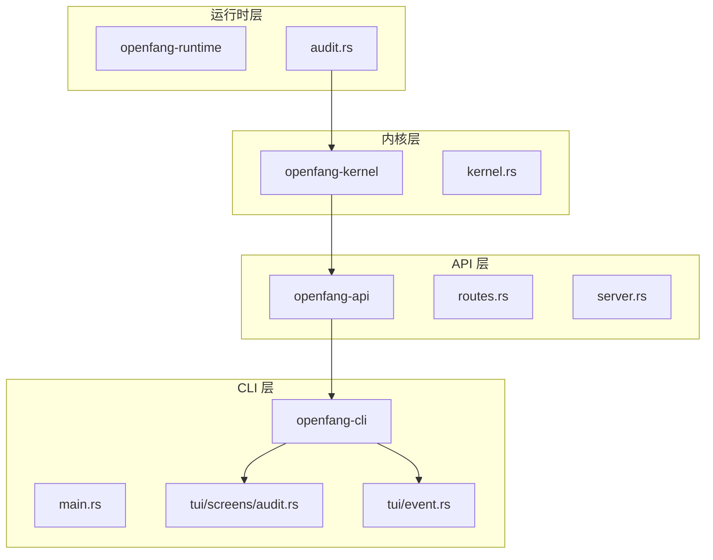
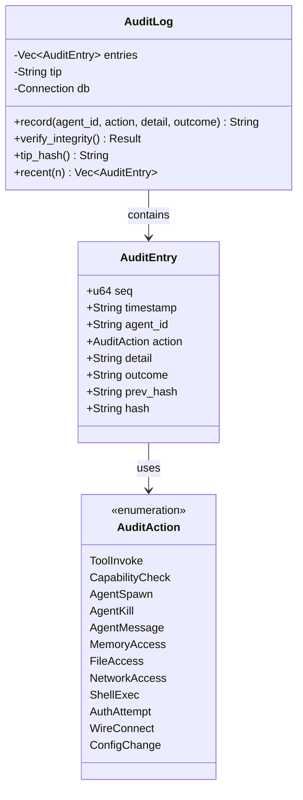
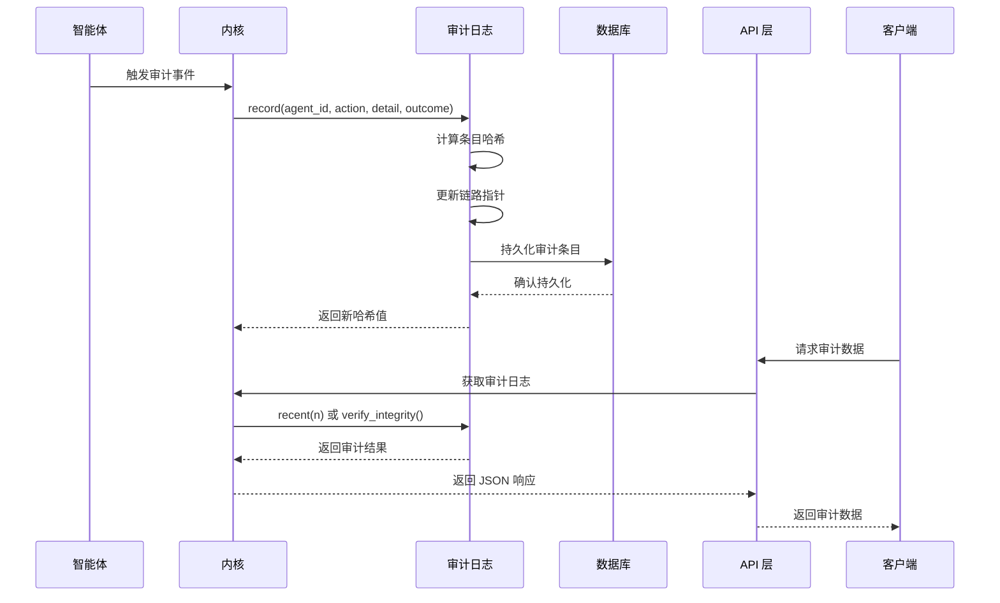
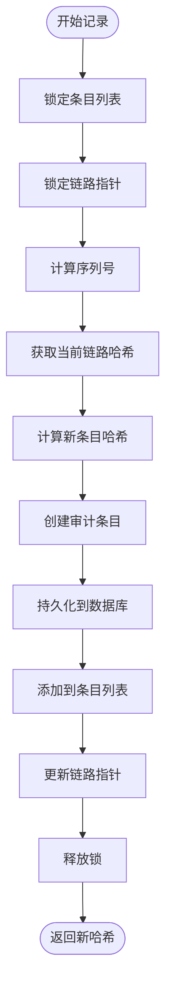
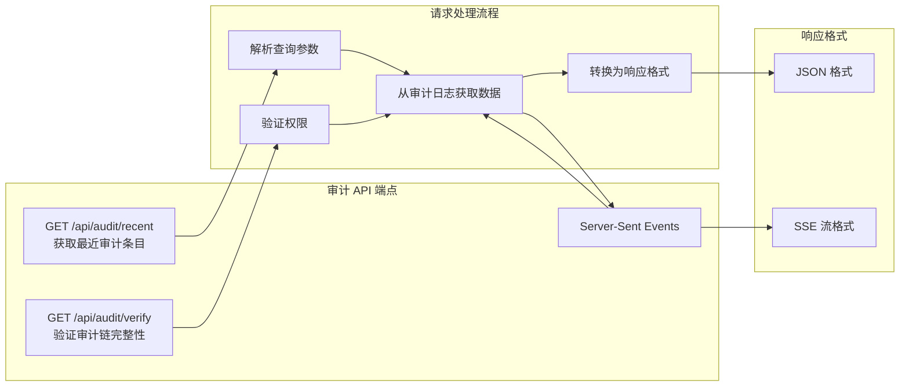
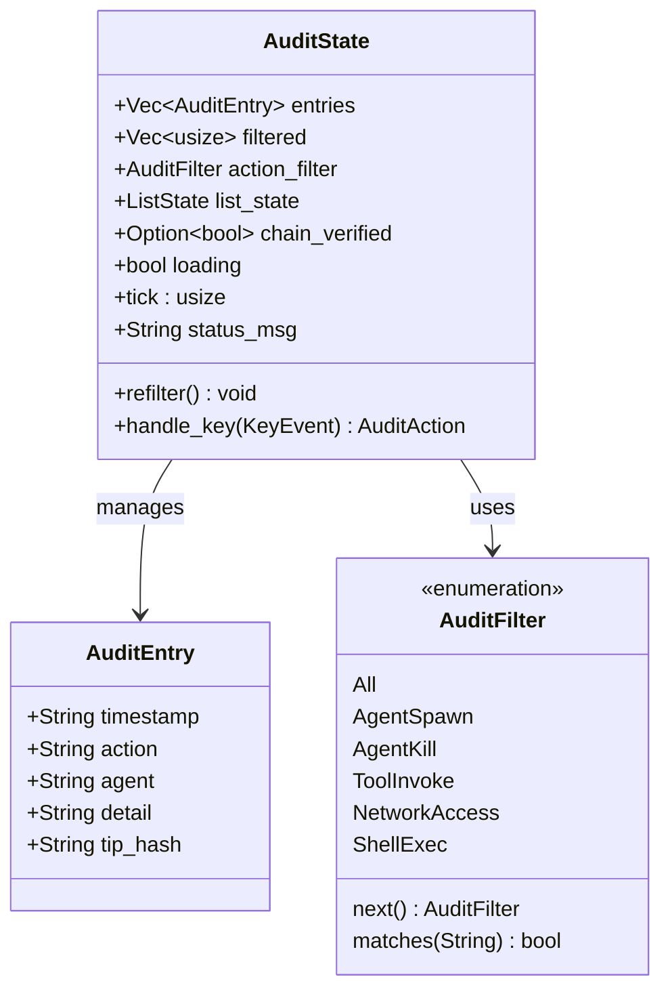
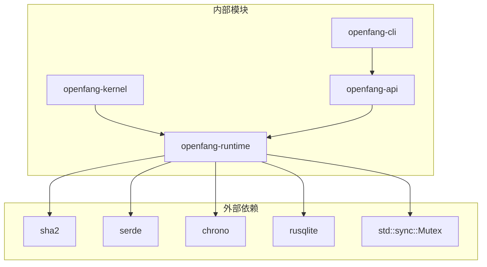
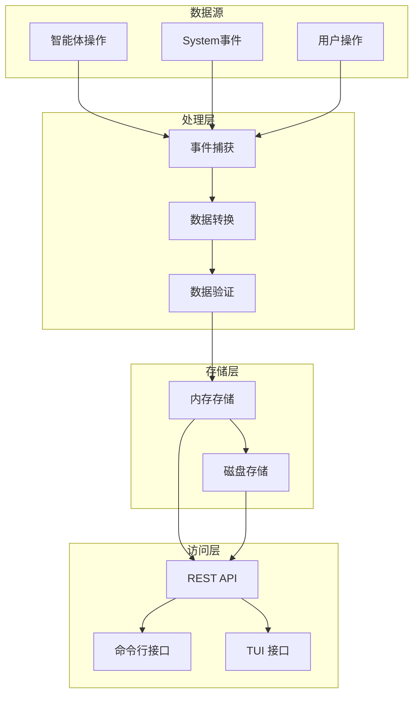
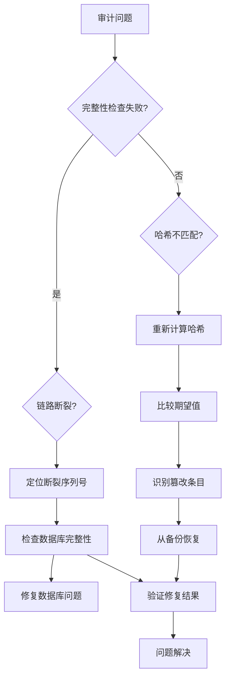
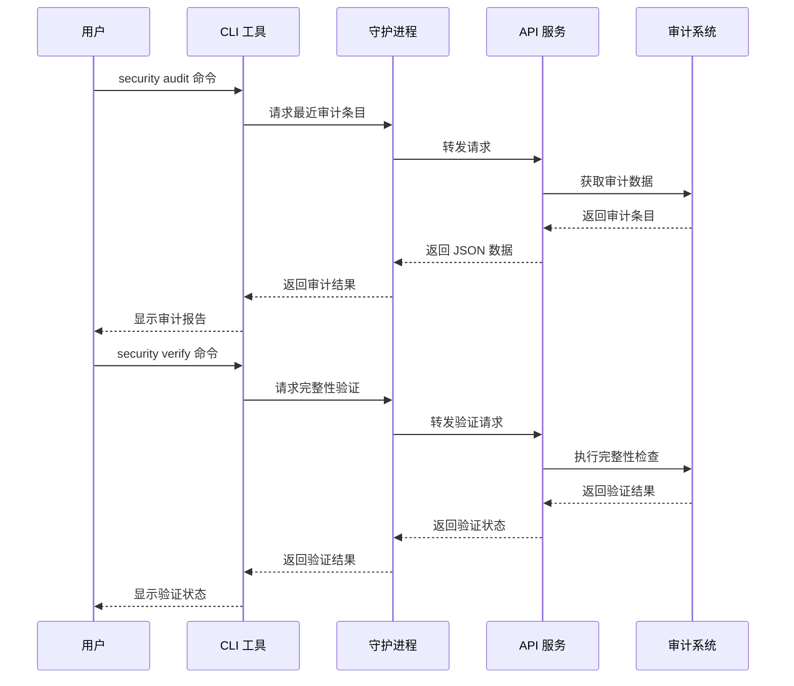

# Merkle 审计追踪

<cite>
**本文档引用的文件**
- [audit.rs](file://crates/openfang-runtime/src/audit.rs)
- [routes.rs](file://crates/openfang-api/src/routes.rs)
- [server.rs](file://crates/openfang-api/src/server.rs)
- [kernel.rs](file://crates/openfang-kernel/src/kernel.rs)
- [audit.rs](file://crates/openfang-cli/src/tui/screens/audit.rs)
- [event.rs](file://crates/openfang-cli/src/tui/event.rs)
- [main.rs](file://crates/openfang-cli/src/main.rs)
</cite>

## 目录
1. [简介](#简介)
2. [项目结构](#项目结构)
3. [核心组件](#核心组件)
4. [架构概览](#架构概览)
5. [详细组件分析](#详细组件分析)
6. [依赖关系分析](#依赖关系分析)
7. [性能考虑](#性能考虑)
8. [故障排除指南](#故障排除指南)
9. [结论](#结论)

## 简介

Merkle 审计追踪是 OpenFang 项目中实现的安全关键功能，它通过 Merkle 哈希链技术为所有智能体操作提供不可变的日志记录和篡改检测能力。该系统确保了审计数据的完整性、可追溯性和合规性要求。

Merkle 哈希链是一种密码学结构，其中每个区块（审计条目）都包含前一个区块的哈希值，形成一条不可篡改的链条。任何对历史数据的修改都会导致后续所有哈希值的变化，从而被立即检测到。

## 项目结构

OpenFang 的审计追踪系统分布在多个模块中：

**图表来源**
- [audit.rs:1-423](file://crates/openfang-runtime/src/audit.rs#L1-L423)
- [kernel.rs:1000-1052](file://crates/openfang-kernel/src/kernel.rs#L1000-L1052)
- [routes.rs:4870-4937](file://crates/openfang-api/src/routes.rs#L4870-L4937)

**章节来源**
- [audit.rs:1-423](file://crates/openfang-runtime/src/audit.rs#L1-L423)
- [kernel.rs:80-82](file://crates/openfang-kernel/src/kernel.rs#L80-L82)

## 核心组件

### 审计动作枚举

系统定义了多种可审计的操作类型：

| 操作类型 | 描述 | 示例 |
|---------|------|------|
| ToolInvoke | 工具调用 | 调用外部工具或命令 |
| CapabilityCheck | 能力检查 | 权限验证和访问控制 |
| AgentSpawn | 智能体创建 | 新建智能体实例 |
| AgentKill | 智能体销毁 | 终止智能体执行 |
| AgentMessage | 智能体消息 | 智能体间通信 |
| MemoryAccess | 内存访问 | 内存读写操作 |
| FileAccess | 文件访问 | 文件系统操作 |
| NetworkAccess | 网络访问 | 网络请求和连接 |
| ShellExec | Shell 执行 | 命令行执行 |
| AuthAttempt | 认证尝试 | 登录和身份验证 |
| WireConnect | 连接建立 | 网络连接建立 |
| ConfigChange | 配置变更 | 系统配置修改 |

### 审计条目结构

每个审计条目包含以下关键字段：

**图表来源**
- [audit.rs:39-58](file://crates/openfang-runtime/src/audit.rs#L39-L58)
- [audit.rs:85-90](file://crates/openfang-runtime/src/audit.rs#L85-L90)

**章节来源**
- [audit.rs:16-31](file://crates/openfang-runtime/src/audit.rs#L16-L31)
- [audit.rs:39-58](file://crates/openfang-runtime/src/audit.rs#L39-L58)

## 架构概览

Merkle 审计追踪系统采用分层架构设计，确保了数据的完整性和系统的可扩展性：

**图表来源**
- [audit.rs:180-235](file://crates/openfang-runtime/src/audit.rs#L180-L235)
- [routes.rs:4874-4908](file://crates/openfang-api/src/routes.rs#L4874-L4908)

系统的核心特性包括：

1. **不可变性**：通过哈希链确保数据不可篡改
2. **完整性验证**：支持全链路重新计算验证
3. **持久化存储**：SQLite 数据库存储确保重启后数据不丢失
4. **实时监控**：支持 Server-Sent Events 实时流式传输
5. **多层访问**：提供 REST API 和 CLI/TUI 接口

**章节来源**
- [audit.rs:81-90](file://crates/openfang-runtime/src/audit.rs#L81-L90)
- [kernel.rs:1012-1013](file://crates/openfang-kernel/src/kernel.rs#L1012-L1013)

## 详细组件分析

### 审计日志实现

AuditLog 结构体是整个系统的核心，提供了线程安全的审计功能：

**图表来源**
- [audit.rs:180-235](file://crates/openfang-runtime/src/audit.rs#L180-L235)

#### 关键方法分析

**record 方法**：
- 原子性地记录新的审计事件
- 自动管理序列号和链路指针
- 支持数据库持久化

**verify_integrity 方法**：
- 全链路重新计算验证
- 检测链路断裂和哈希不匹配
- 提供详细的错误信息

**章节来源**
- [audit.rs:175-274](file://crates/openfang-runtime/src/audit.rs#L175-L274)

### API 端点设计

系统提供了完整的 REST API 来访问审计数据：

**图表来源**
- [routes.rs:4874-4937](file://crates/openfang-api/src/routes.rs#L4874-L4937)
- [server.rs:420-427](file://crates/openfang-api/src/server.rs#L420-L427)

**章节来源**
- [routes.rs:4874-4937](file://crates/openfang-api/src/routes.rs#L4874-L4937)
- [server.rs:415-430](file://crates/openfang-api/src/server.rs#L415-L430)

### CLI 和 TUI 接口

系统提供了丰富的用户界面来管理和分析审计数据：

**图表来源**
- [audit.rs:110-139](file://crates/openfang-cli/src/tui/screens/audit.rs#L110-L139)
- [audit.rs:22-31](file://crates/openfang-cli/src/tui/screens/audit.rs#L22-L31)

**章节来源**
- [audit.rs:1-350](file://crates/openfang-cli/src/tui/screens/audit.rs#L1-L350)

## 依赖关系分析

### 组件耦合度

**图表来源**
- [audit.rs:10-14](file://crates/openfang-runtime/src/audit.rs#L10-L14)
- [kernel.rs:1012-1013](file://crates/openfang-kernel/src/kernel.rs#L1012-L1013)

### 数据流依赖

系统中的数据流向体现了清晰的层次结构：

**图表来源**
- [audit.rs:175-235](file://crates/openfang-runtime/src/audit.rs#L175-L235)
- [routes.rs:4874-4908](file://crates/openfang-api/src/routes.rs#L4874-L4908)

**章节来源**
- [audit.rs:104-173](file://crates/openfang-runtime/src/audit.rs#L104-L173)
- [kernel.rs:1012-1013](file://crates/openfang-kernel/src/kernel.rs#L1012-L1013)

## 性能考虑

### 哈希计算优化

Merkle 审计追踪系统在性能方面采用了多项优化策略：

1. **增量哈希计算**：只对新增条目进行哈希计算
2. **批量持久化**：数据库操作采用批量提交减少 I/O 开销
3. **内存映射**：使用内存中的条目列表提高访问速度
4. **懒加载**：审计数据按需加载，避免不必要的内存占用

### 并发安全性

系统通过以下机制确保并发环境下的数据一致性：

- **互斥锁保护**：关键数据结构使用 Mutex 保护
- **原子操作**：记录操作保证原子性
- **无锁设计**：部分读操作采用无锁设计提高性能

### 存储效率

- **压缩存储**：审计数据采用紧凑的二进制格式存储
- **索引优化**：为常用查询字段建立索引
- **分页查询**：支持大数量数据的分页访问

## 故障排除指南

### 常见问题诊断

### 错误处理机制

系统提供了完善的错误处理和恢复机制：

1. **完整性验证**：定期自动验证审计链完整性
2. **错误日志**：详细记录所有审计失败事件
3. **自动恢复**：支持从备份自动恢复审计数据
4. **告警通知**：检测到异常时及时发出告警

**章节来源**
- [audit.rs:241-274](file://crates/openfang-runtime/src/audit.rs#L241-L274)
- [routes.rs:4910-4937](file://crates/openfang-api/src/routes.rs#L4910-L4937)

### CLI 故障排除

**图表来源**
- [main.rs:5779-5831](file://crates/openfang-cli/src/main.rs#L5779-L5831)
- [event.rs:1672-1703](file://crates/openfang-cli/src/tui/event.rs#L1672-L1703)

**章节来源**
- [main.rs:5779-5831](file://crates/openfang-cli/src/main.rs#L5779-L5831)
- [event.rs:1672-1703](file://crates/openfang-cli/src/tui/event.rs#L1672-L1703)

## 结论

Merkle 审计追踪系统为 OpenFang 提供了强大而灵活的安全审计能力。通过采用 Merkle 哈希链技术，系统确保了审计数据的不可篡改性和完整性，满足了企业级应用对合规性和安全性的严格要求。

### 主要优势

1. **技术先进性**：基于密码学原理的 Merkle 哈希链确保数据完整性
2. **实现简洁性**：代码结构清晰，易于理解和维护
3. **性能高效性**：优化的数据结构和算法确保高吞吐量
4. **扩展灵活性**：模块化设计支持功能扩展和定制
5. **用户体验友好**：提供多种访问接口和可视化工具

### 应用场景

该系统适用于以下场景：

- **合规性审计**：满足金融、医疗等行业的审计要求
- **安全监控**：实时监控系统安全状态和异常行为
- **故障排查**：快速定位和分析系统问题
- **业务分析**：分析智能体行为模式和使用趋势

### 未来发展方向

1. **增强分析功能**：集成机器学习算法进行异常检测
2. **分布式部署**：支持多节点集群的审计数据同步
3. **实时告警**：建立更完善的实时告警机制
4. **可视化增强**：提供更丰富的数据可视化工具

通过持续的优化和改进，Merkle 审计追踪系统将继续为 OpenFang 生态系统提供可靠的安全保障。