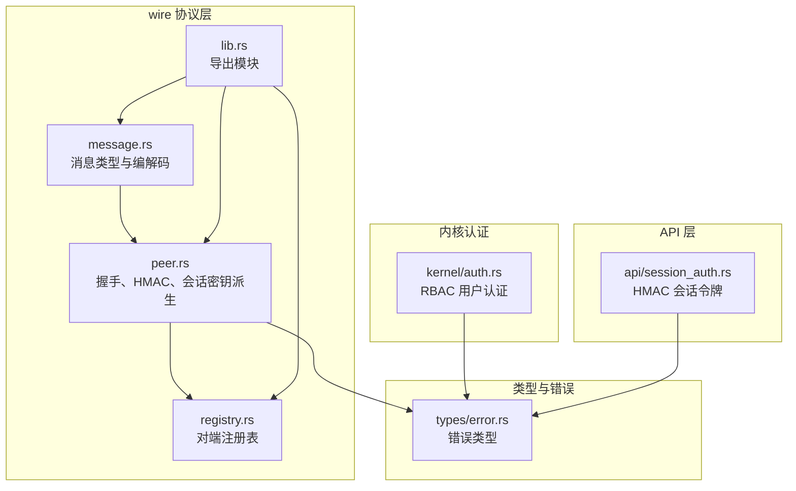
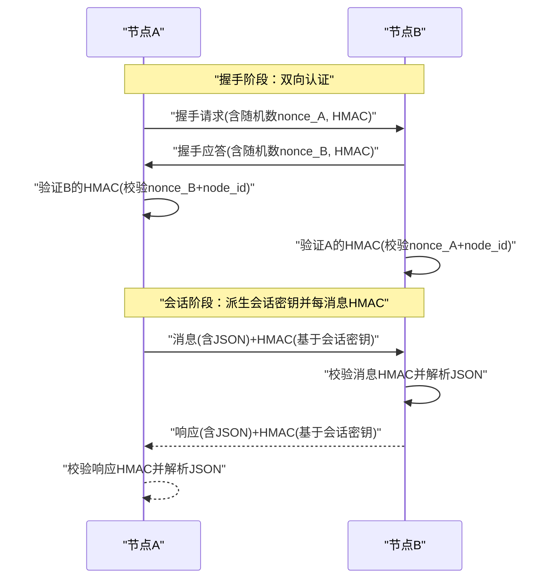
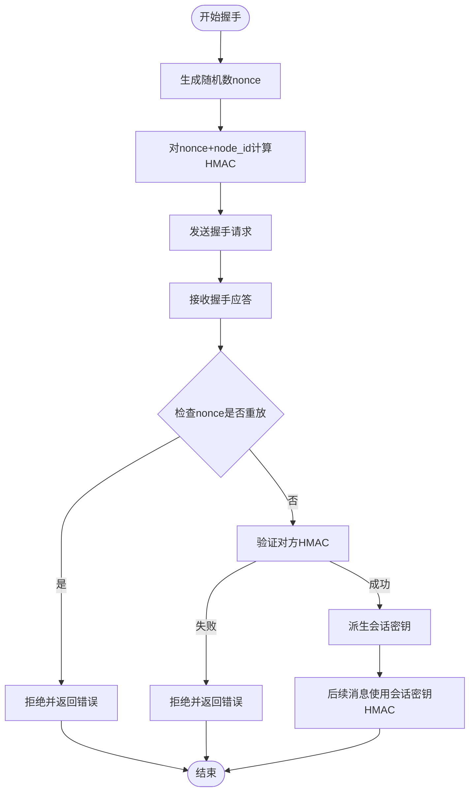
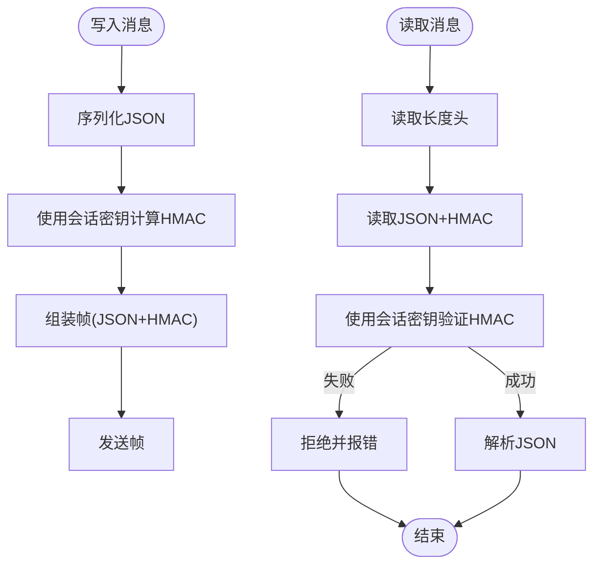
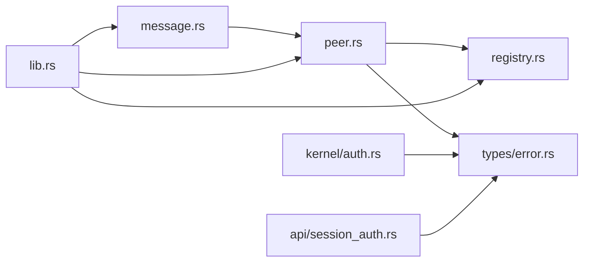

# OFP HMAC-SHA256 互认证

<cite>
**本文档引用的文件**
- [auth.rs](file://crates/openfang-kernel/src/auth.rs)
- [session_auth.rs](file://crates/openfang-api/src/session_auth.rs)
- [peer.rs](file://crates/openfang-wire/src/peer.rs)
- [message.rs](file://crates/openfang-wire/src/message.rs)
- [registry.rs](file://crates/openfang-wire/src/registry.rs)
- [lib.rs](file://crates/openfang-wire/src/lib.rs)
- [error.rs](file://crates/openfang-types/src/error.rs)
</cite>

## 目录
1. [简介](#简介)
2. [项目结构](#项目结构)
3. [核心组件](#核心组件)
4. [架构总览](#架构总览)
5. [详细组件分析](#详细组件分析)
6. [依赖关系分析](#依赖关系分析)
7. [性能考虑](#性能考虑)
8. [故障排除指南](#故障排除指南)
9. [结论](#结论)

## 简介
本文件面向 OFP（OpenFang Wire Protocol）中的 HMAC-SHA256 互认证机制，系统性阐述其在跨节点代理通信中的双向认证流程、密钥交换与会话管理等安全特性。重点覆盖以下方面：
- 双向握手中的 HMAC-SHA256 身份验证与抗重放保护
- 基于共享密钥与随机数的会话密钥派生
- 每消息级 HMAC 验证以确保传输完整性
- 与内核用户认证（RBAC）的区别与互补关系
- 实际部署中的配置要点与安全建议

## 项目结构
OFP 互认证相关代码主要分布在以下模块：
- wire 协议层：消息定义、握手流程、HMAC 验证与会话密钥派生
- 类型与错误：通用类型与错误定义
- 内核认证：基于用户角色的访问控制（RBAC）
- API 层：基于 HMAC 的会话令牌（Dashboard 使用）

**图表来源**
- [lib.rs:1-20](file://crates/openfang-wire/src/lib.rs#L1-L20)
- [message.rs:1-293](file://crates/openfang-wire/src/message.rs#L1-L293)
- [peer.rs:1-1285](file://crates/openfang-wire/src/peer.rs#L1-L1285)
- [registry.rs:1-352](file://crates/openfang-wire/src/registry.rs#L1-L352)
- [error.rs:1-105](file://crates/openfang-types/src/error.rs#L1-L105)
- [auth.rs:1-317](file://crates/openfang-kernel/src/auth.rs#L1-L317)
- [session_auth.rs:1-110](file://crates/openfang-api/src/session_auth.rs#L1-L110)

**章节来源**
- [lib.rs:1-20](file://crates/openfang-wire/src/lib.rs#L1-L20)
- [message.rs:1-293](file://crates/openfang-wire/src/message.rs#L1-L293)
- [peer.rs:1-1285](file://crates/openfang-wire/src/peer.rs#L1-L1285)
- [registry.rs:1-352](file://crates/openfang-wire/src/registry.rs#L1-L352)
- [error.rs:1-105](file://crates/openfang-types/src/error.rs#L1-L105)
- [auth.rs:1-317](file://crates/openfang-kernel/src/auth.rs#L1-L317)
- [session_auth.rs:1-110](file://crates/openfang-api/src/session_auth.rs#L1-L110)

## 核心组件
- 握手消息与字段：握手请求与应答中包含节点标识、协议版本、可用代理列表、随机数与 HMAC-SHA256 签名，用于双方互相认证。
- HMAC-SHA256 验证：对握手阶段的随机数与节点 ID 进行签名验证，确保消息未被篡改且来自可信对端。
- 抗重放保护：使用非重复计数器跟踪已见过的随机数，超过时间窗口后自动清理，防止重放攻击。
- 会话密钥派生：基于共享密钥与双方随机数，通过 HMAC-SHA256 派生每会话密钥，用于后续每消息级 HMAC 验证。
- 每消息 HMAC：在消息帧尾附加 64 字节十六进制 HMAC，读取时先校验 HMAC 再解析 JSON，确保传输完整性。

**章节来源**
- [message.rs:33-117](file://crates/openfang-wire/src/message.rs#L33-L117)
- [peer.rs:39-82](file://crates/openfang-wire/src/peer.rs#L39-L82)
- [peer.rs:810-849](file://crates/openfang-wire/src/peer.rs#L810-L849)
- [peer.rs:883-931](file://crates/openfang-wire/src/peer.rs#L883-L931)

## 架构总览
OFP 互认证采用“握手阶段双向认证 + 会话阶段每消息 HMAC”的分层安全模型：
- 握手阶段：双方交换随机数并用共享密钥对“随机数+节点ID”进行 HMAC-SHA256 签名，验证通过后进入会话阶段。
- 会话阶段：基于双方随机数派生会话密钥，后续所有消息均附加 HMAC，防止篡改与伪造。

**图表来源**
- [message.rs:33-117](file://crates/openfang-wire/src/message.rs#L33-L117)
- [peer.rs:240-457](file://crates/openfang-wire/src/peer.rs#L240-L457)
- [peer.rs:810-849](file://crates/openfang-wire/src/peer.rs#L810-L849)
- [peer.rs:883-931](file://crates/openfang-wire/src/peer.rs#L883-L931)

## 详细组件分析

### 组件A：握手与互认证流程
- 握手请求与应答：双方在握手消息中携带随机数与 HMAC，用于相互认证。
- 抗重放保护：在验证 HMAC 前先检查随机数是否已使用，避免重放。
- 会话密钥派生：使用双方随机数拼接后经 HMAC-SHA256 得到会话密钥。
- 错误处理：版本不匹配、HMAC 失败、连接关闭等场景均有明确错误返回。

**图表来源**
- [peer.rs:240-457](file://crates/openfang-wire/src/peer.rs#L240-L457)
- [peer.rs:39-82](file://crates/openfang-wire/src/peer.rs#L39-L82)
- [peer.rs:810-849](file://crates/openfang-wire/src/peer.rs#L810-L849)

**章节来源**
- [message.rs:33-117](file://crates/openfang-wire/src/message.rs#L33-L117)
- [peer.rs:240-457](file://crates/openfang-wire/src/peer.rs#L240-L457)
- [peer.rs:39-82](file://crates/openfang-wire/src/peer.rs#L39-L82)
- [peer.rs:810-849](file://crates/openfang-wire/src/peer.rs#L810-L849)

### 组件B：每消息 HMAC 与完整性保护
- 写入消息：将 JSON 序列化后，使用会话密钥对 JSON 计算 HMAC 并附加到帧尾。
- 读取消息：先校验 HMAC，再解析 JSON；若 HMAC 不匹配则拒绝该帧。
- 安全边界：仅在握手完成后才启用每消息 HMAC，确保连接建立阶段的灵活性与安全性。

**图表来源**
- [peer.rs:816-849](file://crates/openfang-wire/src/peer.rs#L816-L849)
- [peer.rs:883-931](file://crates/openfang-wire/src/peer.rs#L883-L931)

**章节来源**
- [peer.rs:816-849](file://crates/openfang-wire/src/peer.rs#L816-L849)
- [peer.rs:883-931](file://crates/openfang-wire/src/peer.rs#L883-L931)

### 组件C：对端注册与状态管理
- PeerRegistry：维护已知对端的节点信息、代理列表、连接状态与协议版本。
- 状态转换：连接断开后仍保留条目以便重连；仅连接状态为 Connected 的对端参与发现与通信。
- 查询能力：支持按名称、描述、标签搜索远程代理，过滤掉断开连接的对端。

**章节来源**
- [registry.rs:50-206](file://crates/openfang-wire/src/registry.rs#L50-L206)

### 组件D：内核用户认证（RBAC）与 API 会话认证
- 内核 RBAC：基于用户配置与通道绑定，提供角色驱动的权限控制，与 OFP 互认证属于不同层面的安全机制。
- API 会话认证：使用 HMAC-SHA256 对用户名与过期时间进行签名，支持 Dashboard 无状态会话令牌。

**章节来源**
- [auth.rs:97-189](file://crates/openfang-kernel/src/auth.rs#L97-L189)
- [session_auth.rs:1-110](file://crates/openfang-api/src/session_auth.rs#L1-L110)

## 依赖关系分析
- wire 协议层依赖：
  - 消息编解码：基于 serde 的 JSON 序列化与反序列化
  - HMAC 实现：使用标准库 HMAC-SHA256
  - 并发数据结构：DashMap 用于线程安全的会话与索引管理
- 类型与错误：统一的错误类型体系，便于上层处理
- 与内核认证的关系：OFP 互认证保障节点间通信安全，RBAC 保障用户对内核资源的访问权限

**图表来源**
- [lib.rs:1-20](file://crates/openfang-wire/src/lib.rs#L1-L20)
- [message.rs:1-293](file://crates/openfang-wire/src/message.rs#L1-L293)
- [peer.rs:1-1285](file://crates/openfang-wire/src/peer.rs#L1-L1285)
- [registry.rs:1-352](file://crates/openfang-wire/src/registry.rs#L1-L352)
- [error.rs:1-105](file://crates/openfang-types/src/error.rs#L1-L105)
- [auth.rs:1-317](file://crates/openfang-kernel/src/auth.rs#L1-L317)
- [session_auth.rs:1-110](file://crates/openfang-api/src/session_auth.rs#L1-L110)

**章节来源**
- [lib.rs:1-20](file://crates/openfang-wire/src/lib.rs#L1-L20)
- [message.rs:1-293](file://crates/openfang-wire/src/message.rs#L1-L293)
- [peer.rs:1-1285](file://crates/openfang-wire/src/peer.rs#L1-L1285)
- [registry.rs:1-352](file://crates/openfang-wire/src/registry.rs#L1-L352)
- [error.rs:1-105](file://crates/openfang-types/src/error.rs#L1-L105)
- [auth.rs:1-317](file://crates/openfang-kernel/src/auth.rs#L1-L317)
- [session_auth.rs:1-110](file://crates/openfang-api/src/session_auth.rs#L1-L110)

## 性能考虑
- HMAC 计算成本：HMAC-SHA256 为轻量级操作，单次计算 CPU 成本极低，适合高频消息场景。
- 每消息 HMAC 的额外开销：每帧需追加 64 字节 HMAC，网络带宽占用约 1.5%，通常可忽略。
- 抗重放窗口：默认 5 分钟窗口，内存占用与 GC 压力可控；可根据部署规模调整窗口大小。
- 并发与锁：使用 DashMap 降低锁竞争；每连接独立会话密钥，避免全局锁争用。

## 故障排除指南
常见问题与定位思路：
- 版本不匹配：握手阶段比较协议版本，不一致会导致握手失败。检查两端协议版本常量。
- HMAC 验证失败：可能由共享密钥不一致或消息被篡改导致。确认双方共享密钥一致，并检查网络中间件是否修改消息。
- 重放攻击：若出现“nonce replay detected”，检查客户端是否重复使用随机数，或时间窗口设置过短。
- 连接关闭：读取长度头或消息体时遇到 EOF 视为连接关闭，排查网络稳定性与对端异常退出。
- 消息过长：超过最大消息尺寸限制会直接拒绝，适当拆分消息或增大限制（谨慎）。

**章节来源**
- [peer.rs:269-274](file://crates/openfang-wire/src/peer.rs#L269-L274)
- [peer.rs:529-560](file://crates/openfang-wire/src/peer.rs#L529-L560)
- [peer.rs:851-877](file://crates/openfang-wire/src/peer.rs#L851-L877)
- [peer.rs:896-902](file://crates/openfang-wire/src/peer.rs#L896-L902)

## 结论
OFP HMAC-SHA256 互认证通过“握手阶段双向认证 + 会话阶段每消息 HMAC”的设计，在节点间通信中提供了强完整性与抗篡改能力。配合抗重放保护与会话密钥派生，有效抵御重放、篡改与伪造等攻击。与内核 RBAC 和 API 会话认证共同构成多层安全防护体系，既满足节点间通信安全，也兼顾用户访问控制与会话管理需求。