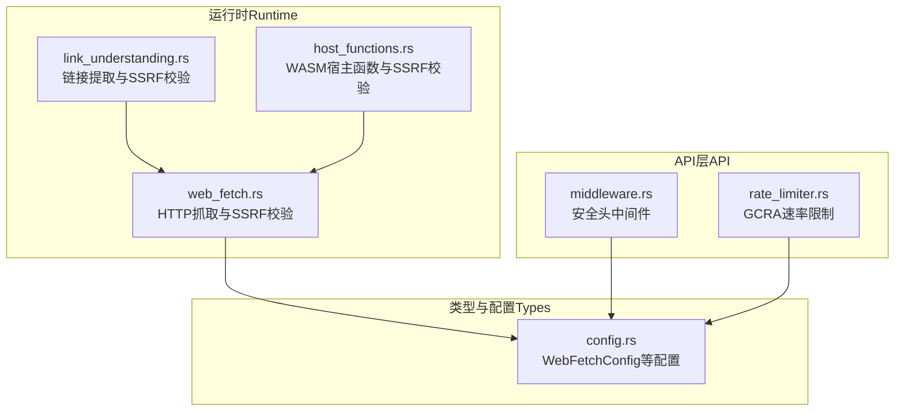
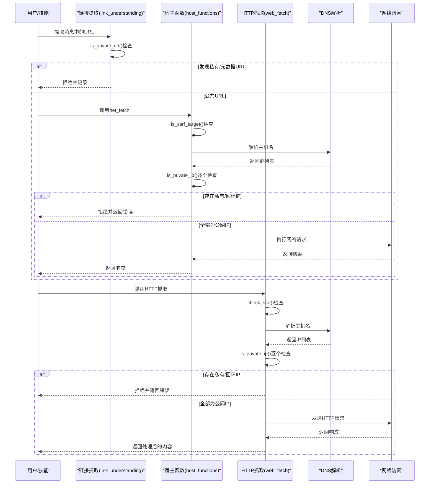
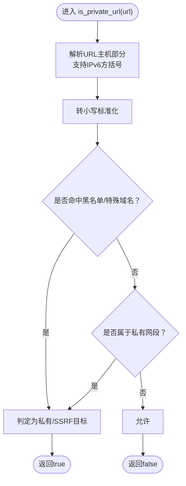
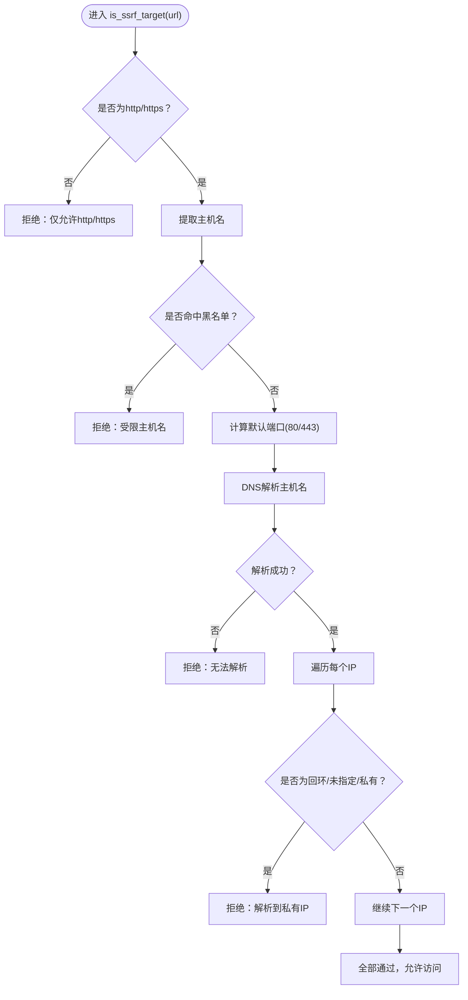
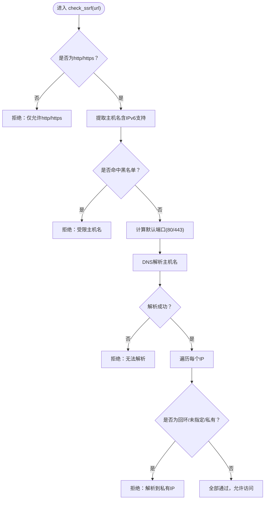
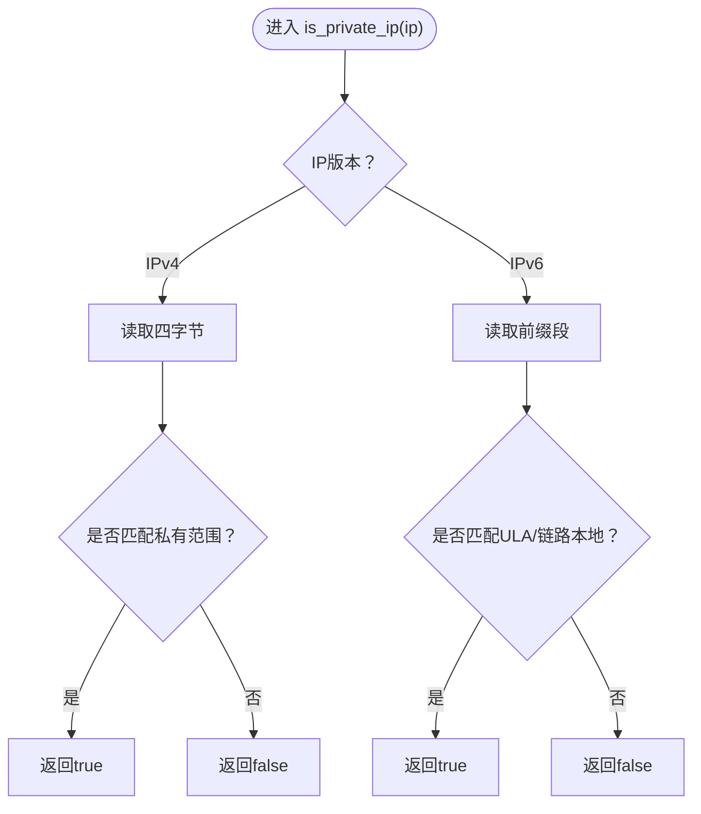
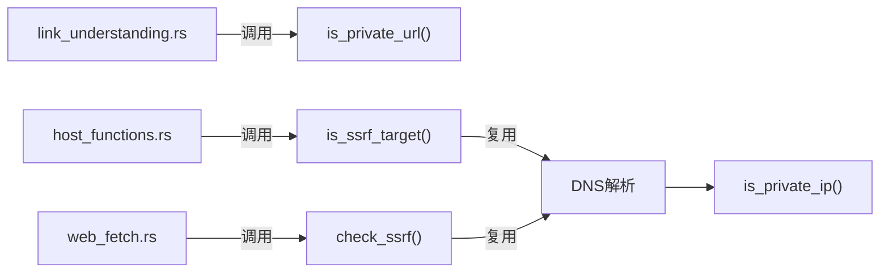

# SSRF 保护

<cite>
**本文引用的文件**   
- [crates/openfang-runtime/src/web_fetch.rs](file://crates/openfang-runtime/src/web_fetch.rs)
- [crates/openfang-runtime/src/host_functions.rs](file://crates/openfang-runtime/src/host_functions.rs)
- [crates/openfang-runtime/src/link_understanding.rs](file://crates/openfang-runtime/src/link_understanding.rs)
- [crates/openfang-types/src/config.rs](file://crates/openfang-types/src/config.rs)
- [crates/openfang-api/src/middleware.rs](file://crates/openfang-api/src/middleware.rs)
- [crates/openfang-api/src/rate_limiter.rs](file://crates/openfang-api/src/rate_limiter.rs)
- [crates/openfang-cli/src/tui/screens/security.rs](file://crates/openfang-cli/src/tui/screens/security.rs)
- [README.md](file://README.md)
</cite>

## 目录
1. [简介](#简介)
2. [项目结构](#项目结构)
3. [核心组件](#核心组件)
4. [架构总览](#架构总览)
5. [详细组件分析](#详细组件分析)
6. [依赖关系分析](#依赖关系分析)
7. [性能考量](#性能考量)
8. [故障排查指南](#故障排查指南)
9. [结论](#结论)
10. [附录](#附录)

## 简介
本文件系统性阐述 OpenFang 中的 SSRF（服务器端请求伪造）防护机制与实现细节，重点覆盖以下内容：
- is_ssrf_target() 与 is_private_ip() 的工作机制与调用链
- DNS 解析检查、DNS 重绑定攻击防护、网络访问控制
- SSRF 攻击的防护原理与实现要点
- 网络安全配置与访问控制策略建议

OpenFang 将 SSRF 防护作为“纵深防御”的一部分，贯穿于消息链接提取、内置工具网络访问、以及外部 HTTP 获取等关键路径，确保在任何可能发起网络请求的环节均进行严格校验。

## 项目结构
围绕 SSRF 防护的相关代码主要分布在运行时（runtime）与类型定义（types）模块中，并在 API 层提供安全头与速率限制等配套安全能力。

**图表来源**
- [crates/openfang-runtime/src/link_understanding.rs:1-241](file://crates/openfang-runtime/src/link_understanding.rs#L1-L241)
- [crates/openfang-runtime/src/host_functions.rs:123-160](file://crates/openfang-runtime/src/host_functions.rs#L123-L160)
- [crates/openfang-runtime/src/web_fetch.rs:185-235](file://crates/openfang-runtime/src/web_fetch.rs#L185-L235)
- [crates/openfang-types/src/config.rs:284-307](file://crates/openfang-types/src/config.rs#L284-L307)
- [crates/openfang-api/src/middleware.rs:232-259](file://crates/openfang-api/src/middleware.rs#L232-L259)
- [crates/openfang-api/src/rate_limiter.rs:1-64](file://crates/openfang-api/src/rate_limiter.rs#L1-L64)

**章节来源**
- [crates/openfang-runtime/src/link_understanding.rs:1-241](file://crates/openfang-runtime/src/link_understanding.rs#L1-L241)
- [crates/openfang-runtime/src/host_functions.rs:123-160](file://crates/openfang-runtime/src/host_functions.rs#L123-L160)
- [crates/openfang-runtime/src/web_fetch.rs:185-235](file://crates/openfang-runtime/src/web_fetch.rs#L185-L235)
- [crates/openfang-types/src/config.rs:284-307](file://crates/openfang-types/src/config.rs#L284-L307)
- [crates/openfang-api/src/middleware.rs:232-259](file://crates/openfang-api/src/middleware.rs#L232-L259)
- [crates/openfang-api/src/rate_limiter.rs:1-64](file://crates/openfang-api/src/rate_limiter.rs#L1-L64)

## 核心组件
- 消息链接提取与 SSRF 校验：在从用户消息中抽取 URL 时即进行 SSRF 检查，阻断私有地址与云元数据端点。
- WASM 宿主函数网络访问校验：在宿主侧对 net_fetch 进行 SSRF 校验，结合主机能力门禁，双重保障。
- HTTP 抓取引擎 SSRF 校验：在执行外部 HTTP 请求前进行 SSRF 校验，解析 DNS 并逐个验证返回 IP 是否为私有或回环地址。
- 私有 IP 判定：统一的 is_private_ip() 实现，覆盖 IPv4/IPv6 私有范围与特殊地址。
- 安全头与速率限制：API 层提供安全响应头与基于 GCRA 的速率限制，降低 SSRF 及滥用风险。

**章节来源**
- [crates/openfang-runtime/src/link_understanding.rs:18-52](file://crates/openfang-runtime/src/link_understanding.rs#L18-L52)
- [crates/openfang-runtime/src/host_functions.rs:271-312](file://crates/openfang-runtime/src/host_functions.rs#L271-L312)
- [crates/openfang-runtime/src/web_fetch.rs:46-166](file://crates/openfang-runtime/src/web_fetch.rs#L46-L166)
- [crates/openfang-types/src/config.rs:284-307](file://crates/openfang-types/src/config.rs#L284-L307)
- [crates/openfang-api/src/middleware.rs:232-259](file://crates/openfang-api/src/middleware.rs#L232-L259)
- [crates/openfang-api/src/rate_limiter.rs:46-64](file://crates/openfang-api/src/rate_limiter.rs#L46-L64)

## 架构总览
下图展示了 SSRF 防护在不同入口处的拦截流程与关键决策点。

**图表来源**
- [crates/openfang-runtime/src/link_understanding.rs:18-52](file://crates/openfang-runtime/src/link_understanding.rs#L18-L52)
- [crates/openfang-runtime/src/host_functions.rs:123-160](file://crates/openfang-runtime/src/host_functions.rs#L123-L160)
- [crates/openfang-runtime/src/web_fetch.rs:185-235](file://crates/openfang-runtime/src/web_fetch.rs#L185-L235)

## 详细组件分析

### 组件A：链接提取中的 SSRF 校验（is_private_url）
- 功能定位：在消息中自动提取 URL 时，先进行 SSRF 校验，拒绝私有地址与云元数据端点。
- 关键逻辑：
  - 解析 URL 主机部分，支持 IPv6 方括号表示法
  - 命名检查：localhost、127.0.0.1、0.0.0.0、::1、metadata.google.internal、169.254.169.254 等
  - 私有范围检查：10.x.x.x、192.168.x.x、172.16–31.x.x
- 复杂度：线性扫描 URL 列表，单次 is_private_url() 时间复杂度 O(1)，空间开销常数级。

**图表来源**
- [crates/openfang-runtime/src/link_understanding.rs:54-104](file://crates/openfang-runtime/src/link_understanding.rs#L54-L104)

**章节来源**
- [crates/openfang-runtime/src/link_understanding.rs:18-52](file://crates/openfang-runtime/src/link_understanding.rs#L18-L52)
- [crates/openfang-runtime/src/link_understanding.rs:54-104](file://crates/openfang-runtime/src/link_understanding.rs#L54-L104)

### 组件B：WASM 宿主函数中的 SSRF 校验（is_ssrf_target）
- 功能定位：在宿主侧对 net_fetch 进行 SSRF 校验，结合能力门禁，防止越权访问。
- 关键逻辑：
  - 仅允许 http/https；拒绝 file/gopher/ftp 等
  - 主机名黑名单：localhost、metadata.google.internal、metadata.aws.internal、instance-data、169.254.169.254
  - DNS 解析：解析到所有 IP 后，逐一检查是否为回环/未指定/私有地址
- 复杂度：DNS 解析与逐个 IP 检查，整体 O(k)（k 为解析出的 IP 数量）

**图表来源**
- [crates/openfang-runtime/src/host_functions.rs:123-160](file://crates/openfang-runtime/src/host_functions.rs#L123-L160)

**章节来源**
- [crates/openfang-runtime/src/host_functions.rs:123-160](file://crates/openfang-runtime/src/host_functions.rs#L123-L160)
- [crates/openfang-runtime/src/host_functions.rs:271-312](file://crates/openfang-runtime/src/host_functions.rs#L271-L312)

### 组件C：HTTP 抓取引擎中的 SSRF 校验（check_ssrf）
- 功能定位：在执行外部 HTTP 请求前进行 SSRF 校验，确保不会访问私有或元数据地址。
- 关键逻辑：
  - URL 方案校验：仅允许 http/https
  - 主机名黑名单：包含更多云平台元数据端点（如阿里云、Azure 替代端点）
  - DNS 解析与 IP 检查：同上
- 与宿主函数校验的关系：二者逻辑一致，分别用于内置工具与通用抓取场景。

**图表来源**
- [crates/openfang-runtime/src/web_fetch.rs:185-235](file://crates/openfang-runtime/src/web_fetch.rs#L185-L235)

**章节来源**
- [crates/openfang-runtime/src/web_fetch.rs:46-166](file://crates/openfang-runtime/src/web_fetch.rs#L46-L166)
- [crates/openfang-runtime/src/web_fetch.rs:185-235](file://crates/openfang-runtime/src/web_fetch.rs#L185-L235)

### 组件D：私有 IP 判定（is_private_ip）
- 功能定位：统一的私有 IP 判断逻辑，覆盖 IPv4 与 IPv6。
- IPv4 规则：10.0.0.0/8、172.16.0.0/12、192.168.0.0/16、169.254.0.0/16
- IPv6 规则：fc00::/7（ULA）、fe80::/12（链路本地）
- 复杂度：O(1)，常数时间判断。

**图表来源**
- [crates/openfang-runtime/src/host_functions.rs:162-176](file://crates/openfang-runtime/src/host_functions.rs#L162-L176)
- [crates/openfang-runtime/src/web_fetch.rs:237-252](file://crates/openfang-runtime/src/web_fetch.rs#L237-L252)

**章节来源**
- [crates/openfang-runtime/src/host_functions.rs:162-176](file://crates/openfang-runtime/src/host_functions.rs#L162-L176)
- [crates/openfang-runtime/src/web_fetch.rs:237-252](file://crates/openfang-runtime/src/web_fetch.rs#L237-L252)

### 组件E：能力门禁与网络访问控制
- 能力门禁：net_fetch 在执行前会根据目标主机（host:port）进行能力匹配，仅允许已授权的主机访问。
- 结合 SSRF：即使能力匹配通过，仍需通过 SSRF 校验（DNS 解析+私有 IP 检查）方可放行。
- 作用：防止代理/跳板等绕过方式，确保最小权限原则。

**章节来源**
- [crates/openfang-runtime/src/host_functions.rs:287-291](file://crates/openfang-runtime/src/host_functions.rs#L287-L291)

### 组件F：API 层安全头与速率限制
- 安全头：为所有 API 响应注入安全头（X-Content-Type-Options、X-Frame-Options、CSP、Referrer-Policy、Strict-Transport-Security 等），降低 XSS、点击劫持等风险。
- 速率限制：基于 GCRA 的每 IP 分钟配额，结合操作成本（如健康检查、spawn、消息）进行计费，缓解滥用与放大攻击。

**章节来源**
- [crates/openfang-api/src/middleware.rs:232-259](file://crates/openfang-api/src/middleware.rs#L232-L259)
- [crates/openfang-api/src/rate_limiter.rs:46-64](file://crates/openfang-api/src/rate_limiter.rs#L46-L64)

## 依赖关系分析
- link_understanding 依赖标准库进行正则匹配与日志告警，内部使用 is_private_url() 进行 URL 过滤。
- host_functions 与 web_fetch 共享 SSRF 校验逻辑，前者面向宿主函数调用，后者面向通用抓取。
- is_private_ip() 在两个模块内独立实现，保持模块内聚与可测试性。
- API 层的安全头与速率限制与 SSRF 无直接代码耦合，但共同构成纵深防御体系。

**图表来源**
- [crates/openfang-runtime/src/link_understanding.rs:18-52](file://crates/openfang-runtime/src/link_understanding.rs#L18-L52)
- [crates/openfang-runtime/src/host_functions.rs:123-160](file://crates/openfang-runtime/src/host_functions.rs#L123-L160)
- [crates/openfang-runtime/src/web_fetch.rs:185-235](file://crates/openfang-runtime/src/web_fetch.rs#L185-L235)

**章节来源**
- [crates/openfang-runtime/src/link_understanding.rs:18-52](file://crates/openfang-runtime/src/link_understanding.rs#L18-L52)
- [crates/openfang-runtime/src/host_functions.rs:123-160](file://crates/openfang-runtime/src/host_functions.rs#L123-L160)
- [crates/openfang-runtime/src/web_fetch.rs:185-235](file://crates/openfang-runtime/src/web_fetch.rs#L185-L235)

## 性能考量
- DNS 解析：在 SSRF 校验中进行一次或多次 DNS 解析，解析失败将直接拒绝，避免后续网络 I/O。
- IP 列表遍历：通常解析出的 IP 数量较少（多数为 1），整体开销可控。
- 正则匹配：链接提取阶段使用正则匹配 URL，复杂度与输入长度线性相关，建议限制最大链接数量与消息长度。
- 配置边界：WebFetchConfig 对超时、响应大小、字符上限等进行边界约束，防止资源滥用。

**章节来源**
- [crates/openfang-types/src/config.rs:284-307](file://crates/openfang-types/src/config.rs#L284-L307)
- [crates/openfang-runtime/src/web_fetch.rs:46-166](file://crates/openfang-runtime/src/web_fetch.rs#L46-L166)

## 故障排查指南
- 现象：请求被拒绝，提示“SSRF blocked”
  - 排查步骤：
    - 确认 URL 使用 http/https 方案
    - 检查主机名是否命中黑名单（localhost、metadata.*、169.254.169.254 等）
    - 使用 nslookup/dig 验证 DNS 解析结果，确认是否解析到私有/回环地址
    - 若为 IPv6，请确认方括号格式正确
- 现象：宿主函数 net_fetch 报错
  - 排查步骤：
    - 确认已授予对应 host:port 的 NetConnect 能力
    - 检查能力门禁与 SSRF 校验是否同时通过
- 现象：API 响应缺少安全头
  - 排查步骤：
    - 确认中间件已启用
    - 检查部署环境是否覆盖了默认安全头
- 现象：接口被限流
  - 排查步骤：
    - 检查 GCRA 速率限制配置与当前 IP 的配额
    - 评估操作成本与请求频率

**章节来源**
- [crates/openfang-runtime/src/host_functions.rs:123-160](file://crates/openfang-runtime/src/host_functions.rs#L123-L160)
- [crates/openfang-runtime/src/web_fetch.rs:185-235](file://crates/openfang-runtime/src/web_fetch.rs#L185-L235)
- [crates/openfang-api/src/middleware.rs:232-259](file://crates/openfang-api/src/middleware.rs#L232-L259)
- [crates/openfang-api/src/rate_limiter.rs:46-64](file://crates/openfang-api/src/rate_limiter.rs#L46-L64)

## 结论
OpenFang 的 SSRF 防护采用“方案白名单 + 主机名黑名单 + DNS 解析 + 私有 IP 判定”的多层策略，既覆盖传统私有地址与元数据端点，又有效抵御 DNS 重绑定等高级攻击手法。配合能力门禁、安全头与速率限制，形成完整的纵深防御体系。建议在生产环境中：
- 明确网络访问策略，仅开放必要的 host:port 能力
- 配置合理的超时与响应大小上限，避免资源滥用
- 结合日志与监控，持续观察 SSRF 拦截事件与异常流量模式

## 附录
- 项目文档中明确列出“SSRF Protection”为第 5 项安全系统，体现其重要性与独立性。

**章节来源**
- [README.md:206-227](file://README.md#L206-L227)
- [crates/openfang-cli/src/tui/screens/security.rs:40-136](file://crates/openfang-cli/src/tui/screens/security.rs#L40-L136)