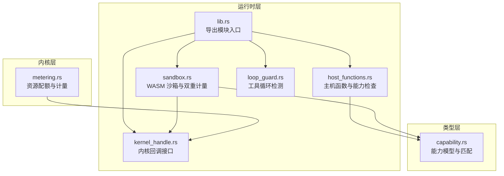
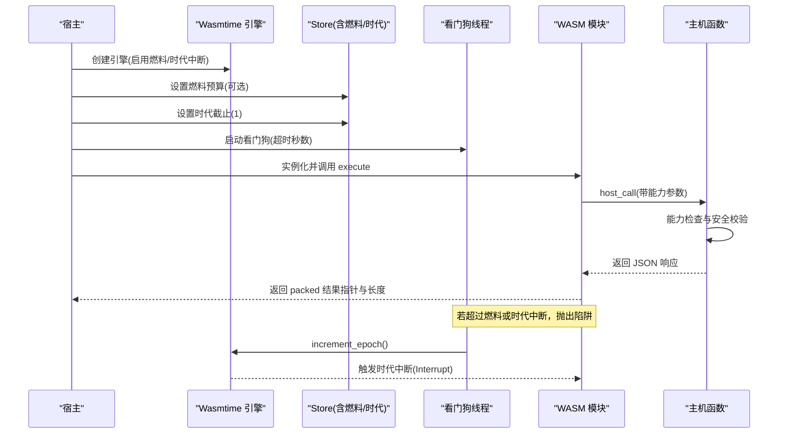
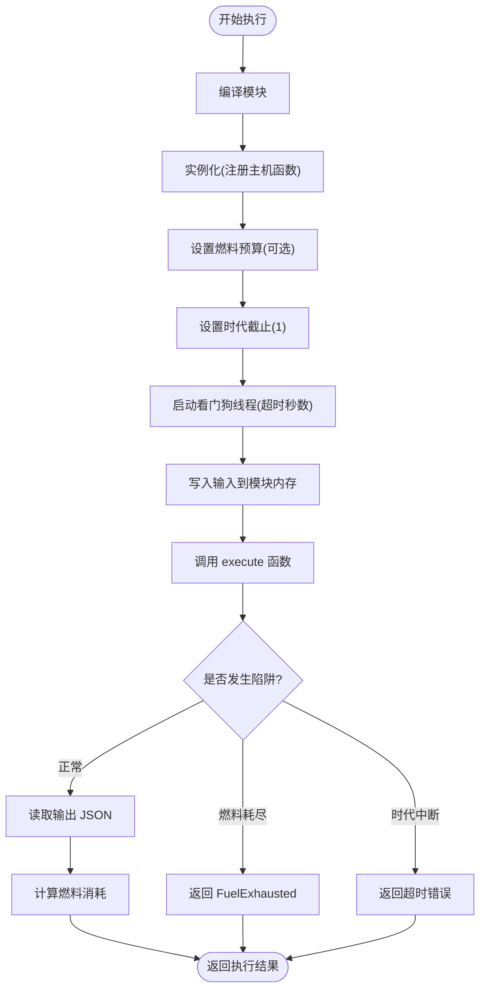
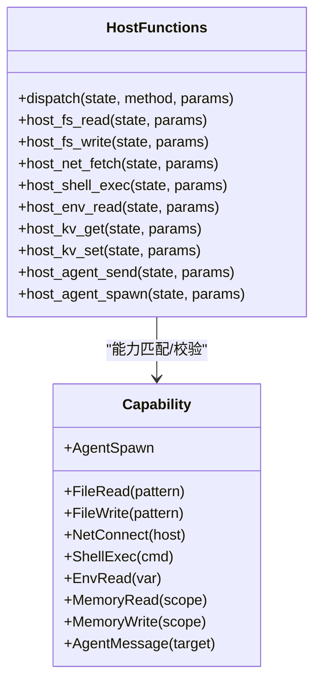
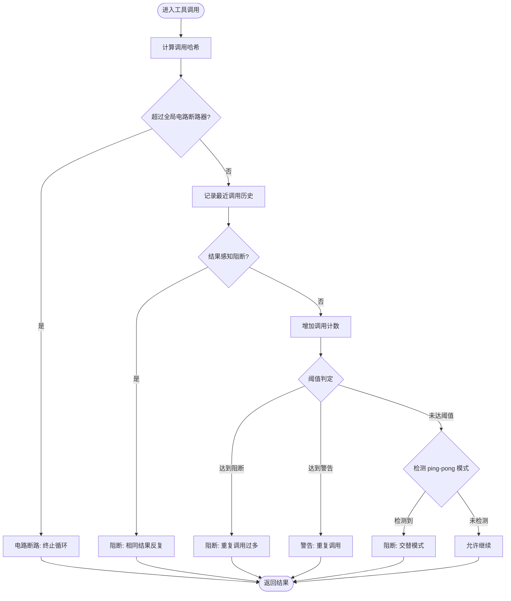
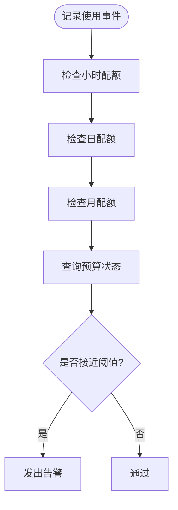
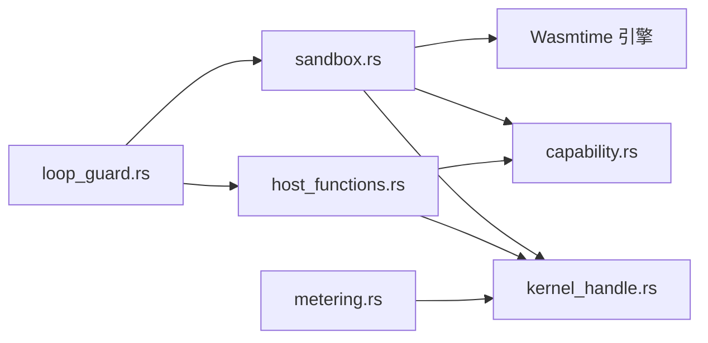

# WASM 双重计量

<cite>
**本文引用的文件**
- [sandbox.rs](file://crates/openfang-runtime/src/sandbox.rs)
- [host_functions.rs](file://crates/openfang-runtime/src/host_functions.rs)
- [capability.rs](file://crates/openfang-types/src/capability.rs)
- [loop_guard.rs](file://crates/openfang-runtime/src/loop_guard.rs)
- [metering.rs](file://crates/openfang-kernel/src/metering.rs)
- [kernel_handle.rs](file://crates/openfang-runtime/src/kernel_handle.rs)
- [lib.rs](file://crates/openfang-runtime/src/lib.rs)
- [security.rs](file://crates/openfang-cli/src/tui/screens/security.rs)
</cite>

## 目录
1. [简介](#简介)
2. [项目结构](#项目结构)
3. [核心组件](#核心组件)
4. [架构总览](#架构总览)
5. [详细组件分析](#详细组件分析)
6. [依赖关系分析](#依赖关系分析)
7. [性能考虑](#性能考虑)
8. [故障排除指南](#故障排除指南)
9. [结论](#结论)
10. [附录](#附录)

## 简介
本文件面向 WASM 双重计量的安全文档，系统阐述 OpenFang 在运行未信任 WASM 模块时采用的双重防护机制：基于 Wasmtime 的燃料计量（指令计数）与时代中断（看门狗线程的墙钟超时）。该机制旨在同时抵御 CPU 绑定与时间绑定的失控模块，确保宿主系统的稳定性与安全性。文档还涵盖技术原理、配置方法、安全执行策略与性能监控实践，帮助开发者在生产环境中正确部署与运维。

## 项目结构
OpenFang 将 WASM 执行、能力控制与循环检测等能力集中在运行时子系统中，通过清晰的模块边界实现高内聚低耦合：
- 运行时层（openfang-runtime）：提供 WASM 沙箱、主机函数、循环检测、工具运行器等
- 类型层（openfang-types）：定义能力模型、错误类型等
- 内核层（openfang-kernel）：提供资源配额与计量引擎

图表来源
- [lib.rs:10-59](file://crates/openfang-runtime/src/lib.rs#L10-L59)
- [sandbox.rs:1-608](file://crates/openfang-runtime/src/sandbox.rs#L1-L608)
- [host_functions.rs:1-669](file://crates/openfang-runtime/src/host_functions.rs#L1-L669)
- [capability.rs:1-317](file://crates/openfang-types/src/capability.rs#L1-L317)
- [loop_guard.rs:1-950](file://crates/openfang-runtime/src/loop_guard.rs#L1-L950)
- [kernel_handle.rs:1-256](file://crates/openfang-runtime/src/kernel_handle.rs#L1-L256)
- [metering.rs:1-807](file://crates/openfang-kernel/src/metering.rs#L1-L807)

章节来源
- [lib.rs:10-59](file://crates/openfang-runtime/src/lib.rs#L10-L59)

## 核心组件
- WASM 沙箱与双重计量：负责编译、实例化、执行 WASM 模块，并启用燃料计量与时代中断
- 主机函数与能力检查：在 WASM 内部调用宿主能力前进行细粒度权限校验
- 循环检测：在单次代理循环内检测工具调用的异常模式，避免死循环或无效轮询
- 资源配额与计量：对 LLM 使用成本进行全局与按小时/日/月限额控制

章节来源
- [sandbox.rs:33-56](file://crates/openfang-runtime/src/sandbox.rs#L33-L56)
- [host_functions.rs:16-49](file://crates/openfang-runtime/src/host_functions.rs#L16-L49)
- [loop_guard.rs:35-69](file://crates/openfang-runtime/src/loop_guard.rs#L35-L69)
- [metering.rs:8-23](file://crates/openfang-kernel/src/metering.rs#L8-L23)

## 架构总览
下图展示了双重计量在 WASM 执行中的工作流程：宿主创建沙箱引擎，设置燃料预算与时代截止；在独立阻塞线程中执行模块；同时启动看门狗线程在指定秒数后触发时代中断；模块内部通过主机函数调用受控能力；执行结束返回结果并统计燃料消耗。

图表来源
- [sandbox.rs:102-184](file://crates/openfang-runtime/src/sandbox.rs#L102-L184)
- [sandbox.rs:231-247](file://crates/openfang-runtime/src/sandbox.rs#L231-L247)
- [host_functions.rs:16-49](file://crates/openfang-runtime/src/host_functions.rs#L16-L49)

## 详细组件分析

### WASM 沙箱与双重计量
- 引擎配置：启用燃料计量与时代中断，确保指令级与时间级双重约束
- 执行流程：在阻塞线程中执行，避免占用 Tokio 执行器；写入输入到模块内存；调用模块入口；解析输出；统计燃料消耗
- 错误处理：区分燃料耗尽与时代中断两类陷阱，分别映射为特定错误类型
- 配置项：
  - fuel_limit：CPU 指令预算（0 表示不限制）
  - timeout_secs：时代中断超时秒数（默认 30 秒）
  - capabilities：授予的能力列表
  - max_memory_bytes：预留的内存限制（未来增强）

图表来源
- [sandbox.rs:145-275](file://crates/openfang-runtime/src/sandbox.rs#L145-L275)

章节来源
- [sandbox.rs:33-56](file://crates/openfang-runtime/src/sandbox.rs#L33-L56)
- [sandbox.rs:102-184](file://crates/openfang-runtime/src/sandbox.rs#L102-L184)
- [sandbox.rs:231-275](file://crates/openfang-runtime/src/sandbox.rs#L231-L275)

### 主机函数与能力检查
- 调用路径：WASM 通过 `host_call` 请求宿主能力，宿主根据方法名分派到具体处理器
- 能力模型：每种能力以枚举形式存在，支持精确匹配、通配符与范围约束
- 安全校验：
  - 文件系统：路径规范化与禁止穿越，写入时仅允许父目录存在
  - 网络请求：仅允许 http/https，阻止私有/元数据地址解析
  - 子进程：命令直接执行，避免 shell 注入
  - 环境变量：仅允许已授权变量读取
  - 内存 KV：通过内核句柄访问，需具备相应权限
  - 代理交互：发送消息与生成子代理，均需相应能力

图表来源
- [capability.rs:10-72](file://crates/openfang-types/src/capability.rs#L10-L72)
- [host_functions.rs:16-49](file://crates/openfang-runtime/src/host_functions.rs#L16-L49)

章节来源
- [host_functions.rs:16-49](file://crates/openfang-runtime/src/host_functions.rs#L16-L49)
- [capability.rs:100-166](file://crates/openfang-types/src/capability.rs#L100-L166)

### 循环检测（工具循环防护）
- 目标：在单次代理循环内识别重复调用、相同结果反复、A-B-A-B 或 A-B-C-A-B-C 等交替模式
- 策略：
  - 基于哈希的计数阈值（警告/阻断）
  - 结果感知：相同调用+结果组合的重复会更快触发阻断
  - 警告桶：同一调用多次警告后自动升级为阻断
  - 放宽轮询：对预期轮询的工具（如 shell_exec 状态检查）采用倍增阈值
  - 历史窗口：最近 HISTORY_SIZE 次调用用于检测 ping-pong 模式
- 统计快照：暴露总调用次数、唯一调用数、阻断次数、最频繁工具等指标

图表来源
- [loop_guard.rs:141-244](file://crates/openfang-runtime/src/loop_guard.rs#L141-L244)
- [loop_guard.rs:330-444](file://crates/openfang-runtime/src/loop_guard.rs#L330-L444)

章节来源
- [loop_guard.rs:35-69](file://crates/openfang-runtime/src/loop_guard.rs#L35-L69)
- [loop_guard.rs:141-244](file://crates/openfang-runtime/src/loop_guard.rs#L141-L244)

### 资源配额与计量（LLM 成本控制）
- 功能：记录使用事件、检查小时/日/月配额、查询全局预算状态、估算 LLM 成本
- 预算状态：提供小时/日/月花费与上限、百分比、告警阈值、默认令牌限制等
- 适用场景：与 WASM 双重计量互补，从成本维度约束代理行为

图表来源
- [metering.rs:20-100](file://crates/openfang-kernel/src/metering.rs#L20-L100)
- [metering.rs:102-133](file://crates/openfang-kernel/src/metering.rs#L102-L133)

章节来源
- [metering.rs:8-23](file://crates/openfang-kernel/src/metering.rs#L8-L23)
- [metering.rs:20-100](file://crates/openfang-kernel/src/metering.rs#L20-L100)

## 依赖关系分析
- 沙箱依赖 Wasmtime 引擎与能力模型，通过 Store 传递能力与内核句柄
- 主机函数依赖能力匹配算法与安全工具（路径解析、SSRF 检测、环境变量清理）
- 循环检测独立于执行引擎，但与工具运行器协作，提供运行时保护
- 内核回调接口为主机函数提供跨代理操作能力

图表来源
- [sandbox.rs:26-31](file://crates/openfang-runtime/src/sandbox.rs#L26-L31)
- [host_functions.rs:9-14](file://crates/openfang-runtime/src/host_functions.rs#L9-L14)
- [capability.rs:7-14](file://crates/openfang-types/src/capability.rs#L7-L14)
- [kernel_handle.rs:25-26](file://crates/openfang-runtime/src/kernel_handle.rs#L25-L26)

章节来源
- [sandbox.rs:26-31](file://crates/openfang-runtime/src/sandbox.rs#L26-L31)
- [host_functions.rs:9-14](file://crates/openfang-runtime/src/host_functions.rs#L9-L14)

## 性能考虑
- 燃料计量（指令计数）：提供确定性 CPU 限制，适合 CPU 密集型模块；建议根据模块复杂度调整预算
- 时代中断（墙钟超时）：提供时间维度保护，适合时间绑定或长时间等待的模块；建议结合看门狗线程合理设置超时
- 内存与栈：模块内存由线性内存管理，建议限制最大内存以减少碎片与越界风险
- 并发与阻塞：WASM 执行在阻塞线程中进行，避免占用异步执行器；主机函数中网络与子进程调用应使用异步客户端
- 监控与日志：记录燃料消耗与执行时间，便于优化与审计

## 故障排除指南
- 燃料耗尽（FuelExhausted）：模块陷入无限循环或过度计算。建议：
  - 提升 fuel_limit 或优化模块逻辑
  - 使用循环检测功能定位问题工具
- 时代中断（超时）：模块长时间阻塞或等待外部资源。建议：
  - 适当提高 timeout_secs
  - 检查网络请求与外部服务可用性
  - 对轮询类工具使用背压与指数退避
- 能力拒绝：主机函数返回“能力被拒绝”。建议：
  - 在沙箱配置中授予所需能力
  - 使用通配符或范围匹配简化授权
- 路径遍历与 SSRF：相关安全检查失败。建议：
  - 使用安全路径解析与只读访问
  - 严格限制网络目标与协议

章节来源
- [sandbox.rs:231-247](file://crates/openfang-runtime/src/sandbox.rs#L231-L247)
- [host_functions.rs:55-67](file://crates/openfang-runtime/src/host_functions.rs#L55-L67)
- [host_functions.rs:73-117](file://crates/openfang-runtime/src/host_functions.rs#L73-L117)
- [host_functions.rs:123-160](file://crates/openfang-runtime/src/host_functions.rs#L123-L160)

## 结论
OpenFang 的 WASM 双重计量通过“燃料计量 + 时代中断”的组合，有效覆盖了 CPU 绑定与时间绑定两大类失控风险。配合能力驱动的安全模型、路径与 SSRF 保护、以及循环检测与资源配额，形成了从指令级、时间级到行为级的多维安全防线。建议在生产环境中：
- 为不同模块设定合理的 fuel_limit 与 timeout_secs
- 明确授予最小必要的能力集合
- 使用循环检测与背压策略应对轮询
- 结合资源配额与预算状态进行成本控制与预警

## 附录

### 技术原理与配置要点
- 燃料计量（Fuel）：Wasmtime 在每次执行指令时消耗燃料，当燃料耗尽时抛出 OutOfFuel 陷阱，沙箱捕获后返回 FuelExhausted
- 时代中断（Epoch Interruption）：设置 epoch_deadline=1 后，看门狗线程在超时后调用 increment_epoch，触发 Interrupt 陷阱
- 配置项：
  - fuel_limit：CPU 指令预算（0 表示不限制）
  - timeout_secs：时代中断超时秒数（默认 30 秒）
  - capabilities：能力列表（精确/通配符/范围）
  - max_memory_bytes：线性内存上限（预留）

章节来源
- [sandbox.rs:102-108](file://crates/openfang-runtime/src/sandbox.rs#L102-L108)
- [sandbox.rs:170-184](file://crates/openfang-runtime/src/sandbox.rs#L170-L184)
- [sandbox.rs:33-56](file://crates/openfang-runtime/src/sandbox.rs#L33-L56)

### 安全特性清单（来自 TUI 屏幕）
- 路径遍历防护：safe_resolve_path 阻止 ../ 攻击
- SSRF 保护：阻止私有 IP 与元数据端点
- 子进程隔离：清理环境变量并选择性注入
- WASM 双重计量：燃料 + 时代中断 + 看门狗线程
- 能力继承：validate_capability_inheritance 防止权限提升

章节来源
- [security.rs:40-75](file://crates/openfang-cli/src/tui/screens/security.rs#L40-L75)